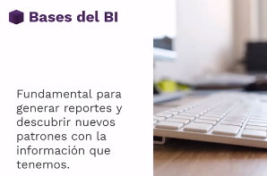

# Business Intelligence: Utilidad y Áreas de Oportunidad

# INTRODUCCION

Cuando hablamos de inteligencia de negocio nos referimos a utilizar la información que existe dentro de la organización estructurada y no estructurada con la utilidad de colaborar en la toma de decisiones. 

BI ⇒ Análisis descriptivo del presente. ¿Qué paso durante este tiempo y que esta pasando actualmente?

DS⇒ Nos van a hablar de predicciones para saber a donde queremos ir. 

Existen tres grandes etapas dentro del trabajo : Preparación, descubrimiento y presentación de la información.  A la hora de hablar sobre la preparación es necesario tener en cuenta los  ETL (Extract, Transform y Load the information) 

**Exploración:** Indagación, ¿Qué sucede con la data?
**Descubrimiento:** ¿Cuál es mi mejor producto? ¿Cuál el peor? ¿Cuál es el mejor usuario?
**Reporting:** 

1. VISUALIZACION DE DATOS: La manera en que presentamos la información. 
2. STORY TELLING: ¿Cómo vamos a narrar los eventos?
3. RECOMENDACIONES ⇒ Etapa fundamental sobre lo que encontramos para la toma de decisiones. 

# Fundamentos

## 2. StakeHolders

En español son las personas de interés. Son todos aquellos grupos o personas que rodean a la empresa (o se involucran dentro de su circuito comercial u operativo) manteniendo alguna relación o interés en la organización. 

> **🚄 Dentro del rol del analista de BI es fundamental no perder de vista el interés de los StackeHolders.**

Ejemplos:

1. Accionistas: Buscan maximizar el retorno de la inversión. 
2. Clientes: Calidad de productos, servicios y necesidades. 
3. Empleados: Seguridad y Estabilidad. Crecimiento profesional. 
4. Proveedores: Relación de estabilidad e ingresos. 

***Es necesario priorizar los SH dependiendo cada organización. En caso de las empresas tradicionales: 1. Accionistas, 2. Clientes, 3. Empleados. En el caso de las Startup: 1. Clientes, 2. Empleados y 3. Accionistas.*** 

## 3. Tipo de empresa: venta de producto o servicios.

¿Cómo diferenciar una empresa de servicios de una empresa de bienes? Principalmente, el "Costo" mas significativo en una empresa que comercializa bienes es el CMV. En el caso de las operaciones realizadas en empresas de prestación de servicios, cuenta con gastos operativos significativos que abarcan nomina, honorarios y prestadores. 

Estado de resultados

- **Utilidad bruta** = Ingresos - Costos de venta
- **Utilidad operativa** = Utilidad bruta - Gastos de administración
- **Utilidad Neta** = Utilidad operativa - Otros gastos e ingresos - Impuestos
- **Otros ingresos**: no tiene relación con la producción, puede ser intereses de inversiones realizadas
- **Otros egresos**: algo esporádico, puede ser una demanda perdida

## 4. Income statement simplificado: utilidad bruta, operativa y neta

**Income statement:** cómo entender las utilidades en nuestro EDR simplificadoSiempre es recomendado ir de lo particular a lo general; tomar una actividad y llevarla al income statement.

- Utilidad bruta: si es negativa, debería cerrar la empresa o arreglarlo inmediatamente. No puedo solventar mis gastos operativos.
- Utilidad operativa: su relación con la utilidad bruta nos permite descubrir gastos excesivos y recortarlos

.¿Cómo afecta cada actividad al income statement? - **Ejemplos**:

- Costo en materia prima. A mayor cantidad de ventas, mayor costo. Si el costo aumenta, se reduce nuestra utilidad bruta.
- Incremento en nómina
- Cambio de oficinas
- Incremento en marketing budget
- Cambio en el precio de producto o servicio

## 5. Ingreso, utilidad y costos

Utilidad vs. ingresos

- Un ingreso (revenue) es todo aquello a lo que no se le ha sustraido los gastos. Las ventas es un ingreso bruto ya que no son considerados los gastos asociados. Ejemplo CMV.
- Mayor ingreso no implica mayor utilidad (ej: descuentos otorgados; ingresos aumentan en 100% pero costos en 150%.)
- Mayor costo no siempre implica menor utilidad (ej: gasto de marketing)

Costos

- **Costo fijo:** ocurren de manera periódica, como la renta de la oficina
- **Costo variable:** están relacionados a una actividad, en donde a mayor actividad, mayor costo; como con las ventas y los COGS
- **Costo semivariable:** es fijo hasta cierto punto y luego variable, como la electricidad

## 6. Margen de contribución.

La diferencia entre el precio de venta de los producto y los costos asociados al mismo. 

Nos ayuda a encontrar o entender nuestro punto de equilibro o "Break Even Point". Es el momento en que no tenemos ni ganancias, ni perdidas. 

## 7. Razones Matemáticas.

Razones matemáticas

- La relación entre dos distintas magnitudes o dos distintos valores. ¿Cuánto de un objeto existe por cada otro objeto (%)?
- Se expresa generalmente en porcentajes
- Responde a ¿cuánto de una magnitud hay en otra?
- Sirven para comparar rendimientos de manera sencilla

Ejemplos

- Utilidad / Ingresos: conocer rendimiento respecto a otros productos, empresas, industrias
- Margen de contribución / Precio: conocer cuál producto conviene vender más
- Ventas producto A / Ventas totales: en qué medida el producto **A** impacta en las ventas

# Business Intelligence

## 9. Extracción de datos y ejemplos de archivos.

Como analistas, es necesario tener cuidado y cautela sobre los lugares donde tomamos los datos ya que estos abundan. Existen fuentes digitales y análogas (o no digitales). 

Silos de Información ⇒ La información de un departamento no se encuentra vinculada con la información de otra área o dpto de la org. (Data Silos)

[https://www.hubspot.com/](https://www.hubspot.com/) Es un CRM que permite analizar el proceso de ventas. 

[https://mailchimp.com/es/](https://mailchimp.com/es/) Es un software utilizado para crear base de datos sobre gente que esta interesada en recibir newsletter.

[https://datastudio.google.com/u/0/](https://datastudio.google.com/u/0/) 

Tipos de archivo utilizados: Excel, XLX, CSV, Textos,.

## 10. Limpieza de datos con Excel y Python (Transform process)

La información contiene errores de integridad, de ortografía, no se encuentra estandarizada o es incompleta. Por lo tanto, es necesario trabajar sobre ella para transformar un dato en información relevante. 

- Garbage in & Garbage Out se refiere a que si ingresas contenido basura al analaisis, tendrás como resultado contenido basura.
- Python + librerias como Numby y Pandas.
- Excel

## 11. Exploración de datos con Tableau y PowerBI

¿Por qué hacemos exploración de datos? Es la manera en que nosotros vamos a tratar de comprender los datos que estamos analizando. Intentar de comprender las historias que nos quieren contar y cuales son los descubrimientos que podemos tener pasando tanto tiempo con los mismos. 

- Pueden aparecer preguntas que no habíamos pensado anteriormente. Ejemplo: ¿Por qué hay tantas ventas durante estos X meses? ¿Por qué menos?
- Da lugar a cambios de hipótesis. Tenemos algunas preguntas y respuestas que queremos tener al final de la exploración que fueron definidas al inicio del proceso.
- Siempre debe tomarse el tiempo necesario para entender la información que estamos trabajando.

Programas para la exploración: Tableau y Power Bi. Lenguajes Python o R. 

## 12. Descubrimientos, highlights, top y bottom data

- Iniciar con lo más buscado, lo menos buscado. ¿Cuál es el producto/servicio mas vendido y cual es el menos?
- Se conoce como el top y bottom data.
- Buscar patrones o temporalidad.
- Esforzarse por entender los datos.
1. Aging vs Prioridad: para saber cuando se duraba en responder las urgencias.
2. Volumen vs Analista : Para saber la distribución de trabajo.
3. Categoría vs Volumen: Para conocer que categoría que mas volumen recibía y así distribuir los recursos.

## 13. Reporting

- Pensar en la audiencia. No vamos a presentar el mismo reporte frente a un gerente de ventas que a un gerente de finanzas.
- Pensar en el mensaje, los highlights y transmitirlo hacia la audiencia.
- Pensar en si va a ser estático o dinámico.
- Tomar buenas prácticas visuales. (Tendencias y metodos de proceso de los graficos)
- Tener en cuenta el contexto. (Necesario antes una pauta de entendimiento para la audiencia, priorizar excelencia en Dashboards)
- Concentrar nuestros esfuerzos en un dashboard
- Usar storytelling para entretener la audiencia
- Dejar sugerencias sobre esta información