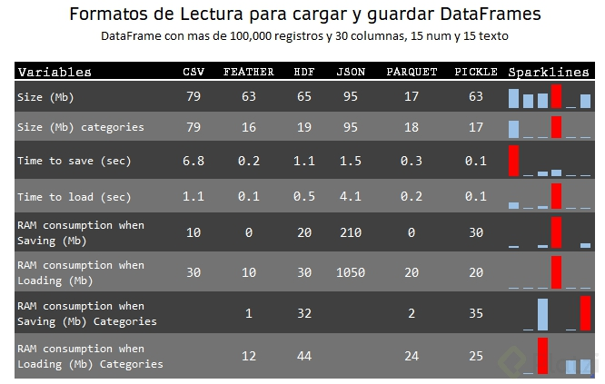

## Formatos de lectura para cargar y guardar DataFrames
CSV y formatos String : Son simples, requieren alto costo computacional y algo lentos.

HDF : Gran soporte, adecuado para grandes cantidades de datos, rápido a costo de alto costo computacional.

Parquet : Puede igualar a hdf e inclusive trabajar por chunks y en paralelo.

Pickle : Es práctico pero lento con grandes cantidades de datos.

## Tipos de Variables que componen un data frame

motor de busqueda de datos https://datasetsearch.research.google.com/

## recuerda
axis 0 significa que hará operaciones a todas las filas de cada columna
axis 1 significa que hara operaciones en todas las columnas de cada fila

## Funciones más complejas y lambdas
Además de apply, también se pueden usar las funciones applymap y map, dependiendo de la necesidad.

apply() se utiliza para aplicar una función a lo largo de un eje (columna o fila).
applymap() se usa para aplicar una función a todos los elementos del DataFrame
map() se usa para sustituir cada valor de una fila por otro valor.