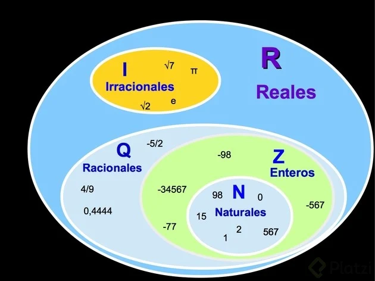
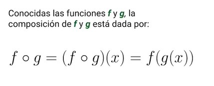
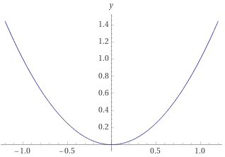

## 1.¿Qué es una función?
Que es una funcion
Es como una maquina … ingresa el elemento x y sale el elemento y
Es una regla que asigna a cada elemento del conjunto A un elemento del conjunto B
Modelan nuestra realidad

Formas de representar una función:
* Verbalmente
Ejemplo: “El precio aumento en 2 dólares por cada kilómetro recorrido”
* Numéricamente
Puede ser con una tabla de valores donde tenemos un valor x y un valor f(x) que le corresponde
* Visualmente
La gráfica en un plano cartesiano, una forma muy común de comprobar si es una función de esta manera, es trazar una línea sobre la función y si pasa a tocar más de 1 punto, entonces no es una función.
* Algebraicamente
Ejemplo: función de la parábola f(x)=x^2

## 2. Tipos de variables
* Variables cualitativas
Variables nominales: Se les asigna una cualidad (rojo, verde, azul, etc. en el caso de un LED)
Variables ordinales: Representan un orden. Por ejemplo, la altura de un objetos se puede clasificar como alto, medio o bajo
Variables binarias: Solo toman 2 valores, usualmente usadas para representar estados. (frío o caliente, uno o cero)

* Variables cuantitativas
Variables discretas: Representan un grupo de datos que son finitos y toman ciertos valores. Pueden verse como variables separadas por un “paso”. Por ejemplo, una persona puede tener 0,1,2,3 amigos pero no 3.5 amigos
Variables continuas: Sus valores pueden verse como infinitos al tomar cualquier valor dentro de los números reales en un rango establecido. Por ejemplo, la altura de una persona
Lo que se suele modelar para escribir funciones, se suele encontrar en el grupo de variables cuantitativas.

## 3. Dominio y rango de una función
* Dominio de una función
Son los valores que toma x y que están definidos en la función f(x)

* Rango de una función
Son los valores que puede regresar una función.

el rango es tambien llamado codominio o imagen

## 4. Cómo leer las matemáticas: Conjuntos

Los diagramas de Venn son otra forma de representar un conjunto de manera gráfica. Los diagramas nos permiten comprender y analizar fácilmente los conjuntos.

* Al conjunto que no contiene elementos se le llama conjunto vació y se denota con el símbolo ϕ
observación: El conjunto que tenga solo el elemento 0 o el ϕ es no vacío.

* La unión de dos conjuntos A y B es el conjunto formado por todos los elementos de ambos conjuntos sin repetir ninguno y se representa así: $A ∪ B = {x | x ∈ A ó x ∈ B}$

* La intersección de dos conjuntos A y B son el conjunto de elementos que forman parte tanto de A como de B, es decir: $A ∩ B = {x | x ∈ A y x ∈ B}$

* La diferencia de dos conjuntos A y B, es un conjunto formado por todos los elementos de A que no están en B y se escribe así: $A\B = A - B = {x ∈ A | x ∉ B}$

* Dados dos conjuntos, el conjunto universal Ω que es el conjunto que incluye a todos los elementos y un conjunto A subconjunto de Ω. El complemento de A son todos aquellos elementos del conjunto universal que no pertenecen a A, es decir: $A’ = {x ∈ Ω | x ∉ A}$

* Según su número de elementos, los conjuntos se pueden clasificar como finitos o infinitos.
La cardinalidad de un conjunto A es la cantidad de elementos diferentes que tiene y se representa con |A|
Un conjunto es finito si se conoce su cardinalidad (podemos contar sus elementos) e infinito si se desconoce su cardinalidad (no podemos contar sus elementos).

## 5. Funciones algebraicas lineales

Una función lineal es una función polinómica de primer grado. Es decir, tiene la siguiente forma

$$f(x)=mx + b$$ donde $m$ y $b$  $\in R$. 

$m$ puede ser calculada por: $$m=\frac{y_{2}-y_{1}}{x_{2}-x_{1}}$$

y $b$ es el punto de corte con el eje $y$. Su dominio es $Dom_{f} = (-\infty, \infty)$. Su imagen es $Im_{f} = (-\infty, \infty)$

m es la pendiente de la función
n es la ordenada (en el origen) de la función
Para complementar, m se le conoce como pendiente de la recta y puede puede deducir la siguente ecuación:

~~~Latex
m = tan θ
~~~

Donde θ es el angulo formado con el eje x

## 6. Funciones algebraicas polinómicas

Tiene la forma de $$P(x)=a_{n}x^{n} + a_{n-1}x^{n-1}+...+a_{2}x^{2}+a_{1}x + a_{1}$$

a una función que tiene esta forma se le llama polinomio de grado $n$. A los elementos $a$ los llamaremos coeficientes donde $a \in R$. 

**Por ejemplo:**

$$P(x)= 2x^{7} - x^{4} + 3x^{2} + 4$$

que es un polinomio de grado 7.

#### Funciones potencia

Hay unas funciones que son un caso particular de las funciones polinómicas que son las funciones potencia, las cuales tienen la forma:

$$f(x)= x^{a}, a \in R$$ 

**Por ejemplo:**

$$f(x)= x^{2}$$

El dominio de $f(x)=x^{2}$ es $Dom_{f} = (-\infty, \infty)$. Su imagen es $Im_{f} = [0, \infty)$

polinomios pares existe se abre como una u, y si es impar es como una s

## 7. Funciones trascendentes

Son funciones que no pueden ser expresadas con polinomios. 

#### Funciones trigonométricas

Algunos ejemplos son las funciones $cos(x)$, $sen(x)$ y $tan(x)$
#### Función exponencial

Tienen la forma de $$f(x)=a^x$$ donde la base $a$ es una constante positiva. Un gran ejemplo de una función exponencial es usando la base como el número de euler:

$$f(x)=e^x$$

#### Función logaritmo

El logaritmo está definido por la **relación**:

$$log_{b}(x) = n \Longleftrightarrow x=b^n$$ 

donde: 

*   $b$ es la base.
*   $n$ es el exponente al que está elevado la base.
*   $x$ es el resultado de elevar la base $b$ al exponente $n$

**Ejemplo:**

Teniendo b=2 y n=8, entonces:

$$2^8=256$$

Por lo que $x=256$. Calculando el logaritmo base 2 de $x$ es:

$$log_{2}(256) = 8$$

## 8. Función seccionada

funcion escalon de heavyside  
Son funciones que tienen diferentes valores definidos por un intervalo. Por ejemplo la función escalón de Heaviside: 

$$H(x) = 
     \begin{cases}
        0, &\quad \text{para, } x < 0 \\
        1,  &\quad\text{para. } x \ge 0 \\
     \end{cases}
$$

## 9. Funciones compuestas

## 10. ¿Cómo manipular funciones?

#### Desplazamientos verticales y horizontales

Siendo $c$ una constante mayor que cero, entonces la gráfica:

- $y=f(x)+c$ se desplaza $c$ unidades hacia arriba.
- $y=f(x)-c$ se desplaza $c$ unidades hacia abajo.
- $y=f(x-c)$ se desplaza $c$ unidades hacia la derecha.
- $y=f(x+c)$ se desplaza $c$ unidades hacia la izquierda.

#### Alargamientos y compresiones

Siendo $c$ una constante mayor que cero, entonces la gráfica:

- $y=c \cdot f(x)$ alarga la gráfica verticalmente en un factor de $c$.
- $y= \frac{1}{c} \cdot f(x)$ comprime la gráfica verticalmente en un factor de $c$.
- $y=f(c \cdot x)$ comprime la gráfica horizontelmente en un factor de $c$.
- $y= f(\frac{1}{c} \cdot x )$ alarga la gráfica horizontelmente en un factor de $c$.

#### Reflexiones

- $y=-f(x)$ refleja la gráfica respecto al eje x.
- $y=f(-x)$ refleja la gráfica respecto al eje y.

## Características de las funciones

Una vez que ya tenemos claro cuáles son las funciones reales y por qué se les llama así, pasemos a describir algunas de sus características.

#### Función par
Una función es par si cumple la siguiente relación a lo largo de su dominio:

$f(-x) = f(x)$

Si lo notaste, esta relación nos dice que una función es par si es simétrica al eje vertical (eje Y). Por ejemplo, una parábola es una función es par.

#### Función impar
Una función es impar si cumple la siguiente relación a lo largo de su dominio:

$f(-x) = -f(x)$

Esta relación nos indica que una función es impar si es simétrica al eje horizontal (eje X). Por ejemplo, una función cúbica es impar.

Las dos características o propiedades anteriores están muy relacionadas con la simetría. Puedes comprobarlas tú mismo con diferentes funciones e incluso hacer una pequeña rutina en Python que compruebe si una función es par o impar.

#### Función acotada
Una función es acotada si su codominio (también conocido como rango o imagen) se encuentra entre dos valores, es decir, está acotado. Esta definición se define como que hay un número m que para todo valor del dominio de la función se cumple que:

$-m \leq f(x) \leq m$

Por ejemplo, la función seno o coseno están acotadas en el intervalo [-1, 1] dentro de su co-dominio.

#### Funciones monótonas
Estas funciones son útiles de reconocer o analizar debido a que nos permiten saber si una función crece o decrece en alguno de sus intervalos. Que algo sea monótono significa que no tiene variaciones. Entonces las funciones monótonas son aquellas que dentro de un intervalo I, perteneciente a los números reales, cumple alguna de estas propiedades:

1. La función es monótona y estrictamente creciente:
   
$$si\ para\ todo\ x_{1}, x_{2}\ \epsilon\ I:x_{1} <  x_{2} \Leftrightarrow f(x_{1}) < f(x_{2})$$

No te preocupes si es un poco difícil de leer esta definición que para eso estoy aquí para explicarte. La forma correcta de leer esto es “si para todo x1 y x2 que pertenecen al intervalo I, tal que x1 sea menor a x2, si y solo si f(x1) sea menor a f(x2)”. En palabras mucho más sencillas, lo que nos dice esta definición es que x1 siempre tiene que ser menor que x2 en nuestro intervalo I, y que al evaluar x2 en la función el resultado de esto siempre será mayor que si evaluamos la función en x1. Para las siguientes tres definiciones restantes no cambia mucho la forma en la que se interpretan.

2. La función es monótona y estrictamente decreciente:
$$si\ para\ todo\ x_{1}, x_{2}\ \epsilon\ I:x_{1} <  x_{2} \Leftrightarrow f(x_{1}) > f(x_{2})$$
3. La función es monótona y creciente:
$$si\ para\ todo\ x_{1}, x_{2}\ \epsilon\ I:x_{1} <  x_{2} \Leftrightarrow f(x_{1}) \leq f(x_{2})$$
4. La función es monótona y decreciente:
$$si\ para\ todo\ x_{1}, x_{2}\ \epsilon\ I:x_{1} <  x_{2} \Leftrightarrow f(x_{1}) \geq f(x_{2})$$

#### Funciones periódicas
Las funciones periódicas son aquellas que se repiten cada cierto periodo, este periodo se denomina con la letra T. La relación que debe cumplir la función para ser periódica es la siguiente.

$$f(x) = f(x+T), T \neq 0$$

Por ejemplo, la función seno y coseno son funciones periódicas con un periodo T = 2π. Es decir que si nosotros calculamos f(x) y calculamos f(x + 2π) en la función seno el valor que nos den ambas expresiones es el mismo.

#### Funciones cóncavas y convexas
La forma de demostrar la concavidad de una función se puede hacer a través del análisis de derivadas consecutivas, pero aún no llegamos a eso, así que no te preocupes. A continuación, te dejo una forma súper intuitiva de ver si una función es cóncava o convexa.

Se dice que una función dentro de un intervalo **es convexa** si la función “abre hacia arriba”. Es decir si se ve la siguiente manera:

Ahora, ¿qué sería una función cóncava? Pues así es, lo contrario de una convexa. Se dice que una función dentro de un intervalo es concava si la función “abre hacia abajo”. Es decir si se ve la siguiente manera:

Como ves, identificar si una función es cóncava o convexa a través de su gráfica es muy sencillo. Pero si quieres enfrentar un reto, te dejo que cuando sepas que es una derivada regreses a esta clase y busques la forma de comprobar si una función es cóncava o convexa de forma analítica. Como pista, se hace a través del análisis de la segunda derivada

#### saber si es concava o convexa con la segunda derivada
Si tenemos una función f(x) y podemos sacarle segunda derivada, si se cumple:

f(x0)’’ > 0, la función f(x) es convexa en el punto (x0,f(x0))

f(x0)’’ < 0, la función f(x) es concava en el punto (x0, f(x0))

## Conoce al perceptrón

* Señales de entrada: se asemejan a lo que en la vida real son los impulsos eléctricos. En la práctica representa características de lo que estamos modelando.

* Pesos sinápticos: define la importancia de las señales de entrada mediante la asignación de una ponderación.

* Unión sumadora: suma los resultados de las multiplicaciones entre las señales de entrada y los pesos sinópticos. Es una combinación lineal.

* Función de activación: recibe la combinación lineal anterior para definir la salida de la neurona.
  

## Funciones de activación
¿Para qué se utilizan las funciones?

* Función lineal: mantener valores a lo largo de un proceso, predecir venta

* Función escalón o de Heaviside: clasificaciones categóricas, ej. binarias

* Función sigmoide: regresión logística, para probabilidades

* Función tangente hiperbólica: para escalamiento

* Función ReLU: simulación de “neuronas muertas”

## ¿Cómo se calcula un error?

el error se calcula respecto a la linea que generan los datos y se realiza una diferencia.

ECM: Error cuadratico medio 
