# Estadística descriptiva para analítica

## 1. Estadística descriptiva vs. inferencial

Estadística descriptiva vs. inferencial
Es importante entender la diferencia entre las dos principales ramas de la estadística en el area de las matemáticas:

Estadística descriptiva: Se trata de resumir información de manera cuantitativa para entender de forma sencilla y concreta sobre algún determinado asunto
Estadística inferencia: Se basa en realizar inferencias, deducir que podría pasar en el futuro en base a lo datos que tenemos acceso en la actualidad
¿Puede mentir la estadística?

La estadística descriptiva tiene un problema al momento de definir que métrica es la que nos va a brindar la mayor relevancia para nuestro estudio.

El resultado podría estar sesgado a nuestro criterio personal, mostrando mayor interés a un cierto parámetro. dejando de lado a otro que también podría ser relevante. Mostramos solo una cara de la moneda.
No existen definiciones objetivas en estadística, sin embargo sobre estas definiciones podemos realizar cálculos exactos lo cual es un problema
Los diferentes estadísticos descriptivos dan nociones diferentes sobre los mismos datos.
¿Por que aprender estadística?

A pesar de los problemas que pueda presentar es muy importante entender que la estadística nos puede ayudar a:

Resumir grandes cantidades de información
tomar mejores decisiones
responder preguntas con relevancia social
reconocer patrones en los datos
descubrir a quien usan estas herramientas con fines nefastos

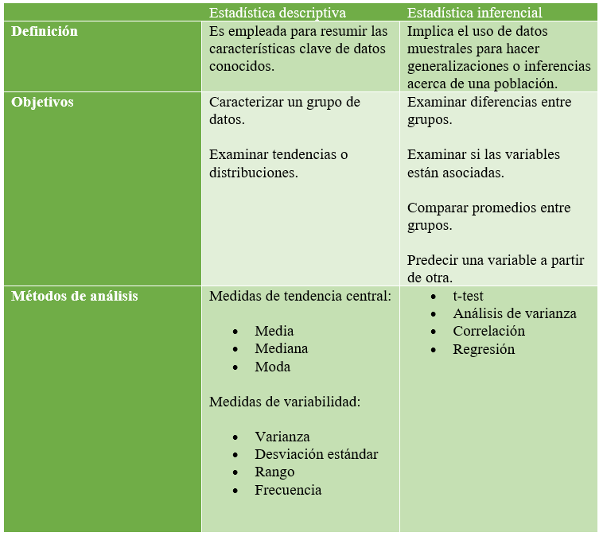

## 2. Flujo de trabajo en data science

Puede existir profesiones que se enfoquen mas a cada una de fases, no existe un perfil de data science que se encargue a todo el flujo de trabajo.

¿En que partes del flujo de trabajo se necesita de estadística?

Todos las partes del flujo requiere del conocimiento en ciertas ramas de la estadística. La estadística descriptiva se va a emplear más en los dos primeros bloques de trabajo.

Ingesta de datos y Validación : Se encarga de todo el procesamiento de ETL (Extract Transform Load) obtener los datos, limpiarlos y estructurarlos, crear pipelines de análisis automatizado, es decir que transformaciones vamos a realizar a los datos para que estén listos para el caso especifico de estudio que vamos a realizar.

Preparación y entrenamiento del modelo: En este bloque se va a realizar un análisis exploratorio de los datos con estadística descriptiva, entender correlaciones y realizar posibles reducciones de datos.

Evaluar el modelo, Producción e Interacción: esta parte del flujo se basa mas en la estadística inferencial.

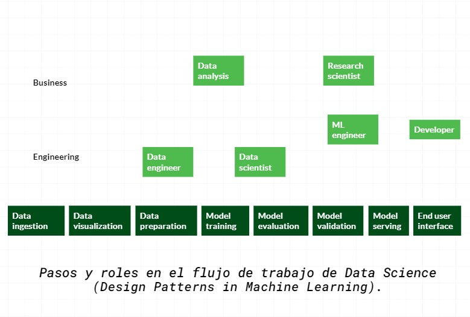

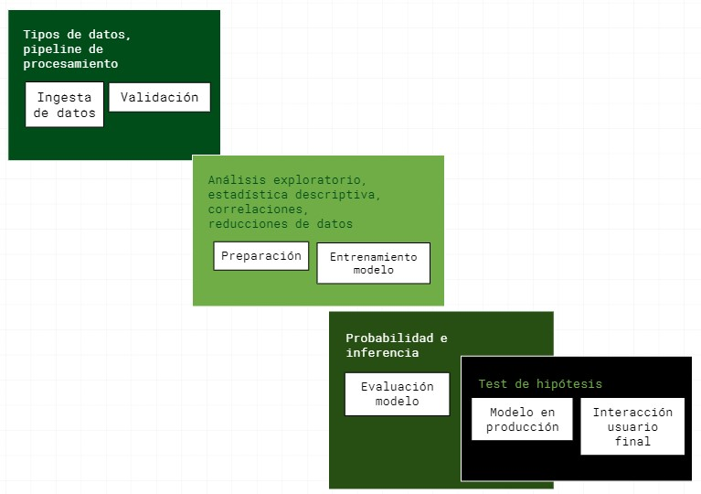

**El flujo de trabajo en Data Science tiene 8 pasos:**

1. Data ingestion.
2. Data visualization.
3. Data preparation.
4. Model training .
5. Model evaluation.
6. Model validation.
7. Model serving.
8. En user interface.

No existe un solo perfil de científico de datos que se encargada de todo el flujo.
Los roles son:

* Ingeniero de datos
* Analista de datos
* Científico de datos genérico
* Ingeniero de Machine Learning
* Científico investigador

Todos los roles necesitan saber estadística en las fases que les corresponde desarrollar en el flujo.
 del curso
¿Cuál es diferenciador de este curso?
Sabemos y tenemos bien claro que la estadística descriptiva es súper común, pero el diferenciador más grande de este curso es que estamos contextualizando la estadística descriptiva específicamente para Ciencia de Datos. No solo vamos a entender las fórmulas matemáticas si no el contexto de la estadística para descubrir todas las caras que tiene.

¿Cuáles serán los puntos específicos que vamos a tratar en este curso?

* **Primera parte del curso:** Vamos a abordar cuales son los elementos de estadística la descriptiva para la ingesta y el procesamiento de los datos.

* **Segunda parte del curso:** Vamos a ver análisis exploratorio de los datos, identificar correlaciones de los datos, abordaremos si a partir de eso podemos reducir el conjunto de datos que necesitamos para un modelo, por ejemplo. Entonces, el objetivo es abordar los estadísticos para exploración y analítica.

## 3. Medidas de tendencia central

Son medidas que nos ayudan a resumir una gran cantidad de información en un solo numero

* **Media:** Es el promedio de todos los datos, puede ser susceptible a valores atípicos
* **Mediana:** es el dato central es decir tiene la misa cantidad de datos a su izquierda y derecha, no es lo mismo que la media
* **Moda:** es el dato que mas se repite, la moda no aplica para datos numéricos continuos

#### 4. Diagrama de frecuencia
Es la representación grafica asociada a la tabla de frecuencia, normalmente todos los estadísticos descriptivos se pueden representar en términos de esta distribución

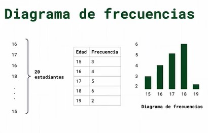

* la media es suceptible a valores atipicos
* la moda no se aplica a datos numericos continuos

## 5. Metáfora de Bill Gates en un bar

**Media aritmética (promedio)**
Dados los n números la media aritmética se define como:

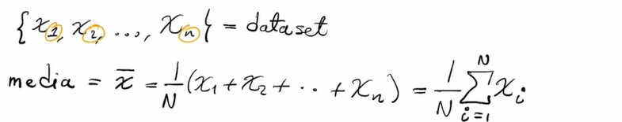

**Mediana**
formulas matematicas de la mediana

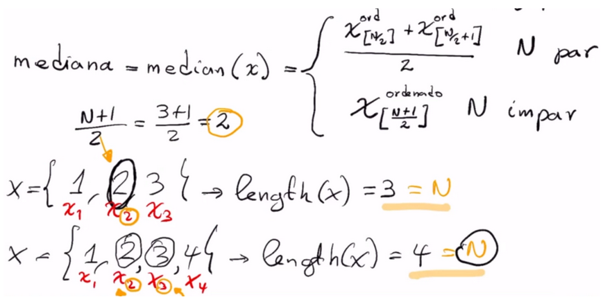

**Resumen de la metafora de BIll Gates:**

* Esta metáfora nos muestra que al tener valores atípicos nuestra media se vera sesgada o desviada.

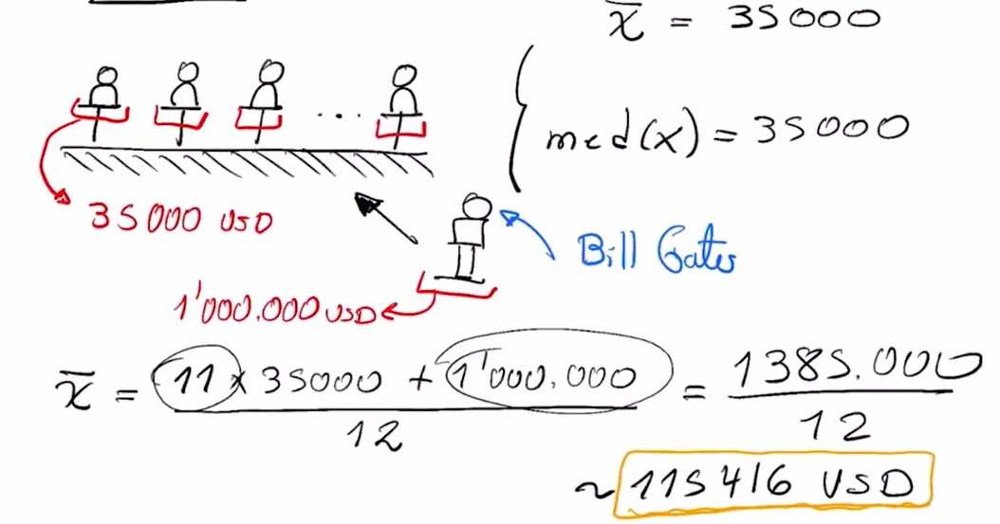

* La mediana será un mejor valor para manejar un conjunto de datos con valores atípicos.

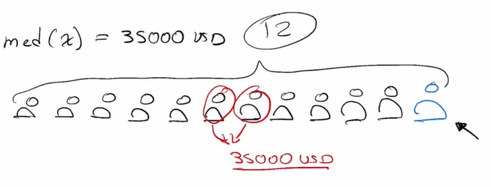

Por esto hablar del ingreso per cápita de un país es equivocado cuando hay una distribución de riqueza desigual.

## 6. Medidas de tendencia central en Python

## Medidas de dispersión
* **Rango:** El Rango es el intervalo entre el valor máximo y el valor mínimo.

* **Cuartiles:** Los cuartiles son valores que dividen una muestra de datos en cuatro partes iguales. en igual numero de datos.
  
**1er cuartil (Q1):** 25% de los datos es menor que o igual a este valor.
**2do cuartil (Q2):** La mediana. 50% de los datos es menor que o igual a este valor.
**3er cuartil (Q3):** 75% de los datos es menor que o igual a este valor.
**Rango intercuartil:** La distancia entre el primer 1er cuartil y el 3er cuartil (Q3-Q1); de esta manera, abarca el 50% central de los datos.

**Diagrama de caja o box plot:** representa gráficamente una serie de datos numéricos a través de sus cuartiles. De esta manera, el diagrama de caja muestra a simple vista la mediana y los cuartiles de los datos. También puede representar los valores atípicos de estos.
muestra un representacion  de la dispersion de los datos en referencia a la mediana.

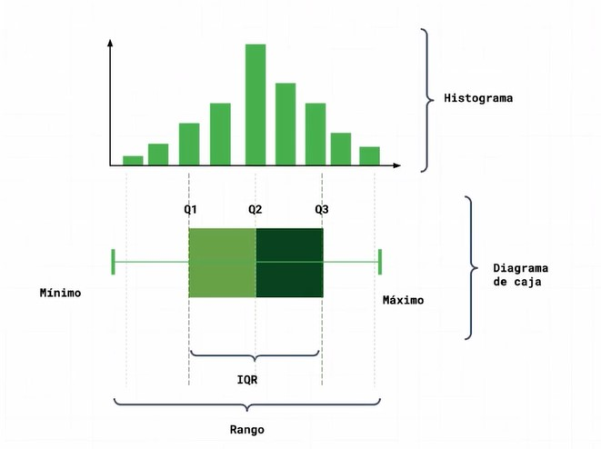

* **Desviacion estandar**

La desviación estándar es la medida de dispersión más común, que indica qué tan dispersos están los datos con respecto a la media. Mientras mayor sea la desviación estándar, mayor será la dispersión de los datos.

El símbolo **σ** **(sigma)** se utiliza frecuentemente para representar la desviación estándar de una población, mientras que **s** se utiliza para representar la desviación estándar de una muestra.
La desviación estándar se puede utilizar para establecer un valor de referencia para estimar la variación general de un proceso.

Solo para aclarar, ya que el termino de varianza se abordo muy rápidamente:

**Varianza:** 
es una medida de dispersión que representa la variabilidad de una serie de datos respecto a su media. Formalmente se calcula como la suma de los residuos al cuadrado divididos entre el total de observaciones. Su fórmula es la siguiente:
X → Variable sobre la que se pretenden calcular la varianza
xi → Observación número i de la variable X. i puede tomará valores entre 1 y n.
N → Número de observaciones.
x̄ → Es la media de la variable X.
La diferencia entre la desviación estándar o típica y la varianza, es que la la desviación típica es la raíz cuadrada de la varianza

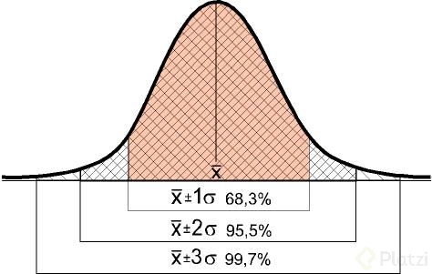

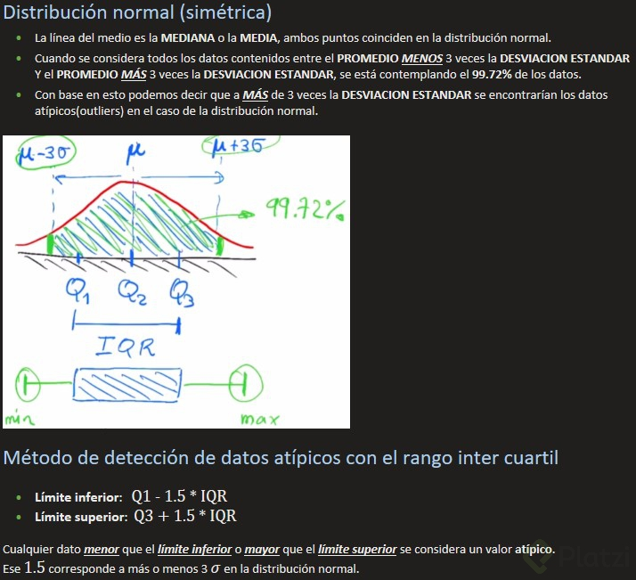

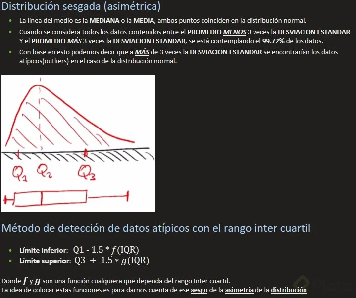

**coeficiente de variación:**

Su cálculo se obtiene de dividir la desviación típica entre el valor absoluto de la media del conjunto y por lo general se expresa en porcentaje para su mejor comprensión.

X → Variable sobre la que se pretenden calcular la varianza
σx → Desviación típica de la variable X.
| x̄ | → Es la media de la variable X en valor absoluto con x̄ ≠ 0
El coeficiente de variación de utiliza para comparar la dispersión (variación) de conjuntos de datos de medidas diferentes o con medias aritméticas diferentes.

## 7. Medidas de dispersión en Python

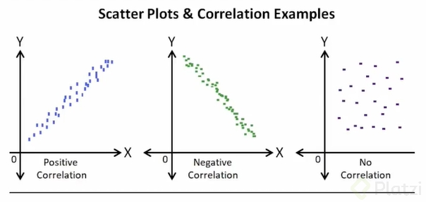

Como vimos en la clase, el hecho de que nuestra distribución tenga una tendencia a la derecha o a izquierda nos representa un problema, ya que no a acorde con una distribución y eso puede afectar a nuestros análisis si no tomamos en cuenta ese sesgo. No siempre hay que confiar en nuestra intuición o lo que vemos a simple vista, hay métodos como:

Primer coeficiente de asimetría de Pearson (asimetría de modo)
Segundo coeficiente de asimetría de Pearson (asimetría mediana)
Coeficiente de Groeneveld y Meeden
Coeficiente de Fisher
Por mencionar algunos.

Y por último, no hay que olvidar la curtosis:
Una curtosis grande implica una mayor concentración de valores de la variable tanto muy cerca de la media de la distribución (pico) como muy lejos de ella (colas), al tiempo que existe una relativamente menor frecuencia de valores intermedios. Esto explica una forma de la distribución de frecuencias/probabilidad con colas más gruesas, con un centro más apuntado y una menor proporción de valores intermedios entre el pico y colas.
Una mayor curtosis no implica una mayor varianza, ni viceversa.

## 8. Exploración visual de los datos

para saber que grafico usar: 
https://datavizproject.com/data-type/profile-map/

# Estadística en la ingesta de datos

## 9. Pipelines de procesamiento para variables numéricas

**1. Escalamiento lineal** (Escalar o normalizar los datos)

Técnica para normalizar los datos usando una escala común en las variables de interés antes de modelar o desarrollar un aprendizaje automático. Transforma el valor de cada dato para un rango determinado. Normalmente [-1,1]

Min-Max: Transforma cada dato (X) a un valor normalizado ($X_s$) usando el valor mínimo y máximo de cada variable
$$ X_s = (2X-min-max)/(max-min) $$

Clipping: Corta la distribución de los datos entre dos valores limite. El valor de cada dato fuera de los limites colapsa al valor del limite mas cercano.

Winzoriding: Usando percentiles específicos de limites.
Z-Score: Se determina usando medidas de tendencia central y de dispersión.

$$ X_s = ( X - Promedio) / Desv. Stand $$

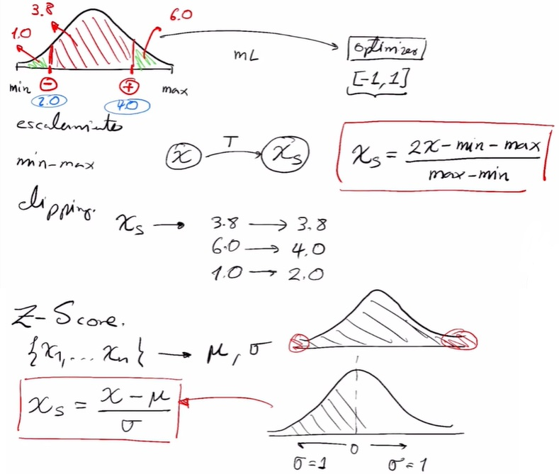

**Normalización**
La normalización es una técnica que a menudo se aplica como parte de la preparación de datos para el aprendizaje automático. El objetivo de la normalización es cambiar los valores de las columnas numéricas en el conjunto de datos para usar una escala común, sin distorsionar las diferencias en los rangos de valores ni perder información. La normalización también es necesaria para que algunos algoritmos modelen los datos correctamente.

Por ejemplo, suponga que su conjunto de datos de entrada contiene una columna con valores que van de 0 a 1 y otra columna con valores que van de 10,000 a 100,000. La gran diferencia en la escala de los números podría causar problemas al intentar combinar los valores como características durante el modelado.

La normalización evita estos problemas al crear nuevos valores que mantienen la distribución general y las proporciones en los datos de origen, mientras mantienen los valores dentro de una escala aplicada en todas las columnas numéricas utilizadas en el modelo.

* **Tenemos varias opciones para transformar datos numéricos:**
* Cambiar todos los valores a una escala de 0 a 1 o transformar los valores representándolos como rangos de percentiles en lugar de valores absolutos.
* Aplicar la normalización a una sola columna o a varias columnas en el mismo conjunto de datos.
* Si necesita repetir el experimento o aplicar los mismos pasos de normalización a otros datos, puede guardar los pasos como una transformación de normalización y aplicarlos a otros conjuntos de datos que tengan el mismo esquema.
* Nota importante: Algunos algoritmos requieren que los datos se normalicen antes de entrenar un modelo. Otros algoritmos realizan su propia normalización o escalado de datos.

Normalización lineal
Algunos de los tipos:

* Zscore (normalizacion z o transformacion de una variable) : convierte todos los valores en una puntuación z. Los valores de la columna se transforman mediante la siguiente fórmula:
z score

$$z = \frac{x - mean(x)}{\sigma (x)}$$
La media y la desviación estándar se calculan para cada columna por separado. Se utiliza la desviación estándar de la población.

* MinMax : el normalizador min-max cambia la escala linealmente cada característica al intervalo [0,1]. El cambio de escala al intervalo [0,1] se realiza cambiando los valores de cada característica para que el valor mínimo sea 0, y luego dividiendo por el nuevo valor máximo (que es la diferencia entre los valores máximo y mínimo originales). Los valores de la columna se transforman mediante la siguiente fórmula:

$$z = \frac{x-min(x)}{[max(x)-min(x)]}$$

**¿Cuándo usar la normalización lineal?**
En datos simétricos o en datos uniformemente distribuidos.

## 10. Transformación no lineal

distribucion gaussiana, es lo mismo decir que tiene una distribución en forma de campana.

**porque usar transformacion no lineal?**
para datos fuertemente sesgados, no simetricos.

tipos(son funciones que se aplican a los datos):

* **Logística:** los valores de la columna se transforman mediante la siguiente fórmula:
$$z = \frac{1}{1+exp(-x)}$$

* **LogNormal:** esta opción convierte todos los valores a una escala logarítmica normal. Los valores1 de la columna se transforman mediante la siguiente fórmula:

$$z = lognormal.CDF(x;\upsilon, \sigma)$$

Aquí μ y σ son los parámetros de la distribución, calculados empíricamente a partir de los datos como estimaciones de máxima verosimilitud, para cada columna por separado.

* **TanH:** todos los valores se convierten a una tangente hiperbólica. Los valores de la columna se transforman mediante la siguiente fórmula:
  
$$p(k|x;\theta) = \frac{[E(Y|x)]_{e}^{k} - E(Y|x)}{k!}$$

otros:  hipervolica, sigmoide

¿Cuándo usarlos?
Justo antes de aplicar el escalamiento lineal, las transformaciones no lineales solo son para que nuestros datos queden lineales para luego aplicar la normalización lineal. Siempre se debe aplicar la normalización lineal.

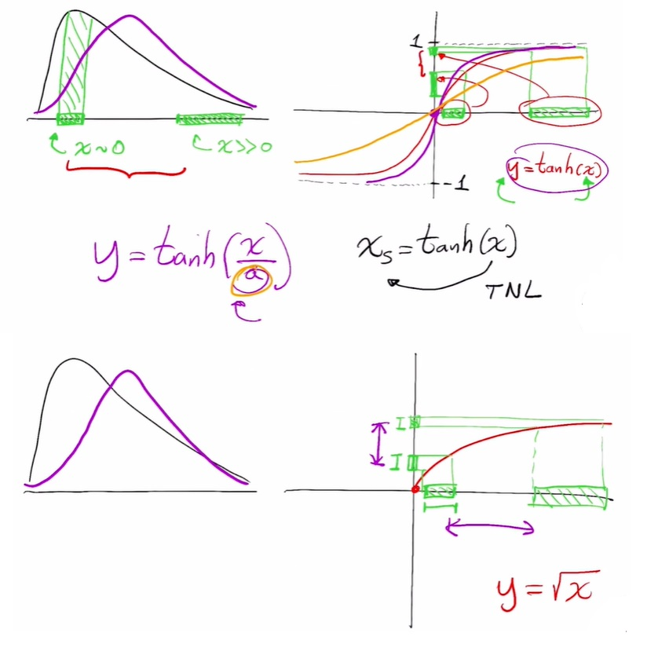

## 11. Pipelines de procesamiento para variables categóricas

 * **Dummy :** es la representación más compacta que se puede tener de los datos. Es mejor usarla cuando los inputs son variables linealmente independientes (no tienen un grado de correlación significativo). Es decir, las cuando se sabe que las categorías son independientes entre sí.
* **One-hot :** es más extenso. Permite incluir categorías que no estaban en el dataset inicialmente. De forma que si se filtra una categoría que no estaba incluida, igual se pueda representar numéricamente y no de error en el modelo (este modelo es más cool y es el que se usa).
Hay errores en la notación de Pandas y los tratan como que ambos modelos son lo mismo, pero en la realidad el Dummy no se usa. Aún así, en Pandas el método es .get_dummies().

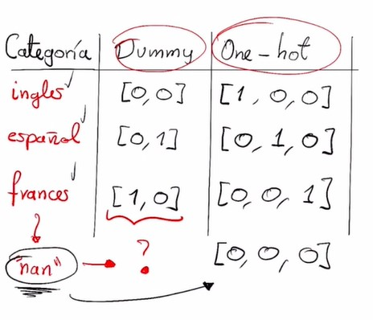

## Correlaciones

**Correlaciones**

* **¿Qué es la correlación?**
La correlación es una medida estadística que expresa hasta qué punto dos variables están relacionadas linealmente (esto es, cambian conjuntamente a una tasa constante).

* **¿Qué es la covarianza?**
Es un valor que indica el grado de variación conjunta de dos variables aleatorias respecto a sus medias.

* **¿Qué es el coeficiente de correlación?**
El coeficiente de correlación es la medida específica que cuantifica la intensidad de la relación lineal entre dos variables en un análisis de correlación.

coeficiente de correlacion: 
- si es cercano a cero, no tiene correlacion. 
- si es vayor a cero, es decir que tiene una fuerte correlacion
- si es negativo es la inversa del positivo

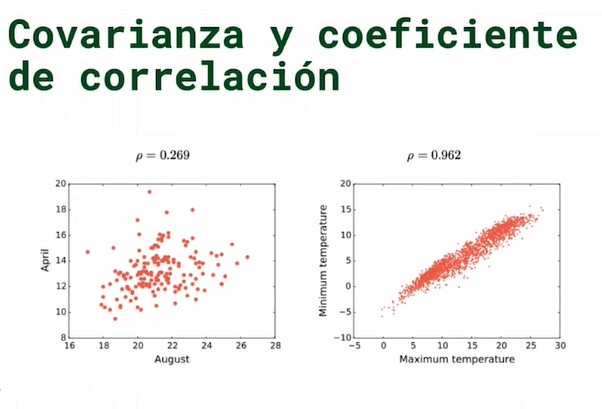

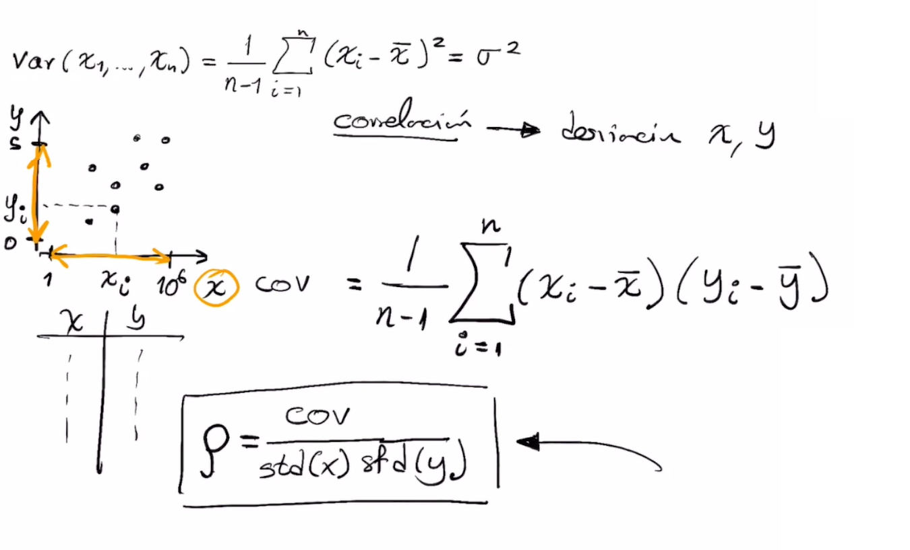

la correlacion no implica una causalidad, puede que si o puede que no

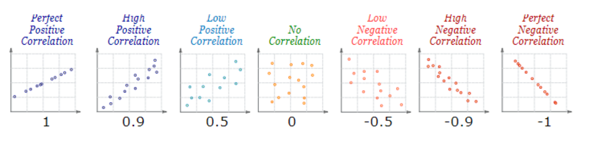

**Hay 2 tipos de multicolinealidad:**
* **Multicolinealidad exacta:** Hay colinealidad exacta, cuando una o más variables, son una combinación lineal de otra, es decir, existe un coeficiente de correlación entre estas dos variables de 1.

* **Multicolinealidad aproximada:** Hay colinealidad aproximada, cuando una o más variables, no son exactamente una combinación lineal de la otra, pero existe un coeficiente de determinación entre estas variables muy cercano al uno.