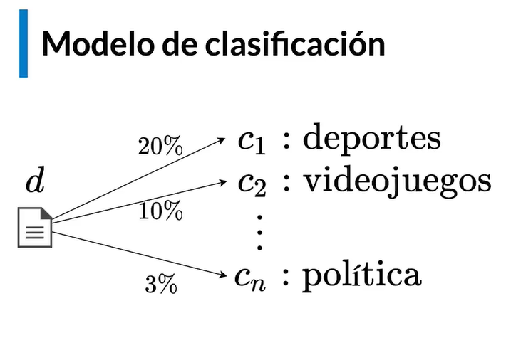
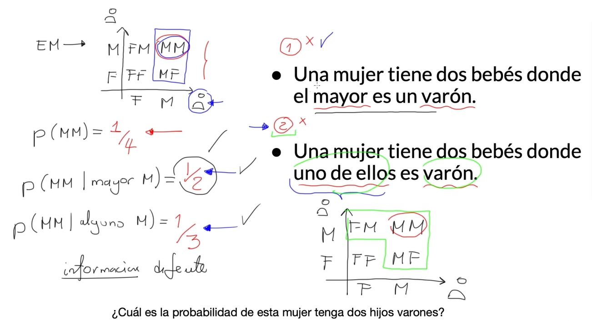
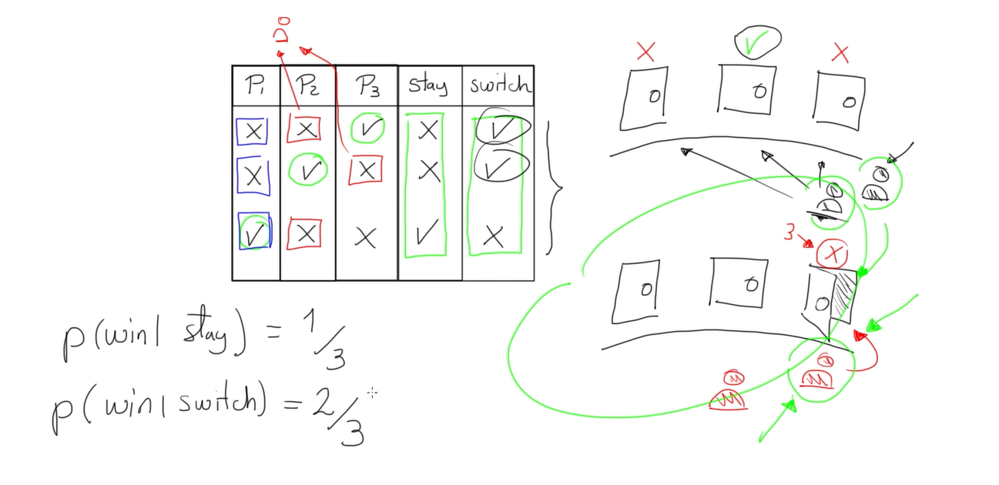
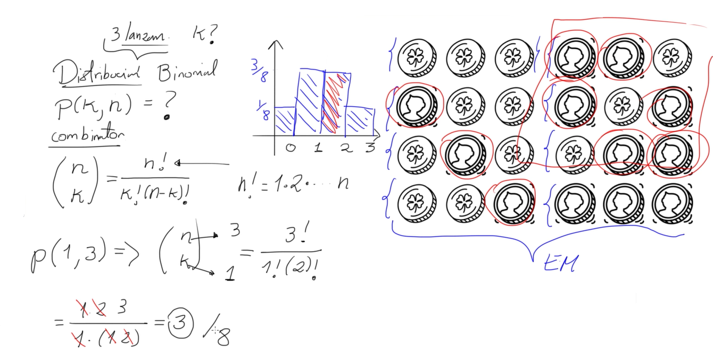
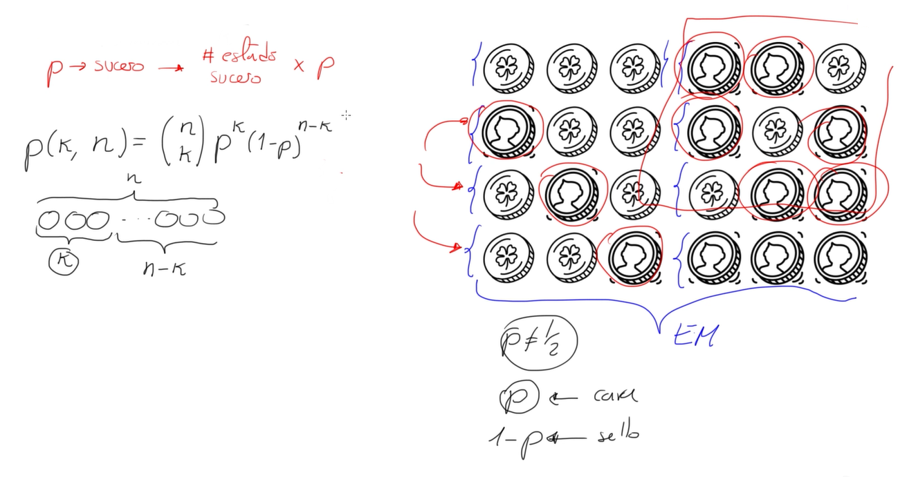
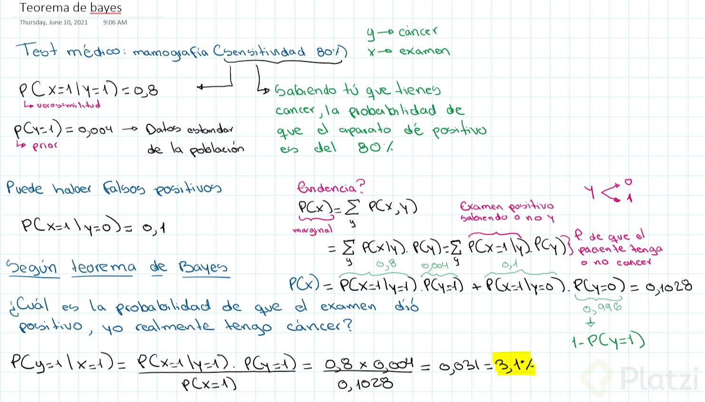

# Curso de Matemáticas para Data Science: Probabilidad

## Qué es la probabilidad?

> El azar no es más que la medida de nuestra ignorancia. Los fenómenos fortuitos son, por definicón, aquellos cuyas leyes o causas simplemente ignoramos. 

- Henri Poincaré
> 

La probabilidad se define como el lenguaje y conjunto de herramientas que permiten cuantificar la incertidumbre. Es una creencia que tenemos sobre la ocurrencia de eventos elementales. 

## Axiomas

Es un conjunto de sentencias que no son derivables de algo más fundamental. Las damos por verdad y no requieren demostración.

- “A veces se compara a los axiomas con semillas, porque de ellas surge toda la teoría”

[Axioma - Wikipedia, la enciclopedia libre](https://es.wikipedia.org/wiki/Axioma)

### Axiomas de la Probabilidad

La probabilidad está dada por el número de casos de éxito sobre la cantidad total (teórica) de casos.

$$
P=\frac{N^° sucesos\ exitosos}{N^° sucesos\ totales}
$$

- **Suceso elemental:** Describe una única ocurrencia.
    - Ej. "El resultado de lanzar un dado es 4".
- **Suceso:** Son las posibilidades que tenemos en el sistema. Está compuesto de sucesos elementales.
    - Ej. "El resultado de lanzar un dado es par" Hay tres sucesos (2, 4, 6) que componen este enunciado

De la interpretación del axioma anterior divergen dos escuelas de pensamiento. **Frecuentista y Bayesiana**

**Ejemplo**: “Solo tengo dos posibles resultados al lanzar una moneda, 50% de probabilidad para cada cara, (1/2 y 1/2), si lanzo la moneda n veces, la moneda no cae la mitad de las veces en una cara, y luego la otra”.

Esta equiprobabilidad de ocurrencia en un espacio muestral ocurre bajo el supuesto de quela proporción de exitos/totales tiende a un valor P. En otras palabras, solo lanzando la monedainfinitas veces podemos advertir que el valor de la probabilidad es cercano a (1/2 o 50%).

**Escuela frecuentista**

“Toda variable aleatoria viene descrita por el espacio muestral que contiene todos los posibles sucesos de ese problema aleatorio.”

La probabilidad que se asigna como un valor a cada posible suceso tiene varias propiedades por cumplirse.

**PROPIEDADES AXIOMAS:**

- $0 \leqslant P \leqslant 1$
- Certeza: $P=1$
- Imposibilidad $P=0$
- Disyunción $P(A\cup B) = P(A) + P(B)$

# **Probabilidad en Machine Learning**

**¿Cuáles son las fuentes de incertidumbre?**

- **Datos**: Debido a que nuestros instrumentos de medición tienen un margen de error, se presentan datos imperfectos e incompletos, por lo tanto hay incertidumbre en los datos.
- **Atributos del modelo**: Son variables que representan un subconjunto reducido de toda la realidad del problema, estas variables provienen de los datos y por lo tanto presentan cierto grado de incertidumbre.
- **Arquitectura del modelo**: Un modelo en mates es una representación simplificada de la realidad y al ser así, por construcción, induce otra capa de incertidumbre, ya que al ser una representación simplificada se considera mucho menos información.

Y claro, todo esta incertidumbre se puede cuantificar con probabilidad. **Ejemplo:**



Entonces, el modelo asignara cierta probabilidad a cada documento y así de determinará la clasificación de los documentos. Pero, ¿cómo funciona por dentro nuestro modelo de clasificación?


¿En dónde se aplica la probabilidad? Bueno, en realidad no todos los modelos probabilístico, a la hora de diseñarlo nosotros elegimos si queremos que sea un modelo probabilístico o no.

Por ejemplo, si escogemos el modelo de Naive Bayes, luego de que escogemos el diseño ahora definimos el entrenamiento y este es básicamente que el modelo aprenda el concepto de distribución de probabilidad y es una manera que yo uso para saber que probabilidades le asigno una de las posibles ocurrencias de mis datos, de ahí sirgue el esquema MLE que es el estimador de máxima verosimilitud y luego de esto esta la calibración, se configuran los hiper-parámetros, esto se entiende mas en redes neuronales artificiales en donde el número de neuronas de una capa tiene 10 neuronas y cada una tiene sus propios pesos que conectan a las neuronas, entonces esos pesos los podemos ir calibrando para que el modelo sea cada vez mas pequeño. Sin embargo, hay parámetros están fuera del modelo y no se pueden calibrar y a esos parámetros les llamamos hiper-parámetros, porque están fuera de todo ese esquema de optimización. Al final se hace la optimización de los hiper parámetros. Y al final tenemos la interpretación, para interpretar hay veces que se tiene que saber el funcionamiento del modelo y aplicar conceptos de estadística para poder interpretarlo.

# Tipos de probabilidad

* Conjunta (joint)
* Marginal
* Condicional


### Probabilidad Conjunta
Esta probabilidad de un suceso, en realidad corresponde a 2 sucesos separados y cuando yo calculo la probabilidad de 2 o mas sucesos, a eso es a lo que se le llama **probabilidad conjunta**.


### Probabilidad Condicional


La condición de “dado B en par”, lo que hizo fue restringir y paso de tener 36 posibilidades a tener 18 ocurrencias distintas. **Y como la probabilidad de A depende de B**, entonces la llamamos probabilidad condicional.

Ahora para calcular la probabilidad, nos damos cuenta que el numero de eventos exitosos no cambio, si no que lo que cambió fue el número de eventos posibles.


### Probabilidad Marginal
Ahora, nos vamos a reformular le pregunta. **¿cuál es la probabilidad de que el dado B caiga en par?**

Aquí no se impone ninguna condición y yo puedo usar todo el espacio muestral completo. De la misma manera tengo 36 opciones y de esas 36 opciones, ¿cuantas corresponden al dado b en par? Son 18.

Ahora si multiplico 9/18 * 10/36 = 1/4 y da exactamente la probabilidad conjunta.

Por lo tanto, la probabilidad conjunta de que suceda A y B es igual a la probabilidad condicional de que suceda A dado que ya sé que sucedió B, por la probabilidad de que suceda B. Esto la resultado a **la regla del producto.**


**Ahora, ¿qué es la probabilidad marginal?**

Es cuando se obtiene una probabilidad sencilla a partir de una probabilidad conjunta. Es decir cuando se tiene las probabilidades conjuntas de 2 sucesos y se quiere saber solo la probabilidad de que suceda el primer suceso independiente de lo que pasa con el otro, así eso se define como la suma de todas la probabilidades conjuntas sobre los demás estados que no está considerando A.

La probabilidad marginal es la misma probabilidad de la regla del producto, pero la relación fundamental siempre será la regla del producto.


### Otro ejemplo:


## Ejemplos de Cálculo de Probabilidad

#### Ejercicio 1 
##### Existe correlacion?


Que las probabilidades sean excluyentes no significa que sean independientes.

#### Ejercicio 2


#### Ejercicio 3


#### Tarea


### **Correlación entre sucesos:** 
Decimos que dos sucesos están correlacionados si la ocurrencia de uno varía difectamente sobre la probabilidad del otro, pueden ser:

- **Correlación positiva**: La ocurrencia de un suceso incrementa la probabilidad de ocurrencia del otro.
- **Correlación negativa**: La ocurrencia de un suceso disminuye la probabilidad de ocurrencia del otro.

**Nota:**

- Dos elementos excluyentes no son independientes, todo lo contrario tienen correlación negativa

# Ejemplos avanzados con probabilidad

#### Ejercicio 1


#### Ejercicio 2


[21 Black Jack - Cambio de variable](https://www.youtube.com/watch?v=uz58hg0EJAY)


# Qué es una distribución?

Distribuciones de Probabilidad o funcion densidad, es una función que relaciona una variable **aleatoria** y a cada uno de sus posibles estados dentro del espacio muestral le asigna una probabilidad.

### **Convención de notación:**

la probabilidad de ocurrencia:
$$
P(X = x)
$$

$X\rightarrow$ variable aleatoria

$x\rightarrow$ valores posibles del espacio muestral

### **Tipos de distribución según el dominio**

- Discretos $\rightarrow$ cuando el dominio (valores de entrada) es discontinuo (numeros enteros).
- Continuo $\rightarrow$ cuando el dominio de la variable aleatoria es continua, acepta todos los valores reales.

### **Distribución acumulada**

Se refiere a la suma de las probabilidades, por lo tanto en el caso de una variable continua sería la integral de la función distribución.

**Nota:**

- Llamamos histograma a la funcion densidad de una variable discreta

**Ejemplo:** 

$$
P(a\leq X\leq)=?
$$

$$
P(a\leq X\leq b)=\int_{a}^{b}{F(X)dX}=F(b)-F(a)=C(X)
$$

C(X) es una funcion de probabilidad acumulada

# Distribución discretas

## Distribución de Bernouelli

Es una función donde se tiene una variable con dos valores, entonces:

$P(X)=p$

$P(¬X)=1-p$

## Distribución de Binomial

Cuando se tiene secuencias repetitivas de varios eventos binarios (eventos tipo bernoulli). Todos los eventos son igualmente probables.

Existe un elemento matematico llamado el combinatorio, que sirve en este caso para calcular un numero $k$ de ocurrencias en $n$ intentos.





**Otras Dsitribución**
* Poisson
* Geometrica
* HiperGeometrica
* Binomial Negativa


# Distribuciones continuas

**Otras Dsitribución**
* Pareto
* Exponencial


# **¿Cómo estimar una distribución?**

[Google Colaboratory](https://colab.research.google.com/drive/1_G0HiUwDEOqSdErWf6gwFC2Im1F8a1xp?usp=sharing)

## Estimación Paramétrica

Forzar los parametros de la distribución.

Se basa realizar el cálculo de una distribución teórica, cuyos parámetros se basan en la información o en el conjunto de datos con el que estamos trabajando. En el ejemplo en clase, primero se calcula un conjunto de datos aleatorios, que sigue a una distribución normal, cuya media será 50 y el desvío estandar será de 5. Esto se genera a partir de la siguiente línea de código:

```python
sample = normal(loc = 50, scale = 5, size = 1000) #Donde loc es la media y scale el desvío estandar
```

Si graficamos el resultado, veremos algo como lo expuesto en la siguiente imagen, la cual tiene una forma de distribución normal:


El siguiente paso es calcular una función teórica que se ajuste al conjunto de datos. En este caso se conoce la media y el desvío porque los colocamos nosotros para realizar la simulación, pero en una situación real, se debe calcular la media y el desvío tal como lo hizo el profe, y esto se ve en la siguiente línea de código:

```python
mu = sample.mean()
sigma = sample.std()
```

Con estos valores, se crea una instancia de un objeto cuyos parámetros son precisamente mu y sigma. Es decir, tenemos la base para aplicar la fórmula de la función de distribución Gauseana, pero nos fatan los valores sobre los cuales vamos a calcular esas probabilidades. Entonces primero se crea el objeto y luego se genera un array cuyo rango va a variar entre los extremos de los datos reales y calculamos las probabilidades. Todo esto se ejecuta en las siguientes líneas de código:

```python
dist = norm(mu, sigma)
values = [value for value in range(30,70)]
probabilidades = [dist.pdf(value) for value in values]
```

Si graficamos ahora solo la función teórica nos queda lo siguiente:


Finalmente, graficamos los datos y la curva teórica calculada y observamos que se asemejan.


## Estimación No Paramétrica

Este proceso se aplica cuando los datos no se ajustan a una distribución conocida. Entonces no forzamos ajustar los datos a una única distribución, sino a un conjunto de distribuciones.

En este ejemplo, el profe utiliza un método que ya viene incluído dentro de la librería de ScikitLearn, el cual se llama **Kernel Density Estimation**. Para ello, primero se simulan dos conjuntos de datos a través de dos funciones normales y se juntan luego en una sola variable a través del método hstack(). Esto lo vemos en las siguientes líneas del código:

```python
sample1 = normal(loc = 20, scale = 5, size = 300)
sample2 = normal(loc = 40, scale = 5, size = 700)
sample = hstack((sample1, sample2))
```

El resultado lo vemos en la siguiente imagen:


Luego, una vez que tenemos los datos simulados, comienza el proceso de estimación, para ello se crea un objeto modelo, el cual se instancia a través de los parámetros bandwidth (parámetro de suavizado) y kernel (funciones de distribución que se usan para la estimación). Esto es equivalente al método anterior, donde teníamos la función normal teórica, y luego calculábamos las probabilidades, solo que ahora no tenemos solo una función de densidad de probabilidad, sino un conjunto de distribuciones. Una vez creado el objeto, se ajustan los datos a las necesidades del objeto, para esto se utiliza el método reshape, el cual los ordena en una matriz de 1000 filas y 1 columna y luego se ajusta el modelo a estos datos. Esto se hace con las siguientes líneas de codigo:

```python
model = KernelDensity(bandwidth = 2, kernel = 'gaussian')
sample = sample.reshape((len(sample), 1))
model.fit(sample)
```

Ahora, como dije antes, estamos ajustando el modelo a los datos, es como si estuvieramos calculando la media y el desvío estandar de una distribución normal pero nos faltan calcular los promedios para darle forma a la función teórica. Esto es lo que hacemos a continuación, se crea un array en el rango de los datos reales sobre cuales queremos estimar la función, y luego calculamos las probabilidades. Esto se hace en las siguientes líneas del código. **Una aclaración**, el cálculo de forma logarítimica tiene que ver con la complejidad algorítmica, es una cuestión de eficiencia. Luego a través de función inversa, la exponencial, obtenemos las probabilidades.

```python
values = np.asarray([value for value in range(1, 60)])
values = values.reshape((len(values), 1))
probabilities = model.score_samples(values) #probabilidad logarítmica para facilitar los calculos
probabilities = np.exp(probabilities)  # inversión de probabilidad obtenemos el valor original
```

Esto nos devuelve la siguiente curva:


La cual, en conjunto con los datos finalmente queda de la siguiente forma:


# MLE (Maximum Likelihood Estimation)

El objetivo del MLE es encontrar la manera más óptima de encajar una distribución a los datos.

## MLE en Machine Learning


## Regresión logística


# **Aplicación de regresión logística**

[DIFERENCIA ENTRE REGRESIÓN LINEAL Y REGRESIÓN LOGÍSTICA](https://www.youtube.com/watch?v=xxk8378kn7s)

[Google Colaboratory](https://colab.research.google.com/drive/1L03h1J7GO2TTWdRtwCEsgAaKQzdwxqdi?usp=sharing)

# Teorema de Bayes

Este teorema permite actualizar nuestras probabilidades a medida que acumulamos evidencia.

Dicta que la probabilidad a posteriori es igual a la verosimilitud por la probabilidad a priori sobre la probabilidad de la evidencia, matemáticamente:

$$
\underbrace{P(A|B)}_{posteriori} = \frac{\overbrace{P(A)}^{priori}\ \overbrace{P(B|A)}^{verosimilitud}\ }{\underbrace{P(B)}_{evidencia}}\ ,\ \ P(B)\neq0
$$

[Are you Bayesian or Frequentist?](https://www.youtube.com/watch?v=GEFxFVESQXc)

[Teorema de Bayes - Probabilidades - Ejercicios Resueltos](https://www.youtube.com/watch?v=CP4ToX5Tyvw)



# Bayes en Machine Learning

De la misma manera que el algoritmo MLE, consiste en maximizar la probabilidad para ajustarla mejor a los datos:

$$
P(\overbrace{h}^{hipotesis}|\ \underbrace{D}_{datos})=\frac{P(h)P(D|h)}{P(D)}
$$

$$
\max{P(h|D)}\rightarrow\max{P(h)P(D|h)}
$$

Eliminamos $P(D)$ puesto que es el mismo valor para el conjuto de datos


## En el siguiente enlace te permite calcular la probabilidad de las distribuciones

* https://stattrek.com/online-calculator/binomial