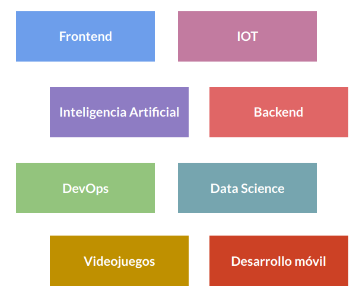

# Básico de Python

- **Contenido**

# Introducción a la programación con Python

**Date: October 25, 2021** 

## ¿Por qué Python?

**Active Recall**

- ¿Qué debemos preguntarnos para determinar que lenguaje de programación aprender?
    
    ¿Qué podemos lograr con este lenguaje de programación?
    
- ¿Qué campos existen dentro de la tecnología?
    - Frontend
    - Backend
    - IOT
    - Inteligencia Artificial
    - DevOps
    - Data Science
    - Videojuegos
    - Desarrollo móvil
- ¿En qué campos se encuentra presente Python?
    - IOT
    - Inteligencia Artificial
    - Backend
    - Data Science
- ¿Cuáles son las ventajas de usar Python?
    1. Nos ayuda a fortalecer las buenas practicas.
    2. Es fácil de aprender, esta en bastante contacto con el idioma inglés. 
    3. Es un lenguaje elegante que necesita de una estructura definida para funcionar correctamente. 

**Notes:**

En tecnología existen muchos lenguajes de programación y la pregunta más habitual que nos solemos hacer al iniciar es ¿Qué lenguaje debemos aprender primero? Lo mejor es cambiar el enfoque y preguntarnos ¿Qué queremos lograr con ese lenguaje de programación? Con ello dejaremos de ver los leguajes y en cambio veremos las especialidad que tiene el campo de la tecnología.

Tenemos muchos campos diferentes: 



- **Frontend:** es el campo que se encarga de llevar el diseño de una aplicación o sitio web a la realidad.
- **IOT (internet of things):** es el campo que se encarga de darle la capacidad de conectarse a internet a objetos que vemos a nuestro alrededor como electrodomésticos y robots.
- **Inteligencia Artificial:** se centra en enseñarle a una computadora a resolver un problema sin necesidad de que nosotros lo hagamos por nuestra cuenta.
- **Backend:** es el campo en el cuál se crea la lógica por la cuál funciona una aplicación y esa lógica vive dentro de un servidor.
- **DevOps:** son las personas que se encargan de manejar el servidor y la nube. Se encarga de controlar toda la infraestructura a través de la cual funciona una aplicación.
- **Data Science:** se encarga de tomar información que tenemos en el ambiente y adquirir información relevante a partir de eso.
- **Desarrollo de Videojuegos:** se trata de combinar el arte, la banda sonora y la programación en un producto que da una experiencia de usuario agradable.
- **Desarrollo móvil:** es el campo en el que se crean aplicaciones para que en su futuro vivan en la Play Store y la App Store y que las podemos descargar y llevar en nuestros teléfonos.

De todos los campos vistos anteriormente Python se encuentra presente y funciona muy bien en los siguientes: 


1. **IOT**
2. **Inteligencia Artificial** 
3. **Backend**
4. **Data Science**

Las empresas más famosas que usan Python son:


**Ventajas de usar Python:**

1. Nos ayuda a fortalecer las buenas practicas.
2. Es fácil de aprender, esta en bastante contacto con el idioma inglés. 
3. Es un lenguaje elegante que necesita de una estructura definida para funcionar correctamente. 

<aside>
📌 **SUMMARY:** al momento de elegir un lenguaje de programación debemos preguntarnos ¿Qué podemos hacer con este lenguaje de programación? Python nos sirve para trabajar dentro de los ámbitos de: IOT, Backend, Inteligencia Artificial y Data Science. Python tiene la ventaja de: ayudarnos a mejorar las buenas prácticas al escribir código, es un lenguaje que necesita tener una estructura definida para funcionar, además esta en contacto con el idioma inglés.

</aside>

<aside>
☝ **ACTIONS NEEDED:** investigar que empresas trabajan con Python y que desarrollan con el.

</aside>

---

**Date: October 25, 2021** 

## El núcleo de un programa: los algoritmos

**Active Recall**

- ¿Qué es un algoritmo?
    
    Son una serie de pasos ordenados que nos permiten resolver un problema.
    
- ¿Cuáles son las características de los algoritmos?
    1. Necesitamos tener un inicio y un fin, es decir, no podemos tener pasos infinitos. Son **finitos** tienen un número definido de pasos.
    2. Deben tener los pasos muy bien definidos y funcionar en todos los contextos, no pueden ser **ambiguos.** 
- ¿Cómo se puede representar de forma gráfica un algoritmo?
    
    Por medio de diagramas de flujo
    

**Notes:**

Antes de comenzar a meternos en la programación y en Python debemos conocer un concepto importante que es el **Algoritmo.**

<aside>
🧬 Los **Algoritmos** son una serie de pasos para resolver un problema.

</aside>

Los algoritmos cuentan con algunas caraterísticas especiales:

1. Para construir un algoritmo que funcione no podemos tener pasos infinitos, debemos tener un principio y final claro para definir la serie de pasos que nos lleven del inicio al final. Por ello los algoritmos son **Finitos,** es decir tienen un número definidos de pasos. 
2. Los algoritmos no pueden ser **ambiguos,** es decir, todos los pasos tienen que ser bien definidos y funcionar en todos los contextos. 

Dentro de la programación estos algoritmos se los suele representar de forma gráfica por medio de **Diagramas de Flujo.** Esta es la forma gráfica de mostrar los algoritmos que vamos a hacer. 


<aside>
📌 **SUMMARY:** un concepto muy importante que debemos de conocer antes de empezar a programar son los algoritmos, estos son una serie de pasos ordenados que deberemos de realizar para resolver un problema, tienen la característica de contar con un inicio y un final, además tener los pasos muy bien definidos para que puedan funcionar en todos los contextos. Los algoritmos se los puede graficar dentro de la computación por medio de diagramas de flujo.

</aside>

<aside>
☝ **ACTIONS NEEDED:** investigar como ayuda saber hacer diagramas de flujo.

</aside>

---

**Date: October 25, 2021** 

## Instalación de nuestras herramientas

**Active Recall**

- ¿Qué herramientas necesitamos para trabajar con Python?
    - Editor de código
    - Consola interactiva
    - Lenguaje de programación Python

**Notes:**

Para comenzar a programar necesitamos una serie de herramientas instaladas en nuestra computadora para escribir código, necesitamos:

1. **Editor de código:** estos nos hacen más fácil la escritura de código al automatizar procesos.
    
    
    
2. **Consola interectiva:** es un programa que nos sirve para manejar nuestra computadora sin necesidad de usar la interfaz gráfica. 
    
    
    
3. **Python:** es el leguaje de programación para poder programar. 
    
    
    

<aside>
📌 **SUMMARY:** para poder programar con Python necesitamos contar con 3 herramientas instaladas en nuestros computadores: editor de código, consola y el lenguaje de programación (en este caso Python).

</aside>

<aside>
☝ **ACTIONS NEEDED:** determinar que herramientas funcionan mejor para trabajar dentro de Windows.

</aside>

[Welcome to Python.org](https://www.python.org/)

[Cmder | Console Emulator](https://cmder.net/)

[Visual Studio Code - Code Editing. Redefined](https://code.visualstudio.com/)

---

**Date: October 25, 2021** 

## Tu mejor herramienta: la consola

**Active Recall**

- ¿Para qué nos sirve la consola?
    
    Para interactuar con nuestro equipo a través de comandos especiales. 
    
- ¿Cuáles son los comandos más usados dentro de la consola?
    - `Ctrl + L`: limpiar la consola
    - `cd`: cambiar de directorio
    - `cd ..`: volver al directorio anterior
    - `ls`: listar los archivos que tenemos dentro de un directorio
    - `mkdir`: crear un nuevo directorio
    - `touch`: crear un nuevo archivo

**Notes:**

No necesariamente necesitamos la interfaz gráfica de nuestra consola para poder manejarla. No necesitamos del explorador de archivos, con la consola podremos interactuar con nuestro equipo a través de comandos especiales que vamos a escribir. Entre los comandos que más usaremos tenemos:

- `Ctrl` + `L` nos permite limpiar la pantalla de nuestra consola.
- `cd` es la abreviatura de change directory, este nos permite al poner el nombre de una carpeta, ingresar a esa carpeta.
- `cd ..` nos permite volver a la **carpeta padre**.
- `ls` significa list y nos permite visualizar los archivos que tenemos dentro de una carpeta.
- `mkdir` significa make directory y nos permite crear una nueva carpeta. Si damos un espacio podemos poner el nombre que queremos que lleve la carpeta `mkdir carpeta`.
- `touch` nos permite crear un archivo. Igual que el anterior comando podemos con un espacio agregar el nombre del archivo y su tipo de extensión `touch ejemplo.txt`.

<aside>
📌 **SUMMARY:** la consola será nuestra gran aliada al momento de programar con Python, ya que nos permitirá interactuar con nuestro computador de forma más rápida por medio de comandos especiales. Esto hará que nuestro trabajo se vuelva mucho más comodo. Entre los comandos que más se utilizan dentro de la consola tenemos: `Ctrl + L`, `cd`, `cd ..`, `ls`, `mkdir` y `touch`.

</aside>

<aside>
☝ **ACTIONS NEEDED:** practicar con los comandos que podemos utilizar dentro de la consola.

</aside>

---

# Conceptos básicos de Python

**Date: October 25, 2021** 

## Explorando Python: operadores aritméticos

**Active Recall**

- ¿Qué es lo más sencillo que podemos hacer dentro de Python?
    
    Operaciones matemáticas
    
- ¿Qué herramientas podemos usar para escribir código en Python?
    - Editor de código
    - Consola interactiva
- ¿Cuál es la diferencia entre usar la consola interactiva y el editor de código?
    - La **consola** nos permite ejecutar líneas de código de forma inmediata
    - El **editor de código** nos permite trabajar con muchas líneas de código y para ver el resultado debemos colocar `print()`
- ¿Qué comando usamos para iniciar Python dentro de la consola?
    - `py`: en Windows
    - `python3`: en Linux y Mac
- ¿Qué comando usamos para salir de la consola?
    
    `exit()`
    
- ¿Qué operadores aritméticos tenemos dentro de Python?
    - `5 + 5` suma
    - `5 - 5` resta
    - `2 * 5` multiplicación
    - `21 / 5` división
    - `21 // 5` división euclidiana
    - `21 % 5` módulo
    - `2 ** 2` potencia
    - `9 ** (0.5)` `9 ** (1/2)` raíz cuadrada
    - `9 ** (1/3)` raíz cúbica
- ¿Qué es una división euclidiana?
    
    División entera donde podemos ver el cociente.
    
    
    
- ¿Qué es un módulo?
    
    División entera donde podemos ver el restante
    
- ¿Con qué orden se resuelven las operaciones aritméticas dentro de Python?
    1. Paréntesis
    2. Potencias y raíces
    3. Multiplicación y división 
    4. Sumas y restas

**Notes:**

Lo más sencillo que podemos hacer en Python son operaciones matemáticas, tal cuál como si estuviéramos usando una calculadora. 

Cuándo escribimos código Python podemos usar:

1. Editar de código 
2. Consola interactiva

Las dos funcionan de la misma manera, pero la consola interactiva nos permite ejecutar líneas de código de forma inmediata. Cuando necesitemos escribir más de una línea ahí si nos iremos al editor de código. 

Para iniciar la consola usamos el comando:

- `py` en el caso de estar en Windows
- `python3` en el caso de estar en Linux o Mac

Si queremos salir de la consola usamos el comando: 

- `exit()`

Al introducir los comandos nos saldrá lo siguiente:


- Aquí tenemos la versión que ocupamos, la fecha y hora de edición y algunos comandos básicos.
- Para poder escribir código Python debemos ver los signos `>>>`.

La consola interactiva nos permite ver el resultado de lo escribimos, sin embargo cuando trabajamos en el editor de código necesitaremos utilizar `print(5 + 5)` para poder ver el resultado. 

Dentro de Python tenemos los siguientes **operadores aritméticos**:

- `5 + 5` suma
- `5 - 5` resta
- `2 * 5` multiplicación
- `21 / 5` división
- `21 // 5` división euclidiana (división entera donde podemos ver el cociente)
- `21 % 5` módulo (división entera donde podemos ver el restante)
- `2 ** 2` potencia
- `9 ** (0.5)` `9 ** (1/2)` raíz cuadrada
- `9 ** (1/3)` raíz cúbica

> Python obedece a las reglas matemáticas de la **precedencia de operadores**, es decir, en matemáticas primero se resolverán los paréntesis, después las potencias y las raíces, después las multiplicaciones y divisiones y por último las sumas y restas.
> 

<aside>
📌 **SUMMARY:** dentro de Python lo más sencillo que podemos realizar es resolver operaciones matemáticas. Para hacerlo podemos utilizar la consola interactiva, para acceder a ella usamos el comando `py` si estamos en Windows y `python3` si estamos en Linux o Mac. Dentro de Python podemos hacer: suma, resta, multiplicación, división, división euclidiana, módulo, potencias y raíces. El orden en los que se resolverán estas operaciones es el mismo que ocupamos para resolver una operación aritmética: paréntesis, potencias y raíces, multiplicación y división y por último suma y resta.

</aside>

<aside>
☝ **ACTIONS NEEDED:** realizar operaciones aritméticas dentro de la consola de Python.

</aside>

---

**Date: October 25, 2021** 

## ¿Qué es una variable?

**Active Recall**

- ¿Qué es una variable?
    
    Es como una caja donde podemos guardar uno o varios objetos
    
- ¿Cuál es el otro nombre que tienen las variables?
    
    Identificadores, porque nos permiten identificarlas de las demás.
    
- ¿Cómo creamos una variable?
    
    Usando el nombre que queremos darle a la variable, el signo igual y lo que queremos poner dentro de la variable. 
    
    `numero = 3`
    
- ¿A qué nos referimos con el símbolo `=`?
    
    Nos referimos a **asignación** 
    
- ¿Cómo podemos ver nuestra variable?
    - **Editor de código:** utilizando `print(nombre_variable)`
    - **Consola:** colocando el nombre de la variable
- ¿Cómo podemos cambiar el contenido de una variable ya asignada?
    
    Utilizando el mismo comando que usamos para crearla y colocando el nuevo valor que queremos tener. 
    
- ¿Qué podemos hacer con las variables?
    
    Operaciones matemáticas, como sumas o restas entre ellas.
    
- ¿Cómo podemos almacenar operaciones entre variables?
    
    Creando una nueva variable que contenga la operación matemática entre variables. 
    
- ¿Cuáles son las reglas para definir el nombre de una variable?
    1. No puede comenzar con un número 
    2. Las palabras siempre deben estar en minúsculas 
    3. Si tenemos varias palabras hay que separarlas con guion bajo (_)
- ¿Cuándo se usan mayúsculas y minúsculas al dar nombre a una variable?
    - **Minúsculas:** para variables
    - **Mayúsculas:** para constantes
- ¿Qué son los primitivos?
    
    Son tipos de datos sencillos que podemos encontrar dentro de Python
    

**Notes:**

<aside>
📦 Una variable es como una caja donde podemos guardar uno o varios objetos.

</aside>

Esta caja o variable tiene un nombre y ese nombre es llamado **identificador.** Esto nos sirve para poder identificarlas de las demás. 

Para crear una variable usamos:

- Nombre de la variable o indicador = variable `numero = 3`

El símbolo igual en esta caso no quiere decir igualdad, sino que nos referimos a **asignación**. 

Para ver nuestras variables podemos hacerlo de dos formas:

1. `print(nombre de variable)` esta la usamos para ver la variable cuando estemos en el editor de texto.
2. `Nombre de variable` esta la usamos cuando estamos dentro de la consola. 

A las variables que hemos creado podemos cambiar su contenido escribiendo los mismos comandos que usamos para crear la variable `variable1 = contenido`

Con las variables podemos hacer operaciones matemáticas, como:

- **Sumar `variable1 + variable2`**
- **Restar `variable1 - variable2`**

Dentro de las variables podemos almacenar operaciones entre variables, por ejemplo: `variable_contenedora = variable1 + variable2`

**Reglas para definir el nombre de una variable:**

1. No puede comenzar con un número 
2. Las palabras siempre deben estar en minúsculas 
3. Si tenemos varias palabras hay que separarlas con guion bajo (_)

> Estas reglas cambian dependiendo del lenguaje de programación.
> 

Los primitivos son tipos de datos sencillos que podemos encontrar dentro de Python

En Python todo es un objeto, en este caso nos referiremos a objetos como los tipos de datos. 

<aside>
📌 **SUMMARY:** las variables son muy importantes al momento de programar, estas son como cajas donde podemos almacenar uno o varios objetos. Para crear una variable usamos `nombre_variable = valor`, con este formato podremos crear la variable que queramos. Si queremos cambiar un valor dentro de una variable ya asignada usamos el mismo comando. Para poder ver lo que tenemos dentro de nuestra variable usamos: `print(nombre_variable)` si estamos en un editor de código y `nombre_variable` si estamos en la consola. Para colocar un nombre a una variable tenemos 3 reglas importantes: 1. no pueden comenzar por un número, 2. las palabras siempre deben estar en minúsculas y 3. si tenemos varias palabras debemos de separarlas por un guion bajo.

</aside>

<aside>
☝ **ACTIONS NEEDED:** crear variables y modificarlas para aprender el concepto de variables y sus creaciones, además realizar operaciones matemáticas entre variables.

</aside>

---

**Date: October 25, 2021** 

## **Tipos de datos**

**Active Recall**

- ¿Qué tipos de datos básicos podemos encontrarnos en Python?
    1. **Números enteros (int):** números sin decimales
    2. **Números de punto flotante (float):** números con decimales
    3. **Texto (str):** son cadenas de caracteres
    4. **Booleanos (bool):** verdadero y falso
- ¿Cómo podemos añadir strings?
    
    Para hacerlo necesitamos utilizar comillas  `""`, todo lo que veamos dentro de comillas dentro de Python será texto.
    
- ¿Qué operaciones matemáticas podemos hacer con los strings?
    - **Concatenar o unir:** para ello usamos `+`
    - **Multiplicar o duplicar:** para ello usamos `*`
- ¿Cómo creamos un float?
    
    Al número que queremos guardar debemos darle el valor decimal con un punto `.`
    
- ¿Por qué se utiliza un punto y no una coma para separar decimales dentro de Python?
    
    Porque Python se basa en el idioma inglés. 
    
- ¿Cómo crear un bool?
    
    Añadiendo el valor `True` o `False` a nuestra variable.
    

**Notes:**

En Python podemos encontrar 4 tipos de datos básicos: 


- **Números enteros (int):** son números que son cerrados, es decir, no tienen decimales.
- **Números de punto flotante (float):** son los números decimales, es decir, los que no son exactos.
- **Texto (str):** es un tipo de dato con el que podemos crear mensajes al usuario, en programación son llamados como **strings (**cadena de caracteres**).**
- **Booleanos (bool):** es un verdadero y falso.

Para comenzar a trabajar con los datos debemos:

- **Strings (texto):**
    - Para crear una variable usamos: `nombre = "Carlos"` `nombre2 = 'Carlos Valencia'` `nombre + ", " + nombre2`
    - Con el podemos: concatenar (unir dos textos) `nombre + nombre2`, multiplicar (duplicar) `nombre * 4`.

> Todo lo que veamos dentro de comillas en Python es texto.
> 

> En Python es indistinto usar comillas dobles o simples, hay pequeñas diferencias pero no marcan la diferencia.
> 
- **Números de punto flotante (decimales):**
    - Para crear una variables usamos: `numero_decimal = 3.4`

> En Python no es posible separar los números decimales por una coma (,), sino que deberemos de usar un punto (.). Esto porque Python tiene sus bases del idioma inglés y en el los decimales se expresan siempre con un punto.
> 
- **Booleanos:**
    - Para crear una variable usamos: `variable = True` `variable2 = False`

<aside>
📌 **SUMMARY:** dentro de Python tenemos 4 tipos básicos de datos: int, str, float y bool. Con los **str** se pueden realizar: concatenaciones y multiplicaciones. Todo lo que encontremos entre comillas dentro de Python será texto. Para añadir **floats** debemos de colocar el valor decimal separado por un punto `4.5` y para añadir un **bool** debemos asignar los valores `True` o `False` según los necesitemos.

</aside>

<aside>
☝ **ACTIONS NEEDED:** crear variables con los 4 diferentes tipos de datos que podemos tener.

</aside>

---

**Date: October 25, 2021** 

## Convertir un dato a un tipo diferente

**Active Recall**

- ¿Para qué nos sirve pasar un dato de un tipo a otro?
    
    Para poder trabajar con el de forma adecuada, ya que no es lo mismo sumar un int a concatenar un str.
    
- ¿Cómo podemos pedir al usuario que ingrese un valor a nuestro programa?
    
    Utilizando el comando `variable = input("str")`. El dato que se ingrese se almacenará en la variable.
    
- ¿Cómo cambiamos un dato a int?
    
    Utilizando `variable = int(variable)`, lo que hace esto es cambiar el valor y reescribirlo dentro de la variable.
    
- ¿Qué necesitamos para pasar un float a int?
    
    Qué la variable decimal este definida.
    
- ¿Cómo convertimos un dato en str?
    
    Usando `str()`
    

**Notes:**

A veces puede darse el caso en el que queremos pasar un tipo de datos a otro. 


Al momento de crear una variable podemos usar `variable = input("string")` esto lo que hace es darle un mensaje al usuario que esta usando nuestro programa. Al momento de ejecutar esa línea de código se nos pedirá el dato que pusimos dentro del **string** y ese dato se guardará dentro de la variable. 

Debemos de tener cuidado con esto ya que el dato que guardamos se lo guardo en formato de texto, por ello en la consola los números nos salen encerrados en comillas. Si quisiéramos sumar estos números que guardamos en formato de texto en realidad lo que estaríamos haciendo seria **concatenarlos**. 

En estos casos surge la necesidad de convertir el dato que tenemos en otro tipo de dato, para ello usamos:

- `numero1 = int(numero1)` al poner **int** convertiremos el texto dentro de la variable a un número.
- Si queremos pasar de un número decimal a un número entero necesitamos que la variable decimal este definida `numero_decimal = 4.5` y para cambiarla usamos `int(4.5)`
- Si queremos pasar de un número decimal a texto usamos `str(numero_decimal)`

Es decir:

- **`int()`** nos permite pasar los datos a números enteros.
- **`str()`** nos permite convertir números enteros y decimales a string.

<aside>
📌 **SUMMARY:** en ocasiones necesitaremos cambiar el tipo de dato que tenemos dentro de Python, ya que no podremos trabajar con los datos de la forma que queremos. Para ello se utilizan los comandos: `int()` para cambiar a números enteros, `str()` para cambiar a texto, `float()` para cambiar a decimales y `bool()` para cambiar a booleanos.

</aside>

<aside>
☝ **ACTIONS NEEDED:** practicar cambiando datos de un tipo a otro.

</aside>

---

**Date: October 25, 2021** 

## Operadores lógicos y de comparación

**Active Recall**

- Además de los operadores matemáticos ¿Qué otros operadores tenemos en Python?
    - **Operadores lógicos:** ingresamos dos booleanos y retorna uno.
    - **Operadores de comparación:** usados para comparar dos elementos de cualquier tipo de datos.
- ¿Qué operadores lógicos tenemos?
    - `and`: devolverá True cuando todas las variables comparadas contengan el valor True
    - `or`: devolverá False cuando todas las variables comparadas sean Falsas.
    - `not`: invierte el valor de la variable, es decir, nos da el valor contrario que tenemos guardada en la variable.
- ¿Qué operadores de comparación tenemos?
    - `==`: igualdad
    - `!=`: distinto
    - `>`: mayor
    - `<`: menor
    - `>=`: mayor o igual
    - `<=`: menor o igual
- ¿Para qué nos sirven estos operadores?
    
    Para obtener una respuesta de Python en forma de booleanos dependiendo del contenido que tenemos dentro de las variables. 
    

**Notes:**

En programación podemos hacer un montón de cosas diferentes que los operadores que vimos al inicio, para ello vamos a necesitar dos nuevos tipos de operadores:

- **Operadores lógicos:** estos los usamos con los booleanos.
    - Entre los operadores tenemos:
        - `and` al usar este operador Python solo nos devolverá **verdadero** cuando todas las variables comparadas contengan el valor de **verdadero.**
        - `or` al usarlo nos devolverá **falso** cuando el contenido de todas las variables que comparamos con este operador son **falsas.**
        - `not` lo que hace es invertir el valor de la variable, es decir, nos da el valor contrario que tenemos guardado en la variable.
- **Operadores de comparación:** estos nos sirven para comparar variables y nos devolverá valores booleanos.
    - Entre estos operadores tenemos:
        - `numero 1 == numero2`  esto se lee como igualdad. El contenido de la variable1 es igual al de la variable2
        - `numero1 != numero2` esto se lee como distinto. El contenido de la varibale1 es distinto de la variable2
        - `numero1 > numero2` esto se lee como mayor. El contenido de la variable1 es mayor a la variable2
        - `numero1 < numero2` esto se lee como menor. El contenido de la variable1 es menor a la variable2
        - `numero1 >= numero2` esto se lee como mayor o igual. El contenido de la variable1 es mayor o igual a la variable2
        - `numero1 >= numero2` esto se lee como menor o igual. El contenido de la variable1 es menor o igual a la variable2

> Lo que hacemos con estos operadores es preguntarle a Python para que nos de una respuesta en booleanos (True o False) dependiendo del contenido que tenemos dentro de variables.
> 

<aside>
📌 **SUMMARY:** dentro de Python no solo podemos usar operadores matemáticos, también podemos utilizar los **operadores lógicos (`and`, `or` y `not`)** y los **operadores de comparación** (`==`, `!=`, `>`, `<`, `>=` y `<=`). Estos operadores nos sirven para hacer preguntas a Python y obtener booleanos, con ellos podremos realizar operaciones y programas más complejos.

</aside>

<aside>
☝ **ACTIONS NEEDED:** practicar con los operadores lógicos y de comparación.

</aside>

---

**Date: October 25, 2021** 

## Tu primer programa: conversor de monedas

**Active Recall**

- ¿Cómo podemos correr el código que hemos creado con Python?
    - **Consola:** utilizar el comando `python3 nombre_archivo`
    - **Editor de código:** dando click la opción run
- ¿Para qué nos sirve `input`?
    
    Para que el usuario pueda ingresar un valor
    
- ¿Para qué nos sirve `round`?
    
    Nos permite tomar el valor de una variable y reducirlo la cantidad al número que necesitamos.
    
    `round(variable, 2)`
    

**Notes:**

Vamos a crear un conversor de monedas que pase de pesos colombianos a dólares. 

Para hacerlo usaremos Visual Studio Code.

Dentro de Visual Studio Code seguiremos los siguientes pasos:


1. Crear la variable pesos. `pesos = input("¿Cuántos pesos colombianos tienes?: ")`
2. Hacer la transformación de este valor a un número decimal `pesos = float(pesos)` lo que hace **float** es transformar el contenido de una variable a decimal y lo guarda dentro de una variable. 
3. Crear la variable del valor del dólar `valor_dolar = 3875` ponemos el valor al que corresponde un dólar en pesos colombianos. 
4. Hacer la operación para saber cuántos dólares tenemos `dolares = pesos / valor_dolar`
5. Convertir los dólares en texto, esto porque queremos imprimir en consola el valor de dólares en texto `dolares = str(dolares)`
6. Utilizar el comando para poder ver el valor dentro del editor de texto e imprimir en consola `print("Tienes $" + dolares + " dólares")`

Tenemos dos formas para correr el código que hemos creado:

1. Con la opción de run 
    
    
    
2. Con la consola 
    
    Para hacerlo correr debemos de por medio de la consola estar dentro de la carpeta que contiene nuestro archivo y colocar el comando `python3` o `py` + `nombre del archivo`.
    
    
    

Para solucionar el problema de tener demasiados decimales debemos:


- Utilizar el comando round `dolares = round(dolares, 2)`

<aside>
📌 **SUMMARY:** para poder crear un programa con Python podemos utilizar todo lo que hemos aprendido hasta esta clase. Debemos tener cuidado de siempre escribir código de forma uniforme, es decir, si comenzamos usando comillas dobles debemos mantener ese formato en todo el código.

</aside>

<aside>
☝ **ACTIONS NEEDED:** modificar el conversor de monedas a la moneda de mi país.

</aside>

---

# Herramientas para programar

**Date: October 26, 2021** 

## Construyendo el camino de un programa con condicionales

**Active Recall**

- ¿Para qué se usan las condicionales?
    
    Para decidir si vamos a seguir un camino o vamos a ir por otro camino dentro de nuestro programa. 
    
- ¿Qué condicionales tenemos dentro de Python?
    - `if`: se lee cómo si ocurre esto has.
    - `else`: se lee cómo sino has esto.
    - `elif`: se lee cómo sino has esto.
- ¿Cuál es la diferencia entre `else` y `elif`?
    - `elif` lo podemos usar las veces que sean necesarias y nos permite **agregar otra condicional**.
    - `else`: se la usa para en caso de no cumplirse las condiciones anteriores ejecutar esta alternativa **sin condicional**.
- ¿Qué debemos colocar al final de nuestra línea de condicionales?
    
    Dos puntos `:`
    
- ¿Cuál es la regla dentro de Python al usar los dos puntos?
    
    Debajo de esta línea debemos dejar 4 espacios, lo que se conoce como **indentación.**
    
- Si todavía no queremos escribir código debajo de nuestro condicionales ¿Qué debemos usar?
    
    `pass`
    
- ¿Cómo podemos colocar comentarios dentro de Python?
    - Colocando el signo numeral al inicio de la línea de código `#`
    - Para varias líneas de comando, podemos seleccionarlas y usar la combinación `Ctrl + /`
- ¿Cómo podemos transformar un tipo de dato desde el input?
    
    Colocando comando que necesitamos para cambiar al tipo de dato desde el inicio `edad = int(input("Escribe algo: "))`
    

**Notes:**

Hasta ahora hemos realizado un programa que se encarga de seguir pasos de principio a fin y esos pasos nunca cambian, pero eso no es lo único que podemos hacer en programación. Muchas veces vamos a tener situaciones o caminos en los cuales tendremos que tomar una decisión para saber si nos vamos a ir por un lugar o nos vamos a ir por otro lugar. Para hacer esto usamos los **condicionales.** 


Muchas veces nuestros programas no van a seguir una línea recta ni una ruta que va desde el principio hasta el final y nunca cambia, sino que habrá veces que nuestros programas tendrán que decidir si ir por un lugar o otro dependiendo de un valor. 

Para aprender sobre los condicionales vamos a hacer un pequeño programa donde nuestro programa tendrá que tomar rumbos diferentes dependiendo de algo por lo cuál usaremos **condicionales**:

- Ejemplo con mayor y menor de edad:

```python
edad = int(input("Escribe tu edad: ")) #con el int hacemos que el valor se convierta directamente en un entero. 
if edad > 17: #con if ponemos un condicional y se leería si la edad es mayor a 17 vamos a hacer
    pass # pass significa que ese espacio lo dejamos para después, aquí escribimos el código que queremos que se haga en caso de cumplir
else: # else significa sino 
    pass # pass significa que ese espacio lo dejamos para después, aquí ponemos lo que queremos que pase en caso contrario. 
```


> Siempre que veamos los dos puntos (:) en Python debajo de ellos siempre se debe de dejar 4 espacios, sino lo hacemos el programa va a fallar. El término técnico para referirnos a esos espacios es **indentación.**
> 

> Si queremos dejar un comentario dentro de Python utilizamos el signo #. Al usarlo Python se saltara esa línea. Si queremos comentar varias líneas a la vez podemos usar `Ctrl` + `/`
> 
- Ejemplo número mayor, menor o igual:

```python
numero = int(input("Escribe un número: "))
if numero > 5:
    print("Es mayor a 5")
elif numero == 5: # elif significa sino y podemos poner cuantos necesitemos, lo utilizamos cuando usamos varios condicionales.
    print("Es igual a 5")
else:
    print("Es menor a 5")
```


<aside>
📌 **SUMMARY:** dentro de los programas que creemos con Python no todos tendrán un camino lineal, sino que en varias ocasiones deberemos de elegir caminos o direcciones que se deben de tomar en caso de tener algunos datos. Para esto se utilizan los condicionales, con ellos podemos elegir que acción se debe realizar dependiendo de si se cumple o no una condición. Para usarlos tenemos: `if`, `elif` y `else`. `if` y `elif` nos permitirán añadir una condición a nuestro programa y `else` nos permitirá realizar una acción si no se cumplen estas condiciones. Al usar los condicionales nos encontramos con un concepto muy importante dentro de Python la **INDENTACIÓN** que se trata de al nosotros escribir una línea de código que finalice con dos puntos, en la línea de abajo deberemos dejar 4 espacios, sino lo hacemos el programa no funcionara.

</aside>

<aside>
☝ **ACTIONS NEEDED:** crear pequeños programas usando condicionales.

</aside>

---

**Date: October 26, 2021** 

## Varios países en mi conversor de monedas

**Active Recall**

- ¿Para qué nos sirven las triples comillas dobles dentro de Python `"""`?
    
    Nos permite crear un string de varias líneas.
    
- ¿Qué podemos crear con las triples comillas?
    
    Menus para el usuario donde puedan elegir entre varias opciones. 
    
- ¿A qué se denomina cómo bloque de código?
    
    Al código que esta escrito con Indentación
    
- ¿Cómo podemos hacer que el programa identifique que no se colocó una opción correcta en el menu?
    
    Utilizando un condicional `else`.
    
- ¿De qué debemos tener cuidado al crear menus?
    
    De que la opción que se ponga será ingresada como str, por lo que en los condicionales deberemos de colocar como str o en su defecto transformarla desde un inicio en int. 
    

**Notes:**

Vamos a volver a utilizar el programa de conversor de monedas que utilizamos antes para ya no solo admitir un tipo de moneda, sino ingresar varios tipos de monedas. 

Para hacer esto necesitamos:

- Crear un pequeño menu
    
    > En Python no solo podemos usar las comillas dobles (""), sino que también podemos usar la triple comilla doble ("""). Esto nos permite crear un string o cadena de caracteres de varias líneas.
    > 

```python
menu = """
Bienvenido al conversor de monedas 🎉

1 - Pesos colombianos
2 - Pesos argentinos 
3 - Pesos mexicanos

Eligue una opción: """

opcion = input(menu)

if opcion == "1": # al número lo ponemos entre comillas porque la entrada desde el teclado se la entiende como un string, si no quermos hacer eso podemos en opción especifiar que vamos a recoger un entero opcion = int(input(menu))
    dolares = input("¿Cuántos dólares tienes?: ")
    dolares = float(dolares)
    valor_euro = 1.3
    euro = dolares / valor_euro
    euro = round(euro, 2)
    euro = str(euro)
    print("Tienes $" + euro + " euros")
elif opcion == 2:
    pesos = input("¿Cuántos pesos colombianos tienes?: ")
    pesos = float(pesos)
    valor_euro = 4424
    euro = pesos / valor_euro
    euro = round(euro, 2)
    euro = str(euro)
    print("Tienes $" + euro + " euros")
elif opcion == 3:
    pesos = input("¿Cuántos pesos mexicanos tienes?: ")
    pesos = float(pesos)
    valor_euro = 24
    euro = pesos / valor_euro
    euro = round(euro, 2)
    euro = str(euro)
    print("Tienes $" + euro + " euros")
else:
    print("Ingresa una opción correcta por favor")
```

> Todo lo que se encuentra con indentación es lo que se denomina un **bloque de código** que se ejecuta si se cumple la condición.
> 

<aside>
📌 **SUMMARY:** dentro de Python podemos crear menus que nos permitan interactuar con nuestros usuarios, para crearlos usamos las triples comillas dobles `"""`. Para poder interactuar con este menu podemos crear opciones que se seleccionen por medio de números y acceder a ellas con condicionales. Un concepto importante es que todo el código que tengamos con indentación se lo conoce como **bloque de código.**

</aside>

<aside>
☝ **ACTIONS NEEDED:** crear un menu que nos ayude a entender el concepto.

</aside>

---

**Date: October 26, 2021** 

## Aprendiendo a no repetir código con funciones

**Active Recall**

- ¿Qué podemos hacer cuando tenemos código que se repite?
    
    Crear funciones
    
- ¿Qué son las funciones dentro de Python?
    
    Es una pieza de código que se puede invocar varias veces
    
- ¿Con qué palabra clave se define a una función?
    
    `def nombre_funcion():`
    
- ¿Cuáles son las reglas para poner el nombre a una función?
    
    Las mismas que usamos para definir el nombre de una variable:
    
    1. Siempre serán escritas en minúsculas.
    2. Si son más de dos palabras deben ir separadas por un guion bajo (_)
    3. No pueden empezar por un número
- ¿Cómo podemos invocar a una función?
    
    Colocando el nombre de la función definida y paréntesis.
    
    `nombre_funcion()`
    

**Notes:**

En varias ocasiones vamos a escribir la misma lógica un montón de veces, pero esto es una mala práctica. **No lo debemos de hacer**. 


En los casos en los que tengamos deferentes pasos y en un momento se separen, pero se formen los mismos pasos en repetidas ocasiones lo podemos solucionar de manera muy elegante con el uso de las **funciones.** Para hacerlo debemos de identificar los **pasos comunes** y con ello ejecutar el mismo código que antes se repetía.  


> Una **función** es una pieza de código que se puede **invocar** varias veces. Se definen con la palabra clave **def.**
> 

Las funciones al igual que las variables tendrán un nombre y de la misma manera tendremos reglas para colocar su nombre:

1. Siempre serán escritas en minúsculas.
2. Si son más de dos palabras deben ir separadas por un guion bajo (_)
3. No pueden empezar por un número

Para crear nuestras funciones debemos:

```python
def imprimir_mensaje():  # def viene de definición de la función y nos permite crear la función
    print("Mensaje especial: ")
    print("¡Estoy empezando a usar funciones!")

imprimir_mensaje() # con esto estamos **invocando** a la función y ejecutamos los bloques de código que tenemos dentro del def. 
```


<aside>
📌 **SUMMARY:** dentro de Python es una muy mala práctica repetir código, ya que lo que buscamos con Python es crear código sencillo. Para evitar la repetición de código usamos las **funciones**, estas nos permiten definir un bloque de código que lo podremos invocar las veces que necesitemos. Para crear una función usamos: `def nombre_funcion():` y en la parte de abajo colocamos el bloque de código que necesitamos. Al momento de definir el nombre de una función usamos las mismas 3 reglas que tenemos para definir el nombre de una variable. Finalmente para invocar una función utilizamos el nombre de la función más paréntesis `nombre_funcion()`.

</aside>

<aside>
☝ **ACTIONS NEEDED:** practicar creando funciones.

</aside>

---

**Date: October 26, 2021** 

## Parámetros

**Active Recall**

- ¿Qué pueden recibir opcionalmente las funciones?
    
    Parámetros
    
- ¿Qué son los parámetros?
    
    Son variables que vamos a tener disponibles para usarlas dentro de las funciones.
    
- ¿Qué debemos escribir para usar un parámetro?
    
    Debemos escribir los parámetros dentro del paréntesis al definir una función:
    
    `def nombre_funcion(parámetros):`
    
- ¿Cómo usamos los parámetros dentro de la función?
    
    Definimos los parámetros y lo llamamos dentro del bloque de código de la función con el mismo nombre del parámetro.
    
- ¿Cómo usamos los parámetros dentro del código?
    
    Invocamos la función y dentro del paréntesis colocamos los datos que queremos que vaya dentro de nuestros parámetros.
    
- ¿Para qué nos sirven los parámetros?
    
    Para no escribir demasiadas veces el mismo código.
    

**Notes:**

Las funciones pueden recibir opcionalmente **parámetros**, que son, en palabras simples, los datos que cambian en cada llamada o **invocación.**

Son variables que vamos a tener disponibles para usarlas dentro de las funciones. 

Para utilizarlas debemos:

```python
def conversacion(mensaje) # dentro del parentesis es donde colocaremos los parámetros, que son variables que vamos a tener disponibles para usarlas dentro de la función.
    print("Hola")
    print("¿Cómo estas?")
    print(mensaje) # imprimirimos la varibale que nos **llega** a la función.  
    print("Adios")
opcion = int(input("Elige una opción (1, 2, 3): "))
if opcion == 1:
    conversacion("Elegiste la opción 1") # Dentro del parentisis pondremos el mensaje que queremos que vaya dentro de la variable creada en el def.
elif opcion == 2:
    conversacion("Elegiste la opción 2")
elif opcion == 3:
    conversacion("Elegiste la opción 3")
else:
    print("Elige la opción correcta")
```


> Los parámetros nos ayudan a no escribir demasiadas veces el mismo código.
> 

> Las funciones son las claves de todos los ámbitos de la programación y siempre nos encontraremos con ellos.
> 

<aside>
📌 **SUMMARY:** dentro de las funciones podemos implementar el uso de los **parámetros**, estos nos permiten tener variables disponibles para utilizar dentro de las funciones. Para definirlas debemos de colocar un nombre dentro de los paréntesis al usar funciones: `def nombre_funcion(parametro):`. La podemos usar dentro del bloque de código de la función al llamarla con el nombre del parámetro y dentro del código global al colocar la información que queremos que vaya dentro de la variable definida en el parámetro.

</aside>

<aside>
☝ **ACTIONS NEEDED:** crear nuevos programas para usar parámetros.

</aside>

---

**Date: October 26, 2021** 

## Modularizando nuestro conversor de monedas

**Active Recall**

- ¿Cómo podemos añadir más de un parámetro dentro de una función?
    
    Separándolas por una coma. 
    
- ¿Cómo podemos guardar el resultado de una función en una variable?
    
    Debemos agregar:
    
    1. `return nombre_variable`: nos permite regresar la función al finalizar de realizar las operaciones.
    2. Crear una variable para guardar el nuevo resultado.
- ¿Para que sirve la palabra clave `return`?
    
    Para regresar un valor dentro de una función.
    
- ¿Dónde debemos colocar las funciones?
    
    En la parte superior de nuestro código.
    
- ¿Qué pasa si colocamos nuestras funciones en la parte de abajo de nuestro código?
    
    Si están abajo de la función principal no se ejecutarán 
    

**Notes:**

Una vez aprendidas las funciones y los parámetros es hora de llevarlas a la práctica para mejorar el código que escribimos en nuestro conversor de monedas. 

Pero antes de pasar a hacerlo necesitamos aprender algo nuevo:

- Muchas veces el resultado de una función, cuándo terminamos de ejecutar una función, queremos guardar eso que la función devuelve en una **variable.** Para hacerlo debemos:

```python
def suma(a, b):
    print("Se suman dos números")
		resultado = a + b
		return  resultado # significa devuelve y nos permite regresar la variable

sumatoria = suma(1, 4)
print(sumatoria)
```


Una vez explicado este nuevo concepto podemos pasar a mejorar nuestro conversor de monedas: 

```python
def conversor(tipo_moneda, valor_euro):
    moneda = input("¿Cuántos " + tipo_moneda + " tienes?: ")
    moneda = float(moneda)
    euro = moneda / valor_euro
    euro = round(euro, 2)
    euro = str(euro)
    print("Tienes $" + euro + " euros")

menu = """
Bienvenido al conversor de monedas 🎉

1 - Dólares
2 - Pesos colombianos 
3 - Pesos mexicanos

Eligue una opción: """

opcion = int(input(menu))

if opcion == 1:
    conversor("dólares", 1.3)
elif opcion == 2:
    conversor("pesos colombianos", 4424)
elif opcion == 3:
    conversor("pesos mexicanos", 24)
else:
    print("Ingresa una opción correcta por favor")
```


> Lo mejor es poner nuestras funciones por encima de nuestro código, ya que si están por debajo no se realizarán.
> 

<aside>
📌 **SUMMARY:** al utilizar las funciones podemos crear más de un parámetro dentro ellas, para esto tenemos que colocar el nombre de los parámetros que vamos a utilizar y separarlos por una coma. Al momento de trabajar con estos parámetros debemos tener cuidado con el tipo de dato que estamos utilizando, ya que estos nos permitirán trabajar de una u otra forma. Si queremos que las operaciones que tenemos dentro de una función se guarden dentro de una variable usamos `return` al final de la función, además debemos guardar el resultado de esta función dentro de una nueva variable. Es preferible que las funciones vayan siempre colocadas en al parte superior de nuestro código, ya que si están muy abajo no se ejecutarán.

</aside>

<aside>
☝ **ACTIONS NEEDED:** practicar con el uso de `return` y la implementación de más de un parámetro.

</aside>

---

**Date: October 26, 2021** 

## Trabajando con texto: cadenas de caracteres

**Active Recall**

- ¿Qué son los métodos?
    
    Es una función que es especial para un tipo de dato en particular, como los strings.
    
- ¿Cuál es la estructura de un método?
    
    `nombre.upper()`
    
    - Dato en una variable
    - Función asociada
    - Paréntesis
- ¿Qué métodos tenemos para trabajar con strings?
    - `upper`: transforma el string a mayúsculas
    - `capitalize`: pone la primera letra en mayúsculas
    - `strip`: elimina los espacios basura que pueden estar al inicio o al final de los strings
    - `lower`: transforma el string a minúsculas
    - `replace('o', 'a')`: nos remplazará todas las primeras letras que encuentre en el string por la segunda letra.
- ¿Cómo podemos guardar los nuevos valores creados por los métodos?
    
    Si queremos hacerlo deberemos de sobre escribir dentro de la variable: `nombre = nombre.upper()`
    
- ¿Cómo podemos acceder a un carácter específico de nuestro string?
    
    Usando índices
    
- ¿Cómo se usan los índices?
    
    Con corchetes `[]` y dentro de ellos colocamos el número de la posición del string al que queremos acceder empezando a contar desde el 0. 
    
- ¿Qué función nos permite averiguar cuántos caracteres tiene nuestro string?
    
    `len(nombre_variable o string)`
    
- ¿Cómo se llaman las funciones que nosotros no tenemos que crear para trabajar con ellas?
    
    Build in, esto quiere decir que vienen dentro del lenguaje Python.
    

**Notes:**

En python podemos hacer más que concatenar y duplicar textos. Podemos utilizar los **métodos,** estas son funciones que son especiales para un tipo de dato en particular. Estas se ejecutan siempre que colocamos una variable más un punto (.) el método y abrimos y cerramos paréntesis ().

```python
nombre.upper() # Transforma una string a mayúsculas. 
nombre.capitalize() # Nos permite capitalizar el string, es decir, poner la primero letra en mayúsculas. 
nombre = nombre.capitalize() # Nos permite guardar el método utilizado dentro de la variable. 
nombre = nombre.strip() # Elimina los espacios basura que pueden estar al inicio o al final de nuestro texto. 
nombre = nombre.lower() # Transforma el string a minúsculas
nombre = nomnre.replace("o", "a") # Esta es una función que recibe parámetros y lo que decimos es que nos remplace todas las "o" por "a"
nombre[0] # Usamos **indices** que nos permite acceder a los caracteres del string. En programación la mayoría de las veces se empieza a contar desde 0.
len(nombre) # Nos permite averiguar cuantos caracteres tiene nuestro string guardado en variables o escrito. 
```

Para acceder a caracteres específicos de nuestro string utilizamos los **índices,** estos se los usa con corchetes y dentro de estos ponemos con números el carácter al que queremos acceder empezando a contar desde el 0. 

> Para averiguar cuántos caracteres tiene nuestra string usamos la función `len(nombre_variable)` los espacios también son contados como caracteres.
> 

> Hay funciones como `print`, `input` o `len` que nosotros no las tenemos que crear para que trabajen. Estas funciones son conocidas como **build in,** es decir, que vienen dentro del lenguaje Python y que no debemos de crearlas para poder usarlas.
> 

<aside>
📌 **SUMMARY:** dentro de Python podemos realizar más operaciones que solo concatenar y duplicar strings, también podemos utilizar **métodos** para trabajar con estas strings. Un método es una función que es especial para un tipo de dato en particular, su estructura es: `nombre.upper()`. Tenemos varios métodos que podemos usar en los strings: `upper` nos permite poner todo el string en mayúsculas, `capitalize` nos permite poner la primera letra de un string en mayúsculas, `strip` elimina los espacios basura al inicio y al final del string, `lower` nos transforma el string a minúsculas, `replace('a', 'i')` remplaza una letra por otra. Además podemos acceder a un carácter específico dentro de nuestro string usando índices `nombre[0]` siempre empezando a contar desde el 0. Otra función importante es `len('texto')` nos cuenta los caracteres que tenemos dentro de una variable o un string. Las funciones que vienen dentro de Python se conocen como **build in**.

</aside>

<aside>
☝ **ACTIONS NEEDED:** practicar con los métodos para modificar strings.

</aside>

---

**Date: October 26, 2021** 

## Trabajando con texto: slices

**Active Recall**

- ¿Qué son las slices?
    
    Son rebanadas, es decir, cortes que podemos hacer dentro de un string para crear nuevos strings.
    
- ¿Cómo podemos hacer un slice?
    
    Utilizamos los índices, el primero será del carácter que queremos partir y el segundo el carácter al que queremos llegar.
    
- ¿Qué pasa si no ponemos el primer valor del índice al crear nuestro slice?
    
    Python tomará desde el inicio del string
    
- ¿Qué pasa si no ponemos el segundo valor del índice al crear un slice?
    
    Python nos llevará hasta el final del string.
    
- ¿Qué pasa si agregamos un tercer valor al índice al crear nuestro slice?
    
    El tercer valor representará la cantidad de pasos que daremos para conseguir el carácter dentro del slice.
    
- ¿Qué pasa si no ponemos ninguno de los tres valores del índice al crear un slice?
    
    Python nos devolverá el string completo
    
- ¿Cuál es un caso curioso dentro de las slice?
    
    `nombre[::-1]`: nos permite ir desde el final en pasos de uno en uno hasta el principio, es decir, pone al string al revés. 
    

**Notes:**

Hay un concepto más que necesitamos dominar para manejar las cadenas de texto, estos son las **slices (**rebanadas**).**


Al igual que un pan lo podemos cortar en rebanadas, con el texto podemos hacerlo mismo. 

Esto lo hacemos:

```python
nombre[0:3] # Ponemos el indice del que queremos partir al indice que queremos llegar.
nombre[:3] # Podemos saltarnos poner el número de la primera letra si lo que queremos es comenzar desde la primera letra. 
nombre[3:] # Al igual que el anterior podemos hacerlo a la inversa y omitir el último número si queremos llegar hasta el final de string.
nombre[1:7:2] # Al agregar un tercer número le decimos a Python la cantidad de pasos que queremos hacer para llegar ahí. 
nombre[::] # Nos trae el nombre completo
nombre[1::3] # Nos trae del indice uno al final de 3 en 3
nombre[::-1] # Python entiende que vamos desde el incio hasta el final, pero en paso negativos o inversos, lo que pasa a hacer es ir desde el final en pasos de uno en uno haci el principio. Nos devuleve el string al reves.. 
```

<aside>
📌 **SUMMARY:** dentro de los string podemos manejar un nuevo concepto, las **slices** o rebanadas. Estas nos permiten hacer cortes en nuestros strings para obtener un pedazo específico de él. Para crear un slice usamos los índices `nombre[0:3]` el primer valor del índice indica de donde parte nuestro slice y el número final indica hasta donde llega nuestro slice (este string final no se incluye en el slice). Si obviamos cualquiera de estos valores del índice Python entenderá que el slice va desde el inicio del string o hasta el final respectivamente. Si agregamos un tercer valor a nuestro índice, esto indicará el número de pasos que deberemos de seguir cuando crearemos slices que vayan de un punto a otro trayendo solo estos strings. Un caso curioso dentro de los slices es `nombre[::-1]` este nos permite poner nuestro string al revés.

</aside>

<aside>
☝ **ACTIONS NEEDED:** practicar creando varios slices.

</aside>

---

**Date: October 26, 2021** 

## Proyecto: palíndromo

**Active Recall**

- ¿Qué es un palíndromo?
    
    Es una palabra o frase que se lee de igual forma al derecho o al revés
    
- ¿Cuál es la mejor práctica al escribir código largo dentro de Python?
    
    Crear una función principal y un entry point.
    
- ¿Para qué sirve una función principal?
    
    Nos permite correr un programa al inicio, suelen llamarse comúnmente `run` o `main`. Pero pueden tener cualquier nombre.
    
- ¿Cómo se escribe una función principal?
    
    `def run():`
    
    `pass`
    
- ¿Para qué nos sirve tener un entry point?
    
    Es el punto de entrada de un programa dentro de Python y nos sirve para mejorar la seguridad de nuestros programas.
    
- ¿Cómo se escribe un entry point?
    
    `if name == '__main__':`
    
    `run()`
    
- ¿Cuál es la mejor práctica para separar código dentro de Python?
    
    Dejar dos líneas en blanco entre las funciones que creamos y entre el entry point.
    
- ¿Dónde deben ir colocadas las funciones que creamos para usar en la función principal?
    
    Por encima de nuestra función principal. 
    
- ¿Con `replace` podemos cambiar espacios?
    
    Si, ya que los espacios son considerados como caracteres dentro de los strings.
    
- ¿Con `return` se pueden devolver otros valores que no sean las variables?
    
    Si, se pueden devolver otros valores, como booleanos al añadir condicionales.
    

**Notes:**

Una vez hemos aprendido cómo utilizar las funciones dentro de Python y cómo modificar los strings. Ahora debemos de poner todo el conocimiento en práctica con un nuevo programa. Vamos a crear un palíndromo. 

Un palíndromo es una palabra que se lee de la misma forma al derecho y al revés.  

Para hacer nuestro programa debemos:

- Crear una función principal, esta es una buena práctica ya que será la que hará correr el programa al inicio. Siempre que vayamos a programar necesitamos poner una función al inicio. Lo más usado es `run`.

```python
def run():
    pass
```

- Colocar el entry point

```python
if __name__ == "__main__":  # Este es el punto de entrada de un programa de Python, una vez Python lo encuentre empieza a correr el código que está debajo.  
    run()
```

- Implementar la funciones:

```python
def palindromo(palabra):
    palabra = palabra.replace(" ", "") # Reemplaza todos los caracteres de espacio por la nada, es decir, elimina los espacios. 
		palabra =Bucles palabra.lower()    # Tranforma el string a minúsculas
		palabra_invertida = palabra[::-1]  # Cambia el orden del string poniendola de forma invertida
		if palabra == palabra_invertida: # Identifica si la palabra es igual a la palabra invertida
				return True 
		else:
				return False

def run():
    palabra = input("Escribe una palabra: ")
    es_palindromo = palindromo(palabra)
    if es_palindromo = True:
        print("Es palíndromo")
    else: 
        print("No es palíndromo")

if __name__ == "__main__":
    run()
```


> Una buena práctica de Python es dejar dos espacios entre cada función y el entry point.
> 

<aside>
📌 **SUMMARY:** dentro de las buenas prácticas al momento de escribir código en Python tenemos: crear un función principal que corra nuestro programa `def run():`, tener un entry point que referencie a nuestra función principal (`if __name__ == '__main__':`) y dejar dos espacios en blanco entre las funciones que creamos y el entry point. La función principal puede tener cualquier nombre, pero por convención se utiliza más los nombres `main` y `run`.

</aside>

<aside>
☝ **ACTIONS NEEDED:** crear un programa que contenga un menu usando la función principal y el entry point.

</aside>

---

# Bucles

**Date: October 27, 2021** 

## Aprendiendo bucles

**Active Recall**

- ¿Qué es un bucle?
    
    Son pasos que se repiten muchas veces en el mismo orden.
    
- ¿Para qué nos sirven los bucles?
    
    Para evitar escribir el código muchas veces y acortar el código que estamos escribiendo. 
    
- ¿Cómo se escriben los bucles?
    
    Con una línea de código especial donde especificamos las veces que se debe repetir nuestro bucle
    
- ¿Se puede cambiar el tipo de dato de una variable al usar `print`?
    
    Si, podemos utilizar `str()` para cambiar el contenido de una variable a strings. 
    
- ¿Qué bucle es conocido como el bucle fundamental?
    
    El bucle while o "mientras"
    

**Notes:**

<aside>
🧬 Un bucle son pasos que se repiten muchas veces en el mismo orden.

</aside>

Para entender los bucles podemos ver el siguiente ejemplo para ver como los pasos se repiten varias veces. 


Lo que podemos hacer para evitar repetir código muchas veces es implementar los bucles, que lo que hacen es acortar el código que estamos escribiendo. 


No necesitamos escribir los pasos varias veces, sino que escribimos un bloque de código especial donde especificamos cuántas veces se va a repetir nuestro bucle. 

Para aprender a usarlo lo veremos con un ejercicio donde vamos a imprimir todas las potencias de 2 hasta llegar al 1000:

```python
contador = 0 
print("2 elevado a " + str(contador) + " es igual a: " + str(2**contador))

contador = 1
print("2 elevado a " + str(contador) + " es igual a: " + str(2**contador))

contador = 2
print("2 elevado a " + str(contador) + " es igual a: " + str(2**contador))

contador = 3
print("2 elevado a " + str(contador) + " es igual a: " + str(2**contador))

contador = 4
print("2 elevado a " + str(contador) + " es igual a: " + str(2**contador))

contador = 5
print("2 elevado a " + str(contador) + " es igual a: " + str(2**contador))
```


Si queremos que se convierta en un bucle de forma infinita o hasta un número alto podemos utilizar el primer bucle que debemos conocer que es el **bucle while** o "mientras", este es uno de los más fundamentales en todos los lenguajes de programación. Es también conocido como el **bucle fundamental**. 

<aside>
📌 **SUMMARY:** dentro de cualquier lenguaje de programación habrá ocasiones en las que tendremos que repetir muchas veces una serie de pasos para llegar a un resultado, para evitar tener que escribir líneas enormes de código y tener que repetirlo muchas veces se crearon los **bucles**, estos son pasos que se repiten muchas veces en el mismo orden. El bucle while se encuentra presente dentro de todos los lenguajes de programación y es conocido como el **bucle fundamental.**

</aside>

<aside>
☝ **ACTIONS NEEDED:** investigar programas que necesiten de bucles para funcionar.

</aside>

---

**Date: October 27, 2021** 

## El ciclo while

**Active Recall**

- ¿Qué significa while en español?
    
    Mientras
    
- ¿Cómo escribimos un ciclo while?
    
    `while nombre_variable < nombre_variable:`
    
    `bloque de código`
    
- ¿Cómo se escribe una constante?
    
    Con mayúsculas
    
- ¿Qué utilizamos para comparar valores dentro del ciclo while?
    
    Operadores de comparación
    
- ¿Cómo se lee un ciclo while?
    
    Mientras nuestra condición se de ejecutar el código que tenemos debajo, cuando no se cumpla terminar el ciclo y dejar de ejecutar el código. 
    
- ¿Qué debemos de buscar al usar un ciclo while?
    
    El fallo, para que obtengamos un valor falso, ya que si no se cumple ejecutaremos el ciclo constantemente. 
    
- ¿Cómo se conoce al problema donde la condición de un ciclo nunca es falsa en programación?
    
    Infinity loop (bucle infinito)
    
- ¿Cómo se puede cancelar un ciclo infinito?
    
    Utilizando `Ctrl + C`
    
- ¿Cómo evitamos el infinity loop?
    
    Creando ciclos que vayan aumentando su valor.
    
    `contador = contador + 1`
    
    Debemos colocar los demás valores que queremos que se ejecuten dentro del ciclo.
    
- ¿Cómo podemos simplificar el ir subiendo en nuestro contador?
    
    `contador += 1`
    

**Notes:**

Dentro de la programación tenemos varios tipos de bucles, pero el fundamental que debemos aprender es el **while,** este traducido significa mientras. 

Para implementarlo usamos:

- No debemos de olvidar que como buenas prácticas desarrollando código primero tenemos que definir una función principal y colocar nuestro entry point.

```python
def run():
		pass

if __name__ == '__main__':
		run()
```

- Una vez lo hemos definido podremos empezar a resolver nuestro problema que en este caso es encontrar números elevados a la potencia 2 hasta llegar al 1000.

```python
def run():
		LIMITE = 1000 # Esta variable no va a cambiar y por ello la podemos llamar **constante** y para definirla usamos mayúsculas.
		
		contador = 0 # Es el valor que ira aumentando para multiplicar tantas veces como el contador lo diga
		potencia_2 = 2**contador # Se encarga de al número que esta dentro de contador elevarlo al cuadrado. 
		while potencia_2 < LIMITE: # La sintaxis es similar a la de los condicionales. Esto se lee como mientras la potencia de 2 sea menor al límite vamos a ejecutar el código que esta debajo. Cuándo no se cumpla termina el ciclo y se deja de ejecutar el código.
				print("2 elevado a " + str(contador) + " es igual a: " + str(potencia_2))

if __name__ == '__main__':
		run()
```

- Intentar cambiar la condición constantemente para que la condición falle y nos de falso, ya que si la condición nunca es falsa tendremos un problema famoso un programación llamado como el **infinite loop (bucle infinito)**. Este es un error en el que las líneas se ejecutan de forma infinita y nunca paran, donde la única forma de cerrarlo es cerrando nuestra consola.

```python
def run():
    LIMITE = 1000

    contador = 0 
    potencia_2 = 2**contador
    while potencia_2 < LIMITE:
        print("2 elevado a " + str(contador) + " es igual a: " + str(potencia_2))
				contador = contador + 1 # Esto lo que hará es ir sumando al contador que teniamos al inicio
				potencia_2 = 2**contador # Suma el valor anterior para seguir avanzando 

if __name__ == '__main__':
    run()
```

> Solo podemos concatenar `str` con `str` no con `int`.
> 

<aside>
📌 **SUMMARY:** el ciclo while nos ayuda a crear líneas de código que se ejecutarán las veces que sean necesarias para llegar a una respuesta, para escribirlos usamos `while nombre_variable > nombre_variables:` debajo de nuestra línea de código tendremos un bloque de código que se ejecutará siempre que nuestro resultado sea falso, al obtener un resultado verdadero el ciclo terminará. Debemos tener mucho cuidado con el infinity loop, este es un error que se da cuando el ciclo se ejecuta de forma infinita, para evitarlo debemos de hacer que el resultado de nuestro ciclo en algún momento llegue a ser verdadero.

</aside>

<aside>
☝ **ACTIONS NEEDED:** crear un ciclo while.

</aside>

---

**Date: October 27, 2021** 

## Explorando un bucle diferente: el ciclo for

**Active Recall**

- ¿Qué es un ciclo `for`?
    
    Es un ciclo muy popular dentro de la programación y nos permite crear bucles.
    
- ¿Cómo se escribe un ciclo `for`?
    
    `for contador in range(1001):`
    
    `pass`
    
- ¿Cómo se lee la línea de código de un ciclo `for`?
    
    Para la `variable` en el `rango` de `o a 1001` la variable tomará los valores del rango.
    
- ¿Qué hace `range()`?
    
    Nos permite crear un rango de números
    
- ¿Cómo se añaden números específicos dentro de un `range()`?
    
    Colocando los valores `(0, 10)`. El primer valor hace alusión a donde comenzará nuestro rango y el segundo número hace alusión al final (cuidado porque es hasta el número anterior al que pongamos).
    
    Si queremos empezar desde el 0 podemos obviar el primer valor.
    
- ¿Por qué se usa la variable `i`?
    
    Es un estándar dentro de Python para referirnos a variables que van cambiando de valor. 
    

**Notes:**

El ciclo `for` es un ciclo muy popular. 

Para aprender este nuevo ciclo resolveremos un problema, donde queremos imprimir los números del 1 al 1000.

> La variable `contador` es muy utilizada por programadores y es una variable que sabemos que va a irse aumentando progresivamente.
> 

Si queremos resolver el problema con el ciclo `while` que aprendimos en la anterior clase usamos: 

```python
contador = 1
print(contador)
while contador < 1000:
		contador = contador + 1 # ojo consejo abajo
		contador += 1 # Esta línea es igual a la de arriba, pero nos permite reducir el código que escribimos y funciona igual 
		print(contador)
```

Si queremos resolverlo el problema con el ciclo`for` usamos:

```python
for contador in range(1001): # Esto se lee cómo: Para la variable contador en el rango de 0 a 1001 la variable en el ciclo va a ir tomando los valores del rango
		print(contador)

# Viendolo a detalle
a + range(1000) # Range significa rango y lo que hace es formar un rango que va de 0 al 1000
print(a)

a + list(range(1000)) # list nos permite convertir el rango que tenemos a una lista
print(a)

# Variantes
for contador in range(1, 1001): # Si queremos empezar desde un número específico podemos agregar el nuevo valor entre parentesis, ya que es unn rango. 
		print(contador)

# Ejemplo con tabla de multiplicar
for i in range(0, 10):
    print(11 * i)
```

> El rango siempre llega hasta un número antes del que pongamos.
> 

Este es un ejemplo de un estudiante que en 4 líneas con el bucle for hizo las tablas de multiplicar desde el 1 al 9. 


<aside>
📌 **SUMMARY:** otro ciclo importante de aprender dentro de Python es el **ciclo for,** este nos permite utilizar rangos `range()` de números para crear nuestro ciclos, estos rangos pueden contener dos valores; el primero nos indica donde comienza el rango y el segundo nos indica un número después de que termina el rango. Para escribirlo usamos: `for i in range(10):` debajo de nuestra línea de código pondremos un bloque de código que se ejecutará hasta completar el rango de nuestro ciclo. La variable `i` se usa por buenas prácticas de Python, por lo que si deseamos podemos cambiar su nombre.

</aside>

<aside>
☝ **ACTIONS NEEDED:** crear un ciclo for.

</aside>

---

**Date: October 27, 2021** 

## Recorriendo un string con for

**Active Recall**

- ¿Qué otro uso le podemos dar a los ciclos for?
    
    Usarlos para **recorrer** una cadena de caracteres. 
    
- ¿Qué significa recorrer?
    
    Tomar una estructura e ir por cada parte única de ella a la vez.
    
- ¿Cómo escribimos un ciclo for para **recorrer** un string?
    
    Primero debemos definir una variable con el string que queremos recorrer, una vez lo tenemos usamos:
    
    `for letra in nombre:`
    
    `print(letra)`
    
- ¿Podemos usar los métodos de string dentro de nuestro ciclo for?
    
    Si, para hacerlo usamos nuestros métodos de la forma que aprendimos previamente. 
    

**Notes:**

Hay un caso más en el que ciclo `for` nos ayuda mucho y es cuándo tenemos que **recorrer (**tomar una estructura y vamos a ir por cada parte única a la vez**)** una cadena de caracteres. 

Para aplicarlo usamos:

```python
def run():
		nombre = input('Escribe tu nombre: ') # Pedimos que el usuario escriba su numbre 
		for letra in nombre: # La pedimos a Python que para las letras en el nombre nos imprima la letra en cada vuelta del ciclo
				print(letra)

if __name__ == '__main__':
		run()

# Ejemplo con frases
def run():
		frase = input('Escribre una frase: ')
    for caracter in frase :
        print(caracter.upper()) # Nos permite imprimir las letras cambiandolas a mayúsculas. 

if __name__ == '__main__':
		run()
```

> Para cerrar un programa antes de que termina en nuestra consola usamos `Ctrle + C`.
> 

> En vez de borrar es más recomendable comentar el código, ya que podremos usarlo después.
> 

<aside>
📌 **SUMMARY:** algo importante que podemos hacer con el ciclo for es **recorrer** un string. Esto nos permitirá tomar al string y pasar por cada carácter de uno en uno, para usarlo escribimos: `for letra in nombre:` las variables letras y nombre pueden tomar cualquier nombre, pero necesitamos que en el rango se encuentre el string que vamos a recorrer. Dentro del ciclo for podemos implementar los métodos usados para cambiar los strings, para ello solo necesitaremos colocarlos de la forma ya aprendida previamente: `letra.upper()`.

</aside>

<aside>
☝ **ACTIONS NEEDED:** crear un ciclo for para recorrer un párrafo.

</aside>

---

**Date: October 27, 2021** 

## Interrumpiendo ciclos con break y continue

**Active Recall**

- ¿Cómo podemos modificar el funcionamiento normal de un ciclo?
    
    Utilizando:
    
    - `break`: al momento de llegar a un valor corta el ciclo
    - `continue`: nos permite saltarnos la vuelta del ciclo si se cumple una condición, lo que este debajo de esta palabra no se ejecutará.
- ¿Qué significa modificar el funcionamiento normal de un ciclo?
    - Ejecutar vueltas del ciclo y otras no
    - Llegar solo a una determinada vuelta del ciclo
    - Terminal el ciclo sin haber llegado al final.
- ¿Cómo debemos de implementar `break` y `continue`?
    
    En ciclos `for`o `while` con el uso de condicionales.
    

**Notes:**

Hasta ahora hemos aprendido cómo funcionan los ciclos, sin embargo, debemos conocer que dentro de Python y dentro de cualquier lenguaje de programación se puede modificar un funcionamiento normal del ciclo, es decir, podemos ejecutar ciertas vueltas del ciclo y otras no o llegar a determinada vuelta y terminar el ciclo sin necesidad de terminar el ciclo. Esto lo podemos hacer con `break` y `continue`.

Para aprender mejor cómo funcionan estos operadores veremos tres ejemplos:

- Imprimir solo números pares utilizando `continue`. Lo que nos dice es que lo que esta después de continue no se va a ejecutar y pasa al siguiente número.

```python
def run():
    for contador in range(1000):
        if contador % 2 != 0: # Esto se lee cómo si al contador al dividirlo por 2, el resto de la divisón es distinto de 0 nos saltamos esa vuelta del ciclo
            continue # lo que está debajo de esta continue no se va a ejecutar
        print(contador)

if __name__ == '__main__':
    run()
```

- Imprimir números solo hasta llegar a uno en específico y después de ello cortarlo con `break`.

```python
def run():
		for i in range(10000):
        print(i)
        if i == 5678:
            break # Lo que hace break es al momento de llegar a este número se corta el ciclo

if __name__ == '__main__':
    run()
```

> La variable `i` es un estándar dentro de la programación para usarlo en variables que va cambiando de valor.
> 
- Listar las letras de una palabra y cortar el ciclo al encontrar una letra en específico con `break`.

```python
def run():
		texto = input('Escribe un texto: ')
    for letra in texto: 
        if letra == 'o':
            break
        print(letra)

if __name__ == '__main__':
    run()
```

<aside>
📌 **SUMMARY:** dentro de los ciclos podemos utilizar dos palabras muy poderosas para modificar el funcionamiento normal del ciclo, estas son: `break` para al llegar a un valor cortar el ciclo y `continue` para saltarnos la vuelta del ciclo si se cumple una condición. Estos ciclos los podemos utilizar en todas las funcionalidades que tenemos de nuestro ciclo while y for.

</aside>

<aside>
☝ **ACTIONS NEEDED:** utilizar `break` y `continue` en ciclos while y for.

</aside>

---

**Date: October 27, 2021** 

## Proyecto: prueba de primalidad

**Active Recall**

- ¿Qué pasa si en la condición de nuestro condicional tenemos una función?
    
    Podemos obviar poner el `if funion() == True`, ya que Python hace esto de forma automática.
    
- ¿Qué son los números primos?
    
    Son números que solo pueden obtener resultados enteros al dividirse para si mismo y para 1.
    

**Notes:**

Para poner en conocimiento todo lo que hemos aprendido sobre ciclos crearemos un nuevo programa.


Para aprovechar todos los conocimientos que ya hemos adquirido vamos a crear dentro de Python una prueba de primalidad. 

Para hacer esta prueba debemos de conocer el concepto de **números primos.** Dentro de las matemáticas es un término sencillo y fascinante. 

<aside>
🔢 Un **número primo** es todo aquel que puede dividirse solamente por si mismo y por 1.

</aside>

Lo importante es que hagamos las divisiones de forma entera, es decir, teniendo cociente y resto de la división, nunca vamos a tener un resto que vaya a ser igual a cero, solo cuando dividimos por 1 y por su mismo número. 

Los números primos ayudan a la criptografía para mejorar los sistemas de seguridad que manejamos. 

Para generar el programa en Python usamos:

```python
def es_primo(numero):  # Creamos una función para identificar si un número es primo
		contador = 0 

		for i in range(1, numero + 1):  # Colocamos el + 1 porque el último parámetro de la función range no se toma en cuenta dentro del rango
				if i == 1 or i == numero:
						continue    # Lo que quiere decir está linea es que si i es igual a 1 o i es igual al número nos saltamos la línea
				if numero % i == 0:
						contador += 1
		if contador == 0:  # Lo que hamos es preguntar si el contador es igual a cero, es decir, si al dividir el número por todos los números dio todas las divisiones inexactas.
				return True 
		else: 
				return False

def run():
		numero = int(input('Escribe un número: '))
		if es_primo(numero): # Esta es una función que vamos a crear para determinar si el número es o no un número primo
				print('Es primo')
		else: 
				print('No es primo')

if __name__ == '__main__': 
		run()
```

> Cuándo tenemos dentro de un condicional if lo siguiente: `if es_primo(numero) == True:`. Podemos obviar poner el `== True`, ya que dentro de Python es opcional ponerlo. Python entiende que le estamos preguntando si el resultado de la función es verdadera.
> 

<aside>
📌 **SUMMARY:** dentro de Python podemos tener muchas formas de llegar a un mismo resultado, siempre se debe de buscar la forma que sea más legible y que optimice al sistema. Al momento de trabajar con condicionales que referencian a funciones si queremos hacer una pregunta usando booleanos, podemos omitir colocar el valor True `if funcion() == True`, esto porque Python de por si ya realiza esta operación sin tener que ponerla.

</aside>

<aside>
☝ **ACTIONS NEEDED:** crear una nueva forma de encontrar números primos.

</aside>

---

**Date: October 27, 2021** 

## Proyecto: videojuego

**Active Recall**

- ¿Qué es un módulo de Python?
    
    Es un paquete de código escrito por las personas que crearon Python y que nosotros tenemos disponible para poder ejecutar funciones ya escritas por esas personas.
    
- ¿Cómo podemos usar estos módulos?
    
    Existen algunos que ya vienen dentro de Python, pero si necesitamos traer uno usamos `import nombre_modulo`
    
- ¿Para qué sirve el módulo random?
    
    Para trabajar con la aleatoriedad. Nos permite trabajar con datos de forma aleatoria.
    
- ¿En qué parte de nuestro código deben ir colocados los módulos que importamos?
    
    En la parte superior de nuestro código
    
- ¿Qué nos permite hacer `random.randit(#, #)`?
    
    Nos permite generar un número aleatorio desde un número de inicio representado por el primer valor o un número final, representado por el segundo valor.
    
- ¿Por qué debemos cuidar mucho la indentación cuando tenemos varios bloques de código?
    
    Porque dependiendo de su inedntación se podrá ejecutar o no.
    

**Notes:**

Las habilidades que tenemos en este momento son suficientes para programar un montón de cosas. 

La última práctica que haremos en este módulo es crear un video juego sumamente sencillo de programar. 


El juego que vamos a programar se llama "Adivina el número". Este juego consiste en que la computadora elegirá un número aleatoria entre el 1  el 100 y nosotros tendremos que adivinar que número eligió la computadora. Deberemos de programar a la computadora para que si nosotros acertamos ella nos diga que ganamos, pero si fallamos nos diga que el número que buscamos es más grande o más pequeño. De esta forma podremos ir probando números hasta encontrar el indicado. 

Para crearlo usamos:

- Módulo de Python: este es un paquete de código escrito por las personas que crearon Python y que nosotros tenemos disponible para poder ejecutar funciones ya escritas por esas personas.
    
    Para usarlos usamos:
    

```python
import random # El módulo random de Python contiene funciones para trabajar con la aleatoriedad del lenguaje, es decir, podemos generar datos aleatorios.
```

Una vez explicado eso podemos programar nuestro juego:

```python
import random

def run():
		numero_aleatorio = random.randint(1, 100) # con el punto accedemos a las funcionalidades de un diferente módulo. randint() genera un número aleatorio que va desde un número a a un número b.
		numero_elegido = int(input('Elige un número del 1 al 100: '))
		while numero_elegido != numero_aleatorio:
				if numero_elegido < numero_aleatorio:
						print('Busca un número más grande')
				else:
						print('Busca un número más pequeño')
				numero_elegido = int(input('Elige otro número: ')) # Este pedido de número nuevo no tiene que estar dentro de else, si lo esta nos genera un bucle
		print('¡Ganaste!')

if __name__ == '__main__':
		run()
```

<aside>
📌 **SUMMARY:** dentro de Python ya hemos visto que existen módulos que ya vienen cargados por el programa, pero también podemos importar nuevos módulos para usar dentro de nuestros programas. Para ello usamos `import nombre_modulo` en la parte superior para importarlo y poder usarlo. El módulo random nos permite trabajar con términos aleatorios. Podemos acceder a ellos usando `random.randint(#, #)`

</aside>

<aside>
☝ **ACTIONS NEEDED:** mejorar el juego creado.

</aside>

---

# Estructuras de datos

**Date: October 28, 2021** 

## Almacenar varios valores en una variable: listas

**Active Recall**

- ¿Cómo podemos guardar varios objetos dentro de una variable de Python?
    
    Creando estructuras de datos
    
- ¿Qué tipos de datos se pueden guardar con las listas?
    
    Objetos del mismo tipo o de diferentes tipos. 
    
- ¿Qué son las listas?
    
    Pertenecen a las estructuras de datos y nos permiten guardar varios valores dentro de una variable, pero con diferente formato. **Son elementos mutables.**
    
- ¿Qué significa que las listas sean elementos mutables?
    
    Qué se puede modificar su contenido
    
- ¿Cómo podemos crear una lista dentro de Python?
    
    Escribiendo: `objetos = ["Hola", 2, 4.5, True]`
    
- ¿Cómo podemos acceder a los objetos que tenemos dentro de las listas?
    
    Utilizando los **índices**. `nombre_variable[0]`
    
- ¿Qué pasa si queremos por medio de índices acceder a un valor que no existe dentro de nuestra variable?
    
    Python nos mostrará un error al estar fuera del rango.
    
- ¿Cómo podemos editar una lista ya creada?
    
    Utilizando los métodos para las listas:
    
    - `nombre_varaible.append(valor_agregado)`: nos permite agregar un elemento al final de nuestra lista.
    - `nombre_variable.pop(indice_valor_eliminar)`: nos permite borrar un elementos.
- ¿Qué podemos hacer con las listas?
    - Utilizar un ciclo for para recorrer los valores que tenemos dentro de la lista
    - Utilizar los **slices** para obtener datos específicos de nuestra lista.
    - **Concatenar** listas para crear una variable donde se almacenan las dos listas unidas.
    - **Duplicar** listas por medio de la multiplicación, es decir, si ponemos a multiplicar por un número el contenido de las listas se repetirá ese número de veces.

**Notes:**

Hasta ahora en las variables que hemos creado solo hemos gradado un objeto, pero dentro de Python también tenemos la opción de guardar varios objetos dentro de las variables. 

Podemos guardar desde objetos que sean del mismo tipo de datos o incluso guardar objetos de diferentes tipos de datos.


Para hacerlo utilizamos las **listas**, estas pertenecen a un conjunto llamado **estructuras de datos**. Las estructuras de datos son formas que nos brindan los lenguajes de programación para guardar varios valores en una variable, pero con diferente formato. Las listas son las más intuitivas y son las que nos permiten guardar varios tipos de valores dentro de una misma caja y variable. 

Para usarlas necesitamos:

```python
numeros = [1, 2, 3, 4, 5, 6, 7, 8, 9] # Para crear una lista usamos corchetes y es lo que conocemos en Python como listas.
objetos = ['Hola', 3, 4.5, True] # Podemos guardar varios elementos dentro de estas listas. 
```

Para poder acceder dentro de los objetos de una lista usamos los **indices:**

```python
objetos[1] # Nos permite acceder al segundo elemento porque Python empieza a contar desde 0. Si colocamos un valor que no existe Python nos arroja un error.
```

Podemos agregar objetos a las listas y borrar objetos por medio de **métodos**: 

```python
objetos.append(False) # append es el método que usamos para agregar un elemento, ese elemento que agregamos irá al final de la lista.
objetos.pop(1) # pop nos permite borrar elementos poniendo entre paréntesis el número del índice del elemento que queremos borrar. 
```

Además podemos recorrer la lista con un ciclo `for` :

```python
for elementos in objetos:
		print(elementos)   # Lo que hará esto es imprimir cada uno de los elementos en un ciclo que va desde el primer elemento al último de la lista
```


Podemos utilizar los slices en las listas:

```python
objetos[::-1] # Nos permite ver la lista al revés.
objetos[1:3] # Iremos desde el índice 1 al 3
```


- Así como podemos sumar caracteres, podemos hacer lo mismo con las listas.

```python
lista_final = numeros + numeros2
```


- Por último podemos multiplicar cadenas por un número para repetir la cadena esa cantidad de veces:

```python
numeros * 5
```


> Las listas son elementos **mutables (**se pueden modificar**).**
> 

<aside>
📌 **SUMMARY:** dentro de Python tenemos una herramienta poderosa, las **listas**. Estas nos permiten almacenar dentro de una variable datos de diferentes tipos. Para crear una lista debemos de usar: `nombre_variable = [1, 3.4, "Carlos", True]`. Las listas son elementos mutables, es decir, podemos modificar los elementos que tenemos dentro de ella, para hacerlo usamos los métodos, como: `nombre_lista.append(valor_agregar)` para agregar un valor al final de la lista o `nombre_lista.pop(indice_eliminar)` para eliminar un valor dentro de la lista por medio de su número de índice. Para acceder a los valores que tenemos dentro de las listas usamos los **índices**. Además con las listas podemos: usar ciclos for para recorrer los valores de las listas, utilizar slices para cortar rebanadas de valores que necesitemos, concatenar listas dentro de una nueva lista y duplicar los valores dentro de una lista al multiplicar nuestra lista por la cantidad de veces que queremos que se dupliquen.

</aside>

<aside>
☝ **ACTIONS NEEDED:** practicar creando listas y editándolas.

</aside>

---

**Date: October 28, 2021** 

## Entendiendo cómo funcionan las tuplas

**Active Recall**

- ¿Qué son las tuplas?
    
    Son objetos estáticos que nos permiten guardar datos dentro de ellas, como una lista
    
- ¿Qué significa datos estáticos?
    
    Son datos que no se pueden modificar
    
- ¿Para qué nos sirven las tuplas?
    
    Para trabajar con grupos grandes de datos de forma eficiente
    
- ¿Por qué las listas consumen más memoria dentro de Python?
    
    Porque al ser modificables Python consume memoria almacenándolas para trabajar con ellas.
    
- ¿Cuándo nos funcionan mejor las tuplas?
    
    Cuando hacemos iteraciones, es decir, cuando recorremos una lista con un ciclo for.
    
- ¿Cómo se crea una tupla?
    
    Con paréntesis: 
    
    `mi_tupla = (1, 2.0, "Carlos", True)`
    
- ¿Se puede modificar un tupla creada?
    
    No, son elementos estáticos o inmutables por lo que no podemos agregar elementos ni modificarlos.
    
- ¿Cuál es la estructura de datos más rápida dentro de Python?
    
    Las tuplas
    
- ¿Qué otro objeto es inmutable dentro de Python?
    
    Los strings.
    

**Notes:**

Hay un tipo de dato bastante parecido a las listas que también deberíamos de aprender, estas son las **tuplas.**

Muchas veces en Python es un poco ineficiente trabajar con listas, ya que estas son dinámicas. Es decir, las listas hacen que Python necesite más memoria para mantener a las listas vivas. 

Es ahí donde entran las tuplas. 

Para usarlas hacemos:

```python
mi_tupla = (1, 2, 3, 4, 5) # Agregamos una tupla.
```

> Las tuplas son objetos **estáticos (**no los podemos modificar**).**
> 

Las tuplas nos sirven mucho cuando hacemos iteraciones, es decir, recorremos a una lista con un ciclo for, tendremos una ejecución mucho más rápida si lo hacemos con las tuplas. 

Para hacer un recorrido usamos:

```python
for numero in mi_tupla:
		print(numero)         # Este ciclo funcionara de una forma mucho más veloz que con listas
```

> Las tuplas son la estructura de datos más rápida que tenemos disponible dentro de Python.
> 

**Diferencias con las listas:**

1. No podemos agregar elementos
2. No podemos modificarlo

> Las tuplas al igual que los strings son **inmutables (**el objeto no puede cambiar**).**
> 

<aside>
📌 **SUMMARY:** dentro de Python trabajar con listas puede ser muy ineficiente al tener grandes valores, ya que al ser datos mutables (que se pueden modificar) se consume mucha memoria de nuestro sistema. Para solucionar este problema se crearon las **tuplas,** estas nos permiten crear grupos de valores distintos, pero dándoles la característica de ser inmutables (no se pueden modificar) y por ello no consumen tanta memoria, de hecho las tuplas son las estructuras de datos más rápidas dentro de Python por lo que son muy eficientes para trabajar con iteraciones, es decir, recorriendo valores dentro de las tuplas con ciclos for. Para crear una tupla usamos: `mi_tupla = (1, 2.3, "Carlos Valencia", True)`.

</aside>

<aside>
☝ **ACTIONS NEEDED:** practicar creando tuplas y haciendo ciclos for.

</aside>

---

**Date: October 28, 2021** 

## ¿Qué son los diccionarios?

**Active Recall**

- ¿Qué son los diccionarios?
    
    Es una estructura de datos de llaves y valores.
    
- ¿Qué son las llaves?
    
    Son los nombres que asignamos a nuestros valores dentro de un diccionario.
    
- ¿Que son los valores?
    
    Son los datos que se guardan dentro de las llaves
    
- ¿Cómo se puede crear una diccionario?
    
    Encerrado datos entre llaves:
    
    ```python
    mi_diccionario = {
    	"llave1": 1,
    	"llave2": 2,
    	"llave3": 3 
    }
    ```
    
- ¿Por qué el último valor dentro de nuestros diccionarios va sin la coma?
    
    Por estándar dentro de Python para representar que ya se acabo el diccionario. 
    
- ¿Cómo se puede imprimir el contenido que tenemos dentro de una llave?
    
    Usando:
    
    - **Consola:**
        
        `nombre_diccionario["nombre_llave"]`
        
    - **Editor de código:**
        
        `print(nombre_diccionario["nombre_llave"])`
        
- ¿Qué pasa si queremos acceder a una llave que no se ha creado?
    
    Tendremos un error, ya que Python nos indicará que no existe ese índice.
    
- ¿Cómo podemos hacer más legibles números grandes dentro de Python?
    
    Separándolos con un guion bajo: `34_567_567`
    
- ¿Qué podemos usar con los diccionarios?
    - Ciclos for
    - Métodos
- ¿Qué métodos tenemos dentro de los diccionarios?
    - `mi_diccionario.keys()`: nos devuelve el nombre de las llaves de nuestro diccionario
    - `mi_diccionario.values()`: nos devuelve el valor que tenemos dentro de las llaves y del diccionario
    - `mi_diccionario.items()`: nos devuelve los nombres de las llaves y los valores que tenemos dentro de ellas.
- ¿Para que nos sirven los métodos de diccionarios?
    
    Para trabajar con ciclos for para recorrer los datos
    
- ¿Qué factor debemos tener en cuenta al usar el método `items`?
    
    Qué al estar trayendo dos valores debemos usar dos variables.
    

**Notes:**

El campo de las estructuras de datos es enorme, un tema importante que necesitamos aprender son los **diccionarios**. 

<aside>
🔢 Un **diccionario** es una estructura de datos de llaves (a diferencia de los indicies no son números que van del 0 al infinito, es el nombre que lleva el índice) y valores ().

</aside>

> Saber sobre estructuras de datos nos dará muchas ventajas sobre las demás personas que apliquen a un puesto similar al nuestro.
> 
- Para usar los diccionarios vamos a necesitar varias líneas de código:

```python
def run(): 
		mi_diccionario = { # Para crear un diccionario vamos a encerrar nuestros datos entre llaves {}
				'llave1': 1,   # El contenido que queremos tener dentro se separa con dos puntos
				'llave2': 2,
				'llave3': 3,
		}
		print(mi_diccionario)

if __name__ == '__main__':
		run()
```


Asi es como se ven las llaves al imprimirlas. 

> En otros lenguajes de programación las llaves funcionan para delimitar los bloques de código. En Python no lo necesitamos, con los dos puntos (:) y el espaciado que tenemos es suficiente.
> 
- Para acceder a cada elemento en particular utilizando las llaves necesitamos:

```python
def run(): 
		mi_diccionario = {
				'llave1': 1,  
				'llave2': 2,
				'llave3': 3,
		}

		print(mi_diccionario['llave1']) # Dentro de los corchetes colocamos el nombre de la llave que necesitamos
		print(mi_diccionario['llave2'])
		print(mi_diccionario['llave3'])

if __name__ == '__main__':
		run()
```


- Podemos aplicar los diccionarios para crear poblaciones.

```python
def run():
    mi_diccionario = {
        'llave1': 1,
        'llave2': 2,
        'llave3': 3,
    }

    poblacion_paises = {
        'Ecuador': 13456345,
        'Brasil' : 210147125,
    }

    print(poblacion_paises['Bolivia']) # ojo leer lo de abajo

if __name__ == '__main__':
    run()
```

> Si ponemos en imprimir una llave que no tenemos, Python nos dará un error, ya que no contenemos esos datos.
> 
- Con los diccionarios también podemos recorrer tuplas y listas con el ciclo `for`.

```python
def run():
    mi_diccionario = {
        'llave1': 1,
        'llave2': 2,
        'llave3': 3,
    }

    poblacion_paises = {
        'Ecuador': 13456345,
        'Brasil' : 210147125,
        'Colombia': 50372424,
    }

    for pais in poblacion_paises.keys(): # El keys es un método que nos devuelve las llaves. 
				print(pais)

if __name__ == '__main__':
    run()
```

```python
def run():
    mi_diccionario = {
        'llave1': 1,
        'llave2': 2,
        'llave3': 3,
    }

    poblacion_paises = {
        'Ecuador': 13456345,
        'Brasil' : 210147125,
        'Colombia': 50372424,
    }

    for pais in poblacion_paises.values(): # values lo que hace es devolver los valores del diccionario
		    print(pais)

if __name__ == '__main__':
    run()
```

```python
def run():
    mi_diccionario = {
        'llave1': 1,
        'llave2': 2,
        'llave3': 3,
    }

    poblacion_paises = {
        'Ecuador': 13456345,
        'Brasil' : 210147125,
        'Colombia': 50372424,
    }

		for pais, poblacion in poblacion_paises.items():  # items nos devuelve los dos valores, la llave y el valor de la llave.
        print(pais + ' tiene ' + str(poblacion) + ' habitantes.')

if __name__ == '__main__':
    run()
```

<aside>
📌 **SUMMARY:** los diccionarios nos ayudan a organizar los datos que tenemos dentro de Python. Estos están compuestos por **llaves** (nombre que asignamos a los valores) y **valores** (items dentro de las llaves). Para crear una llave usamos `{}` y a los valores que pongamos dentro de estas los dividiremos con un salto de línea, además al final de los valores irá una coma, esta coma no se pondrá en la última llave por estándar, ya que indica que el diccionario acabo. Si queremos acceder a una llave en específico usamos: `diccionario["nombre_llave"]`. Con los diccionarios podemos utilizar ciclos for para recorrer todos los valores que tenemos dentro, para ello existen métodos especiales para los diccionarios, tenemos: `nombre_diccionario.keys()` nos permite acceder al nombre de las llaves, `nombre_diccionario.values()` nos permite acceder a los valores que tenemos dentro de las llaves y `nombre_diccionario.itmes()` nos permite acceder al nombre de las llaves junto con sus valores. Hay que tener en cuenta que si usamos el último método, necesitamos definir dos variables, ya que se están guardando dos valores.

</aside>

<aside>
☝ **ACTIONS NEEDED:** practicar modificando diccionarios y utilizando los métodos.

</aside>

---

**Date: October 28, 2021** 

## Proyecto: generador de contraseñas

**Active Recall**

- ¿En qué idioma deberían ir nuestros títulos de proyectos y código?
    
    En inglés
    
- ¿Por qué no es recomendable usar la letra ñ dentro de Python?
    
    Porque puede funcionar en algunos sistemas y en otros no
    
- ¿Para qué nos sirve el módulo `random.choice(nombre_variable)`?
    
    Para elegir un valor al asar de toda nuestra variable seleccionada.
    
- ¿Se puede dejar listas vacías?
    
    Si, podemos dejarlas vacías y después asignarles un valor con líneas de código
    
- ¿Cómo podemos convertir una lista en un string?
    
    Usando:
    
    `''.join(nombre_lista)`
    
    Pueden ser comillas simples o dobles.
    

**Notes:**

Ahora pondremos en práctica todos los conocimientos que hemos aprendido. Para ello vamos a crear un generador de contraseñas. 

Muchas veces al estar en un navegador y registrarnos en un sitio web, el navegador nos suele sugerir contraseñas generadas automáticamente. Esta es una función de los navegadores de última generación que lo que hace es rellenarnos una contraseña de forma automática. 

Esta función de la que hablamos la podemos generar sin problema con todo lo que hemo aprendido hasta ahora. 

Para hacerlo usamos:

```python
import random

def generar_contrasena():
    mayusculas = ['A', 'B', 'C', 'D', 'E', 'F', 'G', 'H', 'I', 'J', 'K', 'L', 'M', 'N', 'Ñ', 'O', 'P', 'Q', 'R', 'S', 'T', 'U', 'V', 'X', 'Y', 'Z']
    minusculas = ['a', 'b', 'c', 'd', 'e', 'f', 'g', 'h', 'i', 'j', 'k', 'l', 'm', 'n', 'ñ', 'o', 'p', 'q', 'r', 's', 't', 'u', 'v', 'x', 'y', 'z']
    numeros = ['1', '2', '3', '4', '5', '6', '7', '8', '9', '0'] # Los números deben ir en formato de texto
    simbolos = ['*', '+', '-', '/', '@', '_', '?', '!', '[', '{', '(', ')', '}', ']', ',', ';', '.', '>', '<', '~', '°', '^', '&', '$', '#', '"']

		caracteres = mayusculas + minusculas + simbolos + numeros # Sumaremos a todas nuestras listas en una lista única
		contrasena = [] # Generamos una lista vacia en donde vamos a poner caracteres aleatorios para generar nuestra contraseña.

    for i in range(15):
        caracter_random = random.choice(caracteres) # Con la función choice del módulo random elegimos un caracter al azar de toda la lista de caracteres
				contrasena.append(caracter_random) # Lo que hace append es agregar al caracter random en contrasena

		contrasena = "".join(contrasena) # Esto lo que nos permite es generar un string de nuestra lista original
		return contrasena # Esto nos permite que al ejecutarse la función run la contraseña se guarde en contrasena

def run():
    contrasena = generar_contrasena()
    print('Tu nueva contrasena es: ' + contrasena)

if __name__ == '__main__':
    run()
```

> Cuándo escribamos código y demos nombre a los archivos, lo más común es poner los títulos en inglés y todo nuestro código debe estar escrito en inglés.
> 

> La letra ñ es un carácter que puede funcionar en algunos sistemas y en otros no, por ello es recomendable no usarla.
> 

<aside>
📌 **SUMMARY:** es preferible que el idioma que usemos al escribir código dentro de Python y al asignar nombre a nuestros archivos de Python sea el inglés, ya que esté lenguaje de programación busca asimilar al idioma inglés. Existen muchos métodos dentro del módulo random que aprendimos, podemos encontrarlos investigando en internet y con la práctica. Al momento de crear listas, podemos crear listas que estén vacías para después llenarlas con bloques de código. La opción `return` es muy buena y nos sirve para poder guardar los datos que hicimos en la variable final.

</aside>

<aside>
☝ **ACTIONS NEEDED:** modificar el programa para que el usuario pueda elegir cuántos caracteres quiere en su contraseña y pueda elegir si quiere mayúsculas, minúsculas, números o símbolos.

</aside>

---