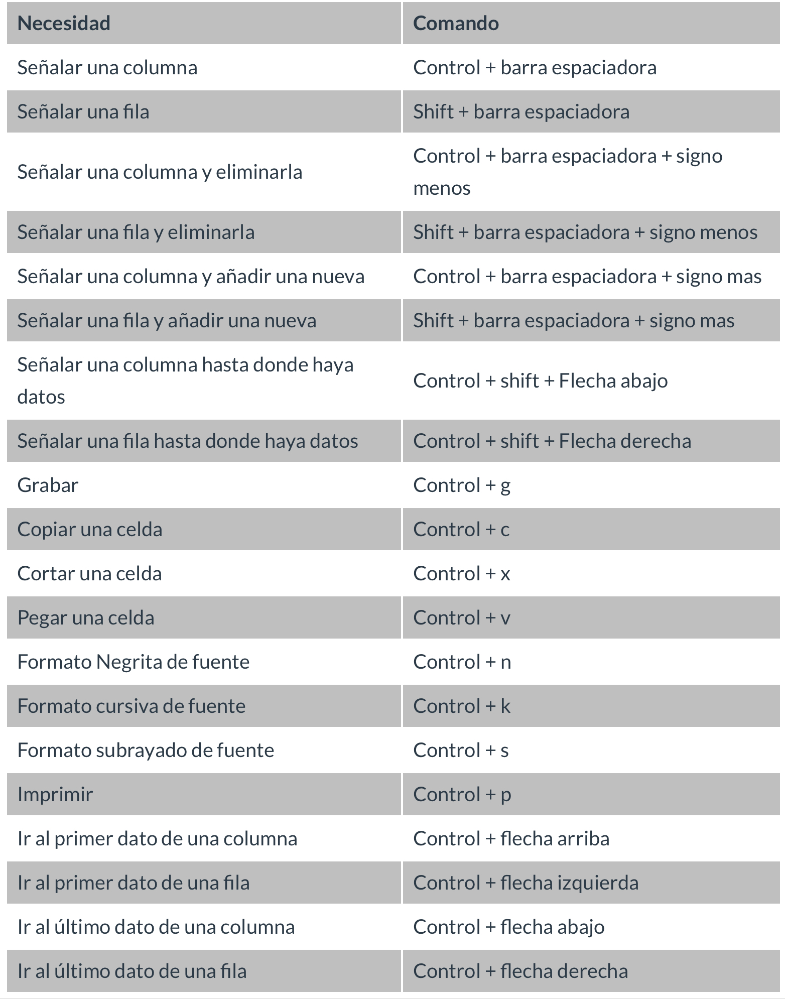

# Excel Básico

## Comandos para agilizar tu trabajo en Excel

* Control + barra espaciadora: Señalar una columna	
* Shift + barra espaciadora: Señalar una fila	
* Control + barra espaciadora + signo menos: Señalar una columna y eliminarla	
* Shift + barra espaciadora + signo menos: Señalar una fila y eliminarla	
* Control + barra espaciadora + signo mas: Señalar una columna y añadir una nueva	
* Shift + barra espaciadora + signo mas: Señalar una fila y añadir una nueva	
* Control + shift + Flecha abajo: Señalar una columna hasta donde haya datos	
* Control + shift + Flecha derecha: Señalar una fila hasta donde haya datos	
* Control + g: Guardar	
* Control + c: Copiar una celda	
* Control + x: Cortar una celda	
* Control + v: Pegar una celda	
* Control + n: Formato Negrita de fuente	
* Control + k: Formato cursiva de fuente	
* Control + s: Formato subrayado de fuente	
* Control + p: Imprimir	
* Control + flecha arriba: Ir al primer dato de una columna	
* Control + flecha izquierda: Ir al primer dato de una fila	
* Control + flecha abajo: Ir al último dato de una columna	
* Control + flecha derecha: Ir al último dato de una fila	

Control + a Abrir un archivo
Control + b Buscar y reemplazar
Control + e Seleccionar todo
Control + i Ir a…
Control + q/t Crear tabla
Control + r Cerrar Hoja de Excel
Control + s Subrayado
Control + v Pegar
Control + x Cortar
Control + y Rehacer
Control + z Deshacer
control + shift + L: añadir filtro

## Introducción al curso

Exploraremos desde lo básico y seguiremos avanzando.

Para este curso se va a trabajar con la versión de Excel de Office 365

## Como importar datos y crear un nuevo archivo

Primero descargamos el data set:

[E-commerce Public Dataset by Alibaba](https://www.kaggle.com/AppleEcomerceInfo/ecommerce-information/version/1#vendor.txt)

Excel de manera predeterminada va a buscar archivos .xlx, podemos modificar esto para que nos deje ver todos los archivos. 

Al ser un archivo de texto y no de Excel nos saldrá una ventana que nos preguntara como queremos abrir la información:

En esta ventana podremos elegir los archivos a abrir con tres pasos, en cada uno podremos editar cosas diferentes:

1. Anchura 
2. Separación 
3. Formato de columnas y filas

En Excel la información siempre estará separada por columnas y filas.

## Barra de menú y sus funcionalidades

Primero comenzaremos con las herramientas básicas del **menu inicio**, aquí aprenderemos a interactuar con la información y poder procesarla adecuadamente. 

Dentro de este menu tenemos:

- **Fuente:** es todo lo que tiene que ver con la información que tenemos dentro de las celdas.
- **Alineación:** es hacia donde queremos que esté ubicado el contenido que tenemos dentro de las celdas.
- **Número:** aquí trabajamos con las celdas que tengan información numérica, podemos cambiar el formato de los números que tenemos.
- **Portapapeles:** aquí encontraremos las opciones de pegado.

## Filtros y herramientas de revisión

Vamos a revisar herramientas adicionales que podemos utilizar: 

- Tablas dinámicas
- Tablas
- Menu de diseño
- Ordenar
- Filtrar
- Comentarios

Hay que tener cuidado con el filtro, ya que si solo le ponemos a unas celdas de la información y damos ordenar podemos perder la información que tenemos. 

En un comentario puedes interactuar con otra persona, mientras que en las notas queda el texto sin  interacción. 

## Funcionalidades de un libro y sus hojas

Cada vez que hablamos de un archivo dentro de Excel hablamos de un libro, este está compuesto por varias hojas, que a su vez tienen celdas. 

Por defecto la primera hoja del libro se pone con el nombre del archivo, pero esto lo podemos modificar. 

No puede haber 2 hojas con el mismo nombre. 

En nivel de jerarquías tenemos:

- Libro
- Hojas
- Celdas

## Herramientas para trabajar con bases de datos

Excel tiene herramientas para analizar grandes cantidades de información.

Cuando tenemos grandes cantidades de información con títulos, al navegar entre la información perdemos estos títulos que puede hacer que cometamos errores en al manipular la información, para esto podemos utilizar la función **Inmovilizar.** 

Esta función lo que hace es dejar los títulos siempre visibles. 

Al aplicar filtros, también podemos hacerlo por colores. 

## Comandos para agilizar tu trabajo en Excel

Dentro de Excel hay muchas funcionalidades que podemos utilizar, los comandos nos ayudan a hacerlas de forma rápida.

# Herramientas para trabajar con la información

## Consulta información con BUSCARV

La información no siempre la recibes con todo ordenado, para eso nos sirve mucho esta formula. 

Esto nos sirve para traer información específica de un libro a otro. 

Para esto utilizamos la siguiente formula:

## Valores absolutos y relativos en una fórmula

Al aplastar la tecla F2 en nuestro teclado, nos mostrará la formula que tenemos dentro de una celda. 

Para fijar una celda dentro de una formula debemos aplicar signos de moneda o aplastar la tecla F4. 

Al aplastar la tecla F4 nos dejará la celda fija tanto de manera vertical, como de manera horizontal, si no queremos que sea así, podemos modificarlo dejando el símbolo de dólar solo ya sea solo en la letra o en el número. 

Cuando utilizamos BUSCARV las columnas que pedimos para traer tendrán el número de acuerdo a las que seleccionemos, es decir, se contara desde uno donde comencemos a seleccionar. 

## Consultar horizontales con BUSCARH y tipos de errores en fórmulas

Esta formula la aplicaremos para buscar archivos de forma horizontal. 

Para transformar información de formato vertical a formato horizonal, podemos copiar la información y aplicar el pagado espacial haciendo click derecho con el mouse:

Dentro del cuadro de pegado especial elegimos la opción trasponer y le damos a aceptar, con eso la información pasara de estar en formato vertical a formato horizontal. 

La formula de BUSCARH funciona igual que BUSCARV, con la única diferencia que ahora contaremos de manera horizontal. 

### **Errores que pueden aparecer**

Esto significa que no hay el valor que buscamos dentro de nuestra base de datos. 

Este error significa que al momento de escribir la formula, algo escribimos mal. 

Quiere decir que le estamos pidiendo hacer referencia a una celda que ya no existe. 

Aparece cuando estamos dividiendo un valor por 0, por lo que no nos puede dar una respuesta. 

Ocurre cuando queremos sumar valores numéricos con letras, ya que Excel no puede sumar valores de entrada distinta. 

## Formato de celdas y archivos

Solo al tener los formatos correctos podremos manejar adecuadamente la información. 

Podemos ocultar filas, para esto aplastamos click izquierdo o derecho en la fila o columna que queremos ocultar y hacemos click en ocultar. 

Tambien podemos pegar el formato de una celda, con esto podemos pasar el color y tipo de letra de la celda que tenemos, para esto nos ponemos sobre la celda que queremos copiar el formato y hacemos click en la brocha de copiar:  

Una vez hemos copiado la información debemos de seleccionar las celdas que queremos que tengan el nuevo formato y listo. 

Al nosotros haber traído los datos con la fórmula BUSCAV o BUSCARH, dentro de las celdas se mantendrá esta formula, esto es bueno si nosotros vamos a seguir modificando la información dentro del archivo que nos trajimos la información, pero si esta información va a permanecer fija podemos copiar los contenidos de las celdas como valores, esto lo hacemos con el pegado especial que aprendimos antes. 

Cuando copiamos un elemento dentro de excel nos salen líneas que se van moviendo y representan que la información ha sido copiada en nuestro portapapeles:

Si queremos dejar de verla debemos presionar la tecla Esc. 

Dentro de excel las fechas también son valores con los que podemos operar, es decir, podemos realizar operaciones matemáticas con las fechas que tenemos. 

Dentro de la configuración de nuestra computadora puede que por el idioma que tenemos se utilice la como (,) o el punto (.) para expresar decimales o miles, esta configuración la podemos modificar entrando al menu archivo y dirigiendonos a configuración, en configuración avanzada podemos seleccionar cual opción es mejor para el documento con el que estamos trabajando.

Otra función importante que podemos utilizar es la de remplazar, esta la podemos utilizar para cambiar información muy grande de manera rápida y sencilla, para esto debemos de seleccionar la columna, fila o todo el archivo, donde se encuentre la información que queremos modificar y con las teclas Ctrl B o Ctrl L en la ventana de buscar ponemos la información que queremos buscar para en la ventana de remplazar poner la información por la que la queremos reemplazar. 

## Malas prácticas al organizar una base de datos

El utilizar buenas practicas dentro de nuestras hojas de cálculo nos ayuda a entender adecuadamente la información que tenemos y a no tener que regresar a arreglar los archivos que tenemos. 

Debemos cuidar que la información que tenemos tenga congruencia con los datos que tenemos. 

La información que tengamos así no es ideal para bases de datos:

Lo mejor es que la base de datos tenga títulos y el detalle en las filas. 

Otro error que puede ocurrir es tener el formato de la celda como texto, esto lo que hace es que las formulas que insertemos no funcionen. 

Tambien podemos cometer el error de añadir espacios en las palabras que colocamos, esto hace que las celdas actúen totalmente diferentes para las formulas. Para eliminar estos espacios de manera ágil podemos utilizar la formula =ESPACIOS(CELDAS), esto lo que hace es eliminar los espacios que hay en las celdas. 

Otro error que podemos tener es cuando tenemos ceros a la izquierda, ya que excel los elimina, para corregir eso lo que podemos hacer es poner '00, con esto podremos mantener los ceros, pero con la condición de que no podemos aplicar formulas con estas celdas, pero si buscar. 

## Listas desplegables

La idea de tener la información ordenada es que lo que tenemos pueda ser revisada y entendida por varias personas. 

Las listas desplegables nos ayuda a que el contenido que vamos a colocar dentro de la celda ya este predeterminado. Para hacer esto vamos a validación de datos (figura con visto y equis):

Aquí seleccionamos que queremos que elija el valor de una lista y seleccionamos donde están esos valores. 

Tambien podemos tener sub estados que sean dependientes del primer estado que pusimos, para esto debemos:

- Poner las celdas agrupadas con el nombre del primer estado que queremos agrupar.

- Entramos a validación y ponemos la siguiente formula, donde la celda es la del primer estado.

## Como separar y juntar texto

Puede que en algunas ocasiones nos envíen información que no necesitamos que este junta, o que nos envíen información separada que necesitamos que este junta, para esto nos sirve las opciones de separar y juntar texto. 

Para hacer esto existen muchos métodos para hacerlo:

- **Separar el mes:** para separar el mes de una fecha que tengamos podemos utilizar la formula =MES(celda donde esta la fecha).
- **Separar nombres y apellidos:** para esto vamos a la pestaña de datos y seleccionamos texto en columnas,
    
    
    
    Dentro de las opciones seleccionamos como esta separada la información y listo. 
    
    
    
- Unir datos: para unir datos o concatenar la información, lo que aplicamos es una formula. Dentro de esta formula si queremos agregar un espacio utilizamos las comillas.

- Extraer un valor: para extraer información específica de una celda, utilizamos dos formulas.

## Fórmulas básicas

Para esto utilizaremos la barra de formulas:

Las fórmulas más conocidas y básicas para realizar operaciones son:

- Sumar
    
    
    
- Contar
    
    
    
- Promediar
    
    
    

Esta información también aparece de manera resumida en la parte inferior alado de la opción de zoom cuando seleccionamos una columna. 

Si tenemos valores que aparecen en decimales y queremos redondear ese valor, usamos la formula:

También podemos anidar fórmulas dentro de otras, como por ejemplo:

## Fórmulas con SUMAR.SI, [PROMEDIO.SI](http://promedio.SI) y CONTAR.SI

En el procesamiento es muy importante tener claro el objetivo tenemos y lo que deseamos hacer dentro de las hojas de cálculo. 

Sumar de manera **absoluta** es cuando queremos que sea una suma de toda la columna.

Sumar de manera **relativa** es cuando queremos que la suma sea específica.

Si queremos desordenar un poco la tabla que tenemos podemos utilizar la formula **=ALEATORIO(),** esto lo que hace es generar un número de manera aleatoria y después aplicamos un filtro a toda la columna sumando la de aleatorio.

Dentro de las sumas relativas aplicamos condicionales para poder realizar las operaciones matemáticas que necesitamos:

- Suma
    
    
    
- Contar
    
    
    
- Promedio
    
    
    

## Nombrar rangos y hacer operaciones

Dentro de las fórmulas que hacemos con Excel, existe una manera de hacer todavía más sencillo las operaciones que debemos realizar, para esto utilizamos los rangos. 

Un rango es un conjunto de celdas que puede ser de manera horizontal, vertical o matricial (horizontal y vertical juntos).

Para hacer rangos seleccionamos todas las celdas que queremos que conformen el rango y en el area del nombre de las celdas ponemos el nombre que queremos para los rangos:

## Promedio ponderado

Hay ocasiones en las que los datos que tenemos tienen diferentes pesos, como en las notas de un profesor. Para eso utilizamos el promedio ponderado.

Para hacer estos promedios aplicamos la siguiente formula:

## Funciones y formulas útiles para tu día a día

A continuación te dejo un resumen de las fórmulas que hemos visto hasta ahora en el curso y su utilidad. Esta información fue adaptada de la [página de Microsoft](https://support.office.com/es-es/excel) donde puedes profundizar también en otras funciones:

**BuscarV:** Use BUSCARV cuando necesite buscar elementos en una tabla o en un rango por fila. Por ejemplo, busque un precio de una parte de Automotive por el número de pieza o busque un nombre de empleado basándose en su identificador de empleado.

**BuscarH:** Busca un valor en la fila superior de una tabla o una matriz de valores y devuelve un valor en la misma columna de una fila especificada en la tabla o matriz. Use BUSCARH cuando los valores de comparación se encuentren en una fila en la parte superior de una tabla de datos y desee encontrar información que se halle dentro de un número especificado de filas.

Use BUSCARV cuando los valores de comparación se encuentren en una columna a la izquierda de los datos que desea encontrar.

**Suma:** La función suma agrega valores. Puede sumar valores individuales, referencias o rangos de celda o una combinación de las tres.

**Promedio:** Devuelve el promedio (media aritmética) de los argumentos. Por ejemplo, si el intervalo A1:A20 contiene números, la fórmula =PROMEDIO(A1:A20) devuelve el promedio de dichos números.

**Contar:** La función CONTAR cuenta la cantidad de celdas que contienen números y cuenta los números dentro de la lista de argumentos. Use la función CONTAR para obtener la cantidad de entradas en un campo de número de un rango o matriz de números.

**[Sumar.si](http://sumar.si/):** Use la función sumar. Si para sumar los valores de un intervalo que cumplen los criterios especificados. Por ejemplo, supongamos que en una columna que contiene números, desea sumar solo los valores mayores que 5. Puede usar la fórmula siguiente: = [sumar.Si](http://sumar.si/) (B2: B25, “>5”)

**[Promedio.si](http://promedio.si/):** Devuelve el promedio (media aritmética) de todas las celdas de un rango que cumplen unos criterios determinados.

**[Contar.si](http://contar.si/):** Use [CONTAR.SI](http://contar.si/), una de las funciones estadísticas, para contar el número de celdas que cumplen un criterio; por ejemplo, para contar el número de veces que una ciudad determinada aparece en una lista de clientes.

**Hoy:** Devuelve el número de serie de la fecha actual. El número de serie es el código de fecha-hora que Excel usa para los cálculos de fecha y hora. Si el formato de celda es General antes de especificar la función, Excel cambia el formato de celda a Fecha. Si desea ver el número de serie, debe cambiar el formato de celda a General o Número.

**Mes:** Devuelve el mes de una fecha representada por un número de serie. El mes se expresa como número entero comprendido entre 1 (enero) y 12 (diciembre).

**Espacios:** Elimina los espacios del texto, excepto el espacio normal que se deja entre palabras. Use ESPACIOS en texto procedente de otras aplicaciones que pueda contener un espaciado irregular.

**Concatenar:** La función CONCAT combina el texto de varios rangos o cadenas, pero no proporciona argumentos delimitadores o de IgnoreEmpty. CONCAT reemplaza la función concatenar. Sin embargo, la función CONCATENAR seguirá estando disponible por motivos de compatibilidad con versiones anteriores de Excel.

**Derecha:** DERECHA devuelve el último carácter o caracteres de una cadena de texto, según el número de caracteres especificado. DERECHAB devuelve el último carácter o caracteres de una cadena de texto, según el número de bytes especificado.

**Izquierda:** IZQUIERDA devuelve el primer carácter o caracteres de una cadena de texto, según el número de caracteres que especifique el usuario. IZQUIERDAB devuelve el primer carácter o caracteres de una cadena de texto, en función del número de bytes especificados.

**Redondear:** La función REDONDEAR redondea un número a un número de decimales especificado.

**Promedio ponderado:** La función SUMAPRODUCTO devuelve la suma de los productos de los rangos o matrices correspondientes. La operación predeterminada es la multiplicación, pero también es posible sumar, restar y dividir.

# Sacar el mayor provecho de los datos

## Fórmulas condicionales

Para las formulas anidadas debemos de tener cuidado con los valores que ponemos para no repetirlas:

Dentro de los condicionales tendremos tipos de verificadores:

- **(>) =**Mayor que
- **(<) =**Menor que
- **(=) =**Igual

## Formatos condicionales y el formato de semáforo

Podemos necesitar que dentro de los condicionales que hacemos tengamos un sistemas de colores para que sea más fácil de identificar nuestros datos, para esto vamos a la opción de formato condicional:

Dentro del formato condicional podemos aplicar nuestra propia regla y desde aquí ir aplicando la que nos sirva y con la que nos sintamos más cómodos: 

**Aplicar un semáforo**

Para aplicar un estilo de semáforo lo primero que debemos de hacer aplicar un condicional basado en números.

Hay que tener mucho cuidado con los números, ya que si los ponemos entre comillas en las formulas no nos reconocerá. 

## Tablas dinámicas

Para hacer tablas dinámicas hacemos click en generar una tabla dinámica y seleccionamos las opciones que nos convenga:

Al momento de crear una tabla dinámica nos salen los datos que tenemos y que podemos ir agregando a nuestra tabla dinámica:

Una vez creamos la tabla dinámica nos saldrán nuevas opciones:

Normalmente lo que debe ir dentro de los valores son valores con los que podamos operar.

Pero también podemos modificar las operaciones que se realizan:

Dentro de esta configuración de campo podemos modificar como se verán los valores:

Podemos ir agregando valores dentro de las etiquetas, pero si no nos gusta como se ve podemos cambiarla y poner un modelo clásico haciendo click derecho y eligiendo opciones de tabla dinámica:

Si queremos operar con los datos aplicamos formulas de la siguiente forma:

- Buscamos la opción calculos

- Elegimos campos calculados
    
    
    

Aquí ponemos la formula que queremos que haga.

Por último podemos aplicar filtros llevando la información que queremos filtrar a la zona:

## Gráficas

Las gráficas nos ayudan un montón a mejorar como se ven nuestros datos. 

Para hacer gráficos, siempre necesitamos tener tablas con la información ordenada. 

Entre los diferentes gráficos tenemos:

- **Barras:**

Haciendo click en cambiar fila o columna podemos cambiar estas para encontrar que es mejor para nosotros. 

Las filas de manera vertical nos sirven cuando tenemos pocas marcar para mostrar. 

- **Lineales:**

- **Participación o torta: (**siempre sabiendo que la torta suma 100%**)**

## Gráficas dinámicas y minigráficas

Vamos a tener nuevas gráficas, entre estas tenémos:

- **De tendencias:**
    
    Para hacer esta gráfica demos de utilizar la opción Seleccionar datos de la pestaña de diseño de gráfica y en la ventana que nos aparece modificamos como mejor nos convenga:
    
    
    
    
    
- **Participación con mas datos:**
    
    
    
- **Barras separando una respuesta:**

Dentro de las gráficas también podemos aplicar filtros de ser necesarios. 

Para hacer estas gráficas de manera adecuada lo que necesitamos es que la tabla donde se encuentra la información esta bien hecha:

**Gráficos dinámicos**

Para hacer gráficos dinámicos los podemos hacer desde una lista dinámica o los podemos crear desde la opción de gráficos dinámicos, donde nos saldrá una venta como hacer una tabla dinámica:

Para ir haciendo las gráficas dinámicas, lo hacemos igual que hacer una tabla dinámica:

**Mini gráficas**

Esta es una nueva gráfica que nos trae la versión de office 365.

Esto nos permite tener gráficas sencillas dentro de una celda.

Para esto utilizamos la sección de mini gráficos:

Algo muy bueno con las mini gráficas es que las podemos utilizar como si fueran fórmulas, es decir, podemos copiarlas y pegarlas para usarlas con nuevos datos. 

# Compartir información

## La importancia de proteger tu información

Esta opción es muy importante para cuando queremos enviar información y no queremos que la modifiquen o la dañen.

Para hacer esto debemos de primero tener nuestra hoja protegida:

Después vamos a ir a la pestaña de proteger y vamos a:

Desde esa opción lo podemos proteger y desproteger a nuestro gusto.

Podemos dejar celdas desprotegidas como sea mejor para nosotros, para esto primero tenemos que quitar el bloqueado de la celda que queremos modificar.

Incluso podemos proteger un libro entero:

## Imprimir

Siempre trata de evitar imprimir hojas de cálculo, puedes buscar formas para compartir de una mejor forma las hojas de cálculo.

Lo primero que debemos hacer para imprimir es poner la hoja en formativo horizontal, esto para ver cuanta información nos cabe.

Lo segundo que podemos hacer es reducir el tamaño de las celdas hasta encontrar la forma que nos quepa todo. 

Lo tercero es modificar el margen que tenemos, seleccionando margen estrecho. 

Lo cuarto es ajustar todo el contenido dentro de una página. 

Aquí lo más importante es definir que es lo más importante que necesitamos para imprimir. 

Lo otro que podemos hacer es modificar el área de impresión con la información que creemos es necesaria:

**Convertir en PDF**

Otra muy buena opción es convertir el archivo en un PDF.

Para esto vamos a la opción de impresoras y seleccionamos la que diga PDF, esto lo que hara será guardar el archivo como PDF.

## Crea un menú a tu reporte

Excel nos permite mostrar la información también de una manera interactiva. 

Para hacer esto podemos:

1. Ocultar filas y columnas que no nos sirven
2. Ocultar medidas de división de la hoja
3. Colocar un color
4. Insertar una forma
5. Convertir forma en botón (para hacer esto hacemos click derecho y camos a vínculo).

Los botones que creamos pueden ir incluso a archivos externos de nuestro libro de cálculo.