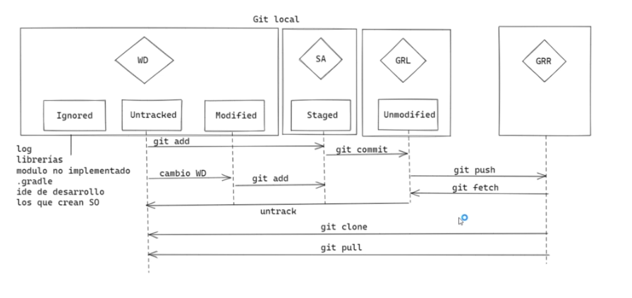

# Curso Profesional de Git y GitHub

## ¿Por qué usar un sistema de control de versiones como Git?

Un sistema de control de versiones como Git nos ayuda a guardar el historial de cambios y crecimiento de los archivos de nuestro proyecto.

En realidad, los cambios y diferencias entre las versiones de nuestros proyectos pueden tener similitudes, algunas veces los cambios pueden ser solo una palabra o una parte específica de un archivo específico. Git está optimizado para guardar todos estos cambios de forma atómica e incremental, o sea, aplicando cambios sobre los últimos cambios, estos sobre los cambios anteriores y así hasta el inicio de nuestro proyecto.

* **git init**: El comando para iniciar nuestro repositorio, o sea, indicarle a Git que queremos usar su sistema de control de versiones en nuestro proyecto

* **git add <nombre_archivo>** : El comando para que nuestro repositorio sepa de la existencia de un archivo o sus últimos cambios. 
Este comando no almacena las actualizaciones de forma definitiva, solo las guarda en algo que conocemos como “Staging Area” (no te preocupes, lo entenderemos más adelante).

* **git commit** : El comando para almacenar definitivamente todos los cambios que por ahora viven en el staging area. ambién podemos guardar un mensaje para recordar muy bien qué cambios hicimos en este commit con el argumento ==-m "Mensaje del commit"==

* **git add .** : Es un comando que nos permite agregar al repositorio todos los archivos a los cuales se le haya hecho algún cambio.

* **git status** : Permite ver el estado de la base de datos. Por ejemplo, podemos ver si hay algunos cambios que no se han guardado en el repositorio, y si no hay nada nos dirá que todo esta bien.

* **git show**: Mostrara todos los cambios que hemos hecho, esto incluye las líneas que hemos  cambiado, cuando y quien hizo dicho cambios.

* **git log** <nombre_archivo>: Muestra todo el historial del archivo.

* **git push** : si queremos mandar nuestros commits a un servidor remoto, un lugar donde todos podamos conectar nuestros proyectos

* **git push origin <nombre_rama>** : Sube la rama “nombre_rama” al servidor remoto.

* **git fetch** : Descarga los cambios realizados en el repositorio remoto.

* **git merge <nombre_rama>** : Impacta en la rama en la que te encuentras parado, los cambios realizados en la rama “nombre_rama”.

* **git pull** : Unifica los comandos fetch y merge en un único comando.

* **git checkout -b <nombre_rama_nueva>** : Crea una rama a partir de la que te encuentres parado con el nombre “nombre_rama_nueva”, y luego salta sobre la rama nueva, por lo que quedas parado en esta última.

* **git checkout -t origin/<nombre_rama>** : Si existe una rama remota de nombre “nombre_rama”, al ejecutar este comando se crea una rama local con el nombre “nombre_rama” para hacer un seguimiento de la rama remota con el mismo nombre.

* **git branch** : Lista todas las ramas locales.

* **git branch -a** :Lista todas las ramas locales y remotas.

* **git branch -d <nombre_rama>** : Elimina la rama local con el nombre “nombre_rama”.

* **git push origin <nombre_rama>** : Commitea los cambios desde el branch local origin al branch “nombre_rama”.

* **git remote prune origin** : Actualiza tu repositorio remoto en caso que algún otro desarrollador haya eliminado alguna rama remota.

* **git reset --hard HEAD** : Elimina los cambios realizados que aún no se hayan hecho commit.

* **git revert <hash_commit>** : Revierte el commit realizado, identificado por el “hash_commit”.

## Instalando Git y GitBash en Windows
Windows y Linux tienen comandos diferentes, graban el enter de formas diferentes y tienen muchas otras diferencias. Cuando instales Git Bash en Windows debes elegir si prefieres trabajar con la forma de Windows o la forma de UNIX (Linux y Mac) .

Ten en cuenta que, normalmente, los entornos de desarrollo profesionales tienen personas que usan sistemas operativos diferentes. Esto significa que, si todos podemos usar los mismos comandos, el trabajo resultará más fácil para todos en el equipo.

Los comandos de UNIX son los más comunes entre los equipos de desarrollo. Así que, a menos que trabajes con tecnologías nativas de Microsoft (por ejemplo, .NET), la recomendación es que elijas la opción de la terminal tipo UNIX para obtener una mejor compatibilidad con todo tu equipo.

## Instalando Git en Linux

Cada distribución de Linux tiene un comando especial para instalar herramientas y actualizar el sistema.

En las distribuciones derivadas de Debian (como Ubuntu) el comando especial es apt-get, en Red Hat es yum y en ArchLinux es pacman. Cada distribución tiene su comando especial y debes averiguar cómo funciona para poder instalar Git.

Antes de hacer la instalación, debemos hacer una actualización del sistema. En nuestro caso, los comandos para hacerlo son sudo apt-get update y sudo apt-get upgrade.

Con el sistema actualizado, ahora sí podemos instalar Git y, en este caso, el comando para hacerlo es sudo apt-get install git. También puedes verificar que Git fue instalado correctamente con el comando git --version

## Editores de código, archivos binarios y de texto plano

Un editor de código es una herramienta que nos brinda muchas ayudas para escribir código, algo así como un bloc de notas muy avanzado. Los editores más populares son VSCode, Sublime Text y Atom, pero no necesariamente debes usar alguno de estos para continuar con el curso.

Tipos de archivos y sus diferencias:

* **Archivos de Texto (.txt)** : Texto plano normal y sin nada especial. Lo vemos igual sin importar dónde lo abramos, ya sea con el bloc de notas o con editores de texto avanzados.
* **Archivos RTF (.rtf)** : Podemos guardar texto con diferentes tamaños, estilos y colores. Pero si lo abrimos desde un editor de código, vamos a ver que es mucho más complejo que solo el texto plano. Esto es porque debe guardar todos los estilos del texto y, para esto, usa un código especial un poco difícil de entender y muy diferente a los textos con estilos especiales al que estamos acostumbrados.
* **Archivos de Word (.docx)** : Podemos guardar imágenes y texto con diferentes tamaños, estilos o colores. Al abrirlo desde un editor de código podemos ver que es código binario, muy difícil de entender y muy diferente al texto al que estamos acostumbrados. Esto es porque Word está optimizado para entender este código especial y representarlo gráficamente.

Recuerda que debes habilitar la opción de ver la extensión de los archivos, de lo contrario, solo podrás ver su nombre. La forma de hacerlo en Windows es Vista > Mostrar u ocultar > Extensiones de nombre de archivo.

## Introducción a la terminal y línea de comandos

Diferencias entre la estructura de archivos de Windows, Mac o Linux.

* La ruta principal 
* En Windows es C:\, 
* En UNIX es solo /.

porque Windows no hace diferencia entre mayúsculas y minúsculas pero UNIX sí.

Recuerda que GitBash usa la ruta **/c** para dirigirse a **C:\\** (o /d para dirigirse a **D:\\**) en Windows. Por lo tanto, la ruta del usuario con el que estás trabajando es **/c/\<Users>/\<Nombre de tu usuario>**

Comandos básicos en la terminal:

* **pwd** : Nos muestra la ruta de carpetas en la que te encuentras ahora mismo.
* **mkdir** : Nos permite crear carpetas (por ejemplo, mkdir Carpeta-Importante).
* **touch** : Nos permite crear archivos (por ejemplo, touch archivo.txt).
* **rm** : Nos permite borrar un archivo o carpeta (por ejemplo, rm archivo.txt). Mucho cuidado con este comando, puedes borrar todo tu disco duro.
* **cat** : Ver el contenido de un archivo (por ejemplo, cat nombre-archivo.txt).
* **ls** : Nos permite cambiar ver los archivos de la carpeta donde estamos ahora mismo. Podemos usar uno o más argumentos para ver más información sobre estos archivos (los argumentos pueden ser -- + el nombre del argumento o - + una sola letra o shortcut por cada argumento).
    * **ls -a**: Muestra todos los archivos, incluso los ocultos.
    * **ls -l** : Ver todos los archivos como una lista.
    * **cd** : Nos permite navegar entre carpetas.
    * **cd /** : Ir a la ruta principal:
    * **cd** o **cd ~** : Ir a la ruta de tu usuario
    * cd carpeta/subcarpeta : Navegar a una ruta dentro de la carpeta donde estamos ahora mismo.
    * **cd ..** (cd + dos puntos) : Regresar una carpeta hacia atrás.
    * Si quieres referirte al directorio en el que te encuentras ahora mismo puedes usar **cd .** (cd + un punto).
    * **history** : Ver los últimos comandos que ejecutamos y un número especial con el que podemos repetir su ejecución.
    * **! + número** : Ejecutar algún comando con el número que nos muestra el comando history (por ejemplo, !72).
    * **clear** : Para limpiar la terminal. También podemos usar los atajos de teclado **Ctrl + L** o **Command + L**

**Consejos:**
Todos estos comandos tiene una función de autocompletado, o sea, puedes escribir la primera parte y presionar la tecla Tab para que la terminal nos muestre todas las posibles carpetas o comandos que podemos ejecutar. 

Si presionas la tecla Arriba puedes ver el último comando que ejecutamos.

Recuerda que podemos descubrir todos los argumentos de un comando con el argumento **--help** ==(por ejemplo, cat --help)==

## Crea un repositorio de Git y haz tu primer commit

Si quieres ver los archivos ocultos de una carpeta puedes habilitar la opción de Vista > Mostrar u ocultar > Elementos ocultos (en Windows) o ejecutar el comando ls -a.

Le indicaremos a Git que queremos crear un nuevo repositorio para utilizar su sistema de control de versiones. Solo debemos posicionarnos en la carpeta raíz de nuestro proyecto y ejecutar el comando **git init**

Recuerda que al ejecutar este comando (y de aquí en adelante) vamos a tener una nueva carpeta oculta llamada **.git** con toda la base de datos con cambios atómicos en nuestro proyecto.

Recuerda que Git está optimizado para trabajar en equipo, por lo tanto, debemos darle un poco de información sobre nosotros. No debemos hacerlo todas las veces que ejecutamos un comando, basta con ejecutar solo una sola vez los siguientes comandos con tu información:

~~~git
git config --global user.email "tu@email.com"
git config --global user.name "Tu Nombre"
~~~

Existen muchas otras configuraciones de Git que puedes encontrar ejecutando el comando **git config --list** (o solo git config para ver una explicación más detallada).

## Analizar cambios en los archivos de tu proyecto con Git

El comando **git show** nos muestra los cambios que han existido sobre un archivo y es muy útil para detectar cuándo se produjeron ciertos cambios, qué se rompió y cómo lo podemos solucionar. Pero podemos ser más detallados.

Si queremos ver la diferencia entre una versión y otra, no necesariamente todos los cambios desde la creación del archivo, podemos usar el comando **git diff commit_A commit_B**
lo recomendable es poner el anterior  y luego los nuevo commit para ver una mejor comparacion

Recuerda que puedes obtener el ID de tus commits con el comando **git log**

## ¿Qué es el staging y los repositorios? Ciclo básico de trabajo en Git

Para iniciar un repositorio, o sea, activar el sistema de control de versiones de Git en tu proyecto, solo debes ejecutar el comando **git init**

Este comando se encargará de dos cosas: primero, crear una carpeta **.git**, donde se guardará toda la base de datos con cambios atómicos de nuestro proyecto; y segundo, crear un área que conocemos como Staging, que guardará temporalmente nuestros archivos (cuando ejecutemos un comando especial para eso) y nos permitirá, más adelante, guardar estos cambios en el repositorio (también con un comando especial).

Ciclo de vida o estados de los archivos en Git:

Cuando trabajamos con Git nuestros archivos pueden vivir y moverse entre 4 diferentes estados (cuando trabajamos con repositorios remotos pueden ser más estados, pero lo estudiaremos más adelante):

* **Archivos Tracked**: son los archivos que viven dentro de Git, no tienen cambios pendientes y sus últimas actualizaciones ==han sido guardadas en el repositorio gracias a los comandos **git add** y **git commit**==

* **Archivos Staged** : son archivos en Staging. Viven dentro de Git y hay registro de ellos porque han sido afectados por el comando git add, aunque no sus últimos cambios. Git ya sabe de la existencia de estos últimos cambios, pero todavía ==no han sido guardados definitivamente en el repositorio porque falta ejecutar el comando **git commit**==.

* **Archivos Unstaged** : entiéndelos como archivos “Tracked pero Unstaged”. ==Son archivos que viven dentro de Git pero no han sido afectados por el comando git add== ni mucho menos por git commit. Git tiene un registro de estos archivos, pero está desactualizado, sus últimas versiones ==solo están guardadas en el disco duro==.

* **Archivos Untracked** : ==son archivos que NO viven dentro de Git, solo en el disco duro.== Nunca han sido afectados por git add, así que Git no tiene registros de su existencia.

Recuerda que hay un caso muy raro donde los archivos tienen dos estados al mismo tiempo: staged y untracked. Esto pasa cuando guardas los cambios de un archivo en el área de Staging (con el comando git add), pero antes de hacer commit para guardar los cambios en el repositorio haces nuevos cambios que todavía no han sido guardados en el área de Staging (en realidad, todo sigue funcionando igual pero es un poco divertido).

#### Comandos para mover archivos entre los estados de Git:

* **git status** : nos permite ver el estado de todos nuestros archivos y carpetas.(ver que archivo falta hacerles un **git add**)
* **git add** : nos ayuda a mover archivos del Untracked o Unstaged al estado Staged. Podemos usar git nombre-del-archivo-o-carpeta para añadir archivos y carpetas individuales o git add -A para mover todos los archivos de nuestro proyecto (tanto Untrackeds como unstageds).
* **git commit** : nos ayuda a mover archivos de Unstaged a Tracked. Esta es una ocasión especial, los archivos han sido guardados o actualizados en el repositorio. Git nos pedirá que dejemos un mensaje para recordar los cambios que hicimos y podemos usar el argumento -m para escribirlo (git commit -m "mensaje").

## ¿Qué es un Branch (rama) y cómo funciona un Merge en Git?

Git es una base de datos muy precisa con todos los cambios y crecimiento que ha tenido nuestro proyecto. ==Los commits son la única forma de tener un registro de los cambios.== Pero ==las ramas amplifican mucho más el potencial de Git.==

Todos los commits se aplican sobre una rama. Por defecto, siempre empezamos en la rama master (pero puedes cambiarle el nombre si no te gusta) y creamos nuevas ramas, a partir de esta, para crear flujos de trabajo independientes.

Crear una nueva rama se trata de copiar un commit (de cualquier rama), pasarlo a otro lado (a otra rama) y continuar el trabajo de una parte específica de nuestro proyecto sin afectar el flujo de trabajo principal (que continúa en la rama master o la rama principal).

Los equipos de desarrollo tienen un estándar: ==Todo lo que esté en la rama master va a producción, las nuevas features, características y experimentos van en una rama “development”== (para unirse a master cuando estén definitivamente listas) y los issues o errores se solucionan en una rama “hotfix” para unirse a master tan pronto como sea posible.

* **git branch --list** : Para ver todas las ramas.
* **git branch <nombre_de_la_rama>** : para crear una nueva rama.
* **git checkout <nombre_de_la_rama>** : sirve para cambiar de rama.
* **git merge <nombre_de_la_rama_que_quieres_jalar>** : sirve para combinar ramas.
* **git  branch -d \<name-of-the-new-branch>** : borrar una rama o branch
* **git checkout -b \<name-of-the-new-branch>** : creo la rama y hago el switch a la rama
* **git branch -m \<name-of-the-new-branch>** : cambiar nombre del branch o rama

Podemos crear todas las ramas y commits que queramos. De hecho, podemos aprovechar el registro de cambios de Git para crear ramas, traer versiones viejas del código, arreglarlas y combinarlas de nuevo para mejorar el proyecto.

Solo ten en cuenta que combinar estas ramas (sí, hacer “merge”) puede generar conflictos. Algunos archivos pueden ser diferentes en ambas ramas. Git es muy inteligente y puede intentar unir estos cambios automáticamente, pero no siempre funciona. En algunos casos, somos nosotros los que debemos resolver estos conflictos ==“a mano”==.

## Volver en el tiempo en nuestro repositorio utilizando reset y checkout

* **git checkout \<commit-ID>** : nos permite viajar en el tiempo. Podemos volver a cualquier versión anterior de un archivo específico o incluso del proyecto entero. Esta también es la forma de crear ramas y movernos entre ellas.

También hay una forma de hacerlo un poco más “ruda”: 
* **git reset \<commit-ID>** : En este commando, no solo “volvemos en el tiempo”, sino que borramos los cambios que hicimos después de este commit.

## Git reset vs. Git rm

#### git rm

Este comando nos ayuda a eliminar archivos de Git sin eliminar su historial del sistema de versiones. Esto quiere decir que si necesitamos recuperar el archivo solo debemos “viajar en el tiempo” y recuperar el último commit antes de borrar el archivo en cuestión.

Recuerda que git rm no puede usarse así nomás. Debemos usar uno de los flags para indicarle a Git cómo eliminar los archivos que ya no necesitamos en la última versión del proyecto:

* **git rm --cached** : Elimina los archivos de nuestro repositorio local y del área de staging, pero los mantiene en nuestro disco duro. Básicamente le dice a Git que deje de trackear el historial de cambios de estos archivos, por lo que pasaran a un estado untracked.
* **git rm --force** : Elimina los archivos de Git y del disco duro. Git siempre guarda todo, por lo que podemos acceder al registro de la existencia de los archivos, de modo que podremos recuperarlos si es necesario (pero debemos usar comandos más avanzados).

#### git reset

Este comando nos ayuda a volver en el tiempo. Pero no como git checkout que nos deja ir, mirar, pasear y volver. Con git reset volvemos al pasado sin la posibilidad de volver al futuro. Borramos la historia y la debemos sobreescribir. No hay vuelta atrás.

Este comando es muy peligroso y debemos usarlo solo en caso de emergencia. Recuerda que debemos usar alguna de estas dos opciones:

Hay dos formas de usar git reset: 
* **--hard** : borrando toda la información que tengamos en el área de staging (y perdiendo todo para siempre)  
Borramos todo el historial y los registros de Git pero guardamos los cambios que tengamos en Staging, así podemos aplicar las últimas actualizaciones a un nuevo commit
* **--soft** : un poco más seguro, que mantiene allí los archivos del área de staging para que podamos aplicar nuestros últimos cambios pero desde un commit anterior.

¡Pero todavía falta algo!

* **git reset HEAD** : Este es el comando para sacar archivos del área de staging. No para borrarlos ni nada de eso, solo para que los últimos cambios de estos archivos no se envíen al último commit, a menos que cambiemos de opinión y los incluyamos de nuevo en staging con git add, por supuesto.
  
y luego podemos usar el siguiente comando:

* **git restore \<name-archive>** : sacar los cambios de staging area

¿Por qué esto es importante?
Hacemos cambios en los archivos de un proyecto para una nueva actualización. Todos los archivos con cambios se mueven al área de staging con el comando git add. Pero te das cuenta de que uno de esos archivos no está listo todavía. Actualizaste el archivo, pero ese cambio no debe ir en el próximo commit por ahora.

#### Diferencias:
git rm solo elimina archivos (ya sea de staging o del disco duro).
git reset te envía a versiones antiguas y elimina archivos, historial y registros.

## Flujo de trabajo básico con un repositorio remoto

Por ahora, nuestro proyecto vive únicamente en nuestra computadora. Esto significa que no hay forma de que otros miembros del equipo trabajen en él.

Para solucionar esto están los servidores remotos: un nuevo estado que deben seguir nuestros archivos para conectarse y trabajar con equipos de cualquier parte del mundo.

Estos servidores remotos pueden estar alojados en ==**GitHub, GitLab, BitBucket**==, entre otros. Lo que van a hacer es guardar el mismo repositorio que tienes en tu computadora y darnos una URL con la que todos podremos acceder a los archivos del proyecto para descargarlos, hacer cambios y volverlos a enviar al servidor remoto para que otras personas vean los cambios, comparen sus versiones y creen nuevas propuestas para el proyecto.

Esto significa que debes aprender algunos nuevos comandos:

* **git clone <url_del_servidor_remoto>** : Nos permite descargar los archivos de la última versión de la rama principal y todo el historial de cambios en la carpeta .git.
* **git push** : Luego de hacer git add y git commit debemos ejecutar este comando para mandar los cambios al servidor remoto.
* **git fetch** : Lo usamos para traer actualizaciones del servidor remoto y guardarlas en nuestro repositorio local (en caso de que hayan, por supuesto).
* **git merge** : También usamos el comando git merge con servidores remotos. Lo necesitamos para combinar los últimos cambios del servidor remoto y nuestro directorio de trabajo.
* **git pull** : git fetch + git merge 

## Introducción a las ramas o branches de Git

Las ramas son la forma de hacer cambios en nuestro proyecto sin afectar el flujo de trabajo de la rama principal. Esto porque queremos trabajar una parte muy específica de la aplicación o simplemente experimentar.

La cabecera o HEAD representan la rama y el commit de esa rama donde estamos trabajando. Por defecto, esta cabecera aparecerá en el último commit de nuestra rama principal. Pero podemos cambiarlo al crear una rama (git branch rama, git checkout -b rama) o movernos en el tiempo a cualquier otro commit de cualquier otra rama con los comandos (git reset id-commit, git checkout rama-o-id-commit).

## Fusión de ramas con Git merge

* **git merge <name_of_branch>** : Este comando nos permite crear un nuevo commit con la combinación de dos ramas (la rama donde nos encontramos cuando ejecutamos el comando y la rama que indiquemos después del comando).

Crear un nuevo commit en la rama master combinando
los cambios de la rama cabecera:
> git checkout master
> git merge cabecera

Crear un nuevo commit en la rama cabecera combinando
los cambios de cualquier otra rama:
> git checkout cabecera
> git merge \<cualquier-otra-rama>

Asombroso, ¿verdad? Es como si Git tuviera super poderes para saber qué cambios queremos conservar de una rama y qué otros de la otra. El problema es que no siempre puede adivinar, sobretodo en algunos casos donde dos ramas tienen actualizaciones diferentes en ciertas líneas en los archivos. Esto lo conocemos como un conflicto y aprenderemos a solucionarlos en la siguiente clase.

**IMPORTANTE:**
Recuerda que ==al ejecutar el comando git checkout para cambiar de rama o commit puedes perder el trabajo que no hayas guardado.== Guarda tus cambios antes de hacer git checkout.

## Resolución de conflictos al hacer un merge

Git nunca borra nada a menos que nosotros se lo indiquemos. Cuando usamos los comandos git merge o git checkout estamos cambiando de rama o creando un nuevo commit, no borrando ramas ni commits (recuerda que puedes borrar commits con git reset y ramas con git branch -d).

Git es muy inteligente y puede resolver algunos conflictos automáticamente: cambios, nuevas líneas, entre otros. Pero algunas veces no sabe cómo resolver estas diferencias, por ejemplo, cuando dos ramas diferentes hacen cambios distintos a una misma línea.

Esto lo conocemos como conflicto y lo podemos resolver manualmente, solo debemos hacer el merge, ir a nuestro editor de código y elegir si queremos quedarnos con alguna de estas dos versiones o algo diferente. Algunos editores de código como VSCode nos ayudan a resolver estos conflictos sin necesidad de borrar o escribir líneas de texto, basta con hundir un botón y guardar el archivo.

**IMPORTANTE:**
Recuerda que siempre debemos crear un nuevo commit para aplicar los cambios del merge.
Si Git puede resolver el conflicto hará commit automáticamente. Pero, en caso de no pueda resolverlo, debemos solucionarlo manualmente y hacer el commit.

==Los archivos con conflictos por el comando git merge entran en un nuevo estado que conocemos como Unmerged.== Funcionan muy parecido a los archivos en estado Unstaged, algo así como un estado intermedio entre Untracked y Unstaged, solo debemos ejecutar git add para pasarlos al área de staging y git commit para aplicar los cambios en el repositorio.

## Uso de GitHub

GitHub es una plataforma que nos permite guardar repositorios de Git que podemos usar como servidores remotos y ejecutar algunos comandos de forma visual e interactiva (sin necesidad de la consola de comandos).

Luego de crear nuestra cuenta, podemos crear o importar repositorios, crear organizaciones y proyectos de trabajo, descubrir repositorios de otras personas, contribuir a esos proyectos, dar estrellas y muchas otras cosas.

El README.md es el archivo que veremos por defecto al entrar a un repositorio. Es una muy buena práctica configurarlo para describir el proyecto, los requerimientos y las instrucciones que debemos seguir para contribuir correctamente.

Para clonar un repositorio desde GitHub (o cualquier otro servidor remoto) debemos copiar la URL (por ahora, usando HTTPS) y ejecutar el comando git clone + la URL que acabamos de copiar. Esto descargara la versión de nuestro proyecto que se encuentra en GitHub.

Sin embargo, esto solo funciona para las personas que quieren empezar a contribuir en el proyecto. Si queremos conectar el repositorio de GitHub con nuestro repositorio local, el que creamos con git init, debemos ejecutar las siguientes instrucciones:

1. Primero: Guardar la URL del repositorio de GitHub HTTPS
2. abrir git bash en la carpeta de trabajo y escribir: 
   **git remote add origin URL** : agregara el repositorio remoto al repositorio local.
3. Verificar el repositorio remoto:
    **git remote** : repositorio remoto agregado
    **git remote -v** : opciones de repositorio remoto
4. Traer la versión del repositorio remoto y hacer merge para crear un commit con los archivos de ambas partes. Podemos usar git fetch y git merge
    primero probemos: **git push origin master**
    **git pull origin master --allow-unrelated-histories** : traer todos los archivos del repositorio remoto
5. ahora a guardar
    **git push origin master** : guarda los cambio en el repositorio remoto

## Cómo funcionan las llaves públicas y privadas

Las llaves públicas y privadas nos ayudan a cifrar y descifrar nuestros archivos de forma que los podamos compartir sin correr el riesgo de que sean interceptados por personas con malas intenciones.

La forma de hacerlo es la siguiente:

1. Ambas personas deben crear su llave pública y privada.
2. Ambas personas pueden compartir su llave pública a las otras partes (recuerda que esta llave es pública, no hay problema si la “interceptan”).
3. La persona que quiere compartir un mensaje puede usar la llave pública de la otra persona para cifrar los archivos y asegurarse que solo puedan ser descifrados con la llave privada de la persona con la que queremos compartir el mensaje.
4. El mensaje está cifrado y puede ser enviado a la otra persona sin problemas en caso de que los archivos sean interceptados.
5. La persona a la que enviamos el mensaje cifrado puede usar su llave privada para descifrar el mensaje y ver los archivos.

>Puedes compartir tu llave pública pero nunca tu llave privada.

## Configura tus llaves SSH en local

Primer paso: Generar tus llaves SSH. Recuerda que es muy buena idea proteger tu llave privada con una contraseña.

* ssh-keygen -t rsa -b 4096 -C "tu@email.com"
Segundo paso: Terminar de configurar nuestro sistema.

Se creara un archivo en ~/.ssh con dos archivo
1. id_rsa : es la llave privada (sin extension)
2. id_rsa.pub : es la llave publica(con extension)

En Windows y Linux:

Encender el "servidor" de llaves SSH de tu computadora:
* eval $(ssh-agent -s)

Añadir tu llave SSH a este "servidor":
* ssh-add ruta-donde-guardaste-tu-llave-privada
En Mac:

Encender el "servidor" de llaves SSH de tu computadora:
* eval "$(ssh-agent -s)"

## Conexión a GitHub con SSH

Luego de crear nuestras llaves SSH podemos entregarle la llave pública a GitHub para comunicarnos de forma segura y sin necesidad de escribir nuestro usuario y contraseña todo el tiempo.

Para esto debes entrar a la Configuración de Llaves SSH en GitHub, crear una nueva llave con el nombre que le quieras dar y el contenido de la llave pública de tu computadora.

Ahora podemos actualizar la URL que guardamos en nuestro repositorio remoto, solo que, en vez de guardar la URL con HTTPS, vamos a usar la URL con SSH:

* git remote set-url origin url-ssh-del-repositorio-en-github

si se quiere cambiar el nombre del remote entonces hacer lo siguiente:
* git remote rename origen origin

## Tags y versiones en Git y GitHub

Los tags o etiquetas nos permiten asignar versiones a los commits con cambios más importantes o significativos de nuestro proyecto.

Comandos para trabajar con etiquetas:

* **git tag -a \<version-o-release> -m "\<mensaje-explicativo>" \<hash-commit>** : Crear un nuevo tag y asignarlo a un commit.
* **git tag -d \<nombre-del-tag>** : Borrar un tag en el repositorio local.
* **git tag** : Listar los tags de nuestro repositorio local
* **git show-ref --tags** : Ver referencia de los commits a los que están conectados mi tags.
* **git push origin --tags** : Publicar un tag en el repositorio remoto.
* Borrar un tag del repositorio remoto
  1. **git tag -d \<nombre-del-tag>**
  2. **git push origin :refs/tags/\<nombre-del-tag>** : 

## alias en git
>comando para crear un alias global en git bash y ejecuta el siguiente comando:
* git log --all --graph --decorate --oneline

**Crear una alias:**
Para un proyecto:
* git config alias.arbolito "log --all --graph --decorate --oneline"

Global:
* git config --global alias.arbolito "log --all --graph --decorate --oneline"

~~~git
git config --global alias.superlog "log --graph --abbrev-commit --decorate --date=relative --format=format:'%C(bold blue)%h%C(reset) - %C(bold green)(%ar)%C(reset) %C(white)%s%C(reset) %C(dim white)- %an%C(reset)%C(bold yellow)%d%C(reset)' --all"
~~~

## Manejo de ramas en GitHub
Puedes trabajar con ramas que nunca envías a GitHub, así como pueden haber ramas importantes en GitHub que nunca usas en el repositorio local. Lo importante es que aprendas a manejarlas para trabajar profesionalmente.

Crear una rama en el repositorio local: 
* **git branch nombre-de-la-rama** o **git checkout -b nombre-de-la-rama**.
Publicar una rama local al repositorio remoto: 
* **git push origin \<nombre-de-la-rama>**
Recuerda que podemos ver gráficamente nuestro entorno y flujo de trabajo local con Git usando el comando gitk.
* **git show-branch** : historia de los branch
* **git show-branch --all**: solo con mas detalles

* **gitk** : muestra un software que viene con git todos los commits 
  

## Configurar múltiples colaboradores en un repositorio de GitHub
Por defecto, cualquier persona puede clonar o descargar tu proyecto desde GitHub, pero no pueden crear commits, ni ramas, ni nada.

Existen varias formas de solucionar esto para poder aceptar contribuciones. Una de ellas es añadir a cada persona de nuestro equipo como colaborador de nuestro repositorio.

Solo debemos entrar a la configuración de colaboradores de nuestro proyecto (Repositorio > Settings > Collaborators) y añadir el email o username de los nuevos colaboradores.

## Flujo de trabajo profesional: Haciendo merge de ramas de desarrollo a master

## Flujo de trabajo profesional con Pull requests

En un entorno profesional normalmente se bloquea la rama master, y para enviar código a dicha rama pasa por un code review y luego de su aprobación se unen códigos con los llamados merge request.

Para realizar pruebas enviamos el código a servidores que normalmente los llamamos staging develop (servidores de pruebas) luego de que se realizan las pruebas pertinentes tanto de código como de la aplicación estos pasan a el servidor de producción con el ya antes mencionado merge request.

## Git Rebase: reorganizando el trabajo realizado

rebase: reescribe la historia del repositorio, cambia la historia de donde comenzó la rama y solo debe ser usado de manera local.

es agarrar una rama y traerselo a la rama **main**, para luego eliminarlo. solo debe usarse en repositorios locales.

* **git rebase \<name-of-branch-used-to-fix-bugs>** : trae otra rama y los commit se trae a la rama en la que se esta ejecutando el rebase.

* **git branch -b <name-of-branch>** : borra una rama

## Git Stash: Guardar cambios en memoria y recuperarlos después

El stashed nos sirve para guardar cambios para después, Es una lista de estados que nos guarda algunos cambios que hicimos en Staging para poder cambiar de rama sin perder el trabajo que todavía no guardamos en un commit

Ésto es especialmente útil porque hay veces que no se permite cambiar de rama, ésto porque porque tenemos cambios sin guardar, no siempre es un cambio lo suficientemente bueno como para hacer un commit, pero no queremos perder ese código en el que estuvimos trabajando.

El stashed nos permite cambiar de ramas, hacer cambios, trabajar en otras cosas y, más adelante, retomar el trabajo con los archivos que teníamos en Staging pero que podemos recuperar ya que los guardamos en el Stash.

* **git stash** : sirve para guardar los cambios del Staging Area en un espacio de la memoria, asi evitamos hacer commit y poder pasarnos a otra rama

* **git stash list** : todos los stash guardados

* **git stash pop** : llamar los cambios que no se hicieron commit y que se guardaron en el espacio de memoria.
* **git stash drop** : sirve para eliminar un stash guardado.

* git stash branch <branch-name> : crea una rama y trae el stash
## Git Clean: limpiar tu proyecto de archivos no deseados

Mientras estamos trabajando en un repositorio podemos añadir archivos a él, que realmente no forma parte de nuestro directorio de trabajo, archivos que no se deberían de agregar al repositorio remoto.

El comando clean actúa en archivos sin seguimiento, este tipo de archivos son aquellos que se encuentran en el directorio de trabajo, pero que aún no se han añadido al índice de seguimiento de repositorio 

* git clean --dry-run : muestra un listado de los archivosq ue vamos a borrar

* git clean -f: elimna los archivo que se muestar con el --dry-run. solo borra archivos que puede indexar.

* git stash branch <branch-name> : trae los cambios del stash a esta nueva rama.
## Git cherry-pick: traer commits viejos al head de un branch

Este comando permite coger uno o varios commits de otra rama sin tener que hacer un merge completo. Así, gracias a cherry-pick, podríamos aplicar los commits relacionados con nuestra funcionalidad de Facebook en nuestra rama master sin necesidad de hacer un merge.

* **git log --oneline** : para ver todos los commit de un branch
* **git cherry-pick \<hash-del-commit>** : trae un o varios commits a la rama en la que se esta. no es buena practica pero si se utiliza, se be saber lo que se hace.

## Reconstruir commits en Git con amend

A veces hacemos un commit, pero resulta que no queríamos mandarlo porque faltaba algo más

* **git add \<archive-name>** : add the archive you needed to modified.
* **git commit --amend** : modifica el ultimo commit y cambia el mensaje del commit. se abrira vim para modificar el mensaje del commit anterior.
* **git commit --amend -m "Descripción del commit"** : modifica el ultimo commit pero con esto ya no se abre el editor de vim.
* **git commit --amend --no-edit** : edita solo el mensaje del commit.
 
Es muy util, pero hay que tener cuidado en algunos casos, como en el caso de que el commit que quieras enmendar lo hayas pusheado al repositorio remoto, entonces quieras enmendar un commit que esta en remoto.

## Git Reset y Reflog: úsese en caso de emergencia

tener en cuenta que GIT NUNCA OLVIDA, Git guarda todos los cambios aunque decidas borrarlos, al borrar un cambio lo que estás haciendo sólo es actualizar la punta del branch, para gestionar éstas puntas existe un mecanismo llamado registros de referencia o reflogs.

* **git reflog** : si deseas ver cómo has modificado la historia dentro de este repositorio. 

copiaremos uno de los hash del git reflog y lo usamos en el siguiente comando.
* **git reset --hard eff544f** : Perderá todo lo que se encuentra en staging y en el Working directory y se moverá el head al commit eff544f
* **git reset --soft eff544f** : Te recuperará todos los cambios que tengas diferentes al commit eff544f, los agregará al staging area y moverá el head al commit eff544f

**git reset** es una mala práctica, no deberías usarlo en ningún momento; debe ser nuestro último recurso.

## Buscar en archivos y commits de Git con Grep y log

##### buscar palabras en los archivos en el branch actual
* **git grep "palabra a buscar"**
mostrar la linea en la cual la palabra aparece en el archivo.

* **git grep -n "palabra a buscar"**
mostrar cuantas veces aparce la palabra en cada archivo

* **git grep -c "palabra a buscar"**
buscar los commits en los cuales sale una palabra
##### buscar en commits
* **git log -S "palabra a buscar"**
busca la palabra en los mensajes de los commits

## Comandos y recursos colaborativos en Git y GitHub

* **git shortlog** : Ver cuantos commits a hecho los miembros del equipo
* **git shortlog -sn** : Las personas que han hecho ciertos commits
* **git shortlog -sn --all** : Todos los commits (también los borrados)
* **git shortlog -sn --all --no-merges** : muestra las estadisticas de los comigs del repositorio donde estoy
* **git config --global alias.stats “shortlog -sn --all --no-merges”**: configura el comando “shortlog -sn --all --no-merges” en un Alias en las configuraciones globales de git del pc
* **git blame -c blogpost.html** : Muestra quien ha hecho cambios en dicho archivo identado
* **git blame** --help: Muestra en el navegador el uso del comando
* **git blame archivo -L 35, 60 -c** : Muestra quien escribio el codigo con informacion de la linea 35 a la 60, EJ: git blame css/estilos.css -L 35, 60 -c
* **git branch -r** : Muestra las Ramas remotas de GitHub
* **git branch -a**: Muestra todas las Ramas del repo y remotas de GitHub