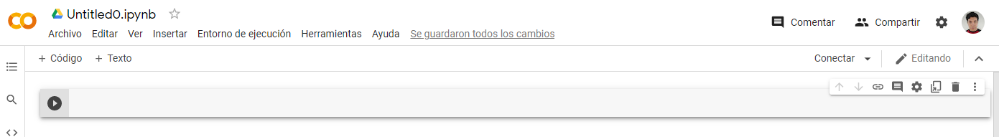

# Curso de Entorno de Trabajo para Ciencia de Datos con Jupyter Notebooks y Anaconda

# Introducción a las notebooks

## ¿En qué lugares programar para ciencia de datos?

**Objetivos**

- Identificarás tu lugar óptimo para comenzar a practicar tus habilidades de ciencia de datos.
- Aprenderás a utilizar diferentes tipos de Jupyter Notebooks.
- Instalarás herramientas elementales para programar para ciencia de datos.
- Dominarás el manejo de ambientes virtuales con CONDA.

**¿En qué lugares programar?**

- En tu navegador
- De Forma local (con un IDE o editor de código)
- En el servidor de tu empresa
- En tu celular

El sistema operativo no importa. Puedes usar el que gustes. Aunque los científicos de datos prefieren usar un sistema Linux. Además, si eres de Windows, existe WSL.

Existen muchas herramientas para programar, pero todas estas tienen algo en común, los Notebooks.

Antes lo habitual para trabajar con Python era escribir un archivo de código, ejecutarlo desde la terminal y si no funcionaba como queríamos, cambiamos el código y lo ejecutamos otra vez (desde el principio).

Un sujeto llamado Fernando Perez comenzó a trabajar en un proyecto llamado IPython. Esta herramienta ampliaba la funcionalidad por defecto del REPL de Python.

El REPL es un componente de Python que significa Read, Evaluate, Print, Loop. IPython añadía otras características adicionales. Con esto el desarrollo de código se convirtió en algo más dinámico.

Este proyecto creció hasta convertirse en los Jupyter Notebooks, que nos permite tener además poder escribir notas en nuestros Notebooks, para documentar de mejor manera. Con Jupyter Notebooks podemos crear reportes de código ejecutables, y no solo están disponibles para Python sino para otros lenguajes, como R o Julia.

**Notebooks VS Scripts**

- Ambos son útiles
- Organización. En un script solo podrás escribir código (máximo podrás usar comentarios). En un Notebook podrás usar texto enriquecido.
- Experimentación y prototipado. Podemos escribir el código primero en un Notebook, probarlo, y si esta bueno, pasarlo a un Script.
- Objetivo

## ¿En qué lugares programar para ciencia de datos?

Google Colab (o simplemente Colab) es una herramienta para crear Notebooks que funciona en el navegador. Para usarla basta con tener una cuenta de Google.

**Notebooks en la nube VS locales**

- Ambos son útiles
- Configuración de entorno. En la nube ya esta todo configurado. En local, la configuración la tiene que hacer tu mismo (aunque no es difícil).
- Tiempos de ejecución. En la nube hay más capacidad de computación.
- Escalabilidad

Google Colab es un servicio en la nube, basado en Jupyter Notebooks, el cuál no requiere configuración, y trabaja a nivel de archivo. Provee uso gratuito de GPUs y TPUs.

Para empezar nos dirigimos a esta página: [https://colab.research.google.com](https://colab.research.google.com/).

Se nos mostrará un menú con varias secciones, mostrándonos la sección de Proyectos Recientes.

La sección Subir nos permite subir a nuestra nube archivos que tengamos localmente.

La sección Ejemplos nos muestra plantilla de Notebooks, incluso Notebooks que hablan de como trabajar con Notebooks en Google Colab.

Otra forma de entrar a Google Colab es desde Drive. Nos dirigimos a [Google Drive](https://drive.google.com), y en la página principal hacemos clic en Nuevo > Más > Google Colaboratory. Esto crea un Notebook vacío.



Una vez dentro del Notebook, para empezar a escribir código hacemos clic en Conectar. Esto preparará la computadora virtual para nuestro proyecto. Una vez se muestre un signo de check, la computadora virtual ya estará lista, mostrándonos la capacidad en RAM y en Disco que tenemos disponible.

El bloque que aparece al principio sirve para escribir código en él y ejecutarlo. Una vez escrito algo (lo que sea, con tal que sea código de Python), para ejecutarlo hacemos clic en el botón de Play a su izquierda (también podemos usar `Ctrl + Enter`). Si el código realiza alguna impresión (por ejemplo usando un `print`), este se mostrará en la parte de abajo una vez terminada la ejecución del código.


A cada bloque de código (porque podemos tener más) que tenemos en un Notebook también se le llama celda, y las celdas no solo pueden ser de código. También pueden ser de texto enriquecido (código markdown previsualizado) e imágenes (incluso GIFs).

Si un bloque solo tiene una expresión, pero no hay `print`, lo que resulte de esa expresión será mostrado igualmente.


Cuando tenemos un bloque donde declaramos variables, estas estarán disponibles en bloques siguientes (siempre y cuando los primeros bloques ya se han ejecutado antes).


Podemos ejecutar comandos de terminal en los bloques de código. Para ello usamos el signo `!` antes del comando.


Podemos usar esta característica para instalar librerías en nuestro proyecto. Recuerda que para instalar una librería de Python usamos pip (`pip install <libreria>`). También recuerda que para usar una librería debemos importarla, y esto se hace en algún bloque de código (de preferencia en uno que esté al principio).

<aside>
🧠 Las características antes vistas no son exclusivas de Google Colab, es decir, también las tienen otras herramientas que veremos más adelante.

</aside>

## Google Colab: ciencia de datos

**Subir archivos y usarlos en bloques de código**

En Ciencias de Datos necesitamos datos. Para poder usar datos en Google Colab, en la barra izquierda en Archivos (ícono de carpeta), veremos que tenemos una carpeta *sample_data*, dentro de la cuál Colab ya nos provee de algunos datos de prueba.

Para subir archivos simplemente los arrastramos a este menú. Ten en cuenta que después de un tiempo que dejes de usar el Notebook estos archivos serán eliminados.

Dependiendo del tipo de archivo, Colab permitirá mostrarnos su contenido haciendo doble clic en el mismo. Por ejemplo, para archivos ***.csv*** se abrirá una vista de tabla.

Otra forma de subir archivos es haciendo clic en la primera opción (de las tres que se muestran arriba de las carpetas), y seleccionando el archivo a subir.

La tercera opción (la de la carpeta con el logo de Drive) sirve para activar la opción de usar archivos de Drive. Al hacer clic te pedirá que ejecutes un bloque de código (autogenerado) y que pegues un código de autorización, el cuál obtendrás a través de un link que el mismo bloque mostrará. Después de esto en los Archivos aparecerá la carpeta *drive*, donde se encuentran los archivos de tu Drive listos para usarse.

Recordemos que podemos usar comandos de terminal en un bloque de código. Para usar archivos en estos comandos, las rutas se forman de acuerdo al árbol de archivos que nos muestra el panel de Archivos. Por ejemplo, para usar un archivo de drive, su ruta sería `drive/MyDrive/<archivo>`. Sabrás si estas usando una ruta correcta si obtienes autocompletado al escribirla.

**Librerías de Google Colab**

Cuando creamos un Notebook en Colab, este ya tiene algunas librerías instaladas. Algunas de estas son:

- 📊 **matplotlib**: Generación de gráficos a partir de listas o arrays.
- 🧑‍💻 **numpy**: Cómputo científico para la manipulación de vectores.
- 🧑‍💻 **pandas**: Manipulación y análisis de datos de tablas y series temporales.
- 🧑‍💻 **scipy**: Herramientas y algoritmos matemáticos.
- 📊 **seaborn**: Visualización de datos estadísticos.

Algunas de estas librerías funcionan bien con Notebooks. Algunas proveen de métodos que al ejecutarlos nos muestran resultados gráficos, como gráficos estadísticos.

**Snippets de código**

En la barra lateral, en la opción Fragmentos de código (ícono de brackets) podemos explorar algunos fragmentos (snippets) de código para realizar tareas comunes. En la barra de búsqueda, si buscamos `visual`, tendremos algunos snippets para visualización de datos, los cuáles usan las librerías que Colab ya provee.

Para usar un snippet basta con hacer doble clic sobre el mismo y se insertará un bloque de código con el snippet, listo para ser ejecutado.

Atajos de teclado

Si presionamos `Ctrl + Shift + P` aparecerá una barra de comandos (muy parecida a la de VSCode). Esta barra nos permite buscar entre los distintos comandos o acciones que queramos hacer en nuestro proyecto.

Un comando muy útil es el de mostrar atajos.

## Utilizar Deepnote

Deepnote es un servicio en la nube, basado en Jupyter Notebooks, el cuál no requiere configuración y, a diferencia de Colab, trabaja a nivel de proyecto.

Deepnote provee colaboración en tiempo real, integración con múltiples Apps y acceso a una terminal o línea de comandos. También permite almacenar variables de entorno y publicar proyectos (esto te puede servir para construir un portafolio).

Para trabajar con Deepnote nos dirigimos a [deepnote.com](http://deepnote.com). Tendremos que iniciar sesión y lo podremos hacer con Google o con Github. Una vez iniciada sesión veremos nuestro Dashboard.

Deepnote trabaja a nivel de proyectos. Para crear un proyecto hacemos clic en el botón `+ New Project`. Esto creará el proyecto con nuestro primer Notebook.

Para ejecutar los bloques de código de un Notebook hacemos clic en `> Run notebook` en la parte superior.

Para subir archivos simplemente los arrastramos desde nuestro equipo al panel izquierdo donde se encuentra el árbol de archivos (Files).

En la barra lateral, en `Integrations` (ícono de 4 cuadrados), podemos seleccionar las integraciones con otras apps que queramos, haciendo clic en `Add` en la integración. Dependiendo de la integración se deben seguir algunos pasos. Por ejemplo, para integrar con Google Drive debemos autorizar a Drive y luego darle un nombre a la integración. Después de esto, la integración aparecerá arriba en la parte de Active Integrations.

Algunas integraciones nos proveen de un botón `How to use` para saber como usarlas. Por ejemplo, para acceder a nuestro drive usamos la ruta `/datasets/drive`

Al igual que Google Colab (y otras herramientas), Deepnote provee a los proyectos librerías de comunes de ciencias de datos.

Una diferencia importante con Colab, es que en Colab podemos agregar solo bloques de código o de texto cuando nos posicionamos entre dos bloques. En Deepnote, tenemos las opciones Block y Code, donde en Block se nos muestra una lista extensa con más tipos de bloque.

Un bloque especial es el de Graph, el cuál nos permite visualizar una gráfica de un dataframe de forma interactiva, con un menú de opciones al lado.

Deepnote también tiene una barra de comandos. Para abrirla usamos el atajo `Ctrl + P` (nota que es diferente al de Colab).

Podemos publicar nuestro proyecto. Para ello en la barra de navegación hacemos clic en Share y activamos la opción Share Project. Una vez publicado, cualquiera que tenga el link del proyecto podrá abrirlo y verlo. También podemos especificar que pueden hacer con el Notebook (si pueden solo verlo o también pueden editarlo).

En este mismo menú también podemos administrar los colaboradores del proyecto. La sección Publishing sirve para publicar el proyecto pero como si fuese una página web, la cuál podremos compartir en redes sociales.

En la barra lateral, en la opción `Terminal` (ícono de terminal) podemos ver las terminales de nuestro proyecto. Al principio no habrá ninguna, pero una vez agregada una podremos usar una terminal en nuestro proyecto.

# Configuración de VSCode

## Instalar VSCode

**Editores de código VS IDEs**

Colab y Deepnote tienen algunas características especiales a la hora de escribir código, que nos facilitan la vida como programadores:

- Sin texto formateado
- Resaltar sintaxis
- Autocompletado
- Detectar errores de sintaxis

Para trabajar en local tenemos 2 alternativas: editores de código o IDEs (Integrated Development Environment, o Entornos de Desarrollo Integrado). Los editores se enfocan en varios lenguajes mientras que los IDEs se enfocan en uno solo.

Los editores de código pueden ser potenciados a través de extensiones o plugins para obtener funcionalidades de algún IDE.

Los editores son gratuitos siempre mientras que los IDEs tienen una capa gatuita y una de pago.

Para Python existe PyCharm como IDE y VSCode y Atom como editores de código (hay más). En nuestro caso usaremos VSCode, ya que es uno de los editores más usados en el mundo.

**Instalación de VSCode**

Página para descargar VSCode: [https://code.visualstudio.com/download](https://code.visualstudio.com/download)

## Instalar WSL: usa Linux dentro de Windows

Ver lectura: [https://platzi.com/clases/2434-jupyter-notebook/40390-wsl-usa-linux-dentro-de-windows/](https://platzi.com/clases/2434-jupyter-notebook/40390-wsl-usa-linux-dentro-de-windows/)

## Agregar extensiones para VSCode

Antes de instalar extensiones en VSCode siempre es buena idea activar la sincronización de extensiones. Esto se hace en la barra izquierda, en Accounts (ícono de usuario, penúltima opción) > Turn On Settings Sync.

En la parte superior te preguntará que es lo que quieres sincronizar (de preferencia déjalo todo marcado). Hacemos clic en Sign In & Turn On y escogemos con que cuenta iniciar sesión (si con Microsoft o con Github). Dependiendo de que opción escojamos se abrirá una ventana en nuestro navegador para realizar la autorización.

<aside>
🧠 Si es la segunda o posterior vez que activas la sincronización, y ya la habías activado antes, se te preguntará si quieres traer tus ajustes en la nube a tu instalación local actual, o viceversa, si quieres enviar tus ajustes locales a la nube.
Si decidiste traer tus ajustes de la nube, en la barra de extensiones, en el filtro, escogiendo Installed podrás filtrar las extensiones instaladas y las que se están instalando.

</aside>

Ahora ya podemos instalar extensiones. Estas son algunas que necesitarás o que te facilitarán las cosas:

- [Python](https://marketplace.visualstudio.com/items?itemName=ms-python.python): para escribir código Python más fácilmente.
- [MagicPython](https://marketplace.visualstudio.com/items?itemName=magicstack.MagicPython): colorea el código de mejor manera.
- [Material Icon Theme](https://marketplace.visualstudio.com/items?itemName=PKief.material-icon-theme): provee íconos para tus carpetas y archivos tipo Material Design.
- [Rainbow Brackets](https://marketplace.visualstudio.com/items?itemName=2gua.rainbow-brackets): pinta los paréntesis de diferentes colores, para saber cuáles están correspondidos.
- [Remote Development](https://marketplace.visualstudio.com/items?itemName=ms-vscode-remote.vscode-remote-extensionpack): este es un pack de 3 extensiones para trabajar con entornos remotos, ya sea servidores externos, WSL o contenedores de Docker.

## Uso de VSCode notebooks

Cuando abrimos un archivo de Python (con extensión ***.py***) en VSCode (y si tenemos la extensión Python instalada), en la barra inferior, al principio, aparecerá la versión de Python que se está usando (por defecto se toma la más reciente instalada en el sistema).

Para ejecutar un archivo de Python podemos hacer clic derecho en un espacio vacío del editor y clic en Run Python File in Terminal. También podemos hacer clic en el botón de Play en la parte superior derecha (si es que aparece). Esto abrirá el editor integrado de VSCode, ejecutando el archivo correspondiente.

VSCode tiene su propia paleta de comandos (como las de Colab o Deepnote), la cuál se abre con `Ctrl + Shift + P`. Un comando muy útil (para cualquier lenguaje) es Format Document, el cuál sirve para ordenar (formatear) el código. En Python, si intentas ejecutar este comando por primera vez, es probable que aparezca el mensaje `autopep8 is not installed`. autopep8 es una librería (hay más) que usa Python para formatear su código. Si hacemos clic en `Yes` en el mensaje anterior, esta librería se instalará en tu equipo. También puedes instalarla tu mismo desde la terminal con `pip install autopep8`. Una vez instalada, puedes probar a ejecutar el comando Format Document otra vez y el código se formateará.

**Notebooks en VSCode**

Cuando abrimos un jupyter notebook (con extensión ***.ipynb***) en VSCode, este muestra el contenido con una interfaz parecida a la de Colab o Deepnote (aunque más simple).

Primero debemos hacer clic en Select Kernel y seleccionar el interprete de Python con el cuál nuestro Notebook trabajará.

Si escribimos un bloque de código y lo ejecutamos por primera vez, es probable que aparezca el mensaje de que la librería necesaria no está instalada y nos preguntará si queremos instalarla. Podemos dar clic en Install para que la instale y una vez instalada correrá el bloque de código correspondiente.

También podemos formatear el código de cada bloque o de todo el Notebook, siguiendo un proceso similar para formatear en un archivo de Python.

Arriba de los bloques tenemos la opción Variables la cuál abre un panel en la parte inferior con las variables que tenemos disponibles. Recuerda que para tener estas variables debemos declararlas en algún bloque y ejecutar el bloque mismo.

También puedes exportar un notebook a un archivo de Python. Esto se hace en More Actions (los tres puntos de la barra arriba de los Notebooks) > Export y seleccionando el formato a exportar. Una vez seleccionado el formato aparecerá el contenido del Notebook exportado.

# Entorno de desarrollo con Anaconda

## ¿Qué son los ambientes virtuales?

¡Es muy probable que, en tu día a día, no solo te encuentres trabajando en un único proyecto, sino en varios!

Cada proyecto en el que trabajemos va a requerir sus propias dependencias (con sus respectivas versiones) o su propia versión de Python. Para que los proyectos no se pisen entre sí, y que podamos trabajarlos todos en el mismo equipo, podemos usar ambientes virtuales.

Un ambiente virtual es un lugar donde un proyecto puede tener sus propias dependencias, independientemente de las dependencias que tengan los demás proyectos.

## Instalar Conda a través de la terminal

Conda es una herramienta para crear y manipular ambientes virtuales de Python. De hecho, es un programa para la gestión de paquetes, dependencias y entornos para cualquier lenguaje: Python, R, Ruby, Lua, Scala, Java, JavaScript, C, C++, Fortran y más.

Conda es multiplataforma, es decir, funciona en cualquier sistema operativo.

Para instalar Conda debemos instalar primero Miniconda, la cuál es una versión minificada de Conda, pero que trae consigo una versión de Python.

Anaconda es una dependencia más grande, dentro de la cuál Miniconda está incluida, y que incluye una serie de paquetes de uso común en Ciencias de Datos (como las que se tienen inicialmente al crear un Notebook en Colab o Deepnote).

**Instalación de Conda**

Anaconda se puede instalar de dos formas: mediante un instalador gráfico (descarga [aquí](https://www.anaconda.com/products/individual-d)) o desde la terminal.

Una vez dentro de la [página](https://www.anaconda.com/products/individual-d), hacemos clic en Get Additional Installers. Esto nos llevará a unos enlaces para descargar el instalador acorde a nuestro sistema operativo. No haremos clic directamente en ninguno sino que haremos clic derecho y Copiar link al que nos corresponde (dependiendo de nuestro sistema operativo).

Ahora en la terminal descargamos el instalador con el siguiente comando:

```bash
wget -O anaconda.sh <link_copiado>

# para linux (el link puede haberse actualizado)
wget -O anaconda.sh https://repo.anaconda.com/archive/Anaconda3-2021.05-Linux-x86_64.sh
```

Una vez descargado el instalador lo ejecutamos:

```bash
bash anaconda.sh
```

Seguimos las instrucciones que se nos indiquen. Cuando se nos muestren los términos de licencia tendremos que ir presionando `Enter` para seguir leyendo hasta llegar a la pregunta de aceptación, la cuál responderemos escribiendo `yes`

Finalmente, después de hacerse la instalación se nos preguntará si queremos que conda inicie, y respondemos `yes`. Con esto, conda se iniciará y te posicionará en un ambiente virtual llamado `base` (cuyo nombre verás al lado del cursor de tu terminal, entre paréntesis, y si no, reinicia tu terminal).

Con `conda info` podes obtener información actual de tu conda, como el ambiente en el que te encuentras actualmente.

Conda ya trae Jupyter Notebook instalado. Para usarlo ejecutamos `jupyter-notebook`. Esto crea un servidor web con Jupyter, y (no siempre) abrirá una nueva ventana en el navegador con jupyter listo para usar (si no hace esto, puedes abrir jupyter manualmente usando los links que aparecen en la terminal, de preferencia el que empieza con localhost:8888). Al principio veremos un explorador de archivos mostrándonos los archivos de la carpeta donde ejecutaste el comando anterior.

En el navegador tendremos una interfaz base para trabajar con Notebooks.

La terminal quedará en un proceso al ejecutar `jupyter-notebok` ya que está ejecutando un servidor web. Para terminar el proceso presionamos `Ctrl + C` y confirmamos con `y` (no te tardes mucho).

## Conda: crear y actualizar ambientes

Cuando instalamos anaconda, este crea un ambiente virtual llamado `base` al cuál entramos cada vez que abrimos la terminal.

Para ver todos los ambientes creados en el equipo: `conda env list`

Para crear un ambiente: `conda create --name <nombre> python=<version> <dep1≥=<ver1> <dep2>=<ver2> ...`

- Se puede omitir la versión de Python, haciendo que se instale la más reciente.
- Cada `dep` es una dependencia y podemos especificar o no la versión de cada una de esta a instalar.

Para activar un ambiente: `conda activate <nombre>`

Para ver las dependencias de un ambiente: `conda list`

- `conda list <nombre>`: muestra información del paquete con el nombre indicado. Para ver la información de Python se usa `python`

Para actualizar una dependencia a la versión más reciente: `conda update <nombre>`

Para instalar una dependencia: `conda install <nombre>=<version>`

- La versión puede omitirse.
- Si se indica la versión, esta debe ser válida para la versión de python en el ambiente.

Para actualizar Python en el ambiente se usa `python` como `nombre`, tanto en `coda update` como en `conda install`

Para crear un ambiente a partir de otro: `conda create --name <nombre_ambiente_nuevo> --copy <nombre_ambiente_anterior>`

## Conda: abrir VSCode Notebooks con tu ambiente creado

Ver lectura: [https://platzi.com/clases/2434-jupyter-notebook/40396-conda-abrir-vscode-notebooks-con-tu-ambiente/](https://platzi.com/clases/2434-jupyter-notebook/40396-conda-abrir-vscode-notebooks-con-tu-ambiente/)

## Conda: eliminar ambientes y librerías

Para desinstalar un paquete: `conda remove <nombre>`

Para eliminar un ambiente: `conda env remove --name <nombre>`

- No puedes eliminar un ambiente si estas en el mismo. Para hacer esto primero debes desactivarlo.

Para desactivar el ambiente actual: `conda deactivate`

- Esto nos mueve del ambiente actual al `base`

## Conda: comandos avanzados

Cuando instalamos un paquete en un ambiente, conda busca en repositorios o canales suyos y los descarga. Estos canales no tienen todos los paquetes que realmente existen, por lo que por defecto algunos paquetes (como `boltons`) no estarán disponibles. Si tratamos de instalar un paquete así, conda nos dirá que no lo encontró y nos mostrará la lista de canales donde buscó el paquete (cada canal es una URL).

Para resolver esto debemos agregar más canales. Para saber que canal agregar nos dirigimos a [https://anaconda.org/](https://anaconda.org/) y en la barra de búsqueda buscamos nuestro paquete.

Los resultados de esta búsqueda serán el paquete anterior pero prefijado con distintos nombres de canales (por ejemplo para boltons tendremos conda-forge, lightsource2-tag, entre otros). Debemos seleccionar el canal adecuado para nuestra plataforma.

Para instalar un paquete desde un canal específico: `conda install --channel <nombre_canal> <nombre_paquete>`

Podemos hacer seguimiento a los diferentes estados o versiones de un ambiente, los cuáles reciben formalmente el nombre de revisiones.

Para listar las revisiones de un ambiente: `conda list --revision`

Para volver a una revisión anterior: `conda install --revision <n>`

- `n` es el número de la revisión, el cuál se obtiene con `conda list --revision`

Para exportar un ambiente: `conda env export`

- Esto imprime la información en terminal.
- `conda env export --no-builds` exporta sin mostrar los builds de los paquetes (que muchas veces no importan mucho).
- `conda env export --from-history` exporta solo mostrando las dependencias que se instalaron manualmente, es decir, no muestra las subdependencias.
- `conda env export --file <nombre>` exporta a un archivo indicado (mayormente llamado ***environment.yml***).

Para crear un ambiente a partir de un archivo ***.yml***: `conda env create --file <nombre>`

## Acelerar la creación de ambientes virtuales con Mamba

Mamba es una re implementación de Conda para crear ambientes virtuales.

Mamba permite resolver (descargar) dependencias en paralelo.

Mamba se instala a través de Conda con `conda install --channel conda-forge mamba`

- Este comando lo debemos ejecutar mientras estamos en el ambiente `base`

Para obtener la ayuda de mamba: `mamba --help`

Los comandos de conda para instalar o crear ambientes a partir de un archivo que aprendimos anteriormente también sirven en mamba, simplemente usamos `mamba` en lugar de `conda`