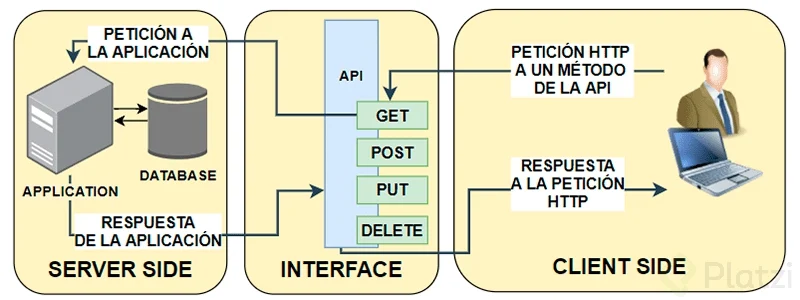
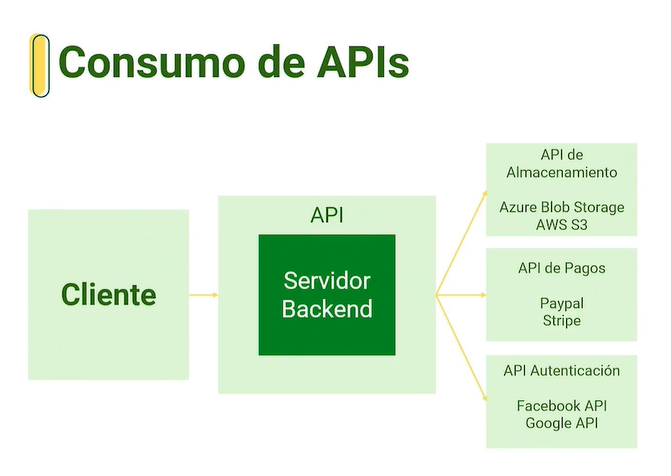
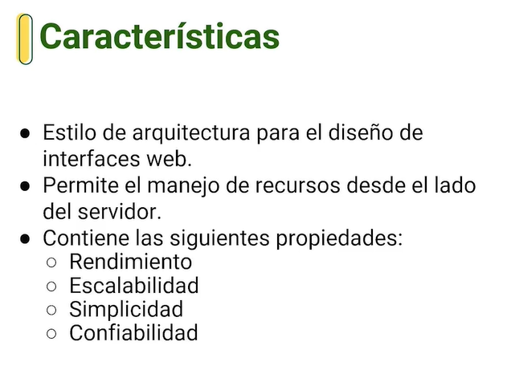
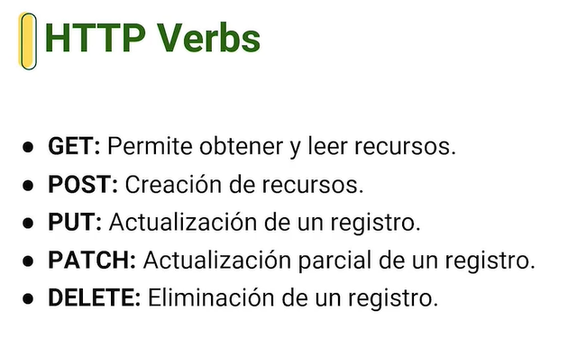
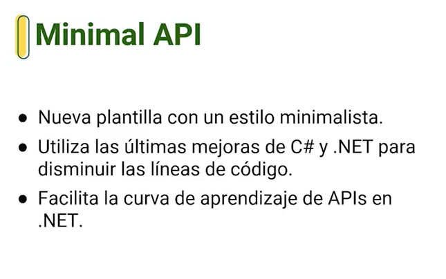
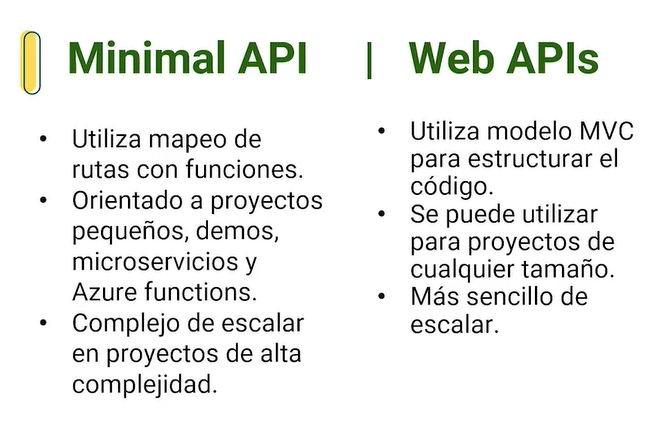
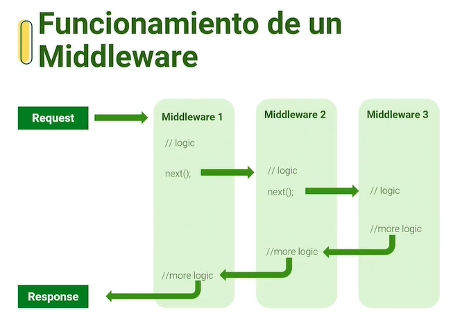
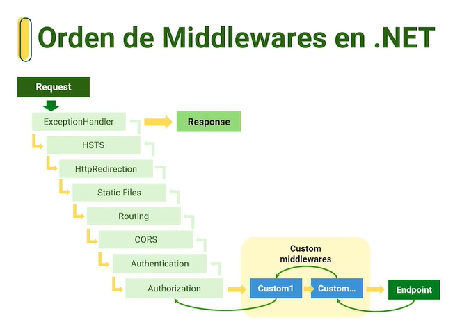

# API con .NET

## 1. ¿Qué es una API?

**API** o **Application Programming Interface**, que en español quiere decir Interfaz de Programación de Aplicaciones, es un conjunto de funciones y procedimientos que permite integrar sistemas, permitiendo que sus funcionalidades puedan ser reutilizadas por otras aplicaciones o software.

Una API sirve para intercambiar datos entre diferentes tipos de software y así automatizar procedimientos y desarrollar nuevas funcionalidades.

Caracteristicas:

* expone métodos y funciones para ser consumidos por otras aplicaciones.
* posee una capa de abstraccion para ser consumida.
* puede tener capas de seguridad que brinden autentificacion y autorización.

## 2. ¿Qué es REST?

* API REST

Una API de REST, o API de RESTful, es una interfaz de programación de aplicaciones (API o API web) que se ajusta a los límites de la arquitectura REST y permite la interacción con los servicios web de RESTful. El informático Roy Fielding es el creador de la transferencia de estado representacional (REST).

* REST (Representational state transfer)

REST no es un protocolo ni un estándar, sino más bien un conjunto de límites de arquitectura. Los desarrolladores de las API pueden implementarlo de distintas maneras.

Cuando el cliente envía una solicitud a través de una API de RESTful, esta transfiere una representación del estado del recurso requerido a quien lo haya solicitado o al extremo. La información se entrega por medio de HTTP en uno de estos formatos: JSON (JavaScript Object Notation), HTML, XLT, Python, PHP o texto sin formato. JSON es el lenguaje de programación más popular, ya que tanto las máquinas como las personas lo pueden comprender y no depende de ningún lenguaje, a pesar de que su nombre indique lo contrario.

### HHTP verbos

### Manejo de URLs

* URI: los recursos en REST siempre se manipulan a partir de un URL, identificadores universales de recursos
* Ejemplo de URL:
    /api/usuarios/1

## Respuestas HTTP

Respuestas informativas (100-199)
Respuestas satisfactorias (200-299)
Redirecciones (300-399)
Errores de los clientes (400-499)
Errores de los servidores (500 - 599)

[Documentation de Repsuestas de Mozilla](https://developer.mozilla.org/es/docs/Web/HTTP/Status)

## 3. Creando tu primera API con .NET

### Comandos necesarios

**Ver todos los proyectos que existe en dotnet:**
> dotnet new --list

**para create un proyecto:**
> dotnet new <proyect-name>

**crear un poryecto webapi:**
> dotnet new webapi

**para compilar un proyecto:**
> dotnet build

**restaura dependencias y librerias:**
> dotnet restore

**permite monitorear los cambios en tiempo real:**
> dotnet watch run

**elimina archivos compilados:**
> dotnet clean

## 4. Consumiendo API desde Postman

Para hacer uso de Postman es muy fácil:

    Entrar al sitio: www.postman.com (También puedes descargarte la aplicación).
    Si aún no tienes una cuenta puedes crearte una de manera gratuita.
    Una vez logueado ya puedes hacer uso de un nuevo workbench que es donde pondrás tu URL con su respectivo verbo.
    Click a “send” y listo podrás ver la respuesta a tu petición.

En mi caso tuve conflicto al seguir el ejemplo del video ya que no existía un alcance a mi servidor local. Lo que hice fue descargarme la aplicación de postman, una vez ejecutada la aplicación inicié sesión y nuevamente abrí un nuevo workbench, introduje la URL con su verbo GET y listo ya obtuve respuesta a mi petición.

## 5. Análisis del template para APIs de .NET

### model MVC

* Model: datos
* View: interfaz de usuario
* Controller: logica

### model de la webapi

* Model: datos
* Controller: logica

## Atributos para verbos HTTP

## Minimal API vs. Web API

## ¿Qué son los middlewares?

**Middleware**

* Código que se agrega al ciclo de vida de un petición HTTP

* Su ejecución es por capas

* Facilita la implementación de interceptores y filtros sobre las peticiones HTTP

**Custom Middleware**
Deben de estar antes del EndPoint y despues de la authorization

## 6. Agregando librerías para Entity Framework

## Nugets packages

**Entity Framework Core:**
> dotnet add package Microsoft.EntityFrameworkCore

**Entity Framework In Memory:**
> dotnet add package Microsoft.EntityFrameworkCore.InMemory

**Entity Framework SQL Server:**
> dotnet add package Microsoft.EntityFrameworkCore.SqlServer
