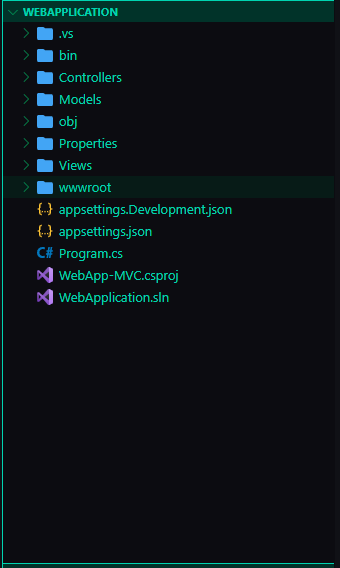
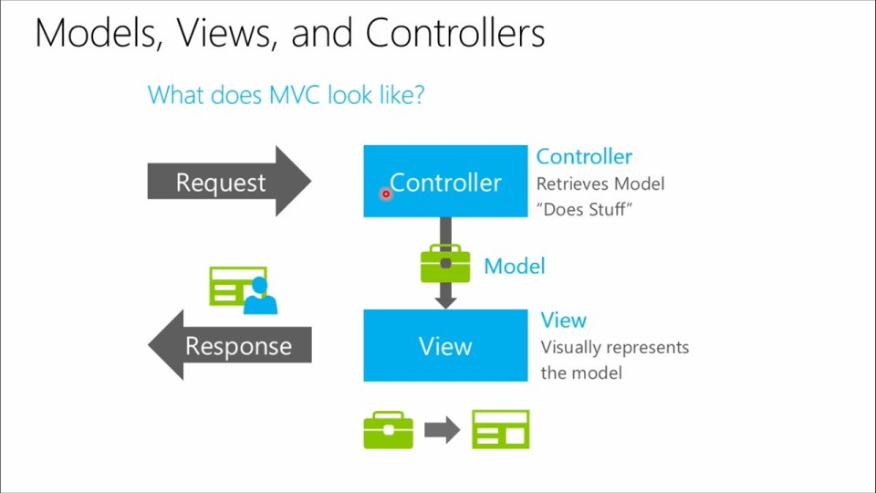
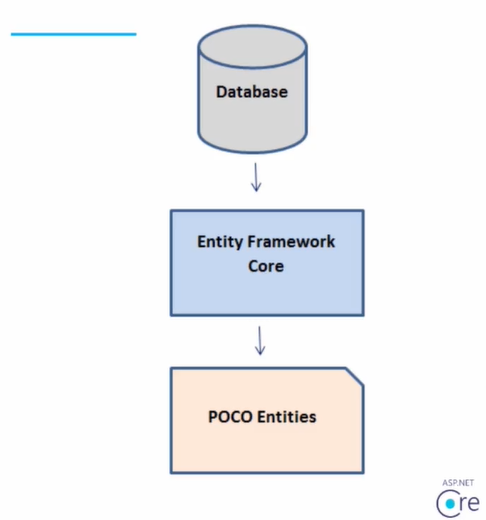
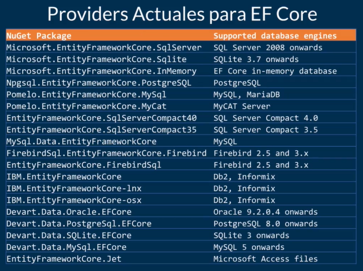

# ASP.NET Core

## La importancia del middleware en el entorno web

Middleware

    Es una capa que esta en el medio.
    Hay muchos middlewares dependiendo el tipo de app.
    En este caso necesitamos algo que nos permita crear un servidor web para que nuestra app sea expuesta hacia internet.
    Ejemplos, NGINX, APACHE.
    Para net core seria IIS, Kestrel (ambiente de desarrollo).

Kestrel

    es un servidor web multiplataforma para desplegar aplicaciones en ASP.NET Core en la web.

## Habilitar certificados, planillas preinstaladas

Instalar los certificados y luego aceptarlos:
> dotnet dev-certs https --trust

Muestra la lista de proyectos que podemos crear:
> dotnet new --list

Todo lo que se puede crear con dotnet
~~~batch
Nombre de la plantilla                      Nombre corto         Idioma      Etiquetas

.NET MAUI ContentPage (C#)                  maui-page-csharp     [C#]        MAUI/Android/iOS/macOS/Mac Catalyst/WinUI/Tizen/Xaml/Code
.NET MAUI ContentPage (XAML)                maui-page-xaml       [C#]        MAUI/Android/iOS/macOS/Mac Catalyst/WinUI/Tizen/Xaml/Code
.NET MAUI ContentView (C#)                  maui-view-csharp     [C#]        MAUI/Android/iOS/macOS/Mac Catalyst/WinUI/Tizen/Xaml/Code
.NET MAUI ContentView (XAML)                maui-view-xaml       [C#]        MAUI/Android/iOS/macOS/Mac Catalyst/WinUI/Tizen/Xaml/Code
.NET MAUI ResourceDictionary (XAML)         maui-dict-xaml       [C#]        MAUI/Android/iOS/macOS/Mac Catalyst/WinUI/Xaml/Code      
Android Activity template                   android-activity     [C#]        Android/Mobile
Android Application                         android              [C#]        Android/Mobile
Android Class Library                       androidlib           [C#]        Android/Mobile
Android Java Library Binding                android-bindinglib   [C#]        Android/Mobile
Android Layout template                     android-layout       [C#]        Android/Mobile
Aplicación .NET MAUI                        maui                 [C#]        MAUI/Android/iOS/macOS/Mac Catalyst/Windows/Tizen        
Aplicación .NET MAUI Blazor                 maui-blazor          [C#]        MAUI/Android/iOS/macOS/Mac Catalyst/Windows/Tizen/Blazor 
Aplicación con pestañas de iOS (versión...  ios-tabbed           [C#]        iOS/Mobile
Aplicación de consola                       console              [C#],F#,VB  Common/Console
Aplicación de Windows Forms                 winforms             [C#],VB     Common/WinForms
Aplicación iOS (versión preliminar)         ios                  [C#]        iOS/Mobile
Aplicación MacCatalyst (versión prelimi...  maccatalyst          [C#]        macOS/Mac Catalyst
Aplicación WPF                              wpf                  [C#],VB     Common/WPF
Archivo de la solución                      sln                              Solution
Archivo de manifiesto de la herramienta...  tool-manifest                    Config
Archivo EditorConfig                        editorconfig                     Config
archivo gitignore de dotnet                 gitignore                        Config
archivo global.json                         globaljson                       Config
ASP.NET Core Empty                          web                  [C#],F#     Web/Empty
ASP.NET Core gRPC Service                   grpc                 [C#]        Web/gRPC
ASP.NET Core Web API                        webapi               [C#],F#     Web/WebAPI
ASP.NET Core Web App                        webapp,razor         [C#]        Web/MVC/Razor Pages
ASP.NET Core Web App (Model-View-Contro...  mvc                  [C#],F#     Web/MVC
ASP.NET Core with Angular                   angular              [C#]        Web/MVC/SPA
ASP.NET Core with React.js                  react                [C#]        Web/MVC/SPA
Biblioteca de clases                        classlib             [C#],F#,VB  Common/Library
Biblioteca de clases .NET MAUI              mauilib              [C#]        MAUI/Android/iOS/macOS/Mac Catalyst/Windows/Tizen
Biblioteca de clases de iOS (versión pr...  ioslib               [C#]        iOS/Mobile
Biblioteca de clases de Windows Forms       winformslib          [C#],VB     Common/WinForms
Biblioteca de clases de WPF                 wpflib               [C#],VB     Common/WPF
Biblioteca de control personalizada de WPF  wpfcustomcontrollib  [C#],VB     Common/WPF
Biblioteca de controles de usuario de WPF   wpfusercontrollib    [C#],VB     Common/WPF
Biblioteca de controles de Windows Forms    winformscontrollib   [C#],VB     Common/WinForms
Biblioteca de enlace de MacCatalyst (ve...  maccatalystbinding   [C#]        macOS/Mac Catalyst
Biblioteca de enlaces de iOS (versión p...  iosbinding           [C#]        iOS/Mobile
Blazor Server App                           blazorserver         [C#]        Web/Blazor
Blazor WebAssembly App                      blazorwasm           [C#]        Web/Blazor/WebAssembly/PWA
Configuración de NuGet                      nugetconfig                      Config
Configuración web                           webconfig                        Config
MSTest Test Project                         mstest               [C#],F#,VB  Test/MSTest
MVC ViewImports                             viewimports          [C#]        Web/ASP.NET
MVC ViewStart                               viewstart            [C#]        Web/ASP.NET
NUnit 3 Test Item                           nunit-test           [C#],F#,VB  Test/NUnit
NUnit 3 Test Project                        nunit                [C#],F#,VB  Test/NUnit
Plantilla de controlador de iOS (versió...  ios-controller       [C#]        iOS/Mobile
Protocol Buffer File                        proto                            Web/gRPC
Razor Class Library                         razorclasslib        [C#]        Web/Razor/Library
Razor Component                             razorcomponent       [C#]        Web/ASP.NET
Razor Page                                  page                 [C#]        Web/ASP.NET
Worker Service                              worker               [C#],F#     Common/Worker/Web
xUnit Test Project                          xunit                [C#],F#,VB  Test/xUnit
~~~

Crear una aplicacion vacía

> dotnet new web -o <project-name>

Crear un proyecto mvc

> dotnet new mvc

## Revisión detalladas de la estructura de directorios

Al crear el proyecto se tendra esta estructura de carpetas:

## ¿Qúé es el patrón MVC?

El **patrón MVC** es un patrón de diseño de software, que permite separar responsabilidades fácilmente entre un Modelo, una Vista y el Controlador. Por lo general, no queremos que el Modelo sea accesible desde la vista, por eso es el Controlador el encargado de comunicar la Vista con la información que necesita. Para ello el Controlador se comunica con el Backend, y este es el que gestiona la información solicitada.

    **El Modelo:** no es más que la información con la que vamos a trabajar. Normalmente, se representa como una clase que solo almacena datos.
    **El Controlador:** se encarga de responder las peticiones del usuario, teniendo en cuenta la ruta y el método Http. Para esto, según la petición, responde con la acción correspondiente que nosotros mismos definimos. Por lo general, luego de realizar las operaciones necesarias, el controlador finaliza la ejecución de una acción llamando a la Vista.
    **La Vista:** una vez llamada por el Controlador, se encarga de dibujarse a sí misma, mostrando la información que recibe del Controlador.

Normalmente, en .NET la mayor parte del HTML se procesa en el Backend, aunque podrían existir algunas partes que sí se procesen del lado del cliente. Renderizar en el Backend ofrece las ventajas de tener mejor performance, escalabilidad y de SEO.
Sí deseamos añadir mayor fluidez a la experiencia del usuario, es cuando empleamos el renderizado en el frontend mediante Javascript. Esto se puede conseguir mediante .NET con Javascript o cualquiera de sus librerías.

## Vista y controlador

En ASP .NET podemos encontrar varias convenciones, entre las cuales destacan:

* Si un conjunto de vistas se llama **Home**, el controlador asociado deberá llamarse **HomeController**
    Todos los modelos deben tener un campo ID

En caso de no querer seguir alguna de las convenciones, se deberá optar por una configuración manual al respecto. Se dice que ASP .NET es un framework orientado a convenciones.

Todos los controladores deben extender de una clase base. La clase por defecto a utilizar es la clase Controller.

## Modelo a nivel básico

## Razor Syntax

Son varios los objetivos que Microsoft se ha marcado en la creación de este motor de vistas, entre los que destacaríamos:

    Compacto, expresivo y fluido: buscan reducir la cantidad de código que necesitamos para crear las vistas, evitando que tengamos que denotar de una forma especial cada línea de código procedural. El compilador será lo suficientemente inteligente como para inferir, en muchas ocasiones, qué tipo de código estamos escribiendo.

    Fácil de aprender: aunque esto es siempre relativo, puesto que depende del bagaje previo del desarrollador y de sus capacidades.

    Funciona en cualquier editor de texto, luego no vamos a tener que estar anclados a Visual Studio o cualquier otra herramienta para crear nuestros ficheros Razor. Obviamente, el soporte al lenguaje es superior en una herramienta como Visual Studio, donde tendremos toda la potencia de IntelliSense a nuestro alcance, que, si editamos simplemente con el Block de Notas, pero la decisión última será nuestra.

    Testeable: podremos crear tests unitarios de las vistas.

Los archivos que contienen Razor generalmente tienen una extensión de archivo .cshtml.

## Vistas, plantillas, Archivos de inicio

Llamar varibles del controlador o variables creadas con razor

* @ViewBag y @ViewData son 2 vistas de la misma información, lo único que cambia, es su forma de ser invocadas en el software, con ViewData se puede invocar así: @ViewBag.Objeto, y con ViewData @ViewData[“Objeto”].

Para cambiar el template o la plantilla

utilizamos el **Layout = "_Layout"** y el **_Layout** es un archivo que existe dentro de shared el cual tiene codigo html y se usa como plantilla.

Nosotros tambien podemos crear plantilla y deben de estar en la carpeta **shared** dentro de Views.

cambiar el **_Layout** por **el-nombre-de-nuestra-plantilla** y seria de esta manera

* **Layout = "el-nombre-de-nuestra-plantilla"**

Si quiero que una plantilla sea por defecto

voy a archivo **_ViewStart.cshtml** que esta dentro de **Views** y cambio el nombre del archivo por el que yo quiero.

~~~cshtml
@{
    Layout = "el-nombre-de-nuestra-plantilla";
}
~~~

Una vista hace uso de una plantilla más grande que la contiene.

## Vistas parciales

## Mostrando otras listas de objetos

## Introducción a entity framework

Permite transformar en objetos lo que se encuentre en base de datos

**Instalaciones necesarias:**

> dotnet add package Microsoft.EntityFrameworkCore.SqlServer --version 6.0.8

> Microsoft.EntityFrameworkCore.InMemory

