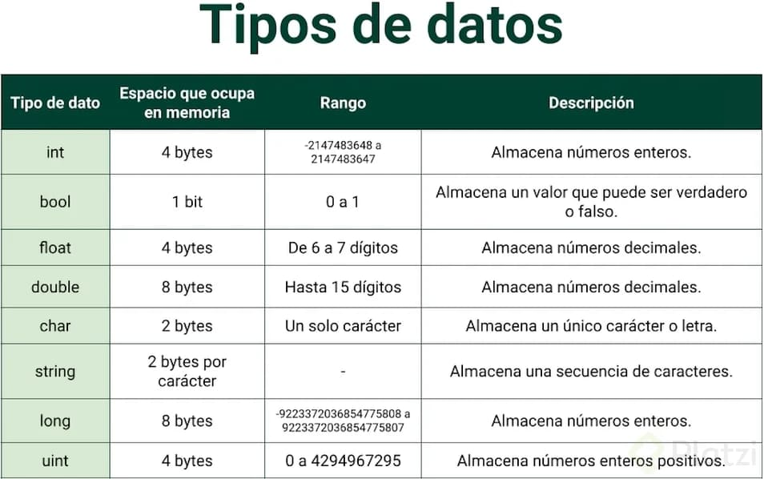

# Curso Básico de Programación con C#

## 1. ¿Por que aprender C#?
Aprender C# es importante debido a su popularidad, versatilidad, facilidad de aprendizaje, y su demanda en el mercado laboral.

1. Es un lenguaje de programación popular y versátil que se utiliza en una variedad de aplicaciones, incluyendo desarrollo de juegos, aplicaciones de escritorio y móviles, y desarrollo web.
2. Es un lenguaje de programación de Microsoft, lo que significa que es compatible con una variedad de herramientas y tecnologías de Microsoft, como Visual Studio y .NET Framework.
3. Es un lenguaje de programación moderno que tiene una sintaxis fácil de aprender y ofrece características avanzadas, como programación orientada a objetos y manejo automático de memoria.

## 2. ¿Qué son los algoritmos?

* Finito: Debe tener un número determinado de pasos, un inicio y un final.

* Legible: El texto que lo escribe debe ser claro, tal que permita entenderlo y leerlo fácilmente.

* Preciso: Cada paso debe estar muy claro, sé breve y concreto, evitando ambigüedades.

* Eficaz: El algoritmo debe resolver el problema.

* Eficiente: Debe resolver el problema utilizando de forma óptima los recursos disponibles.

## 3. Instalando Visual Studio 2022

Lo primero que debemos hacer es descargar Visual Studio. Para ello, sigue los siguientes pasos:

1. Dirígete al sitio oficial de Visual Studio haciendo clic en el siguiente enlace: [Descargar Visual Studio](https://visualstudio.microsoft.com/es/downloads/).

2. Una vez en la sección de descargas, busca la versión gratuita llamada "Visual Studio Community". Esta será la versión con la que trabajaremos. Cabe destacar que la versión Community tiene todas las herramientas y potencial necesario para desarrollar a nivel profesional.

   Las diferentes versiones de Visual Studio disponibles para descargar son:
   - Visual Studio Community: Gratuito.
   - Visual Studio Professional: De pago.
   - Visual Studio Enterprise: De pago.

   Otras versiones disponibles son:
   - Visual Studio for MacOSX: Gratuito y exclusivo para sistemas operativos MacOSX.
   - Visual Studio Code: Un editor de código fuente independiente que se ejecuta en Windows, macOS y Linux. Es la elección principal para desarrolladores web y Java, con una gran cantidad de extensiones para admitir casi cualquier lenguaje de programación.

3. Recomendamos usar el IDE de Visual Studio, pero en cualquier caso, descarga el instalador correspondiente y ejecútalo para comenzar la instalación.

Durante el proceso de instalación, se te pedirá que elijas los paquetes con los que deseas trabajar y el tema visual de Visual Studio.

## 4. Aprendiendo a usar Visual Studio

1. **Instala Visual Studio en tu ordenador**

   Antes de comenzar a usar Visual Studio, debes descargar la última versión del programa. Si deseas acceder a todas las funcionalidades, puedes seleccionar uno de los planes de pago. Sin embargo, si solo necesitas componentes específicos, puedes personalizar la instalación para ahorrar tiempo y espacio en tu disco.

2. **Personaliza tu pantalla**

   Una vez que hayas instalado el software, puedes personalizar tu entorno de trabajo en Visual Studio de acuerdo a tus preferencias. Puedes cambiar el tema, las fuentes y los colores, agregar o quitar menús y barras de herramientas, mover el diseño de la ventana y establecer métodos abreviados de teclado.

3. **Crea tu primer proyecto**

   Ahora es el momento de comenzar a desarrollar. Sigue estos pasos para crear un proyecto en Visual Studio:

   - Abre Visual Studio y elige la opción "Crear un proyecto nuevo" en la ventana de inicio.
   - Ingresa el tipo de aplicación que deseas desarrollar o filtra por lenguaje de programación y plataforma.
   - Selecciona una plantilla de proyecto que se ajuste a tus necesidades.
   - Configura las opciones del proyecto, como el nombre y la plataforma de destino.
   - Finalmente, haz clic en "Crear" para generar el proyecto.

4. **¡Listo para comenzar!**

   Ahora tendrás tu primer proyecto en Visual Studio listo para trabajar. Recuerda que con Visual Studio y .NET puedes desarrollar una variedad de aplicaciones para escritorio, web, dispositivos móviles, juegos e IoT. Además, puedes utilizar diferentes lenguajes de programación, como C#, F#, Visual Basic, C++ y Python, según tus necesidades y preferencias.

Fuente: [Microsoft](https://www.microsoft.com)

## 5. Tipos de datos primitivos

## 6. Variables en C#

¿Qué es una variable?

En C#, una variable es un espacio en la memoria del ordenador donde se almacena un valor. Cada variable tiene un nombre único, un tipo de datos y un valor asignado.

Para utilizar una variable en C#, primero se debe declarar especificando el tipo de datos que almacenará y luego puede ser inicializada con un valor específico. Por ejemplo:

~~~csharp
int a;
a = 5;
~~~

O también se puede hacer en una sola línea:

~~~csharp
int a = 5;
~~~

1. Declarar una variable con tipo explícito
Para declarar una variable en C#, se debe primero declarar el tipo de dato y luego asignarle un nombre.

~~~csharp
string firstName;
~~~

2. Declarar una variable con tipo implícito
Para crear una variable de tipo implícito, se utiliza la palabra clave var, se le asigna un nombre y se inicializa. Es importante tener en cuenta que si intentas usar la palabra clave var sin inicializarla, aparecerá un error (error CS0818: Implicitly-typed variables must be initialized).

~~~csharp
var message = "Hello C#";
~~~

3. Declarar una constante
Para crear una constante, se utiliza la palabra clave const. Las constantes son un tipo de dato invariable, su valor se establece en tiempo de compilación. Se usan de forma muy similar a las variables, con la diferencia de que no se puede modificar su valor durante la ejecución.

~~~csharp
const double PI = 3.14159;
~~~

## 7. La palabra reservada var
La palabra reservada “var” en C# se utiliza para declarar variables de tipo “implícito” o “inferencia de tipo”.

📌 Esto significa que el compilador determina el tipo de la variable en base al valor asignado en la declaración.

Es una forma abreviada de declarar una variable y especificar el tipo, ya que el compilador infiere el tipo correcto automáticamente. Sin embargo, debes tener en cuenta que el tipo de una variable declarada con “var” debe ser obvio en el contexto de la asignación.

Utilizar “var”:

~~~csharp
var myVariable = "Hello, World!";
~~~

En este ejemplo, el compilador infiere que el tipo de la variable “myVariable” es “string” en base al valor asignado.

No utilizar “var”:

~~~csharp
string myVariable = "Hello, World!";
~~~

En este ejemplo, se especifica explícitamente que el tipo de la variable “myVariable” es “string”.

## 8. Uso de constantes

Las constantes son campos cuyos valores se establecen en tiempo de compilación y nunca se pueden cambiar. Use constantes para proporcionar nombres descriptivos en lugar de literales numéricos (“números mágicos”) para valores especiales.

En si, las constantes son valores inmutables que se conocen en tiempo de compilación y que no cambian durante la vida del programa. Las constantes se declaran con el modificador const. Solo los tipos integrados de C# (excluido System.Object) pueden declararse como const. Los tipos definidos por el usuario, incluidas las clases, las estructuras y las matrices, no pueden ser const.

C# no admite métodos, propiedades ni eventos const.

Las constantes se deben inicializar al declararse. Por ejemplo:

~~~csharp
class Calendar1
{
    public const int Months = 12;
}
~~~

En este ejemplo la constante Months siempre es 12 y ni siquiera la propia clase la puede cambiar. De hecho, cuando el compilador detecta un identificador de constante en el código fuente de C# (por ejemplo, Months), sustituye directamente el valor literal en el código de lenguaje intermedio (IL) que genera. Dado que no hay ninguna dirección de variable asociada a una constante en tiempo de ejecución, no se pueden pasar los campos const por referencia ni pueden aparecer como un valor L en una expresión.

## 9. Operadores aritméticos

Numeros y operador Aritmeticos

📌 Podemos comentar en el editor con //, lo que permite ingresar anotaciones para nosotros y otros colaboradores con los que estemos trabajando. Dichos comentarios no afectan a la ejecución del código y también pueden servir para sacar alguna porción de nuestro trabajo para que no se ejecute pero sin necesidad de borrarlo

• El doble slash sirve para comentar UNA línea pero no si queremos hacer saltos de línea. En este último caso lo haremos con /* */

~~~csharp
/* 
	Comentario Multilinea
*/

// Comentario de una Linea

~~~

Originalmente las computadoras se usaban para realizar calculos muy bestiales por lo que tenemos a disposición multitud de signos que podemos usar para nuestros cálculos:

* Suma: +
* Resta: -
* Multiplicación: *
* División: /
* Módulo o Resto (lo que te quedaba de una división): %
* Incremento (sería un +1): ++
* Decremento (-1): –-

## 10. Operadores lógicos

Los operadores lógicos en C# son utilizados para comparar y combinar valores booleanos. Los operadores lógicos disponibles en C# incluyen:

* && (and): Devuelve verdadero si ambos operandos son verdaderos.
* || (or): Devuelve verdadero si al menos uno de los operandos es verdadero.
* ! (not): Invierte el valor booleano del operando.
* ^ (xor): Devuelve verdadero si sólo uno de los operandos es verdadero.

Ejemplo:

~~~csharp
bool a = true;
bool b = false;
bool c = (a && b); // c es false
bool d = (a || b); // d es true
bool e = !b; // e es true
bool f = (a ^ b); // f es true
~~~

## 11. Operadores relacionales

Los operadores relacionales en C# se utilizan para comparar valores y determinar si una relación es verdadera o falsa. Los operadores relacionales disponibles en C# incluyen:

* == (igual a): Devuelve verdadero si los operandos son iguales.
* != (no igual a): Devuelve verdadero si los operandos son diferentes.
* > (mayor que): Devuelve verdadero si el operando de la izquierda es mayor que el de la derecha.
< (menor que): Devuelve verdadero si el operando de la izquierda es menor que el de la derecha.
* >= (mayor o igual que): Devuelve verdadero si el operando de la izquierda es mayor o igual que el de la derecha.
* <= (menor o igual que): Devuelve verdadero si el operando de la izquierda es menor o igual que el de la derecha.

~~~csharp
int x = 5;
int y = 10;
bool a = (x == y); // a es false
bool b = (x != y); // b es true
bool c = (x > y); // c es false
bool d = (x < y); // d es true
bool e = (x >= y); // e es false
bool f = (x <= y); // f es true
~~~

Es importante recordar que para comparar strings se utiliza el metodo .Equals() o el operador == y ≠

~~~csharp
string s1 = "Hello";
string s2 = "World";
bool a = s1.Equals(s2); // a es false
bool b = (s1 == s2); // b es false
~~~

## 12. Strings en C#

Una cadena es un objeto de tipo String cuyo valor es texto. Internamente, el texto se almacena como una colección secuencial de solo lectura de objetos Char. No hay ningún carácter que finalice en NULL al final de una cadena de C#; por lo tanto, la cadena de C# puede contener cualquier número de caracteres nulos insertados ("\0"). La propiedad Length de una cadena representa el número de objetos Char que contiene, no el número de caracteres Unicode. Para obtener acceso a los puntos de código Unicode individuales de una cadena, use el objeto StringInfo.

### Cadena frente System.String

En C#, la palabra clave string es un alias de String. Por lo tanto, String y string son equivalentes, aunque se recomienda usar el alias proporcionado string, ya que funciona incluso sin using System;. La clase String proporciona muchos métodos para crear, manipular y comparar cadenas de forma segura. Además, el lenguaje C# sobrecarga algunos operadores para simplificar las operaciones de cadena comunes.

Ejemplos de como manipular strings

~~~csharp
/* ***** Ejemplo 1 ***** */
// Concatenacion de variables para crear un string mas amplio al final con el operador +
string number = "1";
string street = "Palo Alto St";
string city = "California";
string address = street + " " + number + " " + city;
Console.WriteLine(address);

// OUTPUT: Palo Alto St 1 California
/* ***** Ejemplo 2 ***** */
string adress1 = ""; // string.empty
Console.WriteLine(adress1); // Console vacio
bool isEmpty;

// Validacion de string vacio con string.Empty
if (adress1 == string.Empty)
	isEmpty = true;
else
	isEmpty = false;

Console.WriteLine(isEmpty);
// OUTPUT: 
// OUTPUT: True
~~~

## 13. La sentencia If
La sentencia if en C# se utiliza para evaluar una expresión lógica y ejecutar un bloque de código si la expresión se evalúa como verdadera. La sintaxis básica de la sentencia if es la siguiente:

~~~java
if (expresion) {
    // bloque de código a ejecutar si la expresión es verdadera
}
~~~

📌 La condición puede ser cualquier expresión que evalúe a verdadero o falso, como una comparación de igualdad, una comparación de desigualdad, una comparación mayor o menor, etc.

También se puede agregar un bloque else opcional para ejecutar un bloque de código si la expresión se evalúa como falsa:

~~~java
if (expresion) {
    // bloque de código a ejecutar si la expresión es verdadera
} else {
    // bloque de código a ejecutar si la expresión es falsa
}
~~~

Ademas se puede utilizar la sentencia else if para evaluar varias condiciones

~~~java
if (expresion1) {
// bloque de código a ejecutar si la expresión1 es verdadera
} else if (expresion2) {
// bloque de código a ejecutar si la expresión1 es falsa y expresión2 es verdadera
} else {
// bloque de código a ejecutar si las expresiones son falsas
}
~~~

## 14. Condicional Switch

La instrucción switch selecciona una lista de instrucciones para ejecutarla en función de la coincidencia de un patrón con una expresión de coincidencia, como se muestra en el ejemplo siguiente:

~~~java
DisplayMeasurement(-4);  // Output: Measured value is -4; too low.
DisplayMeasurement(5);  // Output: Measured value is 5.
DisplayMeasurement(30);  // Output: Measured value is 30; too high.
DisplayMeasurement(double.NaN);  // Output: Failed measurement.

void DisplayMeasurement(double measurement)
{
    switch (measurement)
    {
        case < 0.0:
            Console.WriteLine($"Measured value is {measurement}; too low.");
            break;

        case > 15.0:
            Console.WriteLine($"Measured value is {measurement}; too high.");
            break;

        case double.NaN:
            Console.WriteLine("Failed measurement.");
            break;

        default:
            Console.WriteLine($"Measured value is {measurement}.");
            break;
    }
}
~~~

## 15. Ciclos While y Do While

La instrucción while ejecuta una instrucción o un bloque de instrucciones mientras que una expresión booleana especificada se evalúa como true. Como esa expresión se evalúa antes de cada ejecución del bucle, un bucle while se ejecuta cero o varias veces. La while instrucción difiere de un bucle do , que se ejecuta una o varias veces.

En el ejemplo siguiente se muestra el uso de la instrucción while:

~~~java
int n = 0;
while (n < 5)
{
    Console.Write(n);
    n++;
}
// Output:
// 01234
~~~

La estructura do while es otra estructura repetitiva, la cual ejecuta al menos una vez su bloque repetitivo, a diferencia del while o del for que podían no ejecutar el bloque.
Esta estructura repetitiva se utiliza cuando conocemos de antemano que por lo menos una vez se ejecutará el bloque repetitivo.

## 16. Ciclos para el juego de Platzino

~~~csharp
using System.Drawing;

Console.WriteLine("Hello, World!");
int totalJugador = 0;
int totalDealer = 0;
int num = 0;
string message = "";
string controlOtraCarta = "";
string switchControl = "menu";

System.Random random = new System.Random();

//Blackjack, Juntar 21 pidiendo, en casa de pasarte de 21 pierdes.
//cartas o en caso de tener menos
//de 21 igual tener mayor puntuación que el dealer
while (true){
    totalJugador = 0;
    totalDealer = 0;

    switch (switchControl)
    {
        case "menu":
        Console.WriteLine("Welcome al c a s i n o");
            Console.WriteLine("Escriba ‘21’ para jugar al 21");
            switchControl = Console.ReadLine();
            break;
        case "21":
                do
            {
                num = random.Next(1, 12);
                totalJugador = totalJugador + num;
                Console.WriteLine("Toma tu carta, jugador,");
                Console.WriteLine($"Te salió el número: { num} ");
                Console.WriteLine("¿Deseas otra carta ?");
                controlOtraCarta = Console.ReadLine();

            } while (controlOtraCarta == "Si" ||
            controlOtraCarta == "si"
            || controlOtraCarta == "yes");

            totalDealer = random.Next(14, 23);
            Console.WriteLine($"El dealer tiene {totalDealer}");

            if (totalJugador > totalDealer && totalJugador < 22)
            {
                message = "Venciste al dealer, felicidades";
                switchControl = "menu";
            }
            else if (totalJugador >= 22)
            {
                message = "Perdiste vs el dealer, te pasaste de 21";
                switchControl = "menu";
            }
            else if (totalJugador <= totalDealer)
            {
                message = "Perdiste vs el dealer, lo siento";
                switchControl = "menu";
            }
            else
            {
                message = "condición no válida";
            }
            Console.WriteLine(message);
            break;
        default:
            Console.WriteLine("Valor ingresa no válido en el  C A S I N O");
            break;
    }
}
~~~

## 17. Ciclos For

~~~java
for (int index = 0; index < 10; index++)
{
    Console.WriteLine($"Hello World! The index is {index}");
}
~~~

## 18. 

~~~java
int creditos = 0;
int apuesta = 0;
int totalJugador = 0;
int totalDealer = 0;
int num = 0;
string message = "";
string controlOtraCarta = "";
string switchControl = "menu";
System.Random random = new System.Random();

//Blackjack, Juntar 21 pidiendo, en casa de pasarte de 21 pierdes.
//cartas o en caso de tener menos
//de 21 igual tener mayor puntuación que el dealer
while (true)
{
    Console.WriteLine("Hello, welcome to K-sino!");
    Console.WriteLine("¿Cuántos creditos deseas comprar?\n" +
        "*Ingresa un número entero*\n" +
        "*Cada partida de juego tiene un costo de 1 credito*");
    creditos = Convert.ToInt32(Console.ReadLine());

    

    for (int i = 0; i < creditos*2; i++)
    {
        totalJugador = 0;
        totalDealer = 0;

        switch (switchControl)
        {
            case "menu":
                Console.WriteLine("\nEscriba ‘21’ para jugar al 21.\n" +
                                  "        ‘S’  para salir y guardar sus creditos.");
                switchControl = Console.ReadLine();

                if (switchControl == "21")
                {
                    Console.WriteLine($"Ingrese la cantidad de creditos que desee apostar\n" +
                        $"  Cantidad de creditos disponibles: {creditos}");
                    apuesta = Convert.ToInt32(Console.ReadLine());
                    break;
                } 
                else if (switchControl == "S" || switchControl == "s")
                {
                    Environment.Exit(1);
                }
                break;

            case "21":
                do
                {
                    num = random.Next(1, 12);
                    totalJugador = totalJugador + num;
                    Console.WriteLine("Toma tu carta, jugador,");
                    Console.WriteLine($"Te salió el número: {num} ");
                    Console.WriteLine("¿Deseas otra carta?");
                    controlOtraCarta = Console.ReadLine();

                } while (controlOtraCarta == "Si" ||
                         controlOtraCarta == "si" ||
                         controlOtraCarta == "yes");

                totalDealer = random.Next(14, 23);
                Console.WriteLine($"\nTu puntuaje fue: {totalJugador}");
                Console.WriteLine($"El dealer obtuvo: {totalDealer}\n");

                if (totalJugador > totalDealer && totalJugador < 22 || totalDealer > 21)
                {
                    creditos += apuesta;
                    message = "Felicidades, venciste al dealer\n" +
                        $"   Conseguiste: {apuesta} creditos!!!\n" +
                        $"Total de creditos: {creditos}";
                    switchControl = "menu";
                }
                else if (totalJugador >= 22)
                {
                    creditos -= apuesta;
                    message = "Te pasaste de 21 vs el dealer\n" +
                        $"   Perdiste: {apuesta} creditos!\n" +
                        $"Total de creditos: {creditos}";
                    switchControl = "menu";
                }
                else if (totalJugador < totalDealer)
                {
                    creditos -= apuesta;
                    message = "Lo siento, perdiste vs el dealer\n" +
                        $"   Perdiste: {apuesta} creditos!\n" +
                        $"Total de creditos: {creditos}";
                    switchControl = "menu";
                }
                else if (totalJugador == totalDealer)
                {
                    message = "Empataste vs el dealer\n" +
                        "   Conservas tus creditos!";
                    switchControl = "menu";
                }
                else
                {
                    message = "Condición no válida, intentalo de nuevo";
                    switchControl = "menu";
                }
                Console.WriteLine(message);
                break;

            default:
                Console.WriteLine("Valor ingresado no válido en el K-sino");
                switchControl = "menu";
                break;
        }
    }
    Console.WriteLine("\n     Tus creditos se han terminado!!!\n" +
        "Presione cualquier tecla para continuar...");
    Console.ReadLine();
    Console.Clear();
    
}
~~~

