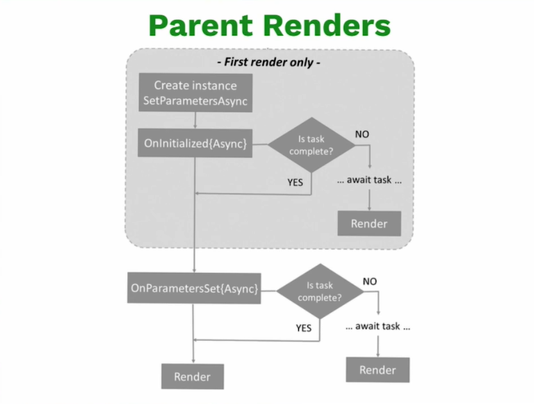

# Curso de Aplicaciones Web con Blazor WebAssembly y .NET

## 1. ¿Qué es WebAssembly y Blazor?

Este estandar que aparecio en el año 2015, es una forma de empaquetar código en formato binario que puede ser enviado al navegador como un assets y ser leído y ejecutado por el navegador.

Está demostrado que WebAssembly (tambien conocido como WASM ) es 15 o 20 veces más rápido que Javascript en el navegador para realizar cálculos muy complejos, ya que este es un lenguaje interpretado mientras que WASM accede directamente al navegador. Esto no quiere decir que WebAssembly vaya a reemplazar a JavaScript por completo, pues, ambos pueden trabajar en combinacion.

- WebAssembly es muy bueno haciendo calculos con grandes datos
- JavaScript es muy bueno intereractuando con cdd y el navegador

WebAssembly es ideal como complemento a aplicaciones web que necesiten rendimiento nativo y que usen bibliotecas o modulos de otros lenguajes.

#### Sus principales caracteristicas son:

- Eficiente y rapido
- Seguro
- Abierto y depurable

#### Extensiones:

- .wast
- .wasm

### Blazor
Blazor es un framework de código abierto (open-source) que incluye herramientas para crear aplicaciones web usando C#, HTML y CSS. Es multiplataforma y esta basado en componentes, ademas, permite escribir aplicaciones de una sola página (SPA).

### Modelos de hospedaje de Blazor
Blazor presenta dos enfoques claramente diferenciados:

- Blazor WebAssembly: modelo SPA basado en WebAssembly*,* es decir, la construcción del DOM se realizará en el lado del cliente. Permite a su vez realizar operaciones en el lado del servidor, llamando a APIs para solicitar datos, con la intencionalidad de obtener información sensible que no se quiera calcular en el cliente. Para entender esto, hay que comprender qué es WebAssembly.

- Blazor Server: se construye el DOM que se ha de enviar al cliente desde el servidor. Es el modelo más tradicional, cuyo objetivo es sustituir el modelo Web Forms de .NET. Su principal fuerte es la interacción en tiempo real entre cliente y servidor a través de SignalR.

## 2. Creando un proyecto de Blazor en Visual Studio

1. Abrir Visual Studio
2. Crear un proyecto 

## 3. Creando un proyecto de Blazor con el CLI

Crear un proyecto de blazo WebAssembly
> dotnet new blazorwasm

Correr el proyecto
> dotnet run 

## 4. Analizando extensiones de Visual code para blazor

Instalar Extensiones
 - C#
 - Blazor Snippet Pack
 - Blazor Snippets

## 5. Estructura de componentes y arquitectura en Blazor

### arquitectura en Blazor

- program.cs: Estructura general para ejecutar el proyecto y configuracion de los servicios/dependencias
- .csproj: informacion de las versiones y configuraciones del lenguaje
- app.razor: (no se modifica. este se extiende en automatico
- imports.razor: son las declaraciones de los @using, estos se exponen para todos los componentes
- wwwroot: es donde se encuentran los archivos staticos como css, html, imagenes, etc.
- solo hay un index: ya que blazor es un SPA Single Page Application.
- Shared: componentes que se utilizaran para otros componentes
- Pages: es donde se colocan los componentes.

### Estructura de componentes

- @page : Ruta por donde va a ser accedido el componente.
- <PageTitle> : Titulo de la pagina que aparece en el navegador.
- El contenido del html : Estructura para la pagina.
- @code{ } : Para escribir código C#, es el identificador para cuando se compile la aplicación; para dar notación que se refiere a C#.

## 6. Ciclo de vida en componentes y parámetros

### Eventos de Blazor:

- SetParametersAsync: capturar parámetros que llegan al componente. 
- OnInitialized: Inicializar algunos datos. 
- OnAfterRenderaync: Se usa para ejecutar código después de que el componente se renderizó en el DOM. 
- OnParametersSet: Este evento se usa cuando se ha seteado o actualizado los parámetros que llegan al componente. 
- StateHasChanged: Es un método que notifica a Blazor que el estado de un componente ha cambiado y que debe renderizar nuevamente.

~~~csharp
@page "/counter/{currentCountParameter?}"
@inject ILogger<Counter> logger;

<PageTitle>Counter</PageTitle>

<h1>Counter</h1>

Current count: @currentCount

<button class="btn btn-primary" @onclick="IncrementCount">Click me</button>

@code {
    private int currentCount = 0;

    [Parameter]
    public string? currentCountParameter {get; set;}

    [SupplyParameterFromQuery]
    [Parameter]
    public string? CounterFromQuery {get; set;}

    
    public override async Task SetParametersAsync(ParameterView parameters)
    {
        logger.LogInformation("Se envian los parametros");

        if (parameters.TryGetValue<string>(nameof(currentCountParameter), out var value))
            currentCountParameter = value ?? currentCountParameter;

        await base.SetParametersAsync(parameters);
    }

    protected override void OnParametersSet()
    {
        logger.LogInformation("Se envian los parametros");
    }

    protected override void OnInitialized()
    {
        //currentCount = int.Parse(currentCountParameter ?? "0");
        currentCount = int.Parse(CounterFromQuery ?? "0");
        logger.LogInformation("Se inicia el componente");
    }

    protected override void OnAfterRender(bool firstRender)
    {
        logger.LogInformation("Esto ocurre despues de iniciar el componente");
    }

    private void IncrementCount()
    {
        currentCount++;
    }
}
~~~

Utilizando el siguiente link con el currentCountParameter
> http://localhost:5068/counter/300

Utilizando el siguiente link con el CounterFromQuery
> http://localhost:5068/counter?CounterFromQuery=300

## 7. Creando componentes compartidos

son componentes que no son llamados directamente en la aplicacion sino que son piezas de codigo que se utiliza dentro de otros componentes.

