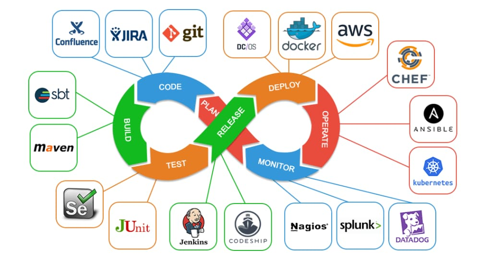
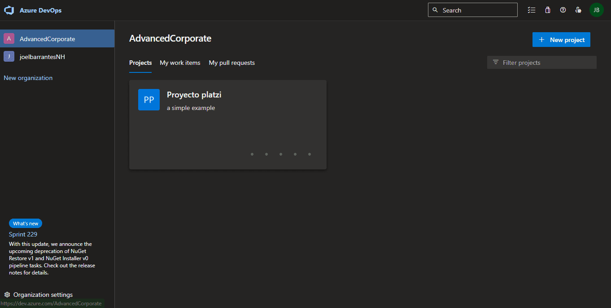
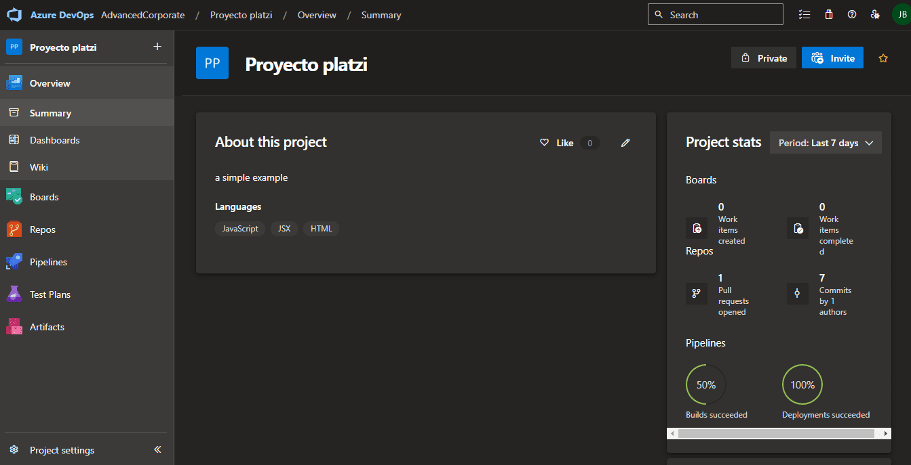
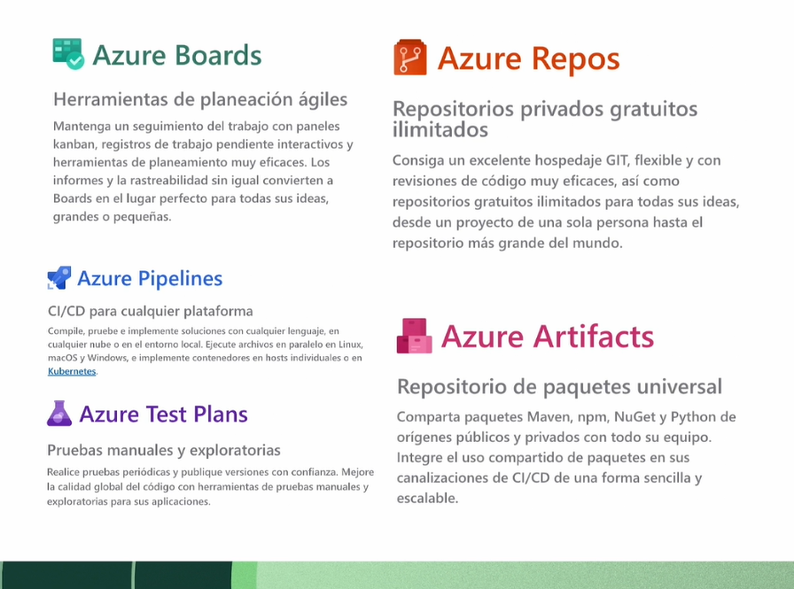
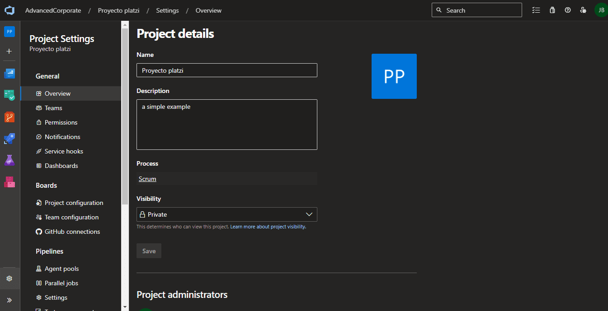

## Curso de Azure DevOps: Flujos de CI/CD

## 1. ¿Qué es DevOps?

Se relaciona a dos componentes Fundamentales: Desarrollo y Operaciones. 

Es una cultura entre el área Desarrollo y Operaciones para facilitar la comunicación. Mas que una herramienta es una combinación de muchas cosas donde se relacionan: personas, actividades, procesos, herramientas.

* Es una cultura
* Se relaciona 2 componentes: Desarrollo y Operaciones
* Aparece en 2009 el concepto
* Cultura de mejora continua que involucra cada uno de los aspectos de TI y procesos de desarrollo
* Se enfoca en procesos, personas y herramientas
* No confundir con: Un puesto de trabajo, una herramienta, metodologia agil, tecnologia, un rol.

### Características:

- El concepto aparece en el 2009.
- Cultura de mejora continua que involucra cada uno de los aspectos de TI y procesos de desarrollo.
- Se enfoca en procesos, personas y herramientas.

### DevOps va de la mano con 
* El Agilismo
* Automatizacion
* Soporte de Infraestructura
* Integracion continua y despliegue continuo

### Ciclo de vida DevOps
* plan -> code -> build -> test -> release -> deploy -> operate -> monitor ->
* plan : azure boards
* code: azure repos
* build, test : azure pipeline
* deploy, operate: azure artifacts
* monitor : azure test plans

### No confundir DevOps con:

- Un puesto de trabajo
- Una herramienta
- Una metodología ágil
- Una tecnología
- Un rol
- DevOps va de la mano con:

### Agilismo.

- Automatización.
- Soporte de infraestructura.
- Integración continua y despliegue continuo.

### Azure DevOps Server

(Azure DevOps en tu propia infraestructura). Esta versión nos permite Instalar en nuestra propia Infraestructura los servicios de Azure DevOps con un esfuerzo bastante grande y limitada, debe ser considerada por seguridad o políticas de compañía. El licenciamiento se da por usuario o por servicios Individuales.

### Recursos para aprender DevOps:

https://dev.to/t/devops
https://devopsdays.org/
https://azuredevopslabs.com/
https://docs.microsoft.com/learn/paths/evolve-your-devops-practices/

## 2. Conociendo Azure DevOps

## 3. Crear una cuenta de Azure DevOps

1. Ingresar al siguiente link: https://azure.microsoft.com/es-es/products/devops

2. crear una cuenta de microsoft o usar la cuenta que ya tienes

3. llenar los datos necesarios y agregar la targeta de credito

## 4. Creando un proyecto y analizando portal

AZURE BOARS . Estas son herramientas ágiles que nos ayudan a planificar, rastrear y discutir nuestro trabajo, incluso con otros equipos.

AZURE PIPELINES. Estos nos permitirán construir, probar e implementar con CI/CD que funciona con cualquier idioma, plataforma y nube.

AZURE TEST PLANS . Estas son herramientas de prueba manuales y exploratorias.

AZURE REPOS . Estos proporcionan repositorios de Git públicos y privados alojados en la nube ilimitados.

AZURE ARTIFACTS . Estos nos permiten crear, alojar y compartir paquetes.

## 5. Creando una organización

* Nuestra Cuenta de Azure DevOps puede tener multiples organizaciones.

* Una Organizacion es un grupo de proyectos que estan relacionados entre si.

* Podemos hacer parte de Organizaciones externas mediante una invitacion, para trabajar en proyectos externos.

* No existe un limite definido, si existen para proyectos, workitems y pipelines aunque igual es bastante olgado. puedes consultar los limites aca: https://docs.microsoft.com/en-us/azure/devops/organizations/accounts/azure-ad-tenant-policy-restrict-org-creation?view=azure-devops

## 6. Configurando una organización

## 7. Analizando aspectos de seguridad

Dejo el enlace de las recomendaciones de seguridad que Microsoft tiene en su página oficial https://docs.microsoft.com/es-es/azure/devops/organizations/security/security-best-practices?view=azure-devops

## 8. Creando Ramas y Pull Request
* Básicamente un pull request es una petición para integrar nuestras propuestas o cambios de código a un proyecto.
* Una buena práctica de ramas es no hacer PR directos a master, los desarrolladores debemos trabajar con una estructura logica que puede variar pero lo más (basico) común es:
- Master
- Release
- Develop
- Features
- Hotfix
* Features y Hotfix son las ramas de un desarrollador, los PR se hacen desde estas ramas hacia develop, los cuales deben ser revisados por un code reviewer.

## 9. Creando un pipeline

Básicamente un pipeline es una secuencia de comandos que hacen una ejecución de la aplicación, para poder comprobar que esta funcionando, compilando, que corran las pruebas unitarias, es decir que esta lista para poderse mover a la siguiente fase o ciclo de desarrollo que es la publicación.

## 10. Configurar el pipeline:

* Se selecciona el framework
* trigger: se dispara desde master
* pool: el agente que se usa, ejemplo, ubuntu
* steps, task: la primera tarea que se va a ejecutar

* Pasos:
* 1. Pipelines
* 2. Azure Repos Git YAML
* 3. Configure your pipeline : Node with React
* 4. Review your pipeline YAML

~~~yml
# Node.js with React
# Build a Node.js project that uses React.
# Add steps that analyze code, save build artifacts, deploy, and more:
# https://docs.microsoft.com/azure/devops/pipelines/languages/javascript

trigger:
- master

pool:
  vmImage: ubuntu-latest

steps:
- task: NodeTool@0
  inputs:
    versionSpec: '16.x'
  displayName: 'Install Node.js'

- script: |
    npm install
  displayName: 'npm install'
  
- script: |
    npm run build
  displayName: 'npm run build'
  
- task: CopyFiles@2
  inputs:
    Contents: 'build/**'
    TargetFolder: '$(build.ArtifactStagingDirectory)'

- task: ArchiveFiles@2
  inputs:
    rootFolderOrFile: '$(Build.ArtifactStagingDirectory)'
    includeRootFolder: true
    archiveType: zip
    archiveFile: '$(Build.ArtifactStagingDirectory)/$(Build.BuildId).zip'
    replaceExistingArchive: true

- task: PublishBuildArtifacts@1
  inputs:
    PathtoPublish: '$(Build.ArtifactStagingDirectory)'
    ArtifactName: 'drop'
~~~

## 11. Azure DevOps MarketPlace

Azure DevOps MarketPlace: Nos permite potencializar las funciones que trae por defecto Azure DevOps.++Existen muchísimas extensiones para Visual Studio, Visual Studio Code, y Azure DevOps. Pagas , Gratuitas o de Suscripción.++

ReportGenerator: Es una extensión de Azure DevOps que nos ayuda a generar un reporte para pruebas unitarias y poder generar el reporte de la cobertura para conocer su porcentaje.
