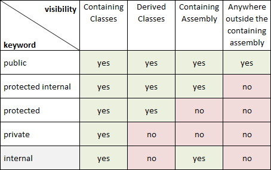

# Curso de C# con .Net Core

## Crear nuevo proyecto

Al ingresar el comando dotnet new la consola muestra los tipos de proyectos que se pueden iniciar

Ejemplo: dotnet new console crea una aplicación de consola.

Al crear el proyecto, ser crear autmáticamente tres arhivos:

obj
nombreProyecto.csproj
Program.cs
Otra forma de generar el proyecto podría ser dotnet new console --output *nombreCarpeta*. Esto nos permite indicar el que lugar se desea generar el nuevo proyecto.

Ejecutar el proyecto

El comando dotnet run ejecuta la aplicación

Construir aplicación

dotnet build analiza y compila todo el código y genera el binario final.

Observaciones:

El archivo.dll es que archivo nativo que se puede ejecutar desde cualquier sistema operativo

dotnet *archivo.dll ejecuta el programa, pero a diferencia de build, directamente ejecuta sin analizar el código.*

Generando ejecutables especializas u optimizadas para un sistema en particular

El flag -c se utiliza para especificar si sera una versión de producción o desarrollo. Release es para producción.

El flag -r determina el sistema operativo objetivo y versión para la cual se desea optimizar el ejecutable.

Ejemplo: dotnet build -c Release -r win10-x64

## Introducción a la Programación Orientada a Objetos

los niveles de accesos que se tiene con los keyword 

