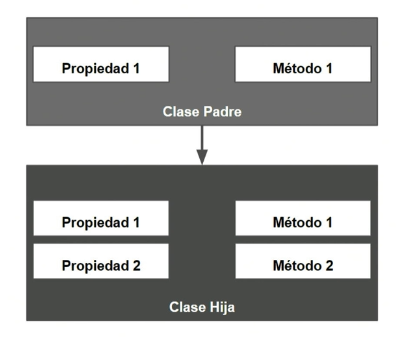
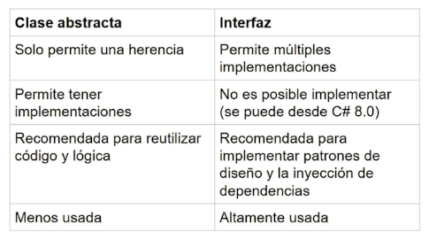

## 1. ¿Que es la programación orientada a objetos (POO)?

    Formas o estilos en los que podemos programar y estructurar nuestro código.

Paradigmas importantes:

    Programación funcional
    Programación estructurada
    Programación reactiva
    Programación orientada a aspectos
    Programación orientada a objetos

C# es multi-paradigma, el cual nos permite usar multiples estilos de programación. Lo común en C# es mezclar varios paradigmas al escribir el código.

## 2. Creando tu primera clase y objeto

~~~csharp
Television tv = new Television();
tv.Brand = "Samsung";
tv.Color = "negro";

Console.WriteLine($"Brand: {tv.Brand}, Color: {tv.Color}");

class Television{
  public string Color;
  public double Width;
  public double Height;
  public int Buttom;
  public string Brand;
  public bool Status;
}
~~~

## 3. Concepto de clases y objetos

En la programación orientada a objetos (POO), una clase es una plantilla que define los datos y el comportamiento de un objeto. Un objeto es una instancia de una clase, es decir, una entidad concreta que existe en el mundo real.

Las clases y los objetos son los dos conceptos más importantes de la POO. Las clases sirven para definir el comportamiento y los datos de un objeto, mientras que los objetos son las instancias concretas de ese comportamiento y esos datos.

### Concepto de clase

Una clase es una plantilla que define los datos y el comportamiento de un objeto. Una clase define los siguientes elementos:

* Atributos: Los atributos son las características de un objeto. Por ejemplo, un objeto de la clase Persona puede tener los atributos nombre, apellidos y edad.

* Métodos: Los métodos son las acciones que puede realizar un objeto. Por ejemplo, un objeto de la clase Persona puede tener el método hablar() que le permite hablar.

### Concepto de objeto

Un objeto es una instancia de una clase. Un objeto es una entidad concreta que existe en el mundo real. Un objeto tiene los siguientes elementos:

* Valores de los atributos: Los valores de los atributos de un objeto definen su estado. Por ejemplo, un objeto de la clase Persona con el nombre Juan Pérez y la edad 30 tiene los valores Juan Pérez y 30 para los atributos nombre y edad, respectivamente.
    
* Comportamiento: Un objeto puede realizar las acciones definidas por sus métodos. Por ejemplo, un objeto de la clase Persona puede hablar usando el método hablar().

### Ejemplo

A continuación se muestra un ejemplo de una clase en C#:
C#

~~~csharp
public class Persona
{
    public string Nombre { get; set; }
    public string Apellidos { get; set; }
    public int Edad { get; set; }

    public void Hablar()
    {
        Console.WriteLine("Hola, soy {0} {1} y tengo {2} años", this.Nombre, this.Apellidos, this.Edad);
    }
}
~~~

Utiliza el código con precaución. Más información

Esta clase define los siguientes atributos:

    Nombre: El nombre de la persona.
    Apellidos: Los apellidos de la persona.
    Edad: La edad de la persona.

También define el siguiente método:

    Hablar(): Este método hace que la persona hable.

A continuación se muestra un ejemplo de cómo crear una instancia de esta clase:

~~~csharp
Persona persona = new Persona();
persona.Nombre = "Juan";
persona.Apellidos = "Pérez";
persona.Edad = 30;

persona.Hablar();
~~~

Utiliza el código con precaución. Más información

Este código creará una instancia de la clase Persona con el nombre Juan Pérez y la edad 30. Luego, llamará al método Hablar() de esta instancia.

Ventajas de la programación orientada a objetos

La programación orientada a objetos ofrece las siguientes ventajas:

- Reutilización de código: Las clases pueden reutilizarse para crear objetos nuevos.
- Encapsulación: Los datos y el comportamiento de un objeto se pueden encapsular, lo que hace que el código sea más fácil de entender y mantener.
- Herencia: Las clases pueden heredar de otras clases, lo que permite compartir código y comportamiento.
- Polimorfismo: Los objetos de diferentes clases pueden comportarse de forma similar, lo que hace que el código sea más flexible.

## 4. Creando clases y propiedades

~~~csharp
var superman = new SuperHeroe();

superman.Id = 1;
superman.Nombre = "Superman";
superman.IdentidadSecreta = "Clark Kent";
superman.Ciudad = "Metropolis";
superman.PuedeVolar = true;
superman.SuperPoderes = new []{ "Vision de rayos X", "Volar", "Super fueza", "Ojos rayos lazer" };

class SuperHeroe
{
    public int Id { get; set; }
    public string Nombre { get; set; }
    public string IdentidadSecreta { get; set; }
    public string Ciudad { get; set; }
    public List<SuperPoder> SuperPoderes { get; set; }
    public bool PuedeVolar { get; set; }
}
~~~

## 5. Creando clases complejas

~~~csharp
var poderVolar = new SuperPoder();
poderVolar.Nombre = "Volar";
poderVolar.Descripcion = "Capacidad para volar y planear en el aire";
poderVolar.Nivel = NivelPoder.NivelDos;

var superFuerza = new SuperPoder();
superFuerza.Nombre = "Super fuerza";
superFuerza.Nivel = NivelPoder.NivelTres;

var superman = new SuperHeroe();
superman.Id = 1;
superman.Nombre = "Superman";
superman.IdentidadSecreta = "Clark Kent";
superman.Ciudad = "Metropolis";
superman.PuedeVolar = true;

List<SuperPoder> poderesSuperman = new List<SuperPoder>();
poderesSuperman.Add(poderVolar);
poderesSuperman.Add(superFuerza);
superman.SuperPoderes = poderesSuperman;

class SuperHeroe
{
    public int Id { get; set; }
    public string Nombre { get; set; }
    public string IdentidadSecreta { get; set; }
    public string Ciudad { get; set; }
    public List<SuperPoder> SuperPoderes { get; set; }
    public bool PuedeVolar { get; set; }
}

class SuperPoder
{
    public string Nombre { get; set; }
    public string Descripcion { get; set; }
    public NivelPoder Nivel { get; set; }
}

enum NivelPoder
{
    NivelUno,
    NivelDos,
    NivelTres
}
~~~

## 6. Constructor y datos iniciales en una clase

~~~csharp
class SuperHeroe
{
    public int Id = 1;
    public string Nombre;
    public string IdentidadSecreta;
    public string Ciudad;
    public List<SuperPoder> SuperPoderes = new List<SuperPoder>();
    public bool PuedeVolar;

    public SuperHeroe()
    {
        Id = 1;
        SuperPoderes = new List<SuperPoder>();
        PuedeVolar = false;
    }
}

class SuperPoder
{
    public string Nombre;
    public string Descripcion;
    public NivelPoder Nivel;

    public SuperPoder()
    {
        Nivel = NivelPoder.NivelUno;
    }
}
~~~

## 7. Métodos dentro de una clase

~~~csharp
using System.Text;

var poderVolar = new SuperPoder();
poderVolar.Nombre = "Volar";
poderVolar.Descripcion = "Capacidad para volar y planear en el aire";
poderVolar.Nivel = NivelPoder.NivelDos;

var superFuerza = new SuperPoder();
superFuerza.Nombre = "Super fuerza";
superFuerza.Nivel = NivelPoder.NivelTres;

var superman = new SuperHeroe();

superman.Id = 1;
superman.Nombre = "Superman";
superman.IdentidadSecreta = "Clark Kent";
superman.Ciudad = "Metropolis";
superman.PuedeVolar = true;

List<SuperPoder> poderesSuperman = new List<SuperPoder>();
poderesSuperman.Add(poderVolar);
poderesSuperman.Add(superFuerza);
superman.SuperPoderes = poderesSuperman;
string resultSuperPoderes = superman.UsarSuperPoderes();
Console.WriteLine(resultSuperPoderes);

class SuperHeroe
{
    public int Id = 1;
    public string Nombre;
    public string IdentidadSecreta;
    public string Ciudad;
    public List<SuperPoder> SuperPoderes = new List<SuperPoder>();
    public bool PuedeVolar;

    public SuperHeroe()
    {
        Id = 1;
        SuperPoderes = new List<SuperPoder>();
        PuedeVolar = false;
    }

    public string UsarSuperPoderes()
    {
        StringBuilder sb = new StringBuilder();
        foreach (var item in SuperPoderes)
        {
            sb.AppendLine($"{Nombre} esta usando el super poder {item.Nombre}!!");
        }

        return sb.ToString();
    }
}

class SuperPoder
{
    public string Nombre;
    public string Descripcion;
    public NivelPoder Nivel;

    public SuperPoder()
    {
        Nivel = NivelPoder.NivelUno;
    }
}

enum NivelPoder
{
    NivelUno,
    NivelDos,
    NivelTres
}

~~~

## 8. Tipos registro y estructura
En programación, un registro y una estructura son dos tipos de datos estructurados que permiten agrupar datos de diferentes tipos. La principal diferencia entre un registro y una estructura es que un registro es un tipo de dato definido por el lenguaje, mientras que una estructura es un tipo de dato definido por el programador.

### Registro

Un registro es un tipo de dato definido por el lenguaje que permite agrupar datos de diferentes tipos. Los registros se utilizan a menudo para representar objetos del mundo real, como personas, animales o objetos.

En C#, un registro se declara utilizando la palabra clave struct:

~~~csharp
record Persona
{
    public string Nombre;
    public int Edad;
}
~~~

Para crear una instancia de un registro, se utiliza el operador new:

~~~csharp
Persona persona = new Persona();
persona.Nombre = "Juan Pérez";
persona.Edad = 30;
~~~

### Estructura

Una estructura es un tipo de dato definido por el programador que permite agrupar datos de diferentes tipos. Las estructuras se utilizan a menudo para representar objetos del mundo real, como personas, animales o objetos.

En C#, una estructura se declara utilizando la palabra clave struct:

~~~csharp
struct Persona
{
    public string Nombre;
    public int Edad;
}
~~~

Para crear una instancia de una estructura, se utiliza el operador new:

~~~csharp
Persona persona = new Persona();
persona.Nombre = "Juan Pérez";
persona.Edad = 30;
~~~

### Diferencias entre registro y estructura

La principal diferencia entre un registro y una estructura es que un registro es un tipo de dato definido por el lenguaje, mientras que una estructura es un tipo de dato definido por el programador.

### Otras diferencias entre un registro y una estructura son:

- Los registros son tipos de datos primitivos, mientras que las estructuras son tipos de datos compuestos.
- Los registros se utilizan a menudo para representar objetos del mundo real, mientras que las estructuras se utilizan a menudo para representar conceptos matemáticos o abstractos.
- Los registros son más eficientes que las estructuras, ya que se almacenan en memoria de forma contigua.

~~~csharp
public record SuperHeroRecord(int Id, string Nombre, string IdentidadSecreta);

var superman = new SuperHeroe();
superman.Id = 1;
superman.Nombre = "Superman";
superman.IdentidadSecreta = "Clark Kent";
superman.Ciudad = "Metropolis";
superman.PuedeVolar = true;

var superman2 = new SuperHeroe();
superman2.Id = 1;
superman2.Nombre = "Superman";
superman2.IdentidadSecreta = "Clark Kent";
superman2.Ciudad = "Metropolis";
superman2.PuedeVolar = true;

Console.WriteLine(superman == superman2); //False

SuperHeroRecord superHeroRecord = new(1, "Superman", "Clark Kent");
SuperHeroRecord superHeroRecord2 = new(1, "Superman", "Clark Kent");

Console.Write(superHeroRecord == superHeroRecord2); //True

~~~

## 9. Modificadores de acceso

Los modificadores de acceso en programación C# orientada a objetos controlan el nivel de acceso que tienen las clases, los métodos, los campos y las propiedades a otros tipos y miembros. Hay cuatro modificadores de acceso en C#:

- public: Los miembros públicos son accesibles desde cualquier lugar del programa.
- protected: Los miembros protegidos son accesibles desde la clase en la que están definidos, así como desde las clases derivadas de esa clase.
- internal: el Acceso está limitado al ensamblado actual (el proyecto).
- Protected internal: El acceso está limitado al ensamblado actual o a los tipos derivados de la clase contenedora.
- private: Evitamos que cualquiera que este fuera del contexto de nuestra clase pueda utilizar los métodos o propiedades de la clase. El acceso está limitado al tipo contenedor. 
- Private Protected: El acceso está limitado a la clase contenedora o a los tipos derivados de la clase contenedora que hay en el ensamblado actual

## 10. Encapsulamiento

El encapsulamiento es un principio de la programación orientada a objetos que oculta los detalles de implementación de un objeto de los usuarios de ese objeto. Esto hace que el código sea más fácil de mantener y reutilizar.
El encapsulamiento ofrece las siguientes ventajas:

- Mejor legibilidad: El código es más fácil de entender cuando los detalles de implementación están ocultos.
- Mejor mantenibilidad: El código es más fácil de mantener cuando los cambios se pueden realizar sin afectar a otros componentes del sistema.
- Mejor reutilización: El código es más fácil de reutilizar cuando está bien encapsulado.

~~~csharp
using System;
using System.Collections.Generic;
using System.Linq;
using System.Text;
using System.Threading.Tasks;

namespace SuperHeroesApp.Models
{
    class SuperHeroe
    {
        private string _Nombre;
        public int Id = 1;
        public string Nombre 
        { 
            get
            {
                return _Nombre;
            }
            
            set
            {
                _Nombre = value.Trim();
            }
        }

        public string NombreEIdentidadSecreta
        {
            get
            {
                return $"{Nombre} ({IdentidadSecreta})";
            }
        }

        public string IdentidadSecreta;
        public string Ciudad;
        public List<SuperPoder> SuperPoderes = new List<SuperPoder>();
        public bool PuedeVolar;

        public SuperHeroe()
        {
            Id = 1;
            SuperPoderes = new List<SuperPoder>();
            PuedeVolar = false;
        }

        public string UsarSuperPoderes()
        {
            StringBuilder sb = new StringBuilder();
            foreach (var item in SuperPoderes)
            {
                sb.AppendLine($"{NombreEIdentidadSecreta} esta usando el super poder {item.Nombre}!!");
            }

            return sb.ToString();
        }
    }
}
~~~

## 11. ¿Que es herencia?
En la programación orientada a objetos (POO), la "herencia" es un principio fundamental. Una clase puede heredar propiedades y métodos de otra clase. En C# con .NET, esto se logra utilizando la palabra clave :, lo que permite que una clase "hija" herede características de una clase "padre".

## 12. Usando herencia en C#

~~~csharp
using System;
using System.Collections.Generic;
using System.Linq;
using System.Text;
using System.Threading.Tasks;

namespace SuperHeroesApp.Models
{
    internal class AntiHeroe : SuperHeroe
    {
        public string RealizarAccionDeAntiheroe(string accion)
        {
            return $"El Antiheroe {NombreEIdentidadSecreta} ha realizado: {accion}";
        }
    }
}
~~~

## 13. Abstracción
Las clases abstractas obligan a las clases que la heredan a implementar sus métodos abstractos:

- Cuando en una clase abstracta se crean susmétodos, estos no pueden contener un cuerpo de dicho método.
- Cuando se hereda de una clase abstracta que contiene métodos o propiedades abstractas por obligación la clase que lo hereda tiene que implementarla con la palabra reservada override y crear el cuerpo de los métodos.

~~~csharp
using System;
using System.Collections.Generic;
using System.Linq;
using System.Text;
using System.Threading.Tasks;

namespace SuperHeroesApp.Models
{
    internal abstract class Heroe
    {
        public abstract string Nombre { get; set; }

        public abstract string SalvarElMundo();

        public string SalvarLaTierra()
        {
            return $"{Nombre} ha salvado la tierra";
        }
    }
}
~~~

* la palabra clave "override" permite sobrescribir un propiedad o metodo

~~~csharp
namespace SuperHeroesApp.Models
{
    class SuperHeroe : Heroe
    {
        private string _Nombre;
        public int Id = 1;
        public override string Nombre 
        { 
            get
            {
                return _Nombre;
            }
            
            set
            {
                _Nombre = value.Trim();
            }
        }

        public string NombreEIdentidadSecreta
        {
            get
            {
                return $"{Nombre} ({IdentidadSecreta})";
            }
        }

        public string IdentidadSecreta;
        public string Ciudad;
        public List<SuperPoder> SuperPoderes = new List<SuperPoder>();
        public bool PuedeVolar;

        public SuperHeroe()
        {
            Id = 1;
            SuperPoderes = new List<SuperPoder>();
            PuedeVolar = false;
        }

        public string UsarSuperPoderes()
        {
            StringBuilder sb = new StringBuilder();
            foreach (var item in SuperPoderes)
            {
                sb.AppendLine($"{NombreEIdentidadSecreta} esta usando el super poder {item.Nombre}!!");
            }

            return sb.ToString();
        }

        public override string SalvarElMundo()
        {
            return $"{NombreEIdentidadSecreta} ha salvado el mundo";
        }
    }

}
~~~

## 14. Polimorfismo
El termino Polimorfismo se deriva de las palabras griegas "poly" (Muchos) "morphe" (Formas) , que significa muchas formas. por lo tanto, el polimorfismo permite que objetos de diferentes clases se comporten de manera similar a través de una interfaz común o una clase base. 

El polimorfismo se basa en dos conceptos claves:

1- Herencia:

2:Métodos polimórficos: En una jerarquía de clases, las clases derivadas pueden proporcionar implementaciones específicas para los métodos de la clase base. Esto permite que las clases derivadas reemplacen (anulen) los métodos de la clase base con sus propias implementaciones.

* la palabra clave "virtual" permite que sea opcional los metodos en la clases hijas que hereden del padre

~~~csharp
using System;
using System.Collections.Generic;
using System.Linq;
using System.Text;
using System.Threading.Tasks;

namespace SuperHeroesApp.Models
{
    internal abstract class Heroe
    {
        public abstract string Nombre { get; set; }

        public abstract string SalvarElMundo();

        public virtual string SalvarLaTierra()
        {
            return $"{Nombre} ha salvado la tierra";
        }
    }
}
~~~

~~~csharp
using System;
using System.Collections.Generic;
using System.Linq;
using System.Text;
using System.Threading.Tasks;

namespace SuperHeroesApp.Models
{
    class SuperHeroe : Heroe
    {
        private string _Nombre;
        public int Id = 1;
        public override string Nombre 
        { 
            get
            {
                return _Nombre;
            }
            
            set
            {
                _Nombre = value.Trim();
            }
        }

        public string NombreEIdentidadSecreta
        {
            get
            {
                return $"{Nombre} ({IdentidadSecreta})";
            }
        }

        public string IdentidadSecreta;
        public string Ciudad;
        public List<SuperPoder> SuperPoderes = new List<SuperPoder>();
        public bool PuedeVolar;

        public SuperHeroe()
        {
            Id = 1;
            SuperPoderes = new List<SuperPoder>();
            PuedeVolar = false;
        }

        public string UsarSuperPoderes()
        {
            StringBuilder sb = new StringBuilder();
            foreach (var item in SuperPoderes)
            {
                sb.AppendLine($"{NombreEIdentidadSecreta} esta usando el super poder {item.Nombre}!!");
            }

            return sb.ToString();
        }

        public override string SalvarElMundo()
        {
            return $"{NombreEIdentidadSecreta} ha salvado el mundo";
        }

        public override string SalvarLaTierra()
        {
            //return base.SalvarLaTierra();
            return $"{NombreEIdentidadSecreta} ha salvado la tierra";
        }
    }

}
~~~

## 15. ¿Que es una interfaz?

- normalmente se declaran con "I" al inicio del nombre.
- Se utiliza en casi todos los patrones de diseño
- podemos implementar generics para utilizar la misma interfaz en diferentes escenarios. Ejemplo: IList<T>

### Otros
- Las interfaces no pueden tener instancias. Una interfaz solo puede ser implementada por un tipo de datos.
- Las interfaces solo pueden definir métodos, propiedades y eventos. Las clases pueden definir datos de instancia, métodos, propiedades y eventos.
- Las interfaces se utilizan para especificar el comportamiento. Las clases se utilizan para definir tipos de datos.

## 16. Interfaces vs Clases abstractas

