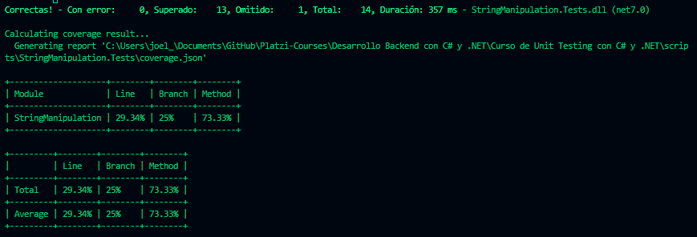

# Curso de Unit Testing con C# y .NET

## 1. ¿Qué son pruebas unitarias?

Test Driven Development (TDD) es una práctica de desarrollo de software que se basa en crear casos de prueba unitarios antes de desarrollar el código. 

El objetivo es mejorar la calidad y el diseño del código mediante un ciclo de tres pasos: 
1. escribir una prueba que falle
2. corregir el código para que pase la prueba 
3. refactorizar el código para mejorarlo 

TDD es una técnica que se origina en los principios del manifiesto ágil y la programación extrema.

Origen: 
(1) What is Test Driven Development (TDD)? - BrowserStack. https://www.browserstack.com/guide/what-is-test-driven-development. 

(2) What is Test Driven Development (TDD)? Example - Guru99. https://www.guru99.com/test-driven-development.html. 

(3) What is Test Driven Development (TDD)? | Agile Alliance. https://www.agilealliance.org/glossary/tdd/. 

(4) Test-driven development - Wikipedia. https://en.wikipedia.org/wiki/Test-driven_development.

### Pruebas unitarias

- Pruebas sobre una unidad de codigo como una propiedad, funcion o metodo.
- Automatizables
- Reutilizables
- Independientes

## 2. Librerías de pruebas en .NET

NuNit, xUnit y MSTest son marcos de pruebas unitarias para .NET. Cada uno tiene sus ventajas y desventajas, dependiendo de lo que busques. Por ejemplo:

1. MSTest es el marco oficial de Microsoft, que se integra con Visual Studio y ofrece pruebas de integración. alta complejidad para algunos casos.

2. NUnit es el marco más antiguo y popular basada en JUnit de java, es opensource y muy facil de usar. tiene muchas características y una gran comunidad. 

3. xUnit es el marco más moderno y específico para .NET, que ofrece mejor aislamiento de las pruebas y soporta 32 y 64 bits. es open source y simplifica todo el proceso de creación de pruebas.

## 3. Herramientas y código base

~~~csharp
using Humanizer;
using Microsoft.Extensions.Logging;
using System;
using System.Collections.Generic;
using System.Linq;
using System.Security.Cryptography.X509Certificates;
using System.Text;
using System.Threading.Tasks;

namespace StringManipulation
{
    public class StringOperations
    {
        private readonly ILogger _logger;
        public StringOperations() {
        }

        public StringOperations(ILogger<StringOperations> logger)
        {
            _logger = logger;
        }

        public string ConcatenateStrings(string str1, string str2)
        {
            return str1 + " " + str2;
        }

        public string ReverseString(string str)
        {
            char[] charArray = str.ToCharArray();
            Array.Reverse(charArray);
            return new string(charArray);
        }

        public int GetStringLength(string str)
        {
            if(str is null)
            {
                throw new ArgumentNullException();
            }

            return str.Length;
        }

        public string RemoveWhitespace(string input)
        {
            return new string(input.ToCharArray()
                .Where(c => !Char.IsWhiteSpace(c))
                .ToArray());
        }

        public string TruncateString(string input, int maxLength)
        {
            if(maxLength <=0)
            {
                throw new ArgumentOutOfRangeException();
            }

            if (string.IsNullOrEmpty(input) || maxLength >= input.Length)
            {
                return input;
            }

            return input.Substring(0, maxLength);
        }

        public bool IsPalindrome(string input)
        {
            string reversed = ReverseString(input);
            return input.Equals(reversed, StringComparison.OrdinalIgnoreCase);
        }

        public int CountOccurrences(string input, char character)
        {
            int count = 0;
            foreach (char c in input)
            {
                if (c == character)
                {
                    count++;
                }
            }

            _logger.LogInformation($"Number of concurrecies is:{count}");
            return count;
        }

        public string Pluralize(string input)
        {
            return input.Pluralize();
        }

        public string QuantintyInWords(string input, int quantity)
        {
            return input.ToQuantity(quantity, ShowQuantityAs.Words);
        }

        public int FromRomanToNumber(string input)
        {
            return input.FromRoman();
        }

        public string ReadFile(IFileReaderConector fileReader, string fileName)
        {
            return fileReader.ReadString(fileName);
        }

    }
}
~~~

## 4. Creando tu primera prueba con xUnit

Crear una solucion en la carpeta raiz donde estaba la carpeta del proyecto de libreria

> dotnet new sln --name UnitTestingNetCSharp

creo el proyecto de test

> dotnet new xunit -o StringManipulationTest

agrego ambos proyectos a la solucion

> dotnet sln add StringManipulation/StringManipulation.csproj dotnet sln add StringManipulationTest/StringManipulationTest.csproj

luego agrego al proyecto de test la referencia al proyecto de la libreria

> dotnet add StringManipulationTest/StringManipulationTest.csproj reference StringManipulation/StringManipulation.csproj

~~~csharp
namespace StringManipulation.Tests
{
    public class StringOperationsTest
    {
        [Fact]
        public void ConcatenateStrings()
        {
            var strOperation = new StringOperations();
            var result = strOperation.ConcatenateStrings("Hello", "Platzi");
            Assert.Equal("Hello Platzi", result);
        }
    }
}
~~~

## 5. Tipos de Assert en xUnit

- Arrange: configurar datos de pruebas.
- Act: ejecución de la prueba como tal, en pruebas unitarias se prueba una funcion.
- Assert: es la comprobación del resultado que la función devuelve.

### El acrónimo "FIRST" 
En el contexto de pruebas de software se refiere a un conjunto de principios para pruebas de unidad, que son fundamentales en el enfoque de pruebas ágiles. Estos principios son los siguientes:

- Fast (Rápido): Las pruebas deben ser rápidas, lo que significa que deben ejecutarse rápidamente para proporcionar comentarios de manera oportuna.
- Isolated (Aislado): Cada prueba debe ser independiente y no debe depender de ninguna otra prueba.
- Repeatable (Repetible): Las pruebas deben ser repetibles en cualquier entorno y en cualquier momento.
- Self-validating (Autovalidación): El resultado de la prueba debe ser de tal manera que pueda ser fácilmente interpretado sin ninguna intervención humana.
- Timely (Oportuno): Las pruebas deben ser escritas a tiempo, es decir, antes de que se escriba el código de producción.

### tests creados

~~~csharp
[Fact]
public void IsPalindrome_True()
{
    //Arrange
    var strOperation = new StringOperations();

    //act
    bool result = strOperation.IsPalindrome("ana");

    //Assert
    Assert.True(result);
}

[Fact]
public void IsPalindrome_False()
{
    //Arrange
    var strOperation = new StringOperations();

    //act
    bool result = strOperation.IsPalindrome("platzi");

    //Assert
    Assert.False(result);
}
~~~

### Correr test en la terminal
> dotnet test

## 6. Tipos de Assert en xUnit parte 2

~~~csharp
[Fact]
public void RemoveWhitespace()
{
    var strOperation = new StringOperations();
    string result = strOperation.RemoveWhitespace(" platzi ");
    Assert.NotNull(result);
    Assert.NotEmpty(result);
    Assert.Equal("platzi", result);
}

[Fact]
public void QuantintyInWords()
{
    //Arrange
    var strOperation = new StringOperations();
    //Act
    var result = strOperation.QuantintyInWords("cat", 10);
    //Assert
    Assert.StartsWith("ten", result);
    Assert.Contains("cat", result);
}

[Fact]
public void GetStringLength_Exception()
{
    var strOperation = new StringOperations();

    Assert.ThrowsAny<ArgumentNullException>(() => strOperation.GetStringLength(null));
}

[Fact]
public void TruncateString_Exception()
{
    var strOperation = new StringOperations();

    Assert.ThrowsAny<ArgumentOutOfRangeException>(() => strOperation.TruncateString("platzi", 0));
}
~~~

## 7. Atributos Theory e InlineData

~~~csharp
[Theory]
[InlineData("I", 1)]
[InlineData("V", 5)]
[InlineData("XX", 20)]
[InlineData("L", 50)]
public void FromRomanToNumber(string romanNumber, int expected)
{
    var strOperation = new StringOperations();

    int result = strOperation.FromRomanToNumber(romanNumber);

    Assert.Equal(expected, result);
}
~~~

## 8. Atributo Skip

~~~csharp
[Fact(Skip = "Esta prueba no es valida")]
public void ConcatenateStrings()
{
    //Arrange
    var strOperation = new StringOperations();
    
    //act
    var result = strOperation.ConcatenateStrings("Hello", "Platzi");
    
    //Assert
    Assert.NotNull(result);
    Assert.NotEmpty(result);
    Assert.Equal("Hello Platzi", result);
}
~~~

Mas información, comparar los tipos de Tests que existen en c#: https://xunit.net/docs/comparisons

## 9. Revisemos lo que hemos aprendido

- El TDD (Test Driven Development) y las "Unit Testing" (Pruebas Unitarias) son dos prácticas relacionadas pero diferentes en el desarrollo de software.

- El TDD es una metodología de desarrollo de software en la que se enfatiza la creación de pruebas antes de escribir el código de la aplicación.

Las pruebas unitarias son una práctica dentro del desarrollo de software en la que se crean pruebas específicas para cada componente o unidad individual del código (por ejemplo, una función, método o clase) aisladamente.

## 10. Concepto de mock y libreria moq en .NET

La librería Moq es una herramienta popular en el mundo de desarrollo de software en C# que se utiliza para crear objetos simulados o "mocks" de clases y interfaces. Estos objetos simulados son útiles en pruebas unitarias y pruebas de integración para aislar el código bajo prueba y verificar su comportamiento sin depender de implementaciones reales de clases o interfaces.

## 11. Utilizando la libreria Moq

instalar la libreria Moq

~~~csharp
using Moq;

[Fact]
public void CountOccurrences()
{
    var mockLogger = new Mock<ILogger<StringOperations>>();

    var strOperation = new StringOperations(mockLogger.Object);

    var result = strOperation.CountOccurrences("Hello platzi", 'l');

    Assert.Equal(3, result);
}
~~~

## 12. Mock de funciones

~~~csharp
[Fact]
public void ReadFile()
{
    var strOperation = new StringOperations();

    var mockFileReader = new Mock<IFileReaderConector>();
    //mockFileReader.Setup(p => p.ReadString("file.txt")).Returns("Reading file");
    mockFileReader.Setup(p => p.ReadString(It.IsAny<string>())).Returns("Reading file");
    var result = strOperation.ReadFile(mockFileReader.Object, "file_download.txt");

    Assert.Equal("Reading file", result);

}
~~~

## 13. Que es la cobertura de pruebas y como se mide?

La cobertura de pruebas en C# se refiere a la medida en que las pruebas automatizadas cubren el código fuente de un programa escrito en C#. En otras palabras, indica qué parte del código fuente ha sido ejecutada y probada durante la ejecución de las pruebas automatizadas. La cobertura de pruebas es una métrica importante para evaluar la calidad de las pruebas y la confiabilidad del software.

### coverage en .net Framework

- NCover
- openCover

###  coverage en jetBrains

- dotCover

### Open Source

- Fine code Coverage
- Coverlet: Es multiplataforma, soporta .NEt Framework y .net Core, Funciona con VSTest, NUnit, XUnit. Permite generar reporte y configuraciones.

## 14. Iniciando Coverlet

> dotnet add package coverlet.msbuild
> dotnet add package coverlet.collector
> dotnet tool install --global coverlet.console --version 6.0.0
> dotnet test /p:CollectCoverage=true

## 15. Atributos de configuración en coverlet

Correr coverlet
> dotnet test /p:CollectCoverage=true

Correr coverlet y Especificar una clase
> dotnet test /p:CollectCoverage=true /p:Include="[*]StringManipulation.*"

Otra forma de excluir
~~~csharp

using Microsoft.Extensions.Logging;
using StringManipulation;
using System.Diagnostics.CodeAnalysis;

[ExcludeFromCodeCoverage]
internal class Program
{
    private static void Main(string[] args)
    {
    }
}
~~~

> dotnet test /p:CollectCoverage=true /p:ExcludeByAttribute="ExcludeFromCodeCoverage"

## 16. Reporte de cobertura

1. Obtenemos el reporte de cobertura en xml

> dotnet test /p:CollectCoverage=true /p:CoverletOutputFormat=cobertura

2. Instalar ReportGenerator como herramienta global (elegir uno de los siguientes comandos)

> dotnet tool install -g dotnet-reportgenerator-globaltool

> dotnet tool install dotnet-reportgenerator-globaltool --tool-path tools

> dotnet new tool-manifest dotnet tool install dotnet-reportgenerator-globaltool

3. Utilizando ReportGenerator

> reportgenerator "-reports:coverage.cobertura.xml” "-targetdir:coverage-report" -reporttypes:html;

