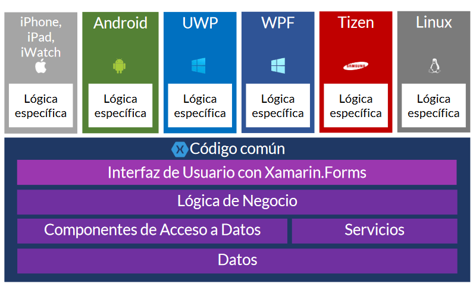
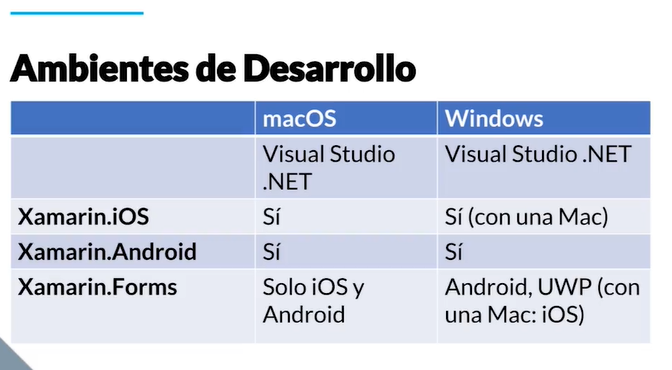
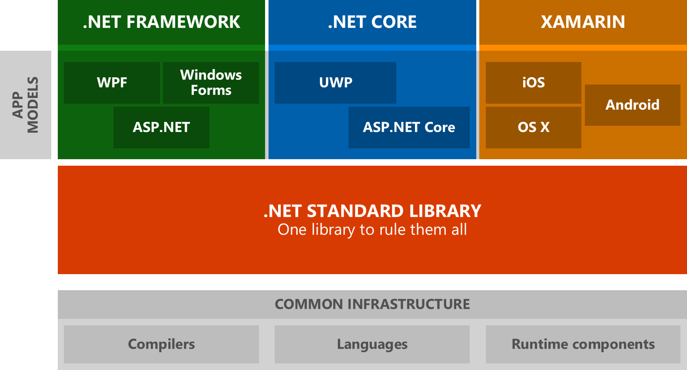
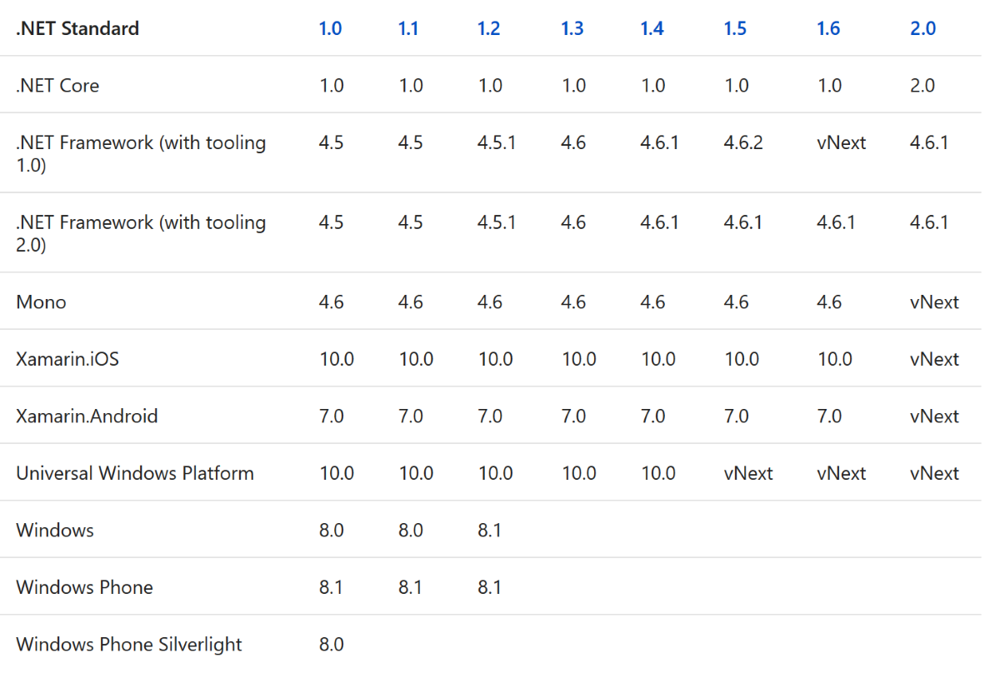
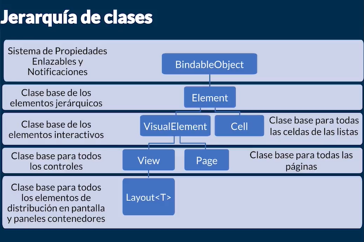
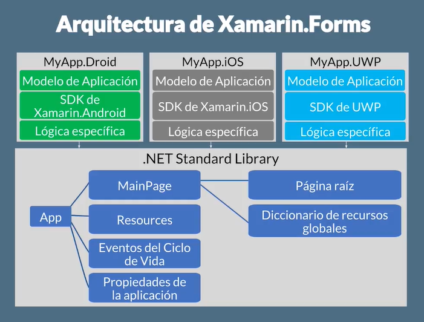
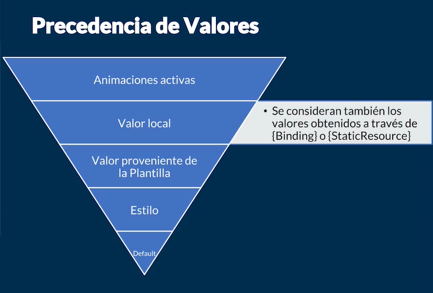
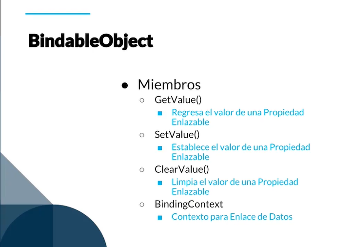
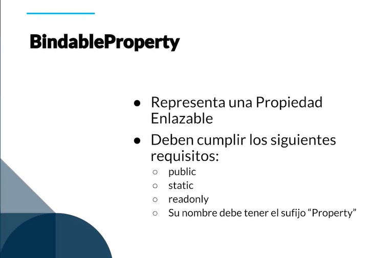

# Xamarin Forms

Xamarin es una plataforma de desarrollo que nos permite construir aplicaciones **multiplataforma.** Expone las APIs de los sistemas operativos mas importantes en el espacio móvil hacia el mundo de .NET para que los desarrolladores de C# puedan usar dichas APIs para construir aplicaciones multiplataforma.

**Características:**
La interfaz de usuario que se desarrollan con Xamarin son nativas
Código compartido entre todas las plataformas
C# y el .NET framework
Adquirido por Microsoft en Febrero de 2016
Open Source y en constante innovación
Interfaz de usuario con Xamarin.Forms
Está basado en Mono

Busca los repositorios:

* github.com/xamarin
* github.com/xamarin/Xamarin.Forms

## 1. Introducción a Instalación de Visual Studio .NET y Herramientas

### Visual Studio.NET

Es el entorno de desarrollo para aplicaciones Android, iOS, UWP, etc
Para Windows y para Mac

### Android SDK Manager

SDK (“Software Development Kit”)

Nuevo administrador de SDKs y componentes relacionados
Resuelve las dependencias automáticamante

### Android Device Manager

Nueva herramienta para crear, editar y controlar dispositivos virtuales Android
Requiere Android SDK Tools 26 o superior

### iOS Simulator for Windows

Permite probar y depurar aplicaciones iOS completamente en Visual Studio.NET
Soporte a pantallas táctiles
Contar con una Mac sigue siendo requerido

### Xamarin Live Player

Despliega y ejecuta aplicaciones de una manera rápida y sencilla
Requiere tener instalada la app Xamarin Live Player en tu dispositivo

### Visual Studio for Mac

Nuevo entorno de desarrollo para aplicaciones Android, iOS, Mac, ASP.NET Core y juegos con Unity

## 2. Instalación de Visual Studio .NET en Windows

* Instalar Visual Studio Community 2017
* Instalar los componentes de Xamarin, Xamarin Remoted Simulator y Xamarin Workbooks
* Instalar los emuladores selecciona Google Android Emulator
* Configura el emulador de Android como te convenga

En la pestaña de Tools Instalar:
Android SDK Tools
Android SDK Build- Tools (la ultima version)
Acepta la licencia de Microsoft

Si vas a usar el emulador de Android asegúrate de tener instalado el HAXM (Hardware Accelerated Execution Manager) de Intel que te ayuda a acelerar los emuladores de Android en Windows.

## 3. Xamarin.Forms vs. Xamarin clásico

| Xamarín clásico              | Xamarin.Forms    |
|-------------------|-------------|
| crea la lógica del negocio multi-plataforma usando C#, pero necesitarás crear las Interfaces de Usuario (UIs) mediante las herramientas propias y nativas de cada plataforma particular, tal es el caso de XCode para iOS y Android Studio para Android, entre otras. | es simplemente un SDK, o un framework que se agrega en un proyecto de Xamarin para poder crear interfaces de usuario verdaderamente multi-plataforma |
| | Xamarin.Forms te da las herramientas para crear UIs que realmente son multi-plataformas.|

### Xamarin clásico es ideal para

* Apps que requieran interacción muy especializada.
* se utiliza las herramientas nativas propias del sistema (Android o IOS) en la que se quiere desarrollar
* Apps que usen muchas APIs específicas de la plataforma.
* Apps en donde la UI sea más importante que compartir código.
* Xamarin clásico sería la opción ideal para aplicaciones de juegos

### Xamarin.Forms es ideal para

* Apps de negocio.
* Apps de datos.
* Apps que requieren poca funcionalidad específica para cada plataforma.
* Apps donde compartir el código sea más importante que una UI muy compleja.
* Xamarin.Forms sería ideal para todos los demás tipos de aplicaciones de uso general.

## 4. Estrategias para compartir código

Hay dos maneras de compartir código en una aplicación de Xamarin.Forms:

### .NET Standard

* Conjunto de APIs que cada runtime .NET debe implementar

### Proyecto compartido

* Hub para compartir archivos
* Requiere directivas #if #endif para compilar a las diferentes plataformas

.NET Standard es la opción recomendada, que asegura la máxima compatibilidad y portabilidad del código, ya que está fundamentada en los lineamientos y especificaciones de Microsoft que permiten desarrollar código que sea compatible entre las librearías y proyectos de las diferentes plataformas .NET / Microsoft sin mayores condicionamientos.

## 5. Anatomía de una aplicación

La anatomía o estructura de archivos creada por Visual Studio .NET para tu aplicación, va a depender inicialmente del sistema operativo en el que estés trabajando y de los SDKs y opciones particulares que tengas instalados.

### A manera general, la estructura es la siguiente

1. Proyecto de código común (.NET Standard o shared project según configuración)
2. App de Android
3. App de iOS
4. App de UWP

## 6. Arquitectura de Xamarin.Forms

**.NET Standar Library como base de todo:**

~~~batch
    App
    |__ MainPage (la UI)
    |   |__ Página raíz 
    |   |__ Diccionario de recursos globales
    |__ Resources (Recursos globales de toda la aplicacion)
    |__ Eventos del Ciclo de Vida
    |__ Propiedades de la aplicación
~~~

**que da soporte a:**

~~~batch
    MyApp(.Droid, .iOS, .UWP) según la plataforma
    |__ Modelo de Aplicación
    |__ SDK (Xamarin.Android ó Xamarin.iOS o UWP) según la plataforma
    |__ Lógica específica
~~~

**Ensamblados:**

~~~batch
    Principales
    |__Xamarin.Forms.Core.dll
    |__Xamarin.Forms.Platform.dll
    |__Xamarin.Forms.Xaml.dll
    - Plataforma específica
    - Paquete de Nuget Xamarin.Forms (y demás componentes adicionales)
~~~

**Jerarquía de Clases:**

~~~batch
    BindableObject
        Element
        -Visual Element
        - View
        - Layout
        - Page
            Cell
~~~

El esquema de la Arquitectura de Xamarin.Forms y la Jerarquía de Clases están disponibles en las diapositivas del curso.

## 7. Sistema de Propiedades Enlazables

Las Propiedades Enlazables son una característica esencial de los sistemas basados en XAML, se implementa en Xamarin.Forms a través de la clase base BindableObjects, de la que derivan todas las demás clases de la API. Son propiedades cuyo valor no lo determinas tú sino que está en función de una gran cantidad de estímulos a su alrededor.

**Funcionalidades que ofrecen las Propiedades Enlazables:**

* Enlace a Datos
* Estilización y Plantillas
* Animación
* Notificación de cambio de valor

De las anteriores, el valor determinado por una Animación activa es el que tiene mayor precedencia con respecto a todos los demás, siendo el valor por default el de menor jerarquía.

**BindableObject:**

Las Propiedades Enlazables están disponibles a través del BindableObject y son del tipo BindableProperty. Al definirlas, deben ser public, static, readonly, y su nombre debe tener el sufijo “Property”. Se accede a través de una propiedad CLR tradicional y puede indicar un callback de manera opcional
