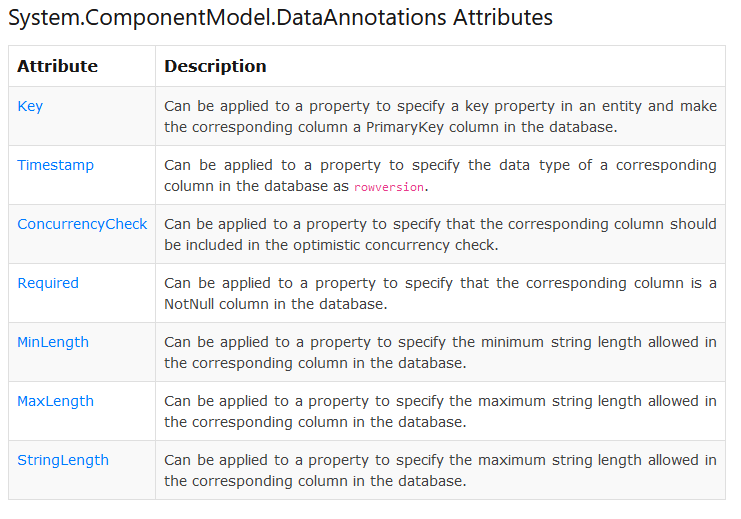
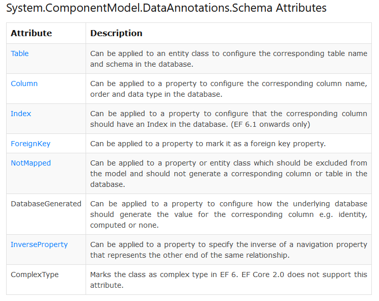
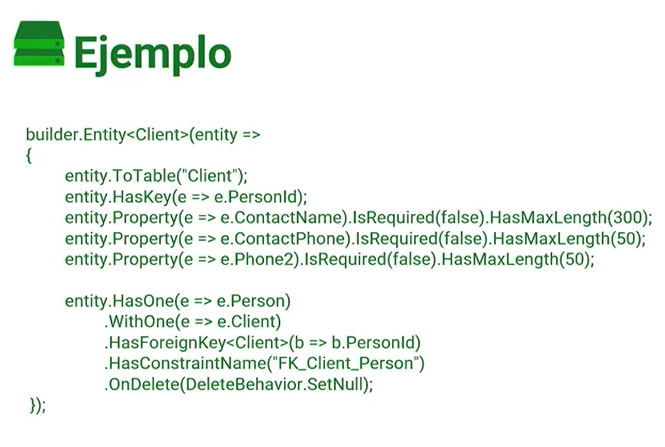
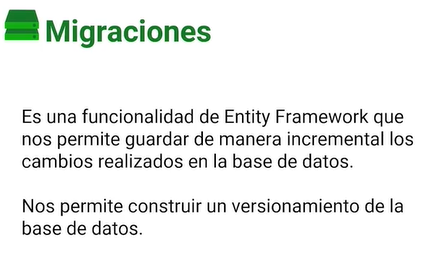
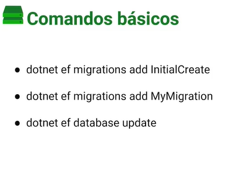

# Fundamentos de Entity Framework

Se utilizara ADO.NET que es un conjunto de librerías para acceder a datos y servicios de datos.

## Conexión a base de datos

* ODBC
* OLEDB
* SQL server
* Conexion Azure SQL

ADO.NET

ADO.NET es un conjunto de componentes del software que pueden ser usados por los programadores para acceder a datos y a servicios de datos. Es parte de la biblioteca de clases base que están incluidas en el Microsoft .NET Framework. Es comúnmente usado por los programadores para acceder y para modificar los datos almacenados en un sistema gestor de bases de datos relacionales, aunque también puede ser usado para acceder a datos en fuentes no relacionales.

**Instalar Entity Framework Core:**

Para instalar EF Core, instale el paquete para los proveedores de bases de datos de EF Core a los que desea dirigirse. Este tutorial usa SQLite porque se ejecuta en todas las plataformas compatibles con .NET Core. Para obtener una lista de proveedores disponibles, consulte Proveedores de bases.

### Comandos necesarios para entity framework

**ver la version de dotnet:**
> dotnet --version

**installar la herramienta entity framework en dotnet:**
> dotnet tool install --global dotnet-ef

**installar el paquete de entity framework:**
> dotnet add package Microsoft EntityFrameworkCore.Design

**crear una migracion con entity framework:**
> dotnet ef migrations add InitialCreate

**hacer una actualización de la base de datos con entity framework:**
> dotnet ef database update

## ¿Qué es un ORM?

ORM es la sigla para Object Relational Mapping. Se apoya en objetos y clases para realizar la representación del concepto a utilizar.

Que es ORM: es una herramienta que realiza un mapeo que nos permite transformar los objetos de la base de datos como tablas y esquemas a clases con atributos en código de programación para poder manipular la información de una forma más fácil sin requerir de SQL.

Contribución creada con aportes de: Cristhofer Alexander Moya Contreras y Marcos Avila Rodriguez.

## Creación de modelos

Crearemos una carpeta con Models y dentro los archivos:

* Categoria.cs
* Tarea.cs

**Las paquetes y el namespace seras:**

~~~csharp
sing System.ComponentModel.DataAnnotations;
using System.ComponentModel.DataAnnotations.Schema;

namespace proyectoef.Models;
~~~

**Codigo dentro de la clase Categoria:**

~~~csharp
public class Categoria
{
    public Guid CategoriaId {get;set;}
    public string? Nombre {get;set;}
    public string? Descripcion {get;set;}
    public int Peso {get;set;}

    [JsonIgnore]
    public virtual ICollection<Tarea>? Tareas {get;set;}
}
~~~

**Codigo dentro de la clase Tarea:**

~~~csharp
public class Tarea 
{
    public Guid TareaId { get; set; }
    public string? Titulo { get; set; }
    public string? Descripcion { get; set; }
    public Guid CategoriaId { get; set; }
    public Prioridad PrioridadTarea { get; set; }
    public DateTime FechaCreacion { get; set; }
    public virtual Categoria? Categoria { get; set; }

    public string? Resumen { get; set; }
    public string? Estado { get; set; }
}
~~~

## Configuración de Entity Framework

* Contexto: Es donde van a ir todas las relaciones de los modelos que nosotros tenemos para poder transformarlo en colecciones que van a representarse dentro de la base de datos.

Más información e en el siguiente enlace : <https://docs.microsoft.com/es-es/ef/ef6/fundamentals/working-with-dbcontext#defining-a-dbcontext-derived-class>

* DBSet: Es un set o una asignación de datos del modelo que nosotros hemos creado previamente, básicamente esto va a representar lo que sería una tabla dentro del contexto de entity framework.

    Un DbSet representa la colección de todas las entidades en el contexto, o que se puede consultar desde la base de datos, de un tipo determinado.

    Los objetos DbSet se crean a partir de DbContext mediante el método DbContext. set. Microsoft nos ofrece más información sobre esta clase en el siguiente enlace: <https://docs.microsoft.com/es-es/dotnet/api/system.data.entity.dbset-1?view=entity-framework-6.2.0>

## Mapeo de modelos usando atributos

Se usa Data Anotation para especificar el tipo de dato que tendremos en nuestra base de datos

Usar el siguiente link para buscar mas información: <https://docs.microsoft.com/en-us/ef/ef6/modeling/code-first/data-annotations>

### Data Annotations

**Codigo dentro de la clase Categoria:**

~~~csharp
public class Categoria
{
    [Key]
    public Guid TareaId { get; set; }
    [Required]
    [MaxLength(200)]
    public string? Titulo { get; set; }
    public string? Descripcion { get; set; }
    [ForeignKey("Categoria")] //llamados DataAnnotation 
    public Guid CategoriaId { get; set; }
    public Prioridad PrioridadTarea { get; set; }
    public DateTime FechaCreacion { get; set; }
    public virtual Categoria? Categoria { get; set; }
    [NotMapped]
    public string? Resumen { get; set; }
    public string? Estado { get; set; }
}
~~~

**Codigo dentro de la clase Tarea:**

~~~csharp
public class Tarea 
{
    public Guid TareaId { get; set; }
    public string? Titulo { get; set; }
    public string? Descripcion { get; set; }
    public Guid CategoriaId { get; set; }
    public Prioridad PrioridadTarea { get; set; }
    public DateTime FechaCreacion { get; set; }
    public virtual Categoria? Categoria { get; set; }

    public string? Resumen { get; set; }
    public string? Estado { get; set; }
}
~~~

## Utilizando base de datos en memoria

ayuda a verificar si toda la implementacion esta funcionando correctamente creando asi las tablas.

Entonces se realizara las siguientes modifciaciones en el archivo program.cs

~~~csharp
using Microsoft.AspNetCore.Mvc;
using Microsoft.EntityFrameworkCore;
using proyectoef;

var builder = WebApplication.CreateBuilder(args);

builder.Services.AddDbContext<TareasContext>(p => p.UseInMemoryDatabase("TareasDB"));

var app = builder.Build();

app.MapGet("/", () => "Hello World!");

app.MapGet("/dbconexion", async ([FromServices] TareasContext dbContext) => 
{
    dbContext.Database.EnsureCreated();
    return Results.Ok("Base de datos en memoria: " + dbContext.Database.IsInMemory());

});

app.Run();
~~~

## Conectado a base de datos SQL server

Ejemplo de cadena de conexión para SQL server:

~~~csharp
"Data Source=server;Initial Catalog=db;user id=sa; password=pass";
~~~

### Configuración para PostgreSQL:

**Enlace de descarga:**
<https://www.postgresql.org/download/>

**Paquete nuget:**
<https://www.nuget.org/packages/Npgsql.EntityFrameworkCore.PostgreSQL/>

**Comando para instalar el paquete nuget:**
> dotnet add package Npgsql.EntityFrameworkCore.PostgreSQL

**Configuración de PostgreSQL en la clase Program.cs:**

~~~csharp
services.AddDbContext<HotelContextDB>(options => options.UseNpgsql(“Server=postgreServer;Database=DbName;Port=5432;User Id=user;Password=password;”));
~~~

**Ejemplo de con cadena de conexión de PostgreSQL:**

~~~csharp
Server=postgreServer;Database=DbName;Port=5432;User Id=user;Password=password;
~~~

## Agregando conexión al archivo appsettings

abrir el archivo appsettings.json y hacer la siguiente configurarión

~~~json
{
  "Logging": {
    "LogLevel": {
      "Default": "Information",
      "Microsoft.AspNetCore": "Warning"
    }
  },
  "AllowedHosts": "*",
  "ConnectionStrings": {
    "cnTareas": "Data Source=server;Initial Catalog=db;user id=sa; password=pass"
  }
}
~~~

Hacer las siguientes configuracion en programa.cs

~~~csharp
builder.Services.AddSqlServer<TareasContext>(builder.Configuration.GetConnectionString("cnTareas"));
~~~

## Introducción a Fluent API

**Fluent API:**

Forma avanzada de configuración sin utilizar atributos o data-annotations, usando funciones de extensión anidadas en objetos de tabla, columnas durante el mapeo de los datos.

## Creando modelo de tarea con Fluent API

~~~csharp
using Microsoft.EntityFrameworkCore;
using proyectoef.Models;

namespace proyectoef;
~~~

~~~csharp
public class TareasContext: DbContext
{
    public DbSet<Categoria>? Categorias {get;set;}
    public DbSet<Tarea>? Tareas {get;set;}

    public TareasContext(DbContextOptions<TareasContext> options) :base(options) { }
    /* Creating Fluint API, tiene mayor prioridad a los atributos de la clase Categoria */
    protected override void OnModelCreating(ModelBuilder modelBuilder)
    {
        //Fluent API que sirve para establecer las propiedades de las entidades
        modelBuilder.Entity<Categoria>(
            categoria =>
            {
                categoria.ToTable("Categoria");
                categoria.HasKey(c => c.CategoriaId);
                categoria.Property(c => c.Nombre).IsRequired().HasMaxLength(150);
                categoria.Property(c => c.Descripcion).IsRequired(false);
                categoria.Property(c => c.Peso);
                categoria.HasData(categorias);

            });

        //Fluent API que sirve para establecer las propiedades de las entidades
        modelBuilder.Entity<Tarea>(
            tarea =>
            {
                tarea.ToTable("Tarea");
                tarea.HasKey(t => t.TareaId);
                tarea.HasOne(t => t.Categoria).WithMany(t => t.Tareas).HasForeignKey(t => t.CategoriaId);
                tarea.Property(t => t.Titulo).IsRequired().HasMaxLength(200);
                tarea.Property(t => t.Descripcion).IsRequired(false);
                tarea.Property(t => t.FechaCreacion).HasDefaultValueSql("GETDATE()");
                tarea.Property(t => t.PrioridadTarea);
                tarea.Ignore(t => t.Resumen);
                tarea.Ignore(t => t.Estado);
                tarea.HasData(tareasInit);
            });
    }
}

~~~

**mas informacion sobre Fluent API:** 

* <https://docs.microsoft.com/en-us/ef/core/modeling/relationships?tabs=fluent-api%2Cfluent-api-simple-key%2Csimple-key>

* <https://docs.microsoft.com/en-us/ef/core/modeling/relationships?tabs=fluent-api%2Cfluent-api-simple-key%2Csimple-key>

## ¿Qué son las migraciones?

## Inicializar las migraciones

**Comando para instalar la herramienta de EF:**

> dotnet tool install --global dotnet-ef

**Comando para instalar EF Design:**

dotnet add package Microsoft.EntityFrameworkCore.Design

**Cada migración debe de tener un nombre descriptivo:**

> dotnet ef migrations add InitialCreate

**Actualizacion de la base de datos:**
Si queremos utilizar migrations en producción debemos hacerlo una vez que se haya terminado el esquema, o sea mientras no hayan datos.

Cada vez que agreguemos una migración debemos usar el comando:

> dotnet ef database update

## Agregando datos semilla

Crear objetos y agregar datos a las propiedades de la clase Categoria y tarea en la clase TareasContext.cs

~~~csharp
public class TareasContext: DbContext
{
    public DbSet<Categoria>? Categorias {get;set;}
    public DbSet<Tarea>? Tareas {get;set;}

    public TareasContext(DbContextOptions<TareasContext> options) :base(options) { }

    protected override void OnModelCreating(ModelBuilder modelBuilder)
    {
        List<Categoria> categorias = new List<Categoria>();
        categorias.Add(new Categoria 
        { 
            CategoriaId = Guid.Parse("e2c610a2-ce8e-4ad7-ab9c-7a408c8b61ac"), 
            Nombre = "Actividades pendientes", 
            Peso = 20
        });
        categorias.Add(new Categoria 
        { 
            CategoriaId = Guid.Parse("e2c610a2-ce8e-4ad7-ab9c-7a408c8b61ae"), 
            Nombre = "Actividades personales",
            Peso = 50
        });

        modelBuilder.Entity<Categoria>(
            categoria =>
            {
                categoria.ToTable("Categoria");
                categoria.HasKey(c => c.CategoriaId);
                categoria.Property(c => c.Nombre).IsRequired().HasMaxLength(150);
                categoria.Property(c => c.Descripcion).IsRequired(false);
                categoria.Property(c => c.Peso);
                categoria.HasData(categorias);

            });

        List<Tarea> tareasInit = new List<Tarea>();
        tareasInit.Add(new Tarea() { 
            TareaId = Guid.Parse("fe2de405-c38e-4c90-ac52-da0540dfb410"), 
            CategoriaId = Guid.Parse("e2c610a2-ce8e-4ad7-ab9c-7a408c8b61ac"),
            PrioridadTarea = Prioridad.Media, 
            Titulo = "Pago de servicios publicos", 
            FechaCreacion = DateTime.Now
            });
        tareasInit.Add(new Tarea() 
        { 
            TareaId = Guid.Parse("fe2de405-c38e-4c90-ac52-da0540dfb411"), 
            CategoriaId = Guid.Parse("e2c610a2-ce8e-4ad7-ab9c-7a408c8b61ae"),
            PrioridadTarea = Prioridad.Baja, 
            Titulo = "Terminar de ver pelicula en netflix", 
            FechaCreacion = DateTime.Now
            });
        
        modelBuilder.Entity<Tarea>(
            tarea =>
            {
                tarea.ToTable("Tarea");
                tarea.HasKey(t => t.TareaId);
                tarea.HasOne(t => t.Categoria).WithMany(t => t.Tareas).HasForeignKey(t => t.CategoriaId);
                tarea.Property(t => t.Titulo).IsRequired().HasMaxLength(200);
                tarea.Property(t => t.Descripcion).IsRequired(false);
                tarea.Property(t => t.FechaCreacion).HasDefaultValueSql("GETDATE()");
                tarea.Property(t => t.PrioridadTarea);
                tarea.Ignore(t => t.Resumen);
                tarea.Ignore(t => t.Estado);
                tarea.HasData(tareasInit);
            });
    }
}
~~~

## Obteniendo datos con Entity Framework

Creando el end point Get

~~~csharp
app.MapGet(
    "/api/tareas", 
    ([FromServices] TareasContext dbContext) =>
{
    var tareas = dbContext.Tareas;
    return Results.Ok(tareas?.Include(t=>t.Categoria));
    //tareas.Where(t=>t.PrioridadTarea == proyectoef.Models.Prioridad.Media
    
});

app.MapGet(
    "/api/categorias", 
    ([FromServices] TareasContext dbContext) =>
{
    var categorias = dbContext.Categorias;
    return Results.Ok(categorias?.Where(c=>c.Nombre == "Actividades pendientes"));
});
~~~

## Guardando datos con Entity framework

Creando el end point Post:

~~~csharp
app.MapPost(
    "/api/tareas", 
    async ([FromServices] TareasContext dbContext, 
    [FromBody] Tarea tarea) =>
{
    tarea.TareaId = Guid.NewGuid();
    tarea.FechaCreacion = DateTime.Now;
    await dbContext.AddAsync(tarea);
    //await dbContext.Tareas.AddAsync(tarea);

    await dbContext.SaveChangesAsync();

    return Results.Ok();
});
~~~

## Actualizando datos con Entity framework

Creando el end point Put:

~~~csharp
app.MapPut(
    "/api/tareas/{id}", 
    async ([FromServices] TareasContext dbContext, 
    [FromBody] Tarea tarea,
    [FromRoute] Guid id) =>
{
    var tareaActual = dbContext?.Tareas?.Find(id);
    if (tareaActual != null)
    {
        tareaActual.CategoriaId = tarea.CategoriaId;
        tareaActual.Titulo = tarea.Titulo;
        tareaActual.PrioridadTarea = tarea.PrioridadTarea;
        tareaActual.Descripcion = tarea.Descripcion;
        
        await dbContext.SaveChangesAsync();

        return Results.Ok();
    }

    return Results.NotFound();
});
~~~

## Eliminando datos con Entity framework

Creando el end point Delete:

~~~csharp
app.MapDelete(
    "/api/tareas/{id}", 
    async ([FromServices] TareasContext dbContext, 
    [FromRoute] Guid id) =>
{
    var tareaActual = dbContext?.Tareas?.Find(id);

    if(tareaActual == null)
    {
        return Results.NotFound("Task not found.");
    }
        
    dbContext?.Tareas?.Remove(tareaActual);
    await dbContext.SaveChangesAsync();

    return Results.Ok();
});
~~~

---