# Curso de Introducción a Java SE

# Modulo 1. Conocer a Java como lenguaje de programación

## 1. ¿Qué es Java?

Java es un lenguaje de programación que nos servir para aplicar algoritmos y resolver problemas. Fue creado en 1991 por James Gosling, quien en realidad es una persona bastante interesante.

James Gosling es uno de esos nerd vintage que tenían otra forma de pensamiento y que quería impulsar la programación para que fuera alcanzable, que todos pudieran hacerlo y que además sus programas pudieran llegar lo más lejos posible. Ese era su forma de pensamiento y por eso creo Java como un lenguaje de programación multiplataforma que pueden correrlo en sistemas operativos Windows, Mac, Linux e incluso sistemas operativos móviles.

Fue empleado de Sun Microsystems en donde empezó toda la magia, ahí creo Java y después James se convirtió en el vicepresidente de la compañía. Tenía una filosofía bastante interesante al querer alcanzar muchos dispositivos y poner la programación al alcance de todos. Luego, en 2009, Sun Microsystems es comprada por Oracle y es aquí donde las cosas comienzan a ponerse un poco confusas para Java en cuanto a su filosofía. Desde que Oracle compra Java vinieron una serie de cambio al que muchos programadores no estuvieron tan de acuerdo, sin embargo, tener el respaldo de una compañía tan grande aseguraba que Java sea mejor mantenido, que diera mejores soportes y se vuelva mucho más empresarial.

Mientras estuvo involucrado con Oracle, James Gosling realmente no se sintió tan a gusto ya que sus filosofías, sus paradigmas de vida y formas de pensamientos eran completamente distintas. Así fue como en 2010, James Gosling decidió salirse de Oracle, y declaro en su blog personal la siguiente frase:
«Casi cualquier cosa que pudiera decir es honesta y haría más daño que bien»

En realidad, James Gosling no quería decir nada más acerca de lo que estaba sucediendo ahí dentro, pero sabemos que este hecho y el hecho de que ahora Java le perteneciera a Oracle traía un antes y un después en la vida de este lenguaje.

Java además es un lenguaje de programación de alto nivel. ¿Qué significa que sea de alto nivel?

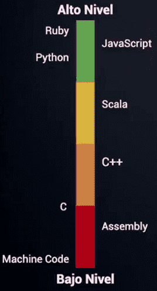

Teniendo en cuenta nuestra escala similar a un termómetro de colores podemos decir que un lenguaje de bajo nivel está compuesto por los lenguajes máquina (que es el sistema de códigos directamente interpretable por un circuito microprogramable) como ensamblador, de echo toda la zona roja le pertenece al ensamblador y un pedacito le pertenece al lenguaje C. Toda esa zona en rojo es considerada de bajo nivel y así se va subiendo hasta una zona de más alto que es un lugar donde es mucho más fácil programar, son los lenguajes de programación que mucho más modernos, fáciles de manipular en términos de memoria, optimización de recursos o en términos de simplemente declarar una variable es mucho más sencillo hacerlo en estos lenguajes que si lo hiciéramos en un lenguaje de bajo nivel.

Java se encuentra más o menos en la escala de amarillo, no es tan natural como un lenguaje de alto nivel como lo son Ruby o Python que son lenguajes bastante sencillo de entender. Entonces, podemos decir que un lenguaje de alto nivel es un lenguaje fácil para la comprensión humana, que facilitan el comunicarse con el humano y después hacer su magia para llegar hasta el bajo nivel.

**Categorías de Java**

Como ya lo hemos dicho, Java esencialmente tiene dos categorías: Java Standar Edition y Java Enterprise Edition. Ya vimos una ruta de aprendizaje para entender cómo funciona Java SE, pero lo que no sabes es que Java EE también cuenta con su propia ruta.

Es muy importante que aprendas primero muy bien la parte Standar de Java, toda la base del lenguaje y la sintaxis para desarrollar aplicaciones. En la parte Standar básicamente estaremos desarrollando aplicaciones de escritorio o consola, mientras en la parte de Enterprise las aplicaciones tendrán su lugar mucho mejor en la web, es mucho mejor en servidores ya que son aplicaciones mucho más distribuidas y cuya interacción con el usuario es mucho más amigables. Entonces digamos que la parte de Java Standar es como un primer nivel para llegar al siguiente que es Java Enterprise.

Nos enfocaremos mucho en el lenguaje, especialmente porque Java tiene la filosofía «Write Once, Run Anywhere» o WORA que significa que lo aprendido aquí en la versión estándar puede ser llevado a la versión enterprise. Es decir, lo que escribas en Java lo puedes correr en cualquier lugar y en cualquier sistema operativo, por eso Java es interoperable, multiplataforma.

## 2. Versiones de Java y JDK

Cuando comenzamos a aprender Java la primera cosa rara con la que nos encontramos es el Java Development Kit o JDK que se compone de los tres elementos siguientes:

1. **Java Runtime Environment (JRE):** La parte más importante es la del JRE, es la máquina virtual que permite a Java ser multiplataforma, que al escribir el mismo código funcione igual en todos los dispositivos y sistemas operativos. Sin este elemento, la filosofía de «Write Once, Run Anywhere» no podría ser posible. Además, si bien decimos el JRE equivale a la máquina virtual, en realidad se compone de otros elementos más como algunas bibliotecas que hacen funcionar la máquina virtual entre otros. Sin embargo, JRE siempre estará asociado a la máquina virtual, quien es el que crea la magia multiplataforma.

* **Compilador de Java:** El segundo elemento que trae consigo el JDK es el compilador de Java, el encargado de hacer que nuestro programa escrito en lenguaje Java sea traducido al lenguaje bytecode que finalmente es interpretado por la máquina virtual. Es decir, el compilador de Java toma el lenguaje de Java y lo traduce a algo que la máquina virtual si pueda ejecutar y leer.

* **APIs de desarrollo:** Otro elemento también muy importante y el más interesante de todos son las API (Application Programming Interface) de desarrollo. Estas API de desarrollo son la base que nos proporciona el lenguaje de programación para nosotros crear nuestros propios lenguajes, es decir, cuando estamos programando con Java no vamos a partir de cero, si no que ya vamos a tener una base de elementos ya listo para que lo tomemos y creemos nuestros programas. Las API han ido evolucionando y se le fueron agregando elementos conforma va siendo las necesidades de la modernidad y la tecnología hoy en día.

**Tabla de versiones de Java**

Esta es una tabla con todas las versiones de Java que existen hasta hoy, puede ser que en el momento en que veas esta clase se hayan añadido algunas otras, pero en general estas son las versiones más importantes de Java.

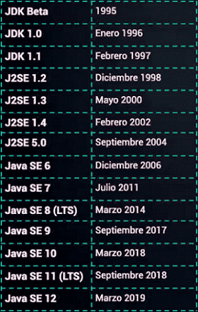

Notaremos que tenemos estos nombres particulares:

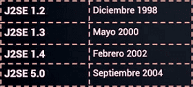

Y eso se debe a que esas versiones fueron llamadas Java 2 Platform Standar Edition, también existen en otras categorías como el Java 2 Platform Enterprise Edition. Fueron creadas hace mucho tiempo y existieron con ese nombre hasta el 2004.

Desde la versión Java SE 6 es cuando comenzó a llamarse Java Standar Edition acortando el nombre y también fue la primera versión que se promovía para ser una versión más robusta, para ambientes de producción, profesionales o de desarrollo. Además, a partir de esta versión comenzó a popularizarse Java ya que las compañías empezaron a adquirirlo como parte de su ambiente de desarrollo y fue aquí donde la oferta laboral para Java exploto y se necesitaba mucho programadores que supieran a partir de esa versión.

No es hasta a partir del año 2017 con la versión 9 que tenemos una versión muy interesante y controversial, pero también importante para la comunidad de Java porque en esta versión se anunció que las actualizaciones se estarían haciendo cada seis meses.

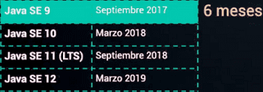

Esta noticia trajo sentimientos encontrados porque si analizamos el listado de fechas podemos fijarnos que desde la versión 8 en 2014 tuvieron que pasar aproximadamente tres años para que existiera una nueva actualización y así debíamos de esperar años para que saliera una nueva versión, y esto no le gustaba a los programadores porque sentían que el lenguaje se quedaba atrás con respecto a otros lenguajes de programación, así que este tipo de programadores fueron quienes se alegaron porque ahora tendrían cada seis meses una actualización del JDK. Pero esto traía más dolores de cabeza de lo que se pensaba ya que si existiera una actualización del lenguaje cada seis meses, esto iba a provocar algunas incompatibilidades entre las versiones anteriores y sería muy difícil darle soporte a las versiones anteriores porque cada seis meses tendrían que estar actualizadas, habría cambios en los códigos y estar dándole mantenimiento.

Para solucionar estos problemas Java creo la versión LTS o Long Term Support que son versiones que tendrían soporte por tres años.

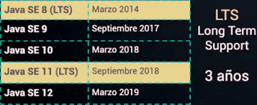

Sin embargo, se continuaría teniendo las versiones que salen de manera inmediata cada seis meses con pequeños detalles, porque en realidad no son tantos cambios, sino que son pequeños detalles al lenguajes los que se cambian. Pero tener una versión que cada tres años se le da soporte es muy común en lenguajes de programación o sistemas operativos que son precisamente del tipo open source. La última versión registrada del tipo Long Term Support, que son versiones en las que realmente podemos confiar precisamente porque tenemos más soporte, es la versión 11 y esto puede ser comprobado en la página de [Education Oracle](https://education.oracle.com/oracle-certification-path/product_267 "Education Oracle").

Pero no todo está bien con Java y es aquí donde comienza a ponerse duro y complicado pues la versión 11 es la primera versión de Java con licencia. Es aquí donde comienza a ponerse interesante, y es que Oracle comienza a cobrar una licencia por el uso de Java, aunque hay algunos detalles que si nos permite utilizarlo de forma free.

Solamente podemos usarlo Free (gratis) en ambientes de desarrollo y de testing, estas son las única forma, pero si es que nosotros queremos llevarlo a un ambiente de producción, porque este es el principal uso de Java en compañías grandes que lo manejan en producción, tendremos que pagar y estas son las [cifras registradas](http://www.oracle.com/us/corporate/pricing/price-lists/java-se-subscription-pricelist-5028356.pdf "cifras registradas"):

- 2.5 USD al mes por usuario de escritorio.
- 25 USD por procesador para aplicaciones de servidor.

Y es aquí donde la comunidad y el ideal del cual fue concebido Java tiene mucho más peso. La comunidad de Java había creado desde hace muchos años la versión open source del JDK, una versión realmente gratis donde podemos utilizar Java en ambientes de producción o de desarrollo. Básicamente [OpenJDK](https://openjdk.java.net/ "OpenJDK") es la versión open source de Java Standar Edition que existe desde hace mucho más tiempo del que creemos, pero que se ha comenzado a ser conocida por el cobro de licencia.

Existe desde la versión Java SE 6, lo ha impulsado Sun Microsystems en el año 2006 y esto es una ventaja y una desventaja porque ya no dependemos de una compañía como tal si no de una comunidad, pero una comunidad fuerte que está siendo apoyando mucho por la compañía Red Hat. Sin embargo, la comunidad es bastante madura y tiene mucha experiencia, y se están tomando muy enserio este proyecto.

Entonces, OpenJDK es un proyecto en el que podemos confiar, aportar si es que queremos aunque no es tan sencillo pues debemos pasar por dos ingenieros; uno es de Sun Microsystems y otro de Oracle que realizaran la revisión del código. Pero, en general, la comunidad está ahí aportando y las personas que están haciendo este JDK están muy comprometidas con esto y están dándole bastante soporte a este proyecto.

## 3. Las herramientas más usadas de Java

Es importante que veamos cómo se encuentra Java en cuanto a su uso, las herramientas que existen para programar y como la gente está adoptando las nuevas versiones de JDK que existen, si es que las personas en los ambientes de producción lo están adoptando fácilmente.

No solo veremos las herramientas en el ambiente de escritorio con Java, sino que también veremos algunas con la parte distribuida de Java en los ambientes de servidores.

**¿Cuáles son las herramientas más usadas en Java?**

En cuanto a la adopción de versiones de Java tenemos la siguiente gráfica:

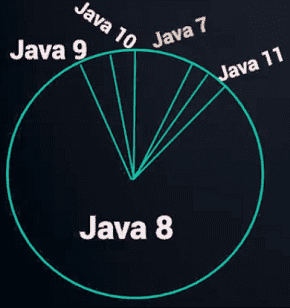

Estas son estadísticas recabadas hasta inicios del 2019 que fue donde obtuvimos la nueva versión, Java 12. En el gráfico podemos ver que la mayoría de los ambientes están definidos con Java 8, es decir, la mayoría de las compañías que están adoptando JDK en sus ambientes de desarrollo es con la versión 8 de Java la cual es la última versión LTS "gratuito", sin licencia. Sin embargo, esta versión solo tendrá soporte hasta diciembre del 2020, a partir de ahí el soporte se comenzara a adquirir con licencia como se hizo con Java 11.

Observando la gráfica podemos ver una adopción menor en la versión 11, que es la segunda LTS de Java. Además de una adopción nula con la versión 12 que de hecho ni siquiera aparece. La versión 7 también es bastante utilizada, pero en definitiva la versión Java 8 es la más querida y con esto anunciamos que durante el transcurso del curso estaremos hablando de las dos versiones, Java 8 y Java 11.

¿Por qué ambas versiones? Pues, porque desde la versión 10 de Java se trajeron algunos cambios interesantes que es algo que la comunidad e incluso desarrolladores cuyo fuerte no es Java ha empezado a demandar: la inferencia de los tipos de datos. En la versión 10 tenemos una modificación a la forma en como declaramos variables y es por esto que estaremos viendo las dos versiones. Estaremos utilizando principalmente de Java 8 para lo que necesitamos del curso, de hecho podríamos estar haciendo completamente el curso con esta versión, pero dado el cambio en la declaración de variables que tenemos a partir de Java 10 también estaremos viendo la versión 11 LTS. Por supuesto, estaremos usando OpenJDK y veremos su instalación.

### Servidores
En cuanto a servidores tenemos otro tipo de ambiente y solo será dejado como dato curioso. La versión más utilizada para construir proyectos web es Maven y la alternativa, como principal competidor esta Gradle. De hecho, Maven es bastante grande, casi el doble de Gradle, pero hasta el día de hoy ambos son usados en la construcción de proyectos web. 

- **Maven:** Es una de las herramientas más útiles a la hora de utilizar librerías de terceros. Maven se utiliza en la gestión y construcción de software. Posee la capacidad de realizar ciertas tareas claramente definidas, como la compilación del código y su empaquetado. Es decir, hace posible la creación de software con dependencias incluidas dentro de la estructura del JAR.
- **Gradle:** Es una herramienta de automatización de la construcción de nuestro código que bebe de las aportaciones que han realizado herramientas como ant y maven pero intenta llevarlo todo un paso más  allá. Para empezar se apoya en Groovy y en un DSL (Domain Specific Language) para trabajar con un lenguaje sencillo y claro a la hora de construir el build comparado con Maven. Por otro lado dispone de una gran flexibilidad que permite trabajar con ella utilizando otros lenguajes y no solo Java. Dispone por otro lado  de un sistema de gestión de dependencias sólido.

En cuanto a frameworks de trabajo en el tema de servidor con Java Enterprise es Spring. Es muy importante aprender Spring con Hibernate, y específicamente las versiones más utilizadas son la versión 2 y la versión 1.5.

- **Spring:** Es un framework de código abierto para la creación de aplicaciones empresariales Java, con soporte para Groovy y Kotlin. Tiene una estructura modular y una gran flexibilidad para implementar diferentes tipos de arquitectura según las necesidades de la aplicación.
- **Hibernate:** Es una herramienta de mapeo objeto-relacional (ORM)  que facilita el mapeo de atributos en una base de datos tradicional, y el modelo de objetos de un aplicación mediante archivos declarativos o anotaciones en los beans de las entidades que permiten establecer estas relaciones. Es decir, que agiliza la relación entre la aplicación y nuestra base de datos SQL, de un modo que optimiza nuestro flujo de trabajo evitando caer en código repetitivo.

### Entornos de Desarrollos Integramos

Un entorno de desarrollo integrado (IDE del inglés Integrated Development Environment ) es un sistema de software para el diseño de aplicaciones que combina herramientas del desarrollador comunes en una sola interfaz gráfica de usuario.

Realmente no necesitamos de un IDE para programar con Java ya que podemos hacerlo simplemente usando el bloc de notas y guardando los archivos con la extensión .java, y utilizando la terminal de línea de comando. Pero las IDE's existen porque precisamente tienen integrado el editor de código, compilador, depurador y constructor de interfaz gráfica para aquellos programas que estén trabajando con la parte interfaz gráfica de Java.

Hay bastante competencia en cuanto a IDE, pero la "oficial" y la cual Oracle recomienda es NetBeans. En cambio, la comunidad apoya mucho a Eclipse, llego al punto de que era considerado el #1 entre los tres competidores. Sin embargo, IntelliJ IDEA se ha impulso mucho con un editor de código inteligente y es particularmente el favorito de todos los desarrolladores que trabajan con Java y necesitan una forma más fácil de programar, por lo que en cuestión de estadísticas es IntelliJ IDEA el ganador.

La adopción más sencilla para un IDE es con IntelliJ IDEA, además de que cuenta con una versión gratuita y una versión comercial. Aunque cabe mencionar que tanto Eclipse como NetBeans también cuentan con sus versiones gratuitas.

## 4. Creando un entorno de desarrollo en Java en Windows

**Instalación de IntelliJ IDEA**

* https://www.jetbrains.com/help/idea/installation-guide.html

## 5. Creando un entorno de desarrollo en Java en Mac

* *instalar IntelliJ IDEA y OpenJDK en los sistemas operativos MacOS.

## 6. Creando un entorno de desarrollo en Java en Linux

* https://www.jetbrains.com/help/idea/installation-guide.html#snap

## 7. Escribe tu primer Hola Mundo en Java

Ahora que ya tenemos listo nuestro entorno de desarrollo ya sea en Windows, Linux o Mac es hora que hagamos nuestro primer 'Hola Mundo'. El «Hola Mundo», que se hace comúnmente en cualquier lenguaje de programación, es el primer programa y consiste en tan solo imprimir un texto y mostrarlo en la consola. Este programa sirve para entender y verificar que nuestro entorno de desarrollo está totalmente configurado y que además estamos aprendiendo un poco más las bases del lenguaje, para eso sirve un Hola Mundo.

Si queremos comenzar con un Hola Mundo debemos partir de los archivos van a ser reconocidos por tener la extensión **.java**. Los archivos de Java literalmente van a ser archivos con una extensión como esta, por lo tanto cuando creamos un archivo lo que deberíamos ver es un archivo como este:

~~~
NombreDelArchivo.java
~~~

Y para crearlo usaremos nuestro entorno de desarrollo, pero no está de más decirte que algunas veces podrías estar trabajando este HolaMundo así de simple y sencillo con un editor de código y tu consola de comandos. Podrías crear un archivo **HolaMundo.java**, escribir las líneas de código que veremos a continuación, compilarlo y entonces obtener el resultado. Pero nosotros tenemos listo nuestro IDE y lo haremos aquí.

Lo primero por lo que debemos partir antes de encontrarnos con palabras desconocidos es el Método Main. El **Método Main** es el punto de entrada en la aplicación Java, no es exclusivo del lenguaje ya que otros lo manejan como Kotlin (que está basado en Java), Dart y también en Python existe algo similar al método Main. En general, el método Main es una palabra que traducida significa principal y que ambos van a compartir un método que sirve para ser el método de entrada para la aplicación, es por donde comenzara el programa y lo primero que se ejecutara cuando el programa este corriendo.

### Correr con la terminal

~~~bash
java HelloWorld.java
~~~

## 8. Etapas de la programación en Java

Si tu primer «Hola Mundo» funciono es momento de celebrar porque todo salió muy bien. Pero la verdad es que lo hicimos todo rápido, trabajamos en el código, lo ejecutamos y nuestro maravillosos IDE nos sopló muchas palabras, ahora nos queda la duda… ¿Qué fue lo que paso realmente?

**Etapas de la programación**

Tenemos la siguiente que nos muestra el proceso por el que paso nuestro programa y es tiempo de analizarlo:

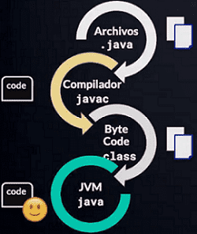

- Lo primero que hacemos es trabajar con nuestro archivo Java. Creamos un archivo con la extensión .java, en este caso holaMundo.java, que será el código fuente del programa. Recordemos que la única funcionalidad, el único objeto que tiene nuestro programa es imprimir un texto.
- Después, cuando nosotros damos click en Run, se activa el compilador. Este comando que se conoce también como javac, si lo estuviéramos utilizando en una terminal, en esta ocasión y gracias a nuestro IDE podemos usarlo simplemente presionando un botón.

	- Lo que sucede realmente es que cuando nosotros damos click a Run se activa el compilador que empieza a analizar nuestro código Java y lo traduce a un lenguaje que la computadora pueda leer para luego finalmente mostrarnos ese mensaje.
  
- Al compilar obtenemos códigos Bytecode y son archivos con extensión .class que contiene un montón de símbolos y cosas raras si es que lo abrimos, pero ese es el efecto del compilador; traducir el código fuente de Java a un lenguaje que pueda ser leído por nuestra computadora a través de la máquina virtual.
- La última fase es la JVM o la Java Virtual Machine que es la encargada de crearnos el efecto multiplataforma que tiene nuestro lenguaje.

Analicemos un poco más detalladamente lo que hicimos:

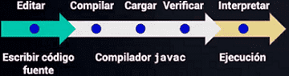

- Escribimos código fuente con extensión .java.
- Cuando el compilador actúa lo que en realidad hace es compilar el código, analizar y verificar que todo esté bien.
- Luego lo carga, como si esté preparando nuestro archivo .class, da una última verificación para analizar que el archivo .class se haya construido correctamente.
- Finalmente se lo manda al JVM para que lo interprete y, el JVM ejecuta y nos muestra el mensaje de «Hola Mundo».

**Compilado e Interpretado**

Una de las grandes controversias que existen en internet es sobre cómo funciona Java, si es compilado o interpretado, pero la verdad es que este lenguaje es ambos: compilado e interpretado.

Lo que nos da esa idea es eso que sucede dentro del compilador: compilar, cargar y verificar. Ya que existen lenguajes de programación que son únicamente interpretados, como JavaScript o PHP que cuando estamos escribiendo en uno de esos lenguajes y recargamos el sitio se empieza a interpretar línea por línea, y si ocurre un error o algo está mal escrito entonces va a dejar de interpretarse las siguientes líneas o simplemente no nos va a mostrar nada.

Para el caso de los lenguajes compilados lo que asegura la compilación es que esté bien hecha, que al menos no ocurra ningún error de sintaxis, y entonces, cuando la JVM interpreta ese compilado, nos genere la menor cantidad de errores posibles.

**Bytecode**

Volviendo a nuestro entorno de desarrollo, si observamos podemos ver que en el lado izquierdo tenemos la composición de carpetas y archivos que tiene nuestro proyecto, y nos aparece una carpeta nueva. Esta carpeta nueva de hecho está marcándose en rojo y dice "out", si lo abrimos y empezamos a ver lo que tiene dentro podemos encontrar el archivo holaMundo.class.

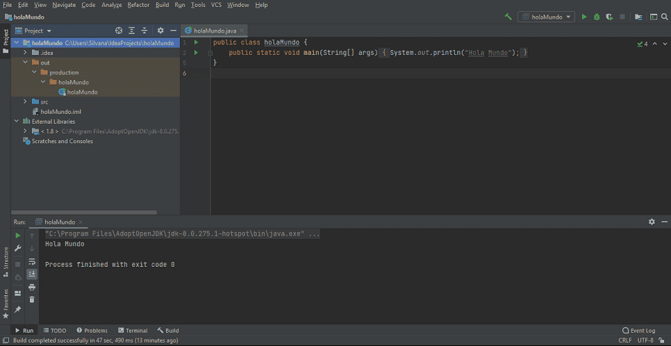

Si somos curiosos y queremos abrirlo podemos ir al lugar donde este guardado el proyecto, navegar un poco hasta encontrar el archivo, darle click derecho, "Abrir con" y elegimos un programa predeterminado para abrirlo, en mi caso lo abrí con el Bloc de notas. Este es el código que se nos creó a partir del código fuente:

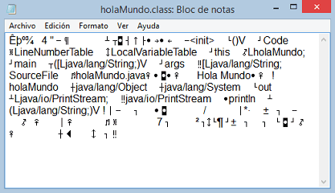

Esto es precisamente el efecto del compilador, el bytecode que lee nuestra máquina virtual, y la capa de seguridad que Java agrega a nuestro programa. No expone el código fuente como en otros lenguajes de programación, lo que si se expone es un bytecode no entendible al ojo humano, pero que sin ser totalmente incorruptible. Si realizamos un poco de ingeniería inversa podemos conseguir el código fuente, por supuesto hay muchos hack para romper la seguridad, pero en general Java se cubre y nos da una capa de seguridad, y es trayendo nuestro archivo .class con el bytecode.

**DATO CURIOSO**

La palabra java (lenguaje de programación orientado a objetos, independiente del sistema operativo usado en aplicaciones de Internet) viene del topónimo Java, una isla de Indonesia, entre Sumatra, Borneo y Bali. Esta isla produce mucho café, de ahí que java, en inglés es sinónimo de café. Los programadores le dieron ese nombre, pues tomaron mucho café cunado crearon este lenguaje.

El nombre de la isla deriva del sánscrito Yavadvipa, compuesto con yava (cereal, cebada) y dvipa (isla).

## 9. La JShell de Java

Sabías que Java tiene una herramienta interactiva en dónde puedes ir probando segmentos de código en vez de realizar todo el proceso de creación de un programa en Java. Escribir, compilar y correr.

Su nombre es ***jshell*** y está disponible desde la versión 9 de Java.

Abre tu consola de comandos o terminal, corre el siguiente comando:

~~~
java -version
~~~

**Ejercicio 1**

Investiga cómo cambiar la versión de Java desde tu consola de comandos o terminal y compártenos en la sección de discusiones los comandos que ejecutaste.

**Ejercicio 2**

Asegúrate de tener definida una versión superior a la 8.

Ahora desde tu terminal escribe el siguiente comando para abrir nuestra ***jshell***

~~~
jshell
~~~

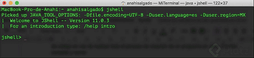

Ahora escribe la línea de código para imprimir un texto (no olvides poner ; y dar enter).

# Modulo 2. Trabajar con Variables en Java
## 10. Variables en Java

Empecemos por entender de qué se trata las variables porque, a partir de ahora, variable será lo que vamos a utilizar al por mayor y es importante que sepas, al menos de manera conceptual, de que se trata y cómo funcionan.

**Variables**

Son un espacio en memoria al que se le asigna un valor. El valor puede ser numérico, booleano, texto o datos más complejo.

El espacio en memoria literalmente es la memoria RAM, es el tipo de memoria que utilizan las variables.

Supongamos que le asignamos el valor de 10 (es un dato numérico) y a ese dato lo identificamos a partir de un nombre, speed. De esta forma es como podemos entender que la manera de identificar esa localidad en memoria será a partir del nombre de la variable.

Entonces, en resumen, una variables es un espacio de memoria al que podemos asignarle un valor y una manera sencilla de localizar ese espacio es identificándolo mediante una nombre.

**Variables en Java**

Las variables en Java se componen de un nombre y un valor, siempre. En general, en cualquier lenguaje de programación siempre van identificarse a través de un nombre único y un valor asignado. Puedes tener variables sin valores asignados, pero a medida que los vayas utilizando vas a tener que estarle rellenándole con datos, de ahí el nombre de variable porque sus datos pueden estar cambiando, pero siempre con la composición nombre-valor.

**Ejercicio**

~~~java
public class Variables {
  public static void main(String[] args) {
    // Declarar la variable speed de tipo int (números enteros)
    int spped;

    // Actualizar el contenido de la variable speed:
    spped = 10; // si ya habías declarado la variable

    // Declarar una variable y asignarle un valor al mismo tiempo:
    int salary = 1000;

    // Crear una variable de tipo String:
    String eployeeName = "Anahí Salgado";
  }
}
~~~

**Diferencias entre inicializar y declarar**

* declarar: es definir el tipo y el nombre de la variables pero no su valor

* inicializar: cuando se declara el tipo, nombre y valor de la variable

**String**

Es una cadena de texto que no deja de ser más que la sucesión de un conjunto de caracteres alfanuméricos, signos de puntuación y espacios en blanco con más o menos sentido.

A la hora de asignarle un valor a una string siempre usamos comillas dobles (" "), porque de lo contrario Java podría confundirlo con el nombre de una variable.

***NOTA: No debemos confundir el operador de asignación (=) con el de comparación (==).***

## 11. Actualizando variables

Las variables no solo pueden ser definidas y asignadas como vimos en la clase anterior, sino que también pueden ser alteradas, sus datos pueden ser redefinidos y se pueden agregar o quitar elementos de una variable dependiendo de las necesidades de la aplicación que estés construyendo.

~~~java
public class UpdatingVariable {
  public static void main(String[] args) {
    // Actualizar datos numéricos:
    int salary = 1000;
    salary = salary + 200;
    System.out.println(salary); // 1200

    salary += 300;
    System.out.println(salary); // 1500

    // Actualizar variables de tipo String:
    String employeeName = "Anahí";
    employeeName = employeeName + "Salgado";
    System.out.println(salary); // Anahí Salgado

    employeeName += "Díaz de la Vega";
    System.out.println(employeeName); // Anahí Salgado Díaz de la Vega

    employeeName = "Irene" + employeeName;
    System.out.println(employeeName); // Irene Anahí Salgado Díaz de la Vega
  }
}
~~~

Así es como nosotros podemos reutilizar variables y datos. Recordemos que nuestras variables viven específicamente en la memoria RAM, a medida que creemos nuevas variables serán espacios nuevos que se irán reservando para esos datos, para eso es importante utilizar y reutilizar variables para no desperdiciar o desaprovechar memoria RAM.

## 12. Convención de Nombres en Java

Ya que aprendimos a definir variables y actualizar datos, también que los nombre de las variables deben ser específicamente únicos y para hacerlos único tenemos una serie de trucos o más bien tenemos una convención de nombre. Java es bastante estricto en cuanto a los nombres que se usan para las variables, existe un estándar que deben seguir las variables para ser definidas que nos ayuda a mantener el código organizado, entendible y sin repetidos.

~~~java
public class NamingVariables {
    public static void main(String[] args){
        int cellphone = 12345678;
        int cellPhone = 87654321;

        System.out.println(cellphone);
        System.out.println(cellPhone);

        String $countryName = "Spain";
        String _backgroundColor = "Green";
        
        //No se puede poner guion medio
        //String background-color = "Blue";
    
        String currency$ = "MXN";
        String background_color = "Blue";
    }
~~~

- En la cuestión de constante, y es que en Java podemos tener variables constantes cuyo valor nunca cambiaran, deben ser escritas en mayúsculas. Si el nombre de la variable está compuesto por dos palabras, en ese caso esas dos palabras deberían separadas por un guion bajo.	

~~~java
int POSITION = -5;
int MAX_WIDTH = 9999;
int MIN_WIDTH = 1;
~~~

## 13. Técnica de Naming: Camel Case

Una convención de nombres muy popular en Java para nombras nuestras variables es la técnica del Camello, mejor conocida en inglés como Camel Case, en la cual básicamente tendremos dos formas de usarlas:

- Upper Camel Case
- Lower Camel Case

La diferencia entre ambos se encuentra en la primera letra de la variable. En el caso del Upper Camel Case siempre vamos a comenzar el nombre de la variable con mayúscula, mientras que en el caso del Lower Camel Case la comenzaremos con minúscula. En ambos caso, si el nombre de la variable está compuesta por dos palabras entonces las separaremos con la inicial consecutiva en mayúscula.

**¿En qué momento utilizo Upper Camel Case o Lower Camel Case?**

Bueno es bastante sencillo, utilizaremos Upper Camel Case en los nombres de las clases y archivos. Mientras que Lower Camel Case serán para los nombres de variables o métodos.

Tomemos en cuenta nuestro siguiente código como ejemplo:

~~~java
// Upper Camel Case:
class SoyUnaClase {};

// Lower Camel Case
int soyUnNumeroInt = 10;
~~~

En el caso del Upper Camel Case, el nombre de la clase NamingJava comienza con la letra mayúscula y al estar compuesta por más palabras es separada por la siguiente inicial en mayúscula.

***RECUERDA: Todas las clases siempre deben tener esta convención de nombres. Si nosotros por ejemplo cambiáramos el nombre de la clase y la escribiéramos como namingJava (con la primera letra en minúscula), estaríamos violando una de las reglas de Java que dice que el nombre de la clase debe ser idéntico al nombre del archivo.***

En el caso del Lower Camel Case, en el ejemplo tenemos una string llamada fullName. Podemos ver la primera letra está en minúscula mientras que, al ser compuesta por dos palabras, la siguiente tiene la inicial en mayúscula. Lo mismo ocurre con el segundo ejemplo, en el 'sizeInCentimeters' está compuesta por tres palabras: la primera inicial (size) es escrita en minúscula y las siguientes (In y Centimeters) son escritas en mayúsculas.

### LowerCamelCase: para métodos y variables

~~~java
String isAvailable = true;
~~~

### UpperCamelCase: para Clases, interfaces.

~~~java
public class Connection{ 
}
~~~

### Snake Case: para constantes

~~~java
public class Config{
	public static final int MAX_SIZE = 30;
}
~~~

## 14. Tipos de datos numéricos

**Números Enteros**

Los números enteros son todos aquellos números que NO sean decimales, sin importar que sean positivos o negativos.

En Java existe cuatro tipos de datos destinados a almacenar números enteros. La única diferencia entre ellos es el número de bytes usados para su almacenamiento y, en consecuencia, el rango de valores que es posible representar con ellos. Todos ellos emplean una representación que permite el almacenamiento de números negativos y positivos.

- **byte:** Como su propio nombre denota, emplea un solo byte (8 bits) de almacenamiento. Esto permite almacenar valores en el rango [-128, 127].
- **short:** Usa el doble de almacenamiento que el anterior, lo cual hace posible representar cualquier valor en el rango [-32.768, 32.767].
- **int:** Es el tipo de dato comodín, usa 4 bytes de almacenamiento y es el tipo de dato entero más empleado. El rango de valores que puede representar [2,147,483,648 hasta 2,147,483,647].
- **long:** Es el tipo entero de mayor tamaño, 8 bytes (64 bits), con un rango de valores de [9,223,372,036,854,775,808 hasta 9,223,372,036,854,775,807].

Manejar números es muy delicado, cada tipo de dato va almacenando el doble que el anterior y por eso es importante definir el tipo de dato correcto para la cantidad de dígitos que deseamos que ocupe. Los más usuales a utilizar son los datos comodín que son datos ni tan grande ni tan pequeños como para desperdiciar memoria y sirven bien para operaciones matemáticas.

Veamos el siguiente ejemplo entre los tipos de datos int y long:

* Lo mismo ocurre con el tipo de dato int, cuando ingresamos un número mayor a diez dígitos nos marca error:

~~~java
  int n = 1234567890;
~~~

* Si por ejemplo nosotros declaramos una variable long e ingresamos más de diez dígitos sin la 'L' nos marcara error, porque el compilador lo reconocerá como un tipo de dato int:

~~~java
  long nL = 12345678901L;
~~~

**Números Flotantes**

Los números flotantes son aquellos que se representan con una coma y que tienen una parte entera(a la izquierda de la coma) y otra parte decimal (a la derecha de la coma).

Los tipos numéricos flotante permiten representar números tanto muy grandes como muy pequeños además de números decimales. Java dispone de 2 tipos concretos en esta categoría:

- **float:** Conocido como tipo de precisión simple, emplea un total de 4 bytes de memoria. Con este tipo de datos es posible representar números en el rango de [1.40129846432481707e-45 hasta 3.40282346638528860e+38]
- **double:** Sigue un esquema de almacenamiento similar al anterior, con la diferencia de que usando 8 bytes. Esto le permite representar valores en el rango de [4.94065645841246544e-324d hasta 1.79769313486231570e+308d]

En este caso, para los números flotantes nuestro tipo de dato comodín será el double porque requiere más precisión. Double es usado en cálculos matemáticos que requieran mucha precisión, a diferencia de float que es un tipo de dato simple usando para cuando nosotros entendamos que el elemento o el cálculo a realizar no va a ser tan preciso, esto se debe a que abarca menor cantidad de dígitos.

Observemos nuestro ejemplo:

~~~java
// float, double
double nD = 123.456;

float nF = 123.456F;
~~~

## 15. Tipos de datos char y boolean

Ya conocemos la clasificación de datos numéricos, ahora aprenderemos un nuevo tipo de clasificación de datos específicamente para textos o, para ser más estrictos, para los caracteres.

**Lógicos y caracteres**

Aparte de los 6 tipos de datos que acabamos de ver, destinados a trabajar con números en distintos rangos, Java define otros dos tipos de datos primitivos:

- **char:** Utilizado para almacenar caracteres individuales (letras, para entendernos). En realidad está considerado también un tipo numérico, si bien su representación habitual es la del carácter cuyo código almacena. Su tamaño oscila en los 2 bytes y se usa la codificación UTF-16 de Unicode. A diferencia del string, el tipo de dato char se usa con comilla simple.
- **boolean:** Lo usamos para tomar decisiones que se representan con valores de "verdadero/falso"  o "true/false". Su tamaño también oscila entre los 2 bytes.

Como estos dos tipos de datos son bastantes pequeños lo podemos usar bastante, conforme tenga la necesidad nuestro programa.

**Cadenas de caracteres**

Aunque las cadenas de caracteres no son un tipo simple en Java, sino una instancia de la clase ***String***, el lenguaje otorga un tratamiento bastante especial a este tipo de dato, lo cual provoca que, en ocasiones, nos parezca estar trabajando con un tipo primitivo.

Aunque cuando declaramos una cadena estamos creando un objeto, su declaración no se diferencia de la de una variable de tipo primitivo.

Las cadenas de caracteres se delimitan entre comillas dobles, en lugar de simples como los caracteres individuales.

**Java 10**

Existe una peculiaridad muy interesante sobre los tipos de datos que se dan a partir de la versión 10 de Java y es que, como vimos hasta ahora, para declarar una variable anteponemos el tipo de dato a declarar seguido del nombre. Pero a partir de Java 10 ya podemos ignorar el keyword que nos dice el tipo de dato que será la variable y sustituirlo por uno mucho más genérico, que es la palabra clave ***var***.

Lo que haremos ahora para declarar variables será: primeramente poner var, a continuación el nombre que tendrá la variable e igualamos para asignarle un valor. Al hacer todo eso, Java automáticamente inferirá el tipo de dato que tendrá la variable, esto es una característica que comparten muchos lenguajes de programación como Kotlin, JavaScript y Python. Entonces, la inferencia de datos estará disponible desde Java 10 y fue algo que la comunidad estuvo solicitando mucho. 

**EJEMPLO**

~~~java
var salary = 1000; // INT
var pension = salary * 0.03; // DOUBLE
var totalSalary = salary - pension; // DOUBLE
~~~

Inclusive, si declaramos variables con ***var*** y lo igualamos a un string para que sea una cadena de caracteres, con la magia de la inferencia nosotros seremos capaces de concatenar una cadena de caracteres con un tipo de dato double.

***NOTA***

***Un dato que debemos recordar es que si el ambiente de producción tiene un JDK con la versión 8 de Java y el programa es hecho con la versión 11 no seremos capaces de ejecutarlo. Compilar si es algo que haremos porque ya estará completamente compilado, pero si la JDK, la máquina virtual, es de una versión menor a la que fue compilado no seremos capaces de correr el programa.***

***Es estrictamente necesario que la máquina virtual sea un versión similar o mayor en nuestro ambiente de trabajo. Por eso debemos tener mucho cuidado pues recordemos que la versión más utilizada es la de Java 8.***

## 16. Operadores de Asignación, Incremento y Decremento

Conforme hemos avanzado vimos casi todo lo que podemos hacer con una variable: declararla, inicializarla, actualizarla, ponerle nombres únicos siguiendo la convención de Java y ya hasta hemos hecho un par de operaciones donde reutilizamos el valor de la variable para actualizarlas. A esas operaciones incluso podemos desglosarlas un poco más, además de que hablaremos de operadores especiales como lo son de incremento y decremento.

**Operadores de Asignación**

El operador de asignación (=) sirva para, tal como dice su nombre, asignar un valor a una variable. Combinado con otros operadores nos permite realizar asignaciones de operaciones de una forma más compacta.

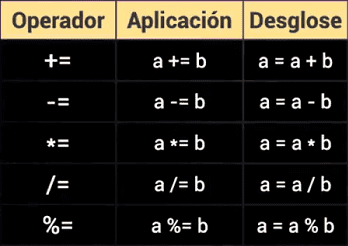

Como podemos ver, es similar a como si estuviéramos reutilizando variables. Por ejemplo, si nosotros estuviéramos en nuestro ejemplo de salario y queremos darle un bono de 200, en vez de escribir salary = salary + 200**, podemos simplificar esa operación al escribirlo de la siguiente forma: **salary += 200**.

***NOTA: Recordemos que el operador % sirve para obtener el residuo de una división.***

**Operador de Incremento y Decremento**

Los operadores de incremento y decremento son operadores unarios que agregan o sustraen uno de sus operandos, respectivamente.

El operador de incremento aumenta su valor en 1, similarmente el operador de decremento disminuye en 1.

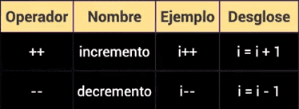

De estos operadores tenemos otra vez dos formas:

**EJEMPLO**

~~~java
// Incremento postfijo:
int vidas = 5;
int regalo = 100 + vidas++;

System.out.println("Regalo: " + regalo + ", vidas: " + vidas);
// Regalo: 105, vidas: 6

// Incremento prefijo:
int vidas = 5;
int regalo = 100 + ++vidas;

System.out.println("Regalo: " + regalo + ", vidas: " + vidas);
// Regalo: 106, vidas: 6
~~~

## 17. Operaciones matemáticas

Si continuamos trabajando con números, con Java tenemos la posibilidad de generar operaciones matemáticas un poco más complejas, como por ejemplos las operaciones trigonométricas (seno, coseno, etc.), y para ayudarnos tenemos una clase especial que debemos ver en este curso por si estamos interesado en realizar alguna aplicación que deba realizar operaciones más científicas o matemáticas que simples sumas y restas.

**Math**

La clase Math representa la librería matemática de Java. El constructor de la clase es privado, por los que no se pueden crear instancias de la clase. Sin embargo, Math es public para que se pueda llamar desde cualquier sitio y static para que no haya que inicializarla.

Tiene muchos métodos, de cuales algunas son:

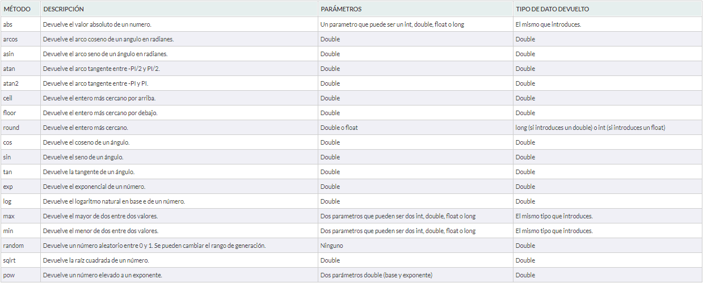

Y constantes como:

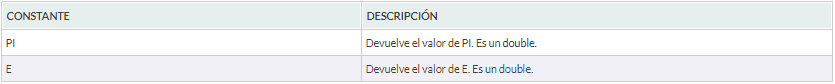

**EJEMPLO**

~~~java
Math.PI // 3.141592653589793
Math.E // 2.718281828459045

Math.ceil(2.1) // 3.0 (redondear hacia arriba)
Math.floar(2.1) // 2.0 (redondear hacia abajo)

Math.pow(2, 3) // 8.0 (número elevado a una potencia)
Math.sqrt(3) // 1.73... (raíz cuadrada)

Math.max(2, 3) // 3.0 (el número más grande)

// Área de un círculo (PI * r^2):
Math.PI * Math.pow(r, 2)

// Área de una esfera (4 * PI * r^2):
4 * Math.PI * Math.pow(r, 2)

// Volumen de una esfera ( (4/3) * PI * r^3):
(4/3) * Math.PI * Math.pow(r, 3)
~~~

## 18. Cast en variables: Estimación y Exactitud

**Cast**

En la programación hay situaciones donde debamos cambiar el tipo de dato, a veces vemos una gran cantidad de números decimales que no son completamente necesario o puede que nuestros números sean enteros pero necesitamos ser más precisos, aquí es donde hacemos uso del casteo.

El casting es un procedimiento para transformar una variable primitiva de un tipo a otro. También se utiliza para transformar un objeto de una clase a otra clase siempre y cuando haya una relación de herencia entre ambas.

Dentro se distinguen dos clases:

- **Casting implícito**
	
	En este caso no se necesita escribir código para que la conversión se lleve a cabo. Ocurre cuando se realiza lo que se llama una conversión ancha, es decir, cuando se coloca un valor pequeño en un contenedor grande.

- **Casting explícito**
	
	En el casting explícito sí es necesario escribir código. Ocurre cuando se realiza una conversión estrecha, es decir, cuando se coloca un valor grande en un contenedor pequeño. Son susceptibles de pérdida de datos.

También, dependiendo de nuestra necesidad, podemos realizar un casting por:

- **Estimación**

	Lo usamos cuando no nos importa la cantidad de decimales que tiene un número, sino que simplemente queremos la parte entera.

    ~~~java
    double monthlyDogs = dogsQuantity / 12.0;
    // monthlyDogs: 2.5 (pero no es posible, ¡no rescatamos medio perrito!)

    int estimatedMonthlyDogs = (int) monthlyDogs;
    // estimatedMonthlyDogs: 2

    // Recuerda que el casteo no redondea, solo quita los decimales:
    Math.sqrt(3) // 1.7320508075688772
    (int) Math.sqrt(3) // 1
    ~~~

- **Exactitud**

	Es para operaciones mucho más precisas en donde debemos saber el número exacto.

  ~~~java
  int a = 30;
  int b = 12;

  a / b // 2
  (double) a / b // 2.5
  ~~~

CONVERSIONES ENTRE TIPOS

* NO PERDEMOS INFORMACIÓN
~~~
  De char —> int.
  De byte —> short —> int —> long
  De int —> double
  De float —> double
~~~

* PERDEMOS INFORMACIÓN
~~~
  De int —> float
  De long —> float
  De long —> double
~~~

## 19. Casteo entre tipos de datos

La siguiente tabla resume las posibilidades de casting existentes:

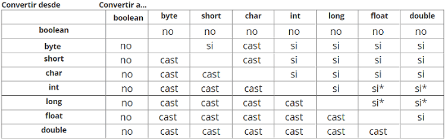

Donde:

- **no:** indica que no hay posibilidad de conversión.
- **si:** indica que el casting es implícito.
- **si***: indica que el casting es implícito pero se puede producir pérdida de precisión.
- **cast:** indica que hay que hacer casting explícito.

**EJEMPLO**

## 20. Archivos .JAR

Si estás trabajando con Java, algo que también debes de conocer son los archivo JAR: que son, como funcionan, como puedo crear uno y como puedo correr uno es algo que vamos a aprender.

**Archivos JAR**

Como hemos visto una aplicación en Java está compuesta por varios ficheros **.java**. Al compilarlos obtenemos varios ficheros **.class** (uno por fichero .java), y no un único fichero ejecutable como ocurre en otros lenguajes. Para colmo, a menudo la aplicación está formada no sólo por los ficheros .class sino que usa ficheros de sonido (usualmente **.au** en Java), iconos, etc., lo que multiplica la cantidad de ficheros que forman la aplicación compilada. Esto hace que "llevarse" la aplicación para ejecutarla en un ordenador diferente resulte un poco lioso: olvidar cualquiera de los ficheros que componen la aplicación significaría que ésta no va a funcionar correctamente. En el caso de un applet se añade el problema de la velocidad, al tener que viajar todos los ficheros a través de internet.

Los ficheros Jar (Java ARchives) permiten recopilar en un sólo fichero varios ficheros diferentes, almacenándolos en un formato comprimido para que ocupen menos espacio. Es por tanto, algo similar a un fichero **.zip** (de hecho están basados en ficheros .zip). Entonces, ¿dónde está la "gracia"? ¿No se podrían usar directamente ficheros .zip? La particularidad de los ficheros **.jar** es que no necesitan ser descomprimidos para ser usados, es decir que el intérprete de Java es capaz de ejecutar los archivos comprimidos en un archivo JAR directamente.

**EJEMPLO**

Para ver cómo funcionan abriremos dos proyectos que ya hemos hecho, el HolaMundo con la versión 8 y el DataTypes con la versión 11, y generaremos un archivo JAR para cada uno, así probaremos ejecutarlo en diferentes entornos.

**Archivo JAR en la versión 8**

Ingresamos en nuestro proyecto de HolaMundo.java. Vamos al menú de File y damos click en Project Structure:

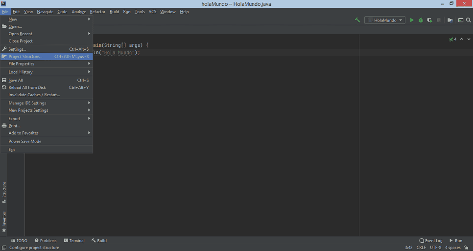

Esto nos abre una nueva ventana, nos dirigimos a la opción Artifacts y la encontraremos completamente vacío ya que es la primera vez que creamos un archivo JAR. Damos click al símbolo de +, seleccionamos JAR y finalmente From modules with dependencies:

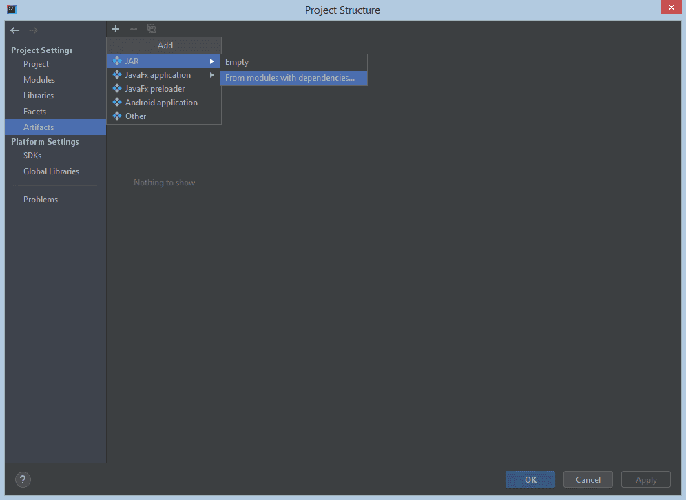

Esto nos crea otra ventana, en Main Class debemos elegir el método main que queremos incluir:

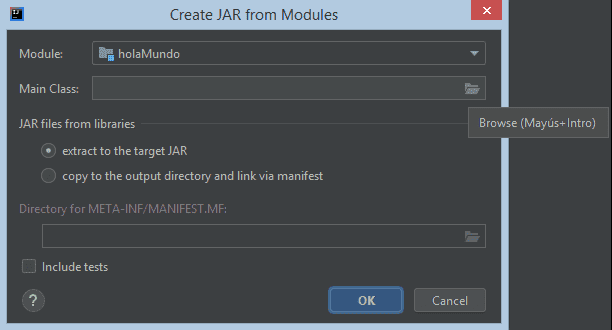

Cuando damos click en Main Class se nos abre una ventana con todas las clases que tengan método main, en este caso aparecen todos porque, recordemos, a cada clase íbamos incluyendo un método main. Seleccionado el HolaMundo y damos click en OK:

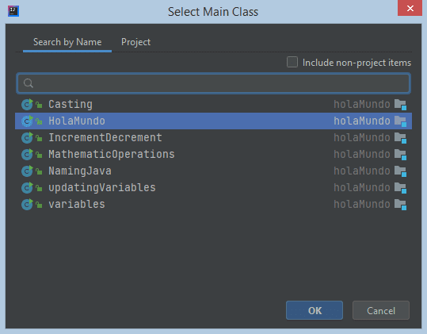

Click en OK:

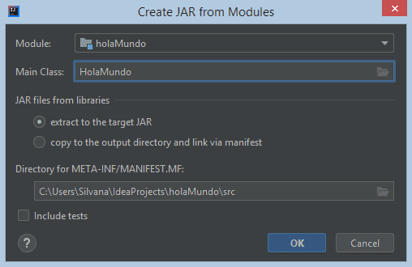

Y ya tenemos un archivo JAR, damos click en OK:

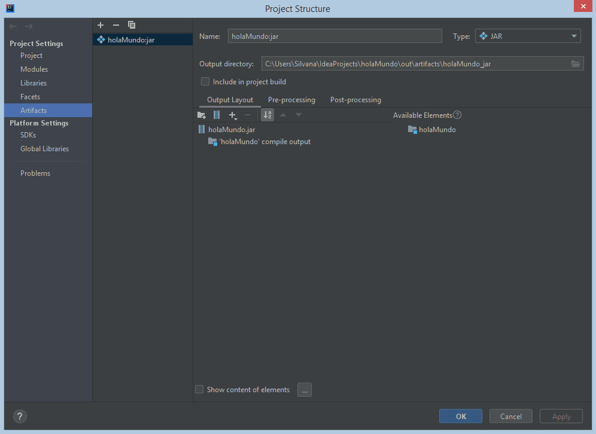

Aunque parece que no ha ocurrido nada, en realidad se ha creado una nueva carpeta llamada META-INF que contiene las instrucciones de cómo funciona nuestro archivo JAR. Ahora vamos al menú de Build y damos click en Build Artifacts:

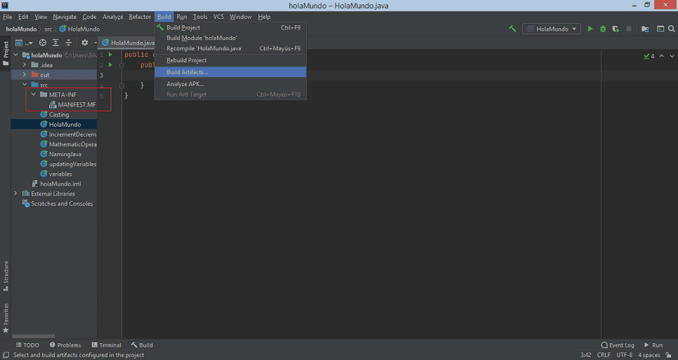

Nos aparece una pequeña ventana, seleccionamos Build:

Y en la parte inferior de nuestro IDE podemos notar como vuelve a correrse nuestro proyecto. En la carpeta out nos aparece una nueva carpeta llamada artifacts que contiene en su interior otra carpeta *_jar y finalmente podemos ver nuestro archivo .jar:

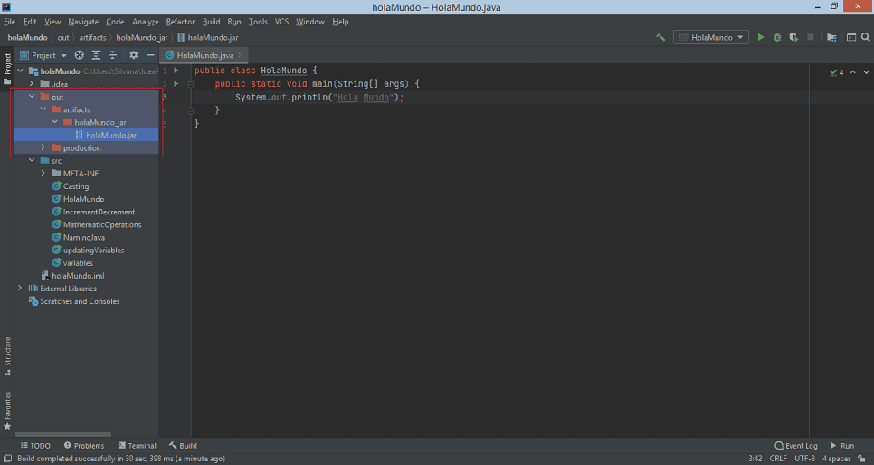

Para ejecutar un archivo .jar es necesario hacerlo directamente de la terminal. Para eso ingresamos a la terminal (en mi caso utilizo Windows), verificamos que nuestra versión de Java sea igual o mayor y después nos movemos a la carpeta donde se encuentra alojado el archivo JAR. Para correrlo usamos el comando:

**java -jar nombreArchivo.jar**

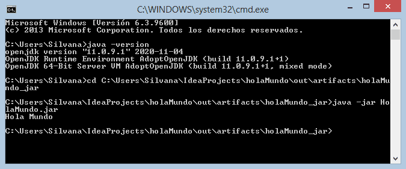

***NOTA: Para copiar la dirección completa del archivo JAR solamente debemos ir a nuestro IDE y darle click derecho la carpeta _jar, después hacemos click en Copy Path y Absolute Path.***

**Archivo JAR en la versión 11**

Crear un archivo en la versión es absolutamente similar a hacerlo con la versión 8, seguimos los mismos pasos y ya tenemos listo nuestro archivo JAR:

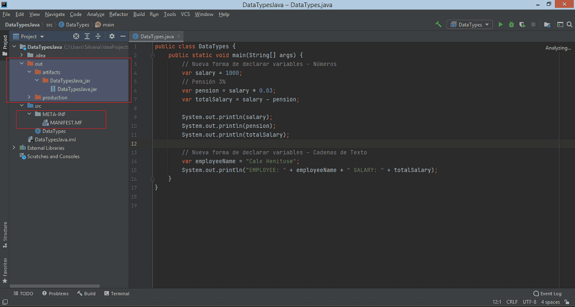

Y lo ejecutamos de la misma manera:

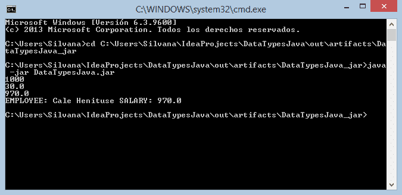

### Generar JAR con VSCode

Para crear archivos JAR en Visual Studio Code (VSCode) utilizando Java, puedes seguir estos pasos:

1. Abre VSCode y asegúrate de tener instalado el kit de desarrollo de Java (JDK) en tu sistema.

2. Crea un nuevo proyecto Java en VSCode o abre un proyecto existente.

3. Asegúrate de que tu proyecto tenga una estructura de directorios adecuada. Debe tener una carpeta "src" para el código fuente y una carpeta "bin" (o cualquier otro nombre) para los archivos compilados. También puedes tener una carpeta "lib" para las dependencias externas.

4. Escribe o importa tu código fuente en la carpeta "src".

5. Abre una terminal en VSCode (Ctrl + `) y navega hasta el directorio raíz de tu proyecto.

6. Compila tu código fuente escribiendo el siguiente comando en la terminal:

~~~
javac -d bin src/*.java
~~~

Este comando compilará todos los archivos Java en la carpeta "src" y colocará los archivos compilados en la carpeta "bin".

7. Crea el archivo Manifest para el JAR. Crea un archivo de texto llamado "manifest.txt" en la carpeta raíz de tu proyecto y agrega el siguiente contenido:

~~~
Manifest-Version: 1.0
Main-Class: NombreDeTuClasePrincipal
~~~

Reemplaza "NombreDeTuClasePrincipal" por el nombre de la clase principal de tu proyecto Java.

8. Genera el archivo JAR utilizando el siguiente comando en la terminal:

~~~
jar cvfm NombreDelArchivo.jar manifest.txt -C bin .
~~~

Esto creará un archivo JAR llamado "NombreDelArchivo.jar" con el contenido de la carpeta "bin" y el archivo Manifest.

9. ¡Listo! Ahora tendrás el archivo JAR generado en el directorio raíz de tu proyecto. Puedes utilizar este archivo JAR para distribuir tu aplicación Java.

## 21. ¡A practicar!

**Variables**

**Ejercicio 1**

Ponte creativo y preséntanos a tu familia con variables, utiliza todos los tipos y cantidad de variables que puedas, no olvides las convenciones de nombres Camel Case.

**Casting**

**Ejercicio 2**

Usando los dos tipos de casting que aprendiste (implícito y explícito), resuelve los siguientes casteos indicando qué tipo es y si se está calculando estimación o exactitud.

~~~java
public static void Ejercicio_2() {
        char a = 'z'; //conviertelo a int
        System.out.println(a);
        System.out.println((int) a);

        int b = 250; // conviertelo a long y luego de long a short
        System.out.println(b);
        System.out.println((long) b);
        System.out.println((short)b);

        double c = 301.067; // conviertelo a long
        System.out.println(c);
        System.out.println((long) c);

        int d = 100; // súmale 5000.66 y conviertelo a float
        System.out.println(d);
        System.out.println((float) (d + 5000.66));

        int e = 737; // multiplícalo por 100 y conviertelo a byte
        System.out.println(e);
        System.out.println((byte) (e * 100));

        double f = 298.638; // divídelo entre 25 y conviertelo a long
        System.out.println(f);
        System.out.println((long) (f / 25));

    }
~~~

**Archivos JAR**

**Ejercicio 3**

- Explica cómo distribuirías y crearías un ambiente de producción para un programa compilado con la versión 9 de Java.
- Incluye al menos dos Sistemas Operativos.

# Modulo 3. Aplicar condicionales en Java
## 22. Sentencia if

Los condicionales son la forma en que las computadoras toman decisiones, evaluaran si la condición para ejecutar una parte del código se cumple. Si el resultado de la operación es verdadero ejecutarán esta parte del código, en caso de que no, seguirán con las siguientes instrucciones.

La forma de programar condicionales es usando la sentencia IF (hay más, pero las veremos más adelante) de la siguiente manera:

~~~java
if (condición) {
  // instrucciones
}
~~~

En el siguiente ejemplo vamos a guardar algunas instrucciones dentro del condicional IF, Java solo ejecutará esta parte del código si se cumple la condición, en este caso, que la variable isBluetoothEnabled sea igual a true:

~~~java
boolean isBluetoothEnabled = true; // también podría ser false
int filesSended = 3;

if (isBluetoothEnabled) {
  fileSended++;
  System.out.println("Archivo enviado");
}
~~~

## 23. Alcance de las variables y Sentencia ELSE

Ahora que estamos en el tema de las condicionales, aprovecharemos para también aprender sobre el alcance de las variables.

El alcance define las secciones de código donde una variable está disponible. Las variables declaradas dentro de unas llaves {}, es decir, dentro de un bloque de condiciones solo pueden existir dentro de ese mismo bloque de código. Fuera de la sección, una variable no puede ser accedida (no existe).

Dos tipos de alcance más aplicado en las variables son:

- **Locales:** Son aquellas que sólo pueden ser accedidas desde el bloque de código en el que han sido declaradas.
- **Globales:** Son aquellas que pertenecen a cada instancia concreta de la clase donde han sido declaradas, y dependiendo del modificador de visibilidad usado podrían ser sólo accedidas desde la propia instancia a la que pertenecen.

Tenemos el siguiente ejemplo:

~~~java
// Primer nivel:
boolean condicion = true;
int numero1 = 1;

// Segundo nivel:
if (condicion) {
  // podemos modificar variables del primer nivel,
  // incluso desde el segundo nivel:
  numero1++;

  // También podemos crear y modificar 
  // nuevas variables en este nivel:
  int numero2 = 10;
  numero2++;
}

// Si volvemos al primer nivel, podemos seguir usando
// y modificando las primeras variables:
numero1--;

// Pero si salimos del segundo nivel no podemos volver a acceder
// a las variables que creamos allí:
System.out.println(numero2); // ERROR!
~~~

**If… Else**

Cuando nos encontramos en la necesidad de realizar una acción alternativa por si una condición no se cumple podemos utilizar la condicional If - Else.

~~~java
boolean isBluetoothEnabled = false;
int filesSended = 3;

if (isBluetoothEnabled) {
  fileSended++;
  System.out.println("Archivo enviado");
} else {
  System.out.println("El Bluetooth no está activado");
}
~~~

## 24. Operadores Lógicos y Expresiones booleanas

Ya vimos ejemplos de condicionales con variables booleanas, es decir, cuyo valor eran verdadero o falso. Pero hay momentos en los que necesitamos exigirle un poco más a nuestro programa, pedirle que genere una operación y que el resultado de esa operación sea verdadero o falso, y para hacer eso tenemos algunos operadores especiales.

- Operadores de Igualdad y Relacionales: Son aquellos que nos permiten comparar el contenido de una variable contra otra atendiendo a si son variables con un valor igual o distinto o bien si los valores son mayores o menores.

	- **==** (igual)
	- **!=** (desigual)
	- **<** (menor que)
	- **>** (mayor que)
	- **<=** (menor o igual que)
	- **>=** (mayor o igual que)

- Operadores Lógicos: Son los que nos permiten introducir nexos entre condiciones como “y se cumple también que” u, “o se cumple que”.

	- **&&** (AND)
	- **||** (OR)
	- **!** (NOT)

### Ejemplo

~~~java
public void logicOperations() {
        int a = 8;
        int b = 5;

        // Operadores de asignación
        System.out.println("a es igual a b? -> " + (a == b));
        System.out.println("a es diferente de b? -> " + (a != b));

        // Operadores relacionales
        System.out.println("a es mayor que b? -> " + (a > b));
        System.out.println("a es menor que b? -> " + (a < b));
        System.out.println("a es mayor o igual que b? -> " + (a >= b));
        System.out.println("a es menor o igual que b? -> " + (a <= b));

        if (a == b) {
            System.out.println("a es igual a b");
        } else if ((a != b) && (a > b)) {
            System.out.println("a es diferente de b");
        } else if (a > b) {
            System.out.println("a es mayor que b");
        } else if (a < b) {
            System.out.println("a es menor que b");
        } else if (a >= b) {
            System.out.println("a es mayor o igual que b");
        } else if (a <= b) {
            System.out.println("a es menor o igual que b");
        }
    }
~~~

## 25. Sentencia Switch

La sentencia Switch nos ayuda a tomar decisiones con base en una o más condiciones, pero funciona un poco diferente:

Switch hasta Java 11:

~~~java
switch (profe) {
  case "Anahí":
    System.out.println("¡Profesora de Java!");
    break;
  case "Oscar":
    System.out.println("¡Profesor de React.js!");
    break;
  case "JuanDC":
    System.out.println("Oye niño, ¿qué haces aquí?");
    break;
  default:
    System.out.println("¡Un nuevo profe!");
    break;
}
~~~

Switch desde Java 12:

~~~java
switch (edad) {
  case 1 -> System.out.println("¡Tienes 1 año!");
  case 20 -> System.out.println("Tienes 20 años!");
  default -> System.out.println("Tu edad no es 1 ni 20");
}
~~~

Recuerda que esta nueva sintaxis está deshabilitada por defecto, debemos hacer algunas configuraciones en nuestro IDE para que podamos utilizarla.

# Modulo 4. Escribir funciones en Java
## 26. ¿Para qué sirven las funciones?

Las funciones son un conjunto de líneas de código (instrucciones), encapsulados en un bloque, usualmente reciben parámetros, cuyos valores utilizan para efectuar operaciones y adicionalmente retornan un valor. En otras palabras una función puede recibir parámetros o argumentos (algunas no reciben nada), hace uso de dichos valores recibidos como sea necesario y retorna un valor usando la instrucción return, si no retorna algo, entonces no es una función.

Las funciones nos ayudan a:

- Organizar y modularizar el código.
- Reutilizar código.
- Evitar código repetido.

En código se verán así:

~~~java
public int suma(int a, int b) {
  return a + b;
}
~~~

Si nuestra función NO devuelve ningún tipo de dato podemos usar la palabra reservada void.

Para utilizar nuestras funciones solo debemos asignar el resultado de la función y sus parámetros a una variable con el mismo tipo de dato de la función:

~~~java
int c = suma(5, 7);
~~~

## 27. Implementa Funciones en Java

~~~java
public class Functions {
    public static void main(String[] args) {
        double r = 3;

        double area = circleArea(r);
        System.out.println("Circle area: " + area);

        double areaSphere = sphereArea(r);
        System.out.println("Sphere area: " + areaSphere);

        double volume = sphereVolume(r);
        System.out.println("Sphere volume: " + volume);

    }

    public static double circleArea(double r) {
        return Math.PI * Math.pow(r, 2);
    }

    public static double sphereArea(double r) {
        return 4 * Math.PI * Math.pow(r, 2);
    }

    public static double sphereVolume(double r) {
        return (4/3) * Math.PI * Math.pow(r, 3);
    }
}
~~~

## 28. Java Docs

Los Java Docs son una herramienta usada por muchas otras herramientas y aplicaciones porque nos ayuda a documentar todo nuestro código usando comentarios. Además, nos permite visualizar la documentación en formato HTML.

**Javadoc**

Es el estándar de la industria para documentar clases de Java. La mayoría de los IDEs los generan automáticamente.

La documentación Javadoc es una colección de páginas HTML de todas las clases, métodos, parámetros y retornos junto con la información y especificaciones que quiera incluir el desarrollador de la API que en el caso de las clases de JDK incluye abundantes e interesantes detalles de implementación a tener en cuenta al usar las clases. El Javadoc es también es una herramienta de línea de comandos que permite generar la colección de páginas HTML a partir del código fuente Java.

Se genera a partir del propio código fuente de las clases con los comentarios incluidos que siguen cierto formato precediendo la definición de las clases y métodos. Al estar código y documentación en el propio archivo de código fuente es más fácil mantener sincronizados el código y su documentación.

La documentación en el código fuente se incluye en comentarios que preceden una clase o método, además, con anotaciones se pueden documentar los parámetros y el valor de retorno. Se pueden incluir etiquetas HTML junto con algunas de las anotaciones o doclets/taglets, algunas anotaciones Javadoc incluidas en el JDK son las siguientes pero también se pueden desarrollar doclets/taglets propios o personalizar los estilos de la documentación para cambiar el contenido, información incluida o adaptar los estilos a unos según los colores de la organización.

Para generar API con Javadoc han de usarse etiquetas (tags) de HTML o ciertas palabras reservadas precedidas por el carácter "@". Estas etiquetas se escriben al principio de cada clase, miembro o método, dependiendo de qué objeto se desee describir, mediante un comentario iniciado con "/**" y acabado con "*/".

**Comentarios**

Hay tres formas de generar comentarios:

- Usando doble barra inclinada.

	// Comentario en una línea

- Comentarios en múltiples líneas.

	/* Comentario en múltiples líneas */

- Comentario que provoca la creación de Javadoc.

	/** Comentario con una descripción para Javadoc */

## 29. Javadoc en funciones

Ahora que sabemos lo útil que es utiliza Javadoc, no podemos desaprovechar la oportunidad para comentar y documentar nuestro código. Especialmente comentaremos y documentaremos la función que convierte los pesos (mexicanos o colombianos) a dólares.

Documentado se vería así:

### Clase 30 *Tags Java Docs*

~~~java
public class Functions {
    public static void main(String[] args) {
        double r = 3;

        double area = circleArea(r);
        System.out.println("Circle area: " + area);

        double areaSphere = sphereArea(r);
        System.out.println("Sphere area: " + areaSphere);

        double volume = sphereVolume(r);
        System.out.println("Sphere volume: " + volume);
    }

    /**
     * return area of a circle
     * <ul><li>Formula: PI * r^2</li></ul>
     * 
     * @param r radius of the circle
     */
    public static double circleArea(double r) {
        return Math.PI * Math.pow(r, 2);
    }

    public static double sphereArea(double r) {
        return 4 * Math.PI * Math.pow(r, 2);
    }

    public static double sphereVolume(double r) {
        return (4/3) * Math.PI * Math.pow(r, 3);
    }
}
~~~

### Tags de javadocs

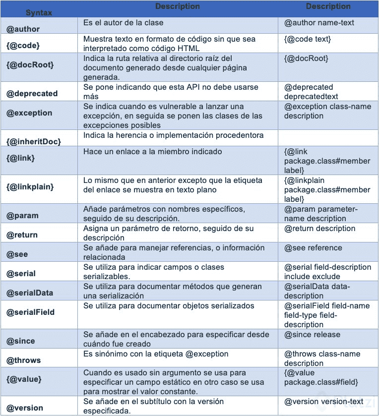

# Modulo 5. Analizar e implementar Ciclos en Java
## 31. Bucle do While

Los bucles (ciclos) nos ayudan a ejecutar una parte de nuestro código una cantidad de veces hasta que se cumpla alguna condición y podamos continuar con la ejecución de nuestro código.

Existen diferentes bucles. Por ejemplo, el bucle do while:

~~~java
do {
  // instrucciones
} while (condición);
~~~

Los ciclos evaluarán si la condición se cumple y cuando deje de hacerlo no ejecutarán más el código del ciclo. Las instrucciones son las encargadas de que esta condición cambie de verdadero a falso. De otra forma, si las instrucciones nunca cambian la condición, el ciclo no se detendrá nunca, lo que conocemos como un ciclo infinito.

La clase Scanner le permite a los usuarios contestar algunas preguntas para que nuestro programa actúe de una forma u otra. Para usarla solo debemos importar la clase Scanner de las APIs de desarrollo de Java:

~~~java
import java.util.Scanner;

int response = 0;

Scanner sc = new Scanner(System.in);
response = Integer.valueOf(sc.nextLine());
~~~

***NOTA: El método valueOf es un método sobrecargado aplicable a numerosas clases de Java y que permite realizar conversiones de tipos. En este caso, Integer.valueOf() convierte un string a un valor entero (int).***

**Tipos de datos entrada**

Existen diferentes tipos de datos y por ello, la clase scanner en función del tipo de dato introducido, utiliza distintos métodos para capturar un tipo de dato u otros en función del tipo de datos que se introduzca:

- **nextInt()** lee un valor int introducido por el usuario.
- **nextLong()** lee un valor long introducido por el usuario.
- **nextShort()** lee un valor short introducido por el usuario.
- **nextDouble()** lee un valor double introducido por el usuario.
- **nextByte()** lee un valor byte introducido por el usuario.
- **nextBoolean()** lee un valor boolean introducido por el usuario.
- **nextLine()** lee un valor String introducido por el usuario.

### Clase 32 *Operador Ternario y Bucle While*

Vamos a crear el algoritmo con la lógica necesaria para encender una lampara, emitir un mensaje y detener las luces en algún momento.

El Bucle While nos ayuda a ejecutar una parte del código mientras una condición se cumpla. Recuerda tener mucho cuidado y asegurarte de que la condición del ciclo while cambie en algún momento, de otra forma, el ciclo no se detendrá nunca y sobrecargarás tu programa:

~~~
while (isTurnOnLight) {
  printSOS();
}
~~~

Los operadores ternarios son otra forma de evaluar condiciones, así como los condicionales IF y ELSE`:

~~~java
public class WhileLoop {
    static boolean isTurnOnLight = false;

    public static void main(String[] args) {
        turnOnOffLight();

        int i = 1;
        while (isTurnOnLight && i <= 10) {
            printSOS();
            i++;
        }
    }

    public static void printSOS() {
        System.out.println(". . . _ _ _ . . .");
    }

    public static void turnOnOffLight() {
        isTurnOnLight = !isTurnOnLight;
    }
}
~~~

### Clase 33 *Bucle For*

El Ciclo For también nos ayuda a ejecutar una parte de nuestro código las veces que sean necesarias para que se cumpla una condición. De hecho, el ciclo FOR nos da muchas ayudas para lograr este resultado de la forma más fácil posible:

~~~java
// Estructura:
for (inicialización; condición; incremento o decremento;) {
  // Instrucciones
}
~~~

### Ejemplo

~~~java
// En este ejemplo el mensaje de printSOS se
// ejecutará 10 veces:
for (int i = 1; i <= 10; i++) {
  printSOS();
}
~~~

**NOTA**

Cuando nosotros escribimos for, IntelliJ IDEA nos proporciona tres opciones:

- El primer **for** nos escribe simplemente la palabra clave con los paréntesis.
- El **foreach** nos genera el for para recorrer una colección o matriz.
- El **fori** nos genera el for más habitual para ejecutar el código un número concreto de veces.

### Clase 34 *Break, Continue y Return*

Antes de pasar a uno de nuestros temas más importantes del curso es importante que sepas todas las opciones que tienes para detener ciclos y así seguir controlando el flujo de tus programas.

### **Break**

En Java esta sentencia la verás en dos situaciones específicamente:

1. **En un Switch:** en esta situación break hace que el flujo del switch no continúe ejecutándose a la siguiente comparación, esto con el objetivo de que solo se cumpla una sola condición.
	
~~~java
switch (colorModeSelected){
	case "Light":
                System.out.println("Seleccionaste Light Mode");
                break;
        case "Night": //Ambar
                System.out.println("Seleccionaste Night Mode");
                break;
        case "Blue Dark":
                System.out.println("Seleccionaste Blue Dark Mode");
                break;
}
~~~

2. **Para salir de un bucle:** Como acabamos de ver un break es capaz de detener el flujo en el código, en este caso detendremos el ciclo como tal terminándolo y haciendo que saltemos a la siguiente instrucción después del ciclo.

### **Continue**

Continue en cierto modo también nos va a servir para detener un ciclo pero en lugar de terminarlo como en el caso de break, este volverá directo a la condición.

El caso normal de uso de continue es cuando dentro de un bucle estamos haciendo muchas comprobaciones y en caso de que se cumpla alguna no hace falta seguir comprobando el resto pero no queremos meter unas comprobaciones anidadas dentro de otras para una mayor legibilidad.

La sentencia continue siempre tiene que estar dentro de un bucle porque si no producirá un error de compilación, en cualquier caso no tiene sentido ponerla fuera de un bucle.

**Return**

Aunque en algunos lenguajes esta sentencia sirve como un tipo goto, dónde se rompe el flujo del programa la mejor forma de usarlo en Java es en **Funciones**, cuando lo usamos aquí siempre viene acompañado de un valor, el cual indica el dato que se estará devolviendo en la función.

## 35. Arrays

Los tipos de variables que hemos visto hasta este momento son variables que nos permiten únicamente almacenar uno y solo un dato, pero a veces por las necesidades de nuestros programas o aplicaciones es importante tener una colección de datos que compartan el mismo tipo y manejarlos como si fueran una sola variable es aquí donde los **arreglos** son una pieza clave cuando estamos desarrollando en Java, porque justamente ellos son los que nos permiten almacenar más de un dato en una única variable. Esto va a variar mucho, pero en general es a partir de la lógica de negocio que estés manejando en esos momento, como sí por ejemplo quisiéramos manejar varios datos que son del tipo string, podríamos declarar muchas variables, pero también podemos solucionarlo al ponerlo todos juntos en un arreglo.

**Array**

Los arreglos o array son simplemente una variable que puede contener valores múltiples, a diferencia de una variable regular que solo puede contener un único valor. En Java, los arrays pueden tener una o más dimensiones, aunque el array unidimensional es el más común.

El tamaño de los arrays se declara en un primer momento y no puede cambiar en tiempo de ejecución como puede producirse en otros lenguajes. Los arrays se usan para una variedad de propósitos porque ofrecen un medio conveniente de agrupar variables relacionadas. Por ejemplo, puede usar una matriz para mantener un registro de la temperatura alta diaria durante un mes, una lista de promedios de precios de acciones o una lista de tu colección de libros de programación.

La ventaja principal de un array es que organiza los datos de tal manera que puede ser manipulado fácilmente. Por ejemplo, si tiene un array que contiene los ingresos de un grupo seleccionado de hogares, es fácil calcular el ingreso promedio haciendo un ciclo a través del array. Además, los arrays organizan los datos de tal manera que se pueden ordenar fácilmente.

Aunque los arrays en Java se pueden usar como matrices en otros lenguajes de programación, tienen un atributo especial: se implementan como objetos. Este hecho es una de las razones por las que la discusión de los arrays se pospuso hasta que se introdujeron los objetos. Al implementar arrays como objetos, se obtienen varias ventajas importantes, una de las cuales es que los arrays no utilizados pueden ser recolectados.

**Arreglo unidimensional**

Un array unidimensional es una lista de variables relacionadas. Tales listas son comunes en la programación. Por ejemplo, puede usar un array unidimensional para almacenar los números de cuenta de los usuarios activos en una red. Otro array podría usarse para almacenar los promedios de bateo actuales para un equipo de béisbol.
	
Los array unidimensionales se declaran de la siguiente manera:
	
~~~java
TipoDato[] nombreVariable;
TipoDato nombreVariable[];

// 2. Definir el tamaño del array, la cantidad de elementos
// que podemos guardar en el array:
TipoDato[] nombreVariable = new TipoDato[capacidad];

// Array de dos dimensiones:
TipoDato[][] cities = new String[númeroFilas][númeroColumnas];
~~~

## 36. Declarando Arreglos

Aprenderemos a como declarar arreglos:

Tomemos nuestro primer ejemplo, versiones de Android, para comprender la lógica de negocio. Si tuviéramos la necesidad de tener las versiones de Android (que hasta el momento son 17) tal vez debamos declarar 17 variables, aunque probablemente no lo usemos todas, pero una mejor forma de hacerlo es agrupándolas en una misma colección de datos.

Lo mismo sucede con los días, no necesitamos crear siete variables para declarar cada día de la semana cuando podemos simplemente ponerlas todas en una misma variable.

Si vemos nuestro ejemplos de arreglo dimensional, en el primer corchete ponemos la cantidad de columnas y en el segundo ponemos la cantidad de filas. Para saber cuántos elementos puede contener el arreglo simplemente multiplicamos las columnas por las filas.

***RECORDAR:***

- ***Usamos new porque en Java los arreglos son manejados como objetos.***
- ***El tamaño (el número entre corchetes) funciona como un limitante. Es un número que no cambiara a menos que el programador intervenga y lo cambie él mismo.***
- ***Por la convención, siendo los arreglos una colección de datos, llevaran nombres siempre en plural.***

## 37. Indices y búsqueda de elementos en Arrays

Ahora que aprendimos a declarar arreglos y a definir la cantidad de elementos que puede contener los arreglos en su respectiva dimensión, es momento de ver cómo podemos insertar elementos en cualquiera de las posiciones que tiene el arreglo. El agregar datos a un arreglo lo estaremos logrando gracias a los índices.

**Índices**

El array no es más que un conjunto de variables del mismo tipo agrupadas todas ellas bajo un mismo nombre que distinguimos mediante un número entero al que llamamos índice o localizador. Dicho número identifica a cada variable del array sin formar parte en sentido estricto del nombre de la variable: por ello el número puede ser sustituido por una operación, otra variable, o una operación entre números y variables.

Nosotros accedemos a cada elemento individual del array mediante ese número entero denominado índice. El 0 es el índice del primer elemento y n-1 es el índice del último elemento, siendo n el tamaño total del array.

~~~
nombreVariable[indice] = valor;
~~~

## 38. Ciclos For anidados

Si recapitulamos un poco de nuestras clases anteriores recuerdas los bucles cuya principal función es repetir una línea de código tantas veces como la condición se lo exija. Y precisamente en los código que generamos detectamos algunas líneas repetidas, algunas líneas que ensucian nuestro código visualmente.

Comencemos con nuestro ejemplo con las versiones de Android:

~~~java
// Array de una sola dimensión:
for (int i = 0; i <= 3; i++) {
  System.out.println(i);
}
// El resultado será: 0, 1, 2, 3

// Array de dos dimensiones:
for (int row = 0; row < cities.length; row++) {
  for (int col = 0; col < cities[row].length; col++) {
    System.out.println(cities[row][col]);
  }
}
// El resultado será:
// Colombia
// Bogotá
// México
// Guadalajara
// España
// Madrid
~~~

El ciclo FOREACH también nos ayuda a recorrer los elementos de un array posición por posición, solo que no tenemos control sobre el índice, el ciclo se encarga de recorrer todo el array automáticamente:

~~~java
for (TipoDato elemento : coleccion) {
  // Instrucciones
}
~~~
