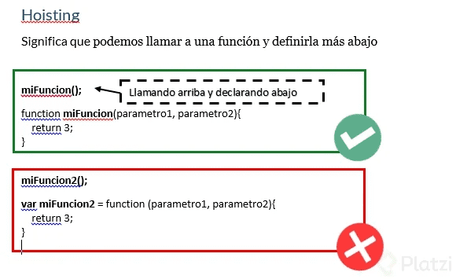

Curso básico de JavaScript

## 1. ¿Qué es JavaScript?

**¿Cómo nace Javascript?**

Nace con la necesidad de generar dinamismo en las páginas web y que a su vez los usuarios y las empresas pudieran interactuar unos con otros.

**¿Qué es Javascript?**

Es un lenguaje interpretado, orientado a objetos, débilmente tipado y dinámico. **Débilmente tipado**

Se pueden hacer operaciones entre distintos tipos de datos (enteros con strings, booleanos con enteros, etc).

**Dinámico**

Corre directamente en la etapa de Runtime sin una etapa de compilación previa. Esto permite probar nuestro código inmediatamente; pero también es lo que hace que los errores se muestran hasta que se ejecuta el programa.

**¿Realmente es Javascript un lenguaje interpretado?**

Si, y la razón es que el navegador lee linea por linea nuestro código el cuál le indica lo que tiene que hacer, sin la necesidad de compilar. Todo esto es controlado por el motor de Javascript V8 del navegador

**Javascript es Basckwards Compatible**

Todas las funciones nuevas que salen de Javascript no dañará el trabajo ya hecho, pero no se podrá utilizar en nuestro entorno de trabajo inmediatamente. Para solucionar esto está **Babel** que permite utilizar las nuevas características del lenguaje pero lo transforma a una versión que el navegador pueda entender.

## 2. ¿Por qué JavaScript?

JavaScript tiene una **comunidad enorme** de desarrolladores que te pueden ayudar a generar diferentes cosas.

1. Si solo estuvieras interesado en trabajar **aplicaciones web** tienes muchos frameworks y librerías construidas en JavaScript que te van a ayudar a hacer proyectos de forma mucho mas rápida, eficiente y robusta (Angular, View, React,entre otros)
2. Si no quieres trabajar solo en aplicaciones Web puedes utilizar JavaScript con un framework que se llama React Native para poder **construir aplicaciones nativas** como Android y IOS.
3. Puedes construir **aplicaciones de escritorio** con JavaScript, usando un framework llamado Electron, pueden correr en Mac o Windows.
4. También puedes trabajar en la parte del **Back-end** o **IOT** (Internet Of Things) es un concepto que se refiere a una interconexión digital de objetos cotidianos con Internet. Esto con un Framework llamado Node JS, el cual es un entorno de ejecución de JavaScript que corre directamente en el Back-end.

## 3. Elementos de un Lenguaje de Programación: Variables, Funciones y Sintaxis

Existen 2 componentes importante en JS

Valores o Datos: Almacenan información Funciones: realizan acciones con la información.

### VALORES PRIMITIVOS y VALORES NO-PRIMITIVOS (VALORES TIPO OBJETO)

Los datos pueden ser de VALORES PRIMITIVOS (básicos):

* Números: 40

* String: "Texto"

* Booleanos: **TRUE OR FALSE**

* Vacíos o **Empty** value: **null**, undefined; cuando tenemos un valor en faltante, para guardar cosas cuando las necesitamos, una caja vacía.

También existen VALORES NO-PRIMITIVOS o VALORES 

* TIPO OBJETO: Array [ ] : [1,2,3] (son valores primitivos)

* Valor tipo object { }: { name: "Platzi"}

si en la consola escribo la palabra reservada: typeof y seguido una variable me devuelve el tipo de variable que es. Ej: typeof nombre

## 4. Variables

Dentro de JavaScript tenemos tres formas de declarar una variable las cuales son: **var**, **const** y **let.**

1. **var:** Era la forma en que se declaraban las variables hasta ECMAScript 5. Casi ya no se usa porque es de forma global y tiene las siguientes características:

    - **Se puede reinicializar:** osea todas las variables se inicializan, por ejemplo:

        ~~~js
        var pokemonType
        pokemonType = "electric"
        ~~~

    - **Se puede reasignar:** osea la variable ya inicializada le reasignamos otro valor por ejemplo: inicializamos la variable: Var pokemonType = ‘electric’ ahora la reasignamos pokemonType = ‘grass’ ya no va var
    - **Su alcance es función global:** osea inicializamos la variable, pero la podemos llamar desde cualquier bloque (una llave abierta y una cerrada {}) pero hay que tener mucho cuidado con ello ya que puede haber peligro, no es recomendable usar VAR.

### const y let es la forma en que se declaran las variables a partir de ECMAScript 6

2. **const:** sirve para declarar variables que nunca van a ser modificadas:
    - **No se puede reinicilizar:** es una const única no puede haber otra inicializada con el mismo nombre. const pokemonType = ‘electric’ no puede haber: const pokemonType = ‘grass’
    - **No se pude re asignar:** una vez que la hayamos inicializado no la podemos reasignar solo con su nombre: const pokemonType = ‘electric’ no puede ejecutarse: pokemonType = ‘grass’
    - **es inmutable:** osea no puede cambiar con objetos:

3. **Let:** Son variables que pueden ser modificadas, se pueden cambiar:
    - **No se puede reinicilizar:** es una const única no puede haber otra inicializada con el mismo nombre. let pokemonType = ‘electric’ no puede haber: let pokemonType = ‘grass’
    - **Se puede reasignar:** Osea la variable ya inicializada le reasignamos otro valor por ejemplo: inicializamos la variable: let pokemonType = ‘electric’ ahora la reasignamos pokemonType = ‘grass’
    - **Su contexto de es bloque:** Solo funciona dentro de un bloque {}, fuera de ello no.

## 5. Funciones

Las funciones son las tareas que va a llevar a cabo el navegador. Existen 2 tipos de funciones

1) Declarativas
1) De expresión

* Ambas pueden llevar parámetros, que son los datos que necesitan para ejecutarse. Cada parámetro va separado por una coma.

* Cada instrucción que tenga la función debe terminar con ; .

* Si queremos que una función nos dé un numero o dato tenemos que usar la siguiente sintaxis:

    **return <data>**

### Las funciones declarativas tienen la siguiente sintaxis:

~~~js
function <Nombre-de-la-función> (Parámetros de la función) {
    Instrucciones
};
~~~

## 6. ¿Cuándo utilizar una función declarativa y una expresiva?

Cuando hablamos de funciones en JavaScript, tenemos dos tipos de funciones: Funciones Declarativas (function declaration / function statement) y Expresiones de función (function expression / funciones anónimas).

**Funciones Declarativas:**

En las funciones declarativas, utilizamos la palabra reservada function al inicio para poder declarar la función:

~~~js
**function saludar**(nombre) {

console.log(`Hola ${nombre}`);

} saludar('Diego');
~~~

**Expresión de función:**

En la expresión de la función, la declaración se inicia con la palabra reservada var, donde se generará una variable que guardará una función anónima.

~~~js
**var** nombre = **function**(nombre){

console.log(`Hola ${nombre}`)

} nombre(‘Diego’);
~~~

En la expresión de función, la función podría o no llevar nombre, aunque es más común que se hagan anónimas.

**Diferencias:**

A las funciones declarativas se les aplica hoisting, y a la expresión de función, no. Ya que el hoisting solo se aplica en las palabras reservadas var y function.

Lo que quiere decir que con las funciones declarativas, podemos mandar llamar la función antes de que ésta sea declarada, y con la expresión de función, no, tendríamos que declarar primero, y después mandarla llamar.

## 7. Scope

Es el alcance que tiene las variables.

Existen dos tipos de Scope:

- Scope Global: lo que está en global no puede acceder a lo que está en local.
- Scope Local: lo que está en local puede acceder a lo que está en global.

**8-Hoisting (elevación)**

<https://www.youtube.com/watch?v=uI6o97A4IrI>

En JavaScript, las declaraciones (por ejemplo, de variables o funciones) se mueven al principio de su scope o ámbito. Este comportamiento se conoce como hoisting y es muy importante tenerlo en cuenta a la hora de programar para prevenir posibles errores.

- Las funciones siempre se mueven arriba del scope. Por lo tanto, podemos elegir donde declararlas y usarlas.
- La declaración de las variables se mueven arriba del scope, pero no la asignación. Antes de usar una variable, habrá que crearla y asignarla.

●

**9-Coerción**

Coerción es la forma en la que podemos cambiar un tipo de valor a otro, existen dos tipos de coerción:

Coerción implícita = es cuando el lenguaje nos ayuda a cambiar el tipo de valor. Coerción explicita = es cuando obligamos a que cambie el tipo de valor.

//Ejemplos de Coerción:

**var** a = 4 + "7"; //Convierte a 4 en un string y lo concatena con el "7", por esto regresa un string de valor "47"

4 \* "7"; //Convierte al "7" en un número y realiza la operación, por esto devuelve 28

**var** a = 20;

**var** b = a + ""; //Aquí concatenamos para convertir la variable a string (coerción implícita)

console.log(b);

**var** c = String(a); //Aquí obligamos a la variable a convertirse en string (coerción explícita)

console.log(c);

**var d** = Number(c); //Aquí obligamos a la variable a convertirse en número (coerción explícita)

console.log(**d**);

●

**10-Valores: Truthy y Falsy**

la función boolean nos dice si ese valor booleano es verdadero o falso

***¿Que tipos por default son verdaderos y falsos?***

Usamos la función de JS que es ***Boolean()*** dentro del paréntesis ponemos el valor y nos dice si el mismo el False o True.

–> ***Falsy***

- Boolean() —> sin ningun valor es false
- Boolean(0) —> false
- Boolean(null) —> false
- Boolean(NaN) —> false // NaN es Not and Number
- Boolean(Undefined) —> false
- Boolean(false) —> false
- Boolean("") —> false

–> ***Truthy***

- Boolean(1) —> true //cualquier numero que no sea igual a cero es true
- Boolean(“a”) —> true
- Boolean(" ") —> true // siendo un espacio el valor es true
- Boolean([]) —> true // un array nos da un true
- Boolean({}) —> true // un objeto nos da el valor de true
- Boolean(function() {}) —> true //una funcion tambien es true
- Boolean(true) —> true

Todo esto lo vamos a usar en condiciones esto valida si es verdadero o falso para ejecutar cierta acción.

**11-Operadores: Asignación, Comparación y Aritméticos.**

**Operador de asignacion**

**Simbolo Descripcion**

= operador de asignacion

**Operadores de comparacion**

**Simbolo Descripcion**

== igual que // 3 == ‘’3’’

devuelve true

=== estrictamente igual que //

3 === ‘’3’’ devuelve false;

\> or >= or >== mayor o mayor igual que

< or <= or <== menor o menor igual que != or !== diferente que

**Operadores aritmeticos**

**Símbolo Descripción**

\+ operador suma este se utiliza para concatenar dos cadenas de texto.

\- operador resta

\* operador de multiplicación / operador de división

% operador de modulo

\*\* operador de potenciación

también se les conoce como operadores binarios. por que toman dos valores y generan un resultado.

**Operadores lógicos**

**Símbolo Descripción**

! NOT niega un valor && AND || OR

**12-Condicionales: If, Else, else if**

**let** piedra = 0;

**let** papel = 1;

**let** tijera = 2;

**let** pc = Math.floor(Math.random()\* 3);

var resultado = function(user, pc) {

**if** (user != pc) {

**if** (

(user === piedra && pc === tijera) || (user === papel && pc === piedra) || (user === tijera && pc === papel)

){

console.log("GANASTE!!") }

**else**{

console.log("La PC Gano!")

}

}

**else if**(user === pc) {

console.log("Empate") }

};

resultado(tijera, pc)

**13-Switch**

Ejemplo del Switch en un Piedra papel o tijeras:

**var** pregunta = prompt("Ingresa tu opción: piedra, papel o tijera "); **var** user = pregunta.toLowerCase();

**var** options = ["piedra", "papel", "tijera"];

**var** machine = options[Math.floor(Math.random() \* 3)];

// let numero = 'a';

//con true los casos van a pasar

**switch** (**true**) {

**case** (user === machine):

console.log('es un empate');

**break**;

**case** (machine === 'piedra' && user === 'papel'):

console.log('Ganaste')

**break**;

**case** (machine === 'papel' && user === 'tijera'):

console.log('Ganaste')

**break**;

**case** (machine === 'tijera' && user === 'piedra'):

console.log('Ganaste')

**break**;

**default**:

console.log('¡Perdiste!');

}

**14-Arrays**

Un **Array** es un tipo de estructura de datos, objeto. Puede guardar datos en forma de lista.

**.lenght** devuelve la longitud del array.

**.push()** agrega elementos al final del array.

**.shift()** \*\*Elimina el elemento que está en el inicio del array.

**.pop()** elimina el último elemento del array.

**.unshift()** agrega un elemento al array, pero lo agrega en primer lugar.

**.indexOf** \*\* devuelve la posición de un elemento del array.

**15-Loops: For y For...of**

*var* estudiantes = ['Maria','Sergio','Rosa','Daniel'];

*function* saludarEstudiantes(*estudiante*){

console.log(`Hola! ${estudiantes[i]}`);

}

for(*var* i = 0; i < estudiantes.length; i++){

saludarEstudiantes(estudiantes[i]);

}

**for of**

*var* estudiantes = ['Maria','Sergio','Rosa','Daniel'];

*function* saludarEstudiantes(*estudiante*){

console.log(`Hola! ${estudiante}`);

}

for(*var* estudiante of estudiantes){

saludarEstudiantes(estudiante);//me trae cada estudiante del array de estudiantes

}

//Los bucles pueden ejecutar un bloque de código varias veces. JavaScript admite diferentes tipos de bucles:

- for - recorre un bloque de código varias veces
- for/in - recorre las propiedades de un objeto
- for/of - recorre los valores de un objeto iterable
- while - recorre un bloque de código mientras se cumple una condición específica
- do/while - también recorre un bloque de código mientras se cumple una condición específica

**16-Loops: While**

El bucle while recorre un bloque de código siempre que una condición especificada sea verdadera.

**Sintaxis**

while (condition) {

// code **block** to **be** executed }

*var* estudiantes = ['Maria','Sergio', 'Franco', 'Azul']; *function* saludarEstudiantes (*estudiante*){

console.log(`Hola, ${estudiante}`);

}

while(estudiantes.length > 0){ //se ejecuta mientras la condición sea verdadera

*var* estudiante = estudiantes.shift();//shift saca elementos del array

saludarEstudiantes(estudiante);

}

**17-Objects**

Un objeto en programación es una representación abstracta de un objeto en la vida real, sin embargo también puede entenderse como un contenedor de datos. Ejemplo:

Una botella de refresco tiene ciertas características y acciones.-

Características: altura, volumen, color, contenido, dureza etc…

Acciones: beber, reciclar, rehusar, aventar, abrir tapa, etc…

Respectivamente a estas características y acciones se les conoce como atributos(características) y métodos(acciones) en programación. #####################################

**18-Función constructora**

*var* miAuto = {//objeto

marca: 'Toyota', //propiedad 1

modelo: 'Corolla', //propiedad 2

year: 2020,

detalleDelAuto: *function*(){

console.log(`Auto ${this.modelo} ${this.year}`); }

};

*function* auto(*marca*, *modelo*, *year*){ //de param uso las propiedas que quiero que mi objeto tengo

this.marca = marca;//this apunta a mi funcion constructora this.modelo = modelo;

this.year = year;

}

*var* autoNuevo = new auto('Tesla','Model 3', 2020); //new genera una nueva instancia de nuestra funcion constructora

*var* autoNuevo2 = new auto('Audi','TT', 2015); //así voy generando nuevos autos

*var* autoNuevo3 = new auto('Peugeot', '208', 2020);

############################################################## //reto hacer loop para agregar autos

*var* autos= []; //creo array vacio

for(*let* i=0; i < 5; i++){

*var* marca = prompt('Ingrese marca del auto');

*var* modelo = prompt('Ingrese modelo del auto');

*var* year = prompt('Ingrese año del auto');

autos.push(new auto(marca, modelo, year));//push agrega elem al final del array

}

for(*let* i = 0; i < autos.length; i++){

console.log(autos[i]);

}

**19-Métodos de recorridos de Arrays**

**Metodo 1 con el filter**

**Metodo 2 con el map**

***var* articulos = [**

**{ nombre: 'bici', costo:3000},**

**{ nombre: 'Tv',costo:2500},**

**{ nombre: 'Libro', costo:320},**

**{ nombre: 'celular', costo:2500},**

**{ nombre: 'Laptop', costo:5000},**

**{ nombre: 'Teclado', costo:500},**

**{ nombre: 'Audifonos', costo:1700}, ];**

**//el metodo de map genera un nuevo array**

***var* nombreArticulos = articulos.map(*function*(*articulo*){**

**return articulos.nombre**

**}); nombreArticulos**

**20-Recorriendo Arrays con .find(), .forEach() y .some()**

**Metodo find**

***var* articulos = [**

**{ nombre: 'bici', costo:3000},**

**{ nombre: 'Tv',costo:2500},**

**{ nombre: 'Libro', costo:320},**

**{ nombre: 'celular', costo:2500},**

**{ nombre: 'Laptop', costo:5000},**

**{ nombre: 'Teclado', costo:500},**

**{ nombre: 'Audifonos', costo:1700},**

**];**

**//find nos sirve para encontrar algo dentro del array //este metodo no modifica el array**

***var* encuentraArticulo = articulos.find(*function*(*articulo*){**

**return articulo.nombre === 'Laptop'; //quiero que busque ese articulo**

**});**

**encuentraArticulo;**

**Método forEach**

***var* articulos = [**

**{ nombre: 'bici', costo:3000},**

**{ nombre: 'Tv',costo:2500},**

**{ nombre: 'Libro', costo:320},**

**{ nombre: 'celular', costo:2500},**

**{ nombre: 'Laptop', costo:5000},**

**{ nombre: 'Teclado', costo:500},**

**{ nombre: 'Audifonos', costo:1700},**

**];**

**//metodo forEach() filtrado del array y devuelve cosas articulos.forEach(*function*(*articulo*){**

**console.log(articulo.nombre);**

**}**

**);**

**Metodo some()**

***var* articulos = [**

**{ nombre: 'bici', costo:3000},**

**{ nombre: 'Tv',costo:2500},**

**{ nombre: 'Libro', costo:320},**

**{ nombre: 'celular', costo:2500},**

**{ nombre: 'Laptop', costo:5000},**

**{ nombre: 'Teclado', costo:500},**

**{ nombre: 'Audifonos', costo:1700},**

**];**

**//regresa una validación de true or false para articulos //que cumplen esa condicion**

***var* articulosBaratos = articulos.some(*function*(*articulo*){**

**return articulo.costo <= 700; //regresa articulos con precio menor a 700**

**});**

**articulosBaratos;//solo devuelve true si hay al menos 1 que cumpla**

**21-Eliminando elementos de un array .push()**

El método.push() nos permite agregar uno o más elementos al final de un array.

**.shift()**

Ahora pasemos a la otra cara de la moneda donde necesitamos eliminar un elemento del array..shift() eliminar el primer elemento de un array, es decir, elimina el elemento que esté en el índice 0.

**Bonus Track**

Si ya entendiste cómo funciona.shift() aplicar.pop() te será pan comido 🍞. El método.pop() eliminará el último elemento de un array. En este sentido, si tenemos un array de 5 elementos,pop() eliminará el elemento en el índice 4. Usemos el mismo ejemplo pero usando este método.

<https://github.com/aaronpaulgz/push-shift>
