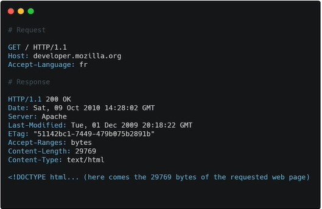

## FRAMEWORK VS LIBRERÍA

**Framework:** Será la base sobre la cual podras construir y desarrollar tu proyecto, incluye todas las herramientas necesarias para completarlo (incluye librerías, estándares y reglas).

* tienen reglas, un estructura, resuelve un problema grande

**Librería:** Solo aborda una utilidad especifica, pudiendo agregar más de una en tu proyecto. Eso si, asegurate que no interfieran con el código de otra librería.

* no tiene reglas, puedes implementarlo a tu gusto, resuelve un problema especifico.

Recuerda: Ninguno es mejor que el otro, todo va a depender de la necesidad de tu proyecto

## Cómo se conecta el frontend con el backend: API y JSON

La unión entre el Frontend y el Backend se hace a través de una API: Application Programming Interface.

Una API es una sección del backend que permite que el frontend pueda comunicarse con él a través de mensajes bidireccionales (de ida y vuelta).

Tenemos dos grandes estándares para crear las APIs:

* **SOAP (Simple Objetct Access Protocol):**Mueve la información a través de un lenguaje XML (Extensible Markup Language). Es similar al HTML, es un lenguaje demarcado. SOAP es un protocolo que ha quedado en el olvido.

~~~XML
<?xml version="1.0"?>
<note>
	<to>Miguel</to>
	<from>Facundo</from>
	<heading>Recordatorio</heading>
	<body>No olvides publicar el curso!</body>
</note>
~~~

* **Rest (Representational State Transfer):** Utiliza otro lenguaje JSON (Javascript Objet Notation). Un JSON no es más que un diccionario de Python. Los diccionarios de Python son lo mismo que los objetos de JS.

## El lenguaje que habla Internet: HTTP

HTTP: Hypertext Transfer Protocol

peticion y respuesta en HTTP:

**Request (petición) y Response (respuesta).**

Un request tiene headers (cabeceras)

Existen distintos métodos para una request, GET, DELETE, POST, etc.

Aquí un ejemplo Request HTTP:

A esto se responde con un Response, aquí dejo un ejemplo:

status code de HTTP (codigo de respuesta), respuestas:

### **la web:**

Para complementar el aporte 😀:

HTTP nos permite transportar la información que viene de distintas formas: HTML, CSS,JS, webAPIs.

En la capa capa inferior se vale de protocolos como

* **IP (internet Protocol):** para identificar y comunicarse con el servidor

* **TCP**  Son las siglas de Transmission Control Protocol, es un conjunto de reglas estandarizadas que permiten a los equipos comunicarse en una red como Internet.

* **TLS** Transport Layer Security, seguridad de la capa de transporte es el protocolo sucesor de SSL. Son protocolos criptográficos, que proporcionan comunicaciones seguras por una red, comúnmente Internet.​

* **DNS** El sistema de nombres de dominio (DNS) es el directorio telefónico de Internet. Las personas acceden a la información en línea a través de nombres de dominio

* **UDP** El Protocolo de datagrama de usuario (UDP) es un protocolo ligero de transporte de datos que funciona sobre IP. UDP proporciona un mecanismo para detectar datos corruptos en paquetes, pero no intenta resolver otros problemas que surgen con paquetes, como cuando se pierden o llegan fuera de orden.

## ¿Cómo es el flujo de desarrollo de una aplicación web?

Entorno local (Editor de Código → Git → mi local) Pasar del entorno local al servidor se llama deploy.

Lo que se hace normalmente en un entorno profesional es CI/CD (Continuous Integration and Continuous Delivery) o Continous Deployment. Se prueba (testea), si funciona bien, el código se va a al server (production).

El proyecto se guarda en production en un domain (dominio).

Se puede comprar un dominio, por ejemplo en namecheap.

En mi computadora, las cosas van a vivir en un entorno local:

* Dirección y puerto, por ejemplo:

port: es el puerto en la que se trabaja y lo normal es 8000. puede ser cualquier numero siempre que este disponible.

ver datacenter aca: https://www.datacenters.com/locations

## El hogar de tu código: el servidor

Es una computadora que contiene una aplicación y la distribuye mediante el protocolo HTTP.

**La nube**
Son servidores juntos que se encuentan en algún lugar del mundo funcionando y distribuyendo aplicaciones.

Estos se encuentran en un sitio llamado Data Centers.

la rama que estudia esto es cloud computing.

**Data Centers**
Son los lugares donde se encuentran los servidores, los cuales almacenan datos (como tu página web, o una aplicación como Facebook)

**Hosting**
Es el acto de guardar tu aplicación en un server.

Un espacio en un servidor, donde tu aplicación será guardada.

**Existen diferentes tipos de hosting (formas de guardar aplicaciones):**

* **IaaS:** Infrastructure as a Service
* **PaaS:** Platform as a Service
* **SaaS:** Software as a Service

### IaaS
Este servicio te da el control de las cosas importantes como hardward y son mas economicas, eligen que recursos quieres.

**La cantidad de CPU**
* RAM
* SSD
* Para esto existen diferentes opciones:

**Proveedores:** AWS, Microsoft Azure, Digital Ocean.

**Existen dos tipos de IaaS:**

* VPS (Virtual Private Server)
Servidor privado, recursos solo para tí.

* Shared Hosting
Compartes los recursos con otras personas.

Investigar AWS, Azure.

### PaaS

El servidor se asegura de actualizar las aplicaciones que hacen que viva tu aplicación, te brindan una interfaz grafica y otras coas como:

* Base de datos
* Seguridad
* Firewall 

Qué es un Firewall?

Los firewall o cortafuegos en su traducción, son son programas de software o dispositivos de hardware que filtran y examinan la información que viaja a través de tu conexión a Internet. Representan la primera defensa porque pueden evitar que un programa malicioso o un atacante obtengan acceso a tu red y a tu información antes de que se produzca cualquier posible daño.

Las PaaS tienen una interfaz gráfica que te permite elegir lo que tu app necesita (como una DB o que tipo de Firewall). Creando así un nivel de abstracción donde no tienes que preocuparte de las especificaciones de los servers.

Los PaaS son Just Deploy, es para simplemente hagas deploy del codigo.

**Existen diferentes:**
* Google APP Engine
* Firebase
* Heroku

### SaaS
Es cuando necesitas un software ya hecho.

Es una aplicación que un provedor te presta para que hagas funcionar tu negocio.

A esto se le llama No Code

**Existen varias opciones:**

* Google Docs
* Slack
* WordPress

## Proyecto: diseño y bosquejo de una API

Casi siempre las aplicaciones tienen un CRUD, y podemos usar una API para que haga funcionar este CRUD.

CRUD Create Read Update Delete.
Framework
* FastApi
* Django → REST Framework
* Flask

Un Endpoint / Route / Path (conocidos con esos tres nombres), es una sección de la URL de nuestro proyecto.

El lugar al que las APIs envían las peticiones y donde vive el recurso, se llama endpoint.

~~~http
http://twitter.com/api/tweets 
(api/tweets es el **endpoint o route o path)
~~~

Los endpoints son los que nos van a permitir hacer un CRUD (Create, Read, Update and Delete)

## Proyecto: diseñando los endpoints de los Tweets

Aqui se simplifica la creación de los endpoints, sin embargo hay que saber que cada sigla del CRUD tiene una representación en el mundo de las APIs y se llaman verbos http que sencillamente indican en la petición que se realiza al servidor que se quiere hacer.

Aqui la transformacion de CRUD a los verbos HTTP
Create -> POST
Read -> GET
Update -> PUT
Delete -> Delete

https://developer.mozilla.org/es/docs/Web/HTTP/Methods

Seria buena practica mejor definir los endpoints de la siguiente manera

Create a tweet -> /tweets/ : POST
Read all tweets -> /tweets/ : GET
Read a tweet -> /tweets/{id}/ : GET
Update a tweet -> /tweets/{id} : PUT
Delete a tweet -> /tweets/{id}/ : DELETE

PD: La simplificación no tiene nada de malo pero esta simplemente es una forma mas profesional para hacerlo

## Qué lenguaje y framework escoger para backend

1. Python: Tiene varios frameworks: Django (si vas a trabajar con muchos datos), Flask (nos permite trabajar con aplicaciones fáciles y flexibles, personalizado, simple), Fast Api (es el más rápido en desarrollo y desempeño en Python).
   
2. JavaScript: Tiene dos frameworks para backend —> Express y Nest (nos va a dar más código, como un express con esteroides). Puedes hacer frontend y backend.

3. PHP: Se puede trabajar con Laravel (es el más sencillo y te sirve para eleborar tus primeros proyectos) o Symfony (Se considera más complejo, permite elaborar aplicaciones más escalables), con mucha salida laboral. Para crear API.

4. Java: Es de los que más demanda laboral tienen, tiene un framework llamado Spring. Java es uno de los lenguajes que corren por defecto en Android.

5. Go: Es un lenguaje rápido. Alternativas para web Bin (permite crear aplicaciones y APIs) y Beego (está en crecimiento).

6. Ruby: aUno de sus fuertes es su comunidad, el framework a elegir sería Ruby On Rails (RoR).

