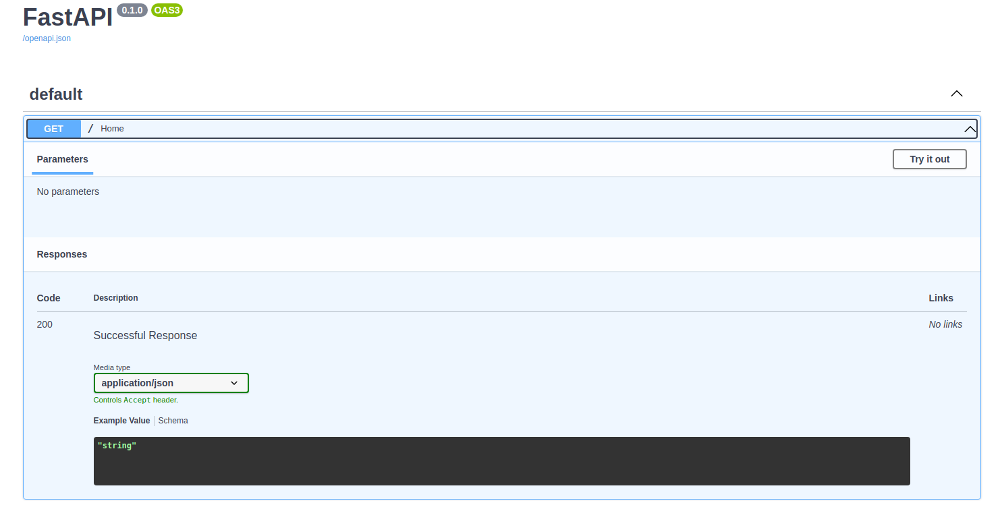
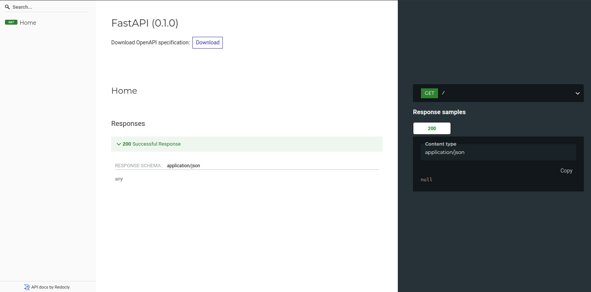
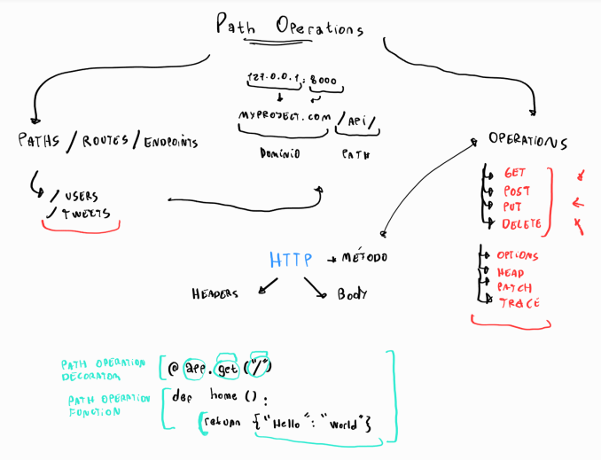
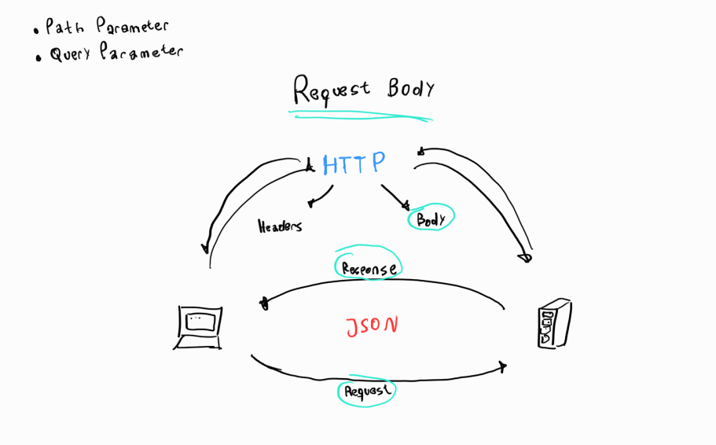

<div align="center">
    <h1>FastAPI: Fundamentos, Path Operations y Validaciones</h1>

</div>

- [Fundamentos de FastAPI](#fundamentos-de-fastapi)
  - [¿Qué es FastAPI?](#qué-es-fastapi)
  - [Frameworks que utiliza FastAPI por detrás](#frameworks-que-utiliza-fastapi-por-detrás)
  - [Hello World!](#hello-world)
  - [Documentación interactiva de una API](#documentación-interactiva-de-una-api)
- [Desarmando el framework](#desarmando-el-framework)
  - [Path Operations](#path-operations)
    - [Partes del protocolo HTTP](#partes-del-protocolo-http)
    - [Operations (Métodos)](#operations-métodos)
  - [Path Parameters](#path-parameters)
  - [Query Parameters](#query-parameters)
  - [Request Body y Response Body](#request-body-y-response-body)
  - [Models](#models)
- [Validaciones](#validaciones)
  - [Validaciones: Query Parameters](#validaciones-query-parameters)
  - [Validaciones: explorando más parameters](#validaciones-explorando-más-parameters)
  - [Validaciones: Path Parameters](#validaciones-path-parameters)
  - [Validaciones: Request Body](#validaciones-request-body)
  - [Validaciones: Models](#validaciones-models)
  - [Tipos de datos especiales](#tipos-de-datos-especiales)


## ¿Qué es FastAPI?

[FastAPI](https://fastapi.tiangolo.com/) es el framework mas veloz para el desarrollo web con Python. Enfocado para realizar APIs, es el mas rápido en lo que respecta a la velocidad del servidor compitiendo directamente con Node.Js o GO, considerados los lenguajes mas veloces para desarrollo de backend. 

Fue creado por [Sebastian Ramirez](https://twitter.com/tiangolo), es de código abierto y se encuentra en Github. Es usado por empresas como Uber, Windows, Netflix y Office.

## Frameworks que utiliza FastAPI por detrás

> FastAPI es framework que está parado, sobre los hombros de gigantes.

Los frameworks que utiliza son:


- [Uvicorn](https://www.uvicorn.org/): es una librería de Python que funciona de servidor, es decir, permite que cualquier computadora se convierta en un servidor.
  - Un servidor puede ser:
    - Una computadora que distribuye tu aplicación.
    - Un paquete que convierta a tu computadora en esa computadora que distribuya tu aplicación.

- [Starlette](https://www.starlette.io/): es un framework de desarrollo web de bajo nivel, para desarrollar aplicaciones donde se requiere un amplio conocimiento de Python. FastAPI lo toma como base y se encarga de añadirle funcionalidades por encima para que se pueda usar mas fácilmente.

- [Pydantic](https://pydantic-docs.helpmanual.io/): Es un framework que permite trabajar con datos similar a pandas, pero este te permite usar modelos los cuales aprovechara FastAPI para crear la API.

## Hello World!

1. Creamos un entorno virtual para trabajar sobre el. (Hay documentacion, no lo explicaré)
2. Activamos entorno e instalamos fastapi:
   - Debemos instalar uvicorn tambien porque no se instala como dependencia de fastapi: `pip install fastapi uvicorn`
3. Creamos archivo main.py y creamos el hola mundo:

```python
from fastapi import FastAPI

app = FastAPI()

@app.get("/")
def home():
    return {"Hello": "World"}
```

4. Uniciamos nuestro servidor desde una terminal con el comando: `uvicorn main:app --reload`
   - `uvicorn`: framework que crea el servidor.
   - `main:app`: Archivo que contiene nuestra app
   - `--reload`: Para que actualice el servidor automaticamente
5. Vamos a nuestro navegador y abrimos nuestro servidor en **127.0.0.1:8000**

## Documentación interactiva de una API

FastAPI también parado sobre los hombros de OpenAPI para generar documentación.

- [Open APIs](https://www.openapis.org/): es una especificación que define como describir, crear y visualzar API’s. Permite reconocer si una API está definida adecuadamente. Require de Swagger.

- [Swagger](https://swagger.io/): Es un framework para trabajar API’s.
- [ReDoc](https://redocly.com/) es un framework alternativo a Swagger, instalado por default con FastAPI.

FastAPI funciona sobre SwaggerUI (User Interface) que permite mostrar graficamente la API documentada. SwaggerUI obtiene especificaciones de Open API y la muestra por Fast API.

Swagger UI: http://127.0.0.1:8000/docs



ReDoc UI: http://127.0.0.1:8000/redoc




## Path Operations

**Path Operation: Es la combinación de una ruta acompañada de un método.**

Está dividido en dos partes:

- **Path/Routes/Endpoints**: Se le llama así a todos los elemento que agregamos a la derecha del dominio. (Tambien llamados endpoints)

- **Operations**: Es exactamente lo mismo que un método HTTP.

```python
@app.get("/") # Path Operator DECORATOR
def home(): # Path Operator FUNCTION
    return {"Hello": "World"}
```



#### Partes del protocolo HTTP

- **Headers**: Son esquemas de `key: value` que contienen información sobre el HTTP request y el navegador. Aquí también se encuentran los datos de las cookies. La mayoría de los headers son opcionales.Como los headers HTTP son una parte fundamental de los mensajes entre clientes y servidores, el siguiente recurso puede ser util: [Headers del protocolo HTTP](https://diego.com.es/headers-del-protocolo-http)
- **Body**: Si se envía información al servidor a través de POST o PUT, esta va en el body.
- **Method**: Son operaciones que se pueden realizar mediante el protocolo.

#### Operations (Métodos)

[Métodos de petición HTTP by Mozilla](https://developer.mozilla.org/es/docs/Web/HTTP/Methods)

Los siguientes métodos son los mas utilizados:

- `GET`: El método `GET` solicita una representación de un recurso específico. Las peticiones que usan el método `GET` sólo deben recuperar datos.
- `POST`: El método `POST` se utiliza para enviar una entidad a un recurso en específico, causando a menudo un cambio en el estado o efectos secundarios en el servidor.
- `PUT`: El modo `PUT` reemplaza todas las representaciones actuales del recurso de destino con la carga útil de la petición.
- `DELETE`: El método `DELETE` borra un recurso en específico.

Los siguientes métodos son menos utilizados y mas complejos:

- `OPTIONS`: El método `OPTIONS` es empleado para describir las opciones de comunicación para el recurso de destino.
- `HEAD`: El método `HEAD` pide una respuesta idéntica a la de una petición GET, pero sin el cuerpo de la respuesta.
- `PATCH`: Para editar partes concretas de un recurso.
- `TRACE`: El método `TRACE` realiza una prueba de bucle de retorno de mensaje a lo largo de la ruta al recurso de destino.
- `CONNECT`: El método `CONNECT` establece un túnel hacia el servidor identificado por el recurso.

## Path Parameters

Imaginemos que tenemos un endpoint para una acción particular. En el ejemplo analicemos twitter.

Por endpoint queremos mostrar un tweet, aqui nuestros endpoints:

```text
- "/" -> Home
- "/tweets/22"
- "/tweets/1"
- "/tweets/2"
```

- ¿Qué pasa si la el número de tweets crece de una forma que no te permita utilizar la estrucutura de los endpoints que habiamos trabajado?
- ¿Es viable crear un endpoint para cada tweet que se escribe?

Para esto tenemos los **Path Parameters**:

Un Path parameter es una variable definida dentro de un Path, que nos permite manejar un valor de manera dinamica.

La definición de un Path Parameter nos **OBLIGA** a pasar la variable siempre en el endpoint.

```
#Sintaxis de un Path Parameter 👇
/tweets/"{tweet_id}" -> Particular tweet
```

## Query Parameters

Si los Path Parameters son obligatorios, necesitamos alguna forma de tener parametros que no sean obligatorios, bueno, estos son los Query Parameters.

Los Query Parameters son Parámetros opcionales para nuestros Endpoints. Usos:

- Para de aplicar búsquedas o filtros del recurso que le devolveremos a los usuarios de nuestra API.

Para indicar que comenzaremos a agregar un query parameter usamos el símbolo de **interrogación** `?` seguido del nombre del campo con el valor a aplicar.

Si necesitas mandar más de un parámetro opcional, lo único que hay que hacer es concatenar con el símbolo de **ampersan** `&` y agregar más parámetros.


Ejemplo de uso:

```

http://127.0.0.1:8000/items/?skip=0&limit=10
/users/{user_id}/details/?age=20&height=184
```


## Request Body y Response Body

Debes saber que bajo el protocolo HTTP existe una comunicación entre el usuario y el servidor. Esta comunicación está compuesta por cabeceras (headers) y un cuerpo (body). Por lo mismo, se tienen dos direcciones en la comunicación entre el cliente y el servidor y definen de la siguiente manera:

- Request : Cuando el cliente solicita/pide datos al servidor.
- Response : Cuando el servidor responde al cliente.
- Request Body : Request Body viene a ser el cuerpo (body) de una solicitud del cliente al servidor.
- Response Body : viene a ser el cuerpo (body) de una respuesta del servidor al cliente.




## Models

Un modelo es la representacion de una entidad en codigo, al menos de una manera descriptiva.

¿Como luce un modelo dentro de FastAPI?

Modelo pydantic para validar datos:

~~~python
from typing import Optional
from pydantic import BaseModel
from fastapi import FastAPI
from fastapi import Body

app = FastAPI()


class Person(BaseModel):
    first_name: str
    last_name: str
    age: int
    hair_color: Optional[str] = None
    is_married: Optional[bool] = None


@app.get("/")
def home():
    return {"Hello": "World"}


# Request and Response
@app.post("/person/new")
def create_person(person: Person = Body(...)):
    return person

~~~


Documentacion Oficial: https://fastapi.tiangolo.com/tutorial/sql-databases/

## Validaciones: Query Parameters

Para especificar las validaciones, debemos pasarle como parámetros a la función Query lo que necesitemos validar.


~~~python
rom typing import Optional

from fastapi import FastAPI
from fastapi import Query

app = FastApi()

@app.get('/person/detail')
def show_person(
    name: Optional[str] = Query(
        default=None,
        min_length=1,
        max_length=50
    ),

    # El ... para hacerlo obligatorio, no recomendado en un Query parameter
    age: int = Query(...)
):
    '''
    Funcion para probar la validacion en los query parameter.
    El Age esta obligatorio, no se recomienda hacer esto, si necesitas un
    parametro obligatorio se recomienda hacerlo en un path parameter
    '''
    return {name: age}
~~~

## Validaciones: explorando más parameters

Para tipos de datos str:

- max_length : Para especificar el tamaño máximo de la cadena.
- min_length : Para especificar el tamaño minimo de la cadena.
- regex : Para especificar expresiones regulares.

Para tipos de datos int:

- ge : (greater or equal than ≥) Para especificar que el valor debe ser mayor o igual.
- le : (less or equal than ≤) Para especificar que el valor debe ser menor o igual.
- gt : (greater than >) Para especificar que el valor debe ser mayor.
- lt : (less than <) Para especificar que el valor debe ser menor.

## Validaciones: Path Parameters

~~~python

from typing import Optional
from pydantic import BaseModel
from fastapi import FastAPI, Path, Query
from fastapi import Body

app = FastAPI()


class Person(BaseModel):
    first_name: str
    last_name: str
    age: int
    hair_color: Optional[str] = None
    is_married: Optional[bool] = None


@app.get("/")
def home():
    return {"Hello": "World"}


# Request and Response
@app.post("/person/new")
def create_person(person: Person = Body(...)):
    return person

# Validaciones: query parameters


@app.get("/person/detail")
def show_person(
    name: Optional[str] = Query(
        default=None,
        min_length=1,
        max_length=50,
        title="PErson Name",
        description="This is the person name. It's between 1 and 50 characters long"),
    age: int = Query(
        ...,
        title="Person Age",
        description="This is the person age. It's required",)
):
    return {"name": name, "age": age}

# Validaciones: path parameters


@app.get("/person/detail/{person_id}")
def show_person(
    person_id: int = Path(
        ...,
        title="The ID of the person to get",
        ge=0,
        le=100)
):
    return {"person_id": person_id}

~~~

## Validaciones: Request Body

~~~python 
#Pydantic
from pydantic import BaseModel

#FastAPI
from fastapi import FastAPI
from fastapi import Path

app = FastAPI()


# Validaciones: Request Body

@app.put("/person/{person_id}")
def update_person(
    person_id: int = Path(
        ...,
        title="Person ID",
        description="This is the person ID",
        gt=0
    ),
    person: Person = Body(...),
    location: Location = Body(...)
): 
    results = person.dict()
    results.update(location.dict())
    return results
# OR
		return {
        'person': person,
        'location': location
    }
~~~

### Diferencia Path, Query Parameters and Request Body

usamos **Path Parameters** cuando por ejemplo se trata de un id y esas cosas, como una variable etc, usamos los **Requests Body** para enviar información que tiene formato de un modelo y usamos los **Query Parameters** para solicitar infomación opcional del servidor.

## Validaciones: Models

Para validar modelos tomamos uso de la clase de Pydantic Field, que funciona igual a las validaciones que ya hemos hecho con Path, Query y Body

```python
from pydantic import BaseModel, Field

class Person(BaseModel):
    first_name: str = Field(
        ...,
        min_length=1,
        max_length=50,
    )
    last_name: str = Field(
        ...,
        min_length=1,
        max_length=50,
    )
    age: int = Field(
        ...,
        gt=0,
        le=110
    )
    hair_color: Optional[HairColor] = Field(default=None)
    is_married: Optional[bool] = Field(default=None)
```

Puedes ver que en hair_color ya tenemos un tipo distinto a String esto lo hacemos para validar que tenga un campo permitido, haciendo otra clase usando Enum

```python
from enum import Enum

class HairColor(Enum):
    white: str = 'white'
    black: str = 'black'
    brown: str = 'brown'
    red: str = 'red'
    blonde: str = 'blonde'
    tinted: str = 'tinted'
```

Aquí tenemos enumerados algunos colores de pelo y ahora cada vez que alguien trate de ingresar un valor que no se encuentra en nuestra clase que hereda de Enum, le arrojará un error 422 Unprocessable Entity con el siguiente mensaje

## Tipos de datos especiales

### Clásicos

- str → Texto
- int → Enteros
- float → decimales
- bool → Booleanos

### Exóticos

- Enum → Valores que se encuentren en una lista enumerada
- HttpUrl → un URL con los siguentes argumentos - `strip_whitespace: bool = True` - `min_length: int = 1` - `max_length: int = 2 ** 16` - `tld_required: bool = True` - `allowed_schemes: Optional[Set[str]] = None`  , por ejemplo [https://example.com](http://example.com) o www.example.com
- FilePath → ruta absoluta a un archivo, ej: C:\Users\58412\Downloads\example.pdf
- DirectoryPath → ruta absoluta a un directorio, ej: C:\Users\58412\Downloads
- EmailStr → un correo electrónico, ej: example@gmail.com
- PaymentCardNumber → valida pagos por tarjetas de crédito o débito
- IPvAnyAddress → validar si nos ingresan una dirección IP
- NegativeFloat → valida si nos ingresa un flotante negativo
- PositiveFloat →  valida si nos ingresa un flotante positivo
- NegativeInt → valida si nos ingresa un entero negativo
- PositiveInt → valida si nos ingresa un entero positivo

Mas en la documentación: 
https://pydantic-docs.helpmanual.io/usage/types/#pydantic-types


## Creando ejemplos de Request Body automáticos

si se quiere agregar datos por defecto en la documentación entonces se puede usar lo siguiente:

* una clase con el nombre "Config" dentro de la clase que define el tipo

~~~python
class Person(BaseModel):
    first_name: str = Field(..., min_length=1, max_length=50)
    last_name: str = Field(..., min_length=1, max_length=50)
    age: int = Field(..., gt=0, lt=115)
    hair_color: Optional[HairColor] = Field(default=None)
    is_married: Optional[bool] = Field(default=None)

    class Config:
        schema_extra = {
            "example": {
                "first_name": "John",
                "last_name": "Doe",
                "age": 30,
                "hair_color": "brown",
                "is_married": True
            }
        }
~~~

- tambien se puede definir un valor por defecto como parametro

~~~python
class Person(BaseModel):
    first_name: str = Field(..., example="joel", min_length=1, max_length=50)
    last_name: str = Field(..., example="barrantes",
                           min_length=1, max_length=50)
    age: int = Field(..., example=25, gt=0, lt=115)
    hair_color: Optional[HairColor] = Field(
        default=None, example=HairColor.brown)
    is_married: Optional[bool] = Field(default=None, example=False)
~~~

## Creando ejemplos de Path y Query parameters automáticos

~~~python
# Validaciones: Query Parameters
@app.get('/person/detail')
def show_person(
    name: Optional[str] = Query(
        None,
        min_length=1,
        max_length=50,
        title='Person name',
        description='This is the person name. It is between 1 and 50 characters',
        example='Dulce'
        ),
    age: str = Query(
        ...,
        title='Person age',
        description='This is the person age. It is required',
        example=22
        )
):
    return {name: age}

# Validaciones: Path Parameters
@app.get('/person/detail/{person_id}')
def show_person(
    person_id: int = Path(
        ...,
        gt=0,
        title='Person ID',
        description='This is the person ID. It is required',
        example=30
        )
):
    return {person_id: 'It exists!'}
~~~