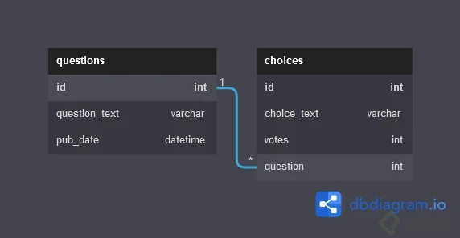
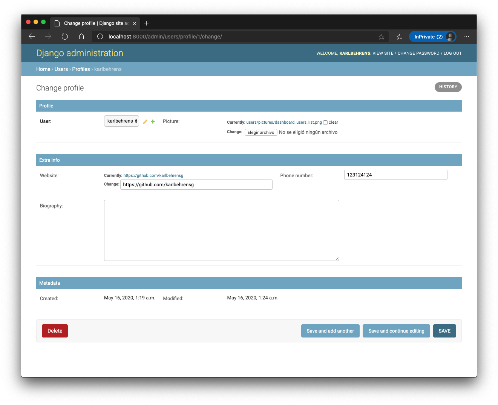
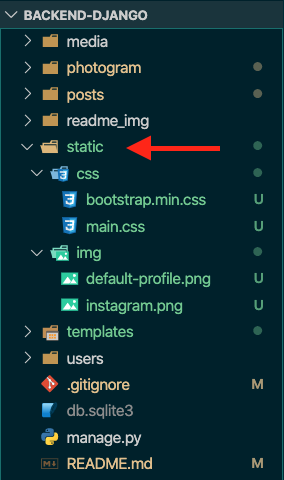
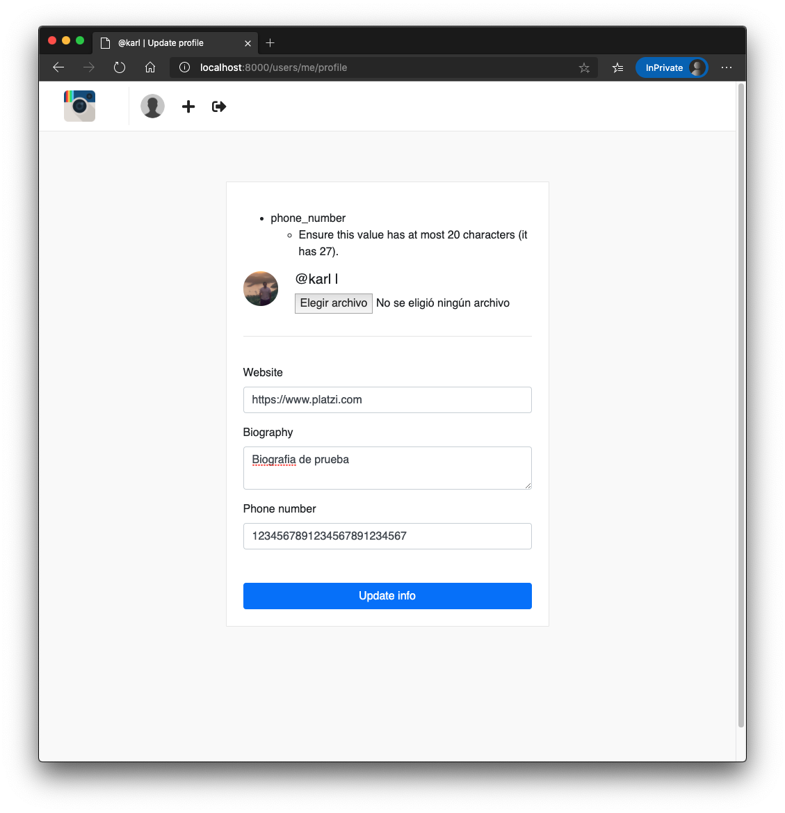

  <h1>Guía para proyectos en Django</h1>

  

# Tabla de contenido
- [Preparando entorno](#Preparando-entorno)
  - [Configuración de entorno de trabajo](#configuración-de-entorno-de-trabajo)
  - [Creacion de entorno virtual con Python](#Creacion-de-entorno-virtual-con-Python)
  - [Comandos del entorno](#Comandos-del-entorno)
  - [Instalación de Django](#Instalación-de-Django)
  - [Django Admin](#Django-Admin)
  - [Creación de proyecto](#Creación-de-proyecto)
  - [Exploración de los archivos](#Exploración-de-los-archivos)
    - [settings.py](#Archivo-settings.py)
    - [manage.py](#Archivo-manage.py)
  - [Levantar servicio](#Levantar-servicio)
- [Vistas](#Vistas)
  - [Crear la primera vista](#Crear-la-primera-vista)
  - [Como Django procesa un request](#Como-Django-procesa-un-request)
  - [Separando las vistas](#Separando-las-vistas)
  - [El objeto Request](#El-objeto-Request)
  - [Pasando argumentos por URL](#Pasando-argumentos-por-URL)
  - [Crear una app](#Crear-una-app)
  - [Template system](#Template-system)
  - [Pasando datos a nuestro template](#Pasando-datos-a-nuestro-template)
- [Modelos](#Modelos)
  - [Dashboard de Administración](#Dashboard-de-Administración)
  - [Implementación de modelos](#Implementación-de-modelos)
  - [Implementar modelos en base de datos](#Implementar-modelos-en-base-de-datos)
  - [Reflejar modelos en dashboard de administración](#Reflejar-modelos-en-dashboard-de-administración)
  - [Dashboard administrativo personalizado](#Dashboard-administrativo-personalizado)
  - [Personalizando detalle de registro de modelo](#Personalizando-detalle-de-registro-de-modelo)
  - [Personalizando Dashboards Nativos](#Personalizando-Dashboards-Nativos)
  - [Relacionando modelos](#Relacionando-modelos)
  - [Hacer funcionar los links](#Hacer-funcionar-los-links)
- [Templates, auth y middlewares](#Templates,-auth-y-middlewares)
  - [Archivos estáticos](##Archivos-estáticos)
  - [Templates](#Templates)
  - [Login y protegiendo vistas](#Login-y-protegiendo-vistas)
  - [Logout](#Logout)
  - [Signup](#Signup)
  - [Middlewares](#Middlewares)
- [Forms](#Forms)
  - [Formularios en Django](#Formularios-en-Django)
  - [Mostrando el form en el template](#Mostrando-el-form-en-el-template)
  - [Models forms y validación](#Models-forms-y-validación)

## ¿Qué es Django?

* Django es uno de los framework gratis y open source más populares para crear aplicaciones web. 

* Es muy veloz, seguro y escalable.
Es el segundo framework de desarrollo web más usado, siendo Flask el más usado solo por un 1% y el tercero siendo FastAPI.

* Algunos proyectos que usan Django son:

  * Instagram
  * Pinterest
  * National Geographic
  * Platzi

## Instalación de Django

### Configuración de entorno de trabajo
Primero debemos tener instalado Python. Luego de la instalacion abrimos la terminal y nos posicionamos en la ruta que deseamos establecer nuestro proyecto.

### Creacion de entorno virtual con Python
* Vamos a crear un entorno virtual para nuestro proyecto, el cual contendra todas las dependencias. Es muy importante que este entorno este fuera de nuestro proyecto. Para crearlo ejecutamos:

  ~~~
  python -m venv .env
  ~~~

  Nota: .env sera el nombre de nuestro entorno.

### Comandos del entorno

* Para **activar** nuestro entorno ejecutamos

  ~~~
  source .env/bin/activate
  ~~~

* Y para **desactivarlo**

  ~~~
  deactivate
  ~~~

* Si queremos **listar las librerias instaladas** usamos

  ~~~
  pip freeze
  ~~~

## Instalación de Django
Para **instalar** la ultima version de Django ejecutamos

~~~shell
pip install django -U
~~~

### Django Admin
* Es una interfaz instalada junto con Django que contiene subcomandos que utiles. Para listar los subcomandos utilizamos

  ~~~
  django-admin
  ~~~

### Creación de proyecto
* Para **crear** un proyecto ejecutamos

  ~~~
  django-admin startproject name
  ~~~

## Exploración de los archivos
Lo primero que veremos es un folder con el nombre de nuestro proyecto, el cual contiene los archivos:

- **\_\_init_\_.py:** la unica finalidad de este archivo es declarar nuestra carpeta como un modulo de python.
- **settings.py:** es el mas importante, define todas las configuraciones de nuestro proyecto.
- **urls.py:** es el archivo de punto de entrada para todas las peticiones a nuestro proyecto.
- **wsgi.py:** es usado para el deployment a produccion y es la interfaz WSGI cuando el servidor corre en producción.
- **manage.py:** es un archivo que no tocamos, pero interactuamos con el durante todo el desarrollo.

### Archivo settings.py
Dentro del archivo setting podemos encontrar variables relevantes para nuestro proyecto, las cuales son:
- **BASE_DIR:** Declara el lugar donde esta corriendo el proyecto. Se considera la linea mas importante.
- **SECRET_KEY:** Es utilizado para el hashing de las contraseñas y las sesiones que se almacenan en las bases de datos.
- **DEBUG:** Determina si nuestro proyecto se encuentra en desarrollo.
- **ALLOWED_HOSTS:** Lista los host que estan permitidos para interactuar con nuestro proyecto.
- **INSTALLED_APPS:** Lista las aplicaciónes instaladas y ligadas a nuestro proyecto.
- **MIDDLEWARE:** Lista los middleware instalados y ligados a nuestro proyecto.
- **ROOT_URLCONF:** Define el archivo principal de urls.
- **TEMPLATES:** Los templates de nuestras aplicaciónes.
- **WSGI_APPLICATION:** Archivo de entrada de nuestro WSGI.
- **DATABASES:** Almacena las configuraciones de las bases de datos.
- **AUTH_PASSWORD_VALIDATORS:** Los validadores de contraseñas.
- **LANGUAGE_CODE:** El idioma en el que se interactua con nuestra aplicación.
- **TIME_ZONE:** Zona horaria en el cual corre nuestra aplicación.
- **STATIC_URL:** En lugar de resolver la url establecidas en el archivo de urls, va a buscar resolver el archivo estático con la url estalecida en esta variable.

## El servidor de desarrollo
### Archivo manage.py
* Este archivo contiene un gran listado de subcomandos los cuales podemos listar con:

  ~~~
  python manage.py
  ~~~

### Levantar servicio
* Para levantar el servicio ejecutamos:

  ~~~
  python manage.py runserver
  ~~~

## Nuestro primer proyecto: Premios Platzi App

* para crear la carpeta polls y la base de datos

  ~~~
  python manage.py startapp polls
  ~~~

### Crear la primera vista

* Para este ejercicio lo haremos simple. En el archivo **urls.py** importamos **django.http.HttpResponse** y definimos una **funcion** que devuelva una respuesta (en este caso hello_world), y establemos en que path estara esta despuesta:

  ~~~py
  from django.contrib import admin
  from django.urls import path
  from django.http import HttpResponse

  def hello_world(request):
    return HttpResponse('Hello, world!')

  urlpatterns = [
    path('hello-world/', hello_world)
  ]
  ~~~

* en la carpeta views.py de la carpeta polls se tendra el siguiente codigo:

  ~~~python
  from django.shortcuts import render
  from django.http import HttpResponse
  # Create your views here.

  def index(request):
      return HttpResponse("Hello, world. You're at the polls index.")
  ~~~

* creamos el archivo urls.py en la carpeta polls y agregamos el siguiente codigo:

  ~~~python
  from django.shortcuts import render
  from django.http import HttpResponse
  # Create your views here.

  def index(request):
      return HttpResponse("Hello, world. You're at the polls index.")
  ~~~

* Corremos nuestro servidor con

  ~~~
  python manage.py runserver
  ~~~

* Luego accedemos al [**http://localhost:8000/hello-world**](http://localhost:8000/hello-world) donde podremos acceder a nuestra vista:

  

## ¿Qué es ORM? ¿Qué es un modelo?

### ORM - Object Relational Mapping
Es la forma de replicar la estructura de una base de datos relacional con programación orientada a objetos.

~~~shell
Utilizando un ORM podemos operar sobre la base de datos aprovechando las características propias de la orientación a objetos, como herencia y polimorfismo.
~~~

Las bases de datos se conforman por tablas y cada tablas obtiene los datos relacionados a cada entidad, es posible convertir estas bases de datos en un archivo python que contiene la representación en programación orientada a objetos.

Las tablas corresponden a modelos (los cuales se expresan como clases), las columans van a corresponder a atributos de esas clases y los tipos de datos de cada columna correponderán a clases ligadas a los atributos de los objetos.

### Ventajas
* Facilidad y velocidad de uso
* Abstracción de la base de datos
* Seguridad de la capa de acceso a datos contra ataques.
* Reutilización. Nos permite utilizar los métodos de un objeto de datos desde distintas zonas de la aplicación, incluso desde aplicaciones distintas.
* Mantenimiento del código.

## Creando un diagrama entidad-relación para nuestro proyecto

## Creando los modelos Question y Choice

1. en el archivo model.py de polls se creara los modelos de las tablas:

~~~python
from django.db import models

class Question(models.Model):
    id = models.AutoField(primary_key=True)
    question_text = models.CharField(max_length=200)
    pub_date = models.DateTimeField('date published')

class Choice(models.Model):
    id = models.AutoField(primary_key=True)
    question = models.ForeignKey(Question, on_delete=models.CASCADE)
    choice_text = models.CharField(max_length=200)
    votes = models.IntegerField(default=0)
~~~

2. ejecutar en el root del proyecto:
* Crea un archivo “migration/001_initial-py” en el que django automaticamente describe toda la creación de las tablas en las BD, uso del concepto ORM

en linux:
> py manage-py makemigrations polls 

en windows:
> python manage-py makemigrations polls 

* Tomar el archivo creado y ejecutarlo en la BD. “Applying polls.001_initial”

en linux:
> py manage-py migrate 

en windows:
> python manage-py makemigrations polls 
  

## La consola interactiva de Django

Comando para acceder a la consola interactiva de Django: 
> python3 manage.py shell

~~~python    
# Importacion de los modelos
from polls.models import Question, Choice
from django.utils import timezone

# Llamado de todos los registros de un modelo
Question.objects.all()

# Creacion de un nuevo registro
q = Question(question_text="¿Cual es el mejor curso de Platzi?", pub_date=timezone.now())

# Guardado del nuevo registro
q.save()
~~~

otra forma de crear y guardar un objeto

~~~python
q  = Question.objects.create(question_text="¿Cuál es el mejor curso de platzi?" , pub_date=timezone.now())
~~~

## El método __str__

este metodo __str__ se ejecuta cuando se realiza print a un objeto creado.

* En el archivo *models..py*:

  ~~~py
  from django.db import models
  from django.utils import timezone

  class Question(models.Model):

      # id - Django lo hace automáticamente
      question_text = models.CharField(max_length=200)
      pub_date = models.DateTimeField("date published")

      def __str__(self):
          return self.question_text
      
      def was_published_recently(self):
          return self.pub_date >= timezone.now() - datetime.timedelta(days=1)

  class Choice(models.Model):

      question = models.ForeignKey(Question, on_delete=models.CASCADE)
      choice_text = models.CharField(max_length=200)
      votes = models.IntegerField(default=0)

      def __str__(self):
          return self.choice_text
  ~~~

* luego ejecutamos 
~~~python
from polls.models import Choice, Question

Question.objects.all()

# Out[1]: <QuerySet [<Question: Cual es le mejor curso de platzi?>, <Question: ¿Cuál es el mejor curso de udemy?>]>

~~~

## Filtrando los objetos creados desde la consola interactiva

* Para traer un objeto en específicos de las clases ORM podemos usar:

  (el comando get sólo devuelve un valor)
  ~~~python
  Question.object.get(pk=1)
  ~~~

## El método filter

* Para obtener múltiples respuestas podemos usar 
~~~python
Question.objects.filter(question_text__startswith="¿Cual")
~~~

* este método devuelve un QuerySet
Otro ejemplo: 
~~~python
Question.objects.filter(pub_date__year=timezone.now().year)`
~~~

## Accediendo al conjunto de respuestas

1. creamos una instancia de Question con la llave primaria = 1

~~~python
from polls.models import Choice, Question
from django.utils import timezone

question = Question.objects.get(pk=1)
~~~

2. para acceder a todos las opciones dentro un question
~~~python
question.choice_set.all()
~~~

3. crear opciones dentro de una pregunta

~~~python
q.choice_set.create(choice_text="curso Basico de Python?", votes=0)
#Out[21]: <Choice: curso Basico de Python?>

q.choice_set.create(choice_text="curso de ingenieria de software?", votes=0)

#Out[22]: <Choice: curso de ingenieria de software?>

q.choice_set.create(choice_text="curso de goland?", votes=0)

#Out[23]: <Choice: curso de goland?>
~~~

4. ver todas las opciones:

~~~python
q.choice_set.all()

Out[24]: <QuerySet [<Choice: curso Basico de Python?>, <Choice: curso de ingenieria de software?>, <Choice: curso de goland?>]>
~~~

5. contar las opciones

~~~python
q.choice_set.count()
~~~

6. filtrar las opciones dentro de una pregunta

~~~python
Choice.objects.filter(question__pub_date__year=timezone.now().year)
~~~

## Administrador de datos

1. para comenzar a usar el administrador se debe crear un usuario y contraseña, para crearlo se usa el siguiente codigo:

~~~shell
python manage.py createsuperuser
~~~

Se debe tener mucho cuidado con la seguridad de estos datos, ya que si son expuestos pueden comprometer la aplicación completa.

Ahora, se deben hacer disponibles los modelos creados al administrador:

2. *En el archivo *admin.py* de la carpeta polls:*
~~~py
from django.contrib import admin
from polls.models import Choice, Question

admin.site.register([Question, Choice])
~~~

3. ejecutar el siguiente codigo para ejecuta application django:

~~~shell
python .\manage.py runserver
~~~

4. Usando la dirección http://127.0.0.1:8000/admin/ Se puede entrar al panel de administración.

# Views
## ¿Qué son las views o vistas?

### Diferencia entre MVC y MTV 😮
* Muy similar a MVC (Modelo, vista, controlador) donde:

  * Modelo - Hace referencia a todo lo que tiene que ver con bases de datos.

  * Vista - Con la parte visual.

  * Controlador - Con toda la parte lógica.

* En Django siendo MTV 😃

  * Modelo - Hace referencia a todo lo que tiene que ver con bases de datos (En este caso Django hace demasiada alusión a su nombre donde las bases de datos quedan implícitas y manejamos todo con el ORM)

  * Template - En este caso no debemos confundir el View del MTV con el del MVC puesto en que en Django no hace referencia a lo visual, template si hace alusión con la parte visual de las Web Apps con Django.

  * View - Todo lo relacionado con la lógica es aquí donde entra el tema de las vistas genéricas y demás (Que si solo nos especializamos en el back con Django es lo que mas utilizaremos)

~~~shell
MTV => MVC:

Views + Urls => Controller
Templates => View
Models => Model
~~~

### Crear vistas

* en el archivo `views.py` de mi aplicacion yo puedo crear distintas vistas como se ven a continuación:

  ~~~python
  from django.shortcuts import render
  from django.http import HttpResponse

  def index(request):
      return HttpResponse("Estas en la pagina principal de la aplicacion")

  def detail(request, question_id):
      return HttpResponse(f"Estas viendo la pregunta numero {question_id}.")

  def results(request, question_id):
      return HttpResponse(f"Estas viendo el resultado de la pregunta numero {question_id}.")

  def vote(request, question_id):
      return HttpResponse(f"Estas votando a la pregunta número {question_id}.")
  ~~~

* Luego estas vistas son ligadas a una url, esto se programa en el archivo `urls.py`:

  ~~~python
  from django.urls import path
  from . import views

  urlpatterns = [
      # ex: /polls/
      path('', views.index, name='index'),
      # ex: /polls/5/
      path('<int:question_id>/', views.detail, name='index'),
      # ex: /polls/5/results
      path('<int:question_id>/results/', views.results, name='index'),
      # ex: /polls/5/vote
      path('<int:question_id>/vote/', views.vote, name='index')
  ]

  ~~~

Como las urls están configuradas desde una aplicación, siempre van a tener el nombre de la aplicación antes de cualquier url.
Nótese como "<>" se usa para enviar parámetros a las vistas, esto permite tener múltiples urls con respuestas únicas.

## Crear Templates

1. Ubicados en la carpeta de la aplicación ejecutamos en consola:

  ~~~shell
  mkdir -p templates/polls
  ~~~

2. Ahora creamos un archivo html para comenzar a crear la página.
  ~~~shell
  touch templates/polls/index.html
  ~~~

3. Ahora, la forma en la que se ha programado el archivo:
* (Permite recorrer todas las preguntas y linkear cada una de ellas a una url distinta)

  ~~~html
  
      <ul>
          
              <li><a href="">{{ question.question_text }}</a></li>
          
      </ul>
  
      
No polls are available.

  
  ~~~

4. en view.py de polls se tendra lo siguiente:

* Cada vez que una url llame a la vista index, esta llamará al template `index.html` y le enviará el argumento `latest_question_list`

  ~~~py
  from .models import Question

  def index(request):
      latest_question_list = Question.objects.all()
      return render(request, "polls/index.html", {
          "latest_question_list": latest_question_list
      })
  ~~~

5. Ahora, se crea un template para cada vez que se quiera ver el detalle de una pregunta en el archivo `templates/polls/detail.html`

  ~~~html
  <h1>{{question.question_text}}</h1>
  <ul>
      
          <li>{{ choice.choice_text }}</li>
      
  </ul>
  ~~~

6. De igual forma se tiene que configurar la llamada del template en las vistas:
* La funcion `get_object_or_404` es usada para devolver un error 404 si no se encuentra el objeto

  ~~~py
  def detail(request, question_id):
      question = get_object_or_404(Question, pk=question_id)
      return render(request, "polls/detail.html",{
          "question": question
      } )
  ~~~

7. Para evitar el hard-code en nuestro programa vamos a usar la etiqueta `url` en el archivo `index.html`

>> Hard-code: Término del mundo de la informática que hace referencia a una práctica en el desarrollo de software que consiste en incrustar datos directamente en el código fuente del programa.

  ~~~html
  
      <ul>
          
              <li><a href="">{{ question.question_text }}</a></li>
          
      </ul>
  
      
No polls are available.

  
  ~~~

8. Para que la url.py funcione de forma adecuada debemos asignar el nombre de nuestra aplicación en la variable 

~~~python
app_name = "polls"
~~~

De esta forma se puede con libertad cambiar las urls sin afectar los templates o archivos asociados.

## Formularios

1. En el template detail.html se tendra el siguiente codigo:
  * ``: Esta etiqueta agrega un token de seguridad para evitar ataques de hacking a formularios

~~~html
<form action="" method='post'>
    
    
    
    <fieldset>
        <legend><h1>{{ question.question_text}}</h1></legend>
        
            
<strong>{{ error_message }}</strong>

        
        
        
            <input 
                type="radio"
                name="choice"
                id="choice{{ forloop.counter }}"
                value="{{ choice.id }}"
            >
            <label for="choice{{ forloop.counter }}">{{ choice.choice_text }}</label>
             
        
    </fieldset>
    <input type="submit" value="Votar">

</form>
~~~
El formulario de linkea a la vista vote cuando se presiona el botón votar

## Vista vote

Por el momento la interfaz está lista pero internamente no se están contando los votos. Este es el siguiente paso.

Se programa entonces la lógica de programación en el archivo `views.py`:

~~~py
def vote(request, question_id):
    question= get_object_or_404(Question, pk=question_id)
    try:
        selected_choice = question.choice_set.get(pk=request.POST["choice"])
    except (KeyError, Choice.DoesNotExist):
        return render(request, "polls/detail.html", {
            "question": question,
            "error_message": "No elegiste una respuesta"
        })
    else:
        selected_choice.votes += 1
        selected_choice.save()
        return HttpResponseRedirect(reverse("polls:results", 
            args=(question.id, )))
~~~
En este casos se usa un try para saber si se ha seleccionado una opción o si la opción seleccionada es válida, la forma de controlar este error es volver a redirigir la página llamando a `detail.html` pero esta vez con un mensaje de error.

Siempre que se trabaje con formularios es una buena práctica redirigir al usuario con la función `HttpResponseRedirect` en lugar del clásico `HttpResponse`, así nos aseguramos que el usuario no envíe la información dos veces.

la función en python `reverse("", args=() )` tiene su equivalente en django: ``

## Creando la vista results

Hasta ahora tenemos la interfaz de voto y el conteo de votos programado, ahora vamos a programar la vista resultados para ver la cantidad de votos por opción cuando votamos, para esto hacemos cambios en los archivos `views.py` y `results.html`, este último lo vamos a crear, recordemos que todo lo trabajamos dentro de la carpeta de la aplicación.
**En el archivo `views.py`**
~~~py
def results(request, question_id):
    # siempre se llega después de ejecutar vote
    question= get_object_or_404(Question, pk=question_id)
    return render(request, "polls/results.html", {
        "question": question
    })
~~~
Recordemos que al llamar los templates debemos enviar los argumentos si son necesarios, en este caso "question"

**En el archivo `results.html`**
~~~html
<h1>{{ question.question_text }}</h1>
<ul>
    
        <li>
            {{ choice.choice_text }} -- {{ choice.votes }}
            vote{{ choice.votes|pluralize  }}
        </li>
    
</ul>
<a href="">
    ¿Te gustaría votar de nuevo?
</a>
~~~

El indentado de la programación cambia un poco, considero que así se ve más organizado

## Generic Views

>DRY: Don´t Repeat Yourself

Hasta ahora hemos programado Class Based Views, lo que podemos observar en el archivo `views.py` es que por ejemplo las funciones results y detail son exactamente iguales, por lo que estaríamos incumpliendo el principio DRY.

Las generic views nos permiten evitar caer en este error, estas funcionan por clases y existen multiples que se adaptan a distintos casos, actualización, login, formularios, etc. (info completa en los links de referencia)

* Function Base View: vistas basada en funciones
* Classed Base View: Vistas basada en classes

Example: vamos a cambiar las vistas que tenemos definidas por funciones a generic views:
**En el archivo `views.py`**
~~~py
# generic views
from django.views import generic

class IndexView(generic.ListView):
    template_name = "polls/index.html"
    context_object_name = "latest_question_list"

    def get_queryset(self):
        return Question.objects.order_by("-pub_date")[:5]

class DetailView(generic.DetailView):
    model = Question
    template_name = "polls/detail.html"

class ResultView(generic.DetailView):
    model = Question
    template_name = "polls/results.html"
~~~
la función `vote` no se cambia por una clase porque es muy compleja.
Las clase de las vistas genéraicas deben siempre cumplir con estas reglas en su nombre: Empezar en mayúscula porque son una clase y terminar en `View`, esto es una buena práctica

Se le debe hacer saber al archivo `urls.py` que debe reconocer clases en vez de funciones:
~~~py
    # ex: /polls/
    path("", views.IndexView.as_view(), name="index"),
    # ex: /polls/5/
    path("<int:pk>/", views.DetailView.as_view(), name="detail"),
    path("<int:pk>/results/", views.ResultView.as_view(), name="results"),
~~~

# Helpful tips

## Crear un entorno virtual

~~~zsh
python3 -m venv venv
source ./venv/bin/activate
~~~

## Crear carpetas anidadas

~~~zsh
mkdir -p CarpetaGeneral/{carpeta1,carpeta2/{subdirectorio1,subdirectorio2},carpeta3,carpeta4}
~~~

## Tener sugerencias de autocompletado html en archivos ligados a Django
(Para vsCode) 

Instala la extensión Django en tu editor.
Presiona F1 y escribe "settings.json", selecciona la opción open user settings. Al archivo Json debes agregar estas líneas.
~~~py
"emmet.includeLanguages": {
        "django-html": "html"
    }
~~~
Puedes reiniciar la extensión si no te sale aún el autocompletado.

# Helpful Links

- [.gitignore](https://www.toptal.com/developers/gitignore)

- [Basic writing and formatting syntax](https://docs.github.com/es/get-started/writing-on-github/getting-started-with-writing-and-formatting-on-github/basic-writing-and-formatting-syntax)

- [Django documentation](https://docs.djangoproject.com/en/3.2/)

- [Writing your first Django app, part 1](https://docs.djangoproject.com/en/3.2/intro/tutorial01/)

- [List of tz database time zones](https://en.wikipedia.org/wiki/List_of_tz_database_time_zones)

- [Making queries | Django documentation](https://docs.djangoproject.com/en/3.2/topics/db/queries/#field-lookups-intro)

- [Classy Class-Based Views. | Django](https://ccbv.co.uk/)

### Como Django procesa un request
1. Primero va a buscar en el archivo **settings.py** en la variable **ROOT_URLCONF**
2. Luego Django desde el archivo **urls.py** carga los modulos de Python definidos en la variable **urlpatterns**
3. Dentro de **urlpatterns** se busca el patron coincidente a la peticion
4. Una vez encontrado la URL que coincide, Django importa y llama la vista en una funcion simple en Python. Se le pasa como argumento:
    - Una instancia del HttpRequest
    - Si la URL pasa mas argumentos entonces los entregara
    - Si definimos argumentos adicionales tambien lo enviara
5. Si ninguna URL coincide, Django enviara una excepción

## Separando las vistas
Es buena practica tener las vistas separadas del archivo url.py, por lo que crearemos un archivo **views.py** dentro de nuestra aplicación que contendra las vistas:

  

Dentro de nuestro archivo **views.py** importamos **HttpResponse** y traemos nuestra funcion **hello_world()** creado en urls.py

~~~py
from django.http import HttpResponse

def hello_world(request):
    return HttpResponse('Hello, world!')
~~~

Ahora debemos importar nuestra funcion al archivo **urls.py**.
No olvidemos **borrar** la importacion de HttpResponse y la funcion hello_world() en el archivo.

~~~py
from django.contrib import admin
from django.urls import path
from photogram import views

urlpatterns = [
    path('hello-world/', views.hello_world)
]
~~~

Si revisamos la url [**http://localhost:8000/hello-world**](http://localhost:8000/hello-world) nuestro proyecto seguira funcionando.

## El objeto Request
A traves del objeto request podemos acceder a varios atributos  los cuales se encuentran detallados en la [documentación](https://docs.djangoproject.com/en/3.0/ref/request-response/) de Django. Algunos atributos utiles son:

- **request.method:** nos muestra el metodo HTTP ("GET", "POST", etc.) usado por el request en formato de string en UPPERCASE. Un ejemplo de uso seria:

  ~~~py
  if request.method == 'GET':
    do_something()
  elif request.method == 'POST':
    do_something_else()
  ~~~

- **request.GET:** Un diccionario que contiene todos los parametros entregados por HTTP GET. Por ejemplo:

  Pasamos una lista de numeros en la variable numbers **(?numbers)**

  ~~~http
  http://localhost:8000/numbers/?numbers=10,2,6,7
  ~~~

  Para acceder a la lista usamos 

  ~~~py
  request.GET['numbers']
  ~~~

  *Nota: En el siguiente ejemplo se creo la vista numbers*
  
  Un ejemplo practico seria:

  ~~~py
  def numbers(request):
    numbers = request.GET['numbers']
    return HttpResponse(str(numbers))
  ~~~

  De esta forma podemos ver los valores de number a traves de nuetra vista.

  

    
  

## Pasando argumentos por URL
Podemos pasar argumentos a traves de la URL, para esto primero creamos la funcion que hara uso de estos parametros y devolvera la vista en el archivo **views.py**
~~~py
from django.http import HttpResponse

def say_hi(request, name, age):
  if age < 12:
    message = 'Sorry {}, you are not allowed here'.format(name)
  else:
    message = 'Hello {}! Welcome to Photogram'.format(name)
    
  return HttpResponse(message)
~~~

Luego definimos el path para esta vista en el archivo **urls.py**. Para definir los parametros que pasaran por la url los encerramos con "<>" definiendo el tipo de dato y el nombre del parametro.

~~~py
from django.contrib import admin
from django.urls import path
from photogram import views

urlpatterns = [
  path('hi/<str:name>/<int:age>/', views.say_hi)
]
~~~

En el resultado final si ingresamos **age = 26** y **name = Karl** obtenemos el resultado definido en nuestra funcion **say_hi()**:

    

Pero si cambiamos **age = 10** obtenemos:

    

## Crear una app
Con Django podemos crear una app de forma rapida y sencilla ejecutando el comando

~~~
python manage.py startapp name
~~~

En este ejemplo creamos un app llamada **posts**, el cual genero una carpeta con todos los archivos basicos necesarios

    

Para desplegar una vista de esta aplicacion vamos al archivo *./posts/views.py* donde crearemos una vista a traves de la funcion **list_posts()**

~~~py
from django.shortcuts import render
from django.http import HttpResponse

def list_posts(request):
  posts = [1, 2, 3, 4]
  return HttpResponse(str(posts))
~~~

Luego vamos al archivo settings de nuestro proyecto, en este caso *./photogram/settings.py* donde incorporaremos en la variable **INSTALLED_APPS** nuestra nueva app

~~~py
INSTALLED_APPS = [
    # Django apps
    'django.contrib.admin',
    'django.contrib.auth',
    'django.contrib.contenttypes',
    'django.contrib.sessions',
    'django.contrib.messages',
    'django.contrib.staticfiles',

    # Local apps
    'posts',
]
~~~

Ahora nos toca asignar un path para nuestra vista **list_posts()**. Para eso vamos al archivo **urls.py** de nuestro proyecto, en este caso *./photogram/urls.py* e importamos nuestra nueva app, y le asignamos un path a nuestra vista.

Para que no existan conflictos al llamar views vamos asignar un **alias** para las views de cada aplicacion.

~~~py
from django.contrib import admin
from django.urls import path
from photogram import views as local_views

# Importamos las vistas de nuestra aplicacion posts
from posts import views as posts_views

urlpatterns = [
    
    path('hello-world/', local_views.hello_world),
    path('numbers/', local_views.numbers),
    path('hi/<str:name>/<int:age>/', local_views.say_hi),

    # Asignamos el path para nuestra vista list_posts
    path('posts/', posts_views.list_posts),

]
~~~

Ahora vamos a [**http://localhost:8000/posts/**](http://localhost:8000/posts/) para ver nuestro resultado

    

## Template system

El template system es una manera de mostrar los datos usando HTML, incluye lógica de programacion lo cual nos facilita un poco el crear nuestros templates.

Para crear nuestros templates lo que haremos es dentro de nuestra aplicacion **crear una carpeta templates** y un **archivo html** con el nombre de nuestro template, en este caso _feed.html_

    

Dentro de nuestro archivo **feed.html** solo escribiremos:

~~~html
Hola, mundo!
~~~

Y dentro de **views.py** de nuestra aplicación ya no es necesario el HttpResponse, por que borramos su importación. A través de la función que devolvemos nuestra vista devolveremos nuestro nuevo template con el metodo **render**, que le pasaremos la request y la vista:

~~~py
from django.shortcuts import render

def list_posts(request):
    return render(request, 'feed.html')
~~~

Si revisamos el path [**http://localhost:8000/posts/**](http://localhost:8000/posts/) tendremos nuestro "Hola, mundo!"

    

¿Como logro funcionar si dentro de render jamas definimos la ruta donde buscar nuestro template? (en nuetro caso solo _feed.html_). Si revisamos en el archivo **settings.py** de nuestro proyecto, en la definicion de **TEMPLATES** veremos

~~~py

...

TEMPLATES = [
    {
        'BACKEND': 'django.template.backends.django.DjangoTemplates',
        'DIRS': [],
        'APP_DIRS': True,
        'OPTIONS': {
            'context_processors': [
                'django.template.context_processors.debug',
                'django.template.context_processors.request',
                'django.contrib.auth.context_processors.auth',
                'django.contrib.messages.context_processors.messages',
            ],
        },
    },
]

...

~~~

En **APP_DIRS** lo tenemos definido como **True**, esto significa que las aplicaciones buscaran los templates dentro de sus directorios, de esta forma funciona sin tener que nombrar la dirección de nuestro template.

## Pasando datos a nuestro template

Primero crearemos un diccionario de datos dentro de nuestra vista (solo a modo de ejemplo) y enviaremos al template estos datos a traves del render. En nuestro caso este diccionario sera posts

~~~py
# Django
from django.shortcuts import render

# Utilities
from datetime import datetime

posts = [
    {
        'title': 'Mont Blanc',
        'user': {
            'name': 'Yésica Cortés',
            'picture': 'https://picsum.photos/60/60/?image=1027'
        },
        'timestamp': datetime.now().strftime('%b %dth, %Y - %H:%M hrs'),
        'photo': 'https://picsum.photos/800/600?image=1036',
    },
    {
        'title': 'Via Láctea',
        'user': {
            'name': 'Christian Van der Henst',
            'picture': 'https://picsum.photos/60/60/?image=1005'
        },
        'timestamp': datetime.now().strftime('%b %dth, %Y - %H:%M hrs'),
        'photo': 'https://picsum.photos/800/800/?image=903',
    },
    {
        'title': 'Nuevo auditorio',
        'user': {
            'name': 'Uriel (thespianartist)',
            'picture': 'https://picsum.photos/60/60/?image=883'
        },
        'timestamp': datetime.now().strftime('%b %dth, %Y - %H:%M hrs'),
        'photo': 'https://picsum.photos/500/700/?image=1076',
    }
]

def list_posts(request):
    """List existing posts."""
    return render(request, 'feed.html', {'posts': posts})
~~~

Si logran observar enviamos los datos a traves de **{'posts': posts}**, el cual el **primer parametro sera el nombre de la variable** al momento de enviar al template, y el **segundo es el valor asignado**.

En nuestro template _feed.html_ ahora imprimiremos nuestro diccionario escribiendo el **nombre de la variable**.

~~~html
{{ posts }}
~~~

Si revisamos [**http://localhost:8000/posts/**](http://localhost:8000/posts/) veremos nuestro diccionario.

    

Ahora juguemos un poco con la **lógica de programación** y **html**. Vamos a imprimir solo los títulos. Para eso en nuestro **template** _feed.html_ escribiremos:

~~~html

  
{{ post.title }}


~~~

Y el resultado en [**http://localhost:8000/posts/**](http://localhost:8000/posts/)

    

Para ver toda la **lógica de programación** que podemos crear en el template system te recomiendo ir a la [documentación de Django.](https://docs.djangoproject.com/en/3.0/ref/templates/builtins/)

Ahora despleguemos los datos de nuestro diccionario y estilemos con **Bootstrap** nuestro template _feed.html_.

~~~html
<!DOCTYPE html>
<html lang="en">
<head>
  <meta charset="UTF-8">
  <title>Platzigram</title>
  <link rel="stylesheet" href="https://stackpath.bootstrapcdn.com/bootstrap/4.1.1/css/bootstrap.min.css" integrity="sha384-WskhaSGFgHYWDcbwN70/dfYBj47jz9qbsMId/iRN3ewGhXQFZCSftd1LZCfmhktB" crossorigin="anonymous">
</head>
<body>
    
  

    

      
      

        

          
          

            <h5 class="mt-0">{{ post.user.name }}</h5>
            {{ post.timestamp }}
          

        

        
        <h6 class="ml-1 mt-1">{{ post.title }}</h6>
      

      
    

    

</body>
</html>

~~~

Y en [**http://localhost:8000/posts/**](http://localhost:8000/posts/) veremos
:

    

## Creacion de Super Usuario

Para crear un **super usuario** en Django es bastante facil. En la consola escribimos

~~~
python3 manage.py createsuperuser
~~~

Nos preguntara un **username, email (opcional), y contrañesa**, con esto ya tendriamos nuestro super usuario.

# Modelos

## Dashboard de Administración

Django cuenta con un dashboard de administración. Para acceder a el debemos darle un path dentro del archivo **urls.py** de nuestro proyecto. Para esto importamos **django.contrib.admin** y le asignamos la dirección que deseamos

~~~py
from django.contrib import admin
from django.urls import path

urlpatterns = [
  path('admin/', admin.site.urls),
~~~

En este caso le dimos el path **/admin/** para acceder a el. Entonces vamos a la dirección [**http://localhost:8000/admin/**](http://localhost:8000/admin/) para ingresar.

    

Para ingresar utilizaremos el **super usuario** que creamos en la [**sección de creación de super usuario.**](#creacion-de-super-usuario)

## Implementación de modelos

Con Django podemos crear modelos de clases de nuestra aplicación.

Para estos ejemplos crearemos una nueva aplicacion de usuarios en nuestro proyecto.

~~~
python manage.py startapp users
~~~

En el archivo **models.py** de la nueva aplicación crearemos el modelo de nuestros usuarios, el cual sera una clase _Profile_, y los tipos de valores para la clase _models_ estan definidos en la [documentación.](https://docs.djangoproject.com/en/3.0/ref/models/fields/)

Para poder cargar las referencias de imagenes en neustro modelo instalaremos en nuestro ambiente Pillow, esto nos servira para la siguiente sección.

~~~
pip install pillow
~~~

Ahora creamos el modelo de usuarios.

~~~py
from django.contrib.auth.models import User
from django.db import models

class Profile(models.Model):

  user = models.OneToOneField(User, on_delete=models.CASCADE)

  website = models.URLField(max_length=200, blank=True)
  biography = models.TextField(blank=True)
  phone_number = models.CharField(max_length=20, blank=True)

  picture = models.ImageField(
    upload_to='users/pictures', 
    blank=True, 
    null=True
  )

  created = models.DateTimeField(auto_now_add=True)
  modified = models.DateTimeField(auto_now=True)

  def __str__(self):
    return self.user.username
~~~

## Implementar modelos en base de datos

Los modelos creados en nuestras aplicaciones podemos aplicarlos en el esquema de nuestra base de datos. Primero debemos auditar los cambios en los modelos con:

~~~
python manage.py makemigration
~~~

Ahora aplicaremos los cambios auditados en nuestra base de datos.

~~~
python manage.py migrate
~~~

## Reflejar modelos en dashboard de administración

En primera instancia no podremos ver los _modelos_ que creamos en el dashboard de administración. La clase **ModelAdmin** es la representacion del modelo en la interfaz de administración. Para reflejarlo debemos almacenar el _modelo_ en el archivo **admin.py** de nuestra aplicación.

~~~py
# Django
from django.contrib import admin

# Modelos
from users.models import Profile

# Registramos nuestros modelos aquí.
admin.site.register(Profile)
~~~

De esta forma tendremos la interfaz de administración predeterminada, en nuestro caso incluimos el modelo **Profile**.

  

  

  

## Dashboard administrativo personalizado

Si queremos mostrar nuestra lista de modelos de una forma personalizada, con Django podemos realizarlo. Para esto debemos crear una clase **ModelAdmin**

~~~py
# Django
from django.contrib import admin

# Modelo
from users.models import Profile

# Decoramos la clase con el modelo.
@admin.register(Profile)
class ProfileAdmin(admin.ModelAdmin): #Por convencion la clase que creemos debe terminar en Admin.

  # Con list_display nombramos los campos que queremos visualizar.
  list_display = ('pk', 'user', 'phone_number', 'website', 'picture')

  # list_display_links establece como links los campos nombrados.
  list_display_links = ('pk', 'user')

  # list_editable nos permite editar el campo desde 
  # la lista del modelo en vez de ingresar al detalle del registro.
  list_editable = ('phone_number',)

  # Para crear un buscador hacemos uso de search_fields. 
  # Los campos que se ingresan seran los que el buscador recorrera para realizar las busquedas.
  search_fields = (
    'user__email',
    'user__username', 
    'user__first_name', 
    'user__last_name', 
    'phone_number'
  )

  # Podemos crear un filtro para nuestro dashboard del modelo, 
  # para ello usamos list_filter, y definimos los campos con los que trabajara.
  list_filter = (
    'user__is_active',
    'user__is_staff',
    'created', 
    'modified'
  )
~~~

  

Para mas opciones de personalización siempre puedes revisar la [documentación.](https://docs.djangoproject.com/en/3.0/ref/contrib/admin/#modeladmin-options)

## Personalizando detalle de registro de modelo

Podemos perzonalizar nuestros dashbord del registro. En nuestro caso lo haremos para el modelo de usuarios _Profile_.

~~~py
# Django
from django.contrib import admin

# Models
from users.models import Profile

@admin.register(Profile)
class ProfileAdmin(admin.ModelAdmin):
  list_display = ('pk', 'user', 'phone_number', 'website', 'picture')
  list_display_links = ('pk', 'user',)
  list_editable = ('phone_number', 'website', 'picture')
  search_fields = (
    'user__email',
    'user__username', 
    'user__first_name', 
    'user__last_name', 
    'phone_number'
  )
  list_filter = (
    'user__is_active',
    'user__is_staff',
    'created', 
    'modified'
  )

  # Nos desplagara los datos que deseamos. Es importante que la información este en tuplas.
  fieldsets= (
    ('Profile', { # Nombre de la sección.
      'fields': ( # Los campos que visualizaremos.
        # Cuando ponemos varios campos en la misma posición dentro de 
        # la tupla de field vamos a desplegar los datos en la misma fila.
        ('user', 'picture'), 
      ),
    }),
    ('Extra info', {
      'fields': ( 
        # En este caso la información se desplegara 
        # en 2 filas ya que la tupla de fields tiene 2 posiciones.
        ('website', 'phone_number'),
        ('biography',),
      ),
    }),
    ('Metadata', {
      'fields': (
        # Estos datos no se pueden modificar, 
        # por lo que haremos uso de readonly_fields.
        ('created', 'modified'),
      ),
    }),
  )

  # Aqui declararemos los campos que solo pueden ser leidos pero no modificados.
  readonly_fields = ('created', 'modified',)
~~~

  

En la [documentación](https://docs.djangoproject.com/en/3.0/ref/contrib/admin/#modeladmin-options) tenemos muchas mas formas de personalización.

## Personalizando Dashboards Nativos

Existe la posibilidad de personalizar los dashboard nativos de Django, para ello vamos a trabajar sobre el modelo de **Users** para el cual vamos a visualizar los datos que definamos y tambien al momento de crear un usuario tambien podremos crear dentro del proceso una instancia de nuestro modelo _Profile_

~~~py
# Django
# Importamos UserAdmin
from django.contrib.auth.admin import UserAdmin as BaseUserAdmin
from django.contrib import admin

# Models
# Tambien haremos uso de User
from django.contrib.auth.models import User
from users.models import Profile

@admin.register(Profile)
class ProfileAdmin(admin.ModelAdmin):
  list_display = ('pk', 'user', 'phone_number', 'website', 'picture')
  list_display_links = ('pk', 'user',)
  list_editable = ('phone_number', 'website', 'picture')
  search_fields = (
    'user__email',
    'user__username', 
    'user__first_name', 
    'user__last_name', 
    'phone_number'
  )
  list_filter = (
    'user__is_active',
    'user__is_staff',
    'created', 
    'modified'
  )

  fieldsets= (
    ('Profile', {
      'fields': (
        ('user', 'picture'),
      ),
    }),
    ('Extra info', {
      'fields': (
        ('website', 'phone_number'),
        ('biography',),
      ),
    }),
    ('Metadata', {
      'fields': (
        ('created', 'modified'),
      ),
    }),
  )

  readonly_fields = ('created', 'modified',)

# Aqui definiremos el modelo que deseamos asociar a User, en nuestro caso Profile.
class ProfileInline(admin.StackedInline):
  model = Profile
  can_delete = False
  verbose_name_plural = 'profiles'

# Luego para asociar los modelos e insertarlo en el Dashboard usaremos 
# el UserAdmin de Django el cual le dimos el alias de BaseUserAdmin.
class UserAdmin(BaseUserAdmin):
  inlines = (ProfileInline,) # Con inlines desplegaremos los campos que hay que llenar asociados a Profile.
  list_display = ( # En list_display
    'username',
    'email',
    'first_name',
    'last_name',
    'is_active',
    'is_staff'
  )

admin.site.unregister(User)
admin.site.register(User, UserAdmin)
~~~

Si vamos a crear un nuevo **User** podremos encontrar los campos asociados a nuestro modelo _Profile_ que definimos en la variable _inlines_

  

Y si revisamos la lista de registro **User** veremos los cambios realizados en la variable _list_display_.

  

En la [documentación](https://docs.djangoproject.com/en/3.0/ref/contrib/admin/#modeladmin-options) tenemos muchas mas formas de personalización.

## Relacionando modelos

¿Que pasa si en nuestro proyecto un modelo depende de otro? Un ejemplo de esto puede ser un **_post_** que solo es posible que exista si esta relacionado con un **_usuario_**. Afortunadamente en Django podemos relacionar los modelos, en nuestro caso lo haremos con el modelo de **posts**, por lo iremos al archivo _posts/models.py_.

~~~py
# Django
from django.db import models
from django.contrib.auth.models import User

class Post(models.Model):

  user = models.ForeignKey(User, on_delete=models.CASCADE)
  # Con ForeignKey podemos relacionar el modelo de posts con profile, 
  # y para hacer referencia a la clase relacionada lo hacemos con 
  # el formato de 'aplicacion.NombreClaseDelModelo'.
  profile = models.ForeignKey('users.Profile', on_delete=models.CASCADE)

  title = models.CharField(max_length=255)
  photo = models.ImageField(upload_to='post/photos')

  created = models.DateTimeField(auto_now_add=True)
  modified = models.DateTimeField(auto_now=True)

  def __str__(self):
    return '{} by @{}'.format(self.title, self.user.username)
~~~

## Hacer funcionar los links

¿Te fijaste que los links de los campos de nuestros registros nos llevaba al detalle de estos? Para que estos links nos lleven realmente a sus referencias debemos realizar algunos cambios en el archivo **urls.py** y **settings.py**.

En nuestro archivo **settings.py** declararemos 2 variables en el fondo del archivo.

~~~py
...

MEDIA_ROOT = os.path.join(BASE_DIR, 'media')
MEDIA_URL = '/media/'
~~~

Luego iremos al archivo **urls.py** y a _urlpatterns_ donde tenemos definidos los path de nuestras aplicaciones vamos a concatenar un valor static

~~~py
from django.contrib import admin
from django.conf import settings
from django.conf.urls.static import static
from django.urls import path

from photogram import views as local_views
from posts import views as posts_views

urlpatterns = [

    path('admin/', admin.site.urls),
    
    path('hello-world/', local_views.hello_world),
    path('numbers/', local_views.numbers),
    path('hi/<str:name>/<int:age>/', local_views.say_hi),

    path('posts/', posts_views.list_posts),

  # concatenamos static con los valores definidos en settings.py
] + static(settings.MEDIA_URL, document_root=settings.MEDIA_ROOT)
~~~

Con esto estaría todo listo para que los valores definidos como links en los dashboard funcionen correctamente.

# Templates, auth y middlewares

## Archivos estáticos

Los archivos estáticos son elementos de nuestro proyecto que podremos usar de forma transversal. Técnicamente podemos usar tipo de elemento como estético pero por lo general se hacen uso de **css** e **imágenes.**

En la raíz de nuestro proyecto crearemos una carpeta llamada _static_, y en ella contendra otras 2 carpetas llamadas _css_ y _img_. Estas van a contener nuestros archivos **css** e **imagenes** respectivamente.

  

Ahora vamos al archivo _settings.py_ de nuestro proyecto. Justo debajo de la variable **STATIC_URL** vamos a pegar las variables de **STATICFILES_DIRS** y **STATICFILES_FINDERS**.

~~~py
...

STATICFILES_DIRS = (
    os.path.join(BASE_DIR, 'static'),
)
STATICFILES_FINDERS = [
    'django.contrib.staticfiles.finders.FileSystemFinder',
    'django.contrib.staticfiles.finders.AppDirectoriesFinder',
]

...
~~~

Con esto tus archivos estáticos ya pueden ser referenciados.

## Templates

Los templates de nuestro proyecto tienen la capacidad de **extenderse** desde otros templates, asi podremos reutilizar los elementos que deseamos, como por ejemplo un _navbar_.

Para preparar todo iremos al archivo _settings.py_, y en la variable **TEMPLATES** vamos a definir donde buscar los **templates** para nuestro proyecto.

~~~py
TEMPLATES = [
    {
        'BACKEND': 'django.template.backends.django.DjangoTemplates',
        'DIRS': [
            # Aqui definimos la carpeta donde ira a buscar el template nuestras aplicaciones.
            os.path.join(BASE_DIR, 'templates'),
        ],
        'APP_DIRS': True,
        'OPTIONS': {
            'context_processors': [
                'django.template.context_processors.debug',
                'django.template.context_processors.request',
                'django.contrib.auth.context_processors.auth',
                'django.contrib.messages.context_processors.messages',
            ],
        },
    },
]
~~~

Ln la **raíz** de nuestro proyecto crearemos la carpeta _templates_ definido anteriormente y dentro de este crearemos todos los elementos compartidos, como por ejemplo un **navbar, base, etc.** Para los templates **no compartidos** que deseamos agregar vamos a crear **carpetas** de estos elementos. Para nuestro ejemplo vamos a crear los templates compartidos de **base** y **navbar**, y para los elementos particulares crearemos las carpetas **posts** y **users**, con los archivos _feed.html_ y _base.html_ respectivamente.

  

Primero vamos a crear nuestro navbar en el archivo _templates/**nav.html**_ y haremos referencias a nuestros **archivos estáticos** creados en la [sección anterior.](#Archivos-estáticos)

~~~html
<!-- Cargamos las refenrencias a los dir static -->

<nav class="navbar navbar-expand-lg fixed-top" id="main-navbar">
  

    <a class="navbar-brand pr-5" style="border-right: 1px solid #efefef;" href="">
      <!-- Vamos a referenciar a la imagen de instagram en statics -->
      
    </a>

    

      <ul class="navbar-nav mr-auto">

        <li class="nav-item">
          <a href="">
            <!-- Aqui referenciamos otra imagen -->
            
          </a>
        </li>

        <li class="nav-item nav-icon">
          <a href="">
            <i class="fas fa-plus"></i>
          </a>
        </li>

        <li class="nav-item nav-icon">
          <a href="">
            <i class="fas fa-sign-out-alt"></i>
          </a>
        </li>

      </ul>
    

  

</nav>
~~~

Sin embargo nuestro **navbar** aun no aparecera en nuestra aplicación. Para esto crearemos el archivo _templates/**base.html**_ y como lo hicimos en el archivo anterior vamos a cargar los **archivos estáticos.** Pero no nos detengamos ahí, tambien definamos el **bloque del head** y el **container que desplegara los templates** que se extenderan.

~~~html
<!DOCTYPE html>
<html lang="en">
<head>
  <meta charset="UTF-8">
  <!-- Definimos el bloque head_content donde nuestros templates definiran su valor -->
  

  <!-- Cargamos las referencias a los archivos estáticos -->
  
  <link rel="stylesheet" href="">
  <link rel="stylesheet" href="https://use.fontawesome.com/releases/v5.1.0/css/all.css" crossorigin="anonymous" />
  <link rel="stylesheet" href="" />

</head>
<body>
  <!-- Incluimos el template de navbar que creamos anteriormente -->
  

  

    <!-- Creamos el bloque donde se desplegaran los templates de nuestra aplicacion -->
    
    
  

</body>
</html>
~~~

Con esto ya desplegamos nuestro template **navbar** dentro de **base**, pero no nos detengamos ahí. Vamos a crear el template para **posts** que se **extendera** del archivo _templates/base.html_, el cual sera _templates/posts/**feed.html**_

~~~html
<!-- Extendemos este template de nuestro archivo templates/base.html -->


<!-- Definimos el contenido del head en el bloque head_content -->

<title>Platzigram feed</title>


<!-- Desplegamos el contenido de nuestro template en el bloque container definido del archivo que se extiende -->

  

    
    

      

        
        

          <h5 class="mt-0">{{ post.user.name }}</h5>
          {{ post.timestamp }}
        

      

      
      <h6 class="ml-1 mt-1">{{ post.title }}</h6>
    

    
  


~~~

Como ahora este template esta fuera de la aplicación debemos referenciarla en el render de la vista, por lo que iremos a _posts/views.py_ a realizar los cambios. Lo referenciaremos como _**posts/feed.html**_ que hace referencia al path de _template/posts/feed.html_. **No es necesario definir la carpeta _templates_** ya que en el archivo _settings.py_ definimos que **los templates seran buscados en esta carpeta**.

~~~py
...

def list_posts(request):
    # En la función que nos devuelve el render, debemos referenciar correctamente el template, 
    # en este caso a posts/feed.html
    return render(request, 'posts/feed.html', {'posts': posts})
~~~

Ahora si revisamos el path de la aplicación [http://localhost:8000/posts/](http://localhost:8000/posts/) veremos el template de **base**, **navbar** y **posts** desplegados correctamente, ademas del head definido en _templates/posts/feed.html_

  

## Login y protegiendo vistas

Vamos a crear el login de nuestra aplicación, y este estara alojado en la aplicaciónde **users**. Tambien protegeremos las vistas de **posts** para solo poder acceder a ellas cuando estemos iniciados.

Primero que todo llego la hora de poner **alias a las rutas** de nuestro proyecto, de esta forma podemos referenciar al alias en cualquier parte de nuestra aplicación sin preocuparnos si cambian el path, para esto iremos a _urls.py_

~~~py
from django.contrib import admin
from django.conf import settings
from django.conf.urls.static import static
from django.urls import path

from photogram import views as local_views
from posts import views as posts_views
from users import views as users_views

urlpatterns = [

    path('admin/', admin.site.urls),
    
    # A los path podemos asignarles valores a la variable name indicando un alias a la ruta
    path('hello-world/', local_views.hello_world, name='hello_world'),
    path('numbers/', local_views.numbers, name='sort'),
    path('hi/<str:name>/<int:age>/', local_views.say_hi, name='hi'),

    path('posts/', posts_views.list_posts, name='feed'),

    path('users/login/', users_views.login_view, name='login')

] + static(settings.MEDIA_URL, document_root=settings.MEDIA_ROOT)
~~~

En el archivo _users/**views.py**_ vamos a renderizar el **login**

~~~py
# Django
# Importamos authenticate y login
from django.contrib.auth import authenticate, login
# Redirect nos ayudara a redireccionarnos a otro path
from django.shortcuts import render, redirect

def login_view(request):
  if request.method == 'POST':
    username = request.POST['username']
    password = request.POST['password']
    # El metodo authenticate tratara de contrastar el usuario 
    # con una instancia del modelo users que creamos.
    user = authenticate(request, username=username, password=password)
    if user:
      # En caso de ser exitoso la autenticación creara 
      # un token de nuestro usuario para almacenarlo en memoria.
      login(request, user)
      # Y nos redireccionaremos al path con alias 'feed' que es 'posts/'
      return redirect('feed')
    else:
      # En caso de dar false la autenticacion volveremos a renderizar el login, 
      # pero enviando la variable 'error'
      return render(request, 'users/login.html', {'error': 'Invalid username and password'})
  return render(request, 'users/login.html')
~~~

En _templates/users_ crearemos 2 archivos, **base.html** y **login.html**. La razón del porque ocuparemos un base distinto al anterior es por que a nivel de contenido son distintos, sin embargo _template/users/**login.html**_ extendera de _template/users/**base.html**_

~~~html
<!-- Archivo template/users/base.html -->
<!DOCTYPE html>
<html lang="en">
<head>
  <meta charset="UTF-8">
  

  
  <link rel="stylesheet" href="">
  <link rel="stylesheet" href="https://use.fontawesome.com/releases/v5.1.0/css/all.css" crossorigin="anonymous" />
  <link rel="stylesheet" href="" />

</head>
<body class="h-100">

  

    

      

        

        

      

    

  

</body>
</html>
~~~

~~~html
<!-- Archivo template/users/login.html -->



<title>Platzigram sign in</title>




<!-- Como anteriormente le dimos un alias al path 'users/login/' ahora lo invocaremos como 'login'. -->
<form method="POST" action="">

  <!-- En caso de que estemos recibiendo la variable 'error' en el renderizado lo mostraremos. -->
  
    
{{ error }}

  

  <!-- csrf_token es un metodo de Django para evitar ataques CSRF. Te lo explico mejor abajo. -->
  

  <input type="text" placeholder="Username" name="username" />
  <input type="password" placeholder="Password" name="password" />

  <button type="submit">Sign in!</button>

</form>


~~~

Si observarte bien en el archivo _login.html_ hacemos uso del metodo _csrf_token_ de Django. Este método evita un tipo de exploit malicioso llamado "Cross-site request forgery", el cual consiste en llenados de formularios desde fuera del sitio. La forma en la que trabaja _csrf_token_ es que cuando se realiza una peticion 'GET' se te envia un token único, y cuando realizas el submit del formulario con un metodo 'POST' se va a revisar el token que conseguiste antes, de esta forma se evita el exploit.

  

Ahora para **proteger** las vistas de _posts_ y solo podamos acceder a ellas si hemos **iniciado sesión** vamos al archivo _settings.py_ de nuestro proyecto y al fondo del código creamos la variable **LOGIN_URL** con el path de nuestro **login**, de esta forma nos redigira al path definido si tratamos de renderizar una vista protegida.

~~~py
...
# Usamos el alias del path de login
LOGIN_URL = 'login'
~~~

Ahora para proteger las vistas debemos ir al archivo views.py de nuestra aplicación.

~~~py
# Django
# Importamos login_required
from django.contrib.auth.decorators import login_required
from django.shortcuts import render

...

# Decoramos con login_required la función que renderiza nuestra vista, 
# el cual ahora necesitara una sesión iniciada para poder renderizarse. 
# En caso de no estarlo nos redirigira al path de login.
@login_required
def list_posts(request):
  return render(request, 'posts/feed.html', {'posts': posts})
~~~

Ahora veamos las vistas protegidas en acción. Primero con un usuario **sin registrar.**

  

Y segundo con un usario **registrado**.

  

# Logout

El proceso de **logout** es bastante sencillo en Django. Primero iremos a las vistas de nuestro aplicativo y crearemos una función para ello.

~~~py
# Archivo users/views.py
# Django
# Importamos logout.
from django.contrib.auth import authenticate, login, logout
from django.contrib.auth.decorators import login_required
from django.shortcuts import render, redirect

def login_view(request):
  if request.method == 'POST':
    username = request.POST['username']
    password = request.POST['password']
    user = authenticate(request, username=username, password=password)
    if user:
      login(request, user)
      return redirect('feed')
    else:
      return render(request, 'users/login.html', {'error': 'Invalid username and password'})
  return render(request, 'users/login.html')

# Creamos la funcion logout_view, y lo decoramos con
# login_required, asi solo se ejecutara si existe una sesión.
@login_required
def logout_view(request):
  logout(request) # Ejecutamos logout, el cual borrara los tokens del navegador.
  return redirect('login') # Redirigimos a path de login.
~~~

Luego de ello iremos a las _urls.py_ de nuestro proyecto.

~~~py

...

urlpatterns = [
  ...
  # Creamos el path de logout.
  path('users/logout', users_views.logout_view, name='logout'),

] + static(settings.MEDIA_URL, document_root=settings.MEDIA_ROOT)
~~~

Y por terminar, en el **html** haremos referencia al path de 'logout'.

~~~html
<!-- templates/nav.html -->

...
        <li class="nav-item nav-icon">
          # Hacemos referencia al path de 'logout' en nuestro elemento.
          <a href="">
            <i class="fas fa-sign-out-alt"></i>
          </a>
        </li>
...
~~~

Listo, ahora tenemos un logout funcionando perfectamente de forma sencilla.

## Signup

Ahora aprenderemos a registrar un usuario y guardar un instacia de nuestro modelo **Profile.**

Primero crearemos un **template** para el registro, asi que creamos el archivo _template/users/**signup.html**_

~~~html
<!-- Archivo template/users/signup.html -->




<title>Platzigram sign up</title>




  <!-- En caso de un error desplegaremos el mensaje aqui -->
  
    
{{ error }}

  

  <!-- Este sera el formulario de registro -->
  <form actions="" method="POST">
    <!-- No olvidar que para los formularios en Django debemos hacer uso de csrf_token -->
    

    
<input type="text" class="form-control" placeholder="Username" name="username" required="true">

    
<input type="password" class="form-control" placeholder="Password" name="password" required="true">

    
<input type="password" class="form-control" placeholder="Password confirmation" name="password_confirmation" required="true">

    
<input type="text" class="form-control" placeholder="First name" name="first_name" required="true">

    
<input type="text" class="form-control" placeholder="Last name" name="last_name" required="true">

    
<input type="email" class="form-control" placeholder="Email address" name="email" required="true">

    <button class="btn btn-primary btn-block mt-5" type="submit">Register!</button>

  </form>


~~~

Teniendo listo nuestro **template** ahora crearemos la función que renderizara nuestra vista. Para ello iremos a _users/**views.py**_

~~~py
# Django
...
# Vamos hacer uso de render y redirect
from django.shortcuts import render, redirect

# Exceptions
# Importamos posible error al tratar de crear una instancia con valor único que ya existe
from django.db.utils import IntegrityError

# Models
# Importamos los modelos de las instancias que crearemos
from django.contrib.auth.models import User
from users.models import Profile

...

def signup(request):
  # Al recibir el metodo POST.
  if request.method == 'POST':
    username = request.POST['username']
    password = request.POST['password']
    password_confirmation = request.POST['password_confirmation']

    # Confirmamos que las constraseñas sean iguales.
    if password != password_confirmation:
      # En caso de error volvemos a renderizar signup, pero enviamos el error.
      return render(request, 'users/signup.html', {'error': 'Passwords does not match'})

    try:
      # Creamos una instancia de User
      user = User.objects.create_user(username=username, password=password)
    except IntegrityError:
      # En caso que username (nuestro valor unico) ya exista renderizara
      # nuevamente signup pero enviando el error.
      return render(request, 'users/signup.html', {'error': 'Username is already exist'})
    # Ya creada la instancia le pasamos los siguientes valores.
    user.first_name = request.POST['first_name']
    user.last_name = request.POST['last_name']
    user.email = request.POST['email']
    # Lo guardamos en nuestra base de datos.
    user.save()

    # Creamos nuestra instacia de Profile a traves de user.
    profile = Profile(user=user)
    # Lo guardamos en la base de datos.
    profile.save()

    # Nos redirigimos a login para iniciar sesion con el nuevo usuario.
    return redirect('login')

  return render(request, 'users/signup.html')

...
~~~

Ahora nos faltaría solo asignar un path a nuestro signup, lo configuraremos en _urls.py_

~~~py
...

urlpatterns = [
  ...
  
  path('users/signup', users_views.signup, name='signup'),

] + static(settings.MEDIA_URL, document_root=settings.MEDIA_ROOT)

...
~~~

## Middlewares

El término **middleware** se refiere a un sistema de software que ofrece servicios y funciones comunes para las aplicaciones. En general, el middleware se encarga de las tareas de gestión de datos, servicios de aplicaciones, mensajería, autenticación y gestión de API.

En este apartado aprenderemos como crear nuestro propio **middleware**, este no permitira la navegación en la aplicación si es que el usuario **no tiene fotografia o biografía.**

Primero crearemos un template del perfil donde el usuario podra modificar su información. Este template sera simple por el momento y estara en _templates/users/**update_profile.html**_ 

~~~html
<!-- Archivo templates/users/update_profile.html -->



<title>@{{ request.user.username }} | Update profile</title>



  <h1 class="mt-5">@{{ request.user.username }}</h1>

~~~

Ahora en nuestro archivo _users/views.py_ vamos a crear la funcion que renderizara el template recien creado.

~~~py
...

def update_profile(request):
  return render(request, 'users/update_profile.html')

...
~~~

Luego de definir nuestra vista vamos asignarle un path dentro del archivo _urls.py_

~~~py
...

urlpatterns = [
  ...
  
  path('users/me/profile', users_views.update_profile, name='update_profile'),

] + static(settings.MEDIA_URL, document_root=settings.MEDIA_ROOT)
~~~

Llego el momento esperado, es hora de crear nuestro **middleware**. Por lo general los middleware se crean en la aplicación relacionada, pero **solo para efectos practicos** crearemos el nuestro en la carpeta principal de nuestro proyecto como **middleware.py**

  

El **objetivo** de nuestro middleware es evitar que se pueda navegar por la aplicación si es que el usuario no tiene foto de perfil o no ha escrito su biografía, por lo que nuestro middleware contendra una clase que realizara todas estas validaciones.

~~~py
# Django
# Para nuestro objetivo ocuparemos redirect para que el usuario
# se dirija a la configuración en caso de no cumplir con los requisitos.
from django.shortcuts import redirect
# Usaremos reverse para hacer referencia al alias
# de los path de nuestro proyecto.
from django.urls import reverse

class ProfileCompletionMiddleware:
  # Este __init__ siempre ira, asi que es fundamental al crear tu clase
  def __init__(self, get_response):
    self.get_response = get_response

  # Dentro de __call__ es donde realizaremos nuestras validaciones.
  def __call__(self, request):
    # En caso de que el usuario no sea anonimo.
    if not request.user.is_anonymous:
      profile = request.user.profile
      
      # Verificamos que la instacia de user tenga
      # una foto o biografía.
      if not profile.picture or not profile.biography:
        # En caso de que no trate de navegar al path de
        # 'update_profile' o 'logout'
        if request.path not se('update_profile'), reverse('logout')]:
          # Vamos a redireccionarlo al path de 'update_profile'
          return redirect('update_profile')

    # En caso de que cumple todos los requisitos devolvemos la solicitud original.
    response = self.get_response(request)
    return response
~~~

Nos falta un paso mas, tenemos que decirle a nuestro proyecto que ahora también debe usar este middleware para las peticiones. Para ello iremos al archivo _settings.py_ y lo incluiremos en la variable de **MIDDLEWARE.**

~~~py
MIDDLEWARE = [
    # Django
    'django.middleware.security.SecurityMiddleware',
    'django.contrib.sessions.middleware.SessionMiddleware',
    'django.middleware.common.CommonMiddleware',
    'django.middleware.csrf.CsrfViewMiddleware',
    'django.contrib.auth.middleware.AuthenticationMiddleware',
    'django.contrib.messages.middleware.MessageMiddleware',
    'django.middleware.clickjacking.XFrameOptionsMiddleware',
    # Propios
    # Referenciamos al middleware por el nombre de la clase
    'photogram.middleware.ProfileCompletionMiddleware',
]
~~~

Y con esto ya creamos nuestro primer middleware.

# Forms

## Formularios en Django

En esta sección veremos en acción los **forms** en Django. Primero que todo crearemos nuestro form en _templates/users/**update_profile.html**_ creado en la sección de [middlewares](#Middlewares).

~~~html
<!-- templates/users/update_profile.html -->




<title>@{{ request.user.username }} | Update profile</title>




  

    

      <!-- Utilizaremos enctype="multipart/form-data" para referirnos a que existiran varios tipos de datos en nuestro metodo POST -->
      <form action="" method="POST" enctype="multipart/form-data">
        

        
          
{{ form.errors }}

        

        

          
            
          
            
          

          

            <h5 class="ml-4">@{{ user.username }} | {{ user.get_full_name }}</h5>
            
<input type="file" name="picture" required="true">

          

        

        
 

        

          <label>Website</label>
          <input
            class="form-control"
            type="url"
            name="website"
            placeholder="Website"
            value="{{ profile.website }}"
          />
        

        

          <label>Biography</label>
          <textarea class="form-control" name="biography">{{ profile.biography }}</textarea>
        

        

          <label>Phone number</label>
          <input
            class="form-control"
            type="text"
            name="phone_number"
            placeholder="Phone number"
            value="{{ profile.phone_number }}"
          />
        

        <button type="submit" class="btn btn-primary btn-block mt-5">Update info</button>
      </form>
    

  


~~~

Django ya incorpora una **clase forms** del cual podemos hacer uso, asi que crearemos nuestra clase forms para crear un formulario de usuario.

~~~py
# Django
from django import forms

class ProfileForm(forms.Form):

  website = forms.URLField(max_length=200, required=True)
  biography = forms.CharField(max_length=500, required=False)
  phone_number = forms.CharField(max_length=20, required=False)
  picture = forms.ImageField()

~~~

En la documentación podras encontrar como trabajar con [formularios](https://docs.djangoproject.com/en/3.0/topics/forms/) y los [campos](https://docs.djangoproject.com/en/3.0/ref/forms/fields/) que puedes usar

Para poder recibir los datos y guardarlos en nuestra base de datos vamos a ir a nuestra vista de la aplicación _users/**views.py**_ en donde crearemos la función que se encargara de ello.

~~~py
# Archivo users/views.py
...

# Forms
# Importamos el ProfileForm que creamos anteriormente
from users.forms import ProfileForm

# En la vista de update_profile vamos a recibir el request.
def update_profile(request):
  
  # Crearemos una variable que guardara el profile
  # que esta realizando el request.
  profile = request.user.profile

  # Si el request es de tipo 'POST'
  if request.method == 'POST':

    # Crearemos una instancia de ProfileForm
    # con los datos que recibimos a traves de request
    form = ProfileForm(request.POST, request.FILES)

    # Si la instacia se crea sin problemas.
    if form.is_valid():

      #Guardaremos los datos recibidos en base de datos.
      data = form.cleaned_data

      profile.website = data['website']
      profile.phone_number = data['phone_number']
      profile.biography = data['biography']
      profile.picture = data['picture']
      profile.save()
      
      # Y redireccionaremos a la pagina update_profile
      # para reflejar los cambios.
      return redirect('update_profile')
  else:
    form = ProfileForm()

  return render(
    request = request,
    template_name = 'users/update_profile.html',

    # Enviaremos al template los datos del usuario.
    context = {
      'profile': profile,
      'user': request.user,
      'form': form,
    }
  )

...
~~~

Terminados estos pasos podremos ver nuestro profile con los datos de nuestro usuario y actualizarlos, preservando los datos.

  

En caso de que algun dato no cumpla con los requisitos establecidos en la clase form desplegaremos en pantalla los errores que tengamos.

  

## Mostrando el form en el template

Si te diste cuenta en la sección anterior, si enviamos campos inválidos estos vuelven con el valor anterior que tenian. En esta sección haremos persistentes estos datos.

Para ello solo tendremos que modificar nuestro _template/**update_profile.html**_

~~~html




<title>@{{ request.user.username }} | Update profile</title>




    

        

            <form action="" method="POST" enctype="multipart/form-data">
                

                

                    
                        
                    
                        
                    

                    

                        <h5 class="ml-4">@{{ user.username }} | {{ user.get_full_name }}</h5>
                        
<input type="file" name="picture">

                    

                

                <!-- En caso de error con la imagen mostraremos un alert con el error -->
                
                

                    <b>Picture: </b>{{ error }}
                

                

                
 

                

                    <label>Website</label>
                    <!-- Si hay un error le asignamos 
                    la clase is-invalid de bootstrap,
                    y en value persistimos el dato-->
                    <input
                        class="form-control is-invalid"
                        type="text"
                        name="website"
                        placeholder="Website"
                        value="{{ form.website.value }}{{ profile.website }}"
                    />
                    <!-- Mostramos el error -->
                    

                        
                            {{ error }}
                        
                    

                

                

                    <label>Biography</label>
                    <!-- Si hay un error le asignamos 
                    la clase is-invalid de bootstrap,
                    y en value persistimos el dato-->
                    <textarea 
                        class="form-control form-control is-invalid"
                        name="biography"
                    >{{ form.biography.value }}{{ profile.biography }}</textarea>
                    <!-- Mostramos el error -->
                    

                        
                            {{ error }}
                        
                    

                

                

                    <label>Phone number</label>
                    <!-- Si hay un error le asignamos 
                    la clase is-invalid de bootstrap,
                    y en value persistimos el dato-->
                    <input
                        class="form-control form-control is-invalid"
                        type="text"
                        name="phone_number"
                        placeholder="Phone number"
                        value="{{ form.phone_number.value }}{{ profile.phone_number }}"
                    />
                    <!-- Mostramos el error -->
                    

                        
                            {{ error }}
                        
                    

                

                <button type="submit" class="btn btn-primary btn-block mt-5">Update info</button>
            </form>
        

    


~~~

Con esto estos cambios ahora los valores ingresados **persistiran** en nuestro formulario sin importar si existe un error, ademas de mostrarlos de forma estilizadas.

  

## Models forms y validación

Hasta ahora hemos estado validando los datos a traves de la renderizacion de las vistas, sin embargo podemos validar directamente sobre los formularios los datos, simplificando la sintaxis de nuestro codigo y haciendolo mas legible.

Para ello primero crearemos un archivo **forms.py** en nuestra aplicación _users_.

~~~py
# Archivo users/forms.py
# Django
# Django tiene una clase forms del cual podemos crear nuestros formularios.
from django import forms

# Models
# Importaremos los modelos que crearemos a traves
# de nuestro formulario.
from django.contrib.auth.models import User
from users.models import Profile

class SignupForm(forms.Form):

  # Definimos los campos.
  username = forms.CharField(min_length=4, max_length=50)

  password = forms.CharField(max_length=70, widget=forms.PasswordInput())
  password_confirmation = forms.CharField(max_length=70, widget=forms.PasswordInput())

  first_name = forms.CharField(min_length=2, max_length=50)
  last_name = forms.CharField(min_length=2, max_length=50)

  email = forms.CharField(min_length=6, max_length=70, widget=forms.EmailInput())

  # verificamos que el username no exista.
  def clean_username(self):
    username = self.cleaned_data['username']
    username_taken = User.objects.filter(username=username).exists()
    if username_taken:
      # En caso de existir devolvemos un mensaje de error.
      raise forms.ValidationError('Username is already in use.')
    
    return username

  def clean(self):
    data = super().clean()

    password = data['password']
    password_confirmation = data['password_confirmation']

    # Verificamos que las constraseñas coincidan.
    if password != password_confirmation:
      # En caso de ser distintas devolvemos un mensaje de error.
      raise forms.ValidationError('Passwords do not match.')

    return data

  # Creamos una instancia de User y Profile.
  def save(self):
    data = self.cleaned_data
    data.pop('password_confirmation')

    user = User.objects.create_user(**data)
    profile = Profile(user=user)
    profile.save()

~~~

Ya que tenemos nuestro formulario creado lo aplicaremos en la vista de **signup** de la aplicación _users_.

~~~py
# Django
...
from django.shortcuts import render, redirect

...

# Forms
# Importamos nuestro formulario
from users.forms import SignupForm

...

def signup(request):
  if request.method == 'POST':
    # Le enviamos los datos de request a nuestro formulario
    form = SignupForm(request.POST)
    
    # En caso de ser valido guarda las instancias
    # y nos redirige al login.
    if form.is_valid():
      form.save()
      return redirect('login')
  
  else:
    form = SignupForm()

  return render(
    request=request,
    template_name='users/signup.html',
    context={
      'form': form
    }
  )

...
~~~

Con esta metodología hacemos uso de las herramientas de Django para crear formularios, facilitando el desarrollo y sintaxis de nuestro proyecto.