<div align="center">
  <h1>Estadística Computacional con Python</h1>
</div>


# Tabla de contenido
- [Objetivos](#Objetivos)
- [Programación Dinámica](#Programación-Dinámica)
    - [Introducción a la Programación Dinámica](#Introducción-a-la-Programación-Dinámica)
    - [Optimización de Fibonacci](#Optimización-de-Fibonacci)
- [Caminos Aleatorios](#Caminos-Aleatorios)
    - [¿Qué son los caminos aleatorios?](#¿Qué-son-los-caminos-aleatorios?)
    - [Camino de Borrachos](#Camino-de-Borrachos)
- [Programas Estocásticos](#Programas-Estocásticos)
    - [Introducción a la Programación Estocástica](#Introducción-a-la-Programación-Estocástica)
    - [Cálculo de Probabilidades](#Cálculo-de-Probabilidades)
    - [Simulación de Probabilidades](#Simulación-de-Probabilidades)
    - [Inferencia Estadística](#Inferencia-Estadística)
    - [Media](#Media)
    - [Varianza y Desviación Estándar](#Varianza-y-Desviación-Estándar)
    - [Distribución Normal](#Distribución-Normal)
- [Simulaciones de Montecarlo](#Simulaciones-de-Montecarlo)
    - [¿Qué son las Simulaciones de Montecarlo?](#¿Qué-son-las-Simulaciones-de-Montecarlo?)
    - [Simulación de Barajas](#Simulación-de-Barajas)
    - [Cálculo de PI](#Cálculo-de-PI)
- [Muestreo e Intervalos de Confianza](#Muestreo-e-Intervalos-de-Confianza)
    - [Muestreo](#Muestreo)
    - [Teorema del Límite Central](#Teorema-del-Límite-Central)
- [Datos Experimentales](#Datos-Experimentales)
    - [¿Cómo trabajar con datos experimentales?](#¿Cómo-trabajar-con-datos-experimentales?)
    - [Regresión Lineal](#Regresión-Lineal)

# Objetivos
- Aprender cuándo utilizar Programación Dinámica y sus beneficios.
- Entender la diferencia entre programas deterministas y estocásticos.
- Aprender a utilizar Programación Estocástica.
- Aprender a crear simulaciones computacionales válidas.

# Programación Dinámica

## Introducción a la Programación Dinámica

<div align="center"> 
  
  <p>Richard Bellman</p>
</div>

En la década de los 50s Richard Bellman necesitaba financiamiento del gobierno para poder continuar con sus investigaciones, por lo que necesitaba un nombre rimbombante para que no fueran capaz de rechazar su solicitud, por lo que eligió **programación dinámica**. Las propias palabras de Bellman fueron:

_"[El nombre] Programación Dinámica se escogió para esconder a patrocinadores gubernamentales el hecho que en realidad estaba haciendo Matemáticas. La frase Programación Dinámica es algo que ningún congresista puede oponerse."_ - Richard Bellman.

Ya sabiendo que **Programación Dinámica** no esta relacionado con su nombre, lo cierto es que si es una de las técnicas mas poderosas para poder optimizar cierto tipos de problemas.

Los problemas que puede optimizar son aquellos que tienen una **subestructura óptima**, esto significa que una **solución óptima global** se puede encontrar al combinar **soluciones óptimas de subproblemas locales.**

También nos podemos encontrar con los **problemas empalmados**, los cuales implican resolver el mismo problema en varias ocasiones para dar con una solución óptima.

Una técnica para obtener una alta velocidad en nuestro programa es la **Memorización**, el cual consiste en guardar cómputos previos y evitar realizarlos nuevamente. Normalmente se utiliza un diccionario, donde las consultas se pueden hacer en `O(1)`, y para ello hacemos un cambio de _tiempo por espacio._

## Optimización de Fibonacci

La serie de _Fibonacci_ se representa como `Fn = Fn-1 + Fn-2` y es muy simple implementarla de forma recursiva en código. Sin embargo es muy ineficiente hacerlo simplemente recursivo, ya que repetimos varias veces el mismo computo.

<div align="center"> 
  
  <p>Algoritmo de Fibonnaci</p>
</div>

Si te fijas en la imagen te darás cuenta de que repetimos varias veces el calculo para `f(4), f(3), f(2), f(1) y f(0)`, esto significa que nuestro algoritmo crece de forma **exponencial** `O(2^n)`.

Para optimizar nuestro algoritmo implementaremos en primer lugar la **función recursiva** para luego dar paso a la **memorización**, con esto las mejoras serán realmente sorprendentes.

```py
# Importamos la librería sys para subir el limite de recursividad de Python.
import sys

# La función recursiva realiza varias veces los mismos cálculos.
def fibonacci_recursivo(n):
    if n == 0 or n == 1:
        return 1

    return fibonacci_recursivo(n - 1) + fibonacci_recursivo(n - 2)


# En cambio en la función dinámica vamos a utilizar la técnica de la
# memorización, guardando los resultados ya hechos en un diccionario.
def fibonacci_dinamico(n, memo = {}):
    if n == 0 or n == 1:
        return 1


    # Primero intentamos buscar el resultado en memoria.
    try:
        return memo[n]

    # En caso de no existir realizamos el cálculo.
    except KeyError:
        resultado = fibonacci_dinamico(n - 1, memo) + fibonacci_dinamico(n - 2, memo)
        memo[n] = resultado

        return resultado

if __name__ == '__main__':
    sys.setrecursionlimit(10002)
    n = int(input('Escoge un numero: '))
    resultado = fibonacci_dinamico(n)
    print(resultado)
```

# Caminos Aleatorios

## ¿Qué son los caminos aleatorios?

Los **caminos aleatorios** son un tipo de simulación que elige aleatoriamente una decisión dentro de un conjunto de decisiones válidas. Se utiliza en muchos campos del conocimiento cuando los sistemas **no son deterministas** e incluyen **elementos de aleatoriedad**.

## Camino de Borrachos

Este es un ejercicio donde empezando desde un punto 0 **aleatoriamente** podemos decidir que dirección tomar, dependiendo de las opciones establecidas.

<div align="center"> 
  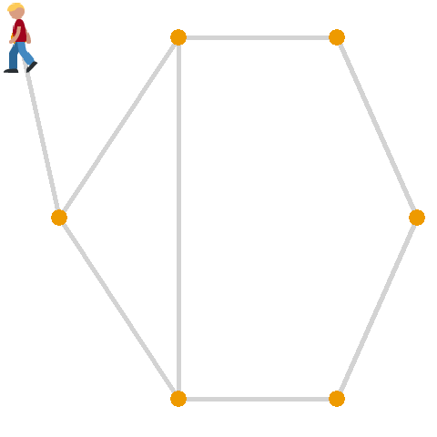
</div>

Para realizar un ejemplo de aleatoriedad vamos a crear un programa que representara el problema del "Camino de Borrachos". Para esto crearemos 3 clases: uno que represente al **agente que camina**, una que genere una **abstracción de las coordenadas** y una que represente el **plano** en el cual nos estamos moviendo, y vamos a graficar la distancia en la que termina nuestro agente a medida que definimos una mayor cantidad de pasos que puede dar. 

Primero crearemos un ambiente virtual, para ello vamos a la terminar.

```bash
mkdir camino_de_borramos    # Creamos una carpeta para nuestro proyecto.
cd camino_de_borrachos      # Ingresamos a la carpeta.
python3 -m venv env         # Creamos nuestro ambiente virtual.
source env/bin/activate     # Activamos nuestro ambiente.
pip install bokeh           # Instalamos el paquete de bokeh para generar nuestra gráfica.
```

Luego de haber creado nuestro entorno de trabajo creamos los siguientes archivos en nuestra carpeta.

```py
# Creamos un archivo borracho.py
import random

# Creamos nuestra Clase borracho.
class Borracho:

    def __init__(self, nombre):
        self.nombre = nombre


# Creamos la clase BorrachoTradicional que extiende de Borracho.
class BorrachoTradicional(Borracho):

    def __init__(self, nombre):
        super().__init__(nombre)

    # Y tendrá un método caminar que devolverá la dirección a la que ira.
    def camina(self):
        # Con random.choice elegimos un elemento aleatoriamente de la lista.
        return random.choice([(0, 1), (0, -1), (1, 0), (-1, 0)])
```

```py
# Creamos un archivo coordenada.py

# La clase Coordenada guardara las coordenadas de nuestro agente
class Coordenada:

    # Definimos unas posiciones iniciales.
    def __init__(self, x, y):
        self.x = x
        self.y = y

    # Y cuando se mueve simplemente a las coordenadas actuales se les
    # suma las coordenadas X e Y que ingresan como parámetros.
    def mover(self, delta_x, delta_y):
        return Coordenada(self.x + delta_x, self.y + delta_y)


    # Y si queremos saber la distancia del agente con respecto a
    # unas coordenadas, simplemente lo calculamos con el
    # teorema de Pitágoras.
    def distancia(self, otra_coordenada):
        delta_x = self.x - otra_coordenada.x 
        delta_y = self.y - otra_coordenada.y 

        return (delta_x**2 + delta_y**2)**0.5
```

```py
# Creamos un archivo campo.py
class Campo:

    # Nuestra clase tendrá como atributo un diccionario.
    def __init__(self):
        self.coordenadas_de_borrachos = {}


    # Añadimos un agente a nuestro diccionario, nuestra llave sera
    # nuestro parámetro "borracho" y tendrá el valor asignado "coordenada"
    # que es una clase Coordenada creado en coordenada.py.
    def anadir_borracho(self, borracho, coordenada):
        self.coordenadas_de_borrachos[borracho] = coordenada


    def mover_borracho(self, borracho):
        # Al mover a nuestro agente ejecutamos el método camina de
        # nuestra clase BorrachoTradicional creado en el archivo borracho.py,
        # devolviendo la dirección hacia donde se movió.
        delta_x, delta_y = borracho.camina()

        # Obtenemos el objeto de Coordenada.
        coordenada_actual = self.coordenadas_de_borrachos[borracho]

        # Del objeto Coordenada ejecutamos el método mover con los parámetros
        # que el objeto borracho genero. El resultado lo guardamos en
        # nueva_coordenada.
        nueva_coordenada = coordenada_actual.mover(delta_x, delta_y)

        # El objeto guardado en nueva_coordenada ahora estará asociado
        # a la llave de borracho.
        self.coordenadas_de_borrachos[borracho] = nueva_coordenada


    def obtener_coordenada(self, borracho):
        return self.coordenadas_de_borrachos[borracho]
```

```py
# Creamos el archivo camino_aleatorio.py

# Importamos las clases que creamos anteriormente.
from borracho import BorrachoTradicional
from campo import Campo
from coordenada import Coordenada

# Importamos bokeh para generar un gráfico con nuestros resultados.
from bokeh.plotting import figure, show


def caminata(campo, borracho, pasos):
    # De la instancia Campo obtenemos las coordenadas actuales de la llave "borracho".
    inicio = campo.obtener_coordenada(borracho)

    # Repetiremos la misma cantidad de pasos definidos.
    for _ in range(pasos):

        # De la instancia campo ejecutaremos mover_borracho.
        campo.mover_borracho(borracho)

    # Y devolveremos la distancia entre las coordenadas de la instancia
    # inicio y campo.
    return inicio.distancia(campo.obtener_coordenada(borracho))


def simular_caminata(pasos, numero_de_intentos, tipo_de_borracho):

    # Definimos los parámetros para crear una instancia de Campo.
    borracho = tipo_de_borracho(nombre='Karl')
    origen = Coordenada(0, 0)

    # Creamos una lista que guardara las distancias en cada simulación.
    distancias = []

    # Por cada numero de intento.
    for _ in range(numero_de_intentos):

        # Creamos una instancia de Campo.
        campo = Campo()

        # A nuestra instancia de Campo le damos la llave borracho y sus coordenadas de origen.
        campo.anadir_borracho(borracho, origen)

        # Obtenemos la distancia final de la simulación.
        simulacion_caminata = caminata(campo, borracho, pasos)

        # El resultado lo guardamos en la lista de distancias.
        distancias.append(round(simulacion_caminata, 1))
    
    # Retornamos la lista de distancias.
    return distancias


def graficar(x, y):
    # Creamos una instancia de figure, con su titulo y las etiquetas de los ejes.
    grafica = figure(title='Camino aleatorio', x_axis_label='pasos', y_axis_label='distancia')

    # Ingresamos los datos de X e Y.
    grafica.line(x, y, legend='distancia media')

    # Generamos una gráfica en HTML.
    show(grafica)


def main(distancias_de_caminata, numero_de_intentos, tipo_de_borracho):

    # Creamos una lista que guardara el promedio de cada caminata.
    distancias_media_por_caminata = []

    # Por cada ítem en nuestras series de caminata.
    for pasos in distancias_de_caminata:

        # Guardamos las distancias que generan todas las simulaciones definido en numero_de_intentos.
        distancias = simular_caminata(pasos, numero_de_intentos, tipo_de_borracho)

        # De la lista de distancias obtenemos la distancia promedio.
        distancia_media = round(sum(distancias) / len(distancias), 4)

        # De la lista de distancias obtenemos el máximo valor.
        distancia_maxima = max(distancias)

        # De la lista de distancias obtenemos el menor valor.
        distancia_minima = min(distancias)

        # Guardamos el promedio de la caminata en la lista distancias_media_por_caminata.
        distancias_media_por_caminata.append(distancia_media)

        # Imprimimos los datos de la caminata actual.
        print(f'{tipo_de_borracho.__name__} caminata aleatoria de {pasos} pasos')
        print(f'Media = {distancia_media}')
        print(f'Max = {distancia_maxima}')
        print(f'Min = {distancia_minima}')

    # Generamos un gráfico con la información de las distancias finales según la cantidad de pasos.
    graficar(distancias_de_caminata, distancias_media_por_caminata)

if __name__ == '__main__':
    # Definamos cuantos pasos queremos que camine en cada serie.
    distancias_de_caminata = [10, 100, 1000, 10000]
    
    # Determinamos la cantidad de simulaciones que generara en cada serie.
    numero_de_intentos = 100

    # Ejecutamos el método main con los parámetros definidos anteriormente
    # y además pasamos la clase BorrachoTradicional
    main(distancias_de_caminata, numero_de_intentos, BorrachoTradicional)
```

Dentro el pensamiento **estocástico** debemos realizar varias simulaciones, por ese motivo en el ejemplo anterior realizamos varios intentos. Lo importante de esta aleatoriedad es que podemos distribuirla a lo largo de varios intentos, con esto podemos obtener certeza de que el comportamiento de nuestro programa se comporte en que esperamos estadísticamente.

Para ejecutar nuestro programa iremos nuevamente a la consola.

```bash
python3 camino_aleatorio.py     # Ejecutamos nuestro programa

# Y veremos nuestros resultados:

BorrachoTradicional caminata aleatoria de 10 pasos
Media = 2.639
Max = 6.3
Min = 0.0
BorrachoTradicional caminata aleatoria de 100 pasos
Media = 8.914
Max = 23.5
Min = 1.4
BorrachoTradicional caminata aleatoria de 1000 pasos
Media = 28.58
Max = 73.8
Min = 2.0
BorrachoTradicional caminata aleatoria de 10000 pasos
Media = 86.012
Max = 241.3
Min = 22.4
```

Y nuestra gráfica en HTML se vera así.

<div align="center"> 
  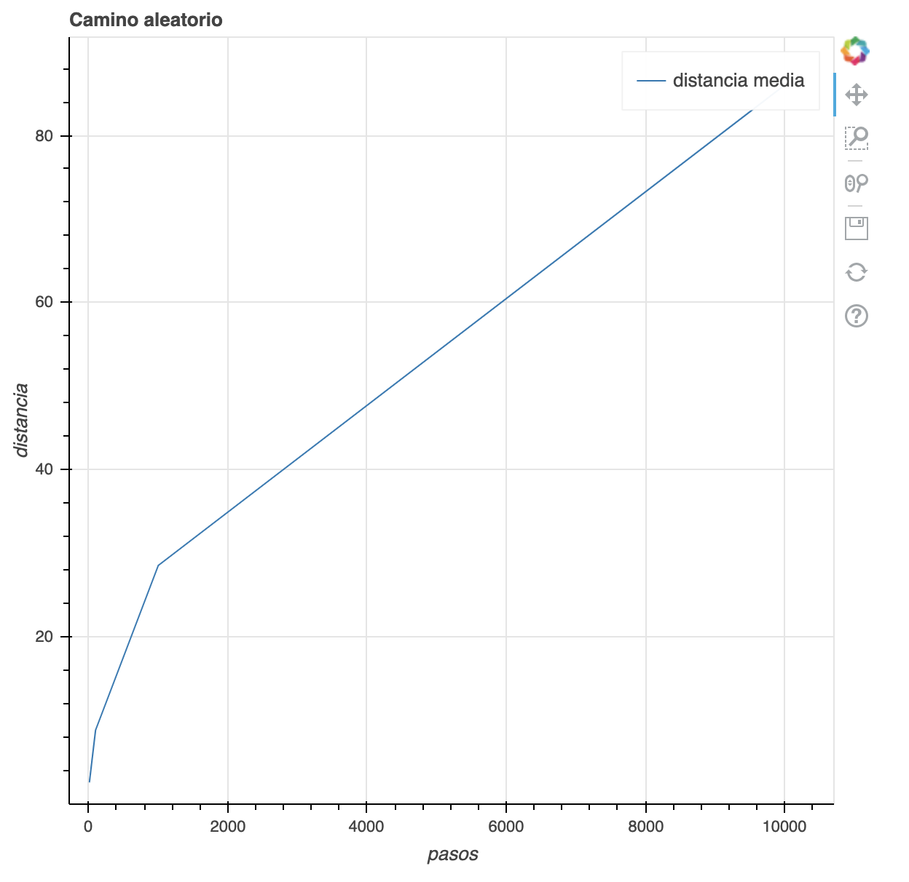
</div>

# Programas Estocásticos

## Introducción a la Programación Estocástica

Un programa es **determinístico** cuando se corre con un mismo _input_ produce el mismo _output_. Los programas **determinísticos** son muy importantes, pero existen problemas que no pueden resolverse de esa manera.

La **programación estocástica** permite introducir aleatoriedad a nuestros programas para crear simulaciones que permiten resolver otro tipo de problemas. Los **programas estocásticos** se aprovechan de que las **distribuciones probabilísticas** de un problema se conocen o pueden ser estimadas.

## Cálculo de Probabilidades

La **probabilidad** es una medida de la certidumbre asociada a un evento o suceso futuro y suele expresarse como un número entre 0 y 1. Una **probabilidad** de 0 significa que un suceso jamás sucederá, y en su contraparte una **probabilidad** de 1 significa que está garantizado que sucederá.

Al hablar de **probabilidad** preguntamos qué fracción de todos los posibles eventos tiene la propiedad que buscamos, por eso es importante poder calcular todas las posibilidades de un evento para entender su probabilidad. La probabilidad de que un **evento suceda** y de que **no suceda** es siempre **1**.

- Ley del complemento:
    - P(A) + P(~A) = 1

- Ley multiplicativa (Solo si los eventos son independiente):
    - P(A y B) = P(A) * P(B)

- Ley aditiva:
    - Mutuamente exclusivos (no ocurren al mismo tiempo): P(A o B) = P(A) + P(B)

    - No exclusivos (ocurre al mismo tiempo): P(A o B) = P(A) + P(B) - P(A y B)
    
**Formular de la probabilidad:**
$P(A) = Casos Exitosos / Numero total de Casos$

Para ver un ejemplo práctico de las leyes anteriores vamos a realizar un ejercicio de el lanzamiento de un dado de 6 caras:

- La probabilidad de que salga el número **1**:
    
    Tenemos **6** posibilidades y el número **1** es una de ellas, por lo que la probabilidad es **1/6**.

- La probabilidad de que nos toque el numero **1 o 2:**

    Tenemos **6** posibilidades y el número **1** es una de ellas y el **2** es otra. El que nos toque un número es **mutuamente exclusivo**, ya que no podemos obtener 2 números al mismo tiempo. Bajo esta premisa utilizaremos la **ley aditiva mutuamente exclusiva.**

    `P(1 o 2) = P(1) + P(2) `

    `P(1 o 2) = 1/6 + 1/6`

    `P(1 o 2) = 2/6`

- La probabilidad de que nos salga el número **1** al menos **1 vez** en **10 lanzamientos**:

    Para cada lanzamiento tenemos la posibilidad de **1/6** de que nos toque **1**, por lo que utilizamos la **ley multiplicativa.**

    `(1/6)^10 = 0.8333`

## Simulación de Probabilidades

En el siguiente ejercicio crearemos un ejemplo de lanzar un dado de 6 caras, esto con el objetivo de obtener la distribución de probabilidades y acercarnos al numero correcto, aplicando la **ley de los grandes números.**

```py
import random

def tirar_dado(numero_de_tiros):
    secuencia_de_tiros = []

    for _ in range(numero_de_tiros):
        tiro = random.choice([1, 2, 3, 4, 5, 6])
        secuencia_de_tiros.append(tiro)

    return secuencia_de_tiros

def main(numero_de_tiros, numero_de_intentos):
    tiros = []
    for _ in range(numero_de_intentos):
        secuencia_de_tiros = tirar_dado(numero_de_tiros)
        tiros.append(secuencia_de_tiros)

    tiros_con_1 = 0
    for tiro in tiros:
        if 1 not in tiro:
            tiros_con_1 += 1 

    probabilidad_tiros_con_1 = tiros_con_1 / numero_de_intentos
    print(f'Probabilidad de no obtener por lo menos un 1 en {numero_de_tiros} tiros = {probabilidad_tiros_con_1}')


if __name__ == '__main__':
    numero_de_tiros = int(input('Cuantas tiros del dado: '))
    numero_de_intentos = int(input('Cuantas veces correra la simulacion: '))

    main(numero_de_tiros, numero_de_intentos)
```

## Inferencia Estadística

Con las simulaciones podemos calcular las probabilidades de eventos complejos sabiendo las probabilidades de eventos simples.

¿Que pasa cuando no sabemos las probabilidades de los eventos simples? Las técnicas de la **inferencia estadística** nos permiten inferir/concluir las propiedades de una población a partir de una muestra **aleatoria.**

_"El principio guía de la **inferencia estadística** es que una muestra aleatoria tiende a exhibir las mismas propiedades que la población de la cual fue extraída."_ - John Guttag

<div align="center"> 
  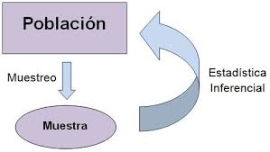
</div>

### Ley de los grandes números

Con la **ley de los grandes números** podemos ver que en pruebas independientes repetidas con la misma probabilidad p de un resultado, la fracción de desviaciones de p converge a cero conforme la cantidad de pruebas se acerca al infinito.

<div align="center"> 
  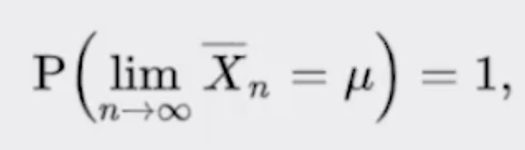
</div>

### Falacia del apostador

La **falacia del apostador** señala que después de un evento extremo, ocurrirán eventos menos extremos para nivelar la media.

La _regresion a la media_ señala que después de un evento aleatorio extremo, el siguiente evento probablemente será menos extremo.

## Media

La **media** es una medida de tendencia central, comúnmente conocido como promedio. La media de una población se denota con el símbolo μ y la media de una muestra se define con X̄.

<div align="center"> 
  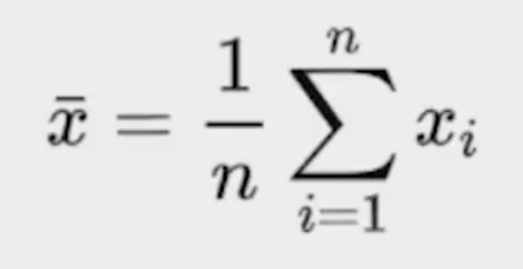
</div>

Una forma de calcular la media con Python seria la siguiente.

```py
import random

def media(X):
    return sum(X) / len(X)

if __name__ == '__main__':
    X = [random.randint(9, 12) for i in range(20)]
    mu = media(X)

    print(f'Arreglo X: {X}')
    print(f'Media = {mu}')
```

## Varianza y Desviación Estándar

### Varianza

La **varianza** mide qué tan propagados se encuentran un conjunto de valores aleatorios de su media. Mientras que la **media** nos da una idea de dónde se encuentran los valores, la **varianza** nos dice que tan dispersos se encuentran. La **varianza** siempre debe entenderse con respecto a la media.

<div align="center"> 
  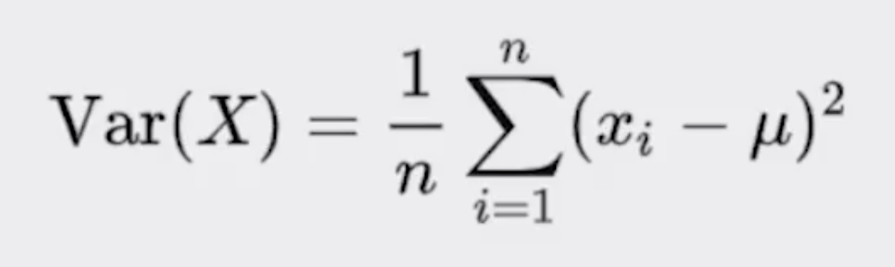
</div>

### Desviación estándar

La **desviación estándar** es la raíz cuadrada de la **varianza**. Nos permite entender, también, la propagación y se debe entender siempre relacionado con la **media**.

La ventaja sobre la **varianza** es que la desviación estándar está en las mismas unidades que la **media**.

<div align="center"> 
  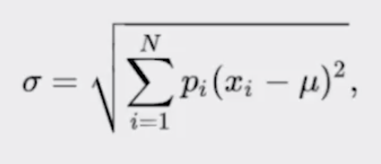
</div>

Vamos a implementar las funciones de **varianza** y **desviación estándar** en nuestro script ya hecho para la **media.**

```py
import random
import math

def media(X):
    return sum(X) / len(X)


def varianza(X):
    mu = media(X)

    acumulador = 0
    for x in X:
        acumulador += (x - mu)**2

    return acumulador / len(X)


def desviacion_estandar(X):
    return math.sqrt(varianza(X))


if __name__ == '__main__':
    X = [random.randint(9, 12) for i in range(20)]
    mu = media(X)
    Var = varianza(X)
    sigma = desviacion_estandar(X)

    print(f'Arreglo X: {X}')
    print(f'Media = {mu}')
    print(f'Varianza = {Var}')
    print(f'Desviacion estandar = {sigma}')
```

## Distribución Normal

La **distribución normal** es una de las distribuciones mas recurrentes en cualquier ámbito. Se define completamente por su **media** y su **desviación estándar**. Permite calcular **intervalos de confianza** con la regla empírica.

<div align="center"> 
  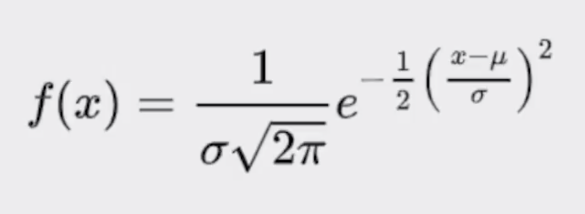
</div>

En el siguiente ejemplo vamos una unas distribuciones con desviación estándar 1 y 3. Cuando la desviación es baja significa la variabilidad de los datos es menor.

<div align="center"> 
  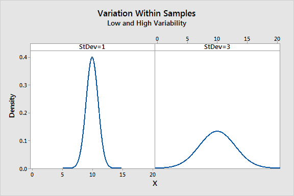
</div>

### Regla empírica

También conocida como la regla 68-95-99.7. Señala cuál es la dispersión de los datos en una distribución normal a uno, dos y tres sigmas.

Permite calcular probabilidades con la densidad de la distribución normal.

<div align="center"> 
  
</div>

<div align="center"> 
  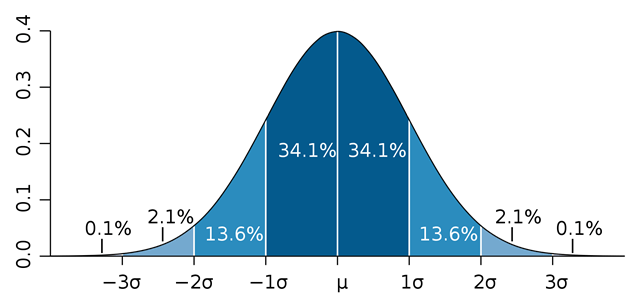
</div>

# Simulaciones de Montecarlo

## ¿Qué son las Simulaciones de Montecarlo?

Permite crear simulaciones para predecir el resultado de un problema, además de convertir problemas determinísticos en problemas estocásticos.

Es utilizado en gran diversidad de áreas, desde la ingeniería hasta la biología y el derecho.

## Simulación de Barajas

```py
import random
import collections

PALOS = ['espada', 'corazon', 'rombo', 'trebol']
VALORES = ['as', '2', '3', '4', '5', '6', '7', '8', '9', '10', 'jota', 'reina', 'rey']

def crear_baraja():
    barajas = []
    for palo in PALOS:
        for valor in VALORES:
            barajas.append((palo, valor))

    return barajas

def obtener_mano(barajas, tamano_mano):
    mano = random.sample(barajas, tamano_mano)
    
    return mano

def main(tamano_mano, intentos):
    barajas = crear_baraja()

    manos = []
    for _ in range(intentos):
        mano = obtener_mano(barajas, tamano_mano)
        manos.append(mano)

    pares = 0
    for mano in manos:
        valores = []
        for carta in mano:
            valores.append(carta[1])

        counter = dict(collections.Counter(valores))
        for val in counter.values():
            if val == 3:
                pares += 1
                break

    probabilidad_par = pares / intentos
    print(f'La probabilidad de obtener un par en una mano de {tamano_mano} barajas es {probabilidad_par}')


if __name__ == '__main__':
    tamano_mano = int(input('De cuantas barajas sera la mano: '))
    intentos = int(input('Cuantos intentos para calcular la probabilidad: '))

    main(tamano_mano, intentos)
```

## Cálculo de PI

Calcularemos PI con puntos al azar esparcidos en un plano cartesiano utilizando los scripts de **desviación estándar** y **media** que creados anteriormente. Queremos tener un **95% de certeza**, entonces para ello realizaremos el cálculo para 1/2 del área de un circulo, optimizando nuestros recursos.

```py
import random
import math
from estadisticas import desviacion_estandar, media

def aventar_agujas(numero_de_agujas):
    adentro_del_circulo = 0

    for _ in range(numero_de_agujas):
        x = random.random() * random.choice([-1, 1])
        y = random.random() * random.choice([-1, 1])
        distancia_desde_el_centro = math.sqrt(x**2 + y**2)

        if distancia_desde_el_centro <= 1:
            adentro_del_circulo += 1

    # La variable adentro_del_circulo representa 1/4 del área del círculo,
    # y como solo utilizaremos 1/2 vamos a multiplicarlo por 2.
    return (2 * adentro_del_circulo) / numero_de_agujas


def estimacion(numero_de_agujas, numero_de_intentos):
    estimados = []
    for _ in range(numero_de_intentos):
        estimacion_pi = aventar_agujas(numero_de_agujas)
        estimados.append(estimacion_pi)

    media_estimados = media(estimados)
    sigma = desviacion_estandar(estimados)

    # La variable media_estimados tiene los resultados sobre 1/2 del área del
    # círculo. Para obtener la estimación de PI completo lo vamos a multiplicar por 2.
    print(f'Est={round(media_estimados, 5) * 2}, sigma={round(sigma, 5)}, agujas={numero_de_agujas}')

    return (media_estimados, sigma)

def estimar_pi(precision, numero_de_intentos):
    numero_de_agujas = 1000
    sigma = precision

    while sigma >= precision / 1.96:
        media, sigma = estimacion(numero_de_agujas, numero_de_intentos)
        numero_de_agujas *= 2

    return media

if __name__ == '__main__':
    estimar_pi(0.01, 1000)
```

Vamos a la consola y ejecutamos nuestro programa.

```bash
python3 calculo_pi.py   # Ejecutamos nuestro script.

# Y estos serán nuestros resultados.
Est=3.14234, sigma=0.02594, agujas=1000
Est=3.13966, sigma=0.01795, agujas=2000
Est=3.143, sigma=0.01272, agujas=4000
Est=3.14076, sigma=0.00949, agujas=8000
Est=3.14142, sigma=0.00678, agujas=16000
Est=3.14154, sigma=0.00457, agujas=32000
```

# Muestreo e Intervalos de Confianza

## Muestreo

El **muestreo** es muy importante cuando no tenemos acceso a toda la población que queremos explorar. Uno de los grandes descubrimientos de la estadística es que las **muestras aleatorias** tienden a mostrar las mismas propiedades de la población objetivo. Hasta este punto todos los **muestreos** que hemos hecho son de tipo **probabilísticos**.

En un **muestreo aleatorio** cualquier miembro de la población tiene la misma probabilidad de ser escogido.

En un **muestreo estratificado** tomamos en consideración las características de la población para partirla en subgrupos y luego tomamos muestras de cada subgrupo, esto incrementa la probabilidad de que el muestreo sea representativo de la población.

### Tipos de muestreo


<div align="center"> 
  
</div>

## Teorema del Límite Central

El **teorema del límite central** es uno de los teoremas más importantes de la estadística. Establece que **muestras aleatorias** de cualquier distribución van a tener una **distribución normal**. Esto permite entender cualquier distribución como la **distribución normal de sus medias** y eso nos permite aplicar todo lo que sabemos de **distribuciones normales.**

Mientras más muestras obtengamos, mayor será la similitud con la distribución normal. Mientras la muestra sea de mayor tamaño, la desviación estándar será menor.

<div align="center"> 
  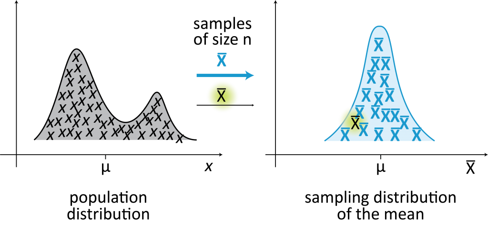
</div>

# Datos Experimentales

## ¿Cómo trabajar con datos experimentales?

Los **datos experimentales** son aquellos que se generan a través del **método científico**.

- Con el **método científico** es necesario comenzar con una _teoría_ o _hipótesis_ sobre el resultado al que se quiere llegar. 
- Basado en la _hipótesis_ se debe crear un experimento para **validad** o **falsear** la _hipótesis_.
- Se **valida** o **falsea** una _hipótesis_ midiendo la diferencia entre las mediciones experimentales y aquellas mediciones predichas por la _hipótesis_.

## Regresión Lineal

La **regresión lineal** nos permite aproximar una función a un conjunto de datos obtenidos de manera experimental. No necesariamente permite aproximar funciones lineales, sino que sus variantes permiten aproximar cualquier **función polinómica.**

Para ver un ejemplo de regresiones lineales en _Python_ en el siguiente enlace puedes acceder a ver un ejemplo: [Collab - Regresión Lineal.](https://colab.research.google.com/drive/1c0Lx0xQyxuoZsnVKZzMFcANykA5VWN5F)