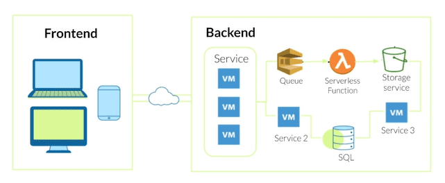
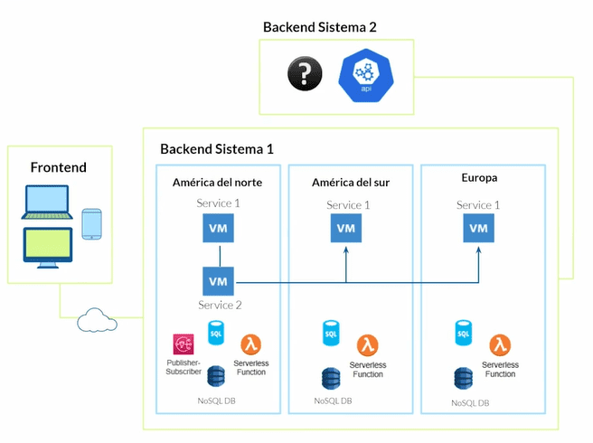
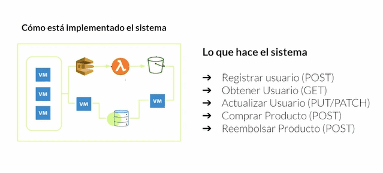
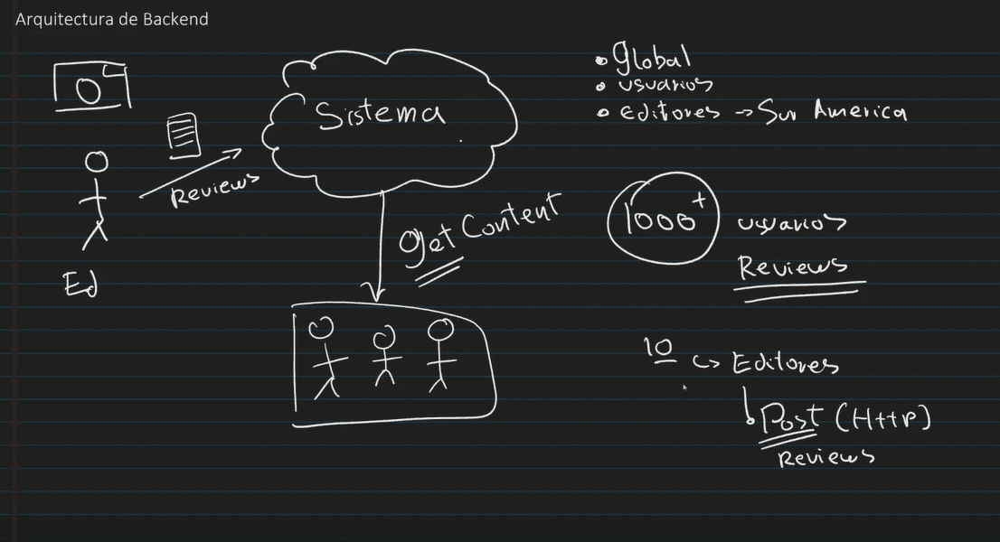
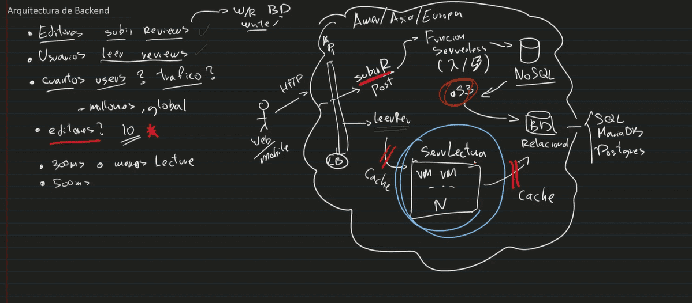
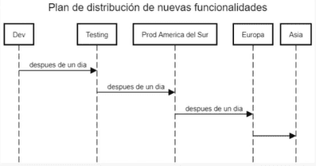
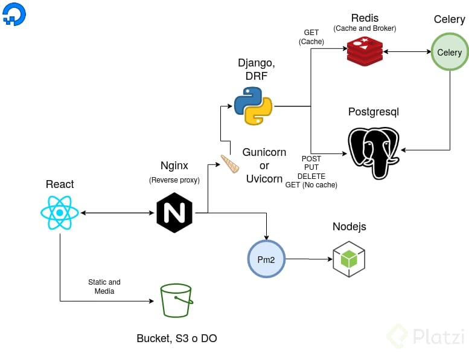
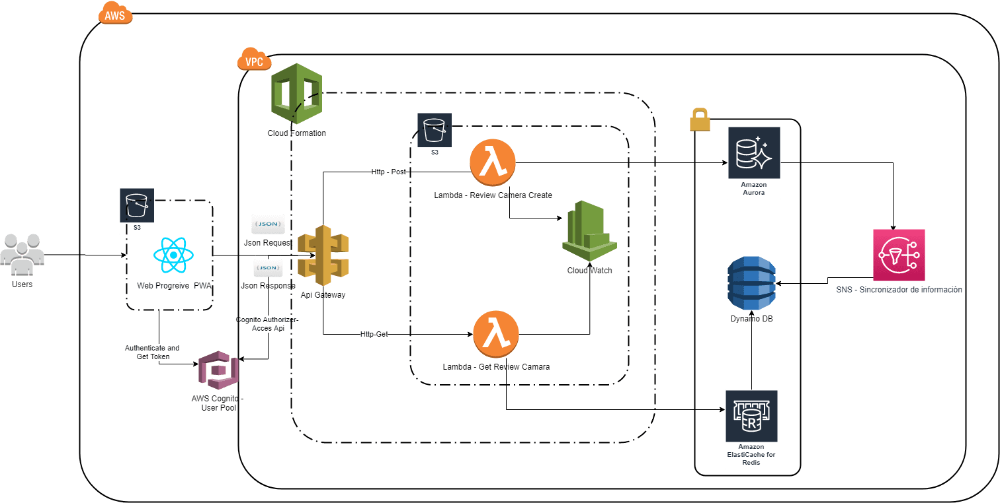

# Curso Práctico de Arquitectura Backend

## 1. Qué es el backend

* Backend: lógica de funcionamiento de la aplicación. Ademas, se puede expandir mucho mas allá de una arquitectura cliente-servidor.
* Frontend: interfaz visual con la que interactúa el usuario para operar el backend.

## 2. Qué son los sistemas distribuidos

Sistema Monolítico: Es un sistema conformado por una sola "pieza"
* un unico servidor que hospeda uno o mas sitios web con LAMP stack.
* EJemplo: Linux, APACHE, MySQL, PHP

Sistema distribuido (Microservicios): Compuesto de múltiple componentes que se comunican entre sí usando redes.

* Es un sistema conformado por muchos componentes conectados por medio de redes, puede manifestarse en difeentes escalas e implementar multiples patrones de arquitectura.

* se puede tener colas, servicio de storage, serverless y otros.

## 3. Elementos de un sistema distribuido en la nube

Elementos que podemos encontrar en un Sistema Distribuido

* Load Balancers
* Máquinas Virtuales
* Bases de datos Relacionales o No Relacionales
* Servicios de Colas (Ejemplo: SQS)
* Servicios de Storage (Ejemplo: S3)
* Servicios Publisher-Suscriber (Ejemplo: SNS)
* Pipelines

¿Hasta donde puede llegar a crecer un Sistema Distribuido? 

Podemos globalizar nuestro sistema teniendolo distribuido en diferentes partes del mundo a través de servicios implementados en diferentes servidores.

## 4. Cómo se conecta todo en el backend

El backend de un sistema se conecta por medio de APIs el cual estas API's (Interfaz de Programación de Aplicaciones) exponen metodos (interfaces) con funcionalidades.

Las APIs nos permiten abstraer la complejidad de un proceso y exponer una interfaz sencilla para la comunicación entre los sitemas. 

## 5. Definición y requerimientos del sistema desde la perspectiva de negocio

## 6. Documento de diseño or HLD (diseño de alto nivel)

El documento de diseño debe ser agnóstico a cualquier tecnología que se quiera usar, hay que recordar que cuando hablamos de arquitectura backend es más el cómo se van a implementar las cosas en lugar de con qué se implementarán, el documento de diseño es un archivo que contendrá todos los detalles que necesitamos para poder desarrollar el sistema. 

* https://sg.com.mx/revista/30/documentacion-arquitectura
* https://github.com/jorgevgut/airquality-mx/wiki/High-level-System-Design

## 7. Creación del documento de diseño

## 8. Revisión de diseño

Este paso es uno de los mas valiosos de la construcción o el diseño de una infraestructura. Muchas veces iniciamos nuestro proyecto omitiendo muchas perspectivas que se nos presentan en el día a día con los sistemas.

* Cómo se va a comportar la DB si tiene replicas en diferentes regiones?
* Qué pasa si X servicio se cae por un momento, como se comportaría el sistema?

Lo más relevante es hacer preguntas de posibles comportamientos del sistema, a partir de ahí, se crean las soluciones.

## 9. Elaboración de la arquitectura del sistema

1. Entender el problema resolver.
2. Realizar las preguntar pertinentes.
3. Evaluar los escenarios o casos de uso del problema.
4. Bosquejar soluciones posibles.
5. Pedir feedback.

## 10. Diseños de bajo nivel, planes de prueba e integración continua

Básicamente un diseño a bajo nivel se refiere a especificar exactamente cómo va a funcionar cada una de las secciones que detallamos en la arquitectura del sistema, desde qué tecnologías vamos a usar, cómo se van a comunicar, TODO. . Para ello podemos basarnos en diagramas, lo más importante a tomar en cuenta es que esto lo podemos poner en la sección de Modelo de Datos de nuestro documento de diseño.

## 11. Plan de integración continua (uso de pipeline)

## 12. Definiendo el “Code Complete”

Cuando el desarrollo ya realizado satisface todos los requerimientos de negocio y no es necesario escribir más código fuente.

## 13. Recap y tips de siguientes pasos

Trade Off: Sacrificar una cosa por otra. Esto no es necesariamente malo, pero hay que tener en cuenta que cada decisión que tomamos puede afectar a otra cosa. 

a consecuencia mal manejada del trade off es la deuda técnica.

## 14. LLD (diseño de bajo nivel)

### Stateless (sin estado)

Se refiere a que cada solicitud será única y no tendrá ningún tipo de relación con alguna solicitud anterior, es decir, no se va a guardar nada, cada transacción iniciará desde 0. Para poner una analogía, imagina una computadora SIN disco duro, cada proceso que haga esta computadora no se va a guardar, imagina que por cada proceso, enciendes la computadora, hacer el proceso y luego la apagas de nuevo, eso es stateless. . En cambo, stateful sí que puede guardar cosas y comunicarse con procesos anteriores, usar datos generados de un proceso para hacer otro proceso.

### Horizontal Scaling (escala horizontal)

Anteriormente, cuando un sistema crecía y empezaban a incrementar la cantidad de solicitudes al servidor en miles de solicitudes por segundo solíamos pensar que simplemente teníamos que agregarle un mejor CPU, más memoria RAM, más discos duros, mejorar la conexión a internet... ¿Pero qué pasaba si mi demanda aumentaba a millones, pero yo ya tenía el servidor más potente del mundo y no podía agregarle nada más y aun así no abastecía para satisfacer millones de usuarios? A esto se le llama escala vertical, sin embargo, poco a poco se fue adoptando el concepto de escala horizontal en donde, en lugar de tener un servidor superpotente con el mejor procesador y teras de RAM, podemos tener varias computadoras atendiendo esas miles solicitudes, y si la demanda crece a millones, nos basta con simplemente agregar más computadoras que puedan atenderlas.

## 15. Diseño de un servicio que integre autenticación

### Diseño de servicio de autenticación

* Framework, lenguaje: Flask, Python.
* DB: SQL (donde se alojan los usuarios).
* Diseño de modularización del servicio: Archivo en esta carpeta.
* Lógica del recurso (Get /review/{id} del servicio):
El recurso recibe por GET, en el header, el token de acceso de una request/usuario. Consulta con el proveedor de autenticaciones “Auth0” sobre los datos sensibles que almacena ese token. Puede suceder que sea un token inválido o esté vencido, si no, con los datos devueltos (ej: un id de user, u otro identificador), consulta a través del Controller->Model->DB si existe en el sistema y su información principal. Esta info es construída en base a la API definida y retornada.

## 16. Escalabilidad: Throttling y RetryPolicies

* Throttling: patrón arquitectónico permite controlar la cantidad de recursos que una aplicación puede utilizar antes de estrangular los procesos no esenciales a favor de mantener a flote el servicio, evitando una interrupción o caída de instancias o aplicaciones.

* Circuite Braker: evita que una aplicación intente de manera reiterada una operación que con probabilidad vaya a fallar, permitiendo que esta continúe con su ejecución sin malgastar recursos mientras el problema no se resuelva. puede detectar cuando se ha resuelto el problema permitiendo de esta manera volver a ejecutar la operación comprometida.

* BackOff: lo veo más como el estado cuando los recursos ya fueron sobre pasados y el back no responde.
