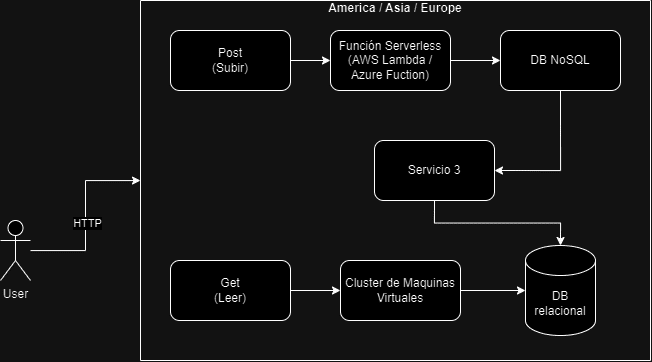
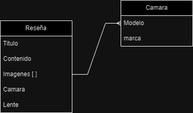

# Documento de diseño de "CameraReviews"

## Problema a resolver

La empresa "RandomCameraReviews" necesita un sistema que permita que fotografos profesionales suban "reviews" de Camaras fotograficas, para que cualquier persona desde cualquier parte del mundo pueda buscar los los reviews y comprarlas a travez de su portal.
La empresa cuenta con un equipo de developers especializado en frontEnd que realizara un portal para que los editores suban los "reviews" y los usuarios puedan verlos, y han solicitado que tu como especista en Backend, les proporciones un sistema, incluyendo API que permita  realizar lo siguiente:

* Subir reviews de Camaras fotograficas
* Obtener el contenido de los reviews para mostrarlo en vistas del portal en sus versiones web y mobile.
* Manejo de usuarios para editores (no incluye visitantes que leen los reviews)

Tambien se sabe que la empresa "RandomCameraReviews" planea distribuir mayormente en America del Sur donde esta su mercado mas grande, pero tambien tienen ventas en norte america, Europa, y muy pocas en Asia.

## Objetivo
Este documento de diseño plantea una solución propuesta para implementar un sistema en backend que cumple con los [requerimientos impuestos por la empresa "RandomCameraReviews"](./shared/project_definition.md).

## Alcance (Casos de uso a soportar)
La solución descrita en este documento unicamente soportara los siguientes casos de uso.

* Como editor me gustaria publicar una reseña de camara.
* Como editor me gustaria poder subir review de un lente para las camaras.

## Fuera de alcance

* como usuario no registrado me gustaria poder subir una review de una camera
* Un visitante puede enviar solicitudes para publicar reseñas.
* Registro de usuarios editores.

---
## Arquitectura

* editores subir reviews
* usuarios leer reviews
* cuantos usuarios? trafico? millones, global
* cuantos editores? 10
* 300ms o menos en lectura
* 500ms de escritura

### Diagramas
poner diagramas de secuencia, uml, etc

### Modelo de datos
Poner diseño de entidades, Jsons, tablas, diagramas entidad relación, etc..

---

### Plan de pruebas

* Crear proyecto de pruebas que valide los siguientes casos de uso.

- Registrar usuario, crear reviews, simular que el visitante puede leer el review escrito.

### CI / CD (Pipeline)

## Limitaciones
* Llamadas al API que permite subir un review, no excede los limites de latencia 500ms

* Llamadas al API que permite obtener review para lectura deben de tener una latencia menor a 100ms

---
## Costo
contemplando 1000 usuarios diarios que visitan recurrentemente cada hora:

Descripción/Análisis de costos
Ejemplo:
"Considerando N usuarios diarios, M llamadas a X servicio/baseDatos/etc"
* 1000 llamadas diarias a serverless functions. $XX.XX
* 1000 read/write units diarias a X Database on-demand. $XX.XX
Total: $xx.xx (al mes/dia/año)