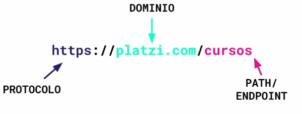
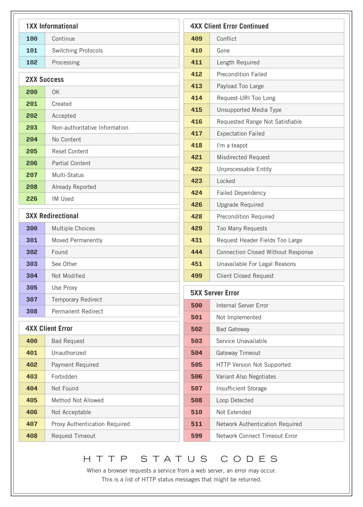
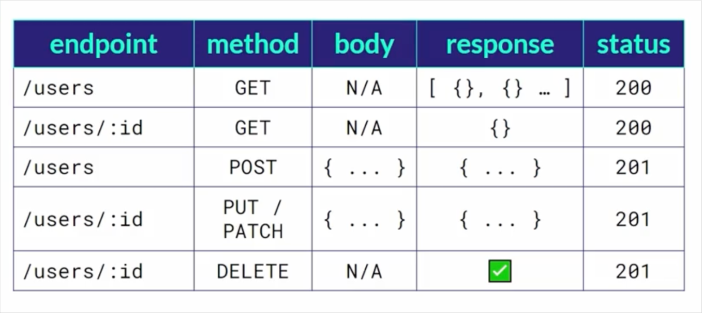
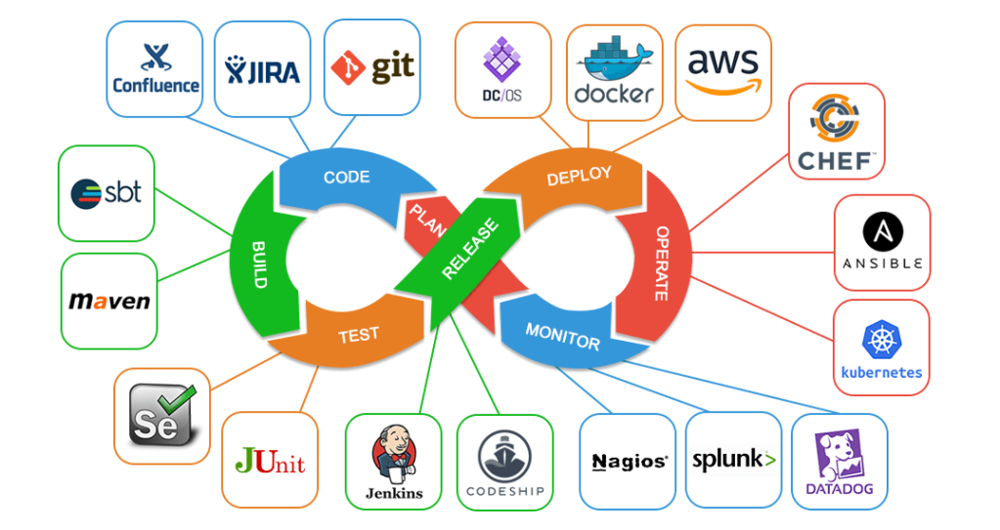
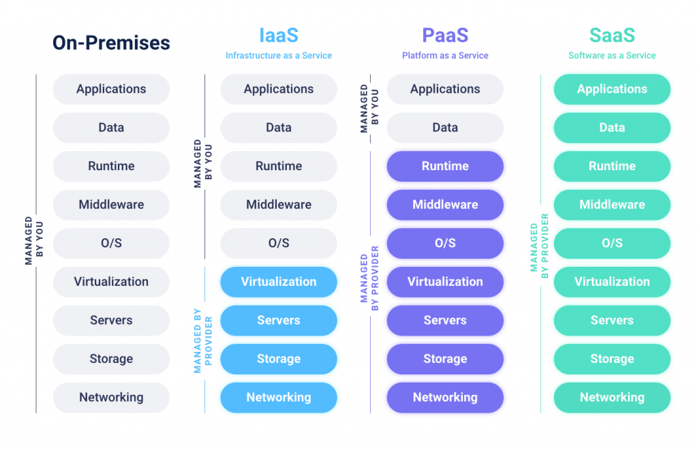
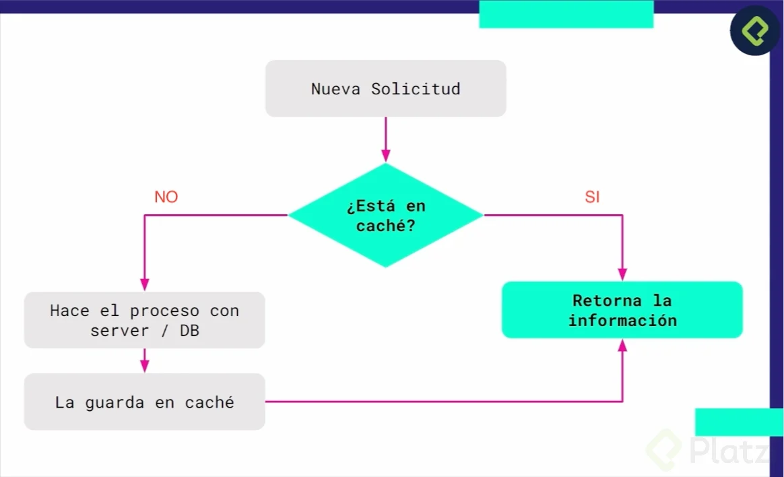

# Nuevo Curso de Introducción al Desarrollo Backend

 

# Los roles del desarrollo backend

1. ## Los roles del desarrollo backend

Tu rol principal como Backend Developer va ser escribir código que tengan que ver con:

* Reglas de negocio
* Validación
* Autorización de usuarios
* Conexiones a bases de datos
* Código que correra del lado del servidor.

El Backend developer también puede estár acercado a otro tipo de roles como:

* DB ADMIN

    Gestiona una base de datos, sus políticas y como vamos a disponer de esa DB a través del código y la seguridad que estas deberian tener.

* SERVER ADMIN

    Se encarga de gestionar la seguridad en los servidores que es donde corre el código a disposición.

2. ## Frontend, Backend y Full Stack

* Como backend developer vas a desarrollar servicios con los que se conectarán los clientes.

* El cliente (frontend) es el medio a través del cual interactúan los usuarios, y que este a su vez, se comunica con el servidor (backend) para proveer el servicio.

* El cliente puede ser, por ejemplo, un navegador, un dispositivo móvil (como un teléfono inteligente), o cualquier dispositivo conectado a una red IoT (internet of things) como podría serlo una nevera o un televisor.

* Los navegadores utilizan tres tecnologías principales del lado del frontend, que son: HTML, CSS y JavaScript. Los dispositivos móviles también cuentan con tecnologías como Swift en iOS, y Kotlin para Android.

* Existen múltiples lenguajes de programación con su respectivo framework (marco de trabajo) que se utilizan para el desarrollo backend:

~~~
    Python → Django
    JavaScript → Express.js
    TypeScript → NestJS
    Ruby → Ruby on Rails
    PHP → Laravel
    Java → Spring
    Go → Gin
    C# → .NET
~~~

* El frontend y el backend se conectan a través de una API (application programming interface).

* El FullStack developer es un desarrollador que desempeña funciones de frontend developer, así como de backend también, pero generalmente tiene una especialidad en la que ejerce una mayor profundidad de conocimiento.

# Fundamentos del Backend

## 3. ¿Cómo se construye el backend?

* El cliente solicita la informacion, pero cómo?

* El cliente hace una solicitud y se le llama endpoint.
* La API se encarga de llevar la solicitud al backend, independientemente si la consulta es correcta o no.

* El backend (Endpoint) procesa la solicitud (consulta en la BD, ejecuta los procesos lógicos, usa librerías. etc) y se lo devuelve a la API

* Los frameworks apoyan a la creacion de la implementacion del protocolo REST API, nos ayudan a construir aplicaciones robustas de manera más sencilla.

## 4. ¿Cómo escoger lenguajes y frameworks para backend?

### Frameworks son herramientas que nos ayuda a ir más ágil y desarrollar nuestro proyecto en el dia a dia. entre ellos 

* En Python:

    * Django

    * Flask

    * FastAPI

* En JavaScript:

    * Express

    * NextJS

* En PHP

    * Laravel

    * Symphony

* En Java

    * Spring

* En Go

    * Gin

* En Rubi

    * Ruby Rails
* En C#

    * .NET

## HTTP

### 5. Protocolo HTTP y como interactúa con el Backend

* Protocolo: Aqui se muestra el protocolo donde hacemos la peticion, normalemente es HTPPS la S es un certificado de seguridad.

* Dominio: normalmente .com pero hay un monton de estas terminaciones (.dev .gg .org)

* PATH o EndPoint: Aqui nos encontramos las diferentes rutas dentro de nuestro sitio web

### Estatus code

# Apis REST

## 6. ¿Qué son las APIs?

* Las APIs nos permiten, a través de código, la comunicación entre sistemas.

* Como backend developers, nos interesan las APIs que son servicio web y corren en el protocolo HTTP.
* La API utiliza una lista de rutas conocidas como endpoints, que provee las respuestas a las solicitudes del cliente.
* La solicitud debe ser empaquetada y retornada, y existen distintos tipos de empaquetado:
    * JSON.
    * XML.

## 7. Estructura REST API

* API REST es un estandar para desarrollar APIs que funcionan en el protocolo HTTP .
* A través de los endpoints se le pide información al dominio, por lo general, se nos devuelve la información empaquetada en un JSON.
* CRUD es el índice de unas plabras clave, y en el protocolo HTTP tenemos métodos para llevarlas a cabo:
    * Create (crear) → POST.
    * Read (leer) → GET.
    * Update (actualizar) → PUT / PATCH.
    * Delete (eliminar) → DELETE.
* Put envía la totalidad de los datos, mientras que patch envía solo los datos destinados a actualizarse.

## 8. Insomnia y Postman

### Recordemos que para dar instrucciones a la API tenemos diferentes métodos para llevarlas a cabo:
~~~
Create (crear) → POST.
Read (leer) → GET.
Update (actualizar) → PUT / PATCH.
Delete (eliminar) → DELETE.
~~~

### Estas las configuramos en insomnia antes de hacer una petición a la FakeAPI de la siguiente manera:

* Obtener todas las categorías (GET)
    ~~~
    [GET] https://api.escuelajs.co/api/v1/categories
    [
    {
        "id": 1,
        "name": "Clothes",
        "image": "https://placeimg.com/640/480/any"
    }
    // ...
    ]
    ~~~

* Obtener una sola categoría (GET)

    ~~~
    [GET] https://api.escuelajs.co/api/v1/categories/1
    {
    "id": 1,
    "name": "Clothes",
    "image": "https://placeimg.com/640/480/any"
    }
    ~~~

* Crear una categoría (POST)

    ~~~
    [POST] https://api.escuelajs.co/api/v1/categories/
    Body de tipo JSON:

    {
    "name": "Mi nueva categoría",
    "image": "https://placeimg.com/640/480/any"
    }
    ~~~

* Actualizar categoría (PUT)
    ~~~
    [PUT] https://api.escuelajs.co/api/v1/categories/1
    Body tipo JSON:

    {
    "name": "Change name"
    }
    ~~~
No es necesario enviar todos los atributos, es suficiente con el atributo que deseamos actualizar.

* Eliminar Categoría (DELETE)
    ~~~
    [DELETE] https://api.escuelajs.co/api/v1/categories/1
    Por alguna razón este método regresa un 404, pero si creamos un nuevo producto si podemos eliminarlo, les muestro a continuación a modo de práctica si te quedaste con las ganas de usarlo.
    ~~~

* Eliminando un producto con DELETE
    Primero necesitamos crear un producto utilizando la siguiente petición y enviando el body (JSON) correctamente:

    ~~~
    Petición
    [POST] https://api.escuelajs.co/api/v1/products/
    Body
    {
    "title": "Mi nuevo producto",
    "price": 100,
    "description": "soy una descripcion",
    "categoryId": 1,
    "images": ["https://placeimg.com/640/480/any"]
    }
    ~~~

    Deberia generarse un 201
    Una vez enviado obtendremos de respuesta algo asi :
    ~~~
    {
        "title": "Mi nuevo producto",
        "price": 100,
        "description": "soy una descripcion xD",
        "images": [
            "https://placeimg.com/640/480/any"
        ],
        "category": {
            "id": 1,
            "name": "Clothes",
            "keyLoremSpace": "fashion",
            "image": "https://api.lorem.space/image/fashion?w=640&h=480&r=2908"
        },
        "id": 219
    }
    ~~~

    Donde el “id” final es el identificador de nuestro producto, lo usaremos para buscarlo y verificar que existe y para eliminarlo

    ~~~
    Obteniendo el nuevo producto
    [GET] https://api.escuelajs.co/api/v1/products/219
    Eliminando el nuevo producto
    [DELETE] https://api.escuelajs.co/api/v1/products/219
    Verificando eliminación
    [GET] https://api.escuelajs.co/api/v1/products/219
    ~~~

## 9. La nube

La nube, o "cloud" en inglés, se refiere a servidores y servicios de almacenamiento y procesamiento de datos en línea que se pueden acceder a través de Internet. En lugar de tener que almacenar y administrar datos y aplicaciones en su propio dispositivo o servidor, se pueden usar servicios en la nube para hacerlo de manera remota. Esto permite a los usuarios acceder a sus datos y aplicaciones desde cualquier lugar con conexión a Internet, y también les permite escalar el uso de recursos según sea necesario sin tener que preocuparse por el mantenimiento y la administración de hardware físico.

## 10. DevOps

DevOps es una práctica que combina el desarrollo de software (Dev) y la operación de sistemas (Ops) en un solo proceso integrado. El objetivo de DevOps es mejorar la eficiencia y la velocidad de entrega de software, al mismo tiempo que se asegura su calidad y confiabilidad. Esto se logra al fomentar la colaboración entre los equipos de desarrollo y operaciones, y al automatizar el proceso de entrega de software, desde la planificación hasta la implementación y el monitoreo.

# El servidor

* SaaS (Software as a Service): es un modelo de distribución de software en el que el proveedor ofrece el software como un servicio a través de internet. Los usuarios acceden al software a través de un navegador web o a través de una aplicación cliente y no tienen que preocuparse por la instalación ni por la actualización del software. Ejemplos de SaaS son servicios como Gmail, Slack y Google Drive.

* PaaS (Platform as a Service): es un modelo de distribución de software en el que el proveedor ofrece una plataforma en la que los usuarios pueden desarrollar, probar, implementar y administrar aplicaciones sin tener que preocuparse por la infraestructura subyacente. Ejemplos de PaaS son servicios como AWS Elastic Beanstalk y Google Firebase.

* IaaS (Infrastructure as a Service): es un modelo de distribución de infraestructura informática en el que el proveedor ofrece recursos informáticos, como servidores, almacenamiento y redes, como un servicio a través de internet. Los usuarios acceden a estos recursos a través de una interfaz en línea y pueden utilizarlos para desplegar y ejecutar aplicaciones y servicios sin tener que preocuparse por la adquisición ni por el mantenimiento de la infraestructura física. Ejemplos de IaaS son servicios como AWS EC2 y DigitalOcean.

## 11. Cookies y sesiones

* Cookies
    Las cookies son pequeños fragmentos de texto que los sitios web que visitas envían al navegador

    Permiten que los sitios web recuerden información sobre tu visita, lo que puede hacer que sea más fácil volver a visitar los sitios y hacer que estos te resulten más útiles.

    En las Cookies podemos almacenar datos como:

    * De qué país te conectas
    * Preferencias como del idioma
    * Almacenar una sesión de login

### ¿Cómo funciona?
1. Desde el Cliente realizamos una solicitud al Servidor
2. Desde el servidor reconocemos el usuario y generamos una Cookie.
3. Esta Cookie se envía al navegador para que sea guardada.
4. Así se identifica un usuario.
5. Una vez almacenada, al momento que el cliente haga una petición al cliente, éste va a reconocer la cookie creada.
6. El Servidor podrá retornar una respuesta más apropieda a este cliente en especifico.

### Problema de las Cookies
Las cookies solamente funcionan entre navegador y servidor, si queremos utilizarlas en native apps, no serán compatibles.

Pero hay una alternativa que se llama JWT que funciona en mobile y en navegadores.

### JSON WEB TOKENS O JWT

* Es un estándar abierto basado en JSON para la creación de tokens de acceso que permiten la propagación de identidad y privilegios o claims en inglés. 

    Por ejemplo, un servidor podría generar un token indicando que el usuario tiene privilegios de administrador y proporcionarlo a un cliente. El cliente entonces podría utilizar el token para probar que está actuando como un administrador en el cliente o en otro sistema.  El token está firmado por la clave del servidor, así que el cliente y el servidor son ambos capaces de verificar que el token es legítimo.

    Pueden ser usados tanto en mobile como en browsers.

## 12. Bases de datos

* Una base de datos es una herramienta para recopilar y organizar información. Las bases de datos  pueden almacenar información sobre personas, productos, pedidos u otras cosas. Muchas bases de datos comienzan como una lista en una hoja de cálculo o en un programa de procesamiento de texto.

    Existen dos tipos de bases de datos: Relacionales y No Relacionales.

### Relacionales (SQL)
Se caracterizan por ser creadas con tablas que relaciona los datos con otros. usa SQL (Structured Query Language) que es un lenguaje de computación para trabajar con conjuntos de datos y las relaciones entre ellos.

**Las BD relacionales más populares son:**

* MySQL
* PostgreSQL
* ORACLE
* Microsoft SQL Server

Al trabajar todos con SQL, los frameworks aprovechan para trabajar con ORMS Object-Relational Mapping, que es una forma de abstraer la conexión a estas bases de datos, utilizando la POO (Programación Orientada a Objetos.)

### No Relacionales (No SQL)

Una base de datos no relacional es aquella que no usa el esquema tabular de filas y columnas que se encuentra en la mayoría de los sistemas de base de datos más tradicionales. en vez de SQL, usa un formato JSON o parecido.

**Las BD no relacionales más populares son:**

* MongoDB
* Cassandra (Apache)
* Couchbase

### Cuidado con los servicios de bases de datos
Porque es donde está toda la información delicada de nuestros usuarios. Por medio de los drivers el backend se comunica con las bases de datos.

También es importante tener en cuenta que el desarrollador backend no es quien administra el mantenimiento de las bases de datos, no gestiona backups, sincronización, etc, ésto lo hace el DB Admin. Sino que éste construye la lógica para consumir éste servicio por medio de los drivers.

### Proveedores de DB Administration
Ofrecen servicios para administrar las bases de datos en diferentes bases de datos y éstos cobran de acuerdo al servicio y puede salir más economico que crear un equipo para administrar toda nuestras bases de datos. Algunos son:

* Heroku
* Firebase
* Digital Ocean
* Mongo Atlas
* Couchbase Capella DBaaS

# Escalabilidad en el backend

## 13. ¿Qué es el escalamiento?

### Escalamiento vertical.

Es cuando tenemos un servidor y eventualmente el servidor empieza a colapsar, una forma de solucionar el problema es incrementar:

* CPU, RAM, Disk

* usadas en aplicaciones de escalamiento vertical con muchas configuraciones

**Problemas:**

* Costos
* En un black friday tu puedes escalar la aplicacion, pero algunos provedores no permiten desescalar.
* Disponibilidad -> Solucion, Escalamiento Horizontal

### Escalamiento horizontal

Soluciona el problema de la disponibilidad. Se tienen varias instancias del mismo servidor.

* usadas en aplicaciones robustas, alta disponibilidad y alto escalamientos

Como se tienen distintos servidores ahora se necesita de un LOAD BALANCER

LOAD BALANCER -> Tiene conocimiento de nuestras instancias/servidores (al conjunto de servidores se denomina Clouster). Si un nodo(instancia) se cae, el load balancer se encarga de desviarla. Distribuye las peticiones.

* Si tenemos la base de datos local en cada servidor va haber un problema dado que no se tienen sincronizados los datos de las distintas bases de datos de los servidores. 
* SOLUCION: Gestionar la base de datos fuera de estos servidores. Quizas como un servidor aparte que sirva como DB.

## 14. ¿Qué es la replicación?

la proceso de replicacion es el proceso de sincronizacion, es la escritura en una base de datos en cada uno de sus nodos

* Soluciones a desincronización de base de datos.
    * Aislar base de datos a un servidor en particular. Se le hace escalamiento vertical solo a la base de datos para evitar un cuello de botella.
    * Se puede hacer escalamiento horizontal a la base de datos con su propio load balancer para solventar el problema de la disponibilidad.
        * Cada vez que se realice escritura en una de las bases de datos, se realiza una sincronización para que el cambio ocurra en todas las bases de datos. Esto es conocido como replicación.
* Normalmente el backend developer no se encarga de la parte de replicación y gestión de bases de datos, sino en la capa de los servidores y el escalamiento horizontal.

## 15. ¿Qué es la caché?

Es un espacio en memoria en base de datos que almacena los datos repetitivos de una navegación cotidiana del usuario en una aplicación, sitio web, etc.

Esto va a posibilitar mejor el perfomance de carga de la plataforma y poder entregar recuersos rápidos y efecicientes a la hora de recibir las peticiones del cliente.

**Ideal para:**
* Plataformas Eccommerce.
* Blogs y sitios web de informativos.
* Sitio web de servicios de consulta estáticos.

**No ideal para:**
* Realtime applications como LiveChats.

La Caché es usual trabajar con ella en producción, más no recomnedable trabajar en modo desarrollo, ya que necesitamos ver los cambios en tiempo real.

## 16. Colas de tareas

* Ciertas tareas pueden tener un tiempo de espera muy largo.
    * Reportes
    * Backups
    * Gráficos
    * Zips, PDFs, CSVs.
* Para responder a los largos tiempo de espera de estos procesos, y no dejar al cliente esperando durante largos periodos de tiempo, existen las colas de tareas.
* Una cola de tareas debe tomar en cuenta la ejecución y la respuesta.
    * Eventualmente ejecuta el proceso (no es de manera instantánea).
    * Puede responder por otro medio (como correo electrónico).
* Las colas de tareas almacenan tareas pendientes para ser procesadas, las cuales son procesadas y manejadas en orden de llegada.
    * Permite el manejo simultáneo de una gran cantidad de peticiones.
    * Las tareas son manejadas de manera asíncrona, por lo que el cliente recibe una respuesta mientras la tarea está siendo procesada.
    * Permite la retención de tareas en caso de fallas en el sistema, y su debido proceso una vez vuelva a estar disponible.
    * Permite la priorización de tareas de acuerdo a su importancia y urgencia, realizando primero las tareas más críticas.
    * Es posible el desacoplamiento de los diferentes procesos en un sistema, lo que permite el escalamiento de cada proceso de manera independiente, creando un sistema más flexible.

## 17. Server-Side Rendering

1. **Server-Side Rendering:** se renderiza el HTML del cliente totalmente en el lado servidor.
2. **Client-Side Rendering:** se renderiza la aplicación completamente en el navegador haciendo uso de Javascript y la gestión del DOM.
3. **Rehydration:** HÍBRIDO de las dos anteriores en el que se aprovecha el HTML y los datos renderizados desde el lado servidor, hidratándose con una aplicación javascript que se monta encima de esta.
4. **Prerendering:** Se renderiza la web en tiempo de construcción creando un artefacto que puede servirse de una manera totalmente estática.