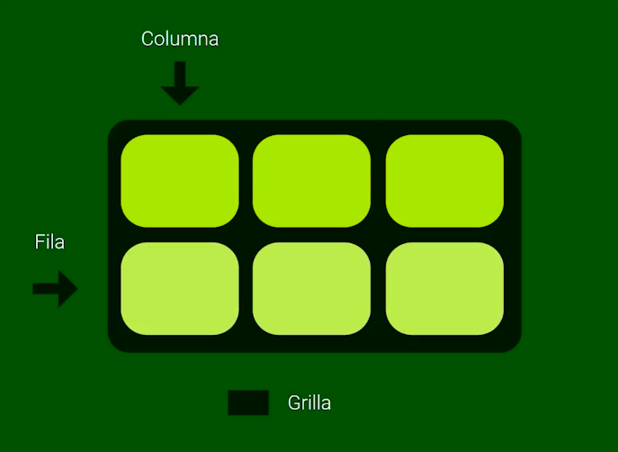

# Curso de CSS Grid Básico

# Introducción a Grid

## ¿Qué es CSS Grid Layout?

Es una especificación de CSS que nacio por la necesidad de hacer layouts mucho más dinamicos.

CSS Grid introdujo un sistema de grilla que es una cuadricula con columnas (columns) y filas (rows), con ellas podemos ubicar elementos de manera más fácil.

## Conceptos para comenzar

- **Contenedor**: Es el elemento que se va a convertir en una grilla.
- **Item**: Son los elementos que estan dentro del contenedor, estos elementos pueden ser de cualquier tipo como links, botones, imagenes, etc. Todos ellos se convertiran en **grid items**, esto quieres decir que por defecto van a tener propiedades que los ayudan a trabajar muy bien con nuestro sistema de grilla.
- **Líneas**: son los elementos que limitan o dividen las filas o columnas de una grilla.
- **Celda**: Es la unidadminima que nosotros podemos tener en una grilla, esta delimitada por 4 lineas y normalmente solo ocupa 1 fila y 1 columna.
- **Track**: Es un grupo de celdas, que solo puede estar en una fila o en una misma columna
- **Área**: Es un grupo de celdas, estas pueden usar varias filas o varias columnas a la vez.

# Propiedades de Grid

## Propiedades del contenedor

**Display grid**: Define el elemento como contenedor de cuadrícula y establece un nuevo contexto de formato de cuadrícula para su contenido.

g**rid-template-columns y grid-template-rows**: Define las columnas y filas de la cuadrícula con una lista de valores separados por espacios. Los valores representan el tamaño de la pista y el espacio entre ellos representa la línea de la cuadrícula.

**Gaps**: Es un espacio entre filas y columnas. 

**Grid-auto-flow**: Nos permite cambiar el orden en el que estan los grid items, este valor por defecto es row (fila), pero lo podemos cambiar.

## Propiedades de alineación

**Propiedades de alineación del contenedor:**

Estas propiedades son las que ajustan la grilla completa al espacio en la que ella vive. No tiene que ver nada con los elementos. 

- **Justify-content**
- **Align-items**
- **Place-items**

**Propiedades de alineación de los ítems:** 

- **Justify-items**: Nos ayuda a ordenar de manera horizontal en el espacio que tenemos.
- **Align-items**: Nos ayuda a alinear de manera verticar.
- **Place-items**: Es la mezcla de justify-items y align-items.

Además de estas propiedades de alineación, tenemos otras que dan directamente propiedades a los grid items, estas son:

Se usa como propiedades en los items y no en el contenedor.

- **Justify-self**
- **Align-self**
- **Place-self**

## Propiedades de ubicación

Para las columnas las propiedades que nos van a ayudar son:

- **grid-column-start**: Con esta propiedad nosotros vamos a decirle al elemento en que linea de columna debe comenzar.
- **grid-column-end**: Con esta propiedad nosotros vamos a decirle  al elemento hasta que linea de la columna va a llegar.
- **grid-column**: Es una mezcla de grid-column-start y grid-column-end. Los valores que necesita son el valor inicial y el valor final, estos van separados de un "/" (diagonal).

Para las filas las propiedades son iguales, solo que vamos a trabajar en las filas:

- **grid-row-start**
- **grid-row-end**
- **grid-row**

Además de estas propiedades, tenemos:

- **grid-area**: Con esta propiedad declaramos solo una vez donde va a comenzar tanto en columna como en fila y donde va a terminar tanto en columna como en fila.
    
    Podemos también dar nombres a ciertos espacios de la grilla.
    

# Power ups de Grid

## Funciones especiales

- **minmax**: Esta función lo que nos ayuda es a declarar un tamaño minimo y maximo de una celda.
- **repeat**: Nos permite declarar una celda que se repita varias veces, esto nos ayuda a no repetir código.

## Keywords especiales

- **fr**: Es una nueva unidad que se usa en CSS Grid que se usa para darle ancho o alto a filas y columnas. 1fr representa una fraccion del total de columnas o filas.
- **min-content**: Ajusta el ancho de la celda lo mínimo posible sin romper su contenido.
- **max-content**: Ajusta el ancho de la celda lo máximo posible para mostrar su contenido.
- **auto-fill**: Agrega columnas “fantasma” que rellenan el espacio sobrante del contenedor.
- **auto-fit**: Ensancha las columnas para que ocupen todo el espacio del contenedor.
