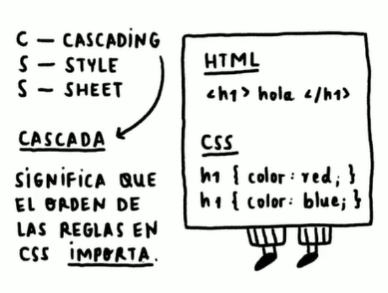
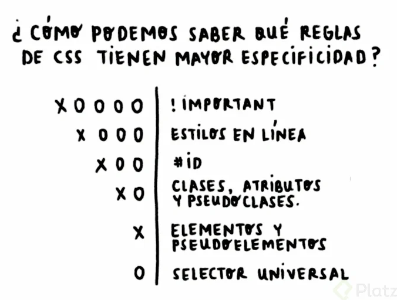
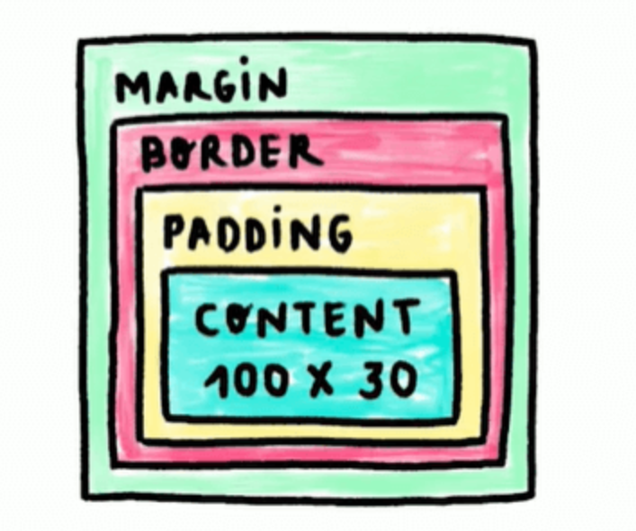
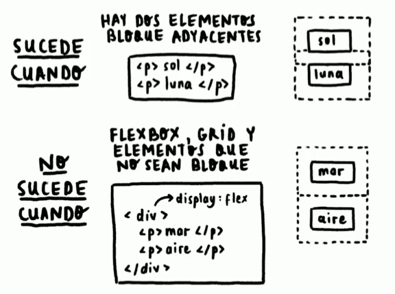

# Curso Frontend Developer

## 1. ¿Qué es HTML y CSS? ¿Para qué sirven?

La web se construye mediante tres tecnologías esenciales: HTML, CSS y JavaScript. Estos tres lenguajes son las bases en que una aplicación o página web está construida.

Por el momento, omitiremos el lenguaje de programación JavaScript.

### ¿Qué es HTML?

El Lenguaje de Marcado de Hipertexto o HTML por sus siglas en inglés (HyperText Markup Language) es el código para construir la estructura de una página web.

En otras palabras, HTML es el esqueleto con el cual definimos cada elemento que compone la página web, así como: enlaces, párrafos, títulos, botones, imágenes, formularios, entre otros.

### ¿Qué es CSS?

El lenguaje de Hojas de Estilos en Cascada o CSS por sus siglas en inglés (Cascade Style Sheets) es el código para describir la presentación de los elementos de la página web, los que definimos con HTML.

### Para qué sirven las herramientas del navegador

Las herramientas del navegador son importantes para visualizar lo que ocurre con el código generado. Entre una de la opciones está identificar los elementos que están estructurados en la página web con sus respectivos estilos.

Las herramientas de desarrollador se despliegan con la combinación de teclas F12 / Ctrl + Shift + I / Cmd + Opt + I o clic derecho e “Inspeccionar” en tu navegador preferido (se recomienda Google Chrome).

## 2. Motores de render: de archivos a píxeles

Los motores de renderizado son programas que traducen nuestro código en un lenguaje que entienda el navegador, de esta manera el programa sabrá que es lo que tiene que mostrar por pantalla al usuario.

¿Cuáles son los motores del navegador?

Los navegadores tienen sus propios motores: 
* Chrome - Blink
* Edge - Edge HTML
* Safari - Webkit 
* Firefox - Gecko

Todos realizan esta compilación de manera diferente, pero con el mismo resultado, es decir, convierten los archivos a píxeles.

### Proceso de renderizado del motor del navegador

El motor del navegador realiza 5 pasos o procesos para compilar nuestro código hasta el renderizado por pantalla. Estos pasos son los siguientes:

1. Transforma los archivos a un árbol de objetos HTML o CSS, estos se denominan DOM (Document Object Model) y CSSDOM (Cascade Style Sheet Object Model), respectivamente. Cada nodo en el árbol es una representación de los elementos que contiene el archivo HTML o CSS.
2. Calcula el estilo correspondiente a cada nodo del DOM relacionado al CSSDOM.
3. Calcula las dimensiones de cada nodo y dónde va en la pantalla.
4. Pinta o renderiza los diferentes elementos como cajas o contenedores.
5. Agrupa todas las cajas en diferentes capas para convertirlas en una imagen que se renderiza en pantalla.

## 3. Anatomía de un documento HTML y sus elementos

1. Elementos HTML:
    Elementos son partes que conforman un archivo HTML.
    Estructura: Etiquetas de apertura y cierre, y contenido opcional.

2. Atributos HTML:
    Propiedades en etiquetas de apertura que manejan comportamiento.
    Valor envuelto en comillas.

3. Elementos Vacíos:
    Representados en una etiqueta de apertura, como la etiqueta de imagen .
    Pueden cerrarse con barra inclinada al final, por ejemplo, .

4. Anidamiento de Elementos HTML:
    Consiste en envolver etiquetas dentro de otras.
    Cajas que contienen elementos, padres e hijos.

5. Estructura Básica de un Documento HTML:
    Etiquetas principales: <!DOCTYPE html>, <html>, <head>, <body>.
    Doctype especifica la versión 5 de HTML.
    <html> es el elemento raíz, <head> contiene metainformación, <body> define el contenido.

6. Comentarios de HTML:
    Se establecen entre <!-- y -->.
    Pueden ser de una línea o varias líneas.

## 4. ¿Qué es HTML semántico?

El HTML semántico consiste en que cada elemento tenga su propia etiqueta que lo defina correctamente. Sin utilizar etiquetas muy generales, como 
 o .

### El problema con la etiqueta div

La etiqueta div define un bloque genérico de contenido, que no tiene ningún valor semántico. Se utiliza para elementos de diseño como contenedores.

### ¿Cuáles son las etiquetas semánticas?

Las etiquetas semánticas para definir una interfaz de una página web son:

* <header>: define el encabezado de la página (no confundir con <head>).
* <nav>: define una barra de navegación que incluye enlaces.
* <section>: define una sección de la página.
* <footer>: define un pie de página o de sección.
* <article>: define un artículo, el cual puede tener su propio encabezado, navegación, sección o pie de página.

Ahora que ya conoces las etiquetas semánticas, evita el uso excesivo de 
.

### Ventajas de utilizar HTML semántico

Las ventajas de utilizar un HTML semántico son:

* Ayuda a tu sitio a ser accesible
* Mejora tu posicionamiento (SEO)
* Código más claro, legible y mantenible
* Ayuda a buscadores (como Google) a encontrar tu página

## 5. Etiquetas de HTML más usadas

Layout:

    
: Diseño de la página.
    <body>, <header>, <footer>, etc.: Etiquetas base para el contenido.

Enlaces:

    <a>: Colocar links para redireccionar.

Textos:

    <h1>, <h2>, ..., <h6>: Importancia del texto.
    
: Estructurar párrafos.
    : Sin significado semántico, ayuda a diferenciar texto en un párrafo.

Formularios:

    <form>: Contenedor del formulario.
    <input>: Tipos variados.
    <label>: Texto que indica qué hacer con un input.
    <button>: Envía formularios y parte de otras secciones.

Lista:

    <ul>: Lista desordenada.
    <ol>: Lista ordenada.
    <li>: Elemento de lista.

referencia de etiquetas de html: htmlreference.io

## 6. Anatomía de una declaración CSS: selectores, propiedades y valores

Declaración de CSS:

    Estructura: Selector, Propiedad, Valor.
    Selector: Elemento al que se aplican estilos.
    Propiedad: Nombre del estilo de CSS.
    Valor: Valor que toma la propiedad.

Comentarios de CSS:

    Ignorados, entre /* y */.

Propiedades Iniciales de CSS:

    color: Color del texto.
    background-color: Color de fondo.
    font-size: Tamaño de la fuente.
    width: Anchura del elemento.
    height: Altura del elemento.

Medidas Iniciales:

    px: Longitud en píxeles.
    %: Porcentaje respecto a una medida base.

## 7. Tipos de selectores: básicos y combinadores

1. Selectores Básicos:

* Selector de Tipo: Selecciona elementos por nombre de etiqueta.

~~~css

div {
  /* Estilos para todos los div en el documento */
}
~~~

* Selector de Clase: Selecciona elementos por el valor del atributo class.

~~~html

 Soy una carta 

~~~
~~~css

.card {
  /* Estilos para todas las etiquetas con la clase "card" */
}
~~~

* Selector de ID: Selecciona el único elemento con el atributo id.

~~~html

<button id="eliminar"> Eliminar </button>
~~~

~~~css

#eliminar {
  /* Estilos para la única etiqueta con el id "eliminar" */
}
~~~

* Selector de Atributo: Selecciona elementos por un atributo y valor específicos.

~~~html

<a href="https://platzi.com"> Ir a Platzi </a>
~~~
~~~css

a[href="https://platzi.com"] {
  /* Estilos para todas las etiquetas <a> con href="https://platzi.com" */
}
~~~

* Selector Universal: Selecciona todos los elementos del documento.

~~~css

    * {
      /* Estilos para todos los elementos */
    }
~~~

colores de html: https://htmlcolorcodes.com/es/

2. Selectores Combinadores:

Combinador de Descendientes: Selecciona todos los elementos hijos del selector izquierdo.

~~~css

padre hijos {
  /* Estilos para todos los hijos del padre */
}
~~~

~~~css

div p {
  /* Estilos para todos los hijos 
 de 
 */
}
~~~

Combinador de Hijo Directo: Selecciona elementos hijos directos del selector izquierdo.

~~~css

padre > hijos_directos {
  /* Estilos para todos los hijos directos del padre */
}
~~~

~~~css

div > p {
  /* Estilos para todos los hijos directos 
 de 
 */
}
~~~
Combinador de Elemento Adyacente: Selecciona elementos adyacentes al selector izquierdo.

~~~css

elemento + adyacente {
  /* Estilos para elementos adyacentes */
}
~~~

~~~css

div + p {
  /* Estilos para todos los 
 adyacentes a 
 */
}
~~~

Combinador General de Hermanos: Selecciona elementos hermanos del selector izquierdo.

~~~css

elemento ~ hermanos {
  /* Estilos para elementos hermanos */
}
~~~

~~~css

div ~ p {
  /* Estilos para todos los 
 hermanos de 
 */
}
~~~

## 8. Tipos de selectores: pseudoclases y pseudoelementos

1. Pseudoclases:

Definición: Las pseudoclases cambian el estilo de un estado especial de un elemento.

Sintaxis:

~~~css

selector : pseudoclase { 
    propiedad: valor;
}
~~~

Ejemplos de Pseudoclases
    :hover: Representa el estado cuando el cursor está encima del elemento.
    :active: Representa el estado de un elemento no visitado.
    :visited: Representa el estado de un elemento ya visitado.
    :not(): Representa el estado cuando no coinciden los selectores especificados.
    :nth-child(): Representa el estado cuando coinciden los hijos según el valor indicado.

2. Pseudoelementos:

    Definición: Los pseudoelementos cambian el estilo de una parte específica de un elemento.

    Sintaxis:

~~~css

selector :: pseudo-elemento { 
    propiedad: valor;
}
~~~

Ejemplos de Pseudoelementos:

    ::before: Agrega contenido antes del elemento.
    ::after: Agrega contenido después del elemento.
    ::first-letter: Añade estilos a la primera letra del texto de cualquier elemento.

* Para mas información: https://css-tricks.com/pseudo-class-selectors/

## 9. Cascada y especificidad en CSS

En algún punto, cuando estés creando una página web, te encontrarás con problemas con los estilos, por ejemplo:

    ¿Por qué no se aplica el color que le estoy poniendo?
    ¿Por qué este elemento se comporta de manera diferente?

Probablemente, sea un inconveniente de cascada o especificidad.

### Qué es la cascada en CSS

La cascada es el concepto que determina qué estilos se colocan sobre otros, priorizando a aquellos que se encuentren más abajo del código. Recordarás que CSS es la abreviación de Cascade Style Sheets, que traducido es hojas de estilos en Cascada.

### Qué es especificidad en CSS

La especificidad consiste en dar un valor a una regla CSS sobre qué tan específico es el estilo, esto para que los navegadores puedan saber qué estilos aplicar sobre otros, independientemente de dónde se encuentren en el código. El estilo se aplicará donde la especificidad sea mayor.
Tipos de especificidad en CSS

Existen 6 tipos de especificidad con su respectivo valor, donde X es la cantidad de estilos que lo contienen. Mira la siguiente imagen:

### Especificidad en selectores

El tema de los selectores ya lo conoces, por lo tanto, los selectores de tipo ID son más específicos que las clases, atributos y pseudoclases. Estas últimas son más específicas que los elementos y pseudoelementos. El selector universal tiene una especificidad de 0.

En un proyecto deberías evitar los !important y estilos en línea, para trabajar únicamente con la especificidad de los selectores. Sin embargo, debes tener presente que los selectores combinadores suman la especificidad de cada selector básico para obtener la especificidad total de la regla CSS.

## 10. Tipos de display más usados: block, inline e inline-block

La propiedad display establece el tipo de visualización de los elementos HTML sin afectar el flujo normal de los elementos.

1. Visualización en bloque (block):
    Elemento ocupa todo el espacio disponible.
    Siguiente elemento se sitúa debajo.
    Pueden tener medidas de anchura y altura.
    Admite todas las propiedades del modelo de caja.

Ejemplo: display block

2. Visualización en línea (inline):
    Elemento ocupa espacio del contenido.
    Siguiente elemento se sitúa a la derecha en la misma línea.
    No permite medidas de anchura y altura.
    Solo funciona la propiedad margin en el eje horizontal.

Ejemplo: display inline

3. Visualización bloque y línea (inline-block):
    Combina ventajas de bloque y línea.
    Permite medidas y propiedades del modelo de caja.
    Elemento siguiente en la misma línea; si excede, va a la siguiente línea.

Ejemplo: display inline-block

4. Visualización nula (none):
    Desactiva la visualización del elemento.
    Hace que el elemento sea invisible, como si no existiera.

## 11. Tipos de display más usados: flexbox y CSS grid

Flexbox y Grid son herramientas de diseño para organizar elementos en interfaces. Flexbox trabaja en un solo eje, recomendado después de aprender CSS básico:

~~~css
Copy code
.container {
  display: flex;
  justify-content: space-between;
}
~~~

Grid organiza en dos ejes, ideal después de comprender Flexbox:

~~~css
Copy code
.container {
  display: grid;
  grid-template-columns: repeat(3, 1fr);
  grid-gap: 10px;
}
~~~

Ambas son esenciales para interfaces adaptables (responsive design). El Curso de Diseño Web con CSS Grid y Flexbox en Platzi enseña a combinarlas eficientemente. Practicar con proyectos refuerza estos conceptos.

## 12. Modelo de caja

El modelo de caja se compone de cuatro elementos: margin, border, padding y contenido.

Si entras a las herramientas de desarrollador de tu navegador y señalas un elemento HTML, en la sección de estilos te aparecerá una vista parecida a la anterior imagen, este es el modelo de caja del elemento señalado.

## 13. Colapso de márgenes

El colapso de márgenes sucede cuando dos elementos bloque adyacentes tienen un determinado valor de margin, entonces estos márgenes se solapan en un solo valor, el mayor de ambos.

## 14. Posicionamiento en CSS

El posicionamiento en CSS consiste en cómo un elemento se situará, con respecto a su elemento padre y al flujo normal del documento. El flujo normal del documento es el orden de los elementos establecidos en el HTML.

La posición del elemento se la define con la propiedad ~position~, mediante los siguientes valores:

* static
* relative
* absolute
* fixed
* sticky

1. Posición estática:

Valor por defecto para todos los elementos HTML.
Respeta el flujo normal del documento.
Las propiedades de posición no pueden ser establecidas.

2. Posición relative:

Respeta el flujo normal del documento.
Las propiedades de posición pueden ser establecidas.

3. Posición absoluta:

Quita al elemento del flujo normal del documento.
Las propiedades de posición pueden ser establecidas.
Desplazamiento con respecto al elemento padre más cercano con posición relativa. Si no existe, se desplaza con respecto al elemento raíz.

4. Posición fija:

Quita al elemento del flujo normal del documento y lo fija en un lugar.
Las propiedades de posición pueden ser establecidas.

5. Posición variable fija (sticky):

Quita al elemento del flujo normal del documento y lo fija en un lugar mientras su contenedor sea visible.
Las propiedades de posición pueden ser establecidas.
El desplazamiento se basa en el contexto de apilamiento y el eje Z de la pantalla.

## 15. Z-index y el contexto de apilamiento

1. Contexto de Apilamiento:

Superposición de capas o elementos a lo largo del eje Z del navegador.
Importante para evitar que un elemento oculte a otro.

2. Planos y Ejes del Navegador:

Navegador constituido por tres planos y ejes: X (ancho), Y (alto), Z (profundidad).

Eje X positivo hacia la derecha, eje Y positivo hacia abajo, eje Z positivo hacia el usuario.

3. Importancia de Planos y Ejes:

Cruciales para mover elementos HTML de un punto inicial a uno final.
Propiedad z-index:

4. Configura el contexto de apilamiento.
Por defecto, todos los elementos tienen un valor "auto" determinado por la estructura HTML.
Valor positivo sitúa el elemento por delante, valor negativo lo coloca por detrás.

5. Relación de z-index:

Un elemento con un z-index mayor estará por delante.
Un elemento con z-index menor hará que sus hijos nunca estén por encima, incluso si tienen un z-index mayor.

6. Ejemplo de Contextos de Apilamiento:

Ejemplo visual muestra que el contexto de apilamiento puede afectar la posición visual, incluso con z-index mayor.
El contexto de apilamiento del elemento padre influye en la relación de z-index entre elementos.

## 16. Propiedades y valores de CSS más usados

Las propiedades CSS más usadas son las siguientes, separadas en secciones comunes, algunas ya las conocemos:

    Display
    Margin
    Padding
    Border
    Width
    Height
    Color
    Background

También, si deseas conocer todas las etiquetas existentes, puedes revisar el sitio web CSS: https://cssreference.io/

### Propiedades de textos

Las propiedades para manipular los textos y tipografía son los siguientes:

    font-size: establece un tamaño de fuente.
    font-weight: establece el resaltado del texto, con valores de 100 a 900 en intervalos de 100; donde 100 es delgada y 900 es negrita.
    font-family: establece el tipo de fuente.
    text-align: establece la posición del texto: right, left, center y justify.
    color: establece el color del texto.

Bordes redondeados

La propiedad que establece bordes redondeados es: border-radius.

    Ejemplo de bordes redondeados

## 17. Unidades de medida

Las unidades de medida establecen una longitud para un determinado elemento o tipografía. Existen dos tipos de medidas: absolutas y relativas.

### Medidas Absolutas

Las medidas absolutas son valores fijos, como los píxeles (px). Algunas unidades y equivalencias son:

- px: píxeles (1 px = 1/96 in)
- cm: centímetros (1 cm = 96/2.54 px)
- mm: milímetros (1 mm = 1/10 cm)
- Q: cuartos de milímetros (1 Q = 1/4 mm)
- in: pulgadas (1 in = 2.54 cm = 96 px)
- pc: picas (1 pc = 1/6 in)
- pt: puntos (1 pt = 1/72 in)

~~~css
p {
    font-size: 18px;
}
~~~

### Medidas Relativas

Las medidas relativas son valores variables y dependen de un valor externo:

- em: el elemento que lo contiene
- rem: el elemento raíz
- vw: 1% del ancho de la pantalla (view width)
- vh: 1% de la altura de la pantalla (view height)
- vmin: 1% de la dimensión más pequeña de la pantalla
- vmax: 1% de la dimensión más grande de la pantalla
- ch: anchura del caracter "0" del elemento que lo contiene
- lh: altura de la línea del elemento que lo contiene

~~~css
main {
    background-color: red;
    width: 100%; /*Unidad relativa*/
    height: 500px;
}
~~~

### Diferencia entre rem y em

La medida em depende del elemento que lo contiene, mientras que rem depende del elemento raíz.

#### Ejemplo de medida em

En las herramientas del desarrollador, te muestra el tamaño de la fuente (font) en píxeles.

#### Ejemplo de medida rem

Diferencia entre porcentajes y la anchura y altura de la pantalla:

- Porcentajes: tamaño respecto al elemento padre.
- vw y vh: tamaño respecto al total de la pantalla.

### Problema con las Medidas de Texto

Los navegadores permiten cambiar el tamaño del texto. Las medidas absolutas no cambian, pero las relativas sí, siendo útiles para accesibilidad, especialmente rem.

Para evitar problemas con rem (16px), se puede ajustar el valor del elemento raíz a 62.5% para que 1rem sea igual a 10px.

~~~css
html {
    font-size: 62.5%;
}
~~~

## 18. Responsive Design

El diseño responsivo (Responsive Design) implica un conjunto de herramientas para asegurar que un sitio web se visualice correctamente en distintas pantallas, abarcando elementos como imágenes, tipografía, internacionalización, entre otros.

En la actualidad, la mayoría de las visitas a sitios web provienen de dispositivos móviles, lo que destaca la importancia de garantizar la responsividad del sitio para optimizar las ganancias.

### Media Queries

Las media queries son reglas CSS que definen comportamientos o estilos distintos en diferentes rangos de pantalla, como escritorios, tablets y celulares. Se dividen en dos tipos:

- **max-width / max-height:** Establece un rango máximo para cierto comportamiento.
- **min-width / min-height:** Establece un rango mínimo para cierto comportamiento.

Estos actúan como condicionales, aplicando estilos según se cumplan las condiciones.

### Estructura de Media Queries

La estructura básica de una media querie comienza con `@media`, seguido del tipo y rango, con reglas CSS dentro de ese bloque.

### Ejemplo:

~~~css
@media (max-width: 750px){
    div {
        color: red;
    }
    p {
        background-color: red;
    }
}
~~~

## 19. ¿Qué son las arquitecturas CSS? ¿Para qué sirven?

Las arquitecturas CSS consisten en manejar el código CSS con una serie de reglas y patrones para facilitar su lectura, mantenibilidad y escabilidad.

El código que has manejado no se asemeja a la realidad, pues deberás manejar varios cientos o miles de líneas de código. Las arquitecturas CSS se encargan de manejar una norma en el código para que cualquiera pueda añadir o quitar funcionalidad sin mucho trabajo.

### Objetivos de las arquitecturas de CSS son:

* Ser predecible: el código debe ser lo menos complejo posible.
* Reutilizable: el código debe ser lo menos redundante, para evitar problemas con la especificidad.
* Mantenible: el código debe ser lo más fácil de manejar para añadir o quitar estilos.
* Escalable: el código debe ser capaz de crecer.

### Buenas prácticas de las arquitecturas de CSS

Las buenas prácticas de las arquitecturas de CSS son:

* Lineamientos y estándares: definir normas en tu grupo de trabajo de cómo estará escrito el código.
* Documentación: establecer una breve explicación del código y de los lineamientos, esto sirve especialmente para nuevas personas se familiaricen con lo que deben hacer.
* Componentes: establecer de manera componetizada cada uno de los elementos de tu página, es decir, manejarlos por partes para después unirlos en un todo.

## 20. OOCSS, BEM, SMACSS, ITCSS y Atomic Design

## CSS Orientado a Objetos

### Arquitectura OOCSS (Object Oriented CSS)

La arquitectura OOCSS consiste en separar la estructura principal y la apariencia. Utiliza objetos como estructuras principales unidas en una máscara, permitiendo cambios en la apariencia sin afectar la estructura.

## BEM: Bloque, Elemento y Modificador

### Arquitectura BEM (Block-Element-Modifier)

BEM organiza el código en bloques, elementos y modificadores:

- **Bloque:** Estructura principal que contiene varios elementos.
- **Elemento:** Elemento HTML referenciado por el bloque.
- **Modificador:** Estilo específico para el elemento, como un color diferente.

## Arquitectura Escalable y Modular de CSS

### Arquitectura SMACSS (Scalable and Modular Architecture for CSS)

SMACSS indica el orden de los componentes en carpetas para una página web con estilos:

- **Base:** Elementos base como botones y títulos.
- **Layout:** Estructura de la página, relacionada con Responsive Design.
- **Módulos:** Elementos que contienen a los elementos base.
- **Estado:** Estilos relacionados con el comportamiento de elementos.
- **Temas:** Conjunto de estilos que definen la página web.

## Triángulo Invertido de CSS

### Arquitectura ITCSS (Inverted Triangle CSS)

ITCSS separa archivos del proyecto para manejar especificidad, claridad y magnitud, organizando ajustes, herramientas y elementos.

## Diseño Atómico

### Arquitectura Atomic Design

Atomic Design maneja elementos como estructuras mínimas:

- **Átomos:** Estructuras mínimas como botones y enlaces.
- **Moléculas:** Unión de átomos.
- **Organismos:** Unión de moléculas.
- **Plantillas:** Unión de organismos.
- **Páginas:** Unión de plantillas.

LIBRO RECOMENDADO

CSS SECRETS

[https://vdoc.pub/download/css-secrets-better-solutions-to-everyday-web-design-problems-6fun4hhc1mr0](https://vdoc.pub/download/css-secrets-better-solutions-to-everyday-web-design-problems-6fun4hhc1mr0)

**La siguiente información fue tomada de:**

**Eniun [https://www.eniun.com/resumen-tabla-propiedades-css-valores/](https://www.eniun.com/resumen-tabla-propiedades-css-valores/)**

## Lecturas complementarias

HTML

[https://allthetags.com/](https://allthetags.com/)

[https://htmlreference.io/](https://htmlreference.io/)

[https://htmlcolorcodes.com/es/](https://htmlcolorcodes.com/es/)

CSS

[https://cssreference.io/](https://cssreference.io/)

[https://9elements.com/bem-cheat-sheet/#card+i](https://9elements.com/bem-cheat-sheet/#card+i)

[https://brandcolors.net/](https://brandcolors.net/)

[https://specificity.keegan.st/](https://specificity.keegan.st/)

[https://css-tricks.com/snippets/css/a-guide-to-flexbox/](https://css-tricks.com/snippets/css/a-guide-to-flexbox/)

[https://css-tricks.com/snippets/css/complete-guide-grid/](https://css-tricks.com/snippets/css/complete-guide-grid/)

Challenges

[https://www.codewell.cc/challenges](https://www.codewell.cc/challenges)

[https://cssbattle.dev/](https://cssbattle.dev/)

[https://codepen.io/](https://codepen.io/)

[https://www.frontendmentor.io/](https://www.frontendmentor.io/)

Juega y aprende

[https://flexboxfroggy.com/#es](https://flexboxfroggy.com/#es)

[https://cssgridgarden.com/#es](https://cssgridgarden.com/#es)

[https://flukeout.github.io/](https://flukeout.github.io/)

[https://mastery.games/flexboxzombies/](https://mastery.games/flexboxzombies/)

[https://codingfantasy.com/games/css-grid-attack](https://codingfantasy.com/games/css-grid-attack)
