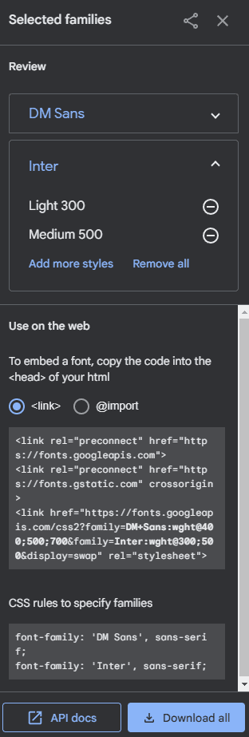
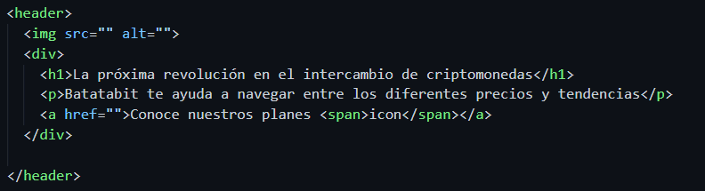
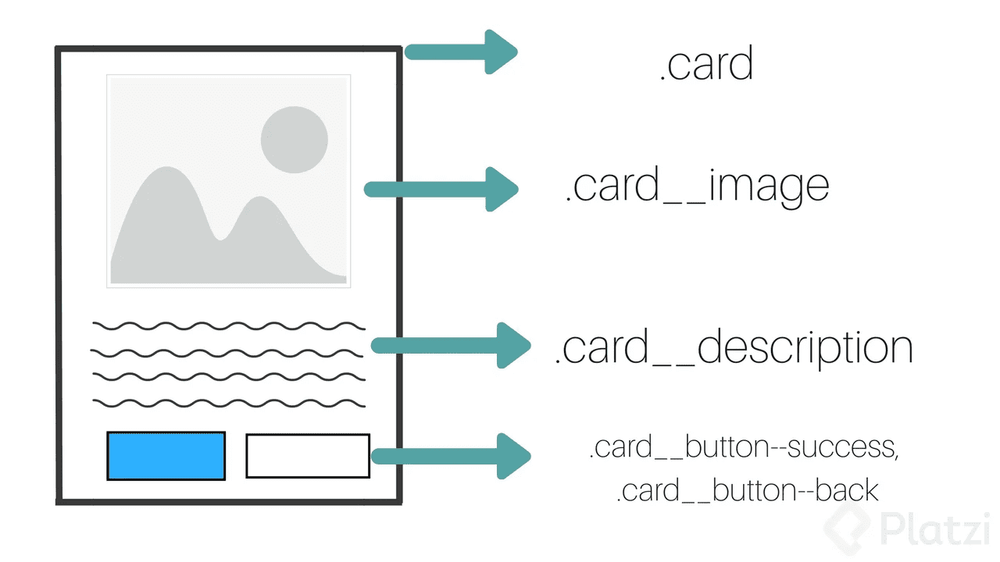

# Curso de Responsive Design: Maquetación Mobile First

# Setup inicial

## Analizando el diseño

Para este producto, vamos a partir de un analisis con Figma.

Figma es una herramienta de diseño para poder construir wireframes con sus especificaciones, esto nos va a servir para tener un punto de partida y empezar a maquetar el sitio web.

[Bata Bit](https://www.figma.com/proto/sMmlQaZldfDcLERYYWe6h4/Bata-Bit?node-id=44%3A594&scaling=scale-down)

Acá tenemos el diseño de una landing page y es lo que tenemos que lograr construir.

Los estilos de CSS que vemos en Figma hay que tomarlos como sugerencia pero no deberiamos copiar y pegarlos en nuestro proyecto porque los estilos que maneja Figma son diferentes.

Lo que si deberiamos tomar son las fuentes y los colores. El resto lo vamos a generar nosotros.

##  El valor de Mobile First

Beneficiados del Mobile first:

- Desarrolladores: Ayuda a escalar y optimizar mejor un sitio
- Usuarios: En un diseño móvil se busca la simplicidad. Cada vez existen más usuarios y un mobile first consume menos datos y potencia del procesador.
- Empresas y negocios: Google les dará mejor preferencia de SEO

## Arquitectura inicial

La arquitectura web se puede definir como la forma en que las páginas de un sitio web están estructuradas y enlazadas entre sí *(de manera lógica y coherente)*. Una arquitectura web ideal ayuda a los usuarios y a los motores de búsqueda a encontrar fácilmente lo que están buscando en un sitio web.

## Arquitectura del proyecto:

- Header
- 4 secciones
- Footer

Creamos el archivo index.html 

## Assets de nuestro proyecto

Por buena practica, el proyecto no debería manejar más de dos fuentes

Nos fijamos la fuente que queremos utilizar y Figma nos dice el nombre, ese nombre después lo buscamos en google fonts 

Podemos agregarlas via link o import, vamos a usar el link ya que es mejor practica

Las copiamos y pegamos en el head.

## *Estilos base

Tenemos nuestro estilos base aplicados, variables que vamos a utilizar como colores los cuales conseguimos de nuestro modelo en Figma, reiniciamos los estilos con el selector universal y aplicamos la fuente que elegimos.

# Sección de Header

## Maquetación del header

Recomendaciones:
1. solo se debe tener un h1 por cada pagina ya que eso ayudará en el SEO y ademas que no debe tener mas de 60 caracteres

## Implementando BEM

Recomendaciones: 

1. usar el sistema de especificidad de css, donde es saber si va haber una etiqueta duplicada
2. especificacion de BEM https://getbem.com/

La metodología BEM pequeño repaso:

~~~css
.header--title-container {
	width: 90%;
	min-width: 288px;
	max-width: 900px;
	height: 218px;
	margin-top: 40px;
	text-align: center;
	align-self: center;
}
~~~

## Uso de linear-gradient

De Figma obtenemos los colores base 

Agregamos la siguiente línae en la equeta de header 

~~~css
background: linear-gradient(207.8deg, ##201e1c 16.69%, ##f7931a 100%);
~~~

### Ajustando color de las fuentes en h1 y parrafo

Conseguimos todas las configuraciones desde Figma y las llevamos a CSS

Por buenas prácticas no podemos tener más de un H1 entonces podemos aplicar los estilos solo por la etiqueta h1 pero para ser más especificos y evitar problemas utilizamos lo siguiente: llamo la clase del header y dentro la etiqueta h1

~~~css
.header--title-container h1{
  font-size: 2.4rem;
  font-weight: bold;
  line-height: 2.6rem;
  color: var(--just-white);
}
~~~

Ahora para la etiquete 

~~~css
.header--title-container p{
  margin-top: 25px;
  font-size: 1.4rem;
  font-weight: 500;
  line-height: 1.8rem;
  color: var(--soft-orange);
}
~~~

## Uso de position para botón flotante

~~~css
.header--title-container .header--button{
  position: absolute;
  left: calc(50% - 114.5px);
  top: 270px;
  display: block;
  margin-top: 35px;
  padding: 15px;
  width: 229px;
  height: 48px;
  background-color: var(--off-white);
  /* Sombra */
   box-shadow: 0px 4px 8px rgba(89, 73, 30, 0.16);
   border: none;
   border-radius: 5px;
   font-size: 1.4rem;
   font-weight: bold;
   text-decoration: none;
   color: var(--black);
}
~~~

### Agregar icono en el span

~~~html
<header>
    
    

        <h1>La proxima revolución en el intercambio de criptomonedas.</h1>
        
Batatabit te ayuda a navegar entre los diferentes precios y tendencias.

        <a href="" class="header--button">Conoce Nuestros Planes </a>
    

</header>
~~~

~~~css
.header--button span {
  display: inline-block;
  width: 13px;
  height: 8px;
  margin-left: 10px;
  background-image: url('./assets/icons/down-arrow.svg');
}
~~~

## Estructura base de la sección de intercambio

### Primer section del main

~~~html
<main>
    <section class="main-exchange-container">
        

        

            <h2>Visibilizamos todas las tasas de cambio.</h2>
            
Traemos información en tiempo real de las casas de cambio y las monedas más importantes del mundo.

        

        <section class="main-tables-container">
            

            

        </section>
    </section>|
    <section></section>
    <section></section>
    <section></section>
</main>
~~~

### Estilos:

~~~css
main {
	width: 100%;
	height: auto;
	background-color: var(--off-white);
	min-width: 320px;
}

.main-exchange-container {
	width: 100%;
	height: auto;
	padding-top: 80px;
	padding-bottom: 30px;
	text-align: center;
}

.main-exchange-container--title {
	width: 90%;
	/* min-width: 288px; */
	max-width: 900px;
	margin: 0 auto;
}
~~~

## Imagen de background

~~~
.main-exchange-container .backgroundImg {
	width: 200px;
	height: 200px;
	margin: 0 auto;
	margin-bottom: 50px;
	background-image: url('./assets/imgs/Bitcoin.svg');
	background-size: cover;
	background-position: center;
	background-repeat: no-repeat;
}
~~~

## Estructura de tabla de monedas

### Tablas en el HTML

## Estilos base de tabla de monedas

## Detallando estilos de tabla de monedas

Para modificar los border de cada tabla hay que ir dato por dato ya que al contenedor total no se apreciarian los estilos.

~~~css
.currency-table--container .table__top-left{
  border-radius: 15px 0 0 ;
}

.currency-table--container .table__top-right{
  border-radius: 0 15px 0 0;
}

.currency-table--container .table__bottom-left{
  border-radius: 0 0 0 15px;
}

.currency-table--container .table__bottom-right {
  border-radius: 0 0 15px 0;
}

.currency-table--container .table__right{
  font-size: 1.4 rem;
  font-weight: normal;
  line-height: 1.7rem;
  color: ##757575;
}
~~~

### Agregamos la flechita abajo de caida

~~~css
.currency-table--container .down{
  display: inline-block;
  width: 15px;
  height: 15px;
  margin-left: 10px;
  background-image: url(./assets/icons/trending-down.svg);
  background-size: cover;
  background-position: center;
  background-repeat: no-repeat;
}
~~~

Lo mismo hago con los otras 3 monedas y para Ehereum que tiene flecha positivo le agrego un span con la clase up y los estilos de la misma manera

~~~css
.currency-table--container .up{
  display: inline-block;
  width: 15px;
  height: 15px;
  margin-left: 10px;
  background-image: url(./assets/icons/trending-up.svg);
  background-size: cover;
  background-position: center;
  background-repeat: no-repeat;
}
~~~

## Finalizando estilos de tabla de monedas

~~~css
.currency-table--date {
  width: 190px;
  height: 30px;
  margin: 0 auto;
  margin-top: 15px;
  padding: 8px;
  background-color: var(--soft-orange);
  border-radius: 8px;
}

.currency-table--date p{
  font-size: 1.2rem;
	font-weight: 300;
  line-height: 1.5rem;
  color: var(--warm-black);
}
~~~

## Estructura base de la sección de beneficios

~~~html
<section class="main-product-detail">
      
      

        <h2>Creamos un producto sin compartición.</h2>
        
Confiable y diseñado para su uso diario.

      

      <section class="product-cards--container">
        <article class="product-detail-card">
          
          
Tiempo real

          
Nuestra API toma información minuto a minuto sobre las tasas que más determinan el comportamiento

        </article>
      </section>
    </section>
~~~

## Estilos de la sección de beneficios

~~~css
.main-product-detail {
  position: relative;
  width: 100%;
  min-width: 320px;
  height: auto;
  padding: 20px 10px;
  background-color: var(--warm-black);
}

.product-detail--batata-logo{
  position: absolute;
  width: 40px;
  height: 25px;
  top: -10px;
  left: calc(50% - 20px);
  background-image: url(./assets/icons/batata.svg);
}

.product-detail--title {
  width: 90%;
  min-width: 288px;
  height: auto;
  margin: 0 auto;
  margin-top: 50px;
  text-align: center;
}

.product-detail--title h2{
  margin-bottom: 20px;
  font-size: 2.4rem;
  font-weight: bold;
  line-height: 2.6rem;
  color: var(--just-white);
}

.product-detail--title p {
  margin-bottom: 20px;
  font-size: 1.4rem;
  font-weight: 500;
  line-height: 1.8rem;
  color: ##808080;
}
~~~

## Maquetando tarjetas de beneficios

~~~css
.product-detail--card{
  width: 90%;
  min-width: 288px;
  max-width: 400px;
  height: 150px;
  margin: 15px auto;
  padding: 15px;
  background-color: var(--black);
  border-radius: 5px;
  box-shadow: 0 4px 8px rgba(0, 0, 0 , 0.16);
}

.product-detail--card .clock{
  display: inline-block;
  width: 20px;
  height: 20px;
  margin-bottom: 10px;
  background-image: url("./assets/icons/clock.svg");
  background-size: cover;
  background-position: center;
  background-repeat: no-repeat;
}

.product--card-title {
  margin-bottom: 15px;
  font-size: 1.8rem;
  font-weight: bold;
  line-height: 1.8rem;
  color: var(--just-white);
}

.product--card-body{
  font-size: 1.4rem;
  font-weight: 500;
  line-height: 1.8rem;
  color: ##808080;
}
~~~

## Maquetando sección comodín

~~~html
<section class="bitcoin-img-container">
      <h2>Conócelo hoy.</h2>
    </section>
~~~

### Imágen

~~~css
.bitcoin-img-container{
  width: 100%;
  min-width: 320px;
  height: 50vh;
  background-image: url(./assets/img/bitcoinbaby2x.jpg);
  background-position: center;
  background-size: cover;
  background-repeat: no-repeat;
	text-align:center;
}
~~~

### Texto

~~~css
.bitcoin-img-container{
  padding-top: 60px;
  font-size: 2.4rem;
  font-weight: bold;
  line-height: 2.6rem;
  color: var(--just-white);
}
~~~

## Estructura de sección de planes

~~~html
<!-- seccion de planes -->
    <section id="plans" class="main-plans-container">
      

        <h2>Escoge el plan que mejor se ajuste a ti.</h2>
        
Cualquier plan te da acceso completo a nuestra plataforma

      

      <!-- contenedor de tarjetas -->
      <section class="plans-container--slider">
        <article class="plans-container--card">
          
Recomendado

          

            <h3>Pago Anual</h3>
            
$ 99

            
* Ahorras $129 comparado al plan mensual

            <button>Escoger este </button>
          

        </article>
      </section>
    </section>
~~~

## Aplicando estilos a sección de planes

~~~css
.plans--title {
  width: 90%;
  min-width: 288px;
  height: auto;
  margin: 0 auto;
  margin-bottom: 50px;
}

.plans--title h2{
  padding-top: 50px;  
  font-size: 2.4rem;
  font-weight: bold;
  line-height: 2.6rem;
  color: var(--black);
}

.plans--title p{
  padding-top: 30px;
  font-size: 1.4rem;
  font-weight: 500;
  line-height: 1.8rem;
  color: ##757575;
}
~~~

## Aplicando estilos a las tarjetas de la sección de planes

~~~css
.plans-container--card{
  position: relative;
  width: 70%;
  min-width: 230px;
  max-width: 300px;
  height: 250px;
  margin: 50px auto 0;
  padding: 0 15px;
  background-color: var(--just-white);
  border-radius: 15px;
  box-shadow: 0 4px 8px rgba(89,73,30, 0.16);
}
~~~

## Detallando estilos en tarjetas de planes

~~~css
.recommended {
  position: absolute;
  width: 120px;
  height: 31px;
  top: -15px;
  left: calc(50% - 60px);
  font-size: 1.2rem;
  background-color: var(--bitcoin-orange);
  border-radius: 8px;
  color: var(--just-white);
}

.plan-card--title{
  padding-top: 30px;
  font-size: 1.4rem;
  font-weight: 500;
  line-height: 1.8rem;
  color: black;
}

.plan-card--price{
  padding: 5px 0;
  font-size: 5.2rem;
  font-weight: bold;
  line-height: 5rem;
  color: black;
}

.plan-card--price span {
  font-size: 1.2rem;
  font-weight: 300;
  vertical-align: 25px;
}

.plan-card--saving {
  font-size: 1.2rem;
  color: ##757575;
}
~~~

## Aplicando estilos al botón de call to action

### Boton

~~~css
.plan-card--ca {
  width: 150px;
  height: 48px;
  margin-top: 20px;
  background-color: ##faf8f7;
  border: 2px solid var(--bitcoin-orange);
  border-radius: 4px;
  font-family: "DM Sans", sans-serif;
  font-size: 1.4rem;
  font-weight: bold;
  line-height: 1.8rem;
  color: var(--black);
}
~~~

### Span con el icono

~~~css
.plan-card--ca span{
  display: inline-block;
  width: 20px;
  height: 20px;
  background-image: url("assets/icons/orange-right-arrow.svg");
  vertical-align: text-bottom;
}
~~~

## Scroll horizontal con CSS

[overflow-x](https://developer.mozilla.org/en-US/docs/Web/CSS/overflow-x)

La propiedad de CSS overflow-x establece lo que se muestra cuando el contenido desborda los bordes izquierdo y derecho de un elemento a nivel de bloque. Puede que no sea nada, una barra de desplazamiento o el contenido adicional.

[overscroll-behavior](https://developer.mozilla.org/en-US/docs/Web/CSS/overscroll-behavior)

la propiedad de css overscroll-behabior establece lo que hace un navegador cuando alcanza el límite de un área de desplazamiento. Es una abreviatura de overscroll-behavior-x y overscroll-behavior-y.

[scroll-snap-type](https://developer.mozilla.org/en-US/docs/Web/CSS/scroll-snap-type)

La propiedad CSS scroll-snap-type establece qué tan estrictamente se aplican los puntos de snap en el contenedor de desplazamiento en caso de que haya uno

### Scroll

~~~css
.plans-container--slider{
  display: flex;
  height: 316px;
  overflow-x: scroll;
  overscroll-behavior-x: contain;
  scroll-snap-type: x proximity;
}
~~~

## Footer

### HTML

~~~html
<footer>
    <!-- seccion con links -->
    <section class="left">
      <ul>
        <li><a href="https://www.linkedin.com/in/francopignanelli/">Linkedin</a></li>
        <li><a href="https://github.com/francopig">Github</a></li>
        <li><a href="##">Hackernews</a></li>
      </ul>
    </section>

    <!-- seccion con logotiopo -->
    <section class="right">
      
    </section>
  </footer>
~~~

### CSS

~~~css
footer{
  display: flex;
  width: 100%;
  height: 150px;
  background-color: var(--bitcoin-orange);
}

footer section{
  display: flex;
  width: 50%;
  justify-content: center;
  align-items: center;
}

footer .left ul{
  font-size: 1.4rem;
  font-weight: 500;
  line-height: 1.8rem;
  list-style: none;
}

.left li{
  margin: 10px 0;
}

.left a {
  text-decoration: none;
  color: var(--just-white);
}
~~~

## Aplicando media queries

Cuando el width de la pantalla es <900px entonces tenemos problemas con las tarjetas, se quedan pegadas a la izquierda entonces tenemos que agregar un breakpoint para hacer un cambio en el contenedor de las tarjetas.

 Y también las tarjetas negras con texto las vamos a acomodar en 2 columnas en lugar de una sola.

### Implementación

Con  la regla del media, una vez que se llega a dicho pixelage entonces se descargan los siguientes archivos.

### Media queries

Acomodamos las tarjetas de planes:

~~~css
.plans-container--slider {
  justify-content: center;
}
~~~

### Acomodar en dos columnas las tarjetas negras

~~~css
.product-cards--container{
  display: flex;
  flex-wrap: wrap;
  width: 930px;
  margin: 0 auto;
}
~~~

### Acomodar las tablas en dos columnas

~~~css
.main-tables-container{
  display: flex;
  width: 930px;
  margin: 0 auto;
}
~~~

## Análisis con Lighthouse

Con Lighthouse podemos medir temas de accesibilidad, perfomance y buenas practicias de una página web.

Esta herramienta ya está embebida en Chrome y la podemos utilizar.

No hace falta conseguir un 100%

Tambien nos dan algunas recomendaciones

## Cierre y próximos pasos