# Curso Definitivo de HTML y CSS
<u>By Joel Barrantes</u>


## Qué aprenderás sobre HTML y CSS
#### HTML
> Estructura de los documentos que se visualizan en los navegadores (Chrome, Edge, Firefox, Safari, Opera, etc) Es el lenguaje con el que clasificamos o etiquetamos cada parte del deocumento, dejándoles saber al navegador, que información va a vi
> 
> De esa manera, presentamos: Barras de Navegación, Secciones, articulos, listas, títulos de diferentes tamaños, audios, videos, imágenes, entre otros.

#### CSS
 > Es el lenguaje con el que le damos estilos a todo el contenido previamente etiquetado con HTML. Es el encargado o usado para darle todo el aspecto visual de manera profesional, usando estándares de diseño de documentos y logrando así la correcta visualización de textos y recursos audiovisuales en formatos digitales, en nuestro caso, las páginas web.

#### JAVASCRIPT
>Es lenguaje que se usa para crear o brindar a las páginas web la capacidad de interactuar con el usuario y los recursos asociados a una página web, como lo son: bases de datos, servidores de diversa índole, información derivada de la interacción de cada página en sí.


## ¿Qué es el Frontend?

Front-end: Es alguien que se dedica al desarrollo en el lado del cliente, estas pueden ser las interacción que tienes en una página web, las animaciones y los estilos son cosas que suceden en el cliente.

Los Front-end utilizan las tecnologías de HTML, CSS y JS, que son estándares que entiende el navegador.

También utilizan Frameworks de CSS, lo cual nos puede facilitar fragmentos de CSS ya construidos para que podamos agregarlos a nuestros sitios web! Es una ayuda para acortar tiempos de desarrollo!

Y espera! También tenemos los Frameworks y librerías de JS, los cuales nos permitirán construir productos que puedan escalar más rápido y que tengan una interacción mayor.
Y por si fuera poco. Tenemos los Preprocesadores de CSS, podríamos decir que es CSS con super poderes!

Para terminar tenemos compiladores / empaquetadores de JS como Babel y Webpack

<center>

</center>

## Back-end
Es lo opuesto a un Front-end, ya que el Back-end trabaja en el lado del servidor mientras el Front-end en el lado del cliente.

Es el responsable de manejar toda la lógica que hay detrás de una petición dada por el navegador.

Una característica que lo diferencia del Front-end es que no tiene estándares, ya que tiene varios lenguajes de programación (Node.js, Python, PHP, Ruby, GO, Java, .NET entre otros) . Los cuales estos lenguajes tienen sus propios frameworks como Django (Python), Lavarel (PHP), Rails (Ruby), Express (JS), Spring (Java).

El Back-end tambien tiene que tener en cuenta la infraestructura, donde va a generar el deploy de su aplicación (esto tambien puede ser tarea de un DevOps, un perfil dedicado a la infraestructura). Con tecnologías como Google Cloud, DigitalOcean, AWS y Heroku.

Y por último entramos en Bases de datos, teniendo las relacionales (mongoDB) y las no-relacionales. (MySQL).
Ahora que tienes más noción de que trata cada uno… ¿Cual te llama más la atención? ¿Cual te gustaría aprender? ¡En los comentarios podemos seguir esta charla! 😃😃

Utiliza lenguajes de programacion/ frameworks que corran del lado del servidor, infraestructura en la nube y base de datos.


<center>

</center>

## Desarrollador Fullstack 
es alguien que tiene conocimientos tanto del Front-end como del Back-end, es alguien que entiende como funciona un producto web desde principio a fin. Desde la idea hasta la producción!

Sin dudas tiene un alto conocimiento acerca de una aplicación web.

Pero Hey! Ellos tienen sus áreas de especialización, ya sea Front-end o Back-end
Espero ver sus aportes relacionados a un Desarrollador Fullstack, es a mi parecer, un mundo bastante amplio!

<center>

</center>

## Páginas Estáticas vs. Dinámicas
* __Sitos Web Estáticos (Páginas informativas):__ La información que contiene, se mantiene constante y estática. No se actualiza con la interacción del usuario.
Conveniente para landing pages (Páginas informativas) o Blogs.
Serán siempre iguales para todos los usuarios.

* __Sitios Web Dinámicos (Aplicaciones Web - Web Apps):__ Actualizan su información con respecto a la interacción del usuario. Dependen de una base de datos, de donde extrae e ingresa información.
Serán diferentes, dependiendo del usuario que la use.

<center>
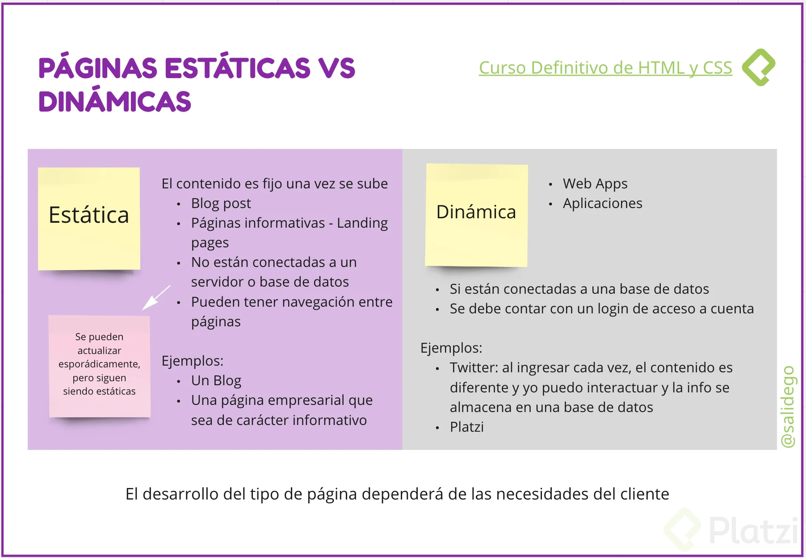
</center>


## HTML: anatomía de una página web
##### La web se conforma de tres conceptos:

> URL => Uniform Resource Locator.
> HTTP => Protocolo de transferencia de hipertexto.
> HTML => código que se utiliza para estructurar el contenido de tu web, y darle sentido y propósito.

* __HTML__ son siglas, Hyper Text Markup Language __(Lenguaje de Marcado de Hipertexto)__.
Hyper Text  significa que el texto tiene interactividad, conexión con otros documentos.
_Markup _significa que le pone etiquetas a los elementos. Por eso también se le conoce como un lenguaje de etiquetas.
HTML es un lenguaje interpretado.
HTML es un estándar, así que no importa desde que navegador, que dispositivo se ejecute, es lo mismo en cualquier sitio. Sigue siendo el mismo código.

Anatomía de una página Web:

> Container.- Contenedor principal
> Header.- Cabecera de la página
> Main content.- Estructura principal, por ejemplo el post de un red social.
> Sidebar.- Contenido secundario de una página.
> Footer.- Pie de página.

<center>
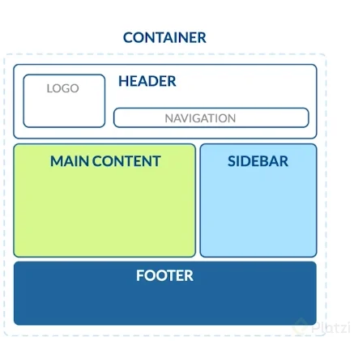
</center>

Hay etiquetas en HTML que nos ayuda a diferenciar en donde estamos.

<!-- break the page -->
<div style="page-break-after: always;"></div>

## Index y su estructura básica: head

En el head van todos los archivos importantes para que nuestro proyecto funcione correctamente, algunos como: Estilos, fuentes, descripciones, librerías… Es la parte no visible de nuestra página.

``` html
<!DOCTYPE html>
<!--Le decimos al navegador que este 
archivo es del tipo html:5-->

<html lang="es">
  <!--Es la etiqueta "padre" donde vivirá nuestro proyecto. 
  El atributo lang establece el idioma del sitio web. 
  Debemos usarlo para que el navegador pueda traducir 
  nuestra página-->

  <head>

    <meta charset="UTF-8" />
    <!--Este atributo nos ayuda a la hora de incluir 
    caracteres especiales y emojis en nuestro proyecto-->

    <meta name="description" 
        content="Esta página te mostrará fotos de gatos" />
    <!--Muestra una descripción de nuestro sitio 
    en los buscadores-->

    <meta name="robots" content="index,follow" />
    <!--Le dice a los robots de los navegadores que 
    rastreen nuestra página y la muestran en las búsquedas-->

    <title>Mi página</title>
    <!--Título de nuestra página, no confundir con 
    los H1-H6. Este titulo es el que ves en la pestaña 
    del navegador-->

    <meta name="viewport" content="width=device-width, 
    initial-scale=1.0" />
    <!--Nos ayuda a trabajar en proyectos reponsive-->

    <link rel="stylesheet" href="./css/style.css">
    <!--Linkea/Enlaza archivos de estilos u otros 
    archivos que necesitemos en nuestro proyecto-->

  </head>
```

<!-- break the page -->
<div style="page-break-after: always;"></div>

## Index y su estructura básica: body
body es la parte visible de nuestro website 😃. Es muy importante usar HTML semántico y no llenar todo de \<div> para que nuestro sitio sea mejor interpretado por el navegador y por lo tanto más accesible.

HTML semántico significa utilizar las etiquetas corresponientes para la parte del sitio que le corresponde. cada cosa en su lugar.

```html
 <body>

    <header> <!--Sección superior de nuestro website--> 

      <nav></nav> <!--Sección de navegación de nuestro 
      website, siempre dentro del header-->

    </header>

    <main> <!--Main es el contenido central de 
    nuestro website, "la parte del medio"-->

      <section> 
        <!--Nuestro website puede estar divido por 
        secciones, por ejemplo platzi tiene 3: 
        El navegador de cursos y rutas, el feed 
        y nuestras rutas de aprendizaje-->

        <article>
          <!--Contenido independiente de la página. 
          Es reutilizable-->
        </article>

      </section>

      <ul> <!--Lista desordenada: Sin numerar-->

        <li><!--Item List. Elementos de la lista--></li>

      </ul>

      <ol></ol> <!--Lista ordenada: Numerada-->
      
    </main>

    <footer> <!--Sección final de nuestro website-->

    </footer>

    <p>Soy un texto</p> <!--Párrafo, texto-->

    <h1>Soy un titulo</h1> 
    <!--Títulos, muestran el texto más grande y 
    con negrilla. Existen desde el h1 al h6-->

    <a href="#">Soy un link</a>
    <!--Enlaces/links que nos permitirán movernos 
    entre páginas.-->

  </body>
```

## Anatomía de una etiqueta de HTML

#### ¿Qué son los atributos?

Podemos pensarlos como instrucciones que se incluyen dentro de la etiqueta de apertura de una etiqueta HTML y determinan el comportamiento de ésta última. Generalmente se asocian a un valor, el cual suele escribirse entre comillas dobles.

Existen tres tipos de atributos, los cuales se distinguen mediante los valores asociados a ellos. Un atributo puede tener como valor:

1) Conjunto finito de valores.
2) Valores libres (como una URL o un texto).
3) Valores booleanos.
   
En HTML5, los atributos de valor booleano se escriben sin valor asociado sólo en caso de que dicho valor sea verdadero, y se omite su mención cuando su valor es falso.

<center>

</center>


## Tipos de imágenes:

1. Lossless (sin pérdida):

> Capturan todos los datos del archivo original.
> No se pierde nada del archivo original.
> Puede comprimirse, pero podrá reconstruir su imagen al estado original

2. Lossy (con pérdida):

> Se aproximan a su imagen original.
> Podría reducir la cantidad de colores en su imagen o analizar la imagen en busca de datos innecesarios.
> Por consiguiente puede reducir su tamaño, lo que mejora el tiempo de carga de la página, pero pierde su calidad.
> Los archivos tipo lossy son mucho más livianos que los archivos tipo lossless, por lo que son ideales para usar en sitios en donde el tamaño del archivo y la velocidad de descarga son importantes.

#### Formatos:

* __GIF__ (Graphics Interchange Format) -> Lossless: Formato de imagen animada sin pérdida, no se puede comprimir. 256 colores y ya no se puede comprimir.
  
* __PNG 8__ (Portable Network Graphics) -> Lossless: Formato de imagen sin pérdida, uso de colores de 256, se utiliza para logotipos e iconos para la página.
  
* __PNG 24__ (Portable Network Graphics) -> Lossless: Formato de imagen sin pérdida, uso de colores ilimitados mas de 256 colores, alta calidad, si intentamos comprimir no ayudará demasiado por la gran cantidad de colores.
  
* __JPG / JPEG__ (Photographic Experts Group) -> Lossy: Formato de imagen con pérdida, perdemos calidad a la hora de comprimirlas, pero llegan a ser óptimas para la carga en la página web.
  
* __SVG__ - Vector (Scalable Vector Graphics) -> Lossless: Formato de imagen muy ligero sin pérdida, con svg no perdemos calidad ya que esta compuesta por vectores.


<center>

</center>


## Optimización de imágenes
Para usar una imagen en la web y que no haya problemas durante la carga.

  1. Tamaño máximo recomendado para una imágen es 70kb

Herramientas para optimizar imágenes:

  * Tiny PNG: Comprime el tamaño de una imagen, para hacerla más ligera.
  [link tiny PNG](https://tinypng.com/)


  * Verefix: Elimina los metadatos de una imagen, para reducir su tamaño. usualmente imagenes tomadas con celular.
  [link verifux](https://www.verexif.com/)


## Etiqueta img
la etiqueta __img__ nos ayuda a cargar una imagen.

```html

```
* __src:__ se introduce el path del archivo
* __alt:__ se introduce un etiqueta interna de la imagen que se carga.


#### Otras maneranes de optimizar imagenes 
Para optimizar nuestro sitio web con las imagenes o iframes, es colocando en la etiqueta img __el atributo loading__ .


#### Atributo loading
El atributo loading permite al navegador retrasar la carga de imáges y de iframes que están fuera de pantalla, hasta que el usuario haga scroll cerca de ellas. ___Éste atributo soporta 3 valores___:

```html

```

* __lazy:__ Retrasa la carga de la imagen hasta que el usuario alcanza con el scroll una distancia calculada desde el viewport.
* __eager:__ Carga la imagen inmediatamente, sin importar donde está situada o colocada en la pantalla. En resumen, no hace lazy-loading.
* __auto:__ Implementa el comportamiento por defecto del navegador para la carga de las imágenes. En resumen, poner auto es lo mismo que no poner el atributo loading.

## Etiqueta figure

La forma correcta de colocar una imagen es con la etiqueta figure

SINTAXIS:

```html
<figure>
          
          <figcaption>Es una imagen de un perrito</figcaption>  
</figure>

<figcaption><figcaption/>
```


Esta etiqueta nos ayuda a darle una descripcion a la imagen (autor, tipo, año, etc…) y sera visible en la parte de abajo de la imagen

## Etiqueta video

La etiqueta __\<video>\</video>__, tiene algunos atributos como:

* __controls:__ agrega al video los controles necesarios para reproducir, pausar y adelantar.

* __preload = auto:__ hace que el navegador descargue el video, en el momento en el que se acceda a la página.


La etiqueta __\<source/>__, se puede colocar dentro de una etiqueta __\<video>\</video>__ varias veces, para especificar diferentes rutas. Esto para asegurar que cualquier navegador pueda mostrar el video.

```html
<body>
    <main>
      <section>
        <!-- Control= "nos da los botones" **** preload ="permite 
        que el video se auto carge antes de para una mejor 
        experiencia del lado cliente" -->
        <video controls preload="auto">
          <!-- Para no tener problemas en los navegadores
          defino las extenciones -->
          <source src="./miVideo.mp4#t=10,60" />
          <source src="./miVideo.mpv#t=10,60" />
          <!-- Para darle un tiempo inicio a fin lo hacemos con el # despues t="como quiero
            que inicie" lo separo con , despues le doy el otro tiempo donde quiero que
          finalice-->
        </video>
      </section>
    </main>
  </body>```
```


## Etiqueta form e input

* __\<Form>__ Es una etiqueta fundamentalmente para tener una mejor semántica.

* __\<Label>__ Etiqueta que representa la interfaz del usuario.
* __for=" "__ Permite asociar un control, en el se le dará un nombre personalizado
* __\<Input>__ Elemento donde el usuario da sus datos para el formulario.

* __type=“text”__ Se aclara que los datos serán tipos textos (por ejemplo, nombre y apellido).

* __type=“date”__ Da una apariencia diferente al input más un calendario donde el usuario podrá poner una fecha mediante los números o facilitándose llenarlo con ayuda del calendario.

* __type=“time”__ También da una apariencia diferente pero para un horario.

* __id=" "__ Se le da un nombre (por así decirlo) al elemento para poder asociarlo junto al mismo nombre que el label en el que se le da al atributo de valor de for.

* __\<span>__ Es para aplicar estilo al texto o agrupación de elementos. Lo que haría en si es que se colocará arriba o abajo (dependiendo donde lo pongas en el editor de código) donde obtendrá un texto.

```html
<body>
    <form action="">
        <label for="nombre">
            <span>Cual es tu Nombre?</span>
            <input type="text" id="nombre" placeholder="Tu Nombre" required/>
        </label>
        <label for="inicio-platzi">
            <span>Cual es tu Nombre?</span>
            <input type="date" id="inicio-platzi"/>
        </label>
        <label for="horario">
            <span>Que horas estudias?</span>
            <input type="time" id="horario"/>
        </label>
    </form>
</body>
```
#### Sin embargo se debe respetar el standar por lo cual el codigo seria de esta manera:

```html
<body>
    <form action="">
        <label for="nombre">
            <label for="nombre">Nombre:</label>
            <input type="text" id="nombre" placeholder="Tu Nombre" required/>
        </label>
    </form>
</body>
```

## Calendar

* Para generar un calendario, podemos hacer uso del tipo __datetime-local__, aunque también podemos hacer uso de las etiquetas de __time, date, week y month__

* la etiqueta **submit**, para enviar los datos.


##### Tambien podemos implementar a los formularios:
**\<fieldset>\</fieldset>**  nos da un borde en el formulario. y poder seccionar un formulario
**\<legend>\</legend>**  nos permite ponerle como un titulo al formulario

```html
<body>
    
    <form action="">
        <fieldset>
            <legend>Calendario (<b>primera forma</b>) </legend>

            <label for="hora">Hora</label>
            <input type="time" id="hora" name="hora"/><br><br>
            
            <label for="dia">Dia</label>
            <input type="date" id="dia" name="dia"/><br><br>
            
            <label for="semana">Semana</label>
            <input type="week" id="semana" name="semana"/><br><br>
            
            <label for="mes">Mes</label>
            <input type="month" id="mes" name="mes"/><br><br>

            <input type="submit"><br><br>

        </fieldset>
        
    </form>
    <form action="">
        <fieldset>
            <legend>Calendario (<b>segunda forma</b>) </legend>

            <label for="calendario">Calendario</label>
            <input type="datetime-local" id="calendario" name="calendario"/><br><br>

        </fieldset>
       

        <input type="submit">
    </form>
</body>
</html>
```

## Autocomplete y require

* **autocomplete** hacer que los campos del formulario se autocompleten solos con datos que ya ha usado antes el usuario (y están guardados en el navegador), se usa el atributo autocomplete dentro de la etiqueta input.

* **required** hacer que los datos del campo sean obligatorios, se debe usar el atributo require en la etiqueta input.

```html
<body>
    <h1>Calendar</h1>

    <form action="">
        <fieldset>
            <legend>Calendario PLATZI</legend>

            <label for="nombre">Cual es tu Nombre?</label>
            <input type="text" id="nombre" name="nombre" autocomplete="name" required><br><br>

            <label for="correo">Cual es tu correo?</label>
            <input type="email" id="correo" name="correo" autocomplete="email" required><br><br>

            <label for="pais">En que pais vives?</label>
            <input type="text" id="pais" name="pais" autocomplete="country"><br><br>

            <label for="cp">Cual es tu Codigo Postal?:</label>
            <input type="text" id="cp" name="cp" autocomplete="postal-code"><br><br>

            <input type="submit" value="Enviar" name="enviar">

        </fieldset>
    </form><br><br>

    
</body>
```

## Select

Para crear inputs con una lista de varias opciones (desplegables), se puede desarrollar de dos maneras diferentes:

* **\<select>** Esta etiqueta permite crear la lista, usando etiquetas \<option> podemos generar mas opciones (usar cuando hay pocas opciones):
```html
<body>
    <main>
        <select name="cursos" id="">
            <option value="JavaScript">JavaScript</option>
            <option value="HTML5">HTML5</option>
            <option value="CSS3">CSS3</option>
            <option value="WEB">WEB</option>
        </select>
    </main>
</body>
```

* **\<input list = “”>**  es una etiqueta que con la etiqueta **\<datalist>** y las etiquetas **\<option>** nos ayudan a generar una lista desplegable y opciones de filtro (usar cuando hay muchas opciones)

```html
<body>
    <main>
        <input list="cursos">
        <datalist id="cursos">
            <option value="JavaScript"></option>
            <option value="HTML5"></option>
            <option value="CSS3"></option>
            <option value="WEB"></option>
        </datalist>
    </main>
</body>
```

## Input type submit vs. Button tag

* **\<input type="submit" value="Nombre" />** es un boton lo utilizaremos solo en los formularios para enviar datos.

```html
<body>
    <input type="submit" value="nombre">
</body>
````

* **\<button type="submit">Qué color te gusta?\</button>** es un boton que lo utilizaremos en cualquier otro tipo de boton dentro de nuestro proyecto que por buenas practica no lo utilizaremos para enviar, sino para realizar otras acciones como descargar, compartir, abrir... 

```html
<body>
    <button type="submit">Que color te gusta?</button>
</body>
````


_______________________________________________________


## ¿Qué es CSS?

Cascading style sheet (css) es la herramienta con la que le damos estilo a nuestra pagina ya sea color, tamaño, espacios, lugares de posición y más.


## ¿Cómo utilizamos CSS?: por etiqueta, selector, class y por ID

Archivo CSS
esta es la mejor práctica en especial cuando tendremos mucho CSS, tendremos un archivo *.css y en el head del html pondremos las etiqueta como refencia a ese archivo **href="./style.css"**

~~~~html
<head>
    <meta charset="UTF-8">
    <meta http-equiv="X-UA-Compatible" content="IE=edge">
    <meta name="viewport" content="width=device-width, initial-scale=1.0">
    <title>Clase CSS</title>
    <link rel="stylesheet" href="./style.css">
</head>
~~~~
y se aplicará el css en nuestro archivo

Etiqueta style
si tendremos poco css es posible usar la etiqueta style y directamente usarlo ahi

~~~~html
<head>
    <meta charset="UTF-8">
    <meta http-equiv="X-UA-Compatible" content="IE=edge">
    <meta name="viewport" content="width=device-width, initial-scale=1.0">
    <title>Clase CSS</title>
    <link rel="stylesheet" href="./style.css">
    <style>
        .red {
            color: red;
            font-size: 12px;
        }
    </style>
</head>
~~~~
CSS embebido
esto no es muy bueno hacerlo pero se puede hacer si solo aplicaremos pocos atributos a pocas etiquetas con el atributo style en la etiqueta

~~~~html
<body>
    <p style="font-size: 12px;">soy un texto nuevo</p>
</body>
~~~~

#### 3 formas de trabajo cuando se usa CSS:

1. Selector por elemento (Por Etiqueta)
Se indican con etiqueta{} en CSS (ejemplo p{} o h1{})
en html se aplicará a todas las etiquetas del tipo indicado
Esto es útil si queremos darle el mismo estilo a todos los elementos de un tipo como párrafo o titulos

2. Por Clases
se generan con .nombre{} en CSS
en html se indican con el atributo class=”nombre”
Esto sirve para dar el mismo estilo a muchos elementos distintos

3. Por Id
se generan con #nombre en CSS
en html se indica con el atributo id=””
Esto es útil si sólo lo usaremos con una etiqueta


```html
/* etiqueta */
p {
    color: blue;
    font-size: 40px;
}

/* class */
.parrafo {
    color: red;
    font-size: 10px;
}

/* ID */
#texto {
    color: green;
    font-size: 20px;
}

```


## Pseudo clases y pseudo elementos

#### <u>Cómo nombrar las clases</u>
Metodología **BEM😗** cómo nombrar correctamente las clases.
Solo usa clases. Las nombra siguiendo el siguiente patrón: BLOQUE__ELEMENTO—MODIFICADOR (son 2 guiones, se usa 1 guión para separar palabras).

[video de la metodologia BEM](https://www.youtube.com/watch?v=bvnzyXGkNY4)

> Bloque: sección que puede funcionar por sí sola.
> Elemento: forma una de las partes del bloque.
> Modificador: variaciones de un mismo bloque/elemento.

```html
<!-- BLOQUE -->
<main class="Padre">
	<!-- BLOQUE__ELEMENTO --> 
	<section class="Padre__Hijo">
		<!-- BLOQUE__ELEMENTO--MODIFICADOR -->
		<article class="Padre__Hijastro--Mayor"></article>
		<article class="Padre__Hijastro--Menor"></article>
	</section>
 </main>
```

#### <u>Crear estilos con etiquetas dentro de clases</u>
Si tienes etiquetas dentro de la etiqueta a la que le estás aplicando estilos y le pones una clase, puedes aplicar estilos únicamente a las etiquetas dentro de esa clase de la siguiente manera: 

```css
.clase etiqueta {
    /* Estilos a etiqueta "a" dentro de una clase */
}


.main-nav__item a {
    color: white; /* color de texto */
    padding: 5px; /* espacio entre los elementos */
    border-radius: 2px; /* redondear los bordes */
    text-decoration: none; /* Elimina los puntos de la lista */
}
```
<center>
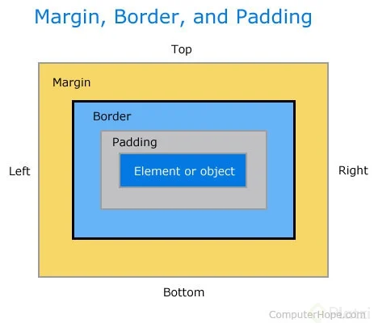
</center>

**Pseudo clases**
Define el estilo de un estado especial de un elemento.
Agregar al final de la clase **.clase a:nombreAccion**

```css
.main-nav__item a:hover { 
    /* Con etiqueta:hover hacemos que cada vez que el 
    usuario pase el cursor por el elemento se le 
    apliquen los siguientes estilos CSS */

    color: blue; /* color de texto */
}

.main-nav__item a:active { 
    /* Con etiqueta:active hacemos que cada vez 
    que el usuario haga click sobre el elemento
    se le apliquen los siguientes estilos CSS */

    color: red; /* color de texto */
}
```

**Pseudo Elementos**
Define el estilo de una parte específica de un elemento o agrega un elemento.
Agregar al final de la clase **.clase a::nombreAccion**

```css
/* Pseudo elemento */
.main-nav__item a::after {
    /* Con after agregamos elemtos */

    content: " | "; /* despues del elemento, agrega esto */
}
```
<center>
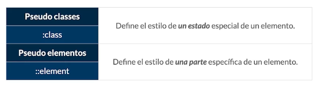
</center>


## Anatomía de una regla de CSS

sintaxis del lenguaje CSS

<center>

</center>


## Modelo de caja

En la web los elementos se piensan en forma de rectángulos. A esto se le conoce como Modelo de caja.

Las cajas tienen parámetros que podemos editar en nuestro CSS

> Margin: Espacio que hay del borde de la caja hacia afuera.Visualmente, permite separar a la caja de elementos externos.
> Border: Es el borde de la caja. Por defecto, a partir de ahí medimos las distancias de nuestra caja con elementos internos o externos.
> Padding: Espacio que hay del borde de la caja hacia adentro. Visualmente, permite separar a la caja de elementos internos.
> content: es el contenido, texto o imagenes:
> * width: ancho del contenido
> * height: alto del contenido

<center>
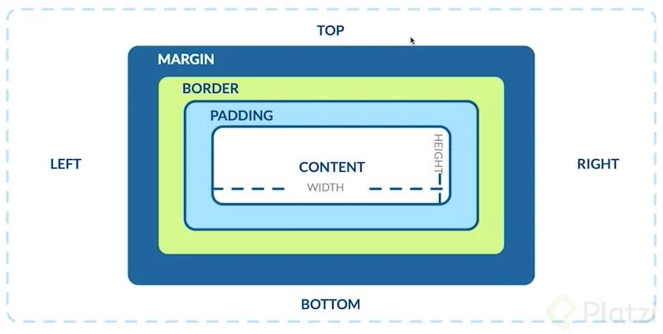
</center>


Pensandolo como una casa:

> El margin es el jardin o la acera que te aleja de las otras casas.
> El border son tus paredes.
> El padding es el espacio que tienen tus paredes con tus muebles.
> El content son tus muebles.

<center>
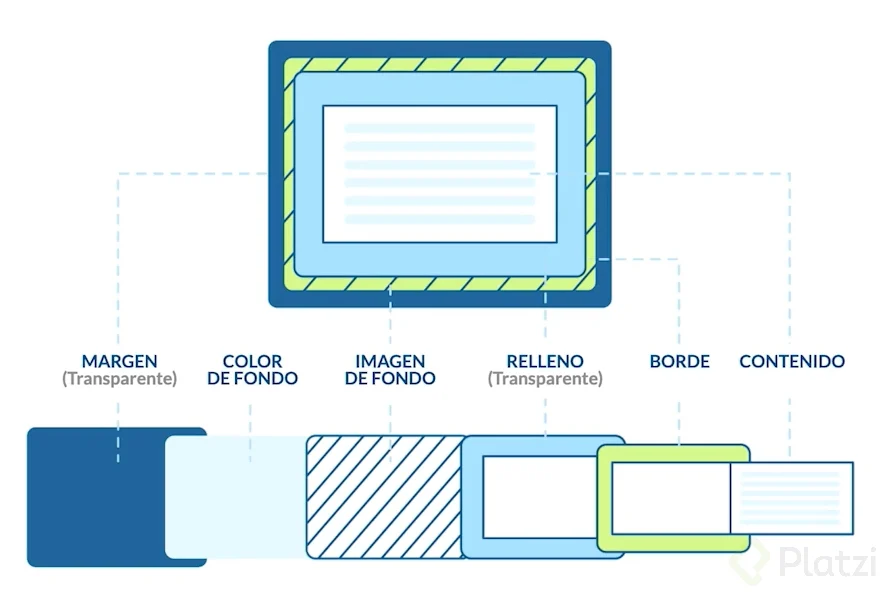
</center>

* **hacer cambio en el content, border y padding**
tener en cuenta que no se esta alterando el margin, lo cual nos generar un scroll

```css
main {
    width: 100%;
    height: 500px;
    border:10px solid grey;
    padding: 20px 35px;
}
```

* **hacer cambio en el content, border y padding**
para reducir el margin de nuestro modelo de caja, usar el siguiente codigo en todos los proyectos con CSS

```css
*{
    /*hace que el margin se igual a 0*/
    box-sizing: border-box;
    padding: 0;
    margin: 0;
}
```

**<u>Para proyectos mas grandes, se debe usar normalize</u>**

[Link del video](https://www.youtube.com/watch?v=TeQgd0NS_lQ)


## Herencia

Cuando se realiza el frondend, sin usa css. entonces se usa los valores por defecto del navegador te lo da.

Sin embargo si queremos establecer nuestros propios valores por defecto, entonces debe entender que es la herencia:

* **Inherit**  es un valor por medio de una keyword que especifica que, a la propiedad que se la apliquemos debe de heredar los valores de su elemento padre. Podemos decir que la palabra Inherit significa “Usa el valor de mi padre”, si el elemento padre no tiene definido dicho valor entonces el navegador seguirá hasta que encuentre un elemento superior que lo contenga, y en ultima instancia de no tenerlo ningún elemento superior se aplicara el valor por defecto.

```css
html {
    font-size: 75%;
    font-family: Verdana, Geneva, Tahoma, sans-serif;
}

h1 {
    font-size: inherit;
}
```

<center>

</center>


Initial. Este valor pertenece a la especificación CSS3 y cuando aplicamos a una propiedad el valor initial estamos dando el valor inicial y predefinido por el navegador en cuestión.

Upset. Este valor unset es una combinación entre inherit y initial, cuando utilizamos este valor en una propiedad esta tratara de heredar el valor de su elemento padre si este esta disponible, de no ser así este valor colocará el valor de la propiedad en su valor inicial, como si usáramos inherit e initial juntos.


## Especificidad en selectores
Orden de declaración en .css

1. Importancia
2. Especificidad
3. rden de fuente

Importancia.

1. Hoja de estilo de agente de usuario (Estilos del navegador): primero el navegador va a implementar los estilos que ya trae por defecto

2. Declaraciones normales en hojas de estilo de autor (nuestro .css) que son los estilos que nosotros colocamos en nuestro proyecto.

3. Declaraciones importantes en hojas de estilos de autor (utilizar el !important) no es buena practica

Especificidad: el orden de importancia es:

<center>
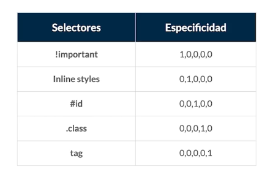
</center>

#### Regla
**Regla de cascada**
Para entender la razon de un conflicto, debemos entender la .
<center>
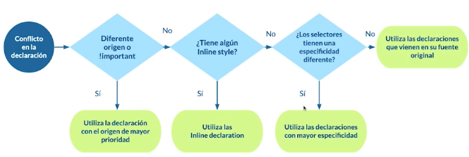
</center>

**Orden de la fuente** las declaraciones finales son las que se se van a ejecutar en el caso que los estilos tienen la misma especificidad


## Demo de especificidad y orden en selectores


> Usamos ‘#’ cuando llamamos al id.
> Usamos ‘.’ cuando llamamos a las clases.
> Usamos ‘*’ cuando hacemos referencia a todo el código html, al momento de hacer reset en los estilos que ya vienen por defecto.

**index.html** 
```html
<!DOCTYPE html>
<html lang="en">
  <head>
    <meta charset="UTF-8" />
    <meta name="viewport" content="width=device-width, initial-scale=1.0" />
    <title>Demo</title>
    <link rel="stylesheet" href="./style.css" /> 
    <!-- href hacer referencia al documento CSS -->
  </head>
<body>
    <header class="page-header">
        <h1 id="page-title" class="title">Empresa</h1>
        <nav>
            <ul id="main-nav" class="nav">
                <li><a href="">Home</a></li>
                <li><a href="">Curso</a></li>
                <li><a href="">Instructores</a></li>
                <li><a href="" class="blog">Blog</a></li>
            </ul>
        </nav>
    </header>
    
</body>
```
**style.css** 
```css
/*tambien llamado selector universal*/
* {
    /* le da estilos a todo el codigo html*/
    box-sizing: border-box;
    margin: 0;
    padding: 0;

}

h1 {
    /* le da estilos a una etiqueta de tipo h1 */
    color: purple;
    font-family: serif;
    margin-bottom: 10px;
  
}

#page-title {
    /*cuando se tiene muchos fonts, es por si uno de ellos
    el buscador no lo tiene y pasa al siguiente*/
    font-family: Arial, Helvetica, sans-serif;
} 

.title {
    font-size: 18px;
    font-family: monospace;
}

#main-nav {
    /* Esto son estilos para el ID*/
    margin-top: 10px;
    list-style-type: none;
    padding-left: 0px;
}

#main-nav li {
    /* Esto es para los estilos de los elementos de lista */
    display: inline-block; /* Esto es para que los elementos se muestren en línea */
}

#main-nav a {
    /* Esto es para los estilos de los elementos de ancla */
    color: white; 
    background-color: #13a4a4;
    padding: 5px;
    border-radius: 2px;
    text-decoration: none;
}
 
#main-nav .blog{
    background-color: red;
} 
```

## Más sobre selectores

#### Recordar que :
1. Evitar usar !important
2. Evitar usar estilos embebidos (Estilos en la etiqueta html).
3. Evitar usar ID para dar estilos en CSS por que tienen mas peso y dan conflictos.


Mala Practica en CSS es hacer, cuando no se maneja bien la especificidad :
```css
#main-nav .blog{
    background-color: red !important;
} 
```

## Combinadores: Adjacent Siblings (combinators)
**El combinador hermano adyacente ( + )** separa dos selectores y coincide con el segundo elemento solo si sigue inmediatamente al primer elemento, y ambos son hijos del mismo padre element.

```css
h2 + p {
    /* applicar todos los estilos a p que esten cerca de un h2 */
    color: red;
}
```

<center>
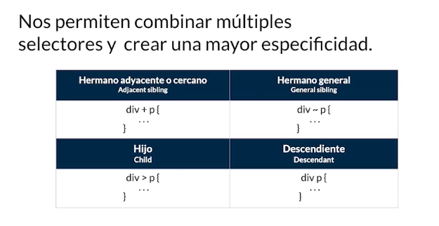
</center>


## Combinadores: General Sibling
**general sibling combinator ( ~ )** separa dos selectores y coincide con el segundo elemento solo si sigue al primer elemento (aunque no necesariamente inmediatamente), y ambos son hijos del mismo elemento padre .

```css
h2 ~ p {
    /* aplicar todos los estilos a p que sean hermanos de h2  */
    color: blue;
}
```

## Combinadores: Hijo y Descendiente

**The child combinator ( > )** se coloca entre dos selectores CSS. Solo coincide con los elementos que coinciden con el segundo selector que son hijos directos de los elementos que coinciden con el primero.

```css
div > p {
    /* color: red; */
}
```

**The descendant combinator** , típicamente representado por un único carácter de espacio ( ), combina dos selectores de modo que los elementos que coinciden con el segundo selector se seleccionan si tienen un elemento antepasado (padre, padre del padre, padre del padre, etc.) que coincida con el primer selector. Los selectores que utilizan un combinador descendiente se denominan selectores descendientes .

```css
div p {
    color: red;
}
```

</br>
<center>
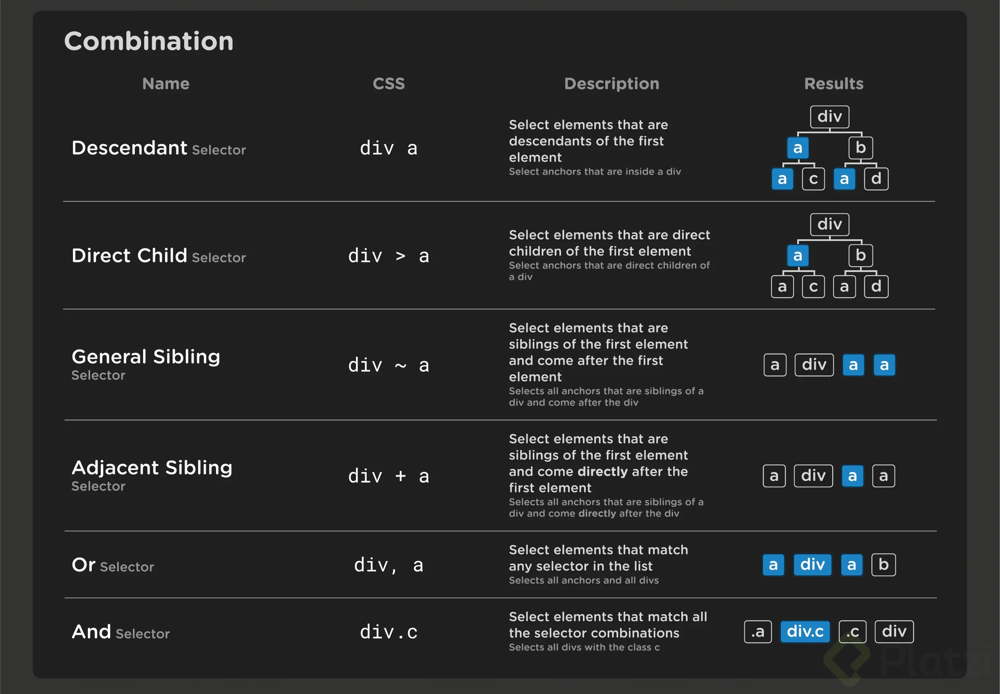
</center>


## Medidas

#### <u>Unidades absolutas</u>
Es una medida absoluta que depende de los pixeles.
la medida no cambia sin importar el equipo o el tamaño de la antalla.
son unidades que están completamente definidas. Esto quiere decir que su valor no depende de otro valor de referencia. 
En este grupo encontramos los siguientes elementos:

* **cm:** Aumenta el tamaño de nuestro texto o elemento en centímetros
* **mm:** Aumenta el tamaño de nuestro texto o elemento en milímetros
* **in:** Aumenta el tamaño de nuestro texto o elemento en pulgadas **(1in = 96px = 2.54cm)**
* **px:** Aumenta el tamaño de nuestro texto en pixeles
* **pt:** Aumenta el tamaño de nuestro texto en puntos **(1pt = 1/72 de 1in)**
* **pc:** Aumenta el tamaño de nuestro texto en picas **(1pc = 12 puntos aprox)**


#### <u>Unidades relativas</u>
son medidas que cambian y se ajusta a las medidas del dispositivo.

Este tipo de unidad es más flexible y se expresa en forma de porcentaje (%). Me refiero a su flexibilidad porque se adapta de acuerdo al tamaño de otro valor de referencia. 

Ahora aplica este ejemplo a los distintos tipos de resolución de pantalla. Ahora bien, las unidades relativas se subdividen en 2 grupos:

1. Relativas a la tipografía

2. Relativas al viewport

##### 1. <u>Relativas a la tipografía</u>

* em (elemento): Relativo al tamaño de fuente de un elemento. Si, por ejemplo, utilizamos 3em (font-size: 3em); mi texto aumentará 3 veces su tamaño en relación al tamaño que se esté utilizando por defecto.

* ex: Aumenta el tamaño de mi letra en cuanto a su altura.

* Rem (root elemento): Es igual a (em) con la diferencia de que este actúa en la raíz. O sea, en la letra que esté utilizando por defecto.

##### 2. <u>Relativas al viewport - ventana</u>

* **vw:** Porcentaje relativo a la anchura del viewport.
* **vh:** Porcentaje relativo a la altura del viewport.
* **vmin:** Entre vw y vh toma el que tenga menor valor.
* **vmax:** Entre vw y vh toma el que tenga mayor valor.


<center>
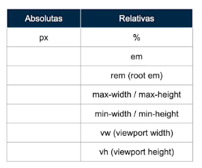
</center>


## Medidas EM

esta medida toma el tomaño fuente del padre directo.
el padre directo puede ser las configuraciones del html o cualquier padre cercano.

el siguiente ejemplo es algo del que debemos tener mucho cuidado cuando tener un proyecto mas grande.
~~~html
<body>
    <main class="text-container"> 
        <p>Soy un texto inicial</p>
       <div>
           <p>Soy un texto de ejemplo</p>
           <div>
            <p>Soy un texto de ejemplo</p>
            <div>
                <p>Soy un texto de ejemplo</p>
                <div>
                    <p>Soy un texto de ejemplo</p>
                </div> 
            </div> 
        </div> 
       </div> 
    </main>
    
</body>
~~~

~~~css
.text-container {
    font-size: 1.5em; 
    /* 1.5 del tamaño de la etiqueta html, si es que no hay establecido un font-size como padre superior*/
}

.text-container div {
    font-size: 1.5em;
}
~~~

## Medidas REM
funciona igual que el em, con la diferencia que es relativo al valor de la fuente del elemento html, y no tiene en cuenta el valor heredado o al padre directo.

Por defecto el html viene con un tamaño de fuente de 16px asi que esta medida siempre tiene referencia al estilo root, es decir al tamaño fuente de la etiqueta html.

==1 rem = 16 px==
(tener en cuenta que eso 16px son de la etiqueta html)

Si queremos aplicar rem de una forma mas sencilla para no tener que hacer tantos calculos hacemos lo siguiente

~~~css
/*Como por defecto el 
font-size es 16px, el 62,5% 
nos daría 10px*/
html{
    font-size: 62.5%;
}

p {
    font-size: 1.6rem; /*  1.6 x 10 = 16px */	
}
/*entonces podemos calcular 
rem fácilmente multiplicando por 10
~~~
si la etiqueta html vale 16 px y cuando se usa el rem este tambien sera 16px, entonces hacemos esto.
convertimos esos 16 px en 10 px, de la siguiente manera
16px * 62.5% = 10px
ahora la etique html tiene 10 px como font-size y el rem es 10 px tambien, es decir:

1 rem = 10 px

ahora si por ejemplo a una etiqueta le asignamos 2 rem este hara referencia a 20px, o si por ejemplo le damos un valor de 1.5rem su valor sera de 15px

## Max/Min width

¿Qué es la viewport?
Es el área visible del usuario de una página web.
El viewpost varía según el dispositivo y será más pequeña en un teléfono móvil que en una pantalla de computadora.

Antes de las tabletas y los teléfonos móviles, las páginas web estaban diseñadas solo para pantallas de computadora, y era común que las páginas web tuvieran un diseño estático y un tamaño fijo.

Luego, cuando comenzamos a navegar por Internet usando tabletas y teléfonos móviles, las páginas web de tamaño fijo eran demasiado grandes para caber en el viewport. Para solucionar este problema, los navegadores de esos dispositivos redujeron la página web completa para adaptarse a la pantalla.

#### Medidas que se aplican en el Viewport
**Min-height:** se utiliza para definir la altura mínima de un elemento dado. Impide que el valor de la propiedad height llegue a ser más pequeña que la especificada en la altura mínima ( min-height ). Se refiere a la altura del bloque contenedor.

**Max-height:** se utiliza para definir la altura máxima de un elemento dado. Impide que el valor de la altura pueda llegar a ser más grande que la de max-height . Porcentajes: se refiere a la altura del bloque contenedor.

**Min-width:** se usa para determinar la anchura mínima de un elemento. Previene que la propiedad width pueda ser inferior que min-width . Aplicable a: elementos de tipo bloque. Porcentajes: se refieren a la anchura del bloque contenedor.

**Max-width:** define el ancho máximo que un elemento puede tener, max-width cambia el tamaño del elemento si el valor de width es mayor que el de max-width.

~~~css
* {
    box-sizing: border-box;
    margin: 0;
    padding: 0;
}

main {
    width: 100vw;
    height: 100vh;
    background-color: blueviolet;
}

section{
    width: 80%;/*debemos tener un width base que normalmente sera en porcentaje*/
    min-width: 320px;/*limitamos el tamaño que se va a encojer*/
    max-width: 500px;/*limitamos el tamaño que va a crecer*/
    min-height: 500px; /*limite minima de la altura*/
    max-height: 800px /*limite maxima de la altura*/
    margin: 0 auto;
    background-color: red;
}
~~~

**overflow:** quiere decir que tenemos mas texto de lo que el contenedor puede almacenar. 

un error comun es que le asignamos un tamaño a nuestro contenedor pero el contenido es demasiado
que se desborda del contenedor una forma de solucionarlo es asignar un tamaño min que permite
que nuestro contenedor crezca según el contenido que se tiene. 


<!-- [
    les quiero dejar los aportes que más me gustaron.

    Lucy06Campos nos recomienda una guía del desarrollo web https://platzi.com/comentario/1684577/
    Nihilus117 explica las siglas de html y css. https://platzi.com/comentario/1687509/
    danilofb nos comparte todas las etiquetas de html. https://platzi.com/comentario/1697848/
    padronjosef quiere saber cuales son las diferencias de html css y js. https://platzi.com/comentario/1952538/
    doy una pagina de apoyo (también era un aporte prueba ya que esta clase así allá mas de 100 aportes solo me cargan 100) https://platzi.com/comentario/1984889/
    matiaswasiak nos da su opinión de html y css. https://platzi.com/comentario/1683711/
    SEBASSD nos deja información de html css y js. https://platzi.com/comentario/1821882/
    anibaldbxd me hizo reír https://platzi.com/comentario/1684610/
    lesterpaz99 nos da información opcional pero importante para trabajar con html y css. https://platzi.com/comentario/1797578/
    carSantello nos ilustra los conceptos de html css y js https://platzi.com/comentario/1683531/

espero haber sido de ayuda.
] -->