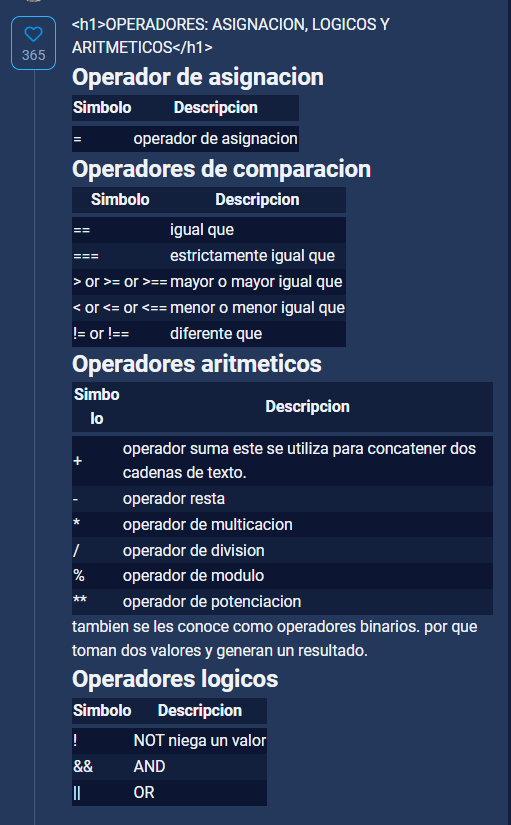

# Curso Basico de JavaScript

# Resumenes:

[Functions - JavaScript | MDN](https://developer.mozilla.org/en-US/docs/Web/JavaScript/Guide/Functions)

# Ejercicio:

- Realiza un juego de piedra papel o tijera - Clase 12 (con condicionales)
- Realiza un juego de piedra, papel o tijera con switch - Clase 13

# Material Complementario:

[jsconsole](https://jsconsole.com/)

# Temario:

# Material Complementario:

[Fundamentos de Programación](https://www.codealo.dev/cursos/fundamentos-de-programacion)

---

# 01. ¿Que es Javascript?

## Contenido:

## ¿Qué es JavaScript?

JavaScript es un lenguaje de programación dinámico que tiene la capacidad de ser utilizado en muchos dispositivos diferentes. Puede usarse en ordenadores personales, servidores web y teléfonos inteligentes. Es un lenguaje interpretado, orientado a objetos, débilmente tipado y dinámico.

JavaScript se emplea comúnmente para el desarrollo web front-end y más recientemente para algunos desarrollos back-end a través de frameworks como Node.Js. o Next.Js. Tiene características como la programación orientada a objetos, funciones y herencia basada en prototipos.

## ¿Cómo nace Javascript?

Nace con la necesidad de generar dinamismo en las páginas web y que a su vez los usuarios y las empresas pudieran interactuar unos con otros. Fue creado por Brendan Eich en 1995 y se convirtió en un estándar oficial del World Wide Web Consortium (W3C) en 1997.

## ¿Por qué decimos que Javascript es un lenguaje dinámico?

Corre directamente en la etapa de Runtime, sin una etapa de compilación previa. Esto permite probar nuestro código inmediatamente; pero también es lo que hace que los errores no se muestren sino hasta que se ejecuta el programa. Lo que se ve a primera vista, cuando se analiza el código, es muy probable que no sea lo que se va a obtener cuando el programa se ejecute.

JavaScript permite declarar (por ejemplo) variables cuyo valor (y tipo) solo se conocerá al momento de su ejecución en función de las condiciones dadas al momento de correrlo en un entorno real. En cambio, los lenguajes estáticos no compilarán en código ejecutable a menos que todos los valores (o tipos de valores) se conozcan por adelantado.

## ¿Por qué es débilmente tipado?

Porque los tipos de datos no están bien definidos en el lenguaje y permite, por ejemplo, operaciones entre numerosos y letras. Esto sucede porque el lenguaje asume tipos de datos que no necesariamente fueron los que se querían representar. Se pueden hacer operaciones entre tipos distintos de datos (enteros con strings, booleanos con enteros, etc.). Ejemplo:

~~~
4 + "7"; // 47
4 * "7"; // 28
2 +true; // 3
false - 3; // -3

~~~

## ¿Realmente es Javascript un lenguaje interpretado?

Sí, y la razón es que el navegador lee línea por línea nuestro código, el cual le indica lo que tiene que ir haciendo, sin la necesidad de compilar. Todo esto es controlado por el motor de Javascript V8 del navegador

## Qué significa que Javascript es Backwards Compatible

Todas las funciones nuevas que salen para Javascript no dañarán el trabajo ya hecho previamente, pero no se podrá utilizar en nuestro entorno de trabajo inmediatamente. Para solucionar esto está [Babel](https://platzi.com/blog/que-es-babel/), que permite usar las nuevas características del lenguaje, pero lo transforma a una versión que el navegador pueda entender.

## Aportes:

Los invito a leer la serie de libros de *You Don’t Know JS Yet* por Kyle Simpson. En el primer libro llamado “*Get Started*”, habla a fondo sobre estos temas. En su [repositorio en GitHub](https://github.com/getify/You-Dont-Know-JS) lo pueden leer de manera gratuita.

Al que le interese: Hago parte de una comunidad llamada *CodeBookClub*, actualmente estamos leyendo el primer libro y discutimos semanalmente acerca de un capitulo leído, entre otras cosas.

Les dejo un enlace a mi [repositorio en GitHub](https://github.com/sneyderdev/codebookclub-resources) en donde podrán encontrar algunos recursos que compartimos dentro de la comunidad, así como también información por si quieren unirse.

Espero esto les sea de ayuda, un saludo.

---

## Dudas, preguntas y comentarios:

- ¿Que es buleano?
- ¿A que se refiere cuando dice un lenguaje orientado a objetos?
- ¿A que se refiere con compilacion?
- ¿A que se refiere con que es un lenguaje interpretado?

## Material complementario:

[Curso de JavaScript Engine (V8) y el Navegador](https://platzi.com/cursos/javascript-navegador/)

- JS Compilador Babel

[https://github.com/degranda/jsBasico-](https://github.com/degranda/jsBasico-)

---

# 02. ****¿Por qué JavaScript?****

## Contenido:

## Aportes:

**APUNTES**1.- JavaScript tiene una **comunidad enorme** de desarrolladores que te pueden ir ayudando a generar diferentes cosas.

1. Si solo estuvieras interesado en trabajar **aplicaciones web** tienes muchos frameworks y librerías construidas en JavaScript que te van a ayudar a hacer proyectos de forma mucho mas rápida, eficiente y robusta (Angular, View, React,entre otros)
2. Si no quieres trabajar solo en aplicaciones Web puedes utilizar JavaScript con un framework que se llama React Native para poder **construir aplicaciones nativas** como Android y IOS.
3. Puedes construir **aplicaciones de escritorio** con JavaScript, usando un framework llamado Electron, pueden correr en Mac o Windows.
4. También puedes trabajar en la parte del **Back-end** o **IOT **(Internet Od Things) es un concepto que se refiere a una interconexion digital de objetos cotidianos con Internet. Esto con un Framework llamado NodeJS, el cual es un entorno de ejecución de JavaScript que corre directamente en el Back-end.

---

Excelente curso, me encanta, quiero aprender JavaScript.

- WebAssembly: es un nuevo tipo de código que puede ser ejecutado en navegadores modernos es un lenguaje de bajo nivel, similar al lenguaje ensamblador, con un formato binario compacto que se ejecuta con rendimiento casi nativo y provee un objetivo de compilación para lenguajes como C/C++ y Rust que les permite correr en la web. También está diseñado para correr a la par de JavaScript, permitiendo que ambos trabajen juntos.

## Dudas, preguntas y comentarios:

- ¿Que es WebAssembly?

## Material complementario:

[Curso de Introducción a IoT
https://platzi.com/clases/iot/](https://platzi.com/clases/iot/)

[Ruta de aprendizaje Backend con JavaScript
https://platzi.com/clases/learning-path/backend-javascript/](https://platzi.com/clases/learning-path/backend-javascript/)

[Ruta de aprendizaje Frontend con React.JS
https://platzi.com/clases/learning-path/desarrollo-react/](https://platzi.com/clases/learning-path/desarrollo-react/)

[Ruta de aprendizaje Vue.js
https://platzi.com/clases/learning-path/vue/](https://platzi.com/clases/learning-path/vue/)

[Ruta de aprendizaje Desarrollo con Angular
https://platzi.com/clases/learning-path/desarrollo-angular/](https://platzi.com/clases/learning-path/desarrollo-angular/)

[GitHub - degranda/jsBasico-: Ejemplos del curso de JS básico
https://github.com/degranda/jsBasico-](https://github.com/degranda/jsBasico-)

---

# 03.****Elementos de un Lenguaje de Programación: Variables, Funciones y Sintaxis****

## Contenido:

## Aportes:

## Dudas, preguntas y comentarios:

! String se refiere a cadena de texto. No podemos escribir en Js sin colocar nuestras palabras “dentro de comillas”.

!  Valores booleanos: Se utilizan para validar cosas como verdaderas o falsas

! Valores vacios o empty values: null y undefined. Tambien se les conoce como valores placeholder. Cuando queda un valor faltante, podemos utilizarlos. 

## Material complementario:

---

# 04. ****Variables en JavaScript****

## Contenido:

## Aportes:

## Dudas, preguntas y comentarios:

! ¿Que es una variable?: Una variable, es una representacion de un lugar en memoria que nosotros vamos a reservar para poder guardar un valor. Y ese valor puede tener diferents tipos.

! Hay dos estados de una variable: declarar, inicializar.

! Si queremos inicializar una variable debemos utilizar “ = “

## Material complementario:

[https://www.youtube.com/watch?v=iYI3YvdsUWw](https://www.youtube.com/watch?v=iYI3YvdsUWw)

---

# 05. Funciones en JavaScript:

## Contenido:

! Recuerda que los parametros son variables, es decir, su valor no esta definido.

Por ejemplo. Aqui el parametro estudiante no tiene un valor definido. Entonces cuando se llama “ saludarEstudiantes(”Diego”); ”. Es ahí cuando esa variable comienza a tener un valor definido.

~~~jsx
> function saludarEstudiantes (estudiante) {
console.log(estudiante);
}
< undefined
> saludarEstudiantes ("Diego");
Diego
undefined
~~~

---

~~~jsx
> function saludarEstudiantes (estudiante) {
console.log(Hola ${estudiante}`);
}
< undefined
//¿En que consiste el ${estudiante}?: De esta manera en lugar de llamar cada estudiante a traves de un " console.log " se llama a cada uno de ellos, sin importar lo larga que pueda llegar a la ser la base de datos.
~~~

[jsBasico-/3-function.js at master · degranda/jsBasico-](https://github.com/degranda/jsBasico-/blob/master/3-function.js)

## Aportes:

**Funciones**

Las funciones son las tareas que va a llevar a cabo el navegador. Existen 2 tipos de funciones 1) Declarativas 2) De expresión. Ambas pueden llevar parámetros, que son los datos que necesitan para ejecutarse.Cada parámetro va separado por una coma. Cada instrucción que tenga la función debe terminar con ; .Si queremos que una función nos dé un numero o dato tenemos que usar la siguiente sintaxis:

*return El dato que queremos que nos dé;*

Las funciones declarativas tienen la siguiente sintaxis:

*function Nombre de la función (Parámetros de la función) {Instrucciones}*

Un ejemplo de una función puede ser una suma:

_function suma (a,b) {return a+b;}_

~~~
Las funciones de expresión son aquellas que guardamos en una variable, por lo tanto, no es necesario nombrarlas y tienen la siguiente sintaxis:
~~~

_var Nombre de la variable = function(Parametros){Instrucciones}._

Un ejemplo de una función de expresión sería:

*var suma = function(a,b){return a+b;}*

~~~
Para ejecutar las funciones debemos usar la siguiente sintaxis:
~~~

_Nombre de la funcion(Parametros función); _

Si la función no tiene ningún parámetro, únicamente se escribe:

_Nombre de la función(); _

---

---

[Functions - JavaScript | MDN](https://developer.mozilla.org/en-US/docs/Web/JavaScript/Guide/Functions)

## Dudas, preguntas y comentarios:

! ¿Que es una funcion?: Las funciones son como un conjunto de sentencias que nosotros podemos utilizar para generar ciertas acciones con los valores que guardamos ya antes en las variables.

! plantilla de cadena de texto?

## Material complementario:

Las **funciones** son herramientas utilizadas en cualquier lenguaje de programación con la finalidad de reutilizar código. Con esto, se evita reescribir varias veces el mismo código, optimizando recursos en el programa.

Dentro de una función se pueden crear y emplear variables locales. Es decir, se generan, usan y destruyen dentro de la función. Esto se logra pasándolas a la función como parámetros de la misma, según lo que la función necesite.

En JavaScript, las funciones no tienen un lugar definido dentro del programa. Estas pueden ser declaradas y descritas al inicio, final, o en cualquier parte del cuerpo del programa. Esto se debe a que JS, en primer lugar, hace una lectura completa del programa, luego ejecuta y guarda en memoria solo las funciones, para después ir ejecutando el cuerpo del programa.

La principal ventaja, aparte de ordenar el código, hace que sea más fácil de mantener, ya que si se debe realizar algún ajuste, este únicamente se realiza en una parte del código.

## Cómo escribir una función en JavaScript

Puedes escribir una función en JavaScript como en este ejemplo:

~~~
functionnombreFuncion(parametros) {

//Código que ejecuta la función

}

~~~

**Recuerda**:

- Cuando escribes el mismo código muchas veces, es una mejor idea emplear una función.
- Los parámetros de una función, son variables dentro de la función y funcionan exclusivamente dentro de ella

---

# 07. Scope

## Contenido:

[jsBasico-/4-scope.js at master · degranda/jsBasico-](https://github.com/degranda/jsBasico-/blob/master/4-scope.js)

## Aportes:

## Dudas, preguntas y comentarios:

## Material complementario:

[6. EL SCOPE en JAVASCRIPT | JS en ESPAÑOL](https://www.youtube.com/watch?v=s-7C09ymzK8)

[Devferx - Devferx added a new photo.](https://m.facebook.com/devferx/photos/pcb.117811056638485/117809669971957/?type=3&source=48&refid=52&__tn__=EH-R)

---

# 08. Hoisting:

## Contenido:

! Hoisting es cuando las variables y las funciones se declaran antes de que se procese cualquier tipo de codigo. El Hoisting ahorita solo pasa con versiones pasadas de Js de EcmaScript 5 hacia abajo y de EcmaScript 6 en adelante el hoisting ya no sucede por que el Hoisting solo sucede con 2 palabras claves: var y function. Y las nuevas versiones de EcmaScript6 en adelante, presentaron 2 nuevas variables: const y let.

! ¿Que es el console log? El console log es una funcion que nos da el navegador. Esta funcion nos ayuda a imprimir  en la consola del naveagor los resultados. Podemos imprimir variables, resultados de algunas funciones, se pueden imprimir muchas cosas.

! Las funciones se declaran antes que las variables

! Las variables tienen que estar declaradas e inicializadas antes de mandar a llamar la funcion.

! Por buenas practicas todas las funciones que vayas a ocupar en tu codigo, tienes que declararla al inicio del codigo.

! Si llamamos una funcion antes de declararla si podremos tener el resultado que estabamos esperando siempre y cuando las variables esten declaradas e inicializadas antes de mandar a llamar esa funcion. 

## Aportes:

Realice un resumen sobre lo que yo entendí de lo que es el *hoisting*, aunque no sé que tan correcto sea lo que yo aprendi, igual se los dejo esperando les sea de ayuda a entender el concepto de mejor manera:

El **Hoisting** es un proceso del compilador de JavaScript, que consiste en que la *declaracion de las variables* y las *funciones* son llevadas al inicio del codigo, sin importar su posicion, para su procesamiento, sin embargo, la inicializacion de las variables no es llevada al inicio del codigo para su compilacion, sino solo su declaracion, lo cual suele dar espacio a errores cuando se declara una variable sin inicializarla y se procesa en el codigo antes de haber llegado a su inicializacion, lo cual nos suele dar una variable con valor ***undefined***, ya que la variable sí fue almacenada en memoria, pero no se le asigno un valor hasta despues de su ejecución.

Aqui un ejemplo de esto:

~~~
saludo();

functionsaludo() {
    console.log("Hola " + nombre);
}

var nombre = "Aaron";

~~~

El output de este codigo seria el siguiente:

~~~
Hola undefined

~~~

Debido a que como lo hemos dicho, la variable se tomo en cuenta y se le asigno memoria, sin embargo, el compilador no la inicializo y se le dio el valor de *undefined*, y con ese valor se ingreso a la funcion, y ya despues de correr la funcion se le asigno el valor.

Este comportamiendo se puede entender facilmente si se comprenden estos dos puntos esenciales:

- Las funciones siempre se mueven arriba del scope. Por lo tanto, podemos elegir donde declararlas y usarlas.
- La declaración de las variables se mueven arriba del scope, pero no la asignación. Antes de usar una variable, habrá que crearla y asignarla.

En base al segundo punto, fue por eso que se cometio el error de usar la variable antes de inicializarla, pues sin problema el compilador le asigna memoria, pero no el valor hasta despues.

Basicamente por pasos, lo que hizo el compilador fue esto:

Tenemos el codigo asi:

~~~
saludo();

functionsaludo() {
    console.log("Hola " + nombre);
}

var nombre = "Aaron";
~~~

1. El compilador toma las funciones y variables y las “sube” en el codigo, sin inicializar variables:

~~~
var nombre;

functionsaludo() {
    console.log("Hola " + nombre);
}

saludo();

var nombre = "Aaron";

~~~

1. Le asigna memoria a la variable y le da el valor de *undefined* al suceder la asignacion de memoria

~~~
var nombre =undefined;

functionsaludo() {
    console.log("Hola " + nombre);
}

saludo();

nombre = "Aaron";

~~~

Y como hemos visto, la variable se asigna como *undefined* y posteriormente su utiliza al llegar a la linea:

~~~
saludos()

~~~

pues ahi lo que hace es ejecutar la funcion que ya fue procesada, pero con un valor de la variable que aun no se le asigno, quedando como *undefined*.

1. Despues de correr la funcion, le asigna el valor correcto a la variable ya declarada:

~~~
var nombre = "Aaron";

functionsaludo() {
    console.log("Hola " + nombre);
}

saludo();
~~~

Pero ya es demasiado tarde, pues la funcion ya fue ejecutada.

***Es por eso que se tiene como buena practica declarar e inicializar tanto variables como funciones al inicio de nuestro programa, sin importar donde sean utilizadas, pues de esta manera se evita usarlas antes de ser inicializadas.***

Debemos saber que el hoisting solo sucede con las palabras claves **var** y **function**, por lo tanto esto nos dice que solo se da en las versiones de ECMAScript 5 o Inferiores, ya que en la version 6 y superiores se permite la declaracion de variables con **let** y **const**, que son dos nuevas variables que no activan hoisting.

---

A mi modo de ver, y viniendo de un lenguaje fuertemente tipado y fuertemente estructurado como Delphi, me parece que la mejor disciplina seria:

1. Declaro e inicializo las variables - Arriba del archivo
2. Declaro las funciones - Medio del archivo (por así decirlo)
3. Utilizar variables y funciones - Final del archivo

de ese modo consigo tener un archivo mas legible y ordenado y además evito el hoisting

~~~
var miNombre = "Platzi";
functionmostrarNombre(miApellido){
	console.log(miNombre + " " + miApellido);
}

mostrarNombre("Cursos Online");

~~~

## Dudas, preguntas y comentarios:

## Material complementario:

[🔥🕺🏼 JavaScript Visualized: Hoisting](https://dev.to/lydiahallie/javascript-visualized-hoisting-478h)

[¿QUÉ ES EL HOISTING en JAVASCRIPT? | JS en ESPAÑOL](https://www.youtube.com/watch?v=uI6o97A4IrI)

Recomendar hacer este curso, siguiedo este:

[Curso de ECMAScript 6+](https://platzi.com/cursos/ecmascript-6/)

[Hoisting - Glosario | MDN](https://developer.mozilla.org/es/docs/Glossary/Hoisting)

[https://medium.com/@anamartinezaguilar/qu%C3%A9-es-el-hoisting-327870f67b36](https://medium.com/@anamartinezaguilar/qu%C3%A9-es-el-hoisting-327870f67b36)

---

# 09. Coerción

## Contenido:

~~~jsx
47 + "7"; // 47 (Concatenacion)
4 * "7"; // 28 (operacion)
2 + true // 3
false - 3; // -3

~~~

[jsBasico-/6-coercion.js at master · degranda/jsBasico-](https://github.com/degranda/jsBasico-/blob/master/6-coercion.js)

! Existen 2 tipos de coerciones: coerciones explicitas y coerciones implicitas:
Las coerciones implicitas es cuando el lenguaje nos ayuda, y cambia de un tipo de valor a otro tipo de valor. (Coercion significa que es la forma en la que podemos cambiar un tipo de valor a otro tipo de valor. Tenemos un valor tipo numero, y podemos cambiarlo tipo string y viceversa, ejemplo) Y la coercion explicita es la forma en la que nosotros obligamos que un valor de un tipo cambie a otro valor de otro tipo 

!  El operador de “ +” en variables o valores de tipos diferentes genera la concatenacion

! Concatenar consiste cuando 2 valores distintos se juntan. Ejemplo. 

~~~jsx
COERCION IMPLICITA
var a = 4 + "7"
<- undefined
typeof a
<- "string"
~~~

(4 es un valor numerico pero “7” es un valor tipo string.

~~~jsx
COERCION EXPLICITA:
-> var a = 20;
	var b = a + "";
<- undefined
> console.log(b);
 20
<- undefined
> typeof b;
<- "string"
-> var c = String(a); (coercion explicita)
<- undefined
>console.log(c);
 20 (se convierte en un 20 string)
< undefined
> var d = number(c);
<- undefined
-> <typeof d
<- "number"
~~~

## Aportes:

## Dudas, preguntas y comentarios:

## Material complementario:

---

# 10. ****Valores: Truthy y Falsy****

## Contenido:

! Esto comenzara a ser utilizado cuando comencemos a generar condiciones, cuando ciertas funciones que tengan que validar si algo es verdadero o falso para hacer cierta accion.

~~~jsx
//Ejemplos en los que Boolean devuelve Falso:
Boolean(0); //false
Boolean(null); //false
Boolean(NaN); //false
Boolean(undefined); //false
Boolean(false); //false
Boolean(""); //false

//Ejemplos en los que Boolean devuelve verdadero:
Boolean(1); //true para 1 o cualquier número diferente de cero (0)
Boolean("a"); //true para cualquier caracter o espacio en blanco en el string
Boolean([]); //true aunque el array esté vacío
Boolean({}); //true aunque el objeto esté vacío
Boolean(function(){}); //Cualquier función es verdadera también

Faltaría tener cuidado con los números negativos.
Sólo el 0 es false.
Cualquier otro número incluso los negativos es true

Boolean(-1); // true
~~~

## Aportes:

## Dudas, preguntas y comentarios:

## Material complementario:

---

# 11. ****Operadores: Asignación, Comparación y Aritméticos.****

## Contenido:

~~~jsx
3 == "3" A pesar de que al estar dentro de comillas. Al usar el " == " toma en cuenta
el valor per se.
~~~

~~~jsx
Otro ejemplo:
5 <= 6
< true
Aquí se esta validando que 5 es menor o igual a 6. Es una validacion de 2 pasos, y 
podemos ver que se cumplio la primera validacion.
~~~

~~~jsx
¿Como podemos aumentar el numero o cifra de una variable? ex:
> var edad = 40
edad ++
< 40
> edad
< 40

> edad += 2
< 43
~~~

~~~jsx
Operador de asignacion
Simbolo	Descripcion
=	operador de asignacion

Operadores de comparacion
Simbolo	Descripcion

==	igual que
===	estrictamente igual que
> or >= or >==	mayor o mayor igual que
< or <= or <==	menor o menor igual que
!= or !==	diferente que

Operadores aritmeticos
Simbolo	Descripcion

+	operador suma este se utiliza para concatener dos cadenas de texto.
-	operador resta
*	operador de multicacion
/	operador de division
%	operador de modulo

**	operador de potenciacion
tambien se les conoce como operadores binarios.
 por que toman dos valores y generan un resultado.

Operadores logicos
Simbolo	Descripcion

!	NOT niega un valor
&&	AND
||	OR
~~~

## Aportes:

## Dudas, preguntas y comentarios:

## Material complementario:

[Expressions and operators - JavaScript | MDN](https://developer.mozilla.org/en-US/docs/Web/JavaScript/Guide/Expressions_and_Operators)

---

# 12. ****Condicionales: If, Else, else if****

## Contenido:

! La condicional if, solamente puede ser utilizada siempre y cuando su valor sea positivo/verdad.

~~~jsx
if(true){
console.log("hola");
}
< hola
~~~

! Recuerda que si el primer valor no funciona, nuestro primer  “ if “, podemos llamar la condicional “ else “, la cual nos traera el valor de esa segunda opcion. Y si queremos seguir añadiendo mas condicionales, utilizaremos “ else if” 

! Recuerda que “ else if “ lo podemos utilizar tantas veces queramos. Obviamente siempre y cuando la logica de lo que estemos haciendo lo requiera.

! Tenemos un operador que se llama operador ternario. Basicamente genera un “ if “ y “ else “ en una sola linea: 

~~~jsx
condition ? true : false
~~~

Ejemplo:

~~~jsx
Var numero = 1
var resultado = numero ===  1 ? "Si soy un uno" : "No, no soy uno"
~~~

## Aportes:

Este codigo es el mas sencillo, se debe ingresar en strings lo que escogería el jugador o el computador y ahí te arroja el resultado.

Esta de acuerdo a lo que nos han enseñado hasta hoy, para que no se desanimen si ven que los compañeros usan cosas que no hemos visto en lo que va de la escuela de JS (Math.random, Math.Floor, let etc etc…)

~~~jsx
var jugador;
var computador;

if (jugador == "tijeras"  && computador == "papel") 
{
    console.log("Ganaste");
}
else if (jugador == "Piedra"  && computador == "tijeras") 
{
    console.log("Ganaste");
}
else if (jugador == "papel"  && computador == "piedra") 
{
    console.log("Ganaste");
}
else if (jugador == computador ) 
{
    console.log("empate");
}
else {
    console.log("Perdiste")
}
~~~

## Dudas, preguntas y comentarios:

## Material complementario:

[Operador condicional (ternario) - JavaScript | MDN](https://developer.mozilla.org/es/docs/web/javascript/reference/operators/conditional_operator)

[https://github.com/RafaelLozano/Piedra_papel_tijeras](https://github.com/RafaelLozano/Piedra_papel_tijeras)

[https://github.com/RafaelLozano/Piedra_papel_tijeras](https://github.com/RafaelLozano/Piedra_papel_tijeras)

---

# 13. Switch:

! el switch esta hecho para que puedas validar casos. 

! Es muy importante el “ break “ de lo contario, continuara validando todas y cada una de ellas hasta el final, o hasta el ultimo break.

~~~jsx
var numero = 1;

switch (numero) {
case 1: 
	console.log("Soy un uno!")
	break;
 }
~~~

[jsBasico-/10-switch.js at master · degranda/jsBasico-](https://github.com/degranda/jsBasico-/blob/master/10-switch.js)

## Contenido:

## Aportes:

## Dudas, preguntas y comentarios:

## Material complementario:

Juego de piedra papel o tijera:

[https://github.com/CrissUD/GameJavaScript](https://github.com/CrissUD/GameJavaScript)

[https://github.com/iamdulce/rock-paper-scissors-](https://github.com/iamdulce/rock-paper-scissors-)

---

# 14. Arrays.

## Contenido:

[jsBasico-/12-arrays.js at master · degranda/jsBasico-](https://github.com/degranda/jsBasico-/blob/master/12-arrays.js)

! Es un concepto en Javascript que es una estructura de datos: es un valor que va a guardar mas valores adentro. Estos valores pueden ser numeros, strings, e incluso objetos. Incluso pueden haber mas arrays dentro de un array. Esta es una forma de generar una estructura de datos.

!Cada uno de los elementos de un array, tienen que ir separados por una coma.

!console.log(<nombre del array.length>); Me dira la cantidad de elementos que habrá dentro de ese array.

! Cuando hablamos de arrays, tenemos 2 tipos de elementos, que son metodos. Estos metodos nos van a ayudar a generar cosas con los arrays, el primer metodo nos ayudara a mutar el contenido del array.

~~~jsx
var frutas = []; //Esta es la sintaxis de un array.
~~~

## Aportes:

## Dudas, preguntas y comentarios:

## Material complementario:

---

# 15. ****Loops: For y For...of****

## Contenido:

! Es una manera rapida y sencilla de poder hacer que una tarea pueda repetirse sin que tu lo tengas que hacer de forma manual. 

## Aportes:

~~~jsx
for (inicialización de variable; condición;
decremento o incremento) {
sentencias que ejecuta el for
sentencias que ejecuta el for
sentencias que ejecuta el for
}

for (let i = 0; i < numeros.length; i++) {
      console.log(numeros[i]);
~~~

Los bucles pueden ejecutar un bloque de código varias veces. JavaScript admite diferentes tipos de bucles:

- for - recorre un bloque de código varias veces
- for/in - recorre las propiedades de un objeto
- for/of - recorre los valores de un objeto iterable
- while - recorre un bloque de código mientras se cumple una condición específica
- do/while - también recorre un bloque de código mientras se cumple una condición específica

---

Hola, me puede ayudar con dos preguntas, por favor.

1. Por qué el parametro de la función es estudiante? puedo utilizar cualquier parametro que haga referencia al array?
2. Qué función cumple el signo ¨$¨ en el string que él pone en el console.log?

- Hola Manuel, referente a tu inquietud:
1. Ese es el nombre del parámetro que tu después vas a enviar o ingresar, lo puedes llamar de la manera que desees, claro que lo correcto es que sea acorde a lo que estás trabajando.
2. La manera en que Diego está imprimiendo se llama Template Literals, es como una concatenación.

**Ejemplo:*-Concatenando:***

~~~
console.log("Hola, "  + estudiante + " estoy usando concatenación");

~~~

***Template Literals***

~~~
console.log(`Hola, ${estudiante} usando template literals`);

~~~

Espero te sirva mi explicación.

Hola @manuel arias. Te ayudo con tu duda:1.- El parámetro de la función puede ser cualquier letra o palabra, en este caso él lo definió como “estudiante” para darle sentido (es una buena practica).2.- Este carácter “$” lo agrega porque es la sintaxis para poder llamar una variable dentro de un texto. Tienes dos maneras de hacer esto: Anidando o de la forma que lo hace el profesor. Ejemplo:

Anidando seria:console.log(“Hola, " + estudiante + " buenos días”);

Como lo hace el profesor:console.log(`Hola, ${estudiante} buenos días`);Ambas te dan el mismo resultado. La segunda es muy interesante.

Espero haberte ayudado.

¡Saludos!

## Dudas, preguntas y comentarios:

## Material complementario:

[https://platzi.com/clases/1631-java-basico/21197-arrays/](https://platzi.com/clases/1631-java-basico/21197-arrays/)

---

# 16. ****Loops: While****

## Contenido:

! La sintaxis para escribir un while, es muy similar a un “ for “, en el while es: mientras lo que este dentro del parametro sea verdad, ejemplo “ while(parametro) {<estas instrucciones van a ocurrir>} “

~~~jsx
var estudiantes = ["Maria", "Sergio", "Daniel", "Roxana"];

function saludarEstudiantes(estudiante){
      console.log(`"hola, ${estudiante}`);
}

while(estudiantes.length > 0){
      var estudiante = estudiantes.shift();
      saludarEstudiantes(estudiante);
}
// estudiantes.shift() esta instruccion comienza a eliminar el primer valor de nuestro array cada que se cumpla un loop.
~~~

## Aportes:

## Dudas, preguntas y comentarios:

## Material complementario:

---

# 17. ****Objects****

## Contenido:

! Javascript es un lenguaje que esta diseñado en un paradigma de objetos

~~~jsx
// La forma para poder buscar algo especifico dentro de un objeto es: nombre del objeto y "." ex: "miAuto."

// Nosotros podemos generar que alguna de las propiedades de ese objeto sea una funcion, y esa funcion puede hacer otras cosas con otras de las propiedades que estan dentro de ese objeto.

// Las propiedades que llevan una funcion como valor se llaman "metodos"

// El this es una variable que hace referencia al objeto que sería su padre "miAuto". Es decir, siempre que uses "this" llamas la propiedad "miAuto"

// Para llamar un metodo dentro de un objeto es "miAuto.detalleDelAuto()" sin los " () " no puedes ingresar a la funcion

var miAuto = {
      marca:"Toyota",
      modelo:"Corolla",
      annio: 2020,
      detalleDelAuto: function(){
            console.log(`auto $(this.modelo) ${this.annio}`);
      }

};

miAuto.marca

miAuto.annio
~~~

## Aportes:

Para palabras mas sencillas…Un objeto en programación es una representación abstracta de un objeto en la vida real, sin embargo también puede entenderse como un contenedor de datos. Ejemplo: Una botella de refresco tiene ciertas características y acciones.-Características: altura, volumen, color, contenido, dureza etc…Acciones: beber, reciclar, rehusar, aventar, abrir tapa, etc…

Respectivamente a estas características y acciones se les conoce como atributos(características) y métodos(acciones) en programación.

Los objetos son usados para almacenar ciertos datos que de otra manera serían muy sensibles al hackeo, por otro lado un objeto también puede ser el valor de una variable.

A modo de adelanto una clase a su vez es un molde que puede almacenar objetos y esta también como el objeto tiene atributos y métodos que puede heredar a cada uno de esos objetos conocida esta propiedad como herencia, en base a eso la clase this, es la clase principal desde la cual se ejecuta javascript a modo de ejemplo puedes consultar en consola del navegador console.log(this); y te darás una mejor idea.

Un saludo a todos.😃😃😃😃😃😃

## Dudas, preguntas y comentarios:

## Material complementario:

---

# 18. ****Objects: Función constructora****

## Contenido:

! con esta funcion vamos a generar un template de un objeto, en donde vamos a generar ciertas opciones que seran sus parametros y sus propiedades y despues podremos hacer nuevas instancias con un operador especial.

- Propiedades que quiero que mi objeto tenga.

~~~jsx
function auto(marca, modelo, annio) {
      // Aquí comenzamos a realizar el template. " auto.<palabra clave> = <parametro>;
      this.marca = marca;
      this.modelo = modelo;
      this.annio = annio;
}
~~~

- Construir un objeto nuevo con relacion al template que realizamos.
- el operador " new ", genera una nueva instancia de nuestra funcion constructora - un objeto que deriva de otro objeto.

~~~jsx
var autoNuevo = new auto("Tesla","Model3", "2020");
~~~

### console:

## Aportes:

## Dudas, preguntas y comentarios:

- Reto: crea una funcion constructora y hacer un loop para hacer una lista de 30 autos que se vayan construyendo solos, no tan de forma manual.

## Material complementario:

---

# 19. ****Métodos de recorridos de Arrays:****

## Contenido:

! Aqui realizaremos un array con diferentes objetos adentro

! metodo filter: el filter va a validar si algo es real o falso, y lo va a meter en un nuevo array. No modifica el array original.

~~~jsx
> var articulos = [
{nombre: "bici", costo: 3000),
{nombre: "Tv", costo: 2500},
{nombre: "Libro", costo: 320},
{nombre: "Celular", costo: 10000},
{nombre: "Laptop", costo: 20000},
{nombre: "teclado", costo: 500},
{nombre: "audifonos", costo: 1700),
];

// Forma N°1 de hacerlo.
// Filter: Nos ayudara a filtrar cosas especificas de nuestro array generando un nuevo array

var articulosFiltrados = articulos.filter(function(articulo){
     return articulo.costo <= 500
});

// Forma N°2 de hacerlo.
// Map: nos permite mapear todo el contenido del array y nos trae lo que queremos en otro array

var nombreArticulos = articulos.map(function(articulo){
     return articulo.nombre
});
~~~

## Aportes:

## Dudas, preguntas y comentarios:

## Material complementario:

---

# 20. ****Recorriendo Arrays con .find(), .forEach() y .some()****

## Contenido:

! filter 

! find () va a generar un nuevo array, este metodo busca validar un true o u false. Si existe, lo va a validar, sino no lo va a traer. 

! forEach. Este metodo no te va a generar un nuevo array, simplemente va a ser un filtado sobre “articulos” sin modificarlo y va a traer ciertas cosas.

! Some: Tambien funciona como verdadero o falso para articulos que cumplan esa validacion.

~~~jsx
var articulos = [
      {nombre: "bici", costo: 3000},
      {nombre: "Tv", costo: 2500},
      {nombre: "Libro", costo: 320},
      {nombre: "Celular", costo: 10000},
      {nombre: "Laptop", costo: 20000},
      {nombre: "teclado", costo: 500},
      {nombre: "audifonos", costo: 1700},
 ];

//filter

 var articulosFiltrados = articulos.filter(function(articulo){
       return articulo.costo <= 500
 });

//find
 var encuentraArticulo = articulos.find(function(articulo){
       return articulo.nombre === "Laptop"
 });

// forEach
 articulos.forEach(function(articulo){
       console.log(articulo.nombre);
 });

//Some
 var articulosBaratos = articulos.some(function(articulo){
       return articulo.c osto <= 700;
 });

~~~

## Aportes:

Por si a alguien le quedó alguna duda con respecto a la diferencia entre find y filter:

El método find () devuelve el primer valor que coincide de la colección. Una vez que coincida con el valor en los resultados, no verificará los valores restantes en la colección de matriz.

El método filter () devuelve los valores coincidentes en una matriz de la colección. Verificará todos los valores de la colección y devolverá los valores coincidentes en una matriz.

---

A modo de recopilación:

- **find()** : Devuelve  del array que cumpla con la condición dada
    
    el primer elemento
    
- **foreach()** : Ejecuta lo que le definamos una vez por cada elemento de nuestro array
- **some()** : Comprueba si al menos un elemento del array cumple con la condición que le damos
- **filter()** : Devuelve  del array que cumplan con la condición dadaAcá te dejo la documentación de cada uno: **[find()](https://developer.mozilla.org/es/docs/Web/JavaScript/Referencia/Objetos_globales/Array/find)** - **[foreach()](https://developer.mozilla.org/es/docs/Web/JavaScript/Referencia/Objetos_globales/Array/forEach)** - **[some()](https://developer.mozilla.org/es/docs/Web/JavaScript/Referencia/Objetos_globales/Array/some)** - **[filter()](https://developer.mozilla.org/es/docs/Web/JavaScript/Referencia/Objetos_globales/Array/filter)**
    
    todos los elementos
    
    ---
    
    Mi recomendación aprendan a la perfección a utilizar estos métodos y combinen los con un if, else if y generen nuevos arreglos con push…no se queden solo con la clase, busquen ejercicios complejos.
    
    Estos métodos son los primeros que te evalúan en una prueba técnica para algún trabajo como desarrollador
    

## Dudas, preguntas y comentarios:

## Material complementario:

---

# 22. **Continúa con el Curso Práctico de JavaScript**

## Contenido:

### Final de clase.

## Aportes:

Los cursos que recomienda al final.

- [Fundamentos de JavaScript](https://platzi.com/clases/fundamentos-javascript/)
- [V8 y el navegador](https://platzi.com/clases/javascript-navegador/)
- [ECMAScript 6+](https://platzi.com/clases/ecmascript-6/)

## Dudas, preguntas y comentarios:

## Material complementario:

---

# Titulo

## Contenido:

## Aportes:

## Dudas, preguntas y comentarios:

## Material complementario:

---