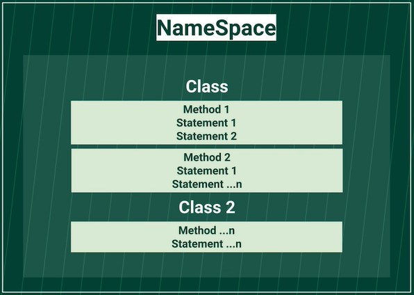

# Clases del Curso de Introducción a C#

## Instalación de Visual Studio Community

**Link para descargar Visual studio Community 2022:**
https://visualstudio.microsoft.com/es/thank-you-downloading-visual-studio/?sku=Community&rel=17

Link para descargar Visual studio Community 2019:
https://visualstudio.microsoft.com/es/thank-you-downloading-visual-studio/?sku=Community&rel=16

Link para descargar Visual studio Professional 2022:
https://visualstudio.microsoft.com/es/thank-you-downloading-visual-studio/?sku=Professional&rel=17

Link para descargar Visual studio Professional 2019:
https://visualstudio.microsoft.com/es/thank-you-downloading-visual-studio/?sku=Professional&rel=16

**Se Recomienda usar:**
https://www.jetbrains.com/rider/

y una aplicacion para mejorar la programacion
https://www.jetbrains.com/resharper/

## Conoce .NET Framework 6

Pequeño resumen acerca de las versiones de .NET:

.NET Framework (4.8) = Apicaciones solo para Windows
.NET Core (3.1) = Version OpenSource que es multiplataforma.
.NET 5 (y luego la 6) = Version más reciente que unifica .Net Core con .NET Framework, opensource y multiplataforma

## Introducción a Visual Studio y nuestro primer "Hola, mundo" en consola

## ¡Nuestro primer "Hola, mundo" en una aplicación gráfica!

XAML:
eXtensible Application Markup Language
Lenguaje de marcado para la interfaz de usuario de WPF

WPF:
Windows Presentation Foundation
Tecnologia para desarrollar interfaces de interacción en Windows.

## ¿Cómo funcionan los Namespaces en C#?

Namespace: Tiene que representar algo significativo para el programa, con un nombre único. Cada Namespace puede tener diferentes clases, tantas como requiera el programa.

Clases: Las clases son plantillas para crear entidades, tantas como se requiera. Cada clase puede tener diferentes métodos.

Métodos: La forma o manera de ejecutar funcionalidades del programa.

## Tipos de datos

revisar la documentacion de microsoft 
https://docs.microsoft.com/en-us/dotnet/csharp/language-reference/builtin-types/built-in-types

 

## Arreglos en C#

Importante recordar, los arreglos tienen un length, que es el tamaño real de tu arreglo, por ejemplo:

string[] coffeTypes = new string[4];
En este caso tenemos un arreglo de tamaño 4, lo que significa que el último dato en este arreglo será el índice 3.¿Por qué?
Porque los arreglos comienzan desde índice 0, hasta el length - 1. en este caso, 3.

Por lo tanto si yo hago un ciclo cualquiera, como un for, debo hacerlo hasta el tamaño del arreglo < 1, es decir, el término del ciclo debe ser cuando tengo un valor igual al length o mayor.

Por ejemplo

for(int i = 0 ; i < 4 ; i++){}
También importante recordar que los arreglos tienen integrados de manera implícita el length que tienen, por esto es que tambien funciona lo siguiente:

for(int i = 0 ; i < coffeTypes.Length ; i++){}

## Listas

Las listas cumplen la misma funcionalidad que un array almacenar información. Los array lo utilizaremos para almacenar información que no cambiará o será en casos particulares. En cambio una Lista se utilizará para la información que se vaya modificando constantemente (por eso utilizaremos los métodos provenientes de la clase list).