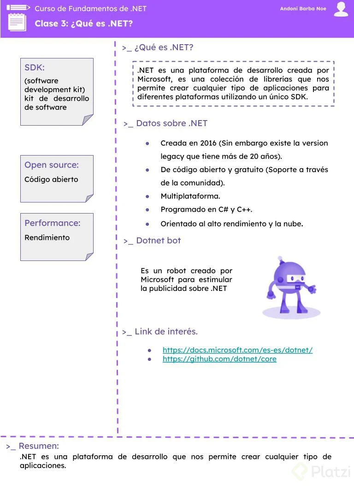
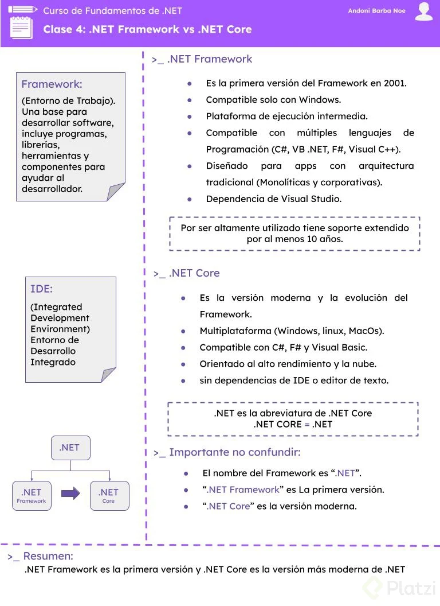
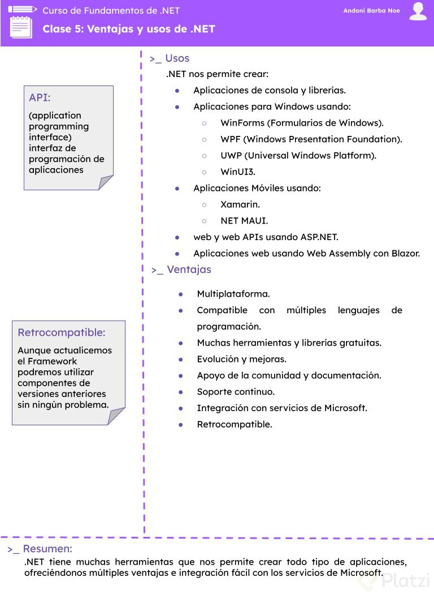
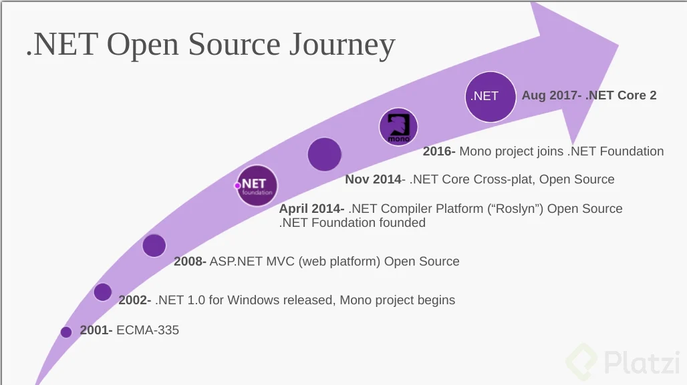
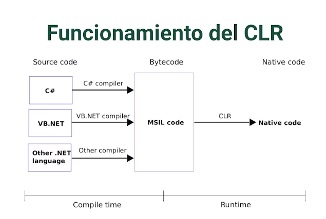
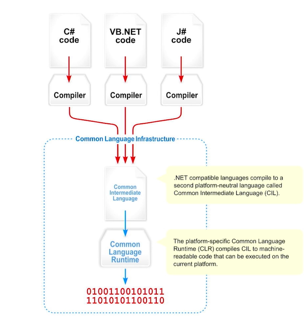
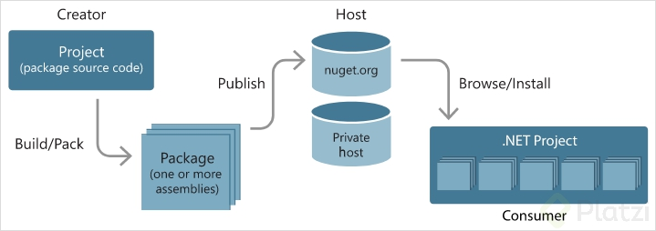

## 1. ¿Qué es .NET?
.NET (DOT NET) es una plataforma de desarrollo de aplicaciones creada por MICROSOFT, cuando se habla de .NET se habla de un conjunto de librerías que nos va a permitir desarrollar aplicaciones para diferentes plataformas.

Fue creada por MICROSOFT para poder ofrecer a los desarrolladores la oportunidad de crear fácilmente aplicaciones de todo tipo utilizando un único SDK, es decir un único conjunto de librerías base para todas las posibles plataformas uy posibles tipos de aplicaciones que existen en el mercado.

#### Datos generales de .NET

Fue creada en 2016, siendo un FRAMEWORK mas novedoso, aunque existe una versión ya existente con 20 años en el mercado. Dando a entender que es un marco de trabajo (FRAME WORK) maduro que ha recibido una modernización, esta versión moderna es la que será utilizado.

Es de código abierto y gratuito, no existiendo componente de pago como tal obligatorio para desarrollar en .NET, recibiendo soporte a través de la comunidad.
Es multiplataforma, no se requiere un sistema operativo especifico.

Fue programado en C# y C++, con el fin de crear un marco de trabajo con un nivel de rendimiento (PERFORMANCE) bastante elevado, siendo bastante rápido y eficaz y muy enfocado a la nube y los nuevos servicios que ofrece, permitiendo que sea muy versátil, permitiendo crear aplicaciones tradicionales y alojarlas en servidores OnPremise (Servidores Locales) como aplicaciones modernas y alojarlas en servicios CLOUD (En la nube como Google Cloud, Azure, etc.) .

.Net tiene una mascota, DOTNET BOT, un robot creado por Microsoft para estimular la publicidad respecto al mundo .NET, si lo ves ese evento o pagina tiene que ver con .NET.

#### Los links de interés:
* https://docs.microsoft.com/es-es/dotnet/
* https://github.com/dotnet/core

## 2. .NET Framework vs .NET Core

## 3. Ventajas y usos de .NET

## 4. Línea de tiempo de .NET y C#

## 5. Common language runtime CLR

* Transforma de Common Intermediate Language (CIL) o MSIL a Código nativo.
* Compilador en tiempo de ejecución.
* Agiliza la ejecución del código compilado.

## 6. Compilador Roslyn
* es conocido .NET Compiler Platform.
* C# y Visual Basic.
* Rápido y Ágil.
* Analiza estilo y calidad del codigo usando niveles de severidad
* Open Source
* Integrado por defecto en Visual Studio y al dotnet CLI.

## 7. Common Language Specification
Es un conjunto de reglas y métricas básicas que necesitan seguir y cumplir los lenguajes compatibles con .NET para luego ser compilados(Roslyn) a otro lenguaje neutral intermedio llamado CIL (Common Intermediate Language) donde finalmente será traducido al CLR (Common Language Runtime) que dará como resultado un lenguaje Assembly, lenguaje máquina.

El CLS asegura la completa interoperabilidad entre las aplicaciones, independientemente del lenguaje utilizado para crear la aplicación.

## 8. Common Type System
* Define los tipos generales que se usan dentro del lenguaje compatible con .NET.
* Provee la librería base para los tipos primitivos (byte, char, int).
* Provee un modelo de tipos orientado a objetos.

#### Categorías del CTS(Common Type System)
* Clases
* Estructuras
* Enumeraciones
* Interfaces
* Delegados
Todas ellas tienen subtipos.

## 9. IDEs para trabajar con .NET

**Visual Studio:** Es un IDE, solo corre en Windows y hay una versión para MAC pero no es tan completa por ahora. Es un IDE licnesiado, hay una versión gratis pero limitada por supuesto.

**RIDER:** Considerada la mejor opción si no se desea Visual Studio, tambien es licensiado, es multiplataforma.

**Visual Studio Code:** Editor de código, para mí la mejor opción, puesto que es multiplataforma y es totalmente gratuito, vas instalando herramientas y extensiones conforme los proyectos en los que vas trabajando. Arriba la descentralización y el contenido gratuito 

## 10. dotnet CLI

* CLI: Command-line interface.

tener en cuenta que para usar el comando, se debe instalar el SDK .Net:
~~~bash
> dotnet --help
> dotnet --version
> dotnet --info
~~~

## 11. Primera App con dotnet CLI
~~~bash
> dotnet new --list 
//para ver la lista de templates para iniciar el proyecto.

> dotnet new console
//creamos el proyecto con el template de consola.

> dotnet run
//lanzamos el proyecto recien creado.
~~~

## 12. Estructura de un proyecto .NET

Características del archivo .csproj ⚙
El archivo consoleapp.csproj no contiene nada de lógica, es un archivo de configuración.
Tiene un formato XML
En la parte superior se especifica un SDK, este varía de acuerdo al tipo de proyecto con el que estamos trabajando.
El OutputType es el resultado que tendríamos de la publicación del proyecto
El TargetFramework es la versión del Framework con la cual se está ejecutando el proyecto
El ImplicitUsing nos ayuda a que no tengamos que especificar las librerías que vayamos a necesitar dentro de nuestros archivos de código.

**Estructura de un proyecto**
~~~xml
<Project Sdk="Microsoft.NET.Sdk">

  <PropertyGroup>
    <OutputType>Exe</OutputType>
    <TargetFramework>net6.0</TargetFramework>
    <ImplicitUsings>enable</ImplicitUsings> //ayuda a que no este instancia cada libreria
    <Nullable>enable</Nullable>
  </PropertyGroup>

</Project>
~~~

Nota: El archivo .csproj y Program.cs son los archivos base de cualquier proyecto en .Net

## 13. Compilación y ejecución
~~~batch
# para ver la lista de templates de proyectos
> dotnet new --list

# para crear un proyecto
> dotnet new <tipo-proyecto>   # ej. dotnet new console: crea una aplicacion de consola

# para hacer correr nuestro proyecto
> dotnet run

# compila un proyecto y todas sus dependencias, tambien verificar que toda la sintaxis este bien y no se tengan problemas con dependencias
> dotnet build

# sirve restaurar las dependencias y las herramientas de un proyecto.
> dotnet restore

# nos permite ejecutar el proyecto y va revisando los cambios del proyecto en tiempo real (similar a nodemon en node)
> dotnet watch run
~~~

Para mas informacion:
* https://docs.microsoft.com/en-us/dotnet/core/tools/

## 14. Archivos de compilación

Dentro del proceso de compilación tenemos dos carpetas relacionadas
ㅤ
📁 bin : Contiene el archivo compilado del proyecto .dll y más

📁 obj : Tiene los archivos que se generan en la compilación de manera temporal, para despues ser entregado al archivo bin.
ㅤ
| 💡 Para limpiar la compilación hecha, podemos usar el comando > dotnet clean
ㅤ

Existen dos modos de compilación en .NET
ㅤ
* modo debug
Prepara la aplicación para el uso en un ámbito de pruebas, suele ser un poco más pesado que el modo de compilado release. Se recomienda no usar este compilado en modo producción, ya que se puede exponer información que solo nos interesa que se muestre cuando estamos probando y no así cuando nuestros clientes lo ejecuten.
ㅤ
* modo release

Prepara la aplicación para que esté lista en producción, tenga un mejor performance y rendimiento, además de que sea mucho más liviano. Elimina todos los archivos que no se necesitan en producción.

# el comando que nos permite compilar a producción es
~~~batch
dotnet build --configuration release
Ideas/conceptos claves
~~~

.dll: es un archivo que viene una compilación de un lenguaje de alto nivel (ej. C#)
ㅤ
.exe: es un archivo ejecutable que únicamente se utiliza en Windows, resumiendo su funcionamiento toma el archivo .dll y lo ejecuta en nuestro ordenador.

## Archivo Global JSON

Archivo Global JSON: Es un archivo que nos permite administrar las versiones los SDK que trabajamos en .NET

para crear el archivo global usamos lo siguiente:
~~~ batch
dotnet new globaljson
~~~~

~~~json
{
  "sdk": {
    "allowPrerelease": false,
    "version": "5.0.7"
  }
}
~~~

configuraciones
version:“6.0.102” (siempre trae la version mas reciente pero podemos usar y forzar a alguna version que tengamos instaladas)
allowPrerealese:false (habilita o deshabilita el uso de realease beta o alpha o de prueba para evitar fallas del compilado)

## Cómo encontrar paquetes para .NET usando NuGet

NuGet: Gestor de paquetes de .NET
ㅤ
Es el gestor de paquetes de .NET, podemos encontrar diferentes librerías publicadas y compartidas por otros desarrolladores

Tenemos la posibilidad de crear nuestro propio servidor NuGet para librerías cerradas y que sean consumidas por nuestra organización.
ㅤ
El flujo de paquetes entre creadores, hosts y consumidores

