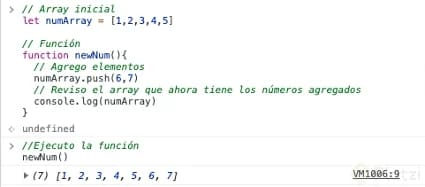
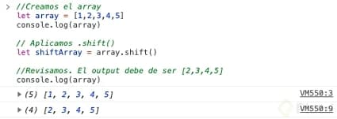

Curso básico de JavaScript

## 1. ¿Qué es JavaScript?

**¿Cómo nace Javascript?**

Nace con la necesidad de generar dinamismo en las páginas web y que a su vez los usuarios y las empresas pudieran interactuar unos con otros.

**¿Qué es Javascript?**

Es un lenguaje interpretado, orientado a objetos, débilmente tipado y dinámico. **Débilmente tipado**

Se pueden hacer operaciones entre distintos tipos de datos (enteros con strings, booleanos con enteros, etc).

**Dinámico**

Corre directamente en la etapa de Runtime sin una etapa de compilación previa. Esto permite probar nuestro código inmediatamente; pero también es lo que hace que los errores se muestran hasta que se ejecuta el programa.

**¿Realmente es Javascript un lenguaje interpretado?**

Si, y la razón es que el navegador lee linea por linea nuestro código el cuál le indica lo que tiene que hacer, sin la necesidad de compilar. Todo esto es controlado por el motor de Javascript V8 del navegador

**Javascript es Basckwards Compatible**

Todas las funciones nuevas que salen de Javascript no dañará el trabajo ya hecho, pero no se podrá utilizar en nuestro entorno de trabajo inmediatamente. Para solucionar esto está **Babel** que permite utilizar las nuevas características del lenguaje pero lo transforma a una versión que el navegador pueda entender.

## 2. ¿Por qué JavaScript?

JavaScript tiene una **comunidad enorme** de desarrolladores que te pueden ayudar a generar diferentes cosas.

1. Si solo estuvieras interesado en trabajar **aplicaciones web** tienes muchos frameworks y librerías construidas en JavaScript que te van a ayudar a hacer proyectos de forma mucho mas rápida, eficiente y robusta (Angular, View, React,entre otros)
2. Si no quieres trabajar solo en aplicaciones Web puedes utilizar JavaScript con un framework que se llama React Native para poder **construir aplicaciones nativas** como Android y IOS.
3. Puedes construir **aplicaciones de escritorio** con JavaScript, usando un framework llamado Electron, pueden correr en Mac o Windows.
4. También puedes trabajar en la parte del **Back-end** o **IOT** (Internet Of Things) es un concepto que se refiere a una interconexión digital de objetos cotidianos con Internet. Esto con un Framework llamado Node JS, el cual es un entorno de ejecución de JavaScript que corre directamente en el Back-end.

## 3. Elementos de un Lenguaje de Programación: Variables, Funciones y Sintaxis

Existen 2 componentes importante en JS

Valores o Datos: Almacenan información Funciones: realizan acciones con la información.

### VALORES PRIMITIVOS y VALORES NO-PRIMITIVOS (VALORES TIPO OBJETO)

Los datos pueden ser de VALORES PRIMITIVOS (básicos):

* Números: 40

* String: "Texto"

* Booleanos: **TRUE OR FALSE**

* Vacíos o **Empty** value: **null**, undefined; cuando tenemos un valor en faltante, para guardar cosas cuando las necesitamos, una caja vacía.

También existen VALORES NO-PRIMITIVOS o VALORES 

* TIPO OBJETO: Array [ ] : [1,2,3] (son valores primitivos)

* Valor tipo object { }: { name: "Platzi"}

si en la consola escribo la palabra reservada: typeof y seguido una variable me devuelve el tipo de variable que es. Ej: typeof nombre

## 4. Variables

Dentro de JavaScript tenemos tres formas de declarar una variable las cuales son: **var**, **const** y **let.**

1. **var:** Era la forma en que se declaraban las variables hasta ECMAScript 5. Casi ya no se usa porque es de forma global y tiene las siguientes características:

    - **Se puede reinicializar:** osea todas las variables se inicializan, por ejemplo:

        ~~~js
        var pokemonType
        pokemonType = "electric"
        ~~~

    - **Se puede reasignar:** osea la variable ya inicializada le reasignamos otro valor por ejemplo: inicializamos la variable: Var pokemonType = ‘electric’ ahora la reasignamos pokemonType = ‘grass’ ya no va var
    - **Su alcance es función global:** osea inicializamos la variable, pero la podemos llamar desde cualquier bloque (una llave abierta y una cerrada {}) pero hay que tener mucho cuidado con ello ya que puede haber peligro, no es recomendable usar VAR.

### const y let es la forma en que se declaran las variables a partir de ECMAScript 6

2. **const:** sirve para declarar variables que nunca van a ser modificadas:
    - **No se puede reinicilizar:** es una const única no puede haber otra inicializada con el mismo nombre. const pokemonType = ‘electric’ no puede haber: const pokemonType = ‘grass’
    - **No se pude re asignar:** una vez que la hayamos inicializado no la podemos reasignar solo con su nombre: const pokemonType = ‘electric’ no puede ejecutarse: pokemonType = ‘grass’
    - **es inmutable:** osea no puede cambiar con objetos:

3. **Let:** Son variables que pueden ser modificadas, se pueden cambiar:
    - **No se puede reinicilizar:** es una const única no puede haber otra inicializada con el mismo nombre. let pokemonType = ‘electric’ no puede haber: let pokemonType = ‘grass’
    - **Se puede reasignar:** Osea la variable ya inicializada le reasignamos otro valor por ejemplo: inicializamos la variable: let pokemonType = ‘electric’ ahora la reasignamos pokemonType = ‘grass’
    - **Su contexto de es bloque:** Solo funciona dentro de un bloque {}, fuera de ello no.

## 5. Funciones

Las funciones son las tareas que va a llevar a cabo el navegador. Existen 2 tipos de funciones

1) Declarativas
1) De expresión

* Ambas pueden llevar parámetros, que son los datos que necesitan para ejecutarse. Cada parámetro va separado por una coma.

* Cada instrucción que tenga la función debe terminar con ; .

* Si queremos que una función nos dé un numero o dato tenemos que usar la siguiente sintaxis:

    **return <data>**

### Las funciones declarativas tienen la siguiente sintaxis:

~~~js
function <Nombre-de-la-función> (Parámetros de la función) {
    Instrucciones
};
~~~

## 6. ¿Cuándo utilizar una función declarativa y una expresiva?

Cuando hablamos de funciones en JavaScript, tenemos dos tipos de funciones: Funciones Declarativas (function declaration / function statement) y Expresiones de función (function expression / funciones anónimas).

**Funciones Declarativas:**

En las funciones declarativas, utilizamos la palabra reservada function al inicio para poder declarar la función:

~~~js
**function saludar**(nombre) {

console.log(`Hola ${nombre}`);

} saludar('Diego');
~~~

**Expresión de función:**

En la expresión de la función, la declaración se inicia con la palabra reservada var, donde se generará una variable que guardará una función anónima.

~~~js
**var** nombre = **function**(nombre){

console.log(`Hola ${nombre}`)

} nombre(‘Diego’);
~~~

En la expresión de función, la función podría o no llevar nombre, aunque es más común que se hagan anónimas.

**Diferencias:**

A las funciones declarativas se les aplica hoisting, y a la expresión de función, no. Ya que el hoisting solo se aplica en las palabras reservadas var y function.

Lo que quiere decir que con las funciones declarativas, podemos mandar llamar la función antes de que ésta sea declarada, y con la expresión de función, no, tendríamos que declarar primero, y después mandarla llamar.

## 7. Scope

Es el alcance que tiene las variables.

Existen dos tipos de Scope:

- Scope Global: lo que está en global no puede acceder a lo que está en local.
- Scope Local: lo que está en local puede acceder a lo que está en global.

## 8. Hoisting (elevación)

El Hoisting solo funciona con versiones pasadas de JavaScript es decir de M script 5 hacia abajo y de M script 6 hacia delante ya no sucede

En JavaScript, las declaraciones (por ejemplo, de variables o funciones) se mueven al principio de su scope o ámbito. Este comportamiento se conoce como hoisting y es muy importante tenerlo en cuenta a la hora de programar para prevenir posibles errores.

- Las funciones siempre se mueven arriba del scope. Por lo tanto, podemos elegir donde declararlas y usarlas.
- La declaración de las variables se mueven arriba del scope, pero no la asignación. Antes de usar una variable, habrá que crearla y asignarla.

## 9-Coerción

Coerción es la forma en la que podemos cambiar un tipo de valor a otro, existen dos tipos de coerción:

Coerción implícita = es cuando el lenguaje nos ayuda a cambiar el tipo de valor. Coerción explicita = es cuando obligamos a que cambie el tipo de valor.

### Ejemplos de Coerción:

~~~js

// === Implicit Coercion === 

var a = 20;

var b = a + ""; 
console.log(b, typeof b); // "20" "string"

// Otro ejemplo
var c = 4 * "7"
console.log(c, typeof c); // 28 "number"

// más ejemplos

var x = [1,2];
var y = [3,4]; 

x + y // En este ejemplo, por la concatenación, ambos arrays son obligados a convertirse en strings, y luego se juntan.

// === Explicit coercion ===

var c = String( a );
console.log(c, typeof c); // "20" "string"

var d = Number( c );
console.log(d, typeof d); // 20 "number"

// Otro ejemplo

var a = 30; 
var b = a.toString();
console.log(b, typeof b); // "30" "string"

var c = "100"; 
var d = +c; // Unary operator '+' de forma explícita convierte a número
console.log(d, typeof d); // 100 "number"

// más ejemplos

var num1 = "3.14"; 
var num2 = 5 + +num1; 
console.log(num2); // 8.14

var value = "1"
var booleanValue = Boolean(value)
console.log(booleanValue, typeof boolean) // true "boolean"
~~~

## 10. Valores: Truthy y Falsy

la función boolean nos dice si ese valor booleano es verdadero o falso

***¿Que tipos por default son verdaderos y falsos?***

Usamos la función de JS que es ***Boolean()*** dentro del paréntesis ponemos el valor y nos dice si el mismo el False o True.

–> ***Falsy***

~~~js
//Ejemplos en los que Boolean devuelve Falso:
Boolean(0); //false
Boolean(null); //false
Boolean(NaN); //false
Boolean(undefined); //false
Boolean(false); //false
Boolean(""); //false
~~~

–> ***Truthy***
~~~js
//Ejemplos en los que Boolean devuelve verdadero:
Boolean(1); //true -> para 1 o cualquier número diferente de cero (0)
Boolean(-1); //true  -> numeronegativos
Boolean(true); //true
Boolean("a"); //true ->para cualquier caracter o espacio en blanco en el string
Boolean([]); //true -> aunque el array esté vacío
Boolean({}); //true -> aunque el objeto esté vacío
Boolean(function(){}); //Cualquier función es verdadera también
~~~

Todo esto lo vamos a usar en condiciones esto valida si es verdadero o falso para ejecutar cierta acción.

## 11. Operadores: Asignación, Comparación y Aritméticos

Para realizar operaciones en JavaScript es necesario conocer los diferentes tipos de operadores que necesitarás. Los tipos de operadores en el lenguaje son: aritméticos, asignación y comparación.

### Qué son los operadores aritméticos

Los operadores aritméticos se utilizan para efectuar operaciones matemáticas. Para realizar las operaciones básicas, como suma, resta, multiplicación y división; utiliza los siguientes operadores:

~~~js
// Suma
2 + 3 // 5

// Resta
5 - 3 // 2

// Multiplicación
4 * 2 // 8

// División
6 / 2 // 3

// Módulo (residuo de la división)
console.log(5 % 2) // 1
~~~
Recuerda que no existe la división entre 0. En ese caso, JavaScript devolverá el valor Infinity.

### Qué es el operador de residuo
El operador de residuo (%), el signo de porcentaje, devuelve el residuo de una división.

Residuo en una división:
~~~js
// Residuo
21 % 5 // 1
~~~
Esto es importante para saber los múltiplos de cualquier número o si un número es par.

### Qué es el operador de concatenación
El operador de concatenación consiste en unir dos o más strings.

~~~js
"Hola" + "Platzi" // "Hola Platzi"
~~~

El operador de concatenación es semejante al operador de suma, pero no es el mismo. Si utilizas este operador con diferentes tipos de datos, JavaScript ejecutará una coerción implícita.

### Cómo utilizar el operador de incremento y decremento
El operador de incremento (++) y decremento (--) consiste en aumentar o disminuir una unidad a una variable, respectivamente. Estos operadores se pueden emplear antes y después de la variable.

~~~js
variable++
variable--
++variable
--variable
~~~

Sin embargo, si se emplea antes o después, el comportamiento es diferente. Si está previamente, el valor de la variable aumenta y devuelve el valor actual. Si está después, el valor de la variable aumenta, pero devuelve el valor anterior.

~~~js
var a = 3
var b = 3

console.log(a++) // 3
console.log(++b) // 4
console.log(a) // 4
console.log(b) // 4
~~~

### Qué son los operadores de asignación
En la clase de variables aprendiste un operador de asignación (=). Este operador es diferente a los operadores de igualdad (== y ===).

El operador de asignación (=) consiste en asignar un valor a una variable.
~~~js
var saludo = "Hola Mundo"
~~~

### Operadores de asignación combinada
En ciertos casos, reasignarás la misma variable más otro valor. Estas variables pueden utilizarse como acumuladores o contadores.
~~~js
var contador = 1
contador = contador + 1
contador = contador + 1
console.log(contador) // 3
~~~

Una forma para evitar estar repitiendo la variable en la reasignación es combinarlas con los operadores aritméticos antes del operador de asignación.

| Tipo                        | Operador    | Forma larga    |
|-----------------------------|-------------|----------------|
| Asignación de suma          | a += b      | a = a + b      |
| Asignación de resta         | a -= b      | a = a - b      |
| Asignación de multiplicación| a *= b      | a = a * b      |
| Asignación de división      | a /= b      | a = a / b      |

#### Ejercicio de operadores de asignación
Observa el siguiente código, ¿cuál será el resultador del console.log?

~~~js
var contador = 1

contador += 2
contador -= 1
contador *= 5
contador /= 2

console.log(contador)
~~~

La respuesta es 5. ¿Tienes la misma respuesta?

### Qué son los operadores de comparación
Un operador de comparación compara dos o más valores y devuelve un valor lógico (verdadero o falso).

#### Qué son los operadores de igualdad
Existen dos tipos de igualdad:

* Igualdad por valor (==): compara dos variables solamente por su valor. 
    * Por ejemplo: "3" de tipo string y 3 de tipo número son iguales.
* Igualdad por valor y tipo de dato (===): compara dos variables por su valor y tipo de dato. 
    * Por ejemplo: "3" de tipo string y 3 de tipo número no son iguales. Solamente 3 y 3, ambos de tipo número son iguales.

~~~js
//Igualdad
"3" == 3 // true
3 == 3 // true

// Igualdad estricta
"3" === 3 // false
3 === 3 // true
~~~

En conclusión, siempre utiliza la comparación por valor y tipo de dato para evitar errores. Los operadores de igualdad son diferentes al operador de asignación (=).

### Qué son los operadores de desigualdad
Igualmente que los operadores de igualdad, existen dos tipos:

* Desigualdad por valor (!=)
* Desigualdad por valor y tipo de dato (!==)

~~~js
//Desigualdad
"3" != 3 // false
3 != 3 // false

// Desigualdad estricta
"3" !== 3 // true
3 !== 3 // false
~~~

### Qué son los operadores de mayor o menor
Los operadores de mayor o menor evalúan intervalos, dependiendo si el valor especificado está incluido o no incluido.

~~~js
// Menor que
3 < 5 // true

// Mayor que
3 > 5 // false

// Mayor o igual a que
3 >= 3 // true
3 >= 5 // false

// Menor o igual a que
3 <= 3 // true
3 <= 5 // true
~~~

### Qué son los operadores lógicos
Los operadores lógicos comparan dos o más expresiones y devuelve un valor lógico (verdadero o falso). Las expresiones son comparaciones entre valores, se utiliza en conjunto con los operadores de comparación.

#### Qué es el operador disyunción lógico
El operador de disyunción o AND (&&) devuelve verdadero, si y solo si ambas expresiones son verdadero. 

Se lee de la siguiente manera: “La expresión 1 es verdadero Y la expresión 2 es verdadero, entonces es verdadero”.

| Expresión 1 | Expresión 2 | 1 && 2 |
|-------------|-------------|--------|
| true        | true        | true   |
| true        | false       | false  |
| false       | true        | false  |
| false       | false       | false  |

Por ejemplo, si queremos saber si un número está entre 10 y 20. Es decir, un número que es mayor o igual que 10 Y menor o igual que 20.

~~~js
var a = 15
var b = 5

(a >= 10) && (a <= 20) // true
(b >= 10) && (b <= 20) // false
~~~

En conclusión, el operador de disyunción lógico (&&) devuelve verdadero solo si ambas expresiones son verdaderas.

### Qué es el operador conjunción lógico
El operador de conjunción o OR (||) devuelve verdadero, si al menos una de las expresiones es verdadero. Se lee de la siguiente manera: “La expresión 1 es verdadero O la expresión 2 es verdadero, entonces es verdadero”.

| Expresión 1 | Expresión 2 | 1 \|\| 2 |
|-------------|-------------|----------|
| true        | true        | true     |
| true        | false       | true     |
| false       | true        | true     |
| false       | false       | false    |

Por ejemplo, si queremos saber si un número es menor que 10 O mayor que 20. Es decir, un número que es menor que 10 O mayor que 20.

~~~js
var a = 5
var b = 15

(a < 10) || (a > 20) // true
(b < 10) || (b > 20) // false
~~~

En conclusión, el operador de conjunción lógico (||) devuelve verdadero si al menos una de las expresiones es verdadera.

### Cómo utilizar el operador de negación lógica
El operador de negación lógica o NOT (!) invierte el valor lógico de una expresión. Si una expresión es verdadera, el operador NOT la convierte en falsa, y viceversa.

| Expresión | !Expresión |
|-----------|------------|
| true      | false      |
| false     | true       |

Por ejemplo:
~~~js
var a = 5
var b = 15

!(a < 10) // false
!(b > 20) // true
~~~
En conclusión, el operador de negación lógica (!) invierte el valor lógico de una expresión.

Esto concluye la sección de Operadores: Asignación, Comparación y Aritméticos en JavaScript.

## 12. Condicionales: If, Else, else if

### Cómo utilizar el condicional ifen JavaScript
Un condicional evalúa si una expresión o condición es verdadera. Por ejemplo, si mi edad es mayor o igual que 18, puedo conducir.

~~~js
if (edad >= 18){
    console.log("Puedes conducir")
}
~~~

La palabra reservada else evalúa cuando la expresión del if es falsa, pero no es obligatorio colocarlo. En el ejemplo anterior, la condición contraria del if es la edad menor que 18, entonces no puedes conducir.

~~~js
if (edad >= 18){
    console.log("Puedes conducir")
} else {
    console.log("No puedes conducir")
}
~~~

En otras palabras, si (if) una acción (expresión) es verdadera (true) hago una acción (bloques de código). En el caso contrario (else) efectúo otra acción

### Cómo anidar condicionales al programar
Has aprendido a usar un condicional, pero ¿y si tenemos varias condiciones? Entonces empleamos las palabras reservadas else if junto a la condición a ejecutar, puedes utilizar varias condiciones que necesites. Sin embargo, JavaScript evalúa la primera condición, luego a la segunda, y así sucesivamente. Esto es importante para ordenar las condiciones correctamente y no sobreescribirlas.

~~~js
if (condicion1){
   // Bloque 1
} else if (condicion2){
    // Bloque 2
} else if (condicion3){
   // Bloque 3
} else {
    // Bloque else
}
~~~

Ejemplo en una función:
~~~js
function calcularDescuento(articulos, precio) {
  var precioFinal

  if (articulos <= 5) {
    //Hasta 5 artículos
    precioFinal = precio * (1 - 0.1)
  } else if (articulos > 5 && articulos <= 10) {
    //De 6 a 10 artículos
    precioFinal = precio * (1 - 0.15)
  } else {
    //De 10 artículos en adelante
    precioFinal = precio * (1 - 0.2)
  }

  return precioFinal
}

calcularDescuento(4, 10) // 9
calcularDescuento(8, 20) // 17
calcularDescuento(15, 50) // 40
~~~

### Operador ternario
El operador ternario consiste en evaluar si una expresión es verdadera o falsa. Parecido a un condicional, pero en una línea de código. Esto sirve para evaluar una condición de manera rápida. La estructura que sigue es la siguiente y se lee como: "La condición es verdadera (?), si es así ejecuta el “Bloque verdadero”, caso contrario (:), ejecuta el “Bloque falso”.

~~~js
condicion ? Bloque verdadero : Bloque falso
~~~

Ejemplo
~~~js
function esPar(numero){
    return numero % 2 === 0 ? "Es par" : "No es par"
}

esPar(2) // "Es par"
esPar(3) // "No es par"
~~~

## 13. Switch
La **estructura switch** es otra manera de evaluar condiciones, la diferencia con if es que las condiciones deben ser iguales a un caso o algo específico.

### Cómo utilizar el condicional switch

Colocamos la palabra reservada switch y seguido de la variable o expresión a evaluar, pero sin ningún operador de comparación.

~~~js
switch (expresion) {}
~~~

Después colocamos cada caso con la palabra reservada case y el valor que deberá ser igual a la expresión. Seguido colocamos el bloque de código a ejecutar y al final la palabra reservada break para que no vuelva a evaluar otra condición si ya se cumplió.

~~~js
switch (expresion) {
    case 1: {
        // Bloque 1
        break
    }
    case 2: {
        // Bloque 2
        break
    }     
}
~~~

Finalmente, colocamos la condición por defecto con la palabra reservada default que se ejecutará si ninguno de los casos fue el correcto. Esto es semejante al bloque else.

~~~js
switch (expresion) {
  case 1: {
    // Bloque 1
    break
  }
  case 2: {
   // Bloque 2
    break
  }
  default: {
    // Bloque por defecto
  }
}
~~~

Esto se leería de la siguiente manera: evalúa (switch) la variable expresion, en el caso de que sea igual a uno (case 1), entonces ejecuta el bloque 1 y termina (break), en el caso de que sea igual a dos (case 2), entonces ejecuta el bloque 2 y termina (break), si no se cumple ninguna, ejecuta un bloque por defecto (default).

### Ejemplo utilizando switch
Por ejemplo, creemos un semáforo.

~~~js
function semaforo(color) {
  switch (color) {
    case "verde": {
      console.log("¡Sigue!")
      break
    }
    case "amarillo": {
      console.log("¡Detente!")
      break
    }
    case "rojo": {
      console.log("¡No puedes avanzar!")
      break
    }
    default: {
      console.log("¡No reconozco ese color! :(")
    }
  }
}

semaforo("verde") //'¡Sigue!'
~~~

## 14. Arrays

Un array es una estructura de datos que permite almacenar una serie de datos localizados por índices y separados por comas.

### Qué son los índices
El índice es la forma en que accedemos a los elementos de los arrays. En JavaScript, los índices empiezan desde 0, es decir, la primera posición es el índice 0. Un array se inicia mediante la sintaxis de corchetes [] y es tipo de dato objeto.

~~~js
var array = [1,2,3,4]
~~~

### Cómo acceder a los elementos del array
Para acceder a los elementos del array se utiliza la siguiente estructura:
~~~js
array[índice]
~~~

Para saber la cantidad de elementos de un array se utiliza la propiedad length.

~~~js
var array = [1,2,3,4]
var longitud = array.length
console.log(longitud) // 4
~~~

Ten en cuenta que la posición del elemento es diferente al índice del mismo.

Entonces, para acceder a un elemento del array, únicamente podrás utilizar los índices desde el 0 hasta array.length -1. Si se accede a un índice que no existe, devolverá undefined.

~~~js
var nombres = ["Andres", "Ramiro", "Silvia"]

nombres[0] // "Andres"
nombres[1] // "Ramiro"
nombres[2] // "Silvia"
nombres[3] // undefined
~~~

### Qué es la mutabilidad en los arrays
La mutabilidad hace referencia a la capacidad de una estructura de datos a cambiar. Esto permite cambiar los valores de los elementos de un array cuando accedemos a sus elementos mediante un índice.

Por ejemplo, cambiemos el segundo elemento con índice 1 al valor de “Platzi”:

~~~js
var nombres = ["Andres", "Ramiro", "Silvia"]
// Accedemos y mutamos el segundo elemento
nombres[1] = "Platzi"

console.log(nombres) // ["Andres", "Platzi", "Silvia"]
~~~

### Qué son los métodos de arrays
Los métodos de arrays son funcionalidades extra. Es semejante a las funciones, pero se accede mediante la notación punto array.metodo(argumentos).

Existen métodos mutables, es decir, que cambian el array original. Estos métodos son:

* **Array** es un tipo de estructura de datos, objeto. Puede guardar datos en forma de lista.

* **lenght** devuelve la longitud del array.

* **push()** agrega elementos al final del array.

* **shift()** Elimina el elemento que está en el inicio del array.

* **pop()** elimina el último elemento del array.

* **unshift()** agrega un elemento al array, pero lo agrega en primer lugar.

* **indexOf** devuelve la posición de un elemento del array.

## 15. Loops: For y For...of

Un bucle (loop) o ciclo repetitivo es una estructura de control que te permite realizar una o varias instrucciones mientras una condición sea verdadera.

#### Existen dos tipos de ciclos repetitivos:

* For (para)
* While (mientras)

### Qué es un ciclo for

Para el ciclo for conocemos la cantidad de veces que la estructura repetirá una o varias instrucciones.

* Por ejemplo, si queremos los 10 primeros números, sabemos que el ciclo se repetirá 10 veces. Si accedemos a los elementos de un array, sabemos que el ciclo se repetirá length veces.

### Cómo utilizar el ciclo for
La estructura del ciclo for es la siguiente:

~~~js
for (condición) {
    // Bloque de código
}
~~~

La condición consta de tres partes:

* Inicio: se debe inicializar una variable que será evaluada en la expresión a comparar. Esta variable puede ser declarada dentro o fuera de la condición.
* Comparación: es una expresión que debe cumplir la variable inicial, cuando no se cumpla, el ciclo termina.
* Pasos: son los intervalos que cambiará la variable inicial, mientras cumpla con la expresión de comparación.
Cada una de las partes debe estar separada por un punto y coma ( ;).

### Practiquemos el uso del bucle for
Por ejemplo, generemos los números del 1 al 10:

* Inicio: inicializamos una variable con el valor de 1, generalmente se utiliza i (índice) como variable para el bucle, pero no es obligatorio. En este caso usaremos var num = 1.
* Condición: La condición será mientras sea menor o igual que 10 (num <= 10),
* Pasos: Debemos aumentar la variable en una unidad, por lo tanto, podemos utilizar num = num +1, num += 1 o num++. Este último únicamente cuando la variable aumente una unidad.
La estructura es la siguiente:

~~~js
for (var num = 1; num <= 10; num++) {
  console.log(i)
}
~~~

Esto se leería como: “Para (for) la variable num que inicia en 1 (num = 1) mientras sea menor o igual que 10 (num <= 10) en pasos de 1 (num++) ejecuta una o varias instrucciones (console.log)”.

Mira la siguiente tabla que muestra cómo cambia la variable num en cada ciclo.

| #Ciclo | num | num <= 10 | num++ |
|-------|-----|-----------|-------|
| 1.º   | 1   | true      | 2     |
| 2.º   | 2   | true      | 3     |
| …     | …   | …         | …     |
| 10.º  | 10  | true      | 11    |
| 11.º  | 11  | false     | Termina el bucle |

### Cómo recorrer arrays con el ciclo for
En el anterior ejemplo aprendiste a generar números del 1 al 10, utilicemos la misma lógica para recorrer un array.

¿Qué debemos usar para acceder a los elementos de un array? Exactamente, sus índices (variable i). Debemos generar los índices desde 0 hasta length (que no debe estar incluido). Con esto, empleamos la misma variable i para acceder a cada elemento con la sintaxis de corchetes array[i].

La estructura sería siguiente:
~~~js
var nombres = ["Andres", "Diego", "Platzi", "Ramiro", "Silvia"]

for(var i = 0; i < nombres.length; i++){
    console.log( nombres[i] )
}
~~~

### Qué es un ciclo for … of
El ciclo for ... of es una variación del ciclo for que se utiliza para recorrer los valores de los elementos de un array.

La estructura del ciclo for ... of es la siguiente:

~~~js
for ( var elemento of array){
    //Bloque de código
}
~~~

La variable elemento es la referencia a cada uno de los elementos del array. Este puede tener cualquier nombre, por eso se inicia con var, debido a que es una variable como el índice i en el bucle for.

~~~js
var array = [5, 4, 3, 2, 1]

for (var elemento of array) {
  console.log(elemento) // 5 4 3 2 1
}
~~~

Por convención, se escribe la variable elemento en singular con respecto al nombre del array. Por ejemplo, si el nombre del array es datos, el nombre de la variable de cada elemento sería dato, y así sucesivamente.

~~~js
for (var dato of datos) { ... }
for (var name of names) { ... }
for (var number of numbers) { ... }
for (var el of elements) { ... }
~~~

### Limitaciones del ciclo for … of
El ciclo for ... of solo accede al valor de cada uno de los elementos del array. Por consiguiente, si quieres cambiar el array original, no podrás, porque necesitas su índice para acceder y cambiar su valor.

Por ejemplo, si quieres duplicar el valor de cada elemento del array, necesitarás su índice.

~~~js
var numbers = [5, 4, 3, 2, 1]

// ❌ No cambia el array original
for (var number of numbers) {
  number = number * 2
}

console.log(numbers) // [5, 4, 3, 2, 1]

// ✅ Cambia el array original
for(var i=0; i < numbers.length; i++){
    numbers[i] = numbers[i] * 2
}

console.log(numbers) // [ 10, 8, 6, 4, 2 ]
~~~

Sin embargo, esto no es malo, depende del problema que estés afrontando. Una forma de solucionar el anterior problema utilizando for ... of, es creando otro array vacío para llenarlo con los nuevos valores, de esta manera no cambiará el array original.

~~~js
var numbers = [5, 4, 3, 2, 1]
var duplicates = []

for (var number of numbers) {
  duplicates.push(number * 2)
}

console.log(duplicates) // [ 10, 8, 6, 4, 2 ]
~~~

* Los bucles pueden ejecutar un bloque de código varias veces. JavaScript admite diferentes tipos de bucles:

- for - recorre un bloque de código varias veces
- for/in - recorre las propiedades de un objeto
- for/of - recorre los valores de un objeto iterable
- while - recorre un bloque de código mientras se cumple una condición específica
- do/while - también recorre un bloque de código mientras se cumple una condición específica
    ~~~js
    let result = '';
    let i = 0;

    do {
    i = i + 1;
    result = result + i;
    } while (i < 5);

    console.log(result);
    // Expected output: "12345"
    ~~~

## 16. Loops: While

Para el ciclo while no conocemos la cantidad de veces que la estructura repetirá una o varias instrucciones. Aunque también se puede acoplar para que realice un determinado número de repeticiones.

Por ejemplo, si queremos que un usuario ingrese un valor mayor a 0, no sabremos cuántas veces se equivocará. También, si queremos que un programa se ejecute hasta que el usuario ingrese una opción para salir.

### Cómo utilizar el ciclo while
La estructura del ciclo while es la siguiente:

~~~js
while (condición) {
    // Bloque de código
    // Cambiar la condición para salir del bucle
}
~~~

En este caso la condición es una expresión lógica a evaluar, si es verdadero repite el bloque de código, si es falso el ciclo termina. Debido a esto, necesitas cambiar la variable de la condición, para que no existe un bucle infinito.

### Generación de números con el bucle while

Por ejemplo, generemos los números del 1 al 10, ahora con el bucle while.

La estructura es la siguiente:

~~~js
var numero = 1

while ( numero <= 10 ){
    console.log(numero)
    numero++
}
~~~

### Control de variables con el bucle while
Otro ejemplo, tenemos un programa únicamente para estudiantes, queremos controlar que un usuario ingrese una edad menor de 18 (y mayor que 0 porque no existe edades negativas). Entonces utilizamos while debido a que no conocemos cuántas veces se equivocará el usuario.

Ejecuta el siguiente código en la terminal de tu navegador, e intenta ingresar un valor incorrecto y observa lo que sucede. Se utiliza la condición contraria a lo que queremos, porque es lo que controlaremos, al cambiar la variable edad evitamos el ciclo infinito.

~~~js
var edad = Number(prompt("Ingrese un valor: "))

while (edad > 18 || edad <= 0){
  edad = Number(prompt("Ingrese un valor correcto: "))
}

console.log("Gracias por ingresar al programa")
~~~

## 17. Objects

Un objeto en programación es una representación abstracta de un objeto en la vida real, sin embargo también puede entenderse como un contenedor de datos. Ejemplo:

Un objeto es una estructura de datos que permite almacenar valores mediante propiedad - valor a través de la sintaxis de llaves ({}) y separados por comas.

En las propiedades del objeto es opcional colocar las comillas. En el caso de que haya espacios, es obligatorio.

~~~js
var objeto = {
    clave1: "valor1",
   "clave 2": "valor2",
}
~~~

### Qué son los atributos y métodos
En programación orientada a objetos, un objeto es una representación de la realidad, en el cual sus características propias se definen como atributos y sus acciones se definen como métodos.

En otras palabras, los atributos son las variables y los métodos son las funciones propias de cada objeto.

Por ejemplo, definamos el objeto miAuto. Se coloca entre comillas la propiedad año porque el lenguaje no admite caracteres especiales del español. Aunque en ciertas situaciones si admite

~~~js
var miAuto = {
    marca: "Toyota",
    modelo: "Corolla",
    "año": 2020,
    detalle: function () {
        console.log("Es un auto")
    }
}
~~~

Las propiedades marca, modelo y "año" son los atributos del objeto miAuto. La propiedad detalle es un método del objeto miAuto.

### Cómo acceder a los valores de un objeto
A diferencia de los arrays, únicamente es necesario saber la propiedad del objeto para acceder a su valor.

Existen tres formas para acceder al valor de un objeto:

* Mediante la notación de corchetes
* Mediante la notación de punto

###Qué es la notación de corchetes
La notación de corchetes ya ese familiar para ti, similar a los arrays, indicamos entre corchetes la propiedad del objeto entre comillas.

~~~
objeto["propiedad"]
~~~

Por ejemplo, accedamos a las propiedades del objeto miAuto creado anteriormente.

~~~js
miAuto["marca"] // "Toyota"
miAuto["modelo"] // "Corolla"
miAuto["año"] // 2020
miAuto["detalle"] // ƒ detalle()
~~~

Observa que cuando accedes a un método, únicamente muestra la función, esto sucede porque la propiedad guarda dicha función que aún no es ejecutada. Para ejecutarla hay que utilizar los paréntesis.

~~~js
miAuto["detalle"]() // "Es un auto"
~~~

### Qué es la notación de punto
La notación de punto indicamos con un punto la propiedad del objeto. Si existen espacios, la única forma de acceder a esa propiedad es mediante la notación de corchetes.

objeto.propiedad

Por ejemplo, accedamos a las propiedades del objeto miAuto creado anteriormente.

~~~js
miAuto.marca // "Toyota"
miAuto.modelo // "Corolla"
miAuto.añó // 2020
miAuto.detalle // ƒ detalle()
~~~

Igualmente, para ejecutar el método hay que utilizar los paréntesis.

~~~js
miAuto.detalle() // "Es un auto"
~~~

### Cómo añadir propiedades de un objeto
Para añadir propiedades de un objeto, utilizamos la notación de corchetes o de punto con la nueva propiedad, asignándole su respectivo valor.

Por ejemplo, añadamos la propiedad color del objeto miAuto.

~~~js
miAuto["color"] = "rojo"
// o 
miAuto.color = "rojo"

console.log(miAuto)
/* {
  marca: 'Toyota',
  modelo: 'Corolla',
  'año': 2020,
  detalle: ƒ detalle(),
  color: 'rojo'  <---- nueva propiedad
} */
~~~

### Cómo modificar propiedades de un objeto
Para modificar propiedades de un objeto, utilizamos la notación de corchetes o de punto con la propiedad específica, asignándole su nuevo valor.

Por ejemplo, modifiquemos la propiedad marca, de "Toyota" a "Ford", del objeto miAuto.

~~~js
miAuto["marca"] = "Ford"
// o 
miAuto.marca = "Ford"

console.log(miAuto)
/* {
  marca: 'Ford', <--- Cambió de valor
  modelo: 'Corolla',
  'año': 2020,
  detalle: ƒ detalle(),
} */
~~~

### Cómo eliminar propiedades de un objeto
Para eliminar propiedades de un objeto, utilizamos la palabra reservada delete seguido de la propiedad del objeto.

Por ejemplo, eliminemos la propiedad marca del objeto miAuto.

~~~js
delete miAuto["marca"]
// o 
delete miAuto.marca

console.log(miAuto)
/* { 
  modelo: 'Corolla', <--- No existe la propiedad marca
  'año': 2020,
  detalle: ƒ detalle(),
} */
~~~

### El objeto contexto this
En JavaScript, el objeto contexto this hace referencia a diferentes valores según su contexto de ejecución. Como es un tema complejo de programación orientada a objetos, no profundizaré.

En objetos, el contexto this hace referencia al propio objeto. Esto sirve para acceder a los atributos y métodos propios del objeto.

~~~js

var miAuto = {
  //...
  detalle: function () {
    console.log(`Auto ${miAuto.modelo} del ${miAuto.año}.`)
  },
}

miAuto.detalle() // 'Auto Corolla del 2020.'
~~~

## 18. Función constructora

Existe un problema al momento de construir varios objetos a partir de un código base, los atributos deben cambiar con respecto a la nueva información. Para esto se utiliza una función constructora.

Una función constructora sirve para crear varios objetos a partir de nueva información, esto es recibido argumentos.

### Cómo generar varios objetos a partir de una función constructora
Para crear una función constructora, debemos definir los parámetros correspondientes, que serán los atributos del objeto, que cambiarán con la nueva información mediante argumentos. Estos argumentos deben hacer referencia a cada uno del nuevo objeto, esto mediante el objeto contexto this.

Ten en cuenta que los parámetros de la función son diferentes a los atributos del objeto 😄.

~~~js
function Auto(brand, model, year){
    this.marca = brand
    this.modelo = model
    this.año = year
    this.detalle = function () {
        console.log(`Auto ${this.modelo} del ${this.año}.`)
    }
}
~~~

Si ejecutamos la función Auto mostrará un error, necesitamos especificar que vamos a construir una instancia mediante la palabra reservada new.

~~~js
var miAuto = new Auto("Toyota", "Corolla", 2020)
/* Auto {
  marca: 'Toyota',
  modelo: 'Corolla',
  'año': 2020,
  detalle: ƒ ()
}*/
~~~

De esta manera, puedes crear varios objetos a partir de una función constructora que permita especificar atributos y métodos personalizados.

~~~js
var otroAuto = new Auto("Tesla", "Model 3", 2021)
var otroAuto2 = new Auto("Suzuki", "K-20", 2019)
var otroAuto3 = new Auto("Ferrari", "Model N", 2018)
~~~

Puede que observes la propiedad __proto__, no te preocupes, ya lo aprenderás.

## 19. Métodos de recorridos de Arrays

Existen métodos de arrays para recorrerlos, y devolver un valor o un array con nuevos resultados. Entre estos están dos muy importantes: map y filter.

Utilizaremos el siguiente array de objetos para los ejemplos de los métodos:

~~~js
var articulos = [
  { nombre: "Bici", costo: 3000 },
  { nombre: "TV", costo: 2500 },
  { nombre: "Libro", costo: 320 },
  { nombre: "Celular", costo: 10000 },
  { nombre: "Laptop", costo: 20000 },
  { nombre: "Teclado", costo: 500 },
  { nombre: "Audifonos", costo: 1700 },
]
~~~

### Cómo utilizar el método filter
El método filter consiste en crear un nuevo array a partir de los elementos originales filtrados mediante una función (callback) que indica la condición a cumplir y es inmutable. Si la condición se cumple, retorna el elemento completo.

**El método filter recibe dos argumentos:**

* La función que itera y evalúa si cada elemento del array si cumple con la condición especificada (obligatorio).
* Un objeto al que puede hacer referencia el contexto this en la función. Si se lo omite, será undefined. Recuerde que this es diferente según el lugar donde sea invocado.

~~~js
var otherArray = array.filter(function(), thisArg)
~~~

**La función, que recibe como argumento el método filter, utiliza tres parámetros:**

* El valor actual del elemento iterado. Es decir, si es la primera iteración, será el primer elemento, y así sucesivamente.
* El índice del elemento iterado. Es decir, si es la primera iteración, será el índice 0, y así sucesivamente.
* El array que está iterando.

~~~js
const other = array.filter(function(element, index, array))
~~~

### Practiquemos el uso del método filter
Utilicemos el array articulos que definimos para filtrar en un nuevo array los artículos cuyo costo sea menor o igual que 500.

Entonces utilizamos el método filter que retorne la condición que necesitamos. Recuerda que el primer parámetro de la función callback es cada uno de los elementos del array.

~~~js
var articulosFiltrados = articulos.filter(function (articulo) {
  return articulo.costo <= 500
})

console.log(articulosFiltrados)
/* [
  { nombre: 'Libro', costo: 320 },
  { nombre: 'Teclado', costo: 500 }
] */
~~~

### Cómo utilizar el método map
El método map es inmutable y consiste en crear un nuevo array a partir de los elementos originales transformados mediante una función (callback).

El método map recibe dos argumentos:

* La función que itera y transforma cada elemento del array (obligatorio).
* Un objeto al que puede hacer referencia el contexto this en la función. Si se lo omite, será undefined. Recuerde que this es diferente según el lugar donde sea invocado.

~~~js
var otherArray = array.map(function(), thisArg)
~~~

La función, que recibe como argumento el método map, utiliza tres parámetros opcionales:

* El valor actual del elemento iterado. Es decir, si es la primera iteración, será el primer elemento, y así sucesivamente.
* El índice del elemento iterado. Es decir, si es la primera iteración, será el índice 0, y así sucesivamente.
* El array que está iterando.

~~~js
var otherArray = array.map(function(element, index, array))
~~~

### Practiquemos el uso del método map
Utilicemos el array articulos que definimos para crear un nuevo array con el nombre de cada uno de los artículos.

Entonces utilizamos el método map que retorne el nombre de cada artículo. Recuerda que el primer parámetro de la función callback es cada uno de los elementos del array.

~~~js
var nombreArticulos = articulos.map(function (articulo) {
  return articulo.nombre
})
console.log(nombreArticulos)
/* 
[ 'Bici', 'TV', 'Libro', 'Celular', 'Laptop', 'Teclado', 'Audifonos' ]
*/
~~~

## 20. Recorriendo Arrays con .find(), .forEach() y .some()

Para continuar con otros métodos para recorrer arrays, aprenderás find, forEach y some.Utilizaremos el siguiente array de objetos para los ejemplos de los métodos:

~~~js
var articulos = [
  { nombre: "Bici", costo: 3000 },
  { nombre: "TV", costo: 2500 },
  { nombre: "Libro", costo: 320 },
  { nombre: "Celular", costo: 10000 },
  { nombre: "Laptop", costo: 20000 },
  { nombre: "Teclado", costo: 500 },
  { nombre: "Audifonos", costo: 1700 },
]
~~~

### Cómo utilizar el método find
El método find consiste en encontrar el primer elemento de un array que cumpla con la condición especificada en la función (callback). Si ningún elemento cumpla con la condición, retornará undefined.

**El método find recibe dos argumentos:**

* La función que itera y evalúa cada elemento del array hasta encuentre uno que cumpla con la condición especificada (obligatorio).
* Un objeto al que puede hacer referencia el contexto this en la función. Si se lo omite, será undefined.

~~~js
array.find(function(), thisArg)
~~~

**La función, que recibe como argumento, utiliza tres parámetros opcionales:**

* El valor actual del elemento iterado. Es decir, si es la primera iteración, será el primer elemento, y así sucesivamente.
* El índice del elemento iterado. Es decir, si es la primera iteración, será el índice 0, y así sucesivamente.
* El array que está iterando.

~~~js
array.find(function(element, index, array))
~~~

### Practiquemos el uso del método find
Utilicemos el array articulos que definimos para encontrar algún artículo que su nombre sea Laptop.

Entonces utilizamos el método find que retorne la condición que necesitamos. Recuerda que el primer parámetro de la función callback es cada uno de los elementos del array.

~~~js
var algunArticulo = articulos.find(function (articulo) {
  return (articulo.nombre = "Laptop")
})
console.log(algunArticulo)
/* 
{ nombre: 'Laptop', costo: 3000 }
*/
~~~

### Cómo utilizar el método forEach
El método forEach de los arrays consiste en ejecutar una función (callback) para cada uno de los elementos iterados. Iterar significa repetir una acción varias veces. Este método no retorna ningún valor.

**Este método recibe dos argumentos:**

* La función que itera cada elemento del array (obligatorio).
* Un objeto al que puede hacer referencia el contexto this en la función. Si se lo omite, será undefined.

~~~js
array.forEach(function(), thisArg)
~~~

**La función, que recibe como argumento el método forEach, utiliza tres parámetros opcionales:**

* El valor actual del elemento iterado. Es decir, si es la primera iteración, será el primer elemento, y así sucesivamente.
* El índice del elemento iterado. Es decir, si es la primera iteración, será el índice 0, y así sucesivamente.
* El array que está iterando.

~~~js
array.forEach(function(element, index, array))
~~~

### Practiquemos el uso del método forEach
Utilicemos el array articulos que definimos para mostrar todos los artículos.

Entonces utilizamos el método forEach y que ejecute la función console.log para cada uno de los elementos. Recuerda que el primer parámetro de la función callback es cada uno de los elementos del array.

~~~js
articulos.forEach(function (articulo) {
  console.log(articulo)
})
/* 
{ nombre: 'Bici', costo: 3000 }
{ nombre: 'TV', costo: 2500 }
...
{ nombre: 'Audifonos', costo: 1700 }
*/
~~~

### Cómo utilizar el método some
El método somees inmutable y consiste retornar un valor lógico verdadero si existe al menos un elemento que cumpla la condición establecida en la función (callback).

**El método some recibe dos argumentos:**

* La función que itera y evalúa cada elemento del array hasta que al menos uno cumpla con la condición especificada (obligatorio).
* Un objeto al que puede hacer referencia el contexto this en la función. Si se lo omite, será undefined.

~~~js
array.some(function(), thisArg)
~~~

**La función, que recibe como argumento el método some, utiliza tres parámetros:**

* El valor actual del elemento iterado. Es decir, si es la primera iteración, será el primer elemento, y así sucesivamente.
* El índice del elemento iterado. Es decir, si es la primera iteración, será el índice 0, y así sucesivamente.
* El array que está iterando.

~~~js
array.some(function(element, index, array))
~~~

### Practiquemos el uso del método some
Utilicemos el array articulos que definimos para saber si existe al menos un artículo con el costo menor o igual que 700.

Entonces utilizamos el método some que retorne la condición que necesitamos. Recuerda que el primer parámetro de la función callback es cada uno de los elementos del array.

~~~js
var existeArticulo = articulos.some(function (articulo) {
  return articulo.costo <= 700
})
console.log(existeArticulo) // true
~~~

Próximos pasos:
Existen más métodos mutables e inmutables de arrays. Si quieres aprender y profundizar sobre este tema tendras que buscar.

## 21. Eliminando elementos de un array

### push()

El método .push() nos permite agregar uno o más elementos al final de un array. A continuación veremos un ejemplo aplicado con un array que contiene números:

Como podemos ver, al momento de ejecutar la función se agregan los números 6 y 7 al array. Ahora revisemos un ejemplo con strings:

Como podemos ver, agregamos dos cadenas de strings al ejecutar la función donde tenemos txtArray.push(). Es decir, indico el array al que voy agregar elementos, uso el método .push(), y dentro de .push() indico los elementos que quiero agregar al string. Finalmente, el console.log() lo uso para revisar en la consola si esto sucedió o no.

### shift

Ahora pasemos a la otra cara de la moneda donde necesitamos eliminar un elemento del array. .shift() eliminar el primer elemento de un array, es decir, elimina el elemento que esté en el índice 0.

Como vemos, luego de aplicar .shift() se eliminó exitosamente el primer elemento del array. ¿Y si quisiéramos eliminar el último elemento? Pasemos al bonus track de esta clase 🙌🏼.

### Bonus Track
Si ya entendiste cómo funciona .shift() aplicar .pop() te será pan comido 🍞. El método .pop() eliminará el último elemento de un array. En este sentido, si tenemos un array de 5 elementos, pop() eliminará el elemento en el índice 4. Utilicemos el mismo ejemplo pero usando este método.

¡Y listo! Ahora que ya conoces todos estos métodos te recomiendo comenzar a experimentar 💪🏼

