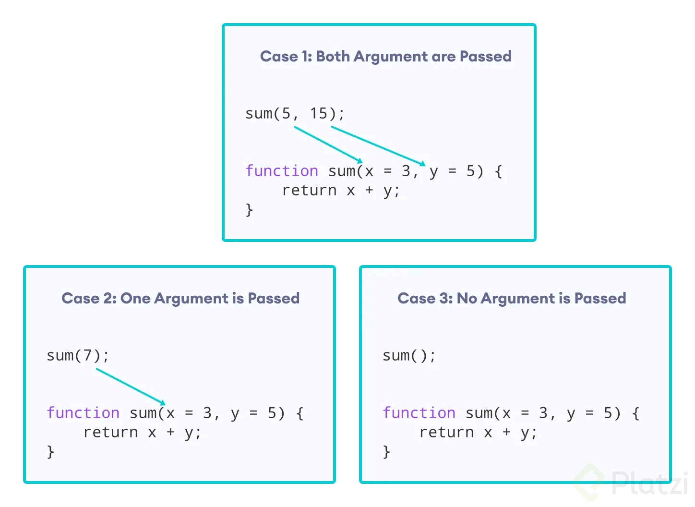

# Curso de ECMAScript: Historia y Versiones de JavaScript

<aside>
📌 Link del curso: [https://platzi.com/cursos/ecmascript-6/](https://platzi.com/cursos/ecmascript-6/)

</aside>

<aside>
📌 Repositorio con ejemplos: [https://github.com/DanielRagi/ecmascript-features](https://github.com/DanielRagi/ecmascript-features)

</aside>

# 📜 Descripción del Curso

JavaScript es el lenguaje más utilizado para desarrollo de aplicaciones web, principalmente en el frontend. Cada año, ECMA International publica una nueva edición de ECMAScript, la especificación a la cual se ajusta JavaScript. Aprende las nuevas características que implementa ECMAScript desde la versión ES6 hasta la versión ES13.

### Introducción

- Historia de JavaScript, ¿qué es ECMAScript?
    - ************1950:************ Nacimiento de las primeras computadoras y los primeros lenguajes de programación.
    - ********1969:******** Nacimiento de ARPANET y protocolos de comunicaciones, forma en la que dos computadoras se podían comunicar.
    - **********************1970-1990:********************** Exploración de ARPANET.
    - ************1990:************ Tim Berners-Lee dio inicio a lo que se conoce como internet, con el nacimiento de World Wide Web: forma de acceder a archivos o elementos a través de enlaces.
    - ************1993:************ Nace el primer navegador: Mosaic.
    - **********1994:********** Universitarios pioneros escribieron el software simple que inició la revolución de la información: navegadores. Marc Andreessen le dió vida a Netscape, empresa que desarrolló un navegador con el que se podía acceder a internet.
    - ************1995:************ Microsoft crea Internet Explorer para competirle a NetScape, lo que dió inicio a las Browser Wars. Empezaron a nacer tecnologías como CSS y JS, además de empresas como Mozilla (Mosaic + Godzilla). En este año apareció la tecnología ******Mocha,****** posteriormente Livescript, y finalmente JavaScript ************a manos de Netscape. Por su parte, Microsoft lanzó JScript para competir a Netscape. Aquí nació ECMAScript.
    
    ECMA (European Computer Manufacturer Association) nació como un consorcio europeo que permitiría generar un estándar para llevar interacciones en los navegadores web, gracias a la guerra de los navegadores (Browser Wars). Por lo tanto, ECMAScript es el estándar y la serie de reglas que tendran los lenguajes de programación que se basen en esta línea (JavaScript, JScript, ActionScript).
    
    El surgimiento de ECAMScript se dió en 1997, con el nombre de ECMA-262, primera versión oficial de este estándar, que luego tuvo la siguiente evolución:
    
    - ************1997:************ ES1
    - ************1998:************ ES2
    - ************1999:************ ES3
    - ************2000:************ ES4 (abandonado)
    - **************2005:************** ES5
    - ************2015:************ ES6 (base de la actualidad)
    - ************2016:************ ES7
    - ************2018:************ ES9
    - ************2019:************ ES10
    
- ¿Qué es el TC39?
    
    TC39 es un grupo de académicos, hackers, personas afines a la tecnología y la comunidad informática en general, que se encargan de que las versiones se ECMAScript se mantengan con actualizaciones constantes año tras año, respetando los estándares de acuerdo al impacto que pueden tener las inclusiones. Este grupo abierto a la comunidad es gestionado por ECMA.
    
    ESNEXT es el nombre que se le da a la próxima versión de ECMAScript, sea cual sea, que generalmente se lanza en junio de cada año. El proceso de inclusión de una característica pasa por el siguiente proceso:
    
    - ******************Stage 0:****************** Strawperson (Idea)
    - ************Stage 1:************ Proposal (Propuesta)
    - ******************Stage 2:****************** Draft (Borrador)
    - ******************Stage 3:****************** Candidate (Candidato)
    - ****Stage 4:**** Finished (Finalizado)

### Configuración

- Configurando nuestras herramientas
    
    Las herramientas para utilizar las características de cada versión de ECMAScript, son:
    
    - Git y GitHub
    - Node (en su versión LTS)
    - Terminal
    - Editor de código (VSCode u otros)
        - Extensión: Auto Close Tag
        - Extensión: Code Runner*
        - Extensión: Error Lens
        - Extensión: Guides
        - Extensión: Indent-Rainbow
        - Extensión: Live Server*
        - Extensión: JavaScript (ES6) code snippets*
            
            * necesarios en el curso.
            
    
    Inicialización de la carpeta del proyecto de prueba desde consola:
    
    - `git init`
    - `npm init`

### ES6 (ES2015)

- ES6: let y const, arrow functions
    
    En ECMAScript 6 (ES6 o ES2015), lanzada en junio de 2015, fueron publicadas varias características nuevas que dotaron de gran poder al lenguaje. Es la gran actualización que cambió JavaScript a la forma en la que está hoy en día. Es el gran cambió que convirtió a JavaScript en un superlenguaje y aceleró su desarrollo.
    
    Dos de las características son una nueva forma de declaración de variables con `let` y `const`, y funciones flechas.
    
    **Las formas de declaración de variables `let` y `const`** resuelven varios problemas con `var` como el scope, hoisting, variables globales, re-declaración (volver a declarar una variable) y re-asignación (volver a asignar un valor) de variables.
    
    - Una variable declarada con `var` puede ser re-declarada y re-asignada.
    - Una variable declarada con `let` puede ser re-asignada, pero no re-declarada.
    - Una variable declarada con `const` no puede ser re-declarada, ni re-asignada. Su declaración y asignación debe ser en una línea, caso contrario habrá un error.
    
    En el tema del scope, `let` y `const` tienen un scope de bloque y `var` no, lo tiene como global. En variables globales, `let` y `const` no guardan sus variables en el objeto global (window, global o globalThis), mientras que `var` sí los guarda. Esto es importante para evitar la re-declaración.
    
    **Las funciones flecha (arrow functions)** consisten en una función anónima con las siguientes estructuras:
    
    ```jsx
    const nombre = (parámetros) => {
        return valorRetornado
    }
    
    // Con un solo parámetro se puede omitir el ()
    const porDos = num => {
        return num * 2
    }
    ```
    
    Las funciones flecha tienen retorno implícito, por lo que se puede omitir el `return` para que la función pueda ser escrita en una sola línea:
    
    ```jsx
    const suma = (num1, num2) => num1 + num2
    
    // Usando retorno implícito con más líneas, usar ()
    const suma = (num1, num2) => (
        num1 + num2
    )
    ```
    
     
    
- ES6: strings
    
    Se crearon los **Template Literals** (plantillas literales) para los strings. Son cadenas de caracteres que pueden contener variables sin recurrir a la concatenación.
    
    Se emplean encerrando el texto en acento grave ```  y en su interior se utiliza `${variable}` para incluir las variables. Estas también detectan automáticamente los saltos de línea sin necesidad de elementos adicionales.
    
- ES6: default params
    
    Los ******************************Default Params****************************** (parámetros por defecto) consisten en establecer un valor por defecto a los parámetros de una función, para asegurar que el código se ejecute correctamente en el caso de que no se establezcan los argumentos correspondientes en la invocación de la función.
    
    Antes de ES6, si no se pasaban los valores como argumentos al llamar la función, generaría NaN como resultado al momento de utilizarlos. Una solución poco práctica era declarar nuevas variables dentro de la función (generalmente con el mismo nombre de los parámetros precedidos de `_`) y asignarles el valor del parámetro, seguido de `|| valorPorDefecto`.
    
    ```jsx
    function sumar(number1, number2){
      var _number1 = number1 || 0
      var _number2 = number2 || 0
      (...)
    }
    ```
    
    Ahora, con los parámetros por defecto, eliminamos esa declaración interna de nuevas variables, simplemente asignando un valor por defecto dentro de la misma declaración del parámetro (en caso de no querer asignar valores por defecto a algún parámetro, se debe poner antes de los que sí llevan parámetro por defecto):
    
    ```jsx
    function sumar(number1 = 0, number2 = 0){
      (...)
    }
    
    function sumar(number1, number2 = 0, number3 = 0){
      (...)
    }
    ```
    
    
    
- ES6: destructuring
    
    La desestructuración (destructuring) o asignación de desestructuración es una de las características más importantes de ES6, que nos permite obtener de mejor manera los elementos de objetos y arreglos.
    
    La **desestructuración de objetos** implica extraer las propiedades de un objeto para ser almacenadas en variables independientes. Antes de ES6, se debía acceder al objeto con la notación punto o corchetes en cada propiedad para asignarla a cada variable. A partir de ES6, podemos asignarlas de manera más fácil:
    
    ```jsx
    const usuario = { nombre: "Andres", edad: 23, plataforma: "Platzi" }
    
    // Variables con el mismo nombre de la propiedad
    const { nombre, edad, plataforma } = usuario
    
    // Variables con nombres diferente
    const { nombre: newNombre, edad: newEdad, plataforma: newPlataforma } = usuario
    
    console.log(nombre)  // 'Andres' 
    console.log(edad)  // 23
    console.log(plataforma)  // 'Platzi'
    
    console.log(newNombre)  // 'Andres' 
    console.log(newEdad)  // 23
    console.log(newPlataforma)  // 'Platzi'
    ```
    
    La **************************************************desestructuración en parámetros de una función************************************************** implica poder utilizar la desestructuración en los parámetros que sean objetos en la declaración de una función. El nombre debe ser igual a la propiedad del objeto.
    
    ```jsx
    const usuario = { nombre: "Andres", edad: 23, plataforma: "Platzi" }
    
    function mostrarDatos( { nombre, edad, plataforma } ){
        console.log(nombre, edad, plataforma) 
    }
    
    mostrarDatos(usuario) // 'Andres', 23, 'Platzi'
    ```
    
    La ********************************************************desestructuración de arrays******************************************************** consiste en extraer los valores de un array en variables, utilizando la misma posición del array al momento de la desestructuración.
    
    ```jsx
    const array = [ 1, 2, 3, 4, 5 ]
    
    // Desestructuración
    const [uno, dos, tres ] = array
    
    console.log(uno) // 1
    console.log(dos) // 2
    console.log(tres) // 3
    
    // Posible, pero mala práctica
    const [ ,,,,  cinco ] = array
    console.log(cinco) // 5
    
    // Usándolo como object
    const {4: cinco} = array
    console.log(cinco) // 5
    ```
    
    En la ********************************************************************desestructuración para valores retornados de una función******************************************************************** podemos almacenar en variables separadas los valores retornados en un array.
    
    ```jsx
    function useState(value){
        return [value, updateValue()]
    }
    
    //Sin desestructuración 
    const estado = useState(3)
    const valor = estado[0]
    const actualizador = estado[1]
    
    //Con desestructuración 
    const [valor, actualizador] = useState(3)
    ```
    
- ES6: spread operator y rest parameter
    
    El operador de propagación nos permite propagar la información desde elementos iterables (array o string) hacia otros elementos sin asignaciones individuales. Se usan tres puntos ( … ) para invocar la función.
    
    ```jsx
    // Para strings
    const array = [ ..."Hola"]    // [ 'H', 'o', 'l', 'a' ]
    
    // En arrays
    const otherArray = [ ...array]   //[ 'H', 'o', 'l', 'a' ]
    ```
    
    Para realizar una **copia de un array**, se debe tener en cuenta que también se copia la referencia en memoria de dicho array. Por lo que al cambiar algo en la copia, también se cambiará en el original. Para evitar esto se utiliza el operador de propagación, para que se copien los elementos, mas no la referencia en memoria.
    
    ```jsx
    // Copia sin spread operator
    const originalArray = [1,2,3,4,5]
    const copyArray = originalArray
    copyArray[0] = 0
    originalArray // [0,2,3,4,5]
    copyArray // [0,2,3,4,5]
    
    // Copia con spread operator
    const originalArray = [1,2,3,4,5]
    const copyArray = [...originalArray]
    copyArray[0] = 0
    originalArray // [1,2,3,4,5]
    copyArray // [0,2,3,4,5]
    ```
    
    Para ************************unir arrays y añadir elementos************************ utilizando el operador de propagación, se deben separar por comas en la creación de un aray:
    
    ```jsx
    const array1 = [1,2,3]
    const number = 4
    const array2 = [5,6,7]
    
    const otherArray = [ ...array1, number, ...array2 ]
    
    otherArray // [1,2,3,4,5,6,7]
    ```
    
    Las copias con el operador de propagación se realizan en **un solo nivel de profundidad**. Si existen sub-objetos o sub-arrays dentro del array a copiar, estos tendrán la misma referencia en memoria tanto en la copia como en el original. Solucionar esto es más complejo y se debería utilizar el operador de propagación para cada elemento en cada nivel de profundidad. Actualmente existe la función StructuredClone que realiza la copia completa de todos los niveles con diferentes referencias en memoria (función muy reciente sin compatibilidad en algunos navegadores).
    
    ```jsx
    const originalArray = [1, [2,3] ,4,5]
    const copyArray = structuredClone(originalArray)
    ```
    
    El ******************************parámetro rest****************************** consiste en agrupar el residuo de elementos mediante la sintaxis de tres puntos ( … ) seguido de una variable que contendrá los elementos en un array. Sirve para crear funciones que acepten cualquier número de argumentos para agruparlos en un array (siempre estando en la última posición de los parámetros). También sirve para obtener los elementos restantes de un array u objeto usando desestructuración.
    
    ```jsx
    // Función que acepta cualquier número de argumentos
    function hola(primero, segundo, ...resto) {
      console.log(primero, segundo)  // 1 2
      console.log(resto) // [3,4,5,6]
    }
    hola(1,2,3,4,5)
    
    // Elementos restantes de array u objeto desestructurado
    const objeto = { nombre: "Andres", age: 23, plataforma: "Platzi }
    const array = [0,1,2,3,4,5]
    
    const {plataforma, ...usuario} = objeto
    const [cero, ...positivos] = array
    plataforma // Platzi
    usuario // { nombre: 'Andres', age: 23 }
    cero // 0
    positivos // [ 1, 2, 3, 4, 5 ]
    ```
    
    La ********************************************************************************************************************************diferencia entre el parámetro rest y el operador de propagación******************************************************************************************************************************** está en que el parámetro rest agrupa el residuo de elementos, mientras que el operador de propagación expande los elementos de un iterable en un array.
    
    ```jsx
    const array = [1,2,3,4,5]
    function hola (primero, segundo, ...resto) { // <- Parámetro Rest
      console.log(primero, segundo)  // 1 2
      console.log(resto) // [3,4,5, "final"]
    }
    
    hola(...array, "final") //<- Operador de propagación
    //Lo mismo que hacer -> hola(1,2,3,4,5, "final")
    ```
    
- ES6: object literals
    
    Los ************************************objetos literales************************************ consisten en crear objetos a partir de variables sin repetir el nombre al crear la clave y el valor dentro del objeto. Antes de ES6, se debía hacer de la siguiente manera:
    
    ```jsx
    const nombre = "Andres"
    const edad = 23
    
    const objeto = {
        nombre: nombre, 
        edad: edad
    }
    ```
    
    Ahora, con los objetos literales, se puede obviar la repetición de nombres en la clave y el valor. En caso de que una variable tenga nombre diferente al que tendrá la clave o propiedad en el objeto, se puede asignar como se haría comunmente.
    
    ```jsx
    const nombre = "Andres"
    const edad = 23
    
    const objeto = {
    		nombre,
    		edad
    }
    
    objeto // { nombre: 'Andres', edad: 23 }
    ```
    
- ES6: promises
    
    Una **promesa** es una de las maneras de manejar el asincronismo en JavaScript y se representa como un objeto que puede generar un valor único a futuro. Las promesas tienen dos estados: resuelta o rechazada.
    
    El asincronismo se da en casos, por ejemplo, donde requerimos traer información desde lugares externos (como una base de datos vía web). En este caso, hay un pequeño delay entre la llegada de la información y la ejecución del código.
    
    Se utiliza mediante la clase `Promise` y sus métodos `.then()` y `.catch()`, resolviendo el problema de manejo de asincronismo denominado Callback Hell.
    
    La clase `Promise` tiene como parámetros:
    
    - `resolve`: cuando la promesa es resuelta.
    - `reject`: cuando la promesa es rechazada.
    
    ```jsx
    const promesa = () => {
      return new Promise((resolve, reject) => {
        if (something) {
          //true o false
          resolve("Se ha resuelto la promesa")
        } else {
          reject("Se ha rechazado la promesa")
        }
      })
    }
    
    promesa()
      .then(respuesta => console.log(respuesta)) //En caso que se ejecute resolve
      .catch(error => console.log(error)) //En caso que se ejecute reject
    ```
    
- ES6: clases
    
    Es una mejora sintática (a nivel de sintaxis) que facilitará el trabajo con la herencia. Comencemos por el aspecto **teórico**:ㅤ
    
    - **Clases:** Es una plantilla. Una definición genérica de algo que tiene atributos (datos/variables) y métodos (acciones/funciones) y desde la cual se pueden crear objetos.
    - **Objetos:** Un elemento real que fue creada con base en una clase (plantilla) y que hereda (contiene) sus atributos y métodos.ㅤ
    
    ¿Lo vemos con un ejemplo?:Tenemos una clase *Animal* que tiene como atributos: *especie*, *edad*, *patas* y tiene como métodos: *dormir*, *comer*, *caminar*. A partir de esa clase genérica podemos instanciar objetos de ese tipo, como los siguientes:ㅤ
    
    - **Objeto *perro*:** especie: canino, edad: 3, patas: 4. Puede dormir, comer y caminar.
    - **Objeto *paloma*:** especie: ave, edad: 1, patas: 2. Puede dormir, comer y caminar.
    - **Objeto *gato*:** especie: felino, edad: 2, patas: 4. Puede dormir, comer y caminar.ㅤ*Estos tres objetos fueron creados con base en la clase Animal (a esto se le llama instanciar un objeto a partir de una clase), y por ende, cada uno es un objeto de tipo Animal y cada uno tiene los atributos y métodos definidos en la clase.*
    
    Ahora, a nivel más **técnico**, utilizamos los siguientes conceptos:ㅤ
    
    - **Constructor:** Es un método que contiene una serie de instrucciones que se encargan de inicializar un objeto cuando es instanciado a partir de esa clase. Básicamente, asigna los valores de los atributos que le enviemos a ese objeto nuevo. Es una función que se ejecuta automáticamente.
    - **Getter y Setter:** Son funciones sencillas de entender: obtener el valor de un atributo o establecerlo. Se crean de esta manera por un concepto de la POO denominado *encapsulamiento*, que consiste, entre otras cosas, en limitar el acceso a las clases para tener mayor control sobre ellas.
    - **This:** Con este objeto de contexto hacemos referencia al propio objeto que se está instanciando y no a la clase.ㅤLlevemos entonces el ejemplo de los animales a JavaScript para poder aterrizar todos estos conceptos teóricos de las clases:
    
    ```jsx
    // Declaración de la clase Animal
    classAnimal {
    
    	// Constructor: le enviamos a la clase los valores para los atributos del nuevo objeto (como argumentos) y el constructor se encarga de asignarlos:
    	// (Recordar: this hace referencia al objeto).
    constructor(especie, edad, patas) {
    		this.especie = especie; // Asignar atributo especie al objeto
    		this.edad = edad; // Asignar atributo edad al objeto
    		this.patas = patas; // Asignar atributo patas al objeto
    	}
    
    	// Métodos de la clase: pueden contener cualquier lógica.
    dormir() {
    return 'Zzzz';
    	}
    
    comer() {
    return 'Yummy!';
    	}
    
    caminar() {
    return '¡Caminando!, la la la';
    	}
    
    	// Getter y Setter (solo para edad para no alargar)
    	// (Recordar: this hace referencia al objeto)
    getgetEdad() {
    return this.edad;
    	}
    
    setsetEdad(newEdad) {
    		this.edad= newEdad;
    	}
    }
    
    // Ahora instanciemos los objetos: tendremos perro, paloma y gato como objetos de tipo Animal. Al enviar el valor de los atributos como argumentos, el constructor automáticamente los asigna al nuevo objeto.
    const perro =new Animal('canino', 3, 4);
    const paloma =new Animal('ave', 1, 2);
    const gato =new Animal('felino', 2, 4);
    
    // Podemos acceder a los métodos desde cada objeto:
    perro.dormir();	// Retorna 'Zzzz'
    paloma.comer(); // Retorna 'Yummy!'
    gato.caminar(); // Retorna '¡Caminando!, la la la'
    
    // Usamos los getter para obtener los valores de los atributos y los setters para reasignarlos.
    perro.getEdad; // Retorna 3
    gato.setEdad = 3; // Cambia su atributo edad a 3
    
    ```
    
- ES6: module
    
    Para que el código de JavaScript sea más ordenado, legible y mantenible; ES6 introduce una forma de manejar código en archivos de manera modular. Esto involucra exportar funciones o variables de un archivo, e importarlas en otros archivos donde se necesite.
    
    Para usar los módulos de ES6, demos tener mínimo dos archivos: uno para exportar y otro para importar. Además, si se inició un proyecto con NPM de Node.js, se debe especificar que el código es modular en el archivo package.json, así:
    
    ```jsx
    // package.json
    {   ...
        "type": "module"
    }
    ```
    
    Esta configuración se puede omitir si a los módulos les colocamos la extensión .mjs en vez de .js.
    
    Las ****************************exportaciones de código**************************** consisten en crear funciones o variables para utilizarlas en otros archivos, mediante la palabra reservada ******export******. Se puede exportar tanto en la declaración de la función o luego de la declaración a través de llaves `{ }`.
    
    ```jsx
    // math_function.js
    
    // Desde declaración
    export const add = (x,y) => {
        return x + y
    }
    
    // Posterior a la declaración
    const add = (x,y) => {
        return x + y
    }
    export { add, otherFunction, ... }
    ```
    
    Las ************************************************importaciones de código************************************************ consisten en usar funciones o variables de otros archivos usando la palabra reservada ********import.******** Deberá estar siempre al inicio del archivo y se debe utilizar el mismo nombre de los elementos a importar que en el archivo original.
    
    ```jsx
    // main.js
    
    // Importar funciones
    import {add, otherFunction } from './math_function.js'
    
    add(2,2);
    ```
    
    También podemos importar todas las funcionalidades exportadas de un archivo utilizando un asterisco ( `*` ) y podemos cambiar el nombre del módulo para evitar la repetición de variables, usando la palabra reservada `as`.
    
    ```jsx
    // main.js
    import * as myMathModule from './math_functions.js';
    
    myMathModule.add(2,2) //4
    myMathModule.otherFunction()
    ```
    
    Las ****************************************************exportaciones por defecto**************************************************** solo sirven si solo un valor será exportado, usando las palabras reservadas ****************export default.**************** Así no tendremos que usar llaves al exportar o importar. Solo se puede exportar por defecto desde la declaración en las funciones. Para declaraciones con const, let o var se deben exportar solo al final.
    
    ```jsx
    //math_function.js
    export default function add (x,y){
        return x + y;
    }
    
    const add  = (x,y) => {
        return x + y;
    }
    
    export default add
    ```
    
    Las ******************************importaciones por defecto****************************** funcionan solo cuando un valor será importado y nos permitirá utilizar cualquier nombre en la importación sin necesidad de llaves.
    
    ```jsx
    //Las siguientes importaciones son válidas
    import  add  from './math_functions.js'
    import  suma  from './math_functions.js'
    import  cualquierNombre  from './math_functions.js'
    ```
    
    En una misma sentencia de exportación se pueden combinar importaciones y exportaciones nombradas y por defecto.
    
    ```jsx
    // module.js
    export const myExport = "hola"
    function myFunction() { ... }
    export default myFunction
    ```
    
    ```jsx
    // main.js
    import myFunction, { myExport } from "/module.js"
    ```
    
- ES6: generator
    
    Son funciones especiales que pueden pausar su ejecución, luego volver donde se quedaron recordando su scope y seguir retornando valores. Se utilizan para guardar la totalidad de datos infinitos a través de una función matemática a valores futros. Así, ocupan menos memoria con respecto a crear un array u objeto.
    
    Los generadores se crean con:
    
    - La palabra reservada `function*`
    - La palabra reservada `yield` (hace referencia al valor retornado una vez se invoque, recordando el valor anterior.
    - Crear una variable a partir de la función generadora.
    - El método `next` que devuelve un objeto con propiedad *value* con cada valor de `yield` y otra propiedad *done* con valor true o false dependiendo si el generador ha terminado o no.
    
    ```jsx
    function* generator(){
        yield 1
        yield 2
        yield 3
    }
    
    const generador = generator()
    
    generador.next().value //1
    generador.next().value //2
    generador.next().value //3
    generador.next() // {value: undefined, done: true}
    ```
    
    Tenemos además dos formas nuevas de utilizar ciclos repetitivos. 
    
    El bucle `**for valor of iterable**` recorre iterables como Array, Map, Set e incluso un Generator. El valor es cada elemento del iterable y puede tener cualquier nombre. Es importante tener en cuenta que en este ciclo solo se accede al valor y no a la referencia, por lo que no se pueden reasignar dentro del array sin utilizar un índice.
    
    ```jsx
    const array = [5, 4, 3, 2, 1]
    
    for (let numero of array) {
      console.log(numero) // 5 4 3 2 1
    }
    ```
    
    Por otra parte, el bucle `**for elemento in array**` sirve para recorrer elementos Object (que en for-of no es posible al no ser un elemento iterable). En este caso se accede a cada propiedad del objeto, que en el caso del array, son los índices.
    
    ```jsx
    const objeto = { a: 1, b: 2, c: 3 }
    
    for (let elemento in objeto) {
      console.log(elemento) // 'a' 'b' 'c'
    }
    
    const array = [5, 4, 3, 2, 1]
    
    for (let elemento in array) {
      console.log(elemento) // '0' '1' '2' '3' '4'
    	console.log(array[elemento]) // 5, 4, 3, 2, 1
    }
    ```
    
- ES6: set-add
    
    Se implementa `Set` como una nueva estructura de datos para almacenar elementos únicos. Es un parecido a un array, solo que no permite elementos repetidos.
    
    Para iniciar un Set, debemos crear una instancia de esa clase a partir de un iterable (generalmente un array). Luego, para manipularlos tenemos los métodos:
    
    - `add(value)`: Añade un valor.
    - `delete(value)`: Elimina un valor.
    - `has(value)`: Retorna un booleano si existe el valor.
    - `clear()`: Elimina todos los valores.
    - `size`: retorna la cantidad de elementos.
    
    ```jsx
    const list = new Set();
    
    list.add(1);
    list.add(2).add(3).add(4);
    list.delete(4);
    //list.clear();
    
    console.log(list.has(3));
    console.log(list.size);
    console.log(list);
    ```
    

### ES7 (ES2016)

- ES7: exponentiation operator y array includes
    
    El **********************************************************************************************************operador de potenciación (exponential operator)********************************************************************************************************** consiste en elevar una base a un exponente, utilizando el doble asterisco ( `**` ).
    
    ```jsx
    // 2^3 = 8
    const potencia = 2**3; // 8
    ```
    
    El ****************método includes**************** determina su un array o string incluye un determinado elemento y devuelve true o false. Este método recibe dos argumentos:
    
    - El elemento a comparar.
    - (Opcional) El índice inicial desde dónde comparar hasta el último elemento.
        - Los índices positivos van desde 0 hasta lenght-1.
        - Los índices negativos van desde -lenght hasta -1 (para indicar el elemento de inicio contando de derecha a izquierda).
    
    ```jsx
    //Utilizando strings
    const saludo = "Hola mundo"
    
    saludo.includes("Hola") // true
    saludo.includes("Mundo") // false
    saludo.includes(" ") // true
    saludo.includes("Hola", 1) // false
    saludo.includes("mundo", -5) // true
    
    // Utilizando arrays
    const frutas = ["manzana", "pera", "piña", "uva"]
    
    frutas.includes("manzana") // true
    frutas.includes("Pera") // false
    frutas.includes("sandía") // false
    frutas.includes("manzana", 1) // false
    frutas.includes("piña", -1) // false
    frutas[0].includes("man") // true
    ```
    

### ES8 (ES2017)

- ES8: object entries y object values
    
    Los métodos de **********************************************************************transformación de objetos a arrays********************************************************************** sirven para obtener la información de las propiedades, sus valores o ambas cosas.
    
    `Object.entries()` devuelve un array con elementos en forma [propiedad, valor] del objeto enviado. **Obtiene los pares de propiedad y valor de un objeto**, transformándolos en un array.
    
    ```jsx
    const usuario = {
        name: "Andres",
        email: "andres@correo.com",
        age: 23
    }
    
    Object.entries(usuario) 
    /* 
    [
      [ 'name', 'Andres' ],
      [ 'email', 'andres@correo.com' ],
      [ 'age', 23 ]
    ]  
    */
    ```
    
    `Object.keys()` devuelve un array con las **propiedades (claves) del objeto enviado**, en forma de array.
    
    ```jsx
    const usuario = {
        name: "Andres",
        email: "andres@correo.com",
        age: 23
    }
    
    Object.keys(usuario) 
    // [ 'name', 'email', 'age' ]
    ```
    
    `Object.values()` devuelve un array con los **valores de cada propiedad del objeto enviado**.
    
    ```jsx
    const usuario = {
        name: 'Andres',
        email: "andres@correo.com",
        age: 23
    }
    
    Object.values(usuario) 
    // [ 'Andres', 'andres@correo.com', 23 ]
    ```
    
- ES8: string padding y trailing commas
    
    El ******************************string padding****************************** consiste en rellenar un string por el principio o por el final, con un caracter especificado, repetido hasta que se complete la longitud máxima. Los métodos reciben dos argumentos:
    
    - Longitud máxima a rellenar, incluyendo el string inicial.
    - El string a rellenar. Por defecto, un espacio.
    
    **************************************El método padStart************************************** completa un string con otro string en el inicio, hasta tener un total de caracteres especificado.
    
    ```jsx
    'abc'.padStart(10) // "       abc"
    'abc'.padStart(10, "foo") // "foofoofabc"
    'abc'.padStart(6,"123465") // "123abc"
    'abc'.padStart(8, "0") // "00000abc"
    'abc'.padStart(1) // "abc"
    ```
    
    El método **************padEnd************** completa un string con otro string en el final hasta tener el total de caracteres especificado.
    
    ```jsx
    'abc'.padEnd(10) // "abc       "
    'abc'.padEnd(10, "foo") // "abcfoofoof"
    'abc'.padEnd(6, "123456") // "abc123"
    'abc'.padEnd(1) // "abc"
    ```
    
    Los ********************************trailing commas******************************** consisten en dejar comas al final de objetos o arrays que faciliten añadir nuevos elementos y evitar errores de sintaxis. Podemos añadir cuantas comas sean necesarias y serán leidas como “empty items”, reservados en el array.
    
    ```jsx
    const usuario = {
        name: 'Andres',
        email: "andres@correo.com",
        age: 23, //<-- Trailing comma
    }
    
    const nombres = [
        "Andres",
        "Valeria",
        "Jhesly",//<-- Trailing comma
    		, //<-- Trailing comma
    		, //<-- Trailing comma
     ]
    ```
    
- ES8: funciones asíncronas
    
    En ES2017 se añadió una nueva forma de manejar el asincronismo en JavaScript mediante funciones asíncronas, como alternativa al método `.then()`. Se usan mediante las palabras reservadas:
    
    - **************`async`:** Crea una función asíncrona y retorna una promise.
    - **************`await`:** Funciona solamente dentro de una función asíncrona y espera hasta que una promesa sea resuelta. Se puede manejar a través de los bloques try / catch para validar si se resuelve o no.
    
    ```jsx
    async function asyncFunction () {
    	try {
    		const response = await promesa();
    		return response;
    	} catch (error) {
    		return error;
    	}
    }
    ```
    

### ES9 (ES2018)

- ES9: regular expressions y spread operator
    
    Las **expresiones regulares o RegEx (regular expresions)** son patrones de búsqueda y manipulación de cadenas de caracteres increiblemente potentes y están presentes en todos los lenguajes de programación. En JavaScript se crea un patrón de expresión regular entre barras inclinadas ( `/ patron /`) y se utilizan métodos para hacer coincidir la búsqueda.
    
    ```jsx
    const regexData = /([0-9]{4})-([0-9]{2})-([0-9]{2})/
    const match = regexData.exec('2018-04-20')
    ```
    
    Se añadió una mejora al ********************************spread operator******************************** incluido en ES6 para que ahora sea capaz de expandir las propiedades de un objeto. Sirve para crear nuevos objetos a partir de otros.
    
    ```jsx
    const objeto = {
      nombre: "Andres",
      age: 23,
    }
    
    const usuario = {
        ...objeto,
        plataforma: "Platzi"
    }
    ```
    
    Para ****************************************************************************************************************************crear copias de objetos utilizando las propiedades de propagación**************************************************************************************************************************** se tiene un manejo semejante al manejo de las copias utilizando el spread operator. Se pueden realizar copias de objetos en un solo nivel utilizando la propiedad de propagación. Esto nos permite crear copias de objetos sin que la referencia en memoria sea la misma al objeto original.
    
    ```jsx
    const objetoOriginal = {a: 1, b: 2}
    const objetoReferencia = objetoOriginal  // Copia con misma referencia en memoria
    const objetoCopia = {...objetoOriginal}  // Copia con diferente referencia en memoria
    ```
    
    El spread operator sirve solamente para copias en un solo nivel de profundidad. Si existen objetos o arrays dentro del objeto a copiar, tendrán la misma referencia en la copia y en el original.
    
    ```jsx
    const original = { datos: [1, [2, 3], 4, 5] }
    const copia = { ...original }
    
    original === copia // false -> Diferente referencia en memoria
    original["datos"] === copia["datos"] // true -> Misma referencia en memoria
    ```
    
    Para solucionar esto se puede usar la función structuredClone(object) que hace una copia completa y con diferente referencia en memoria de un objeto.
    
- ES9: Promise.finally y generadores asíncronos
    
    El método **************`finally`** de las promesas sirve para ejecutar código después de que una promesa haya sido ejecutada, ya sea como resuelta o rechazada.
    
    ```jsx
    promesa()
    	.then(response => console.log(response))       // resuelta
    	.catch(error => console.log(response)          // no resuelta
    	.finally( () => console.log("Finalizado") );   // al final
    ```
    
    Los generators creados en ES6 ahora pueden ser combinados con las estructuras de funciones asíncronas (promesas).
    
    ```jsx
    async function* anotherGenerator() {
      yield await Promise.resolve(1)
      yield await Promise.resolve(2)
      yield await Promise.resolve(3)
    }
    
    const generador = anotherGenerator()
    generador.next().then(respuesta => console.log(respuesta.value))
    generador.next().then(respuesta => console.log(respuesta.value))
    generador.next().then(respuesta => console.log(respuesta.value))
    ```
    
    Así mismo, se incluye el ciclo `for await` como un ciclo repetitivo que se maneja asincrónicamente (no bloquea el resto de ejecución del código). Estos ciclos siempre deben estar dentro de una función con `async`.
    
    ```jsx
    async function forAwait() {
      const nombres = ["Alexa", "Oscar", "David"]
      for await (let valor of nombres) {
        console.log(valor)
      }
    }
    
    forAwait()
    ```
    

### ES10 (ES2019)

- ES10: flat-map y trimStart-trimEnd
    
    El ******flat-map o aplanamiento de arrays****** consiste en transformar un array de arrays a una sola dimensión. Los métodos son `flat` y `flatMap`.
    
    El método `flat` devuelve un array donde los sub-arrays originales han sido propagados hasta una profundidad especificada. Este método es inmutable, puesto que retorna un nuevo array sin modificar el array original. El argumento que recibe es la profundidad del aplanamiento (por defecto 1). Este argumento puede ser *********Infinity********* si se desean aplanar todos los sub-arrays en una sola dimensión, independientemente de en cuál dimensión se encuentren.
    
    ```jsx
    const array = [1,2,[3,4],5,6]
    const result = array.flat() 
    // [1,2,3,4,5,6]
    
    const array2 = [1, 2, [3, 4, [5, 6]]];
    const result2 = array2.flat() 
    // [1, 2, 3, 4, [5, 6]]
    const result3 = array2.flat(2) 
    // [1, 2, 3, 4, 5, 6]
    
    const array4 = [1, 2, [3, 4, [5, 6, [7, 8, [9, 10]]]]]
    const result4 = array4.flat(Infinity) 
    result4// [1, 2, 3, 4, 5, 6, 7, 8, 9, 10]
    
    ```
    
    El método `flatMap` es una combinación de map y flat. Primero realiza la iteración de los elementos del array (como si fuera map) y luego los aplana en una sola profundidad (como si fuera flat). Este método también es inmutable puesto que retorna un nuevo array y no modifica el array original. Recibe los mismos argumentos que map.
    
    ```jsx
    const strings = ["Nunca pares", "de Aprender"]
    strings.map(string => string.split(" ")) 
    // [ [ 'Nunca', 'pares' ], [ 'de', 'Aprender' ] ]
    strings.flatMap(string => string.split(" ")) 
    // [ 'Nunca', 'pares', 'de', 'Aprender' ]
    
    const numbers = [1, 2, 3, 4]
    numbers.map(number => [number * 2]) 
    // [[2], [4], [6], [8]]
    numbers.flatMap(number => [number *2]) 
    // [2, 4, 6, 8]
    
    // Cuidado, primero hace el map y luego el flat
    const numbers2 = [1,[2,3], 4, 5]
    numbers2.flatMap(number => [number *2]) 
    // [ 2, NaN, 8, 10 ]
    // * Recuerda: NaN = No a Number
    ```
    
    Por otra parte, tenemos tres métodos para eliminar los espacios en blanco al inicio y al final de un string.
    
    - El método `trim` elimina los espacios en blanco al inicio y al final.
    - El método `trimStart` o trimLeft elimina los espacios al inicio.
    - El método `trimEnd` o trimRight elimina los espacios al final.
    
    ```jsx
    const saludo = "      hola      "
    const result1 = saludo.trim()
    const result2 = saludo.trimStart()
    const result3 = saludo.trimEnd()
    
    result1 // 'hola'
    result2 // 'hola      '
    result3 // '      hola'
    ```
    
- ES10: try catch y fromEntries
    
    Desde ES10, en la estructura ********************try-catch******************** podemos omitir el error en la sesión de catch si es necesario. Aunque ahora es posible, no es recomendable.
    
    ```jsx
    try {
      // Manejar el código
    } catch (err) {
      // Se utiliza el parámetro `err`
    }
    
    try {
      // Manejar el código
    } catch {
      // Manejar el error sin el parámetro.
    }
    ```
    
    El método `Object.fromEntries` devuelve un objeto a partir de un array donde sus elementos son las entries en forma *[propiedad, valor]*. Es la operación inversa a Object.entries de ES8.
    
    ```jsx
    const arrayEntries = [
      [ 'name', 'Andres' ],
      [ 'email', 'andres@correo.com' ],
      [ 'age', 23 ]
    ] 
    
    const usuario = Object.fromEntries(arrayEntries)
    /* {
      name: 'Andres',
      email: 'andres@correo.com',
      age: 23
    }
    */
    ```
    

### ES11 (ES2020)

- ES11: optional chaining
    
    Cuando se intenta acceder a propiedades inexistentes de un objeto, JavaScript retorna undefined. Si intentamos entrar a una propiedad más profunda (es decir, tratada como sub-objeto) de una propiedad de un objeto que previamente fue evaluada como undefined, el programa mostrará un error y se detendrá, pusto que undefined es un primitivo y no un objeto.
    
    ```jsx
    const usuario = {}
    console.log(usuario.redes) // undefined
    
    const usuario = {}
    console.log(usuario.redes.facebook) 
    // TypeError: Cannot read properties of undefined (reading 'facebook')
    ```
    
    El **************************************************************************************encadenamiento opcional u optional chaining************************************************************************************** se utiliza con ( `?.` ) y detiene la evaluación del objeto cuando el valor es undefined o null, retornando undefined pero sin detener el programa causando un error. Se debe utilizar únicamente cuando probablemente un valor no exista, puesto que un error real puede ser ocultado por un undefined.
    
    ```jsx
    const usuario = {}
    console.log(usuario.redes?.facebook) 
    // undefined
    ```
    
- ES11: BigInt y Nullish
    
    Se incluye un nuevo tipo de dato primivito denominado `bigInt` que permite manejar números enteros muy grandes. Se pueden crear con el número entero seguido de **n** o usando la función `BigInt(numero)`.
    
    ```jsx
    const number1 = 45n
    const number2 = BigInt(45)
    
    typeof 45n // 'bigint'
    ```
    
    Se crean para manejar cálculos de enteros por fuera de los límites numéricos de JavaScript.
    
    ```jsx
    const max = Number.MAX_SAFE_INTEGER
    const min = Number.MIN_SAFE_INTEGER
    
    console.log(max)  // 9007199254740991
    console.log(min) // -9007199254740991
    ```
    
    El operador **************************************************nullish coalescing ( `??` )** consiste en evaluar si una variable es undefined o null para asignarle un valor.
    
    ```jsx
    const usuario1 = {}
    const nombre1 = usuario1.name ?? "Andres"
    // usuario.name es undefined o null ? Asignar "andres" : asignar usuario.name
    
    const usuario2 = {name: "Juan"}
    const nombre2 = usuario2.name ?? "Andres"
    // usuario2.name es undefined o null? Asignar "andres" : asignar usuario2.name
    
    console.log(nombre1) // 'Andres' 
    console.log(nombre2) // 'Juan'
    ```
    
    Este método se diferencia del operador or puesto que el OR ( || ) evalúa un valor falsy (aquel que es falso en un contexto booleano). Si se recibe una variable con un valor booleano falsy (como 0 o un string vacío), el OR lo cambiará provocando un resultado erróneo, mientras que el nullish coalescing lo tomará como un valor diferente a null o undefined.
    
- ES11: Promise.all y promise.allSettled
    
    En algunos casos necesitaremos manejar varias promesas y obtener sus resultados. Esto lo logramos usando los métodos `Promise.all` y `Promise.allSettled`.
    
    El **método `Promise.all`** sirve para manejar varias promesas al mismo tiempo. Recibe como argumento un array de promesas. Esta promesa se resuelve si y solo si todas las promesas fueron resueltas. Si una es rechazada, la promesa entera es rechazada.
    
    ```jsx
    Promise.all([promesa1, promesa2, promesa3])
        .then(respuesta => console.log(respuesta))
        .catch(error => console.log(error))
    ```
    
    El **método `Promise.allSettled()`** permite manejar varias promesas y devolverá un array de objetos con el estado y valor de cada promesa, haya sido resuelta o rechazada.
    
    ```jsx
    const promesa1 = Promise.reject("Ups promesa 1 falló")
    const promesa2 = Promise.resolve("Promesa 2 resuelta")
    const promesa3 = Promise.reject("Ups promesa 3 falló")
    
    Promise.allSettled([promesa1, promesa2, promesa3])
        .then(respuesta => console.log(respuesta))
    
    /* [
      {
        status: 'rejected',
        reason: 'Ups promesa 1 falló'
      },
      { status: 'fulfilled', value: 'Promesa 2' },
      {
        status: 'rejected',
        reason: 'Ups promesa 3 falló'
      }
    ] */
    ```
    
- ES11: globalThis y matchAll
    
    El motor de JavaScript crea un objeto global al iniciar la compilación. Este objeto proporciona funciones y variables propias e integradas en el lenguaje o el entorno. Dependiendo de la plataforma, este objeto tendrá un diferente nombre, por ejemplo, para un navegador el objeto global es *******window******* y para Node.js es ******global******. Por lo tanto, en un navegador no se puede acceder a *******global******* y en Node.js no se puede acceder a ******window******.
    
    Para estandarizar este objeto global se creó `globalThis`, un objeto compatible con cualquier plataforma. 
    
    ```jsx
    // Ejecuta el siguiente código y observa que muestra
    console.log(window)
    console.log(globalThis)
    
    // En el navegador
    window === globalThis // true
    
    // En Node.js
    global === globalThis // true
    ```
    
    En las expresiones regulares se incluyó el **método `matchAll**` para los strings, que devuelve un iterable con todas las coincidencias del string específico a partir de una expresión regular, colocada como argumento ( `string.matchAll(regex)` ).
    
    ```jsx
    const regex = /\b(Apple)+\b/g
    
    const fruit = "Apple, Banana, Kiwi, Apple, Orange, etc. etc. etc."
    
    // Tranformación del iterable retornado a array
    const array = [...fruit.matchAll(regex)]
    console.log(array)
    /*
    [
      [
        'Apple',
        'Apple',
        index: 0,
        input: 'Apple, Banana, Kiwi, Apple, Orange, etc. etc. etc.',
        groups: undefined
      ],
      [
        'Apple',
        'Apple',
        index: 21,
        input: 'Apple, Banana, Kiwi, Apple, Orange, etc. etc. etc.',
        groups: undefined
      ]
    ]
    */
    ```
    
- ES11: dynamic import
    
    Para el manejo modular de JavaScript, tenemos la expresión `import()` que permite manejar módulos dinámicamente, ya que la sintaxis `import … from` no lo permite.
    
    La ******************************************importación dinámica****************************************** consiste en cargar los módulos cuando el usuario los vaya a utilizar y no al iniciar la aplicación. Esto con el fin de ganar optimización en la web porque se descargan menos recursos. La expresión `import()` recibe un argumento tipo string con la ruta del módulo a importar y devuelve una promesa.
    
    ```jsx
    const ruta = "./modulo.js"
    
    // Utilizando promesas
    import(ruta)
        .then( modulo => {
            modulo.funcion1()
            modulo.funcion2()
        })
        .catch(error => console.log(error))
        
    // Utilizando async/await
    async function importarModulo(rutaDelModulo) {
        const modulo = await import(rutaDelModulo)
        modulo.funcion1()
        modulo.funcion2()
    }
    
    importarModulo(ruta)
    
    // Ejemplo: Importar un módulo si se da click a un botón.
    const boton = document.getElementById("boton")
    
    boton.addEventListener("click", async function () {
        const modulo = await import('./modulo.js')
        modulo.funcion()
    })
    ```
    

### ES12 (ES2021)

- ES12: numeric-separators y replaceAll
    
    Los **separadores numéricos** ayudan a la legibilidad de cantidades con varias cifras. Se utiliza el guión bajo ( `_` ) para separar las cifras y no afectará la ejecución del programa. Lo ideal es separar cada 3 cifras para visualizar por miles, millones, billones, etc.
    
    ```jsx
    // 🔽 Baja legibilidad
    const numero1 = 3501548945
    console.log( numero1 ) // 3501548945
    
    // ✅ Alta legibilidad
    const numero2 = 3_501_548_945
    console.log( numero1 ) // 3501548945
    ```
    
    El **método `replaceAll`** retorna un nuevo string, reemplazando todos los elementos por otro. Recibe como argumentos el patrón a reemplazar (string o RegEx) y el nuevo elemento que sustituye al reemplazado. Se crea como mejora al método `replace` que solo realizaba un reemplazo por vez.
    
    ```jsx
    const mensaje = "JavaScript es maravilloso, con JavaScript puedo crear el futuro de la web."
    
    mensaje.replace("JavaScript", "Python")
    // 'Python es maravilloso, con JavaScript puedo crear el futuro de la web.'
    
    mensaje.replaceAll("JavaScript", "Python")
    // 'Python es maravilloso, con Python puedo crear el futuro de la web.'
    
    mensaje.replaceAll(/a/g, "*")
    // 'J*v*Script es m*r*villoso, con J*v*Script puedo cre*r el futuro de l* web.'
    ```
    
- ES12: promise-any y métodos privados
    
    Los **********************************métodos privados********************************** consisten en limitar el acceso a atributos y métodos (que por defecto son públicos) agregando el caracter numeral ( `#` ). Así, solo se podrán acceder desde adentro de la clase, para mejorar el encapsulamiento.
    
    ```jsx
    class Clase {
      #private(valor){
        console.log(valor)
      }
      
      public(valor){
        console.log(valor)
      }
    }
    
    const clase = new Clase()
    clase.public("Hola")  // 'Hola'
    clase.private("Hola") // TypeError: clase.private is not a function
    ```
    
    El método Promise.any() es otra forma de manejar varias promesas. Retornará la primera promesa que se resuelva y rebotará si todas las promesas son rechazadas.
    
    ```jsx
    const promesa1 = Promise.reject("Ups promesa 1 falló")
    const promesa2 = Promise.reject("Ups promesa 2 falló")
    const promesa3 = Promise.resolve("Promesa 3")
    
    Promise.any([promesa1, promesa2, promesa3])
        .then(respuesta => console.log(respuesta)) // Promise 3
        .catch(error => console.log(error))
    ```
    

### ES13 (ES2022)

- ES13: at
    
    El **método `at`** de arrays sirve para acceder a los elementos a partir del índice. Ya sean positivos (como se usan comunmente) o negativos (contando desde el último hasta el primero), con el método `array.at(indice)`.
    
    La utilidad del método con respecto a utilizar corchetes es la posibilidad de acceder a índices negativos, lo que en corchetes se debería manejar realizando restas a partir del tamaño del array.
    
    ```jsx
    const nombres = ["Andres", "Valeria", "Ana", "Ramiro", "Richard"]
    
    nombres.at(-1) // "Richard"
    nombres[-1] // undefined
    nombres.at(-3) // "Ana"
    nombres[nombres.length -1] // "Richard"
    ```
    
- ES13: top level await en consumos API
    
    El **top level await** permite utilizar la palabra reservada `await` sin estar dentro de una función asíncrona (definida con `async`). Se puede usar por fuera, solo en la parte superior del archivo de un módulo. Esto servirá para importaciones dinámicas o iniciar la conexión a bases de datos siempre y cuando se respete que esté en la parte superior del archivo.
    
    ```jsx
    await fetch(URL)
    // Antes: SyntaxError: await is only valid in async function
    // Ahora: permitido
    ```
    

### Recapitulación

<aside>
💡 Especificación ECMA-262 donde están todas las funcionalidades que existen y existirán: [https://www.ecma-international.org/publications-and-standards/standards/ecma-262/](https://www.ecma-international.org/publications-and-standards/standards/ecma-262/)

</aside>

<aside>
💡 Repositorio TC32 con los stages de cada propuesta de JavaScript (aprobadas y en proceso): [https://github.com/tc39/ecma262#ecmascript](https://github.com/tc39/ecma262#ecmascript)

</aside>