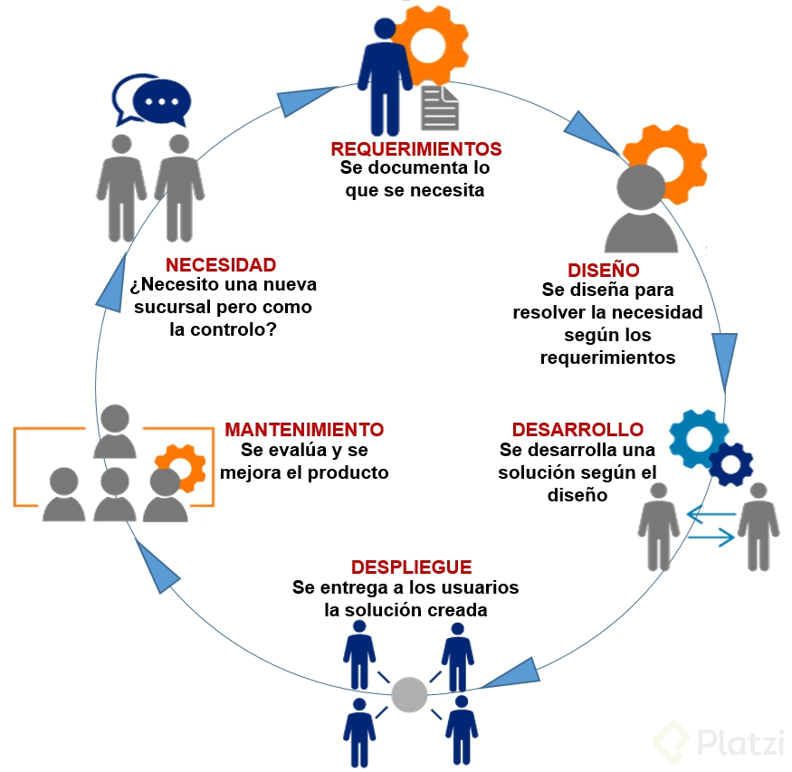

# Fundamentos de Arquitectura de Software

1.- En la arquitectura del software se habla de:

• Estructuras.
• Modelos con diagramas.
• Se suelen hablar de la comunicación entre diferentes sistemas o incluso entre diferentes módulos del sistema.

2.- En este curso va atravesar todo el camino para atender que es el proceso de desarrollo y como la arquitectura está involucrada en cada uno de los pasos del proceso de desarrollo del software.

3.- Entenderemos cuál es el rol del arquitecto y como el arquitecto puede ayudar al éxito o fracaso de un sistema.

4.- Este curso va hacer evidente decisiones que a veces son implícitas y nos va ayudar a ser consiente de cuando estamos tomando una decisión arquitectónica en un sistema y cómo hacer para tomar la mejor decisión posible en ese momento.

## Etapas del proceso de desarrollo de software

El proceso de desarrollo tradicional tiene etapas muy marcadas, que tienen entradas, procesos y salidas que funcionan como entradas de la siguiente etapa.

    Análisis de requerimientos
    Diseño de la solución
    Desarrollo y Evaluación
    Despliegue
    Mantenimiento y Evolución

Análisis de requerimientos: Todo nace de un disparador que nos crea la necesidad de crear un artefacto o un sistema. Necesitamos entender cuál es el problema que queremos resolver. Hay requerimientos de negocio, requerimientos funcionales, requerimientos no funcionales.

Diseño de la solución: Análisis profundo de los problemas para trabajar en conjunto y plantear posibles soluciones. El resultado de esto debe ser el detalle de la solución, a través de requerimientos, modelado, etc.

Desarrollo y evolución: Implementación de la solución, para garantizar que lo que se esta construyendo es lo que se espera. Al finalizar esta etapa tendremos un artefacto de software.

Despliegue: Aquí vamos a necesitar de infraestructura y de roles de operación para poder poner el artefacto a disponibilidad.

Mantenimiento y evolución: Desarrollo + despliegue + mantenimiento, en esta etapa estamos atentos a posible mejoras que se hacen al sistema. En esta etapa el software se mantiene hasta que el software ya deja de ser necesario.

## Dificultades en el desarrollo de software
En la etapa de diseño y desarrollo estamos concentrados en encontrar cuáles son los problemas que queremos resolver. Estos problemas los podemos dividir en dos grandes tipos de problemas.

Esenciales: Los podemos dividir en 4.

    La complejidad, cuándo lo que tenemos que resolver es complejo en si mismo, por ejemplo calcular la mejor ruta entre ciudades.
    La conformidad.
    Tolerancia al cambio.
    Invisibilidad.

**Accidentales:** Está relacionado con la plataforma que vamos a implementar, tecnología, lenguajes, frameworks, integraciones, etc.

Existen dos tipos de problemas: Los problemas esenciales y los problemas accidentales.

Esenciales: Se dividen en 4 tipos de problemas
• Complejidad: cuando un dominio de un problema es complejo en sí mismo. En el caso de adiciones y todas las acciones que conlleven al sistema a ser más complejo.
Manejo del problema de complejidad: No desarrollar: Comprar - OSS
• Conformidad: en qué contexto se usa el software y cómo debe adecuarse al mismo. Se incluyen todo lo que le compete. Ej: Ambiente, conectividad, impuestos, etc.
Manejo del problema: Prototipado rápido, feedback y ciclos rápidos para soluciones pequeñas.
• Tolerancia al Cambio: Posibilidad del cambio en el mismo y que sea responsivo a diferentes contextos.
Manejo del problema: Desarrollo Evolutivo, desarrollos pequeños. Paso a paso pero de manera firme e ir haciendo crecer el software.
• Invisibilidad: Problemas de tangibilidad nula.
Manejo del problema: Grandes diseñadores, Arquitectos que saben abtraer el problema y que realiza soluciones elegantes, de manera simple, con la mejor calidad posible en los componentes que lo necesitan.

Accidentales: Está relacionado con la plataforma que vamos a implementar, tecnología, lenguajes, frameworks, integraciones, entre otros, que tienen 3 Entornos:
• Lenguajes de alto nivel
• Multi-procesamiento
• Entornos de programación

“Concidero a la especificación, diseño y comprobación del **concepto** la parte difícil de hacer software. (…) Si esto es cierto, hacer software siempre será difícil. No existe la bala de plata.” - Del libro **No Silver Bullet** (Frederick P. Brooks Jr., 1986)

## Roles en metodologías tradicionales y ágiles

Principios del Manifiesto Ágil

    Nuestra mayor prioridad es satisfacer al cliente
    mediante la entrega temprana y continua de software
    con valor.

    Aceptamos que los requisitos cambien, incluso en etapas
    tardías del desarrollo. Los procesos Ágiles aprovechan
    el cambio para proporcionar ventaja competitiva al
    cliente.

    Entregamos software funcional frecuentemente, entre dos
    semanas y dos meses, con preferencia al periodo de
    tiempo más corto posible.

    Los responsables de negocio y los desarrolladores
    trabajamos juntos de forma cotidiana durante todo
    el proyecto.

    Los proyectos se desarrollan en torno a individuos
    motivados. Hay que darles el entorno y el apoyo que
    necesitan, y confiarles la ejecución del trabajo.

    El método más eficiente y efectivo de comunicar
    información al equipo de desarrollo y entre sus
    miembros es la conversación cara a cara.

    El software funcionando es la medida principal de
    progreso.

    Los procesos Ágiles promueven el desarrollo
    sostenible. Los promotores, desarrolladores y usuarios
    debemos ser capaces de mantener un ritmo constante
    de forma indefinida.

    La atención continua a la excelencia técnica y al
    buen diseño mejora la Agilidad.

    La simplicidad, o el arte de maximizar la cantidad de
    trabajo no realizado, es esencial.

    Las mejores arquitecturas, requisitos y diseños
    emergen de equipos auto-organizados.

    A intervalos regulares el equipo reflexiona sobre
    cómo ser más efectivo para a continuación ajustar y
    perfeccionar su comportamiento en consecuencia.

Es importante que diferenciemos el ROL del puesto de trabajo, hay roles que pueden ser desarrollados por la misma persona.

Experto del dominio: En una metodología tradicional, es la persona a la que acudimos para entender las necesidades del negocio. En metodologías Ágiles --> stakeholders.

Analista: funcional/de negocio, la persona responsable de definir los requerimientos que van a llevar al software a u buen puerto. En el caso de Ágiles el dueño del producto es quien arma las historias y que nos acompaña en el proceso de construcción del software.

Administrador de sistemas / DevOps: Es el rol de operaciones y desarrollo, son las personas responsables de la infraestructura que alojara nuestra aplicación.

Equipo de desarrollo: QA / Testing se encargan de la evaluación de nuestro software, comprobar que lo que se está haciendo es lo que se espera que se haga. Desarrolladores involucrados en la construcción del software. Arquitecto, diseña la solución y análisis de los requerimientos, es un papel más estratégico. La arquitectura emerja del trabajo de un equipo bien gestionado.

Gestor del proyecto / facilitador: Llevan al equipo a través del proceso iterativo e incremental, entender lo que pasa con el equipo y motivar el avance en el desarrollo del producto

_______________

Las Metodologías Ágiles Redifinieron los Roles para acomodarlos a su filosofia de Trabajo (Tradicional vs Metodologías Ágiles).

Experto de Dominio: (tradicional) Era la persona que acudiamos para resolver las necesidades de los REQUERIMIENTOS{Que se requiere para este Software}

Experto de Dominio: (Metodologías Ágiles) Hace un analisis de los stakeholders (Que resolver de su Producto?)

Analista (Tradicional): Es la Persona que indaga en Que es lo que hay q resolver, define un problema…

Analista (Metodologías Ágiles): Es la persona que define los requerimientos es El Cliente, el va ir definiendo como sera el software a medida Cual es su Problematica.

Administrador de sistemas (Tradicional): Se encargaban de toda la operacion del sistma(Si había servidores, actualizar librerias, Encontrar Errores en los logs y dar el Feedback al equipo de desarrollo)

Administrador de sistemas (Metodologías Ágiles) Fue reemplazado por el DevOps (Operaciones y Desarrollo unidos) Es la persona Responsable de Entender la Infraestructura a la que va nuestra app y Entender los Requerimientos de ese lado del mundo

Administrador de sistemas (Metodologías Ágiles) Fue reemplazado por el SRE (Ing de la Confianza del Sitio) es similar al Administrador de Sistemas pero Conectando el mundo de sistemas con el mundo del dia-dia de la app

QA - Equipo de Texting (Tradicional): Evaluación de Software

QA - Equipo de Texting (Metodologías Ágiles): Fueron Unidos en un Solo Equipo de Desarrollo (QA-Tester, Desarrollador, Aquitecto) Se Encarga de Tomar las decisiones arquitectonicas (La arquitectura Emergera de un Equipo Autogestionado)

Gestor del Proyecto (Tradicional): Se ecargaba de todo lo que era la entrega, Cumplir con toda la gestion del ciclo de Vida del Proyecto

Gestor del Proyecto (Metodologías Ágiles): Se conoce como Facilitador (SCRUM Master) lleva al equipo atraves de el ciclo de (Entender que es lo nos Para)

-------------

<u>Roles según</u>

| Desarrollo Tradicional | Metodologías Ágiles | 
|:-------------------:|---|
| Experto de dominio |  Partes interesadas (stakeholders)| 
| Analista | Cliente / Dueño del Producto |
| Administrador de Sistemas | DevOps / SRE | 
|QA - Tester / Desarrollador / Arquitecto |  Equipo de Desarrollo |
| Gestor del Proyecto |Facilitador|
