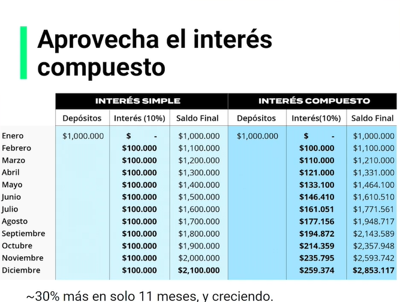

## 1. Conoce al profesor y sus errores más comunes invirtiendo

La clase aborda los errores mas comunes que se realizan al ingresar en este mundo, no en forma de asustar, sino de normalizar errores que pueden suceder:

**Errores comunes**

- Falta de contexto
- No querer pasarse a la práctica hasta “dominar” la teoría → te domina el miedo
- Complicar mucho el análisis
- Demorar mucho tiempo en demo
- Volverse obsesivo con el mercado
- Vergüenza a preguntar
- Creer a ciegas en una corriente o educador
- Expectativas irreales

## 2. ¿Para quién es este curso?

**Más errores**

- No pedir ayuda para cosas importantes
- No saber cuáles eran las cosas importantes
- Pensar que uno es experto antes de tiempo
- Confiar de más
- No cortar las pérdidas rápidamente
- No dejar correr las ganancias
- No creer en mí → *Bruto, pero decidido*
- No seguir un plan de inversión
- Ir en contra del maestro solo por ego
- Invertir por corazonada
- Llegar borracho o despechado a invertir → dejar emociones afuera
- Pensar que esto no es para mí

## 3. ¿Qué es y por qué es importante invertir en la Bolsa de Valores?

### "No es justo trabajar 40 horas **A LA SEMANA**, por 40 años de tu vida, para retirarte con el 40% de lo que ganabas.”

Parece amenaza, but it’s true. So, hope we can change that.

5 razones por las cuales invertir hoy:

    1. **Seguridad:** Tu dinero está custodiado y vigilado por entidades especializadas.
    2. **Flexibilidad:** Se adapta a tus objetivos y necesidades.
    3. **Rentabilidad:** El techo de tus ganancias es indeterminado.
    4. **Liquidez:** Puedes convertir tu inversión en dinero en efectivo muy rápido.
    5. **Transparencia:** Por ley, la información debe ser pública y confiable.

## 4. Glosario de términos bursátiles - Parte 1

- **Acción:** Título o valor emitido por una empresa que te da participación en su negocio.
- **Alcista (bullish) :** Mercado que va hacia arriba, es decir, que conforme pasa el tiempo, el valor de la acción tiende a aumentar.
- **Apalancamiento:** Realizar operaciones a través de una plataforma que te presta dinero para invertir si no dispones de suficientes fondos.
- **Bajista (bearish):** Mercado que va hacia abajo, indicando que el precio de la acción tiende a disminuir con el tiempo.
- **Bolsa de valores:** Mercado donde se ejecuta la compra y venta de títulos.
- **Bono:** Instrumento financiero emitido por una empresa para obtener dinero, ofreciendo pagar intereses a cambio. Puede ser corporativo o soberano.
- **Bursátil:** Todo lo relacionado con la bolsa de valores.
- **Calce:** Cuando el valor de compra de una acción coincide con su valor de venta.
- **Commodity:** Mercado de materias primas, por ejemplo, oro.
- **Criptomonedas:** Activos digitales que no forman parte del mercado bursátil tradicional.
- **Depósito:** Dinero que se deposita en la plataforma donde se va a invertir.
- **Derivado:** Producto cuyo valor depende de otro activo.
- **Diversificar:** Invertir en diferentes tipos de acciones para reducir riesgos.
- **Dividendo:** Ganancia generada por la inversión en una empresa cotizada en bolsa, distribuida periódicamente.

## 5. Glosario de términos bursátiles - Parte 2

- **ETF:** Un fonde de inversión que cotiza en bolsa y replica un activo, que puede ser un índice, sector, materia prima u otro activo en particular, y se pueden comprar o vender en una bolsa de valores como si fuera una acción regular.
- **Fecha Ex-dividendo:** Si eres dueño de acciones durante la fecha ex-dividendo, tienes derecho a dividendos de esa determinada acción.
- **Forex**: De las siglas Foreign Exchange, es el mercado internacional de divisas.
- **Forwards**: Contrato entre dos partes, mediante el cual ambos se comprometen a intercambiar un activo determinado a futuro, en un precio que se determina por anticipado.
- **Futuros**: En un forward que se negocia en la bolsa de valores.
- **Índice accionario**: Es una canasta que reúne diferentes acciones según una tesis determina.
- **Liquidez**: Capacidad de convertir una inversión en dinero en efectivo, o que tiene alto flujo de negociación.
- **Materia prima**: Aquellos recursos naturales a partir de los cuales obtenemos los materiales que empleamos en la actividad técnica o económica.
- **Mercado**: Es el sitio (físico o virtual) donde se unen compradores y vendedores de títulos calores para hacer un intercambio.
- **Mercado abierto**: Hay activos cuyo mercado tiene unas horas de negociación específicas, y por lo tanto, sólo se pueden comprar/vender durante esas horas.
- **Mercado cerrado**: Indica que la hora de negociación del activo acabó, y hay que esperar hasta que vuelva a abrir para volver a comprar o vender los activos.
- **Orden**: Es una solicitud de compra o venta de un activo cualquiera. Puede ser a precio límite o a precio de mercado.
- **Oferta Pública Inicial (OPI o en inglés IPO)**: Es el mecanismo que tiene una empresa para emitir sus acciones y colocarlas pro primera vez en el mercado.
- **Portafolio**: Es el grupo de inversiones que hayas hecho, o alguna persona/empresa específica.
- **Trader**: Es un inversionista profesional, que invierte en plazo más cortos, y busca especular activamente en el mercado.
- **Retiro**: Es un movimiento de efectivo hacia tu cuenta bancaria, que disminuye el dinero disponible en tu cuenta de inversión.
- **Sector**: Hace referencia a la industria de la economía a la cual pertenece un activo.
- **Spread**: Es el diferencial entre 2 precios, comúnmente, entre el precio de compra y de venta de un activo.
- **Título Valor**: Docuemento emitido por personas naturales o jurídicas, que tiene valor implícito, ouede ser negociado por su propietario.
- **Utilidad**: Es la ganacia financiera que resulta después de un ejercicio de inversión.
- **Volatilidad**: Es una medida de riesgo. Mide la fluctuación del precio de un activo.

## 6. Conozcamos una Bolsa de Valores desde adentro

Se nos da un video recorriendo la bolsa de valores de Colombia, hablándonos acerca de su historia y el como funcionaba antes. Los cambios tecnologicos cambiaron mucho el proceso, pero a su vez lo hizo mas cercano para todas las personas.

## 7. ¿Qué es el perfil de riesgo, y cómo saber el tuyo?

> “RIESGO SIEMPRE VA A IR AMARRADO A RENTABILIDAD”

Tipos de riesgo:

- Riesgo de mercado 1
    - Por el comportamiento del mercado se puede generar pérdidas parciales o totales.
- Riesgo de mercado 2
    - Por el comportamiento de las tasas de cambio se pueden generar perdidas parciales o totales.
- Riesgo de crédito
    - El riesgo de que no te paguen lo que te deben. Un bono, por ejemplo.
- Riesgo de liquidez 1
    - El riesgo de no encontrar contra-parte en el momento de hacer una operación.
- Riesgo de liquidez 2
    - El riesgo no poder convertir al dinero en efectivo.

### **Que es el perfil de riesgo?**

- Tolerancia
    - Comodidad para afrontar cambios constantes en el valor de su portafolio.
- Capacidad
    - Que tan apto es para tomar asumir decisiones de inversión volátiles.
- Objetivo
    - Cual es el horizonte temporal y marco de referencia a lograr o superar

### **Cuál es tu perfil de riesgo?**

- Conservador
    - No soportas ver mucho movimiento, prefieres algo tranquilo, asi sea menos rentable.
- Neutral o moderado
    - Estas cómodo con cierto nivel de riesgo, quieres algo mas de rentabilidad, aceptando mayor volatilidad.
- Agresivo
    - Comprendes bien los riesgos de invertir y estas dispuesto a aceptar niveles mas altos para lograr mayor rentabilidad

## 8. Tipos de mercados bursátiles

Funciones del mercado Bursátil

- Ahorrar dinero para el futuro
- Tomar prestado dinero para el uso corriente.
- Levantar capital.
- Manejar el riesgo.
- Intercambiar activos de entrega inmediata y futura.
- Intercambiar información

Índices Accionarios (canasta de varias acciones)

- Dow Jones (30 empresas industriales de mayor liquidez)
- S&P 500 (500 empresas mas importantes que cotizan en la bolsa de EEUU)
- NASDAQ 100 (100 empresas mas importantes que cotizan en bolsa de TECNOLOGÍA)
- EUROSTOXX 50 (Es de todo Europa)
- DAX 30 (solo Alemania)
- CAC 40 (Paris)
- IBEX 35(solo España)
- NIKKEI 225 ( mercado Japones)
- HANG SENG (Hong Kong)

Y asi dependiendo del país y la bolsa que construya el indice vas a encontrar todo tipo de opciones para poder elegir la que mejor se nos adapte a nuestras preferencias.

- Mercado de materias primas (Commodities)
    - Agricolas
    - Energéticos
    - Metales
    
- Bonos (renta fija)
    - Soberanos (emitido por gobiernos)
    - Corporativos (empresas)

Forex y Cryptos (No componen el campo bursatil, porque no pasan por una bolsa de valores)

- Forex:
    - Major
    - Minors
    - Sintéticas
    - Exóticas
- Crypto (revisar curso de Cryptomonedas)
    - Alt-Coins
    - Stable-coins
    
- Exchanged Traded Funds (ETFs) Fondos administrados por una empresa con tasa de inversion determinada (de inversión bursátiles que replican el comportamiento de otros activos), como por ejemplo: 
    - indices accionarios de bonos
    - indices accionarios de Criptomonedas

- Mercado Global en Bolsas Latinoamericanas (sin sacar el dinero del país y sin papeleo adicional, sin complicaciones)
    - Ahora puede comprar acciones y ETFs internacionales, en tu moneda local, en la bolsa de valores de tu país.

## 9. ¿Qué debes saber antes de empezar a invertir?

- Valorización del activo
    - Compré en precio X
    - Vendí en X+Y
    - Ganancia Y.
    - Compro en $100, vendo en $120, gane $20 (+20%)
    - En Latam NO hay cortos

- Dividendos Las compañías, cuando tienen utilidad, **pueden** decidir distribuirlas entre sus accionistas.
    - Total o parcialmente.
    - Cambian todos los años
    - Tienen diferentes periodicidades
    - Se pueden pagar en efectivo o acciones.
    - Hay algunas con tasas de interés **muy** interesantes. (mercado latinoamericano suele tener buenos dividendos frente a empresas de mercados mas establecidos)
    - pago de cupones son muy similares a los dividendos

## 10. Tipos de Órdenes

**Tipos de Ordenes:**

- De compra (largos)
    - A mercado: Se ejecuta en el mejor precio disponible (quiero comprar al precio que esta en este momento el mercado)
    - Limite:tú defines el precio de ejecución, por debajo del precio actual (solo se ejecuta la compra si llega al límite X que yo programe, por ej si baja al tope de compra que establece se ejecuta esta programación)
    - Stop: Se ejecuta cuando pase por un precio superior que tú defines.

- De venta (cortos)
    - A mercado: Se ejecuta en el mejor precio disponible.
    - Limite: Tú defines el precio de ejecución, por encima del precio actual.
    - Stop: Se ejecuta cuando pase por un precio inferior que tú defines.
    - EN LOS MERCADOS DE LATAM NO EXISTEN LOS CORTOS.
    - Se vende alto se compra bajo. (esa diferencia es la ganancia) .
    
- De Salida Para cerrar una posición actual, se ejecuta la orden contraria a mercado o...
    - Stop Loss: Defines el precio máximo hasta donde estás dispuesto a asumir pérdidas.
    - Take Profit: Defines el precio objetivo en donde quieres tomar utilidades. . . **El dinero nunca duerme** . Apertura de mercados tomando base a la hora del este (UTC-5) 1° mercado que abre es el de Sydney 5pm-2am 2° mercad Tokyo 7pm-4am 3° mercado de Londres 3am-12pm 4° mercado de New York 8am-5pm

- 4 tipos de inversiones
    - Tipo 1: Buena relación Riesgo-Beneficio y alta probabilidad de éxito.
    - Tipo 2: Buena relación Riesgo-Beneficio y baja probabilidad de éxito.
    - Tipo 3: Baja relación Riesgo-Beneficio y **muy alta** probabilidad de éxito.
    - Tipo 4 (***PROHIBIDA***): Baja relación Riesgo-Beneficio y baja probabilidad de éxito.

## 11. Diferencias entre Trader e Inversionista

### **INVERSIONISTA**

- Invierte a largo plazo. (10,20,30 años... y con interés compuesto aún mejor)
- Busca activos con valor (poca especulación, y mejorar investigación a que le estamos invirtiendo para entender como funciona a futuro ese activo).
- Normalmente usan nulo o muy bajo apalancamiento (por no saber como usarlo perdi 6x el valor invertido...si... es peligroso)
- Tienen una gestión más pasiva del portafolio.
- Se estresan menos.

### **TRADER**

- (tienen mucha mas experiencia de inversión)
    - Invierte a corto plazo.
    - Buscar activos con oportunidades.
    - Normalmente usan apalancamiento.
    - Tienen una gestión mas activa del portafolio.
    - Se estresan mas.

## 12. 5 principios básicos para aprender a invertir

Creo que mi objetivo principal es obviamente el crear mayores ingresos, siento que por ahora a corto plazo, en forma de trader por asi decirlo. Pero lo quiero hacer asi para en un futuro tener las bases para realmente invertir a largos plazos, para que asi el beneficio sea mayor. Y ahi es donde si quiero que me rinda de mejor manera, para poder darme una buena vida en un futuro lejano.

### 5 principios básicos para aprender a invertir

1. Define tu objetivo de inversión ¿Por qué voy a invertir? ¿A cuánto tiempo? ¿Qué herramientas o instrumentos usaré? etc.
2. La seguridad de tus fondos es lo más importante (verificar por quien esta respaldado el fondo en el cual deseas invertir)
3. ¿Qué riesgo estás dispuesto a tomar?
4. ¿Cuánta rentabilidad esperas recibir?
5. No se te olvide fijarte en la liquidez al momento de invertir ¿Qué probabilidad hay de necesitar ese dinero que invertiré al corto plazo? En caso de emergencias es importante conocer que tan rápido puedo transformar esas inversiones en efectivo.

## 13. ¿Cuáles son las opciones comunes de inversión?

- 1 Depósito a término fijo.
    - objetivo de inversion: (flexible a corto plazo: entre 60 a 540 dias)
    - seguridad: muy alta
    - riesgo: muy baja (conocemos todo antes de ingresar)
    - rentabilidad: baja (ej 4% cuando la inflasion fue 6% por ejemplo en este caso)
    - Liquidez: baja... toca estar pendiente los plazos que establecemos en el objetivo.
    - ejemplo de retorno: 1.000 mensual se necesitan 300.000 inicial.

- 2 Bienes raíces de vivienda.
    - objetivo de inversion: Flexible
    - Seguridad: Alta
    - Riesgo: bajo
    - Rentabilidad: Baja - media (6% EA,, depende cada pais y otros gastos)
    - Liquidez: Baja Media... depende mucho de si es para arriendo o queremos vender como este el mercado en ese momento.
    - ejemplo de retorno: 1.000 mensual se necesitan 200.000 inicial.

- 3 Locales comerciales o FIDIs
    - Objetivo de inversion: flexible.
    - seguridad: alta
    - riesgo: bajo medio
    - rentabilidad: media 9%EA
    - liquidez: baja media.
    - ejemplo de retorno: 1.000 mensual se necesitan 133,333 inicial.

- 4 Portafolio en Acciones.
    - objetivo de inversion: Flexible.
    - seguridad:...depende... (ojo con plataformas y broker que se utliizan, revisar clase afines )_
    - riesgo: medio alto.
    - rentabilidad: media alta (12% EA)
    - liquidez: alta.
    - ejemplo de retorno: 1.000 mensual se necesitan 100,000 inicial.

- 5 Divisas, derivados y Cryptos
    - objetivos de inversion flexible.
    - seguridad: depende... (siempre mucho cuidad que plataforma se usa)
    - riesgo: alto
    - rentabilidad: alta (18%EA)
    - liquidez: alta
    - ejemplo de retorno: 1.000 mensual se necesitan 66,667 inicial. . 
    
    
***La parte difícil es la disciplina, la paciencia y el juicio***

## 14. Tipos de análisis del mercado - Parte 1

- **Análisis técnico**
    - Gráficos de precios
    - Indicadores técnicos
    - Estudio estadístico
    - PatronesCurso de análisis tecnico: [Curso de Análisis Técnico de Mercados Financieros](https://platzi.com/cursos/analisis-tecnico/)
    
- **Analisis fundamental**
    - Análisis de la economía.
    - Estudio del sector.
    - Análisis de los resultados empresariales.
    - Perspectivas.Curso de análisis fundamental: [Curso para Invertir en Bolsa: Análisis Fundamental](https://platzi.com/cursos/inversion-bolsa/)
    
- **Trading Sendimental**
    - Análisis de las opiniones de la gente.
    - Guiarse en las inversiones de otras personas.
    - Anticipación de acuerdo al ambiente. Recomendación: tener redes sociales activas para estar al tanto de los cambios del mercado y seguir a grandes expertos en inversiones.

## 15. Tipos de análisis del mercado - Parte 2

Análisis de correlación:

- Mide estadísticamente la relación entre 2 o mas activos.
- También se puede identificar gráficamente
- Se buscan pérdidas de correlación para oportunidades de inversión.
    - Alta correlación, se mantienen parejo con la estadística
    - activos sin correlación evidente, no son buenos referentes para estos casos de análisis
    - Alta correlación inversa
    - que se busca con estos 3 casos? La perdida de correlación es una buena forma de anticipar el otro activo.
- Estacionalidad y ciclos de mercado.
    - Varios activos presentan un comportamiento determinado según el mes del año. Por ejemplo para la época de navidad hay varios activos que suben por la mayor demanda en compras de los mismos.
    - En la economía y en los activos es normal tener periodos de aceleración, tranquilidad y recesión.
    - Ciclos de mercado son unificación de estacionalidad, entonces se repite en ciertas fechas o periodos, y de esta forma podemos aprovechar la llegada de un nuevo ciclo con anticipación.

- Capitalismo consciente:
    - Empresa con propósito.
    - Una cultura de excelencia e innovación.
    - Con gran atención por sus actores de interés (stakeholders).
    - Liderada por un equipo directivo apropiado: siendo transparente, teniendo buenas practicas, y hacer las cosas siempre de manera correcta.
        
- Teniendo en cuenta el ultimo punto de capitalismo consciente se hizo un estudio por 20 años entre empresas con esta cultura y las S&P500 y marcaron una diferencia abismal de 16x quedando en evidencia que es muy importante evaluar estas caracteristicas a la hora de decidir por que compañía invertir.

## 16. ¿Cómo invertir como un experto sin ser un experto?

- Aterriza tus expectativas
- Invertir siempre a largo plazo.
- el millonario de la noche a la mañana no existe
- entender los niveles de rentabilidad que se pueden esperar.
- perder el miedo, cada experiencia es ganancia. . Psicología adecuada.
- Define una estrategia.
- enfocate en lo que puedes controlar
- ten disciplina.
- deja las emociones afuera.
- KISS - mantenlo simple!!! Keep it Stupid Simple. (si encuentras una metodologia que se adapte a tu requerimiento de tiempo y objetivo de inversion es perfecto...
- MENTALIDAD GANADORA! (Si entras al mercado pensando que vas a perder, es como buscar esa perdida... )

IMAGINANDONOS EL FUTURO Las inversiones son apuestas a futuro. Como nos imaginamos el futuro y a que le estamos apostnado?

- Real estate
- Energia.
- Energia renovable.
- Inteligencia Artificial
- Vehiculos Autonomos
- Fintech (como Trii)
- Genetica
- Comida saludable.
- Defi.
- y muchas mas!.

Diversifica

- Por empresa.
- Por sector
- por Region geografica
- por tipo de activo
- por nivel de riesgo
- por objetivo temporal.

Aprovechas el interés compuesto Reinvertir las ganancias, esto genera una bola de nieve gigante.

## 17. Tips de inversionistas expertos

**El éxito deja huella.**

Atajos como encontrar a un mentor o un experto, trata de emularlo, aprender de sus errores y traer su experiencia tu crecimiento. . Pecados capitales!

1. Miedo. Las perdidas están dentro del menú del día, y son normales.
2. Avaricia. No Saber donde tomar utilidades es casi tan malo como no saber asumir pérdidas, pégate a tu estrategia.
3. Pereza. Subestimar al mercado, o no hacer un análisis con el máximo profesionalismo posible. LEER NOTICIAS, SER CONCENTRADO EN LO QUE INVESTIGAS.
4. Ira, No te tomes nada personal, y empieza cada análisis desde cero, no trates de tomar revancha al mercado.
5. No te confíes nunca del mercado (ojo con la pereza!), ni dejes que una inversión ganadora nuble tu análisis para la proxima. SE UN APRENDIZ TODO EL TIEMPO, SE HUMILDE.
6. Envidia, no dejes que los resultados de los demás afecten tu análisis. . . No hay que inventar la rueda, y uno de los atajos al éxito (que sí sirven), es tener un mentor. Y escucharlo!

- **WARREN BUFFETT**
    - Nunca inviertas en un negocio que no puedas entender.
    - Sé temeroso cuando otros son codiciosos, y viceversa.
    - El optimismo es el enemigo del comprador racional.
    - desarrolle la capacidad de decir "NO"
    - Para buscar oportunidades de compra, espera el ciclo bajista. (es como entrar a un Outlet)
    - Un inversionista necesita hacer muy pocas cosas bien, si evita grandes errores.
    - No intentes predecir el mercado, la economía o las elecciones.
    - Invierte siempre a largo plazo.
    - Si no puedes ver cayendo un 50% tu inversión sin pánico , no inviertas en la bolsa.
    - Piensa "Fuera de la Caja"

- **Tony Robbins** "El éxito tiene sus claves. La gente no triunfa porque tiene suerte; hacen las cosas de otra manera" .

- **Carlo Icahn** "Cuando compras una empresa, lo que realmente compras son sus activos. Ves esos activos y te preguntas: Por qué no rinden como deberían rendir? El 90% de las veces es culpa de la gestión." .

- **David Swensen** Le encanta la diversificación y tiene un modelo llamado ***Endowment Model:*** Divide tu portafolio en 5 o 6 partes más o menos iguales:
- Acciones US.
- Bonos del tesoro.
- TIPS
- Acciones de países extranjeros desarrollados.
- Acciones de mercados emergentes.
- REITs **70% acciones 30% renta fija ** .

- **John C. Bogle** "Ten mucho cuidado dónde colocas tus activos. Inviértelos según tu tolerancia al riesgo y tus objetivos. Y diversifica." .

- **Paul Tudor Jones** Es un amante de riesgo alto. "Diversificar es fundamental; defenderse también y, repito, seguir jugando todo el tiempo que puedas. Nunca inviertas en contra corriente. Usa el principio del 5x1"

- **Ray Dalio** "Si hacemos mejores preguntas, obtendremos mejores respuestas" .

- **Mary Callahan Erodes** "El remedio es ver las cosas con perspectiva y concentrarnos en aquello que podemos controlar, hacer todo lo que podamos todos los días poniendo todo nuestro empeño" .

- **T. Boone Pickens** "Creo firmemente que una de las razones por las que he venido al mundo es para triunfar, hacer dinero y ser generoso con él" .

- **Kyle Bass** "Lo que nos define como personas es la manera que tenemos de asumir nuestros fracasos" .

- **Charles Schwab** "Ahorra, estudia los que debes y te sirva para tener acceso al mercado, consigue un trabajo bien pagado, haz un plan de pensión. e invierte." .

- **Sir John Tempreton** "Cuando todo el mundo piensa que es el fin del mundo, es un buen momento para invertir."

## 18. Mitos y verdades del mercado

**Manuel fernando Ovalle cerquera**

**MITOS Y VERDADES DEL MERCADO**

1. *Es difícil* : Creer que es solo para expertos matemáticos
2. *Es para millonarios* : Pensamos que sólo los millonarios pueden invertir.
3. *Requiere mucho tiempo* : Depende si quieres ser Trader o inversionista, pero es algo que podemos combinar con nuestro trabajo (no te va a demorar 2 horas a la semana)
4. *Volverse millonario de la noche a la mañana*: El exito microondas no existe!
5. *Es doloroso* : Depende de tu perfil inversionista, Warren Buffet dice: si no puedes ver perdiendo tu inversión en un 50% mejor no inviertas en la bolsa.
6. *Hay que diversificar mucho* : No hay que caer en la sobrediversificación. Debemos entender perfectamente en qué estamos invirtiendo. De 5 a 10 opciones distintas estás más que perfecto.
7. _ Es arriesgado_ : Esto es cierto si lo tomas a la ligera o no tienes disciplina de entender en qué se está invirtiendo. Tu actitud influye mucho.
8. *Es costoso* : La tecnologia a permitido romper con esta caracteristica de la bolsa tradicional.
9. *Es seguro* : Toda inversión tiene un riesgo.

## 19. Brokers y Plataformas de inversión para novatos

### Participantes del Mercado

- Bolsa de Valores
- Depósito Central de Valores
- Regulador o Supervisor de la Operación
- Comisionistas (Corredores o Sociedades agentes) de bolsa
- Servicios de Información
- Proveedores de Tecnología
- Inversionistas (Individuales e institucionales)

### Tips para elegir la Plataforma

- Que sea legal y esté regulada por una entidad robusta y seria
- Que se acomode a ti (Tecnologí, montos, facilidad, etc)
- Que tenga activos en los que quieres invertir
- Que tenga costos eficientes
- Que sea transparente
- Que te permita tener beneficios tributarios

## 20. ¿Cuáles son las plataformas de inversión más usadas?

Plataformas de inversión más utilizadas

- TD Ameritrade (montos de ingresos elevados $10.000 dólares)
- Interactive brokers (IB) (montos de ingresos elevados, la plataforma no es tan intuitiva)
- E-toro (no está tan regulado, no compras las acciones sino una especie de titulo que dice que compraste un contrato pero la E-toro es quien tiene finalmente la acción)
- Flink (mx), Hapi (col y peru) o Rational (chile): tener acceso al mercado de los EEUU y puedes invertir en dólares
- Fintual (chile) o tyba (col): No te permiten escoger en que activo quieres invertir
- Trii (Colombia y peru): Invertir en las bolsas locales No se recomienda usar las plataformas de opciones binarias

## 21. Armemos tu plan de inversión juntos

EL plan debe contener: 

1. Objetivo de la inversión.
2. Características de tu operación.
3. Metodología.
4. Parámetros de riesgo.
5. Metas.

Objetivo de inversion 

- ¿Qué quieres lograr? Un viaje, pagar la universidad, pensión, etc.
- ¿A cuánto tiempo vas a invertir?
- ¿Qué vehículo vas a usar?
- ¿Cuál es el peor escenario que estarías
dispuesto a tolerar?

Características de tu operación

- Monto Inicial y plan de aumento de capital.
- Tamaño promedio de la operación.
- Tiempo estimado objetivo.
- Relación Riesgo-Beneficio.

Metodología

- Activos que vas a operar.
- Días y horarios de inversión.
- ¿Cuánto tiempo le vas a dedicar al análisis?
- ¿Qué herramientas vas a usar?
- ¿Qué estrategia(s)?

Parámetros de Riesgo

- Riesgo máximo durante el tiempo de
operación (%).
- Riesgo mensual (%).
- Riesgo semanal (%).
- Riesgo Diario (%).
- Riesgo por posición (%).
- ¿Hay excepciones?

Metas

- Meta final durante el tiempo de operación (%).
- Meta mensual (%).
- Meta semanal (%).
- Meta Diaria (%).
- Meta por posición (%).
- ¿Hay excepciones?

**"Nunca discuta con su plan de inversión" - Michael Covel**

## 22. Libros recomendados

📚Libros 📚

1. Los secretos de la mente millonaria. T. Harv Eker
2. La psicología del dinero, Morgan Housel
3. Dinero: Domina el Juego. Anthony Robbins
4. El inversor inteligente. Benjamin Graham
5. Buffetología. Mary Buffett
6. Stock Trader´s Alamanac. Jeffrey Hirsch