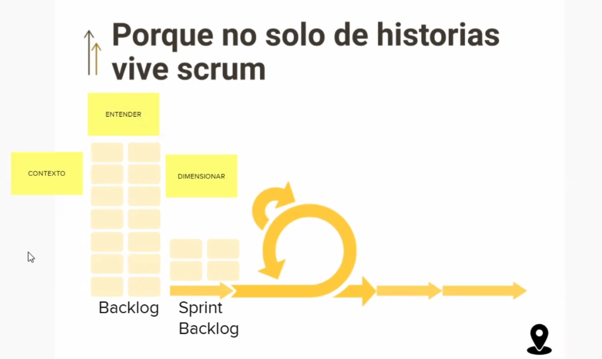
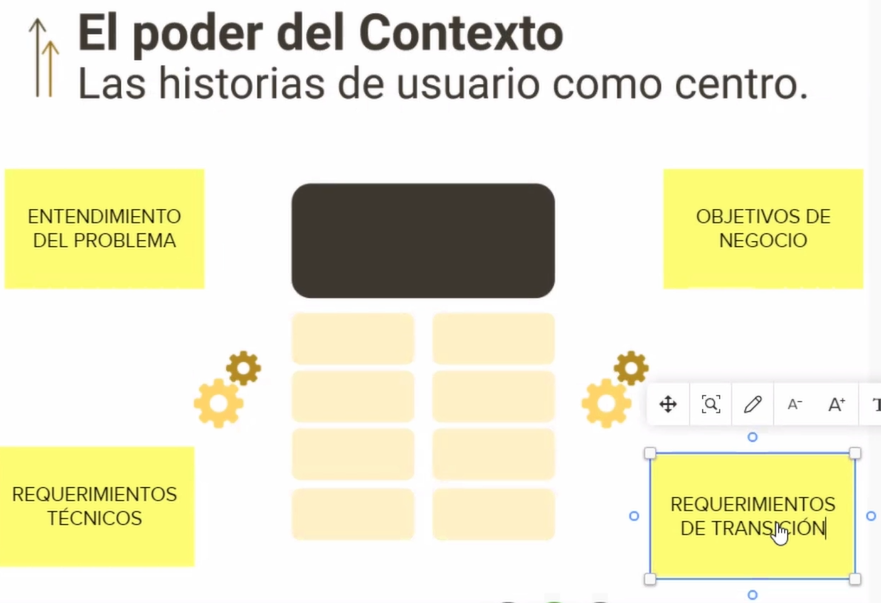
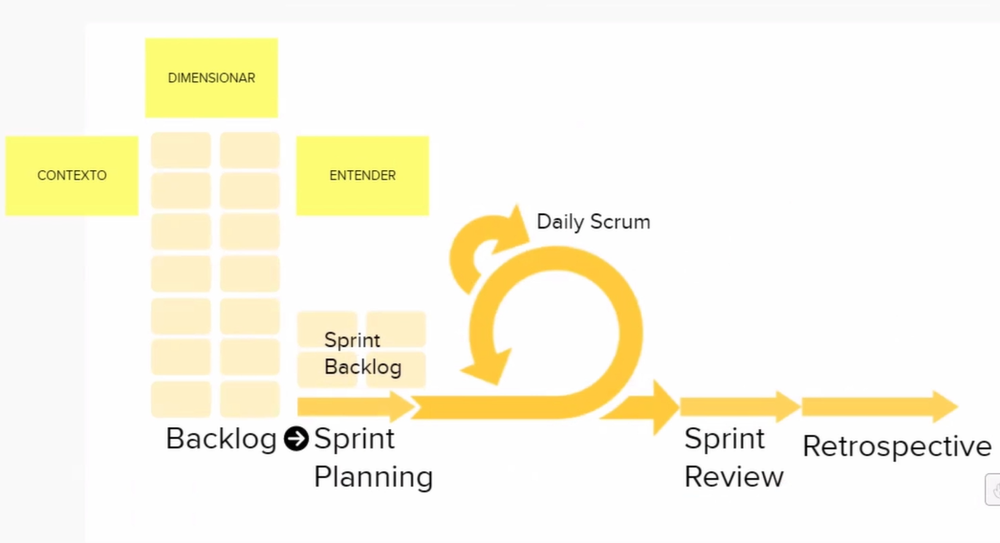
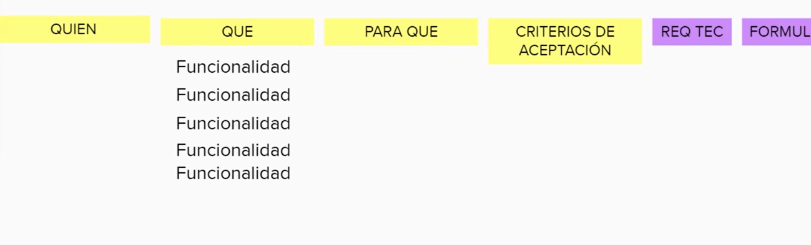
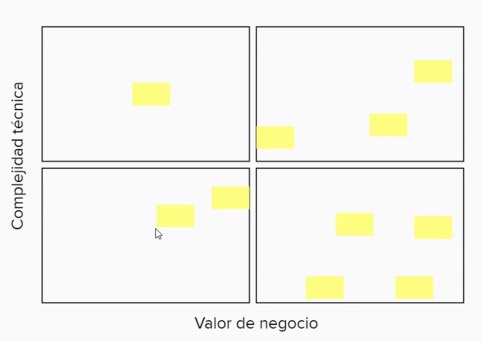

## 1. ¿Qué es una Historia de Usuario (HU)?

La HU describe de manera simple una funcionalidad que se necesita tener en el software.

### Características

* Se cuenta desde la perspectiva de la persona que va a utilizar esta funcionalidad.
* Esto es importante porque el software es de personas para personas
* No se nos debe olvidar que trabajamos para un usuario final.
* Muchas veces se confunde al cliente (persona que solicita la funcionalidad) con usuario final.
* SCRUM no tiene prácticas, es solo un contenedor de practicas.
* Las HU se originaron en el marco de trabajo XP (Exteme Programming).
* En XP, las HU son unidades de funcionalidad visibles para el cliente.

### Aplicar las HU bajo el concepto de XP permite:

* Construir funcionalidades pequeñas. Lo que disminuye la complejidad del proyecto.
* “Divide y vencerás”.
* XP nos dice que no solo es redactar, sino conversar al rededor de las historias.

### Notas

* El software es de personas para personas
* Es un artefacto muy útil para los procesos Agiles
* Es mas simple que un documento de Requerimientos
* Se debe romper el paradigma de generar documentos extensos y difíciles de leer
* Enlace -> https://scrum.mx/informate/historias-de-usuario

## 2. Estructura de una historia de usuario

* Usuario (Quién): Como usuario admin quiero eliminar comentarios
* Funcionalidad (Qué): Agregar o eliminar comentarios desde el admin
* Beneficio (Para qué): Interfaz mas limpia para los usuarios sin comentarios no deseados
* Criterios de aceptación: condiciones de calidad a la funcionalidad. son las guías para poder crear lo que se esta esperando.
* El propósito del Daily Scrum es inspeccionar el progreso hacia el Objetivo Sprint y adaptar el Sprint Backlog según sea necesario, ajustando el próximo trabajo planeado.

### Notas

* En la practica funciona mejor si condensas todo en una sola frase:

~~~
Como admin quiero poder eliminar los comentarios con menos likes para mantener la plataforma con una interfaz limpia y que resalte los comentarios.

Criterio de aceptación: Es posible eliminar los comentarios con menos de 15 de likes.
~~~

Enlaces -> https://scrum.mx/informate/historias-de-usuario

## 3. ¿Por qué fracasan los esfuerzos de implementar Historias de Usuario?

porque falla la simplicidad, ya que cuando crear historias de usuario lo hacen a nivel modular, es decir que trabajan como epica.

* las historias de usuario deben ser simples
* Subestimamos el para quién, quien va a usar la aplicación, ayudaria saber quien es el bayer persona
* No tenemos claro para que hacemos lo que hacemos, es necesario saber el beneficio y nos da contexto
* la agilidad no vive de Scrum,y Scrum no son sólo historias de usuario

### Manifiesto Agil

* la medida de avance es el software funcionando y no la documentación extensiva
* la documentación es para podernos entender

### Reto

* Como usuario, mi objetivo es instalar una aplicación desde la intranet utilizando un archivo APK. Esto me permitirá realizar la instalación en mi celular de manera segura, evitando compartir la aplicación a través de medios no seguros.

    * Criterios de Aceptación
    1. El archivo APK se encuentra disponible en la intranet de la empresa o en un servidor designado.
    2. El usuario puede acceder a la ubicación del archivo APK desde su dispositivo móvil.
    3. Al hacer clic en el archivo APK desde la intranet, se inicia el proceso de descarga en el dispositivo del usuario.
    4. La instalación se completa sin errores o advertencias.

* Como usuario, quiero acceder a la aplicación utilizando un nombre de usuario y una contraseña para poder ingresar de manera fácil.
    * Criterios de Aceptación
    1. La aplicación debe tener un campo para ingresar el nombre de usuario y otro para la contraseña en la pantalla de inicio de sesión.
    2. Debe haber una validación que verifique si el nombre de usuario y la contraseña ingresados son correctos.
    3. En caso de que el nombre de usuario o la contraseña sean incorrectos, la aplicación debe mostrar un mensaje de error claro y permitir al usuario intentar nuevamente.
    4. Si el nombre de usuario y la contraseña son correctos, el usuario debe ser redirigido a la interfaz principal de la aplicación.
    5. Se debe implementar seguridad para proteger la información del usuario durante el proceso de inicio de sesión.
    6. La interfaz de inicio de sesión debe ser intuitiva y de fácil acceso para los usuarios.

* Como usuario, deseo visualizar las solicitudes pendientes al iniciar la aplicación para monitorear el estado de las solicitudes que he creado.

    * Criterios de Aceptación
    1. Al iniciar sesión en la aplicación, se debe mostrar una sección o pantalla clara que liste las solicitudes pendientes del usuario.
    2. Cada solicitud debe mostrar información relevante, como el estado actual, la fecha de creación y detalles adicionales que ayuden al usuario a identificarlas fácilmente.
    3. Debe existir la posibilidad de filtrar o buscar las solicitudes según diferentes criterios, como por fecha, estado o tipo de solicitud.
    4. Si no hay solicitudes pendientes, se debe mostrar un mensaje indicando que no hay solicitudes en curso.
    5. Se deben implementar opciones de actualización automática o manual para refrescar la lista de solicitudes y garantizar que la información sea siempre actual.
    6. La interfaz de visualización de solicitudes debe ser intuitiva y fácil de navegar para proporcionar una experiencia eficiente al usuario.

* Como usuario, necesito la capacidad de crear nuevas solicitudes con un ID asignado al presionar un botón, facilitando así la inclusión de mis solicitudes pendientes y permitiéndome identificar fácilmente el ID correspondiente a cada solicitud

    * Criterios de Aceptación
    1. Debe existir un botón claramente identificable en la interfaz de usuario para iniciar el proceso de creación de nuevas solicitudes.
    2. Al presionar este botón, se debe abrir un formulario o pantalla donde el usuario pueda ingresar los detalles de la nueva solicitud, incluyendo información pertinente como título, descripción y cualquier otro campo relevante.
    3. Cada solicitud creada debe estar automáticamente asignada a un ID único y consecutivo para facilitar su identificación posterior.
    Después de crear la solicitud, se debe mostrar de manera clara y legible el ID asignado a esa solicitud para que el usuario pueda hacer referencia a él en el futuro.
    4. Debe haber validaciones para asegurar que la solicitud se cree con la información necesaria y que los campos obligatorios estén completos antes de ser guardada.
    5. Se debe proporcionar retroalimentación al usuario confirmando la creación exitosa de la solicitud y, en caso de algún error, se debe mostrar un mensaje claro indicando el problema.
    6. La funcionalidad de creación de solicitudes debe ser accesible y fácil de usar, manteniendo una experiencia de usuario intuitiva.

* Como administrador del sistema, necesito acceder al backoffice para visualizar un registro detallado de las solicitudes enviadas, incluyendo información actualizada sobre su estado, con el fin de monitorear las solicitudes creadas por los ejecutivos comerciales.

    * Criterios de Aceptación
    1. Debe existir un acceso exclusivo al backoffice, protegido por autenticación adicional o privilegios de administrador.
    2. El backoffice debe mostrar una lista completa de todas las solicitudes enviadas por los ejecutivos comerciales.
    3. Para cada solicitud, se debe proporcionar información detallada, como el ID de la solicitud, el nombre del ejecutivo comercial que la creó, la fecha de creación y el estado actual de la solicitud.
    4. Debe ser posible filtrar y buscar las solicitudes por diferentes criterios, como por nombre del ejecutivo, fecha de creación o estado actual.
    5. Se debe garantizar la actualización en tiempo real o la opción de actualización manual para mantener la precisión de la información sobre el estado de las solicitudes.
    6. Deben existir funcionalidades adicionales para que el administrador pueda realizar acciones como cambiar el estado de una solicitud o agregar comentarios relevantes para un mejor seguimiento.
    7. La interfaz del backoffice debe ser fácil de navegar y presentar la información de manera clara y legible para facilitar el monitoreo efectivo de las solicitudes.

## 4. Estrategias para poder habilitar HUs de manera efectiva

## DIMENSIONAMIENTO

* Poder del contexto
    1. Entendimiento del problema: Entender el origen de lo que me están pidiendo.
    2. Establecer objetivos del negocio: Todos debemos conocer de que manera impactan los objetivos.
    3. Requerimientos técnicos: Lo que es necesario para entregar el producto, para hacer realidad esas funcionalidades.
    4. Requerimientos de Transición: Considerar que entre ambientes pasan eventualidades que pueden provocar fallos inesperados.

## PROPIEDADES INVEST

* Estas propiedades estan relacionadas con las historias de usuario.
* Verificar que cada Historia de Usuario tenga estas propiedades.

    * I : Independent. 
        * tienen que ser lo mas simple
        * Cuidar que no sean Epicas.
    * N: Negotiable. 
        * Poder de descartar historias no valiosas, negociar el orden y la priorización.
        * nos movemos en incertidumbre y debes ser agiles.
        * tener cuidado con "Cuando todo urge nada realmente importa, porque si todo urge tiene la misma importancia y si tiene la misma importancia no importa el orden en que lo hago."
    * V: Valuable. 
        * Toda historia de usuaria debe ser valiosa cuando queda claro el "para que".
        * saber porque es valiosa, que aporta, cual es su beneficio.
    * E: Estimable. 
        * El equipo de desarrollo, debe de calcular el tiempo y esfuerzo que le llevara cumplir con la HU.
        * dar voz, voto y opinion a la gente que realiza las HU.
    * S: Small. 
        * Se da mas peso a el entendimiento y la conversación y no a la especificación.
    * T: Testeable. 
        * Valida que los criterios de aceptación, y especifica si la HU esta siendo "correcta" o "incorrecta".

## 5. Qué es un Backlog en Scrum?

“Es una lista emergente y ordenada de lo que se necesita para mejorar el producto”.

* tener en cuenta que en el backlog tambien se prioriza segun el valor y planear en que sprint se va a relaizar
* La lista está viva y en movimiento.
* tenr en cuenta que existe el backlog y el sprint backlog
* Trello, notion, clickup, jira es una herramienta digital para crear y gestionar el Baclog

## 6. ¿Cómo se refinan los elementos de trabajo del Backlog?

“El refinamiento o grooming de backlog del producto es el acto de descomponer y definir aún más los elementos de trabajo pendiente del producto en artículos más pequeños y precisos. Esta es una actividad en curso para agregar detalles”.

* El refinamiento se realiza en el inicio del Sprint planning. Si surgiera algo durante el sprint se podrá refinar en caso de ser necesario.

* de preferencia la HU que estan en el sprint backlog no se tocan.

* Mientras el equipo está desarrollando las historias en curso es momento de refinar las historias que vienen y tenerlas en el próximo sprint planning.

* La responsabilidad de refinar es del Product Owner, en conjunto con las personas con las que trabaje. El Product Owner es el responsable del “qué” y el equipo del “cómo”.

* Tener en cuenta que las HU no son para ti, sino para el que las realice.

## 7. ¿Cómo hacemos Historias de Usuario a partir listas de requerimientos?

* La importancia de poner las historias con su contexto para minimizar los errores y tener una visión conjunta de lo que se va a realizar
* Ayudar dar dimensiones al cliente, ayuda a sensibilizar y explicar el esfuerzo para lograr desarrollar el producto.
* Necesitamos dar dimensiones y mas categorías al desarrollo si no tenemos algo claro, provocamos re-trabajos.
* Siempre el primer Paso es tener la lista de funcionalidades
* Error número 1, es tomar esa lista de funcionalidades y dar un tiempo y costo del producto
* Recuerda tener toda la dimensiones claras, para que puedas identificar complejidad y atacarlas.

## 8. Criterios de Aceptación en las Historias de Usuario

Son condiciones para la calidad. La calidad tiene mucho que ver con la expectativa, mucho con los detalles.

3 recomendaciones de expectativas para crear los criterios:

* ¿Qué es importante que probemos? Que es importante que nos enfoquemos, que podría salir mal y que es importante que cuidemos → Las respuestas se dan de manera colaborativa.

* ¿Qué es lo que nos preocupa?: Ayuda a identificar riesgos o amenazas. Suele derivar en criterios de aceptación para agregar a nuestras historias.

* Qué más necesita saber el equipo? → En colaboración, conocer la experiencia de los colaboradores. Aquí también suele dar hincapié a hacer refinamiento.

## 9. ¿Cómo se priorizan las Historias de Usuario?

* Priorizar no es decir que todo urge
* Sino entender cada una de las partes de la solución y poder decir cual aporta más en este momento, cuál puede esperar y cual no estaría aportando.
* Es importante hacer la priorización de manera colaborativa.
* Recuerda que el eje principal de la agilidad es entrega frecuente de valor al usuario final
* Siempre tener prioridades de valor organizándolo en categorías
* La matriz nos ayuda a tener un tablero visual para priorizar

### Categorizando al Valor que aporta

Categorizar en función a lo que aporta.

* Aportación al negocio

    Ejemplo: Monetario, reducción de tiempo o costo, integración con algún otro tipo de tecnología.

* Aportación al usuario

    Ejemplo: Mejorar la interfaz, funcionalidad que premia al usuario.

Tener en cuenta también la Complejidad Técnica.
En el tablero de Kanban se realiza la priorización por etiquetas o por el orden en el que están colocadas las historias, siendo las primeras en este caso las más primordiales.

Matriz

* Debemos validar que aporte es valioso usando la herramienta de matriz de eisenhower
* Validar cual aporta mas y cual aporta menos
* Debemos ver técnicamente que tan complejo son las funcionalidades para que el equipo técnico pueda validar y decidir.
* Complejidad y factibilidad técnica

## 10. Primeros Pasos para habilitar Historias de Usuario

### Identifica Barreras en tu Equipo/Empresa:
* Resistencia al contexto en partes. (evitar usar jergas de especialización)
* Costumbre de los Casos de Uso.

### Identifica Barreras en ti:
* Conocimiento: Identificar que otra cosa necesitamos saber o conocer para sentirnos mas seguro para proponer el cambio dentro del equipo.
* Habilidades: La negociación y la comunicación. También la redacción.

### Recomendaciones generales:

* Cambia la forma de conversar - Cambia la forma de gestionar: Incluir el VALOR, CALIDAD y FACTIBILIDAD (negocio y técnica).
* Escucha con más atención y pregunta más: Hacer escucha activa y atrevernos a preguntar.
* Trabaja por Timebox: Dedicar tiempo a la creación del primer backlog (Análisis).
