# Curso de Creación de CV

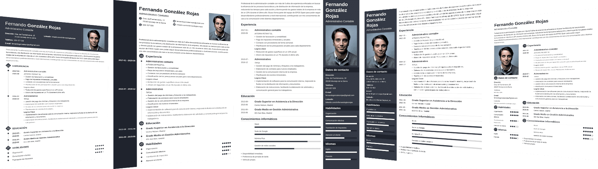

# Lo que debes conocer antes de construir tu CV

## Estilos y formatos para un CV memorable

* el objetivo del cv es obtener la entrevista y no el trabajo
* tomar atención al contenido y a como lo presentas
* no enviar el CV en formato de imagen
* estructuras la presentación del CV
* la idea del cv es enganchar
* no poner nivel de cada habilidad de cada soft skill o hard skill
* tener un formato tradicional para que asi identifiquen el mensaje del CV
* no crear un CV que no agregue valor 
* tener en cuenta que la personas de recursos humanos no tienes o no conoce los hard skill que tu sabes

### para los ATS
* usa formato simple
* usa palabras clave
* envia en formato pdf
* adaptalo a la vacante que buscas

## Optimiza tu CV para los filtros ATS

### que es un ATS(aplicant raking system)
es un software que hace un pre filtro que identifica los keywords que haga un match con ña vacante que se dispone.

### Competencias profesionales

* MCclelland
    es aquello que realemente causa un rendimiento superior en el trabajo.

* Martha Alles
    las caracteristicas de personalidad devenidas, comportamientos que generan un desempeño exitoso en un puesto de trabajo.

### Concepto del iceberg

* lo que debes agregar en tu CV es la experiencia, conocimientos y habilidades.

* en la entrevista lo que se evalua es la actitud y valores

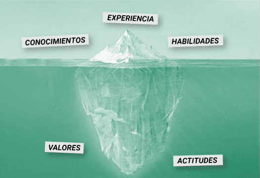

### se debe tener en cuenta la siguientes caracteristicas

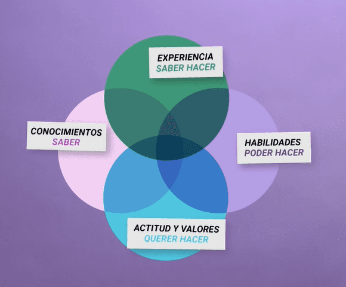

### las keywords

* Verbos de accion

* Terminos especificos

## Capacidades, habilidades y competencias: ¿Qué diferencias hay?

* **Capacidad:** La palabra capacidad viene del latín capacitas y significa la cualidad del que es capaz. La capacidad es el conjunto de condiciones que permiten a una persona desarrollar una tarea efectivamente. La capacidad puede ser física, intelectual o emocional, y puede desarrollarse y mejorarse a través de la educación, el entrenamiento y la práctica. En este sentido, capacidad se refiere al potencial de aprender o desarrollar una acción, que en nuestro caso es: el cumplimiento de una función o el desempeño de un cargo.

* **Habilidad:** La palabra habilidad viene del latín habilitas, que es la cualidad del que es hábil. Es decir, se refiere a la destreza de una persona para hacer o ejecutar una cosa correctamente, con facilidad y/o con agilidad.

* **Competencia:** Son las características de personalidad devenidas, comportamientos que generan un desempeño exitoso en un puesto de trabajo. Cuando se dice que alguien es competente, se refiere a que la persona tiene un desempeño superior al estándar y generan un desempeño destacable en un puesto de trabajo.

### ¿Cuál es la diferencia entre capacidades, habilidades y competencias profesionales?

Primeramente, es necesario aclarar la diferencia entre capacidades con respecto a las habilidades y las competencias. Esta diferencia hace referencia a si alguien es capaz, o no, de llevar a cabo una tarea o labor. Si una persona todavía no puede lograr realizar una tarea o labor, pero sí tiene las bases (generalmente intelectuales) para aprender a hacerlo, estamos hablando de capacidad.

En segundo lugar, debemos distinguir entre habilidades y competencias. Una habilidad es cuando una persona puede realizar una tarea, mientras que competencia es cuando esa tarea se realiza con amplio conocimiento (saber), experiencia (saber hacer), habilidad (poder hacer) y actitud (querer hacer).

Entonces la diferencia radica principalmente en el rango, es decir, el nivel que nos indica “qué tan bien” se puede realizar una tarea o función determinada.

Esta jerarquía se puede observar en la siguiente imagen:

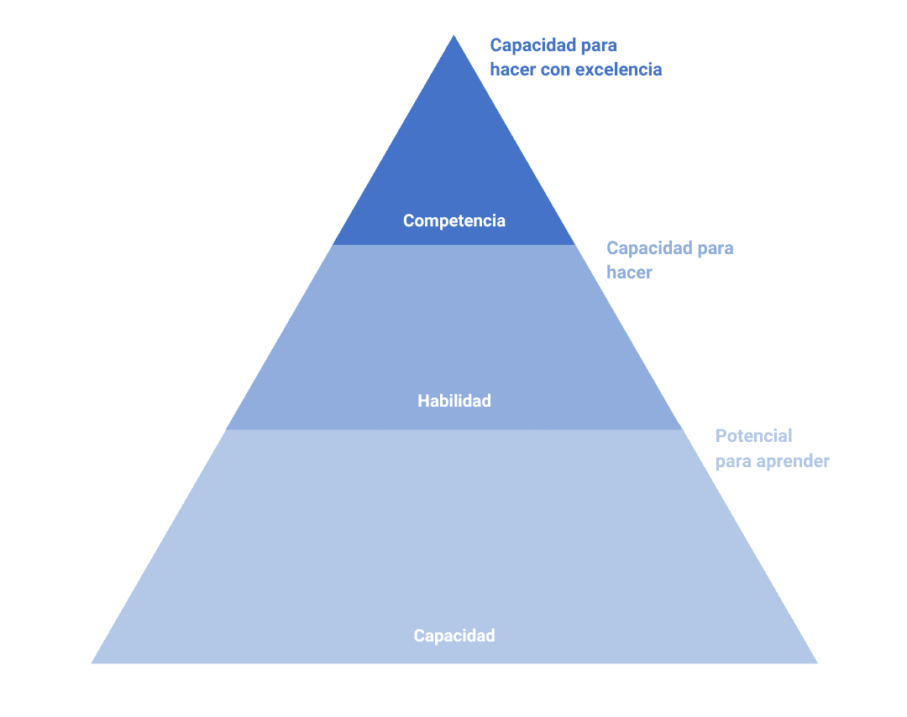

Veamos un ejemplo de capacidades vs. habilidades en una vacante:

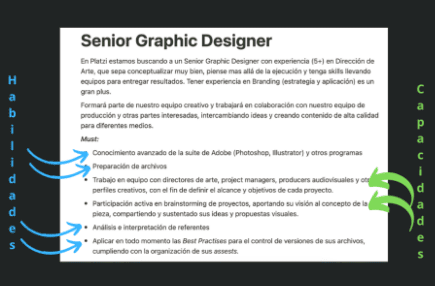

### ¿Cuáles son las habilidades y capacidades más buscadas por las empresas para 2023?

Las habilidades y capacidades más buscadas por las empresas actualmente incluyen:

• **Capacidad de liderazgo y gestión de equipos:** Las empresas buscan a líderes que sepan cómo motivar a los demás y gestionar equipos de trabajo para lograr los objetivos. En mi experiencia he visto personas en su primer empleo con esta capacidad desarrollada y al demostrarla les hace avanzar más rápidamente en su crecimiento personal.

• **Habilidades en inteligencia artificial y análisis de datos:** Los profesionales que tengan experiencia en el desarrollo de sistemas basados en AI y en el análisis de datos están siendo altamente demandados. Me ha sorprendido en los últimos años como esta habilidad se ha vuelto un plus para casi todas las profesiones, incluyendo la mía en reclutamiento, por ejemplo. Sería un buen ejercicio que investigaras cómo esta habilidad puede crear un valor extra e impactar positivamente tu perfil profesional.

• **Habilidades en la nube:** Las empresas están invirtiendo en la migración de sistemas a la nube, por lo que necesitan profesionales con conocimientos en tecnologías de la nube.

• **Habilidades en programación:** Los profesionales con conocimientos en lenguajes de programación como Java, Python, JavaScript, etc.

• **Capacidad de autonomía:** Es muy valorada la capacidad de gestionar y priorizar las tareas del día a día para ser más productivos y trabajar por objetivos, más que por horarios. También esta incluye la capacidad de autoaprendizaje para mantenerte actualizado y tener herramientas que te ayuden a hacer mejor tu trabajo.

### ¿Cómo identificar tus capacidades, habilidades y competencias profesionales?
Las mejores formas de identificar tus capacidades, habilidades y competencias profesionales son:

* **Analiza tu currículum:** estudia tu currículum para identificar tus experiencias laborales, proyectos y habilidades laborales. Esto te ayudará a determinar qué habilidades y capacidades tienes para ofrecer.

* **Realiza una autoevaluación:** hazte una lista de tus habilidades y capacidades profesionales y clasifícalas según el nivel de habilidad.

* **Pide retroalimentación:** pídele a tus superiores, compañeros de trabajo, amigos y familiares que te den una evaluación honesta de tus habilidades y capacidades profesionales.

* **Asiste a eventos profesionales:** asistir a eventos y conferencias relacionados con tu profesión, te puede ayudar a ampliar tus conocimientos y te dará información sobre las habilidades y capacidades que tienen las personas que pueden ser referentes en tu profesión. Esto te puede dar una idea de dónde puedes mejorar y qué áreas de tu profesión debes desarrollar.

* **Busca un mentor:** encontrar un mentor puede ser una gran ayuda para desarrollar tu carrera. Un mentor te puede guiar a través de su experiencia, ayudándote a enfocar la ruta para desarrollar tus capacidades y habilidades según tu objetivo, comentarte que capacidades o habilidades ya tienes desarrolladas y cuáles debes mejorar.

Identificar tus capacidades, habilidades y competencias profesionales es un paso importante para desarrollar tu carrera. Usa estos consejos para ayudarte a identificar tus capacidades profesionales y comienza a trabajar en ellas para seguir aprendiendo con la ayuda de Platzi donde encontrarás todos los recursos necesarios para desarrollarte profesionalmente.

## Verbos de acción

* Pasivos: no estan atados a un sujeto
    
    Usar para describir logros.

    * Se ganaron 12 campañas en el 1er Q del año

* Activos: Lllevan un sujeto

    Usar para describir actividades

    * Coordiné / Implemente / ejecuté 

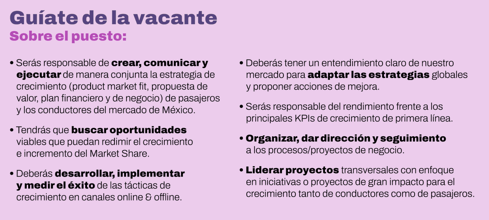

# Construcción de CV

## ¿Qué secciones debe tener un CV?

1. Título
2. Objetivo profesional / Sobre mí / Resumen
3. Skills / Competencias / Habilidades
4. Experiencia
5. Formación
6. Escolaridad
7. Hobbies
    * para que los reclutadores puedan identificar si eres compatible con la cultura de la empresa
8. Datos de contacto
    * no datos personales
    * no se incluye fecha de nacimiento, edad o dirección

## ¿Qué título poner en tu CV?

* va en la parte superior, el inicio del documento
* se agrega la profesion y el rol que busca
* tambien puedes agregar tu formación
* **NO PONGAS CURRICULUM VITAE**

## Redacta tu objetivo profesional para tu CV

* Es un rol de 5 a 7 reglones
* que rol o puesto busco?
* porque hace fit con esta vacancia?
* cuales son tus fortalezas?
* como te puedes destacar frente a otros candidatos?
* Recuerda que puedes inspirarte en la vacante

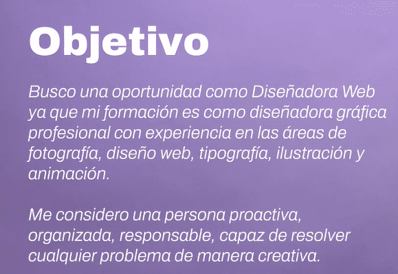

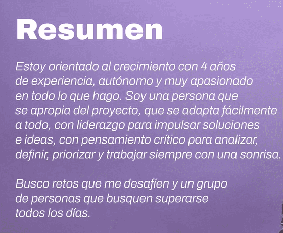

## Habilidades duras y blandas en tu CV

Hard Skills: 🚀
Valores, actitudes, inteligencia emocional

* Uso de metodología Design thinking
* Ilustración
* Diseño UI
* Atencion al detalle
* Uso de suit Adobe

Soft Skills: 🤟🏻
Conocimientos, experiencia, software, herramientas.

* Colaboración
* Participación
* Creatividad
* Pasión

## ¿Cómo agregar tu formación, educación o capacitación en tu CV?

* Formación
curso, talleres y capacitaciones que te dan una especialidad

* Educación
te dan un grado una especialidad, es mas formal. te dan un grado, maestria, doctorado o licenciatura.

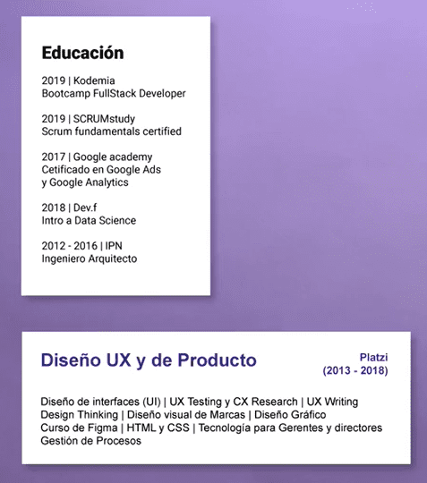

## ¿Cómo describir tu experiencia profesional en tu CV?

* si no tienes experiencia puedes agregar:
    * proyecto personales
    * proyectos freelance

* tener en cuenta que puedes basarte en los textos de la vacante

## Datos de contacto, hobbies e información adicional en tu CV

### Datos de contacto

son los medios por los cuales te pueden cntactar:
* Correo
* Linkedin
* Celular
* Página web
* Portafolio

### Hobbies

* conocer personas de otras culturas
* Fotografía
* Viajes
* Deportes
* Videojuegos
* Relajación
* Leer

* NO AGREGAR IMAGENES

### Información adicionales
Relacionada a tus competencias, pueden ser afines a tu profesion o no.

* Voluntariado
* Escribir
* Bloguear
* Podcasting

# Personaliza tu CV

## Cómo redactar tu CV si no tienes experiencia profesional previa

Estructura del CV:
1. Título
2. Objetivo Profesional / Sobre mi / Resumen
3. Skills / Competencias / Habilidades
4. Experiencia
5. Formación
6. Escolaridad
7. Hobbies
8. Datos de contacto

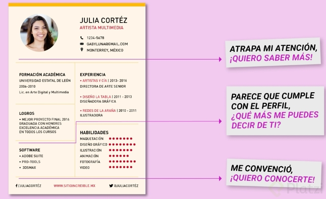

## Cómo redactar tu CV si eres estudiante

### Recordar que debe usar

* Keywords enfocados a skills
* tus conocimientos puestos en practica
* agrega proyectos personales, freelance
* como foto puedes usar una ilustración

No olvides:
* el Titulo
* Objetivo / Sobre mí

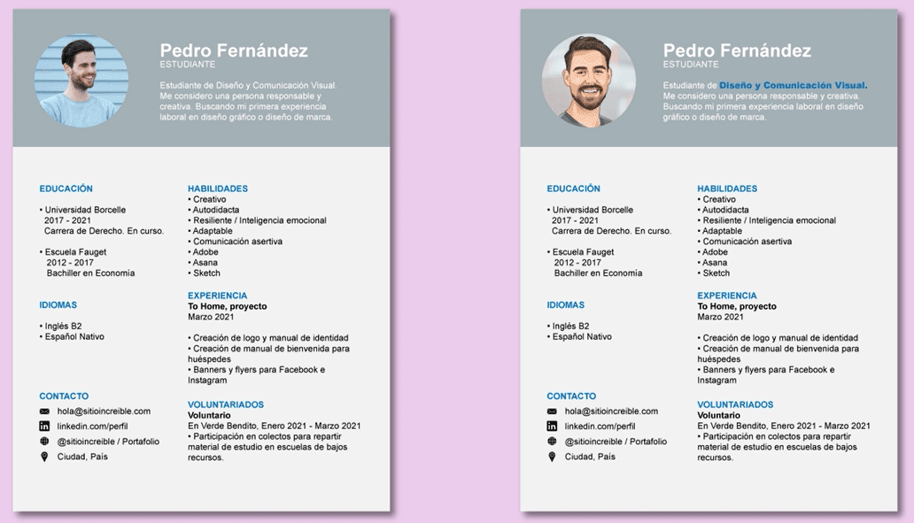

## Cómo redactar tu CV si estás haciendo un cambio de carrera

1. Título
    * no usar el empleo anterior
    * ni mencionar sobre lo que estudiaste antes
    * tampoco mencionar puestos anterior que no esten relacionados
2. Sobre mí / Resuemn
    * explicar un poco porque haces ese cambio de carrera
    * comentar que sabes y porque puedes realizarlo
3. Formación
    * cursos, talleres y certificaciones que te den habilidades y conocimientos para desempeñar el rol a la que cambias de carrera
4. Skills
    * hard skills y soft skill de esta nueva carrera o nuevo rol
5. experiencia
    * proyectos propios
6. Hobbies
    * agrega lo que aporte valor
7. Información adicional
8. Datos de contacto
9. Escolaridad

### Bonus CV

* Puedes usar Linktr.ee donde puede compartir tus redes sociales
* puedes integrar tu CV a Notion

## Lo que NO debes poner en tu CV
* Foto
* Muchas imágenes
* Muchos colores
* Escrito en tercera persona
* Más de 2 tipos de letra
* Más de 2 hojas
* Información personal
* Referencias personales
* Color de fondo
    * los ATS se bloquean cuando se usa color de fondo
* No agregar el nivel para la vancante que estas buscando en el titulo

### cuando sabemos que sera revisado por un ATS
* cuando nos pidenque usemos un software para cargarlo

## Envía tu CV y da seguimiento asertivo

* Asunto del correo: CV_Puesto_Nombre
* Cuerpo del correo: NO enviar sin cuerpo, redacta algo sencillo y saluda.
    * no agregar demasiado texto
    * debe ser breve, que invite a entrevistarte
    * porque tienes el perfil?
    * recuerda el tono de tu mensaje, dependera a quien envias
    * comentar porque te gustaria trabajar en esa empresa y porque el puesto

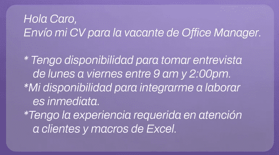

* Lunes, martes o jueves son los mejores días para enviarlo.
* Horarios ideales: 8:00 am a 11:00 am y de 3:00 pm a 4:00 pm

### Seguimiento:
* Envía un correo de seguimiento 3 días y 1 semana después.
* Envía al reclutador tu CV por mensaje de LinkedIn.