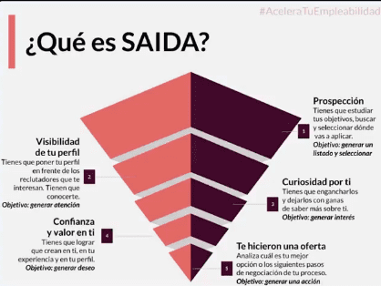
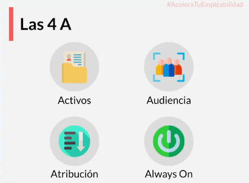
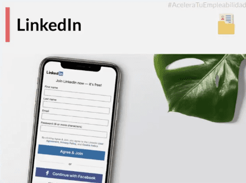
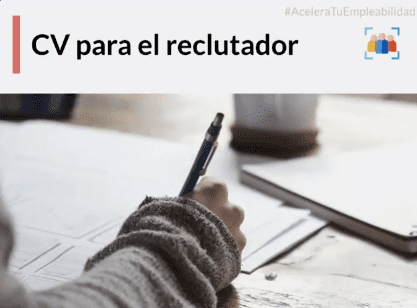
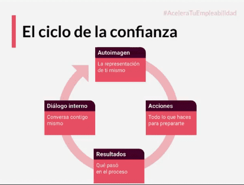
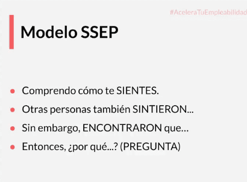
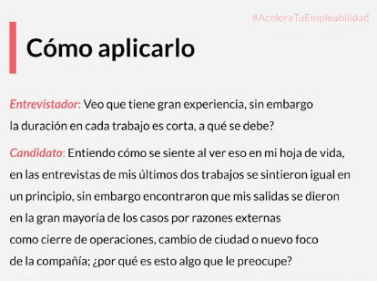
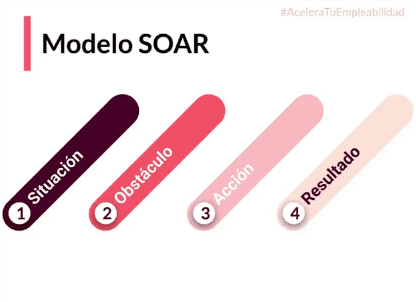
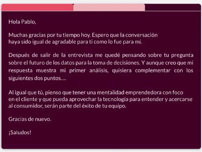

# Curso optimización del perfil profesional

[Untitled](https://www.notion.so/bdb44e8ab1ef46b5b22d1ab02846a14e)

## ¿Para quien es este curso?

- Personas graduadas
- Sin empleo
- Personas que no les gusta su empleo actual

## Para quien NO es ?

- Personas que NO están dispuestas a pensar diferente
- No quieren trabajar duro
- conformistas, frustrados

## Que hacer cuando te sientes frustrado?

- Busca una red de apoyo
- vence los miedos
- Encuentra un método y una disciplina

### Entonces:

Como encontrar tu propósito de vida

Como planificar tu búsqueda?

Como prepararse para una entrevista?

Como hacer seguimiento?

## ¿Cual es tu objetivo ?

El método IKIGAI nos permite encontrar el propósito de vida y alinearlo con el propósito de tus prospecciones

A través de este método nos permitimos preguntarnos 

- Que amas hacer?
- Que crees que necesita el mundo?
- Que puedes hacer y que te paguen por ello?
- En que eres bueno?

## Planifica tu búsqueda de las 4 V

1. VOLUMEN: Manten un flujo constante de vacantes, recuerda de 200 entrevistas probablemente obtengas una Oferta laboral ajustada a tus objetivos
2. VALOR: Dar todo en tus entrevistas
3. VELOCIDAD: Ser mas ágil y veloz en tus procesos
4. VARIEDAD: Busca trabajo en diversos campos laborales

<aside>
📌 CREA RUTINAS DE PROSPECCIÓN

</aside>

## Modelo SAIDA para potenciar tu empleabilidad

Considerar una búsqueda de empleo como un proceso de ventas, tienes muchos prospectos hasta encontrar tu cliente.

## Las 4 A del marketing laboral

Estrategia de mercadeo laboral para optimizar el perfil Profesional

Tiene como objetivos :

- Mas personas te conozcan
- Generar una contratación

1. ACTIVOS:
- Curriculum vitae: No poner tus funciones, solo tus logros medibles, siempre en PDF, sin errores de ortografía, sin datos personales y la foto de manera opcional ( No es imprescindible)
- Carta de presentacion
- Aplicación
- Perfiles en redes sociales: Uso inteligente y coherente de las redes sociales con tu perfil profesional

LINKEDIN

Es una buena plataforma para formar tu perfil profesional y gestionar un buen Networking

Alli puedes: 

- Buena foto
- Buena URL
- Red de contactos
- Logros
- Certificados de PLATZI
    
    
    
    
    2. AUDIENCIA
    
    Tener muy presente quien va a leer mi Curriculum, puede ser un Ingeniero, Especialista o un comunicador
    
    Pensar y adaptar el curriculum al tipo de persona que le estoy enviando.
    
    
    
    <aside>
    📌 RECUERDA:  En los primeros 6 SEGUNDOS se pueden descartar CV's
    
    </aside>
    
    Entonces 
    
    - Preparalo muy bien
    - Ten mínimo 2 versiones de tu CV
    
    4. ALWAYS ON  
    
    Mantente siempre Activo
    
    - Siempre busca prospectos
    - Entrevistas
    - Mejora tus activos
    - Siempre puede haber algo mejor
    - Perfeccionar tu pitch de venta
    
    
    
    Busca durante 10 días, 10 empresas y 10 contactos
    
    Esto te permitirá aumentar tu velocidad y tus prospecciones
    
    ## Prepara tu dialogo interno
    
    Lo que tu crees de ti mismo
    
    El ciclo de la confianza
    
    
    
    ## Encuentra tu Diferencial y tu Gancho
    
    Relaciona los logros que has alcanzado y te hacen diferente
    
    - Fortalezas
    - Misión en la vida
    - Capacidades únicas
    
    Gancho: Aquello que haces y practicas de manera personal y genera valor para tu ser
    
    Diferencial: Aquellas cosas que te hacen único, logros obtenidos y medidos.
    
    ## Proyecto de valor
    
    Es la investigación que se hace sobre la empresa a la cual estoy postulando para un Rol, permite saber como están y que puedo ofrecerles en ese rol.
    
    <aside>
    📌 ¿DE QUE FORMA PUEDO MEJORAR LOS PRODUCTOS O SERVICIOS QUE OFRECEN?
    
    </aside>
    
    Sirven para
    
    - Marcar diferencia
    - Ser recursivo
    - Demuestras que sabes hacer el ROL
    
    ## Anticipa las preguntas
    
    Preparación para las entrevistas
    
    - Que se de la empresa?
    - Que se del cargo?
    - Que se de mi respecto al ROL?
    - Cual es mi estrategia?
    
    <aside>
    📌 Las preguntas también las puedes hacer tú y es importante darle un sentido de dialogo y no de cuestionario, para eso, demuestra interés y toma notas de las respuestas
    
    </aside>
    
    - Como es el proceso de medición?
    - Cuales son los 3 desafíos mas grandes del ROL?
    - Desafió mas grande de la empresa?
    - Cual es la proyección de carrera?
    - Es un cargo nuevo? Que paso con la persona anterior?
    - Como es la estructura del equipo?
    
    ## Como manejar las objeciones?
    
    Modelo SSEP
    
    
    
    
    
    ## Tiempo de Entrevistar
    
    - Manten tu energía al máximo
    - Encuentra tu pose de poder
    - Confía en ti
    
    ### TIPS
    
    - Llega temprano
    - Cuida tu presentación personal
    - Se amable con todos
    - No mientas
    - Genera conversación
    - Toma notas
    
    ## El arte de responder
    
    Cuando se presenten preguntas 
    
    Método SOAR
    
    
    
    1. SITUACIÓN: Explicar el contexto de lo que paso
    2. OBSTÁCULO: Difinir el obstáculo
    3. ACCIÓN: Que se hizo para resolver el problema
    4. RESULTADO: Que se obtuvo a raíz de esa decisión
    
     
    
    ## EL TOQUE FINAL
    
    Es la forma de pedir Feedback sobre la forma y las ideas que se plantearon en la entrevista y de todo lo dicho que fue lo mas relevante para el reclutador, de esa forma, se refuerza o se aclaran  ideas que no hayan quedado claras.
    
    - Agradece por el tiempo y pregunta
    
    <aside>
    📌 ¿QUE FUE LO QUE MAS LE GUSTO DEL PERFIL?
    
    </aside>
    
    Podrás adaptar la respuesta, complementarla y agradecer nuevamente.
    
    ## SEGUIMIENTO
    
    Siempre después de la entrevista envía a través de un correo o mensaje un mensaje de seguimiento
    
    
    
     Otro ejemplo de un buen mensaje de seguimiento
    
    