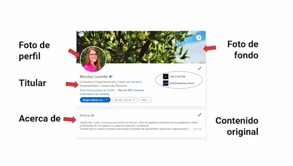
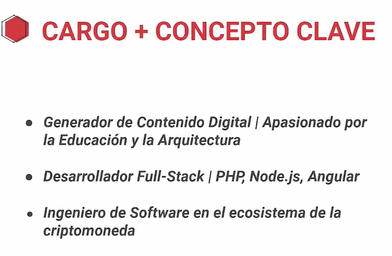
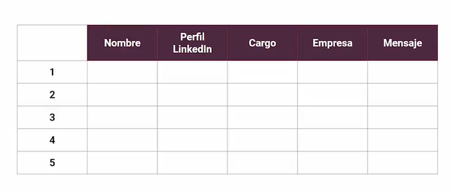

# Curso de Optimización del Perfil de LinkedIn

# Reputación Virtual y Reclutadores

### Qué es la reputación laboral
La reputación es aquello que las demás personas piensan sobre nosotras o nosotros. Este elemento no lo podemos controlar 100%, pero si lo podemos influenciar un poco por medio de la coherencia entre lo que decimos y hacemos.

* Gary Vaynerchuk dice: Reputation is the ultimate currency

### Cuál es el efecto de la reputación en tu búsqueda laboral
La reputación en la búsqueda laboral es tan importante que Career Builder, una plataforma de empleo mundialmente reconocida, realizó un estudio cuyos resultados fueron que el 70% de los empleadores usan las redes sociales como filtro de sus posibles candidatos.

### Pérdida de oportunidades
El estudio de Career Builder también mostró que el 70% de los reclutadores descartaron candidatos por mala reputación en redes sociales, haciendo referencia a:

* Fotos controversiales
* Contenido de críticas hacia su trabajo
* Contenido político controversial

### No publicar no es la solución
Podríamos llegar a suponer que la solución se encuentra en no publicar nada en redes sociales o directamente no tenerlas. Pero el estudio de Career Builder evidenció que el 57% de los reclutadores descartaron candidatos por no encontrar ningún contenido online.

### Acciones correctivas
No te preocupes, siempre es buen momento para curar y sacar a delante nuestra marca personal, para ello lo que puedes hacer es:

* Elimina contenido controversial
* Cambia la configuración de privacidad
* Quita las etiquetas que tengas de publicaciones no deseadas
* Actúa como una marca
* Participa en eventos relacionados con tus intereses
* Haz voluntariado
* Comenta en LinkedIn
* Crea una web personal

### ¿Cómo medir tu reputación en LinkedIn?
**Una manera interesante de medir nuestra reputación en LinkedIn es por medio de Social Selling Index,** que es una herramienta que recopila información acerca de nuestro perfil en esta plataforma acerca de:

* Establecer marca personal
* Personas adecuadas para sumar a tu red
* Interacciones de valor
* Crear relaciones por medio de la mensajería de LinkedIn
* Luego **Social Selling Index** nos dará un  puntaje final, que indicará la calificación de nuestra marca personal en general, basándose en los 4 parámetros anteriormente vistos.
* se debe ser consistente: tu carácter, actitud y conducta se mantienen constantes

## tu carácter, actitud y conducta se mantienen constantes

LinkedIn es una red social importante para relacionar talento con reclutadores/ras, empresas o startups que están buscando profesionales idóneos.

### Cuál es la relevancia de LinkedIn
Para entender la relevancia de LinkedIn en el mercado de conectar talento humano con startups o empresas, observemos algunas cifras:

* 590 millones de profesionales en LinkedIn
* 15 millones de empleos publicados
* 10 millones de empresas usan LinkedIn
* 95% de los profesionales usan LinkedIn para encontrar candidatos

En consonancia a las cifras anteriormente vistas, se puede afirmar que LinkedIn tiene una de las bases de datos más grandes del mundo, en cuanto a candidatos. Por lo tanto, es muy beneficioso que nos encontremos en esta plataforma.

### Cómo buscan talento los reclutadores
Lo primero que debemos entender acerca de las y los reclutadores es que no son detectives, no van tratando de encontrar que trabajo quieres y cuál se ajusta a tus intereses.

Lo segundo que va muy pegado al primer punto es que ellas o ellos trabajan para sus clientes, no para nosotras o nosotros como personas.

### El trabajo del reclutador o reclutadora
El trabajo de una reclutadora o reclutador es buscar perfiles que encajen con los puestos o vacantes que le pidan sus clientes.

Por lo tanto, una buena forma de relacionarnos con ellas o ellos es conociendo sus intereses y estar dispuesta o dispuesto a ayudar antes de recibir.

### Recruiter Lite
**Recruiter Liete** es una herramienta de LinkedIn que le permite a las o los demandantes de trabajo realizar búsquedas avanzadas, gracias a la gran cantidad de datos en LinkedIn.

* **Un dato interesante:** el tiempo promedio para convencer a una reclutadora o reclutador de que siga leyendo nuestro perfil o que se interese en nosotras o nosotros es de 20 segundos.

### Conclusión
A manera de conclusión, podemos decir que:

* Nuestra presencia en LinkedIn, nos aporta muchos beneficios en la búsqueda de trabajo.
* Las reclutadoras trabajan para sus clientes, no para nosotras o nosotros.
* Las reclutadoras utilizan LinkedIn por medio de las bases de datos.

# posicionamiento Profesional

## Define tu objetivo profesional
El objetivo profesional es la combinación de varios elementos que describen nuestra dirección y preferencias a la hora de buscar un empleo.

### Cuáles son los elementos del objetivo laboral
Para comprender como realizar un objetivo laboral, definamos los elementos que lo componen. Complementando con ejemplos que nos pongan en contexto.

### 1.Área laboral
El área laboral hace referencia al departamento o equipo al que nos gustaría pertenecer dentro de una startup o empresa. Algunos ejemplos son:

* Desarrollo web
* Marketing
* Ventas
* Finanzas
* Operaciones
* Etc.

### 2. Geografía determinada
Los procesos de contratación son diferentes a lo largo del mundo, por lo que debemos tener bien definido de donde queremos que geográficamente sea la startup o empresa.

### 3. Industria de la startup
La industria o sector es a lo que se dedica la startup o empresa, como por ejemplo:

* Tech
* Farmacéutica
* Educación
* Alimentación
* Moda
* Salud

### 4. Tipos de organizaciones
Existen diferentes tipos de organizaciones, las cuales debemos tener muy en cuenta, ya que todas tienen diferentes estructuras, cultura y manera de organización, echemos un vistazo a algunos ejemplos:

* ONG
* Privadas
* Públicas
* Startups
* Grandes corporaciones

### 5. Tipos de empleo
La modalidad de empleo sufrió una transformación, gracias a las imposiciones de la pandemia del 2020. Esto ocasionó que más empresas estén dispuestas a trabajar en remoto.

Es importante que conozcas cuál es la modalidad que más te gusta a ti. Te puedes guiar por las siguientes:

* Jornada completa/parcial
* Remoto
* En oficina

## Identifica tus palabras clave (keywords)

Las palabras clave en el contexto de buscar empleo, hacen referencia a las habilidades, conocimientos o competencias necesarias para ocupar un rol dentro de una empresa. Dominarlas significa ser visible en las campañas de reclutamiento.

### Cómo identificar keywords en tu perfil de LinkedIn
¿Te preguntas cómo usan LinkedIn los reclutadores? Estos profesionales hacen sus búsquedas por medio de bases de datos, que se basan en palabras clave. Por ello es relevante que sepamos identificar keywords.

* Evitar el **Keyword Stuffing**: usar repetidamente una palabra clave 

### 1. Buscar de ofertas de empleo similares
Para iniciar a encontrar las palabras clave adecuadas para nuestro perfil de trabajo, lo que haremos es buscar en LikedIn propuestas iguales o similares a lo que queremos, con el fin de leer y sacar una lista de las Keywords, que nos ayuden a aparecer en el radar de las startups o empresas.

### 2. Comparar en Jobscan
Jobscan es una aplicación web que compara nuestro CV con el de otras personas con el mismo perfil en el mercado, para darnos feedback acerca de lo que estamos bien o mal.

* https://www.jobscan.co/

### 3. Formalizar la brecha de debilidades
En la búsqueda de términos clave para nuestro perfil, nos encontraremos con habilidades que no podremos añadir, ya que no contamos con las mismas. En este caso, lo que debemos hacer es diseñar un plan que nos ayude a desarrollar dichas habilidades.

### Usar lenguaje corporativo
El lenguaje corporativo es la manera usual de comunicación de la startup o empresa que tienes como objetivo. **Utilizar este lenguaje te ayudará a transmitir que ya conoces la startup o empresa a la que estás aplicando.**

### Otras herramientas:

* para escanear CV: https://cultivatedculture.com/resume-scanner/

* identificar palabras mas usadas: https://monkeylearn.com/word-cloud

* analisis de sentimiento de un texto: https://monkeylearn.com/sentiment-analysis-online/

* extrae las palabras mas relevantes: https://monkeylearn.com/keyword-extractor-online/

## Identifica tus secciones clave

Las secciones son los espacios reservados para un conjunto de información específico, que ayuda a la persona que está consumiendo el contenido a hacerse una idea de quienes somos, nuestros estudios académicos y experiencias laborales.

Con las secciones debemos ser muy inteligentes, con el fin de llamar la atención de los reclutadores y mantenerla a lo largo de la revisión.

### Cuáles son las secciones en LinkedIn
Estudiemos algunas de las secciones que podríamos usar en nuestro perfil del LinkedIn y algunos tips sobre como estructurarlas.

### Sección de educación
En el apartado de educación lo que debes poner es el nombre completo de las carreras que has estudiado, las respectivas instituciones y el periodo de tiempo que recibiste dicho estudio.

* tener en cuenta porque deberias poner primero en la sección de educación

### Sección de experiencia laboral
Con respecto a la experiencia laboral puedes poner todo lo relacionado con el perfil al que vayas a aplicar, para que la reclutadora o reclutador se enfoque en lo esencial.

* experiencia profesional desde tu rol
* compartir tus resultados, tecnologias, habilidades y logros con verbos de accion (es bueno ser detallado en esta parte)

Logros con verbo de acción:
* Desarrollar
* Crear
* Liderar
* Implementar
* Diseñar
* Producir
* Mejorar

Compartir Contenido multimedio:
* fotos de experiencias relevantes para el puesto en particular para dar más fuerza a las competencias que proyectemos.
* presentaciones
* compartiendo cosas con tu equipo de trabajo

### Sección de licencias y certificaciones
En cuanto a las licencias y certificaciones, debemos escoger, dentro de todas las que tengamos, las que más se ajusten al perfil que la empresa está solicitando.

* si se tiene muchas licencias no es necesario escogerlos todos, seleccionar estrategicamente

### Sección de aptitudes
La sección de aptitudes es transversal para todos los perfiles que generemos, sin importar el idioma, así que debemos tenerlo muy en cuenta a la hora de crear esta sección. También recuerda poner aptitudes específicas, para diferenciarte de manera clara frente a otros perfiles.

Además, en esta sección recuerda agregar todas las palabras clave que encontraste en tu búsqueda, para estar en el radar de las startups o empresas.

* ser muy expecifico
* existen test en linkedin para validar habilidades tecnicas
* esta parte no se traduce en varios idiomas, por lo que se debe agregar las habilidades en el idioma en el que pretendes buscar trabajo
* puedes agregar hasta 50 aptitudes

### Decide en que idioma

 debes tener en cuenta en que idiomas quieres que se compartu tu perfil profesional, por lo que deberas ir a configuracion y agregarlo

### Qué orden deben tener las secciones en LinkedIn
Con respecto al orden, debemos ser lo más empáticas o empáticos posibles, con las reclutadoras o reclutadores de la startup o empresa a la que queramos aplicar.

Poniendo de primero las certificaciones, experiencias y educación que estén relacionadas con el perfil de la vacante, pero además que nos permita conectar con la startup o empresa.

## Edita tus preferencias de empleo

Las preferencias de empleo son un formato que se encuentra en LinkedIn, que te permite recibir ofertas que te interesen. Para ello debes rellenar las diferentes secciones que te pide.

### 1. Cargo actual o pasado
Lo primero que debes añadir es el cargo al cual te quieres postular, este debe estar en el idioma de la región que lo estés buscando.

### 2. Ubicación
En este punto debes tener muy claro la ubicación geográfica en la cual quieres trabajar. En esta sección puedes poner varios países dependiendo de tus intereses.

* donde hay mas salidas para tu objetivo profesional

### 3. Fecha de inicio
La opción de fecha de inicio se divide en dos. empezar pronto o buscando nuevas oportunidades. No te preocupes si necesitas empleo de inmediato, los reclutadores pueden tener el mismo afán que tú y esto puede jugar a tu favor.

* en este punto no pensar que al marcar inmediato es algo desesperado

### 4. Tipo de empleo
El tipo de empleo que prefieras debes especificarlo en este apartado, en sus diferentes formas, así que queda a tu disposición.

* eligir una de las opciones:
    * Jornada completa
    * Contrato
    * Media jornada
    * Practicas
    * Temporal

### Marco #Opentowork
Este marco que LinkedIn pone cuando estás buscando trabajo lo puedes modificar. 

Eligiendo mostrar: 
* solo a reclutadores 
* todos los miembros de LinkedIn

recuerda que tú escoges.

LinkedIn demostró con datos que las personas que lo usan reciben un porcentaje mayor de ofertas de parte de las o los reclutadores y de su red.

### Alertas de empleo
Ve al perfil de la startup o empresa de tus sueños, busca en la sección de empleos y activa el botón de notificaciones para que te avise cuando publiquen una vacante nueva o disponible.

## Crea una marca personal acorde con tu propósito y objetivo profesional

La marca personal es como nos perciben las demás personas. Algo muy relacionado con la reputación y LinkedIn nos deja configurar algunas opciones con el fin de promover nuestra marca, generar confianza y reputación a las personas que visitan nuestro perfil.

### Piensa en tu posicionamiento
como quieres que te perciban:

* Especialista vs Generalista
* Lider
* experto
* organizaciones que quieres atraer

### 1. Foto de perfil
Lo primero que debemos añadir a nuestro perfil de LinkedIn es la foto de perfil, para dar confianza y generar interacciones con las personas que usan la plataforma.

Algunas indicaciones para la foto de perfil es que se nos vea claramente el rostro, sin accesorios o filtros extraños. A continuación algunas imágenes de ejemplo.

* Fotos corporativas
* Fotos para startup
* EVITAR USAR ACCESORIOS NO PROFESIONALES, BIEN ILIMUNADA Y QUE NO SEA UNA SELFIE

### 2. Imagen de fondo
La imagen de fondo la podemos utilizar para agregar algo que haga referencia a nuestro objetivo profesional, para que la reclutadora o reclutador, con un solo vistazo a nuestro perfil, sepa como clasificarnos.

* debe trasmitir cual es un tu interes sin que lea tu perfil
* recuerda saber, que quieres transmitir?

### 3. Titular de LinkedIn

El titular es el fragmento de texto que aparece bajo nuestro nombre, el cual podemos editar aconsejablemente de la siguiente manera:

* Puesto de trabajo | concepto clave

Ejemplo: Data analyst | Python

## Elabora tu Elevator Pitch

El Elevator Pitch es un discurso en el cual podemos vender la startup o empresa para la que trabajamos o vender nuestro perfil profesional, en el tiempo que un ascensor tarde en llegar a otro piso.

caracteristicas:
* oportunidad de venta
* 3 a 4 lineas
* 1 minuto
* escrito en primera persona

### Estructura del Elevator Pitch
Una estructura recomendada, para decir todo lo relevante y de interés acerca de nuestro perfil profesional, son las siguientes 3 partes.

### 1. ¿Quién soy y a quién ayudo?
En el apartado de quién somos y quién ayudamos debemos especificar claramente, a que nos dedicamos, cómo lo hacemos y la experiencia que tenemos.

Con respecto a “quién ayudamos” es a que startups o empresas les puede interesar nuestros servicios.

* describir profesionalmente a que me dedico
* a que tipo de clientes o personas ayudas con tu trabajo

### 2. ¿Qué me apasiona?
En la parte de qué nos apasiona debemos poner nuestro propósito, aquella razón por la cual nos levantamos de la cama todas las mañanas.

Curso para Encontrar tu Propósito de Vida.

### 3. ¿Qué hace único a mi perfil?
Acerca de qué hace único a nuestro perfil, podemos mencionar especialidades en las que hemos trabajado o habilidades poco comunes pero valiosas en nuestro mercado.

* se puede utilizar mas palabras claves
* convinar experician profesional con tus habilidades

## Alimenta tu página de inicio con contenido relevante

La contratación es una inversión que realiza la startup o empresa, por lo tanto, debemos tener muy en cuenta que el objetivo es que esa inversión dé resultados, no que se vaya en los próximos 2 meses. Para ello, las reclutadoras o reclutadores lo que hacen es fijarse en los candidatos informados y que hagan buen fit con la cultura.

### Apartado de intereses
En la sección de intereses es muy recomendable que la mantengamos limpia de startups, empresas o influencers que no sean relevantes para ti, para tu propósito u objetivo laboral.

* hacer un limpieza y solo tener intereses relevantes

### Identifica # significativos
Cuando crees contenido propio, ten muy en cuenta los # que utilizas, revisa que estos tengan más de 1.000 seguidores antes de ponerlos en tus publicaciones.

# Búsqueda Laboral

## Implementa una búsqueda laboral equilibrada

Para buscar de manera efectiva empleo debes saber como buscar y cuáles son las distintas herramientas sobre las que te vas a apoyar. Así que para aumentar nuestra probabilidad de contratación debemos buscar, encontrar y utilizar los canales adecuados para nuestro perfil.

### Elegir nuestros canales
Tener en cuenta los canales por los cuales vamos a buscar empleo, nos ayudará a enfocarnos en aquellos que más beneficios proporcionen para nuestro perfil.

* LinkedIn
* Portales de empleo
* Red de contactos

### Investigar canales adecuados
La investigación se trata de tomar todos los aspectos que vimos en nuestro objetivo profesional con el fin de elegir el canal adecuado. Recordemos los elementos del objetivo laboral.

* Ubicacion: cada pais tiene paginas propias para publicaciones de trabajo
* Sector
* Campo laboral
* Tipo de empresa

### Interactuar con el sector
Para entrar en un sector es inevitable conocerlo, por ello debemos asegurarnos de asistir a eventos, conferencias y reuniones al respecto. Como también informarnos por medio de artículos e influencers que divulguen información acerca de nuestros intereses.

* Asiste a eventos
* leer articulos de tu industria y de las organizaciones 

## Conecta con los empleadores de tus sueños

Una de las mejores prácticas para contactar con las o los empleadores de tus sueños es por medio del mensaje directo.

La gran cantidad de ofertas de trabajo se encuentran en las redes de contactos, no en plataformas o bolsas de empleo. Por lo tanto, debemos saber cómo contactar a las personas clave. Aquí te contamos algunos tips.

### Ofertas de empleo invisibles
La mayor parte de las ofertas de trabajo no se encuentran públicas, sino en las redes de contactos. Ya que el ser humano prefiere trabajar con las personas que conoce y esto no es la excepción en las startups o empresas.

### Busqueda Laboral

Una manera de mantener tu búsqueda de trabajo organizada es por medio del siguiente esquema que puedes elaborar en la herramienta que prefieras:

1. primero rellenar la column 5 con las empresas en la mira
2. nombre de personas
3. perfil de linkedin
4. cargo y mensajes

5. puedes agregar otras columnas y eso queda al criterio que tengas

### 1. Método de cascada para contactar personas
Despues de tener las empresas definidas hacer lo siguiente:

* **El método cascada** hace referencia a las personas que deberíamos contactar cuando estamos buscando empleo, que suelen ser las que tienen poder de decisión, como por ejemplo:

* CEO (si la startup o empresa es pequeña)
* Manager de área objetivo
* Recursos humanos

Nota: no contactes con una persona que tenga el mismo rol que quieres ocupar, porque podría vernos como una amenaza y no ayudarnos, sin embargo, existen excepciones.

### ¿Qué tipos de personas puedes contactar?
Mientras estés haciendo tu búsqueda y contactando con otras personas, es importante que sepas que existen 3 tipos de personas con las cuales te vas a topar.

* **Antipáticas o antipáticos**

    Las personas antipáticas o antipáticos son las más fáciles de identificar porque simplemente no te van a responder el mensaje. No te preocupes, asimila que existen personas así y sigue adelante.

* **Obligadas u obligados**

    Las personas obligadas u obligados son un poco más difíciles de identificar porque te van a responder, pero no porque te quieran ayudar, sino solamente por no quedar mal contigo.

    Un rasgo característico de este tipo de personas es que te van a pedir mucha información, pero nada va a avanzar.

* **Potenciadoras o potenciadores**

    Por último, las o los potenciadores son las o los que te van a ayudar genuinamente a avanzar con un proceso de búsqueda de trabajo. Sabrás que son ellas o ellos cuando veamos resultados o feedback.

## Escribe mensajes efectivos para conectar

1. Mensaje por Inmail

    Debes tener en cuenta que en Inmail, solo la vas a poder usar si la persona a la que escribes tiene LinkedIn premium. En consecuencia, utilízalo cuando puedas.

    Ejemplo de mensaje por Inmail:
    ~~~shell
    Hola Freddy,

    Espero que estés bien,

    Te sigo hace tiempo en redes sociales, especialmente en YouTube. Tienes videos muy buenos sobre cómo encontrar tu primer trabajo, “Por qué es importante tener una marca personal”, entre otros temas relacionados. Están muy en línea con mi filosofía de trabajo.

    No sé si ya ofrecen eso, pero pensé que sería interesante crear un curso en Platzi para hacer despegar tu carrera profesional.

    Soy Head Hunter y Coach de carrera, tengo más de 7 años de experiencia acompañando a líderes jóvenes y emprendedores de todo el mundo. Especialmente, en Latam y Europa.

    Me encantaría poder contarte más.

    ¡Quedo atenta a tu feedback!

    ~~~

2. Conectar + añadir una nota

    Enviar un mensaje con la solicitud de conectar es la manera más común de contactar otra persona, el único limitante son los caracteres, ya que solo podremos escribir 300.

    ### Técnica 6-point email

    Con la técnica 6-point email, podrás crear un mensaje corto y conciso donde podremos realizar contacto con la persona que nos interese por medio de un mensaje corto.

    * Pide consejos, NO trabajo
    * Haz tu petición en forma de pregunta
    * Síntesis
    * 50% + del mensaje sobre el contacto

    Ejemplo de conectar + añadir una nota:
    ~~~
    Hola BBB, veo que tenemos algunos contactos en común y la misma pasión por el desarrollo de talento. Estoy trabajando en XX y uno de los clientes con los que trabajo es YYY. Me encantaría saber más sobre tu experiencia en YYY. ¿Tendrías tiempo para un café virtual?

    Hola CCC, veo que tenemos en común la pasión por el desarrollo de productos sostenibles. Me encanta hacia dónde se dirige YYY con su nueva propuesta eléctrica y me gustaría ser parte de esta nueva era. Quisiera saber más sobre tu visión sobre la industria y los nuevos proyectos de desarrollo en tu equipo. ¿Tienes tiempo para un café virtual la próxima semana?

    "Hola Jeff, soy Brooke, también alumni de MBA (21’) de DUKE. ¿Podríamos hablar unos minutos sobre tu experiencia en product management en Red Hat? Estoy intentando saber más sobre el área de gestión de producto en el ecosistema tech en Carolina del Norte y apreciaría mucho tus insights. Saludos, Brooke"

    ~~~

## Otro Consejos para conectar mejor

* **para conectar con más personas en LinkedIn:** lo que puedes hacer es compartir artículos de valor para generar interacción y reconocimiento en tu sector.

* **para conectar con más personas en LinkedIn:** Realizar comentarios de valor en las publicaciones de nuestro interés para que las personas nos mantengan en su mente.

* **Cuando obtengas una certificación o experiencia** que antes te hacía falta para entrar a trabajar en una startup o compañía, es necesario que lo comuniques y que las o los empleadores lo puedan notar.

